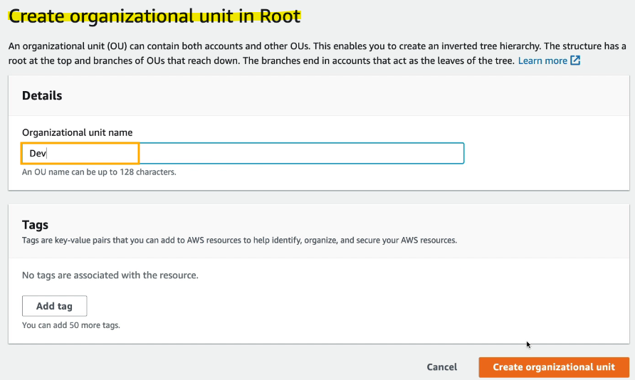
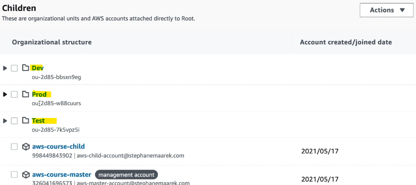
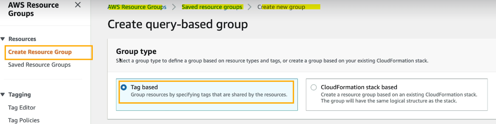
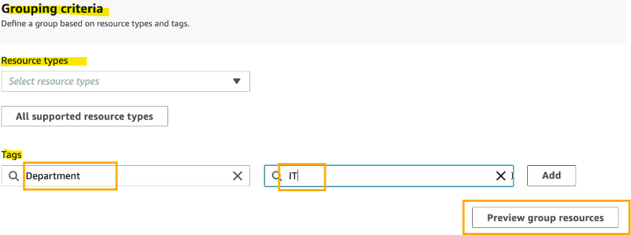
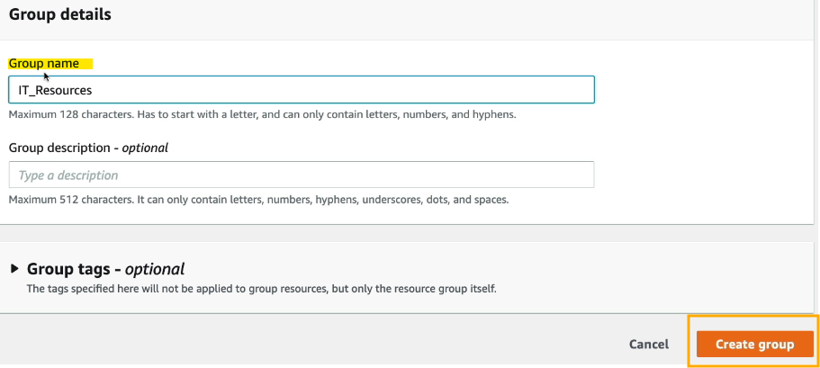

- [Account Management, Billing \& Support](#account-management-billing--support)
  - [Orginisations](#orginisations)
    - [Introduction to AWS Organizations](#introduction-to-aws-organizations)
    - [Cost Benefits](#cost-benefits)
    - [Automation and Control](#automation-and-control)
    - [Multi-Account Strategy](#multi-account-strategy)
    - [Organizational Units (OUs)](#organizational-units-ous)
    - [Service Control Policies (SCPs)](#service-control-policies-scps)
  - [Organisations Code-along](#organisations-code-along)
    - [Introduction to AWS Organizations](#introduction-to-aws-organizations-1)
    - [Creating an Organization](#creating-an-organization)
    - [Organizing Accounts with Organizational Units (OUs)](#organizing-accounts-with-organizational-units-ous)
    - [Enabling and Using Service Control Policies (SCPs)](#enabling-and-using-service-control-policies-scps)
    - [Example of Using SCPs](#example-of-using-scps)
  - [Organisations Consolidated Biling](#organisations-consolidated-biling)
    - [Introduction to Consolidated Billing](#introduction-to-consolidated-billing)
    - [Key Benefits](#key-benefits)
    - [Example of Reserved Instance Sharing](#example-of-reserved-instance-sharing)
  - [AWS Control Tower](#aws-control-tower)
    - [Introduction to AWS Control Tower](#introduction-to-aws-control-tower)
    - [Key Benefits](#key-benefits-1)
  - [AWS Control Tower Code-along](#aws-control-tower-code-along)
    - [Introduction to AWS Control Tower](#introduction-to-aws-control-tower-1)
    - [Setting Up Control Tower](#setting-up-control-tower)
      - [Create a Landing Zone](#create-a-landing-zone)
      - [Organizational Units (OUs)](#organizational-units-ous-1)
      - [Create Specific Accounts](#create-specific-accounts)
      - [Additional Configurations](#additional-configurations)
      - [Review and Set Up](#review-and-set-up)
    - [Post-Setup Overview](#post-setup-overview)
      - [Landing Zone Components](#landing-zone-components)
      - [Managing Accounts](#managing-accounts)
      - [Single Sign-On (SSO)](#single-sign-on-sso)
  - [AWS Resource Access Manager (AWS RAM)](#aws-resource-access-manager-aws-ram)
    - [Introduction to AWS Resource Access Manager (AWS RAM)](#introduction-to-aws-resource-access-manager-aws-ram)
    - [Supported Resources](#supported-resources)
    - [How AWS RAM Works](#how-aws-ram-works)
    - [Benefits of AWS RAM](#benefits-of-aws-ram)
  - [AWS Service Catalog](#aws-service-catalog)
    - [Introduction to AWS Service Catalog](#introduction-to-aws-service-catalog)
    - [Service Catalog Diagram](#service-catalog-diagram)
    - [Key Benefits](#key-benefits-2)
    - [Example Use Case](#example-use-case)
  - [Pricing Models of the Cloud](#pricing-models-of-the-cloud)
    - [Introduction to AWS Pricing Models](#introduction-to-aws-pricing-models)
    - [AWS Pricing Models](#aws-pricing-models)
      - [Pay As You Go](#pay-as-you-go)
      - [Save When You Reserve](#save-when-you-reserve)
      - [Pay Less by Using More](#pay-less-by-using-more)
      - [Free Tier](#free-tier)
    - [Deep Dive into Service Pricing](#deep-dive-into-service-pricing)
      - [EC2 Pricing](#ec2-pricing)
      - [Lambda and ECS Pricing](#lambda-and-ecs-pricing)
      - [S3 Pricing](#s3-pricing)
      - [EFS and EBS Pricing](#efs-and-ebs-pricing)
      - [RDS Pricing](#rds-pricing)
      - [CloudFront Pricing](#cloudfront-pricing)
      - [Networking Costs](#networking-costs)
  - [Savings Plan](#savings-plan)
    - [Introduction to AWS Savings Plans](#introduction-to-aws-savings-plans)
    - [Types of Savings Plans](#types-of-savings-plans)
      - [EC2 Savings Plan](#ec2-savings-plan)
      - [Compute Savings Plan](#compute-savings-plan)
      - [Machine Learning Savings Plan](#machine-learning-savings-plan)
    - [Setting Up a Savings Plan](#setting-up-a-savings-plan)
  - [Compute Optimiser](#compute-optimiser)
    - [Introduction to AWS Compute Optimizer](#introduction-to-aws-compute-optimizer)
    - [How AWS Compute Optimizer Works](#how-aws-compute-optimizer-works)
    - [Supported Resources](#supported-resources-1)
    - [Benefits](#benefits)
  - [Billing and Costing Tools](#billing-and-costing-tools)
    - [Introduction to AWS Billing and Costing Tools](#introduction-to-aws-billing-and-costing-tools)
    - [Estimating Costs](#estimating-costs)
    - [Tracking Costs](#tracking-costs)
    - [Monitoring Costs](#monitoring-costs)
  - [Estimating Costs in the Cloud - Pricing Calculator](#estimating-costs-in-the-cloud---pricing-calculator)
    - [Introduction to AWS Pricing Calculator](#introduction-to-aws-pricing-calculator)
    - [How to Use the AWS Pricing Calculator](#how-to-use-the-aws-pricing-calculator)
    - [Benefits of AWS Pricing Calculator](#benefits-of-aws-pricing-calculator)
  - [Tracking Costs in the Cloud - Billing Alarms \& AWS Budgets](#tracking-costs-in-the-cloud---billing-alarms--aws-budgets)
    - [Introduction to Tracking AWS Costs](#introduction-to-tracking-aws-costs)
    - [Billing Dashboard](#billing-dashboard)
      - [Accessing the Billing Dashboard](#accessing-the-billing-dashboard)
    - [Cost Allocation Tags](#cost-allocation-tags)
      - [Using Tags](#using-tags)
    - [Cost and Usage Reports](#cost-and-usage-reports)
      - [It may look like this:](#it-may-look-like-this)
    - [Cost Explorer](#cost-explorer)
      - [Monthly Cost by AWS Servive Example](#monthly-cost-by-aws-servive-example)
      - [Hourly \& Resource Level Example](#hourly--resource-level-example)
      - [Using Cost Explorer](#using-cost-explorer)
    - [Data Exports](#data-exports)
      - [Create Export](#create-export)
  - [Monitoring Costs in the Cloud - Billing Alarms \& AWS Budgets](#monitoring-costs-in-the-cloud---billing-alarms--aws-budgets)
    - [Introduction to Monitoring AWS Billing](#introduction-to-monitoring-aws-billing)
    - [Billing Metrics and Alarms](#billing-metrics-and-alarms)
    - [AWS Budgets](#aws-budgets)
      - [Types of Budgets](#types-of-budgets)
      - [Creating a Budget](#creating-a-budget)
  - [AWS Cost Anomaly Detection](#aws-cost-anomaly-detection)
    - [Introduction to AWS Cost Anomaly Detection](#introduction-to-aws-cost-anomaly-detection)
    - [How AWS Cost Anomaly Detection Works](#how-aws-cost-anomaly-detection-works)
    - [Benefits of AWS Cost Anomaly Detection](#benefits-of-aws-cost-anomaly-detection)
  - [AWS Service Quotas](#aws-service-quotas)
    - [Introduction to AWS Service Quotas](#introduction-to-aws-service-quotas)
    - [How AWS Service Quotas Work](#how-aws-service-quotas-work)
      - [Creating CloudWatch Alarms](#creating-cloudwatch-alarms)
      - [Requesting Quota Increases](#requesting-quota-increases)
    - [Benefits of AWS Service Quotas](#benefits-of-aws-service-quotas)
  - [AWS Trusted Advisor](#aws-trusted-advisor)
    - [Introduction to AWS Trusted Advisor](#introduction-to-aws-trusted-advisor)
    - [How AWS Trusted Advisor Works](#how-aws-trusted-advisor-works)
    - [Using AWS Trusted Advisor](#using-aws-trusted-advisor)
    - [Benefits of AWS Trusted Advisor](#benefits-of-aws-trusted-advisor)
  - [Support Plans for AWS](#support-plans-for-aws)
    - [Introduction to AWS Support Plans](#introduction-to-aws-support-plans)
    - [AWS Support Plans](#aws-support-plans)
      - [Basic Support Plan](#basic-support-plan)
      - [Developer Support Plan](#developer-support-plan)
      - [Business Support Plan](#business-support-plan)
      - [Enterprise On-Ramp Support Plan](#enterprise-on-ramp-support-plan)
      - [Enterprise Support Plan](#enterprise-support-plan)
  - [Billing and Costing Tools Summary](#billing-and-costing-tools-summary)
- [Quiz](#quiz)
  - [Account Management, Billing \& Support Quiz](#account-management-billing--support-quiz)
  - [Pricing Quiz](#pricing-quiz)

 

 

# Account Management, Billing & Support
Source: https://aws.amazon.com/organizations/

## Orginisations

 

### Introduction to AWS Organizations
* AWS Organizations is a global service that allows you to manage multiple AWS accounts.
* `Key Feature`: The main account is called the Master Account, and all other accounts are called Child Accounts.

### Cost Benefits
* `Consolidated Billing`: All accounts are paid by the Master Account, resulting in one consolidated bill.
* `Pricing Benefits`: Aggregated usage across accounts leads to discounts on services like EC2 and S3.
* `Reserved Instances Sharing`: Reserved Instances are shared across accounts to maximize cost savings.

### Automation and Control
* `API for Account Creation`: Automate AWS account creation programmatically.
* `Service Control Policies` (SCPs): Restrict account privileges by whitelisting or blacklisting IAM actions at the OU or Account Level.

### Multi-Account Strategy
* `Account Organization`: Create accounts per department, cost center, environment (dev/test/prod), or regulatory restrictions.
* `Tagging Standards`: Use tagging standards across accounts for billing purposes.
* `Centralised Logging`: Enable CloudTrail and CloudWatch Logs on all accounts and send logs to a central S3 account.

### Organizational Units (OUs)
Source: https://aws.amazon.com/controltower/

* Organise accounts by Business Units, Environment, or Projects.
* Example: The Root OU contains the Master Account and other OUs like Dev OU, Prod OU, Finance OU, and HR OU.

 

### Service Control Policies (SCPs)
Source: https://docs.aws.amazon.com/organizations/latest/userguide/orgs_manage_policies_scps_examples.html

* Whitelist or blacklist IAM actions at the OU or Account Level.
* `Application`: Applied to Users and Roles of the Account, including Root, but not to the Master Account.
* `Use Cases`: Restrict access to certain services (e.g., disabling EMR in production accounts) or enforce compliance (e.g., PCI Compliance).

 

 

## Organisations Code-along
Source: https://aws.amazon.com/organizations/

### Introduction to AWS Organizations
* AWS Organizations is a global service that allows you to manage multiple AWS accounts.
* `Key Feature`: Create an organization to manage accounts, with a Master Account and Child Accounts.

### Creating an Organization
* Set up separate AWS accounts for practice.

* From the Master Account, create an organization.

* Add Child Accounts to the organization by inviting existing accounts or creating new ones.
* Send the invitation to the **Child Account**.

Add accounts:
1. **Create** a new account by specifying the account name, email address of the account owner, and an IAM role.
2. **Invite** an existing AWS account by providing the email address or account ID of the account to invite.

 

### Organizing Accounts with Organizational Units (OUs)
1. Organise accounts into OUs (e.g., Dev, Test, Prod).

2. Create nested OUs within main OUs (e.g., Finance, HR within Prod).
  * Click on "Prod" > "Actions > Create new.
  * You can do this for each of the examples.

* Now you can see the organisational structure. 

3. Move Child Accounts into appropriate OUs.
   * Select the account from the organisational structure > Actions > Move.

* Select where you want to move it to.

 

### Enabling and Using Service Control Policies (SCPs)
1. `Enable SCPs`: Enable Service Control Policies in the Policies section.
   * AWS accounts > Policies.

 

2. `Create SCPs`: Define policies to restrict actions (e.g., DenyAccess to S3).

* In the "[]", we will put "*". 
* Click on "Create policy".
* Now under "Prod" > Policies we can see what we've created:

* If you go into Children > Finance > Policies.

* This is because I've enabled service control policies after creating the OUs.

 

3. `Attach SCPs`: Attach SCPs to OUs or specific accounts to enforce restrictions.

 

### Example of Using SCPs
* `Create SCP`: Define a policy to deny all actions on S3.
* `Attach SCP`: Attach the policy to the Finance OU.
* `Verify`: Check that the Child Account in the Finance OU cannot access S3.

 

 

## Organisations Consolidated Biling

### Introduction to Consolidated Billing
* Consolidated Billing in AWS Organizations allows you to **combine** the **usage** of **multiple AWS accounts** to maximise **cost savings** and **simplify billing** (one bill in total).

### Key Benefits
`Combined Usage`:
* Volume Pricing: Combine usage across accounts to benefit from volume discounts. For example, if each account uses 1 TB of data and you have six accounts, the total usage of 6 TB will qualify for a discount.
* Reserved Instances and Savings Plans: Share Reserved Instances or Savings Plan discounts across all accounts to maximize savings.

`One Bill`:
* Simplified Billing: Receive a single bill for all accounts in the organization, making it easier for the accounting department to manage expenses.

### Example of Reserved Instance Sharing
`Scenario`: An organization with two accounts (Account A and Account B).
* Account A: No Reserved Instances.
* Account B: Five Reserved EC2 Instances.
* Total EC2 Instances: Nine (three in Account B and six in Account A).

`Outcome`:
* The three EC2 instances in Account B are covered by the Reserved Instances.
* Two of the six EC2 instances in Account A also benefit from the Reserved Instances pricing due to sharing.
* `Result`: Five Reserved Instances and four non-Reserved Instances, leading to cost savings.

 

 

 

## AWS Control Tower
Source: https://aws.amazon.com/controltower/

### Introduction to AWS Control Tower
* AWS Control Tower provides an easy way to set up and govern a secure and compliant multi-account AWS environment based on best practices.
* Key Feature: Automates the setup and ongoing management of your AWS environment.

### Key Benefits
`Automated Setup`:
* **Few Clicks**: Set up your multi-account AWS environment quickly and easily.
* **Best Practices**: Ensures your environment is secure and compliant with AWS best practices.

`Policy Management`:
* **Guardrails**: Automate ongoing policy management using guardrails.
* **Policy Violations**: Detect and remediate policy violations.

`Compliance Monitoring`:
* **Interactive Dashboard**: Monitor your compliance through an interactive dashboard.

`Integration with AWS Organizations`:
* **Automatic Setup**: Control Tower runs on top of AWS Organizations, automatically setting up organizations for you.
* **Service Control Policies** (SCPs): Implements SCPs to ensure guardrails are operating effectively.

 

 

## AWS Control Tower Code-along
Source: https://aws.amazon.com/controltower/

### Introduction to AWS Control Tower
* AWS Control Tower provides an easy way to **set up** and **govern** a **secure** and **compliant** **multi-account AWS environment** based on best practices.
* `Key Feature`: Automates the setup and ongoing management of your AWS environment.

### Setting Up Control Tower
#### Create a Landing Zone
* Select the **home region** for Control Tower.
* Optionally, enable the region deny setting to restrict access to certain regions.
* Select additional regions to be monitored for governance purposes.

#### Organizational Units (OUs)
* `Security OU`: Created for log archive accounts and security audit accounts.
* `Sandbox OU`: Created for other accounts. More OUs can be created after setting up the landing zone.

#### Create Specific Accounts
* **Log Archive Account**: Enter an email (e.g., stephane+archive@example.com).
* **Audit Account**: Enter an email (e.g., stephane+audit@example.com).

#### Additional Configurations
* `AWS Account Access Configuration`: Use IAM Identity Center for account access.
* `Enable CloudTrail`: Enable CloudTrail for the entire landing zone.
* `Optional Settings`: Configure optional settings like sending logs to Amazon S3 and KMS encryption.

#### Review and Set Up
* Ensure all settings are correct.
* Click on "Setup Landing Zone" to start the setup process. 
  * This can take about 60 minutes.

 

### Post-Setup Overview
#### Landing Zone Components
* **Organizational Units**: Two OUs (Security and Sandbox) created.
* **Shared Accounts**: Three shared accounts (management, log archive, and audit).
* **Guardrails**: 20 preventive guardrails and two detective guardrails set up to enforce policies and detect violations.

#### Managing Accounts
* **Organizations**: View and manage accounts through Control Tower, not directly through AWS Organizations.
* **Dashboard**: Monitor compliance, non-compliant resources, and guardrails through the interactive dashboard.

#### Single Sign-On (SSO)
* **SSO Portal**: Access the SSO portal to log into any of the AWS accounts.
* **User Management**: Manage user access through the SSO service provided by AWS.

 

 

## AWS Resource Access Manager (AWS RAM)
Source: https://aws.amazon.com/ram/

### Introduction to AWS Resource Access Manager (AWS RAM)
* AWS RAM allows you to **share resources** owned by your AWS accounts **with other AWS accounts**, either within **your** **organisation** or with **external accounts**.
* `Key Feature`: Avoids resource duplication by enabling resource sharing.

### Supported Resources
Examples: Aurora databases, VPC Subnets, Transit Gateway, and more.

> Note: You don't need to remember all supported resources, just the concept of resource sharing.

### How AWS RAM Works
* `Scenario`: You have a cloud account with a VPC and private subnets.
* `Resource Sharing`: Share the VPC with other accounts (e.g., Account 1 and Account 2).
* `Access`: Accounts 1 and 2 can access the same VPC and subnets.

### Benefits of AWS RAM
* `Simplified Deployments`: Resources within the shared VPC can connect with each other from a network perspective.

Example:
* Account 1 creates EC2 instances and a load balancer within the shared VPC.
* Account 2's EC2 instances can access an Amazon RDS database or application load balancer within the same VPC.

 

 

 

## AWS Service Catalog
Source: https://aws.amazon.com/servicecatalog/

### Introduction to AWS Service Catalog
* AWS Service Catalog allows organizations to **create** and **manage** **catalogs** of **IT services** that are approved for use on AWS.
* `Key Feature`: Provides a self-service portal for users to launch authorized products predefined by admins.

 

### Service Catalog Diagram

 

### Key Benefits
`Controlled Access`:
* **Predefined Products**: Admins create products using CloudFormation templates with proper parameters.
* **Portfolios**: Products are grouped into portfolios, and access is defined for users.

`Self-Service Portal`:
* **User Access**: Users log in to the Service Catalog portal and see a list of products they are authorized to use.
* **Automated Provisioning**: Users can launch products, which are automatically provisioned by CloudFormation, ensuring proper configuration and tagging.

### Example Use Case
* `Scenario`: A user needs access to an RDS database but doesn't know how to create one properly.
* `Solution`: The admin offers the RDS database as a service within the Service Catalog.
* `Outcome`: The user can quickly and easily launch the RDS database, knowing it is configured according to organizational standards.

 

 

## Pricing Models of the Cloud
Source: https://aws.amazon.com/pricing/?aws-products-pricing.sort-by=item.additionalFields.productNameLowercase&aws-products-pricing.sort-order=asc&awsf.Free%20Tier%20Type=*all&awsf.tech-category=*all

### Introduction to AWS Pricing Models
* AWS offers various pricing models to help you manage costs effectively.
* `Key Feature`: Flexibility to choose the best pricing model based on your usage and requirements.

### AWS Pricing Models
#### Pay As You Go
* Pay for what you use.
* **Benefits**: Remain agile, responsive, and scale to meet demands.

#### Save When You Reserve
* Minimise risk and get a predictable budget by reserving instances.
  * **Examples**: Instance reservations for EC2, DynamoDB, ElastiCache, RDS, and Redshift.

#### Pay Less by Using More
* Get volume-based discounts.
  * **Examples**: Discounts on Amazon S3 as usage increases.

#### Free Tier
* Some services are free, and others are part of the free tier.
* **Examples**: IAM, VPC, and consolidated billing are free. Elastic Beanstalk, CloudFormation, and ASG are free, but you pay for the resources they create.

### Deep Dive into Service Pricing
#### EC2 Pricing
* `On-Demand`: Pay for what you use with a minimum billing time of 60 seconds.
* `Reserved Instances`: Up to 75% discount for one or three-year commitments.
* `Spot Instances`: Up to 90% discount by bidding for unused capacity.
* `Dedicated Host`: Run EC2 instances on dedicated hosts.
* `Savings Plan`: An alternative to the above options, offering flexible pricing.

#### Lambda and ECS Pricing
* `Lambda`: Pay per API call and duration of the function.
* `ECS`: No fees for using ECS, but pay for underlying EC2 instances. For Fargate, pay for CPU and memory assigned to containers.

#### S3 Pricing
* `Storage Classes`: S3 Standard, S3 Infrequent Access, S3 One-Zone IA, S3 Intelligent Tiering, Glacier, and Glacier Deep Archive.
* `Costs`: Pay for the number and size of objects, requests, data transfer out, and lifecycle transitions.

#### EFS and EBS Pricing
* `EFS`: Pay per use with an infrequent access tier and lifecycle rules.
* `EBS`: Pay based on volume type, size, IOPS, snapshots, and data transfer out.

#### RDS Pricing
* `Billing`: Per hour billing based on engine type, size, and memory class.
* `Purchase Types`: On-Demand or Reserved for one or three years.
* `Additional Costs`: Backups, storage, input/output requests, deployment type (Single AZ or Multi AZ), and data transfer out.

#### CloudFront Pricing
* `Global CDN`: Pricing varies based on the region where content is served.
* `Costs`: Data transfer out and the number of requests.

 

#### Networking Costs
* `Inbound Traffic`: Free.
* `Outbound Traffic`: Paid and tiered based on volume. 
* `Same AZ Traffic`: Free using private IP.
* `Inter-Region Traffic`: 2 cents per GB.

Different AZ Traffic:
* `Public IP`: 2 cents per GB.
* `Private IP`: 1 cent per GB.

 

 

 

## Savings Plan
Source: https://aws.amazon.com/savingsplans/

### Introduction to AWS Savings Plans
* AWS Savings Plans offer a **flexible way** to **save** on your AWS costs by **committing to a specific dollar amount per hour** for one or three years.
* `Key Feature`: Simplifies cost management by focusing on dollar commitments rather than specific resources.

### Types of Savings Plans
#### EC2 Savings Plan
* `Discount`: Up to 72% compared to On-Demand prices.
* `Commitment`: Usage of individual instance families in a region (e.g., C5 instances).
* `Flexibility`: Applies regardless of AZ, size, OS, or tenancy.
* `Payment Options`: All upfront, partial upfront, or no upfront.

#### Compute Savings Plan
* `Discount`: Up to 66% compared to On-Demand prices.
* `Flexibility`: Applies regardless of instance family, region, size, OS, tenancy, and compute option (EC2, Fargate, Lambda).
* `Most Flexible`: Commit to a dollar amount per hour without worrying about specific resources.

#### Machine Learning Savings Plan
* `Applicable Services`: Services like SageMaker.
* `Flexibility`: Similar to Compute Savings Plan, but focused on machine learning services.

### Setting Up a Savings Plan
`Access AWS Cost Explorer`:
* Go to the AWS **Cost Explorer** console.
* AWS will suggest the right Savings Plan based on your current infrastructure.

`Estimate Pricing`:
* Use the AWS **Savings Plan** website to estimate pricing.
* Navigate through options for EC2, Fargate, Lambda, and SageMaker.

`Purchase a Savings Plan`:
* **Choose Plan Type**: Select Compute, EC2 Instance, or SageMaker Savings Plan.
* **Set Term Commitment**: Choose a one or three-year term.
* **Set Purchase Commitment**: Decide on an hourly cost commitment.
* **Select Payment Option**: Choose all upfront, partial upfront, or no upfront.
* **Review Costs**: Check the upfront cost, monthly payment, and total cost.
* **Add to Cart**: Finalize your purchase.

 

 

## Compute Optimiser
Source: https://aws.amazon.com/compute-optimizer/

### Introduction to AWS Compute Optimizer
* AWS Compute Optimizer helps **reduce costs** and **improve performance** by recommending **optimal AWS resources** for your workloads.
* `Key Feature`: Uses machine learning to analyze resource configurations and utilisation.

### How AWS Compute Optimizer Works
`Analysis`:
* Analyses your EC2 instances, auto scaling groups, EBS volumes, and Lambda functions.
* Identifies over-provisioned or under-provisioned resources.

`Optimisation`:
* Provides recommendations to optimize resource usage.
* Helps achieve better cost efficiency and performance.

`Machine Learning`:
* Utilises machine learning to analyze resource configurations.
* Tracks CloudWatch metrics to understand resource utilization.

 

### Supported Resources
* EC2 Instances
* Auto Scaling Groups
* EBS Volumes
* Lambda Functions

### Benefits
* `Cost Savings`: Lower your costs by up to 25% without significant effort.
* `Performance Improvement`: Enhance the performance of your workloads.
* `Export Recommendations`: Export recommendations to Amazon S3 for further analysis.

 

 

## Billing and Costing Tools
Source: https://aws.amazon.com/aws-cost-management/

### Introduction to AWS Billing and Costing Tools
* AWS provides various tools to help you estimate, track, and monitor costs in the cloud.
* `Key Feature`: Essential for managing and optimizing your AWS expenses.

### Estimating Costs
Source: https://calculator.aws/#/

`AWS Pricing Calculator`:
* Description: A tool to estimate the cost of AWS services.
* Usage: Helps you plan and budget for your AWS usage.

### Tracking Costs
`Billing Dashboard`:
* Description: Provides an overview of your AWS spending.
* Usage: Helps you keep track of your expenses in real-time.

 

`Cost Allocation Tags`:
* Description: Tags that help you categorize and track your AWS costs.
* Usage: Useful for identifying and managing costs by project, department, or other criteria.

`Cost and Usage Report`:
* Description: A detailed report of your AWS usage and costs.
* Usage: Provides insights into your spending patterns and helps you identify cost-saving opportunities.

`Cost Explorer`:
* Description: A tool to visualize and analyze your AWS costs and usage.
* Usage: Helps you understand your spending trends and make informed decisions.

### Monitoring Costs
`Billing Alarms`:
* Description: Alarms that notify you when your AWS spending exceeds a certain threshold.
* Usage: Helps you stay within your budget and avoid unexpected charges.

`Budgets`:
* Description: A tool to set custom cost and usage budgets.
* Usage: Allows you to monitor your spending and receive alerts when you approach or exceed your budget.

 

 

## Estimating Costs in the Cloud - Pricing Calculator

### Introduction to AWS Pricing Calculator
* The AWS Pricing Calculator helps you estimate the cost of your designated solution architecture in the cloud.
* `Key Feature`: Provides a detailed cost estimate for various AWS services.

### How to Use the AWS Pricing Calculator
`Access the Calculator`:
* Visit the AWS Pricing Calculator website.

`Create an Estimate`:

`Select Services`:
* Choose the AWS services you plan to use. For example, select EC2 instances.

`Configure Services`:
* **Select Region**: Choose the region where your resources will be deployed.
* **Instance Configuration**: For EC2, select the instance type (e.g., T4g.xlarge) and specify the number of instances (e.g., four instances).
* **Utilisation**: Estimate the utilization percentage (e.g., 80% per month).

`Pricing Strategy`:
* **Savings Plans**: Choose a pricing strategy, such as EC2 instance saving plans for one year with no upfront payments.

`Add Storage`:
* **Elastic Block Storage** (EBS): Specify the amount of storage needed (e.g., 200 GB per instance).

`Add to Estimate`:
* Click on "Add to Estimate" to include the configured service in your cost estimate.

`Additional Services`:
* **Load Balancer**: Add a load balancer by selecting Elastic Load Balancing and configuring it (e.g., one application load balancer, 5 GB per hour processed, five connections per second).

`Review Total Cost`:
* The calculator will provide the total 12-month cost of your architecture (e.g., $4,500).

### Benefits of AWS Pricing Calculator
* `Granular Estimates`: Allows you to create detailed cost estimates for various services.
* `Customisable`: You can create groups, add support, and customize your estimate based on your needs.

 

 

## Tracking Costs in the Cloud - Billing Alarms & AWS Budgets
Source: https://aws.amazon.com/aws-cost-management/

### Introduction to Tracking AWS Costs
* AWS provides various tools to help you **track** and **manage** your **costs** in the cloud.
* `Key Feature`: Essential for understanding and optimizing your AWS expenses.

### Billing Dashboard
* Provides a high-level view of your **costs for the month**, including **forecast** and** month-to-date expenses**.
* **Usage**: Helps you get an overview of your spending and access the AWS free tier dashboard.

 

#### Accessing the Billing Dashboard
1. Click on the top right and select "Billing and Cost Management" or use the search bar and type "billing".
2. View the cost breakdown by **month**, **month-to-date** cost, last month's cost, and **total** forecasted cost.

3. Group costs by service, account, region, etc., to drill down into details.

 

`Free Tier Dashboard`:
* Shows the usage for each **free tier** based on your activities for the month.
* **Usage**: Helps you monitor your free tier usage and ensure you stay within limits.

 

### Cost Allocation Tags
* Allows you to track costs at a **detailed level** and **group** them together.
* **Usage**: Helps categorize and manage costs by project, department, or other criteria.

 

`Types of Tags`:
* **AWS Generated Tags**: Automatically applied to resources (e.g., aws:createdBy).
* **User-Defined Tags**: Defined by the user (e.g., user:department).

 

#### Using Tags
1. Go to the search bar and type "resource groups".
2. Use the **Tag Editor** to manage tags for your resources.

 

3. Create resource groups based on tags (e.g., IT Resources).

 

4. Activate cost allocation tags and generate reports for specific tags.

 

### Cost and Usage Reports
* Provides detailed information about your **AWS usage** and **costs**.
* **Usage**: Helps you analyse your bill in detail and understand where charges are coming from.

`Features`:
* **Comprehensive Data**: Includes metadata about services, pricing, and reservations.
* **Integration**: Can be analyzed using Athena, Redshift, or QuickSight.

#### It may look like this:

 

### Cost Explorer
* A **visual tool** to **understand** and **manage** your costs and **usage** over time.
* **Usage**: Helps create custom reports and forecast usage up to 12 months.

`Features`:
* **Custom Reports**: Analyze cost and usage data at a high level.
* **Savings Plans**: Access optimal savings plans to lower your bill.
* **Forecasting**: Forecast usage and costs up to 12 months based on previous usage.

 

#### Monthly Cost by AWS Servive Example

 

#### Hourly & Resource Level Example

 

#### Using Cost Explorer
1. Go to **Cost Explorer** and view **costs over time**.
2. Analyse costs by **month**, **service**, and **other** parameters.
3. Save reports to the report library for quick access.

 

### Data Exports
* Allows you to export cost and usage reports for further analysis.
* **Usage**: Helps you use your tool of choice to analyze data or use AWS tools like Athena.

 

#### Create Export
1. Go to **data exports** and **create an exporting dashboard**.

2. Specify export **name**, **time** granularity, **columns**, and **format** (e.g., CSV, Parquet).
3. Export to an S3 bucket.

 

 

## Monitoring Costs in the Cloud - Billing Alarms & AWS Budgets
Source: https://aws.amazon.com/aws-cost-management/

### Introduction to Monitoring AWS Billing
* AWS provides tools to monitor your billing and ensure you stay within your budget.
* Key Feature: Helps you track actual costs and receive notifications when thresholds are exceeded.

### Billing Metrics and Alarms
`Billing Metrics`:
* Stored in the us-east-1 region in CloudWatch, aggregated for all your AWS regions.
* **Usage**: Provides actual cost data, not projected costs.

`Creating Billing Alarms`:
1. Access CloudWatch in the us-east-1 region.
2. Create a billing alarm on top of the billing metric.
3. Set a threshold (e.g., $70) to receive email notifications when exceeded.

### AWS Budgets
* Sends alarms when costs or forecasts exceed the budget.
* Usage: Helps manage and control AWS spending.

#### Types of Budgets
* Usage Budget: Tracks usage.
* Cost Budget: Tracks costs.
* Reservation Budget: Tracks Reserved Instances utilization.
* Savings Plan Budget: Tracks savings plans.

`Supported Services`:
* Reserved Instances: EC2, ElastiCache, RDS, Redshift.
* Notifications: Supports up to five SNS notifications per budget.

#### Creating a Budget
1. Go to the AWS `Budgets` console.

2. Choose to **create a new budget** (cost, usage, savings plan, or reservation).
3. Enter budget details (e.g., DemoBudget, monthly, $10).
4. Filter the budget scope (e.g., specific services like EC2 or Key Management Service).

5. Set budget alerts (e.g., 80% of actual or forecasted amount).

6. Add email notifications (e.g., stephane@example.com).

 

`Visualizing Budgets`:
* Graph: View thresholds and current spending on a graph.
* Cost Explorer: Drill down into costs for detailed analysis.

 

 

## AWS Cost Anomaly Detection
Source: https://aws.amazon.com/aws-cost-management/

### Introduction to AWS Cost Anomaly Detection
* AWS Cost Anomaly Detection continuously **monitors** your **cost** and **usage** data to **detect unusual spending** patterns using machine learning.
* `Key Feature`: Automatically identifies cost anomalies without needing predefined thresholds.

### How AWS Cost Anomaly Detection Works
`Machine Learning`:
* Learns your unique historical spending patterns.
* Detects one-time cost spikes and continuous cost increases.

`Monitoring`:
* Monitors AWS services, member accounts, cost allocation tags, and cost categories.
* Provides root cause analysis for detected anomalies.

`Notifications`:
* Sends anomaly detection reports.
* Notifies you via individual alerts or daily/weekly summaries using SNS.

### Benefits of AWS Cost Anomaly Detection
* `Automated Detection`: No need to define thresholds; the service automatically identifies unusual spending.
* `Root Cause Analysis`: Quickly understand the cause of cost anomalies.
* `Timely Alerts`: Receive notifications to stay informed about potential cost issues.

 

 

 

## AWS Service Quotas 

### Introduction to AWS Service Quotas
* AWS Service Quotas help you **manage** and **monitor** the **limits** (quotas) of your AWS **resources**.
* `Key Feature`: Allows you to be notified when you approach or exceed these limits.

### How AWS Service Quotas Work
`Monitoring Quotas`:
* Monitors all your quotas across AWS services.
* **Usage**: Helps you keep track of important limits in your account.

 

 

#### Creating CloudWatch Alarms
1. Access the **Service Quotas** console.
2. Create **CloudWatch Alarms** directly from the console.
3. Set alarms for specific quotas (e.g., Lambda concurrent executions).

#### Requesting Quota Increases
1. Go to the **Service Quotas** console.
2. **Request** a quota increase for the desired service.

> Optionally, shut down resources if you determine there are too many running.

 

### Benefits of AWS Service Quotas
* `Alerting`: Receive notifications when you approach or exceed your quotas.
* `Quota Management`: Easily request increases to your quotas.
* `Resource Management`: Decide whether to shut down unnecessary resources to stay within limits.

 

 

## AWS Trusted Advisor
Source: https://aws.amazon.com/premiumsupport/technology/trusted-advisor/

### Introduction to AWS Trusted Advisor
* AWS Trusted Advisor provides a high-level **account assessment** and **advises** on **best practices**.
* `Key Feature`: Checks various aspects of your AWS account and provides recommendations.

### How AWS Trusted Advisor Works
`Checks and Recommendations`:
* **Examples**: Checks for EBS Public Snapshots, RDS Public Snapshots, and root account usage.
* **Categories**: Cost optimization, performance, security, fault tolerance, service limits, and operational excellence.

`Core and Full Sets of Checks`:
* **Core Checks**: Available to all users.
* **Full Checks**: Available with a business or enterprise support plan.
* **Programmatic Access**: Available through the AWS Support API with a business or enterprise support plan.

 

### Using AWS Trusted Advisor
1. Go to the **AWS Trusted Advisor** console.

2. View **recommendations** and **investigations**.

 

`Recommendation Categories`:
* **Cost Optimization**: Requires a support plan for full access.
* **Performance**: Requires a support plan for full access.
* **Fault Tolerance**: Requires a support plan for full access.
* **Operational Excellence**: Requires a support plan for full access.
* **Security**: Core checks available (e.g., Bucket Permissions, Security Group ports, EBS Public Snapshot, RDS Public Snapshot).
* **Service Limits**: View limits for Auto Scaling Groups, CloudFormation Stacks, DynamoDB Read and Write Capacity, etc.

### Benefits of AWS Trusted Advisor
* `High-Level Assessment`: Provides a comprehensive overview of your AWS account.
* `Actionable Recommendations`: Helps you optimize costs, improve performance, enhance security, and ensure fault tolerance.
* `Support Plan Access`: Full set of checks and programmatic access available with a business or enterprise support plan.

 

 

## Support Plans for AWS
Source: https://aws.amazon.com/premiumsupport/plans/

### Introduction to AWS Support Plans
* AWS offers different support plans to cater to various needs and budgets.
* `Key Feature`: Each plan provides different levels of support and access to AWS resources.

### AWS Support Plans
#### Basic Support Plan
* Cost: Free.

`Features`:
* 24/7 access to customer service, documentation, white papers, and support forums.
* Access to seven core Trusted Advisor checks.
* Personal Health Dashboard for personalized service health alerts.

 

#### Developer Support Plan
* Cost: Paid.

`Features`:
* Everything from the Basic plan.
* Business hours email access to Cloud Support Associates.
* Unlimited cases and contacts.

`Response times`:
* General guidance: within 24 business hours.
* System impaired: within 12 business hours.

#### Business Support Plan
* Cost: Paid.

`Features`:
* Everything from the Developer plan.
* Full set of Trusted Advisor checks and API access.
* 24/7 phone, email, and chat access to Cloud Support Engineers.
* Access to infrastructure event management (additional fee).

`Response times`:
* General guidance: within 24 business hours.
* System impaired: within 12 business hours.
* Production system impaired: less than 4 hours.
* Production system down: less than 1 hour.

#### Enterprise On-Ramp Support Plan
* Cost: Paid.

`Features`:
* Everything from the Business plan.
* Access to a pool of Technical Account Managers.
* Concierge support team for billing and account best practices.
* Operations reviews (infrastructure event management, well-architected reviews).

`Response times`:
* General guidance: within 24 business hours.
* System impaired: within 12 business hours.
* Production system impaired: less than 4 hours.
* Production system down: less than 1 hour.
* Business critical system down: less than 30 minutes.

#### Enterprise Support Plan
* Cost: Paid.

`Features`:
* Everything from the Enterprise On-Ramp plan.
* Designated Technical Account Manager.
* Access to AWS Incident Detection and Response (additional fee).

`Response times`:
* General guidance: within 24 business hours.
* System impaired: within 12 business hours.
* Production system impaired: less than 4 hours.
* Production system down: less than 1 hour.
* Business critical system down: less than 15 minutes.

 

 

## Billing and Costing Tools Summary
* `Compute Optimizer`: recommends resources’ configurations to reduce cost.
* `Pricing Calculator`: cost of services on AWS.
* `Billing Dashboard`: high level overview + free tier dashboard.
* `Cost Allocation Tags`: tag resources to create detailed reports.
* `Cost and Usage Reports`: most comprehensive billing dataset.
* `Cost Explorer`: View current usage (detailed) and forecast usage.
* `Billing Alarms`: in us-east-1 – track overall and per-service billing.
* `Budgets`: more advanced – track usage, costs, RI, and get alerts.
* `Savings Plans`: easy way to save based on long-term usage of AWS.
* `Cost Anomaly Detection`: detect unusual spends using Machine Learning.
* `Service Quotas`: notify you when you’re close to service quota threshold.

 

 

# Quiz

## Account Management, Billing & Support Quiz

1. Which of the following allows you to centrally manage all users and roles permissions in your AWS Organization?
   * Service Control Policies (SCPs).
   * Service control policies (SCPs) are a type of organization policy that you can use to manage permissions in your organization. 
   * An SCP spans all IAM users, groups, and roles, including the AWS account root user.

2. You would like to automatically set up and govern a secure multi-account AWS environment with best practices for your organization. Which AWS tool can you use?
   * Control Tower. 
   * AWS Control Tower offers the easiest way to set up and govern a new, secure, multi-account AWS environment. 
   * It establishes a landing zone that is based on best-practices blueprints, and enables governance using guardrails you can choose from a pre-packaged list.

3. A company would like recommendations regarding its performance, security, and fault tolerance. What can it use?
   * Trusted Advisor.
   * AWS Trusted Advisor is an online tool that provides you real time guidance to help you provision your resources following AWS best practices, including performance, security, and fault tolerance, but also cost optimization and service limits.

4. Which of the following is INCORRECT regarding AWS Organizations?
   * Faster access to the AWS Support.
   * AWS Organizations does not offer faster access to the AWS Support.

5. What is the most cost-effective option to have 24x7 phone, email, and chat support?
   * Business Support Plan.
   * Business Support Plan is the most cost-effective option that offers 24x7 phone, email, and chat support.

6. What can you use to estimate the cost of your architecture solution?
   * Pricing Calculator.
   * The AWS Simple Monthly Calculator is an easy-to-use online tool that enables you to estimate their architecture solution monthly cost of AWS services for your use case based on your expected usage. 
   * It is being replaced by AWS Pricing Calculator.

7. True or false. The Enterprise Support Plan comes with a business-critical system down response under 15 minutes and offers access to a Technical Account Manager, as well as a Concierge Support Team.
   * True. 
   * The Enterprise Support Plan comes with a business-critical system down response under 15 minutes and offers access to a Technical Account Manager, as well as a Concierge Support Team. 
   * It is the only plan to have these features.

8. A company is not sure whether or not it is cost-effective to migrate to the AWS Cloud. Which service can help the executive board make a decision?
   * Pricing Calculator. 
   * AWS Pricing Calculator is a web based service that you can use to create cost estimates to suit your AWS use cases. 
   * AWS Pricing Calculator is useful both for people who have never used AWS and for those who want to reorganize or expand their usage.

9. What do Resource Groups rely on to group your resources?
    * Tags.
    * You can assign metadata to your AWS resources in the form of tags. 
    * Tags can help you manage, identify, organize, search for, and filter resources.

10. What can you use to get alerts when your costs and usage are exceeding or are forecasted to exceed your budgeting amount?
    * Budgets.
    * AWS Budgets gives you the ability to set custom budgets that alert you when your costs or usage exceed (or are forecasted to exceed) your budgeted amount. 
    * Difference with CloudWatch Billing Alarms: CloudWatch Billing Alarms only send alerts when your costs and usage are exceeding your budget, not when it is forecasted to exceed your budget, while AWS Budgets does both.

11. A company would like to choose the best Savings Plan and forecast its cost in the next 3 months. Which AWS service can help?
    * Cost Explorer.
    * Cost Explorer can be used to forecast usage up to 12 months based on the previous usage. 
    * It can also be used to choose an optimal Savings Plan. 
    * Cost Explorer has an easy-to-use interface that lets you visualize, understand, and manage your AWS costs and usage over time.

12. Which of the following options uses machine learning to recommend optimal AWS resources and therefore reduces costs?
    * Compute Optimiser.
    * AWS Compute Optimizer recommends optimal AWS resources for your workloads to reduce costs and improve performance by using machine learning to analyze historical utilization metrics.

 

## Pricing Quiz

1. Which services are free to use in AWS?
   * IAM, VPC, Consolidated Billing, and Elastic Beanstalk.
   * These services are free to use. 
   * Be careful, the resources created in Elastic Beanstalk (as well as in CloudFormation and Auto Scaling Groups) are not free.

2. True or false. CloudFront pricing is the same in every geographic region.
   * False. 
   * CloudFront pricing is different across different geographic regions.

3. When you reserve, the larger the upfront payment, the smaller the discount.
   * Flase, the larger the upfront, the bigger the discount.
   * When the upfront payment is higher, the discount is bigger.

4. Which of the following is NOT a pricing factor in S3? Storage class, data transfer into S3, objetc size, type of requests.
   * Data transfer into S3.
   * Inbound data transfer in the S3 region is free.

5. True or false. EBS Snapshots are added cost in GB per month.
   * True.
   * The added data storage by EBS Snapshots are added cost in GB per month to EBS pricing. 
   * Other EBS pricing factors are: Volume type, Provisioned storage volume, IOPS, etc.

6. Which of the following options can provide up to 66% discount compared to On-demand for a commitment to a consistent amount of usage for 1 or 3 years and offers the possibility to change EC2 instances family type? Spot instances, reserved instances, compute savings plans, EC2 instance savings plans
   * Compute savings plan.
   * Compute Savings Plans provide the most flexibility and help to reduce your costs by up to 66% in exchange for a commitment to a consistent amount of usage for a 1 or 3 year term. 
   * These plans automatically apply to EC2 instance usage regardless of instance family, size, AZ, region, OS or tenancy, and also apply to Fargate or Lambda usage.

7. You are running an on-demand Linux EC2 instance, what timing is applied regarding billing?
   * Pay per seconds.
   * With Linux EC2 instances, you pay per second of compute capacity. 
   * There is also a minimum of 60s of use.

8. Which pricing model allows you to minimize risks, predictably manage budgets, and comply with long-term requirements, and is available for EC2, DynamoDB, ElastiCache, RDS, and Redshift?
   * Save when you reserve.
   * Reservations are available for EC2 Reserved Instances, DynamoDB Reserved Capacity, ElastiCache Reserved Nodes, RDS Reserved Instance, Redshift Reserved Nodes. 
   * Reservations allow you to minimize risks, predictably manage budgets and comply with long-term requirements.

9. Which RDS pricing option is the most cost-effective if you need capacity for 3 years?
    * Reserved instances.
    * Reserved Instances are good and more cost-effective (up to 69% discount compared to On-demand pricing, depending on the upfront) for long workloads. 
    * You can reserve instances for 1 or 3 years in RDS.

 