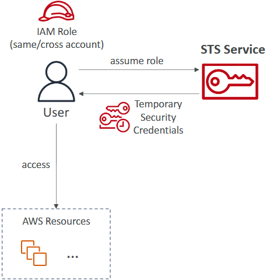
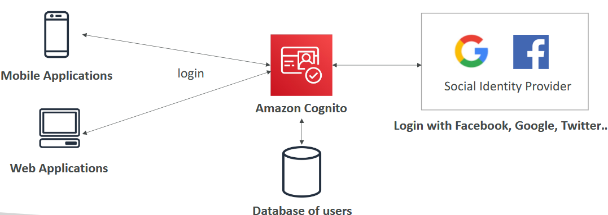
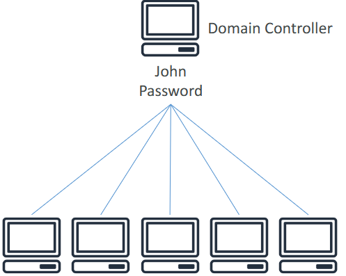
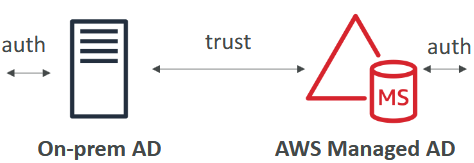
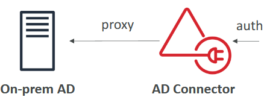
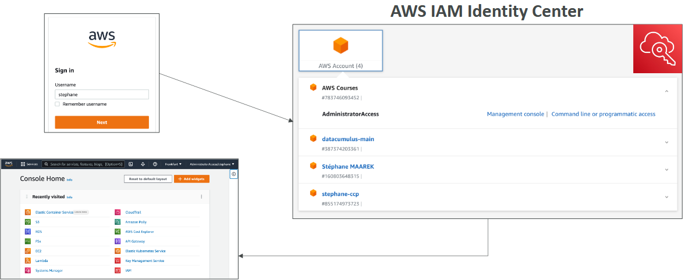

- [Advanced Identity](#advanced-identity)
  - [Security Token Service (STS)](#security-token-service-sts)
    - [Introduction to AWS STS](#introduction-to-aws-sts)
    - [How AWS STS Works](#how-aws-sts-works)
    - [Use Cases for AWS STS](#use-cases-for-aws-sts)
    - [Key Points to Remember](#key-points-to-remember)
  - [Cognito](#cognito)
    - [Introduction to Amazon Cognito](#introduction-to-amazon-cognito)
    - [How Amazon Cognito Works](#how-amazon-cognito-works)
    - [Social Login Integration](#social-login-integration)
    - [Use Cases for Amazon Cognito](#use-cases-for-amazon-cognito)
    - [Key Points to Remember](#key-points-to-remember-1)
  - [Directory Services](#directory-services)
    - [Introduction to Microsoft Active Directory (AD)](#introduction-to-microsoft-active-directory-ad)
    - [How Microsoft Active Directory Works](#how-microsoft-active-directory-works)
    - [Extending Active Directory with AWS Directory Services](#extending-active-directory-with-aws-directory-services)
      - [AWS Managed Microsoft AD](#aws-managed-microsoft-ad)
      - [AD Connector](#ad-connector)
      - [Simple AD](#simple-ad)
    - [Key Points to Remember](#key-points-to-remember-2)
  - [AWS IAM Identity Center](#aws-iam-identity-center)
    - [Introduction to AWS IAM Identity Center](#introduction-to-aws-iam-identity-center)
    - [How AWS IAM Identity Center Works](#how-aws-iam-identity-center-works)
    - [Use Cases for AWS IAM Identity Center](#use-cases-for-aws-iam-identity-center)
    - [Key Points to Remember](#key-points-to-remember-3)
  - [Advanced Identity Summary](#advanced-identity-summary)
- [Quiz](#quiz)

 

 

# Advanced Identity

## Security Token Service (STS)

### Introduction to AWS STS
* AWS STS (Security Token Service) is a service that allows you to create temporary, limited-privilege credentials to access your AWS resources.
* `Key Feature`: These credentials are short-term and can be configured with an expiration period.

### How AWS STS Works
* `Temporary Credentials`: Similar to your access key and secret access key, but with a configurable expiration period.
* `Assuming Roles`: Users can assume roles using an STS API call, which communicates with the STS service.
* `Credentials Received`: The API call results in receiving temporary security credentials, including an access key, a secret key, and a session key, all limited in time.

 

 

### Use Cases for AWS STS
* `Identity Federation`: Manage identities in external systems and provide them with STS tokens to access AWS resources.
* `IAM Roles`: Access for cross-account or same-account access using IAM roles.
* `EC2 Instances`: Automatically refresh EC2 credentials using a script that leverages the security token service.

### Key Points to Remember
* `Temporary Credentials`: Useful for creating temporary, limited-privilege credentials.
* `Multiple Use Cases`: Identity federation, IAM roles, and EC2 instance credential refresh.
* `Behind the Scenes`: Often used without users being aware, especially in automated processes.

 

 

## Cognito

### Introduction to Amazon Cognito
* Amazon Cognito provides **identity management** for your web and mobile application users.
* `Key Feature`: It allows you to **create users** for your apps without using IAM users, which are meant for internal company use.

### How Amazon Cognito Works
* `User Database`: Cognito maintains its own internal database of users, potentially handling millions of users.
* `Integrated Login`: Your mobile and web applications can integrate login functionality with Amazon Cognito.

 

 

### Social Login Integration
* `Third-Party Logins`: Cognito supports login with social identity providers like Facebook, Google, and Twitter. Users can click a button to be redirected to these providers for authentication.

### Use Cases for Amazon Cognito
* `Web and Mobile Applications`: Ideal for managing user identities in web and mobile applications.
* `User Management`: Provides a way to manage users on AWS without creating IAM users for each application user.

### Key Points to Remember
* `Identity Management`: Simplifies user identity management for web and mobile apps.
* `Social Logins`: Supports integration with social identity providers.
* `Scalability`: Can handle millions of users efficiently.

 

 

## Directory Services

### Introduction to Microsoft Active Directory (AD)
* Microsoft Active Directory (AD) is a **database of objects** such as user accounts, computers, printers, file shares, and security groups.
* `Key Feature`: Provides centralized security management, allowing you to create accounts and assign permissions.

### How Microsoft Active Directory Works
* `Domain Controller`: A server that manages user authentication and permissions within a network.
* `User Authentication`: Allows users to log in to any machine connected to the Domain Controller using their username and password.

 

 

### Extending Active Directory with AWS Directory Services
#### AWS Managed Microsoft AD
* Create your own Active Directory in AWS.
* `Features`: Manage users locally and support multifactor authentication. Establish trust with on-premises Active Directory.

 

#### AD Connector
* Acts as a proxy to redirect requests from AWS to your on-premises AD.
* `Features`: Supports multifactor authentication. Users remain on the on-premises AD.

 

#### Simple AD
* An Active Directory-compatible managed directory on AWS.
* `Features`: Standalone directory in the cloud, not joinable with on-premises AD.

 

### Key Points to Remember
* `Centralized Management`: Active Directory provides centralized management of users, computers, and other resources.
* `AWS Integration`: AWS Directory Services allows you to extend your on-premises Active Directory to AWS.
* `Different Options`: AWS Managed Microsoft AD, AD Connector, and Simple AD offer different levels of integration and management.

 

 

## AWS IAM Identity Center

### Introduction to AWS IAM Identity Center
* AWS IAM Identity Center (formerly AWS Single Sign-On) provides **single sign-on** (SSO) **access** to all your AWS **accounts** and **business applications**.
* `Key Feature`: One login for all AWS accounts in your organization, business cloud applications, SAML 2.0 enabled applications, and EC2 Windows Instances.

### How AWS IAM Identity Center Works
* `Single Sign-On`: Users log in once and gain access to all defined resources.

`Identity Providers`:
* **Built-in Identity Store**: IAM Identity Center's own user database.
* **Third-Party Identity Stores**: Integration with providers like Microsoft Active Directory, OneLogin, and Okta.

### Use Cases for AWS IAM Identity Center
* `Multiple AWS Accounts`: Centralised access management for multiple AWS accounts.
* `Business Applications`: Single sign-on for business cloud applications and SAML 2.0 enabled applications.
* `EC2 Windows Instances`: Simplified access to EC2 Windows Instances.

 

 

### Key Points to Remember
* `Centralised Management`: Manage users and access across multiple AWS accounts from a single portal.
* `Single Login`: One login for all accounts and applications, reducing the need to remember multiple credentials.

 

 

## Advanced Identity Summary
* `IAM`
  * Identity and Access Management inside your AWS account.
  * For users that you trust and belong to your company.
* `Organizations`: Manage multiple accounts.
* `Security Token Service` (STS): temporary, limited-privileges.credentials to access AWS resources.
* `Cognito`: create a database of users for your mobile & web applications.
* `Directory Services`: integrate Microsoft Active Directory in AWS.
* `IAM Identity Center`: one login for multiple AWS accounts & applications.

 

 

# Quiz

1. A company would like to use their on-premises Microsoft Active Directory to connect to its AWS resources. Which service can it use?
   * Directory Services.
   * AWS Directory Service makes it easy for you to setup and run directories in the AWS cloud, or connect your AWS resources with an existing on-premises Microsoft Active Directory.

2. Which AWS service allows you to create temporary, limited-privilege credentials for your AWS resources?
   * Security Token Services (STS).
   * AWS Security Token Service (AWS STS) is a web service that enables you to request temporary, limited-privilege credentials for AWS Identity and Access Management (IAM) users or for users that you authenticate (federated users).

3. A company just created a new mobile application and wants to add a simple and secure user sign-up, sign-in, and access control. Which AWS service can it use?
   * Cognito.
   * Amazon Cognito lets you add user sign-up, sign-in, and access control to your web and mobile apps quickly and easily.

4. A company would like to centrally manage access to multiple AWS accounts and business applications. Which service can it use?
   * IAM Identity Center.
   * AWS IAM Identity Center is an AWS service that enables you to makes it easy to centrally manage access to multiple AWS accounts and business applications and provide users with single sign-on access to all their assigned accounts and applications from one place.

 