- [Amazon S3](#amazon-s3)
  - [S3 Overview](#s3-overview)
    - [Introduction to Amazon S3](#introduction-to-amazon-s3)
    - [Use Cases for Amazon S3](#use-cases-for-amazon-s3)
    - [S3 Buckets](#s3-buckets)
    - [S3 Objects](#s3-objects)
    - [Object Metadata and Tags](#object-metadata-and-tags)
  - [S3 Code-along](#s3-code-along)
    - [Creating an S3 Bucket](#creating-an-s3-bucket)
    - [Viewing and Managing Buckets](#viewing-and-managing-buckets)
    - [Uploading Objects to S3](#uploading-objects-to-s3)
    - [Viewing and Accessing Objects](#viewing-and-accessing-objects)
    - [Creating and Managing Folders](#creating-and-managing-folders)
  - [Instructions for Creating and Managing S3 Buckets](#instructions-for-creating-and-managing-s3-buckets)
    - [Create an S3 Bucket](#create-an-s3-bucket)
    - [Upload Objects to S3](#upload-objects-to-s3)
    - [View and Access Objects](#view-and-access-objects)
    - [Create and Manage Folders](#create-and-manage-folders)
  - [S3 Security: Bucket Policy](#s3-security-bucket-policy)
    - [User-Based Security](#user-based-security)
    - [Resource-Based Security](#resource-based-security)
    - [Object Access Control List (ACL)](#object-access-control-list-acl)
    - [Common Security Practices](#common-security-practices)
    - [S3 Bucket Policy Structure](#s3-bucket-policy-structure)
    - [Use Cases for S3 Bucket Policies](#use-cases-for-s3-bucket-policies)
    - [Additional Security Settings](#additional-security-settings)
    - [Bucket settings for Block Public Access](#bucket-settings-for-block-public-access)
  - [S3 Security: Bucket Policy Code-along](#s3-security-bucket-policy-code-along)
    - [Allow Public Access](#allow-public-access)
    - [Create a Bucket Policy](#create-a-bucket-policy)
    - [Generate the Policy](#generate-the-policy)
    - [Apply the Policy](#apply-the-policy)
    - [Verify Public Access](#verify-public-access)
  - [Instructions for Creating a Public S3 Bucket Policy](#instructions-for-creating-a-public-s3-bucket-policy)
    - [Allow Public Access](#allow-public-access-1)
    - [Create a Bucket Policy](#create-a-bucket-policy-1)
    - [Generate the Policy](#generate-the-policy-1)
    - [Apply the Policy](#apply-the-policy-1)
    - [Verify Public Access](#verify-public-access-1)
  - [Website Overview](#website-overview)
    - [Hosting Static Websites on S3](#hosting-static-websites-on-s3)
    - [Setting Up the Bucket](#setting-up-the-bucket)
    - [Public Access Requirement](#public-access-requirement)
  - [Website Code-along](#website-code-along)
    - [Upload Files to S3 Bucket](#upload-files-to-s3-bucket)
    - [Enable Static Website Hosting](#enable-static-website-hosting)
    - [Ensure Public Access](#ensure-public-access)
    - [Upload Index File](#upload-index-file)
    - [Verify Website Endpoint](#verify-website-endpoint)
  - [S3 Versioning Overview](#s3-versioning-overview)
    - [Introduction to Versioning](#introduction-to-versioning)
    - [How Versioning Works](#how-versioning-works)
    - [Benefits of Versioning](#benefits-of-versioning)
    - [Important Notes](#important-notes)
  - [Instructions for Enabling and Using Versioning in Amazon S3](#instructions-for-enabling-and-using-versioning-in-amazon-s3)
    - [Enable Versioning](#enable-versioning)
    - [Upload Files](#upload-files)
    - [Manage Versions](#manage-versions)
    - [Restore Previous Versions](#restore-previous-versions)
  - [S3 Replication Overview](#s3-replication-overview)
    - [Introduction to S3 Replication](#introduction-to-s3-replication)
    - [Setting Up Replication](#setting-up-replication)
    - [How Replication Works](#how-replication-works)
    - [Use Cases for Replication](#use-cases-for-replication)
  - [Instructions for Setting Up S3 Replication](#instructions-for-setting-up-s3-replication)
    - [Enable Versioning](#enable-versioning-1)
    - [Configure Replication](#configure-replication)
    - [Verify Replication](#verify-replication)
  - [Storage Classes Overview](#storage-classes-overview)
    - [Introduction to Storage Classes](#introduction-to-storage-classes)
      - [Types of Storage Classes:](#types-of-storage-classes)
    - [Durability and Availability](#durability-and-availability)
    - [Use Cases for Storage Classes](#use-cases-for-storage-classes)
  - [Instructions for Using Amazon S3 Storage Classes](#instructions-for-using-amazon-s3-storage-classes)
    - [Choose Storage Class](#choose-storage-class)
    - [Use Lifecycle Configurations](#use-lifecycle-configurations)
    - [Understand Durability and Availability](#understand-durability-and-availability)
    - [Review Pricing](#review-pricing)
  - [S3 Storage Classes Code-along](#s3-storage-classes-code-along)
    - [Creating a New Bucket](#creating-a-new-bucket)
    - [Uploading an Object](#uploading-an-object)
    - [Storage Classes Overview](#storage-classes-overview-1)
    - [Changing Storage Class](#changing-storage-class)
    - [Automating Storage Class Transitions](#automating-storage-class-transitions)
  - [Step-by-Step Instructions for Using Amazon S3 Storage Classes](#step-by-step-instructions-for-using-amazon-s3-storage-classes)
    - [Create a New Bucket](#create-a-new-bucket)
    - [Upload an Object](#upload-an-object)
    - [Choose Storage Class](#choose-storage-class-1)
    - [Change Storage Class](#change-storage-class)
    - [Automate Storage Class Transitions](#automate-storage-class-transitions)
  - [Encryption](#encryption)
    - [Introduction to S3 Encryption](#introduction-to-s3-encryption)
      - [Server-Side Encryption (SSE)](#server-side-encryption-sse)
      - [Client-Side Encryption (CSE)](#client-side-encryption-cse)
    - [Key Points to Remember](#key-points-to-remember)
  - [Step-by-Step Instructions for Enabling S3 Encryption](#step-by-step-instructions-for-enabling-s3-encryption)
    - [Server-Side Encryption (SSE)](#server-side-encryption-sse-1)
      - [Verify Encryption](#verify-encryption)
    - [Client-Side Encryption (CSE)](#client-side-encryption-cse-1)
      - [Encrypt File Locally](#encrypt-file-locally)
      - [Upload Encrypted File](#upload-encrypted-file)
  - [IAM Access Analyzer for S3](#iam-access-analyzer-for-s3)
    - [Introduction to IAM Access Analyzer](#introduction-to-iam-access-analyzer)
    - [How It Works](#how-it-works)
    - [Powered by IAM Access Analyzer](#powered-by-iam-access-analyzer)
  - [Step-by-Step Instructions for Using IAM Access Analyzer for Amazon S3](#step-by-step-instructions-for-using-iam-access-analyzer-for-amazon-s3)
    - [Enable IAM Access Analyzer](#enable-iam-access-analyzer)
    - [Review Findings](#review-findings)
    - [Take Action](#take-action)
  - [Shared Reponsibility Model for S3](#shared-reponsibility-model-for-s3)
    - [Introduction to the Shared Responsibility Model](#introduction-to-the-shared-responsibility-model)
    - [User Responsibilities](#user-responsibilities)
  - [Step-by-Step Instructions for Managing Responsibilities in Amazon S3](#step-by-step-instructions-for-managing-responsibilities-in-amazon-s3)
    - [Set Up S3 Versioning](#set-up-s3-versioning)
    - [Configure S3 Bucket Policy](#configure-s3-bucket-policy)
    - [Enable Verification](#enable-verification)
    - [Enable Logging and Monitoring](#enable-logging-and-monitoring)
    - [Optimise Storage Costs](#optimise-storage-costs)
    - [Encrypt Data](#encrypt-data)
  - [AWS Snow Family](#aws-snow-family)
    - [Introduction to AWS Snow Family](#introduction-to-aws-snow-family)
    - [Why Use Snowball Devices?](#why-use-snowball-devices)
    - [Diagrams](#diagrams)
    - [How Snowball Devices Work](#how-snowball-devices-work)
    - [Snow Family – Usage Process](#snow-family--usage-process)
    - [Edge Computing](#edge-computing)
  - [Step-by-Step Instructions for Using AWS Snow Family](#step-by-step-instructions-for-using-aws-snow-family)
    - [Order a Snowball Device](#order-a-snowball-device)
    - [Install Snowball Clients or AWS OpsHub:](#install-snowball-clients-or-aws-opshub)
    - [Connect and Load Data](#connect-and-load-data)
    - [Ship Back the Device](#ship-back-the-device)
    - [Edge Computing](#edge-computing-1)
  - [Storage Gateway Overview](#storage-gateway-overview)
    - [Hybrid Cloud for Storage](#hybrid-cloud-for-storage)
    - [Introduction to Hybrid Cloud](#introduction-to-hybrid-cloud)
    - [Amazon S3 in Hybrid Cloud](#amazon-s3-in-hybrid-cloud)
    - [AWS Storage Options](#aws-storage-options)
    - [Storage Gateway Overview](#storage-gateway-overview-1)
    - [Types of Storage Gateway](#types-of-storage-gateway)
    - [How Storage Gateway Works](#how-storage-gateway-works)
  - [Step-by-Step Instructions for Using AWS Storage Gateway](#step-by-step-instructions-for-using-aws-storage-gateway)
    - [Set Up Storage Gateway](#set-up-storage-gateway)
    - [Configure Gateway](#configure-gateway)
    - [Connect On-Premises Systems](#connect-on-premises-systems)
    - [Transfer Data](#transfer-data)
    - [Manage and Monitor](#manage-and-monitor)
- [Quiz](#quiz)

 

 

# Amazon S3

## S3 Overview

### Introduction to Amazon S3
* Amazon S3 (Simple Storage Service) is a **scalable storage service** used by many websites and AWS services.
* Provides infinitely scalable storage for various use cases.

### Use Cases for Amazon S3
* `Backup and Storage`: Store files and disks.
* `Disaster Recovery`: Backup data to another region for redundancy.
* `Archival`: Store files for long-term, cost-effective retrieval.
* `Hybrid Cloud Storage`: Expand on-premises storage into the cloud.
* `Hosting Applications and Media`: Host videos, images, and applications.
* `Data Lake and Big Data Analytics`: Store large datasets for analysis.
* `Software Updates`: Deliver updates efficiently.
* `Static Website Hosting`: Host static websites.

### S3 Buckets
* Buckets are **top-level** directories in S3 where **files** (objects) are **stored**.
* **Naming**: Must have globally unique names, no uppercase or underscores, 3-63 characters long, not an IP address, and start with a lowercase letter or number.
* **Region-Specific**: Buckets are created in specific AWS regions.

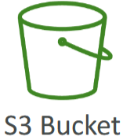

### S3 Objects
* Files stored in S3 buckets, **identified by a key** (full path).
* Key Structure: Composed of a **prefix** (folder path) and an **object name** (file name).
* **Max Size**: Up to 5 terabytes per object. For files larger than 5 gigabytes, use multi-part upload.

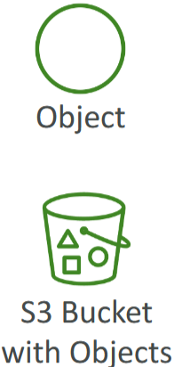

### Object Metadata and Tags
* Metadata: **Key-value pairs** providing information about the object, set by the system or user.
* **Tags**: Up to 10 **Unicode key-value pairs**, useful for security and lifecycle management.
* **Versioning**: Objects can have version IDs if versioning is enabled.

 

 

## S3 Code-along

### Creating an S3 Bucket
* `Region Selection`: Choose the region where you want to create your bucket (e.g., Europe, Stockholm, eu-north-1).
* `Bucket Type`: If available, choose "General Purpose". If not, it will default to general purpose.
* `Bucket Name`: Must be unique across all regions and accounts. Use a personal and unique name (e.g., stephane-demo-s3-v5).
* `Object Ownership`: Leave ACL disabled for security.
* `Public Access`: Block all public access for maximum security.
* `Bucket Versioning`: Disable for now; can be enabled later.
* `Encryption`: Use server-side encryption with Amazon S3 managed key (SSE-S3).
* `Create Bucket`: Click "Create Bucket" to finalize.

### Viewing and Managing Buckets
* `Bucket List`: View all your buckets across all regions in the S3 console.
* Use the search bar to find specific buckets.

### Uploading Objects to S3
* `Upload Files`: Click "Upload" and add files (e.g., coffee.jpg).
* `Destination`: Ensure the correct bucket is selected.
* `Upload`: Click "Upload" to add the file to the bucket.

### Viewing and Accessing Objects
1. Click on the uploaded object to view details (e.g., size, type, object URL).
2. Click "Open" to view the object directly in the browser.
   * Public URL vs. Pre-Signed URL:
   * Public URL: May result in "Access Denied" if the object is not public.
   * Pre-Signed URL: Contains a signature with your credentials, allowing access.

### Creating and Managing Folders
1. Click "Create Folder" and name it (e.g., images).
2. Upload files to the specific folder (e.g., beach.jpg).
3. Navigate through folders to view contents.
4. Delete folders by typing "permanently delete" to confirm.

 

 

## Instructions for Creating and Managing S3 Buckets
### Create an S3 Bucket
1. Open the Amazon S3 console.
2. Click on "Create Bucket".
3. Choose the desired region (e.g., Europe, Stockholm, eu-north-1).
4. Enter a unique bucket name (e.g., stephane-demo-s3-v5).
5. Leave ACL disabled.
6. Ensure "Block all public access" is enabled.
7. Disable for now.
8. Select "Server-side encryption with Amazon S3 managed key (SSE-S3)".
9. Click "Create Bucket".

### Upload Objects to S3
1. Click on the newly created bucket.
2. Click "Upload", then "Add files".
3. Select the file to upload (e.g., coffee.jpg).
4. Click "Upload" to add the file to the bucket.

### View and Access Objects
1. Click on the uploaded object to view details.
2. Click "Open" to view the object in the browser.

> Note that accessing via the public URL may result in "Access Denied".

3. Pre-Signed URL: Use the pre-signed URL to access the object with your credentials.

### Create and Manage Folders
1. Click "Create Folder" and name it (e.g., images).
2. Upload files to the folder (e.g., beach.jpg).
3. Navigate to the folder to view contents.
4. Select the folder, type "permanently delete" to confirm, and delete.

 

 

## S3 Security: Bucket Policy 

### User-Based Security
* Define which **API calls** are allowed for specific IAM users.

### Resource-Based Security
* `S3 Bucket Policies`: Set bucket-wide rules directly from the S3 console to control access.
* `Cross-Account Access`: Allow users from other AWS accounts to access your S3 buckets.
* `Public Access`: Make S3 buckets public by setting appropriate bucket policies.

### Object Access Control List (ACL)
* `Object ACL`: Finer-grained security for individual objects, can be disabled.
* `Bucket ACL`: Less common, also can be disabled.

### Common Security Practices
* `Bucket Policies`: The most common way to secure S3 buckets.
* `IAM Permissions`: Allow access if IAM permissions or resource policies permit and there is no explicit deny.
* `Encryption`: Encrypt objects using encryption keys.

### S3 Bucket Policy Structure
* `JSON-Based Policies`: Easy to read and define.
* `Resource Block`: Specifies which buckets and objects the policy applies to.
* `Effect`: Allow or Deny actions.
* `Actions`: Specify which API actions are allowed or denied (e.g., GetObject).
* `Principal`: Defines who the policy applies to (e.g., anyone with a star).

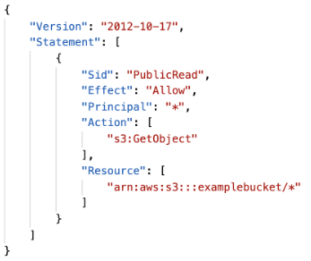

### Use Cases for S3 Bucket Policies
* `Public Access`: Grant public access to the bucket.
* `Encryption`: Force objects to be encrypted at upload.
* `Cross-Account Access`: Grant access to users from other AWS accounts.

Example: Public Access - Use Bucket Policy

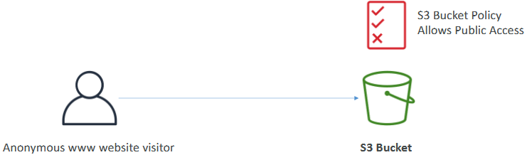

Example: User Access to S3 – IAM permissions

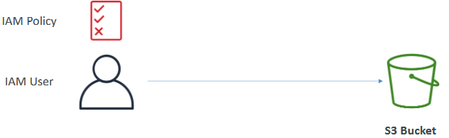

Example: EC2 instance access - Use IAM Roles

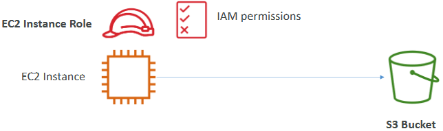

Advanced: Cross-Account Access –
Use Bucket Policy

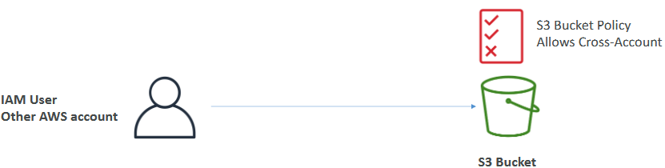

### Additional Security Settings
* `Block Public Access`: Prevents buckets from being made public, even if a bucket policy allows it.
* `Account-Level Setting`: Apply this setting to all buckets in your account to prevent data leaks.

### Bucket settings for Block Public Access

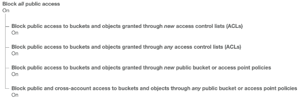

* These settings were created to prevent company data leaks.
* If you know your bucket should never be public, leave these on.
* Can be set at the account level.

 

 

## S3 Security: Bucket Policy Code-along

### Allow Public Access
1. Go to the `Permissions` tab of your S3 bucket.

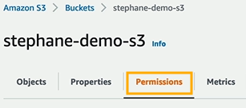

2. Edit the **bucket settings** to allow public access by unticking the block public access option.

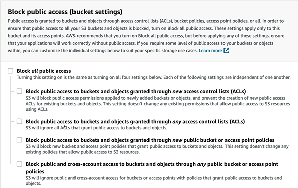

> Warning: Only disable this if you are sure you want to set a public bucket policy, as it can lead to data leaks.

### Create a Bucket Policy
1. Scroll down to the `Bucket Policy` section.

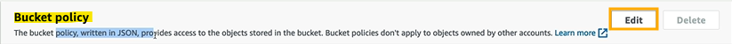

> If there is no existing policy, you need to create one to make the bucket public.

* Check the policy examples in the documentation for various use cases.
* Use the `AWS Policy Generator` to create an `S3 Bucket Policy`.

Link to documentation:
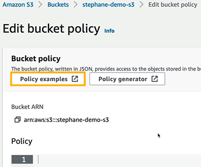

Link to policy generator:
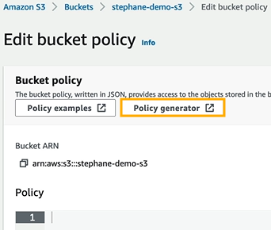

### Generate the Policy
1. Choose the S3 Bucket Policy type.
2. Set the effect to "Allow".
3. Set the principal to a star (*) to allow access to anyone.
4. Set the action to `getObject` to allow reading objects from the bucket.

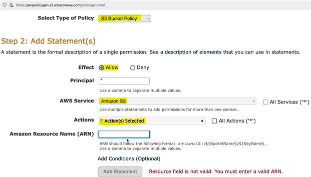

Amazon Resource Name (ARN):
1. Copy the bucket ARN from the S3 console.

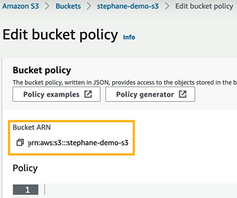

2. Append a slash (/) and a star (*) to the ARN to apply the policy to all objects within the bucket.

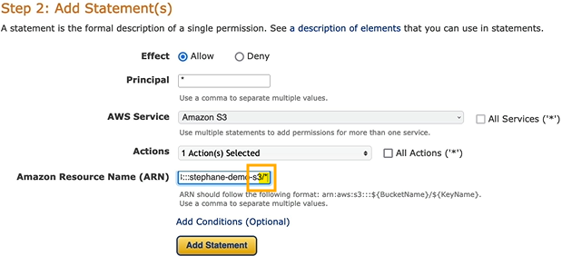

3. Add the statement to the policy.

4. Generate the policy and copy it.

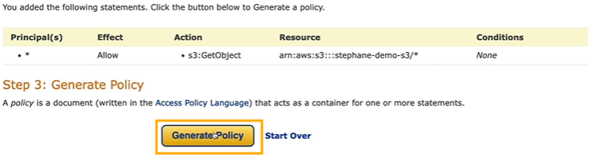

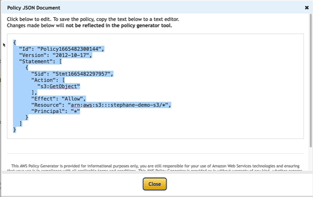

### Apply the Policy
1. Paste the generated policy into the `Bucket Policy editor`.

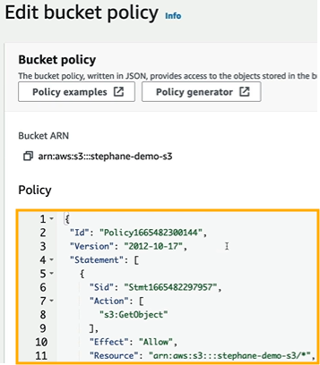

1. Click `Save changes` to apply the policy.

### Verify Public Access
1. Navigate to the object (e.g., coffee.jpg) in your bucket.

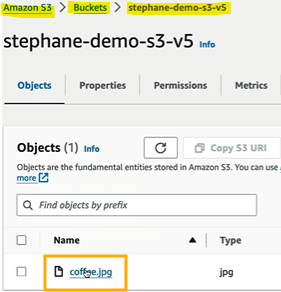

2. Copy the object URL.

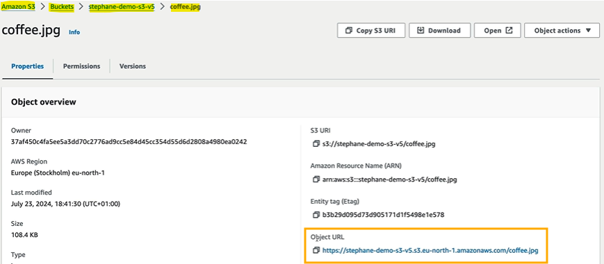

3. Enter the URL in your browser to verify that the object is publicly accessible.

 

 

## Instructions for Creating a Public S3 Bucket Policy

### Allow Public Access
1. Go to the Permissions tab of your S3 bucket.
2. Edit the bucket settings to allow public access by unticking the block public access option.
3. Confirm the change, understanding the risks of making data public.

### Create a Bucket Policy
1. Scroll down to the Bucket Policy section.

> If no policy exists, use the AWS Policy Generator to create one.

### Generate the Policy
1. Select "S3 Bucket Policy" as the policy type.
2. Set the effect to "Allow".
3. Set the principal to a star (*) to allow access to anyone.
4. Set the action to getObject to allow reading objects from the bucket.
5. Copy the bucket ARN from the S3 console and append a slash (/) and a star (*) to it.
6. Add the statement and generate the policy.
7. Copy the generated policy.

### Apply the Policy
1. Paste the generated policy into the Bucket Policy editor.
2. Save the changes.

### Verify Public Access
1. Navigate to the object (e.g., coffee.jpg) in your bucket.
2. Copy the object URL.
3. Enter the URL in your browser to verify that the object is publicly accessible.

 

 

## Website Overview

### Hosting Static Websites on S3
* Amazon S3 can host **static websites**, making them accessible on the internet.
* The **URL** of the website **depends on the AWS region** where the bucket is created. The format may vary slightly (e.g., using a dash or a dot).

### Setting Up the Bucket
* Create an S3 bucket to store your website files (e.g., HTML files, images).
* Configure the bucket to be compatible with hosting a website.

### Public Access Requirement
* To make the website accessible, you must enable public reads on your S3 bucket.
* Use S3 bucket policies to allow public access. If you encounter a 403 Forbidden error, it means your bucket is not public.

 

 

## Website Code-along

### Upload Files to S3 Bucket
* Upload the necessary files (e.g., beach.jpg, index.html) to your S3 bucket.

### Enable Static Website Hosting
1. Go to the `Properties` tab of your S3 bucket.
2. Scroll down to find the "Static website hosting" section.
3. Click on `Edit` to enable static website hosting.
4. Enter `index.html` as the index document. This will be the default or homepage of your website.
5. Save the changes to enable static website hosting.

### Ensure Public Access
* Make sure all your content is publicly readable. 

### Upload Index File
* If not already uploaded, add the `index.html` file to your S3 bucket.

### Verify Website Endpoint
1. Go back to the `Properties` tab and scroll down to the "Static website hosting" section to find the bucket website endpoint URL.
2. Copy the URL and paste it into your browser to verify that your website is accessible.
3. Ensure that the content (e.g., index.html, coffee.jpg, beach.jpg) is displayed correctly.

 

 

## S3 Versioning Overview

### Introduction to Versioning
* Versioning allows you to manage multiple versions of an object in an S3 bucket.
* This setting must be enabled at the `bucket level`.

### How Versioning Works
* When a user uploads a file, a version of that file is created. 
* If the same file is re-uploaded (overwritten), a new version is created (e.g., version 2, version 3, etc.).
* It is recommended to enable versioning for your buckets to protect against unintended deletes and to allow easy rollback to previous versions.

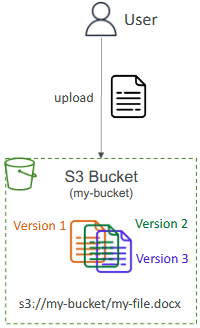

### Benefits of Versioning
* Deleting a file version adds a delete marker, allowing you to restore previous versions.
* You can easily revert to a previous version of a file if needed.

### Important Notes
* Any file that is not versioned before enabling versioning will have the version set to null.
* Suspending versioning does not delete previous versions, making it a safe operation.

  

 

## Instructions for Enabling and Using Versioning in Amazon S3
### Enable Versioning
1. Go to the `S3 console` and select your **bucket**.
2. Navigate to the `Properties` tab.
3. Scroll down to the `Versioning` section and click on `Edit`.
4. Enable versioning and save the changes.

### Upload Files
1. Upload files to your versioned bucket as usual.
2. Each upload will create a new version of the file.

### Manage Versions
1. To view versions, go to the `S3 console`, select your **bucket**, and click on the "Show versions" button.
2. You can see all versions of a file and manage them (e.g., delete, restore).

### Restore Previous Versions
* If you need to restore a previous version, select the version you want to restore and copy it to the desired location.

  

 

## S3 Replication Overview

### Introduction to S3 Replication
Types of Replication:
* `CRR` (Cross-Region Replication): Replicates data between buckets in different AWS regions.
* `SRR` (Same-Region Replication): Replicates data between buckets in the same AWS region.

### Setting Up Replication
Versioning must be enabled on both the source and destination buckets.

* `CRR Requirements`: Source and destination buckets must be in different regions.
* `SRR Requirements`: Source and destination buckets must be in the same region.
* `Cross-Account Replication`: Buckets can be in different AWS accounts.

### How Replication Works
* Replication happens asynchronously in the **background**.
* Proper IAM permissions must be granted to the S3 service to read and write from the specified buckets.

### Use Cases for Replication
`CRR` (Cross-Region Replication):
* Helps meet **compliance requirements** by storing data in multiple regions.
* Provides **lower latency access** to data by replicating it closer to users.
* **Replicates data** across different AWS accounts.

`SRR` (Same-Region Replication):
* Aggregates logs across **multiple S3 buckets**.
* Performs **live replication** between production and test accounts for testing purposes.

 

 

## Instructions for Setting Up S3 Replication
### Enable Versioning
1. Go to the `S3 console` and select your source and destination buckets.
2. Navigate to the `Properties` tab and enable versioning for **both buckets**.

### Configure Replication
1. Go to the `Management` tab of the source bucket.
2. Click on "Replication" and then "Add rule".
3. Select the **destination bucket** and configure the **replication** settings.
4. Ensure that the IAM role with the necessary permissions is specified.

### Verify Replication
* Upload objects to the source bucket.
* Check the destination bucket to ensure that the objects are replicated.

 

 

## Storage Classes Overview

### Introduction to Storage Classes

#### Types of Storage Classes:
* `S3 Standard-General Purpose`: Frequently accessed data, low latency, high throughput.
* `S3 Infrequent Access` (IA): Less frequently accessed data, lower cost, retrieval cost applies.
* `S3 One Zone-Infrequent Access` (One Zone-IA): Data stored in a single availability zone, lower cost, suitable for secondary backups.
* `Glacier Instant Retrieval`: Milliseconds retrieval, suitable for data accessed once a quarter.
* `Glacier Flexible Retrieval`: Three retrieval options (expedited, standard, bulk), suitable for archival.
* `Glacier Deep Archive`: Long-term storage, lowest cost, retrieval times of 12 to 48 hours.
* `S3 Intelligent-Tiering`: Automatically moves objects between access tiers based on usage patterns.

### Durability and Availability
`Durability`
* Amazon S3 has a very high durability of 11 nines (99.999999999%). 
* This means that on average, if you store 10 million objects, you can expect to lose a single object once every 10,000 years.

`Availability`
* Varies by storage class. 
  * For example, S3 Standard has 99.99% availability, meaning it may be unavailable for about 53 minutes a year.

### Use Cases for Storage Classes
* `S3 Standard`: Big data analytics, mobile and gaming applications, content distribution.
* `S3 Infrequent Access`: Disaster recovery, backups.
* `S3 One Zone-IA`: Secondary backups, data that can be recreated.
* `Glacier Instant Retrieval`: Backup data that needs to be accessed quickly.
* `Glacier Flexible Retrieval`: Archival data with flexible retrieval times.
* `Glacier Deep Archive`: Long-term storage with the lowest cost.
* `S3 Intelligent-Tiering`: Automatically optimizes costs by moving objects between access tiers.

 

 

## Instructions for Using Amazon S3 Storage Classes
### Choose Storage Class
* When creating an object in Amazon S3, select the appropriate storage class based on your needs.
* You can also modify the storage class of an existing object manually.

### Use Lifecycle Configurations
* Configure Amazon S3 Lifecycle policies to automatically move objects between storage classes based on predefined rules.

### Understand Durability and Availability
* **Durability** is **consistent** across all storage classes (11 nines).
* **Availability** **varies** by storage class, so choose based on your application's requirements.

### Review Pricing
* Familiarise yourself with the pricing for different storage classes to optimise costs.
* Understand that lower-cost storage classes may have retrieval costs and minimum storage durations.

 

 

## S3 Storage Classes Code-along

### Creating a New Bucket
1. Create a new bucket named "s3-storage-classes-demos-2022" in any AWS region.

### Uploading an Object
2. Upload a file (e.g., coffee.jpg) to the bucket.
3. Check the properties of the uploaded object to see the available storage classes.

### Storage Classes Overview
* `S3 Standard`: Default storage class for frequently accessed data.
* `Intelligent Tiering`: Automatically moves objects between access tiers based on usage patterns.
* `Standard-IA` (Infrequent Access): For data that is less frequently accessed but requires rapid access when needed.
* `One-Zone-IA`: Stores data in a single availability zone, suitable for recreatable data.
* `Glacier Instant Retrieval`: Low-cost storage with milliseconds retrieval time.
* `Glacier Flexible Retrieval`: Offers expedited, standard, and bulk retrieval options.
* `Glacier Deep Archive`: Lowest cost storage for long-term archiving.
* `Reduced Redundancy`: Deprecated storage class.

### Changing Storage Class
1. Change the storage class of an object by editing its properties.

**Example**: Move an object from Standard-IA to One-Zone-IA or Glacier-Instant-Retrieval.

### Automating Storage Class Transitions
* Create lifecycle rules to automate moving objects between storage classes.
* Name the rule (e.g., "DemoRule") and apply it to all objects in the bucket.
* Define transitions, such as moving to Standard-IA after 30 days, Intelligent-Tiering after 60 days, and Glacier-Flexible-Retrieval after 180 days.
* Review and confirm the transitions to automate the process.

 

 

## Step-by-Step Instructions for Using Amazon S3 Storage Classes
### Create a New Bucket
1. Go to the S3 console.
2. Click on "Create bucket".
3. Enter the bucket name (e.g., "s3-storage-classes-demos-2022").
4. Select the desired AWS region.
5. Click "Create bucket".

### Upload an Object
1. Open the newly created bucket.
2. Click on "Upload".
3. Click "Add files" and select the file (e.g., coffee.jpg).
4. Click "Upload".

### Choose Storage Class
* During the upload process, under the "Properties" section, select the **desired storage class** (e.g., S3 Standard, Intelligent Tiering, Standard-IA, One-Zone-IA, Glacier Instant Retrieval, Glacier Flexible Retrieval, Glacier Deep Archive).
* Complete the upload.

### Change Storage Class
1. Go to the bucket and select the object.
2. Click on "Properties".
3. Scroll down to the "Storage class" section.
4. Click "Edit" and select a different storage class (e.g., One-Zone-IA, Glacier-Instant-Retrieval).
5. Click "Save changes".

### Automate Storage Class Transitions
1. Go to the bucket and click on the "Management" tab.
2. Click on "Lifecycle rules".
3. Click "Create lifecycle rule".
4. Enter a rule name (e.g., "DemoRule").
5. Select "Apply to all objects in the bucket".
6. Click "Next".
7. Under "Lifecycle rule actions", select "Move current versions between storage classes".
8. Define the transitions (e.g., move to Standard-IA after 30 days, Intelligent-Tiering after 60 days, Glacier-Flexible-Retrieval after 180 days).
9. lick "Next" and review the rule.
10. Click "Create rule".

 

 

## Encryption

### Introduction to S3 Encryption
#### Server-Side Encryption (SSE)
* By default, whenever you create a bucket or upload an object, it will be **encrypted by Amazon S3**.
* The user **uploads an object** to Amazon S3, and Amazon S3 **encrypts the object** upon arrival in the bucket.
* Ensures security by having the server handle the encryption.

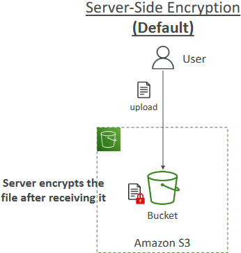

#### Client-Side Encryption (CSE)
* The **user encrypts** the file **before uploading** it to Amazon S3.
* The user encrypts the file **locally** and then **uploads the encrypted file** to the bucket.
* The encryption is done by the user, providing an additional layer of security.

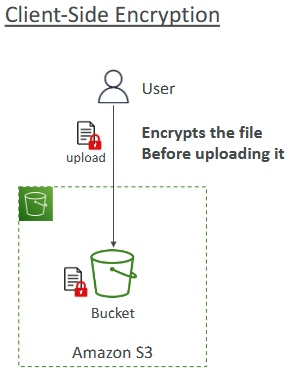

### Key Points to Remember
* Server-side encryption is always on by default in AWS.
* AWS supports both server-side and client-side encryption.

  

 

## Step-by-Step Instructions for Enabling S3 Encryption
### Server-Side Encryption (SSE)
* Server-side encryption is enabled by default when you create a bucket or upload an object.

#### Verify Encryption
1. Go to the S3 console.
2. Select the bucket and navigate to the "Properties" tab.
3. Under "Default encryption," ensure that server-side encryption is enabled.

### Client-Side Encryption (CSE)

#### Encrypt File Locally
* Use an encryption tool or library to encrypt the file on your local machine.
* Ensure that the encryption key is securely stored.

#### Upload Encrypted File
1. Go to the S3 console.
2. Select the bucket and click "Upload."
3. Add the encrypted file and complete the upload process.

 

 

## IAM Access Analyzer for S3

### Introduction to IAM Access Analyzer
* IAM Access Analyzer is a **monitoring feature** for Amazon S3 buckets to ensure that only the **intended people have access** to your S3 buckets.

### How It Works
* It **analyses** your Bucket Policies, S3 ACLs (Access Control Lists), S3 Access Point Policies, and more.
* It **identifies** which buckets are publicly **accessible** and which buckets have been **shared** with other AWS accounts.
* You can **review the findings** to determine if the access is expected or if there are potential security issues. 
  * You can then take appropriate action.

### Powered by IAM Access Analyzer
* IAM Access Analyzer helps you find out which **resources** in your account are **shared** with other entities.

 

 

## Step-by-Step Instructions for Using IAM Access Analyzer for Amazon S3
### Enable IAM Access Analyzer
1. Go to the IAM console.
2. In the navigation pane, choose "Access Analyzer".
3. Click on "Create analyzer".
4. Provide a name for the analyzer and select the appropriate region.
5. Click "Create".

### Review Findings
* Once the analyser is created, it will start analysing your S3 bucket policies, ACLs, and access point policies.
  * Go to the "Findings" tab to review the results.
* The findings will show which buckets are publicly accessible and which are shared with other AWS accounts.

### Take Action
* Review each finding to determine if the access is expected or if there are potential security issues.
* For any unexpected access, update the bucket policies, ACLs, or access point policies to restrict access as needed.

 

 

## Shared Reponsibility Model for S3

### Introduction to the Shared Responsibility Model
* AWS is responsible for the **infrastructure**, including the durability, availability, and ability to sustain losses of two facilities. 
* They handle **internal configuration**, vulnerability **analysis**, and compliance **validation** within their infrastructure.

### User Responsibilities
* `S3 Versioning`: Users must correctly set up S3 Versioning to protect data.
* `S3 Bucket Policy`: Users need to set up the right S3 Bucket Policy to ensure data protection.
* `Verification`: If verification is needed, users must set it up themselves.
* `Logging and Monitoring`: Optional features that users must enable themselves.
* `Cost Optimisation`: Users are responsible for using the most cost-effective storage class.
* `Data Encryption`: Users must encrypt their data if desired.

 

 

## Step-by-Step Instructions for Managing Responsibilities in Amazon S3
### Set Up S3 Versioning
1. Go to the `S3 console`.
2. Select your **bucket** and navigate to the "Properties" tab.
3. Scroll down to the "Versioning" section and click "Edit".
4. **Enable versioning** and save the changes. 

### Configure S3 Bucket Policy
1. Go to the `S3 console`.
2. Select your **bucket** and navigate to the "Permissions" tab.
3. Scroll down to the "Bucket Policy" section and click "Edit".
4. Add or modify the bucket policy to ensure data protection and save the changes.

### Enable Verification
* If verification is needed, configure the necessary settings in your application or service to verify data integrity.

### Enable Logging and Monitoring
* Go to the `S3 console`.
* Select your bucket and navigate to the "Properties" tab.
* Scroll down to the "Server access logging" section and click "Edit".
* Enable **logging** and specify the **target bucket** for log storage.
* Save the changes.

### Optimise Storage Costs
* Review your storage class usage and select the most cost-effective options based on your data access patterns.
* Use lifecycle policies to automatically transition objects between storage classes.

### Encrypt Data
1. Go to the **S3 console**.
2. Select your **bucket** and navigate to the "Properties" tab.
3. Scroll down to the "Default encryption" section and click "Edit".
4. Enable **server-side encryption** and choose the encryption method (e.g., SSE-S3, SSE-KMS).
5. Save the changes.

 

 

## AWS Snow Family

### Introduction to AWS Snow Family
* Highly secure, portable devices used to collect and process data at the edge and migrate data in and out of AWS.

Types:
* `Snowcone`: **Small** device with 8 to 14 terabytes of storage, used for small migration sizes.
* `Snowball Edge`: **Larger** device with 80 to 210 terabytes of storage, used for larger migration sizes up to petabytes.

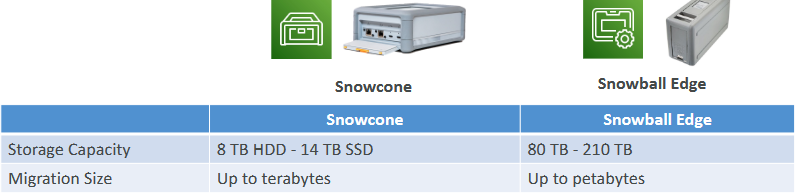

### Why Use Snowball Devices?
* `Data Migrations`: Useful when network connectivity is limited, bandwidth is constrained, or network costs are high.

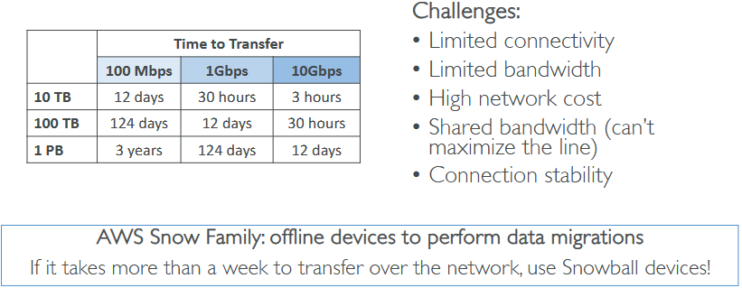

* `Offline Data Transfer`: Ideal if transferring data over the network takes more than a week.

### Diagrams

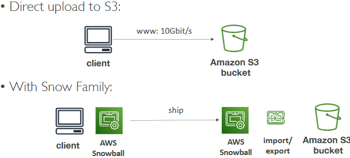

### How Snowball Devices Work
* `Order Device`: Request a Snowball or Snowcone device from the AWS console.
* `Load Data`: Install Snowball clients or AWS OpsHub on your servers, connect the device, and start copying files.
* `Ship Back`: Send the device back to AWS, where the data is imported into your Amazon S3 bucket. 
  * The device is then wiped and reused.

### Snow Family – Usage Process
1. Request Snowball devices from the AWS console for delivery
2. Install the snowball client / AWS OpsHub on your servers
3. Connect the snowball to your servers and copy files using the client
4. Ship back the device when you’re done (goes to the right AWS
facility)
5. Data will be loaded into an S3 bucket
6. Snowball is completely wiped

### Edge Computing
* **Process data created at edge locations** with limited or no internet and computing power.
  * E.g., A truck on the road, a ship on the sea, a mining station underground

Devices:
* `Snowcone`: Simple CPU and low memory, suitable for basic use cases.
* `Snowball Edge`: Compute optimized or storage optimized instances, capable of running EC2 instances or Lambda functions directly at the edge.
* `Use Cases`: Pre-process data, perform machine learning, or transcode media while shipping back to AWS.

 

 

## Step-by-Step Instructions for Using AWS Snow Family
### Order a Snowball Device
1. Go to the `AWS console`.
2. Navigate to the `Snow Family` section and request a **Snowball** or **Snowcone** device for delivery.

### Install Snowball Clients or AWS OpsHub:
1. Download and install the Snowball clients or AWS OpsHub on your servers.

### Connect and Load Data
1. Connect the Snowball device to your server.
2. Use the Snowball clients or AWS OpsHub to start copying files to the device.

### Ship Back the Device
* Once the data transfer is complete, ship the device back to AWS.
* AWS will import the data into your Amazon S3 bucket and wipe the device for reuse.

### Edge Computing
* Order a Snowball Edge or Snowcone device for edge computing.
* Use the device to process data at edge locations, run EC2 instances, or Lambda functions as needed.

 

 

## Storage Gateway Overview

### Hybrid Cloud for Storage
* AWS is pushing for ”hybrid cloud”
* Part of your infrastructure is on-premises
* Part of your infrastructure is on the cloud

This can be due to:
* Long cloud migrations
* Security requirements
* Compliance requirements
* IT strategy

> S3 is a proprietary storage technology (unlike EFS / NFS), so how do you expose the S3 data on-premise?
> 
> AWS Storage Gateway!

 

### Introduction to Hybrid Cloud
* Combines **on-premises** infrastructure with **AWS cloud services**.
* Long cloud migrations, security or compliance requirements, strategic IT management.

### Amazon S3 in Hybrid Cloud
* Amazon S3 is a proprietary storage technology.
* Required to expose S3 data on-premises.

### AWS Storage Options
* `Block Storage`: EBS or EC2 instance store.
* `File Storage`: Amazon EFS (network file system).
* `Object Storage`: Amazon S3 or Glacier.

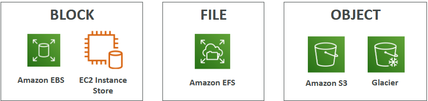

### Storage Gateway Overview
* Bridges on-premises data and cloud data in AWS.
* Use Cases: Disaster recovery, backup and restore, tiered storage.

### Types of Storage Gateway
* `File Gateway`: For file-based storage.
* `Volume Gateway`: For block-based storage.
* `Tape Gateway`: For tape-based storage.

### How Storage Gateway Works
* `Bridging Data`: Allows on-premises systems to use cloud storage seamlessly.
* `Underlying Services`: Uses Amazon EBS, Amazon S3, and Glacier behind the scenes.

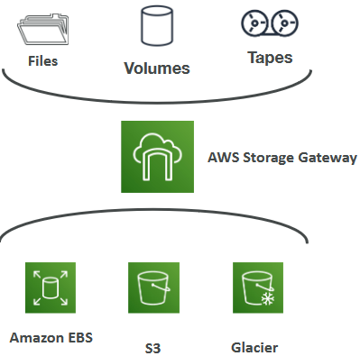

 

 

## Step-by-Step Instructions for Using AWS Storage Gateway
### Set Up Storage Gateway
1. Go to the `AWS console`.
2. Navigate to the `Storage Gateway` section and create a **new gateway**.
3. Choose the **type** of gateway (File Gateway, Volume Gateway, or Tape Gateway) based on your needs.

### Configure Gateway
1. Follow the setup wizard to configure the gateway.
2. Provide necessary details such as the on-premises server information and AWS storage settings.

### Connect On-Premises Systems
1. Install the Storage Gateway software on your on-premises server.
2. Connect the on-premises server to the configured gateway.

### Transfer Data
1. Use the Storage Gateway to transfer data between your on-premises systems and AWS cloud storage.
2. Monitor the data transfer process and ensure data integrity.

### Manage and Monitor
1. Use the AWS console to manage and monitor the Storage Gateway.
2. Check the status of data transfers and storage usage.

 

 

# Quiz

1. Which S3 Storage Class is the most cost-effective for archiving data with no retrieval time requirement?
   * Amazon Glacier Deep Archive is the most cost-effective option if you want to archive data and do not have a retrieval time requirement. 
   * You can retrieve data in 12 or 48 hours.

2. What hybrid AWS service is used to allow on-premises servers to seamlessly use the AWS Cloud at the storage layer?
   * AWS Storage Gateway is a hybrid cloud storage service that gives you on-premises access to virtually unlimited cloud storage.

3. What are Objects NOT composed of?
   * Access Keys.
   * Access Keys are used to sign programmatic requests to the AWS CLI or AWS API.

4. Where are objects stored in Amazon S3?
   * Buckets store objects in Amazon S3.

5. A research team deployed in a location with low-internet connection would like to move 5 TBs of data to the Cloud. Which service can it use?
   * AWS Snowcone.
   * AWS Snowcone is a small, portable, rugged, and secure edge computing and data transfer device. It provides up to 8 TB of usable storage.

6. What can you use to define actions to move S3 objects between different storage classes?
   * Lifecycle Rules can be used to define when S3 objects should be transitioned to another storage class or when objects should be deleted after some time.

7. A non-profit organization needs to regularly transfer petabytes of data to the cloud and to have access to local computing capacity. Which service can help with this task?
   * Snowball Edge - Storage Optimised.
   * Snowball Edge Storage Optimized devices are well suited for large-scale data migrations and recurring transfer workflows, as well as local computing with higher capacity needs.

8. Which S3 Storage Class is suitable for less frequently accessed data, but with rapid access when needed, while keeping a high durability and allowing an Availability Zone failure?
   * Amazon S3 Standard-Infrequent Access.
   * Amazon S3 Standard-Infrequent Access allow you to store infrequently accessed data, with rapid access when needed, has a high durability, and is stored in several Availability Zones to avoid data loss in case of a disaster. It can be used to store data for disaster recovery, backups, etc.

  
