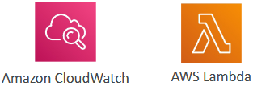
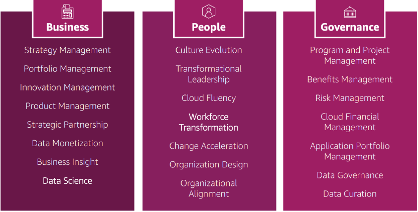

- [AWS Architecting \& Ecosystem](#aws-architecting--ecosystem)
  - [AWS Whitepapers Well-Architected Framework](#aws-whitepapers-well-architected-framework)
    - [Introduction to the Well-Architected Framework](#introduction-to-the-well-architected-framework)
    - [General Guiding Principles](#general-guiding-principles)
    - [Design Principles and Best Practices](#design-principles-and-best-practices)
    - [The Well-Architected Framework Pillars](#the-well-architected-framework-pillars)
    - [Key Points to Remember](#key-points-to-remember)
  - [Pillar 1: Operational Excellence](#pillar-1-operational-excellence)
    - [Introduction to Operational Excellence](#introduction-to-operational-excellence)
    - [Design Principles of Operational Excellence](#design-principles-of-operational-excellence)
    - [AWS Services for Operational Excellence](#aws-services-for-operational-excellence)
    - [Key Points to Remember](#key-points-to-remember-1)
  - [Pillar 2: Security](#pillar-2-security)
    - [Introduction to Security](#introduction-to-security)
    - [Design Principles of Strong Security](#design-principles-of-strong-security)
    - [AWS Services for Security](#aws-services-for-security)
    - [Key Points to Remember](#key-points-to-remember-2)
  - [Pillar 3: Reliability](#pillar-3-reliability)
    - [Introduction to Reliability](#introduction-to-reliability)
    - [Design Principles of Reliability](#design-principles-of-reliability)
    - [AWS Services for Reliability](#aws-services-for-reliability)
    - [Key Points to Remember](#key-points-to-remember-3)
  - [Pillar 4: Performance Efficiency](#pillar-4-performance-efficiency)
    - [Introduction to Performance Efficiency](#introduction-to-performance-efficiency)
    - [Design Principles of Performance Efficiency](#design-principles-of-performance-efficiency)
    - [AWS Services for Performance Efficiency](#aws-services-for-performance-efficiency)
    - [Key Points to Remember](#key-points-to-remember-4)
  - [Pillar 5: Cost Optimisation](#pillar-5-cost-optimisation)
    - [Introduction to Cost Optimisation](#introduction-to-cost-optimisation)
    - [Design Principles of Cost Optimization](#design-principles-of-cost-optimization)
    - [AWS Services for Cost Optimization](#aws-services-for-cost-optimization)
    - [Key Points to Remember](#key-points-to-remember-5)
  - [Pillar 6: Sustainability](#pillar-6-sustainability)
    - [Introduction to Sustainability](#introduction-to-sustainability)
    - [Design Principles of Sustainability](#design-principles-of-sustainability)
    - [AWS Services for Sustainability](#aws-services-for-sustainability)
    - [Key Points to Remember](#key-points-to-remember-6)
  - [AWS Well-Architected Tool](#aws-well-architected-tool)
    - [Introduction to AWS Well-Architected Tool](#introduction-to-aws-well-architected-tool)
    - [How AWS Well-Architected Tool Works](#how-aws-well-architected-tool-works)
    - [Steps to Use AWS Well-Architected Tool](#steps-to-use-aws-well-architected-tool)
    - [Benefits of AWS Well-Architected Tool](#benefits-of-aws-well-architected-tool)
    - [Key Points to Remember](#key-points-to-remember-7)
  - [Customer Carbon Footprint Tool](#customer-carbon-footprint-tool)
    - [Introduction to AWS Customer Carbon Footprint Tool](#introduction-to-aws-customer-carbon-footprint-tool)
    - [How AWS Customer Carbon Footprint Tool Works](#how-aws-customer-carbon-footprint-tool-works)
    - [Using the AWS Customer Carbon Footprint Tool](#using-the-aws-customer-carbon-footprint-tool)
    - [Benefits of AWS Customer Carbon Footprint Tool](#benefits-of-aws-customer-carbon-footprint-tool)
    - [Key Points to Remember](#key-points-to-remember-8)
  - [Cloud Adoption Framework (CAF)](#cloud-adoption-framework-caf)
    - [Introduction to AWS Cloud Adoption Framework (CAF)](#introduction-to-aws-cloud-adoption-framework-caf)
    - [Components of CAF](#components-of-caf)
    - [Six Perspectives of CAF](#six-perspectives-of-caf)
    - [Capabilities within Perspectives](#capabilities-within-perspectives)
    - [CAF Perspectives and Foundational Capabilities Business Capabilities](#caf-perspectives-and-foundational-capabilities-business-capabilities)
    - [CAF Perspectives and Foundational Capabilities](#caf-perspectives-and-foundational-capabilities)
    - [Cloud transformation value chain](#cloud-transformation-value-chain)
    - [Transformation Domains](#transformation-domains)
    - [Transformation Phases](#transformation-phases)
    - [Key Points to Remember](#key-points-to-remember-9)
  - [Right Sizing](#right-sizing)
    - [Introduction to Right Sizing](#introduction-to-right-sizing)
    - [Importance of Right Sizing](#importance-of-right-sizing)
    - [When to Right Size](#when-to-right-size)
    - [Tools for Right Sizing](#tools-for-right-sizing)
    - [Key Points to Remember](#key-points-to-remember-10)
  - [Ecosystem](#ecosystem)
    - [Introduction to the AWS Ecosystem](#introduction-to-the-aws-ecosystem)
    - [Free Resources](#free-resources)
    - [AWS Solutions](#aws-solutions)
    - [AWS Support Plans](#aws-support-plans)
    - [AWS Marketplace](#aws-marketplace)
    - [AWS Training](#aws-training)
    - [Professional Services and Partner Network](#professional-services-and-partner-network)
    - [Key Points to Remember](#key-points-to-remember-11)
  - [AWS IQ \& re:Post](#aws-iq--repost)
    - [Introduction to AWS IQ](#introduction-to-aws-iq)
    - [How AWS IQ Works](#how-aws-iq-works)
    - [Introduction to AWS re:Post](#introduction-to-aws-repost)
    - [How AWS re:Post Works](#how-aws-repost-works)
    - [Key Points to Remember](#key-points-to-remember-12)
- [Quiz](#quiz)

 

 

# AWS Architecting & Ecosystem

## AWS Whitepapers Well-Architected Framework

### Introduction to the Well-Architected Framework
* Provides guiding principles for **building a good architecture** on AWS.
* `Key Feature`: Focuses on optimizing performance, managing risk, and keeping costs under control.

### General Guiding Principles
* `Stop Guessing Capacity Needs`: Use auto-scaling to match actual demand.
* `Test at Production Scale`: Create resources quickly to test systems at production scale.
* `Automate Architectural Experimentation`: Use CloudFormation and platform as a service (e.g., Beanstalk) for easy experimentation.
* `Evolve Architecture`: Design based on changing requirements and leverage cloud capabilities.
* `Drive Architecture Using Data`: Use actual usage data to inform architectural decisions.
* `Improve Through Game Days`: Simulate high-stress scenarios to test system resilience.

### Design Principles and Best Practices
* `Scalability`: Implement vertical and horizontal scalability.
* `Disposable Resources`: Ensure servers and infrastructure are easily disposable and reconfigurable.
* `Automation`: Utilize serverless, infrastructure as a service, and auto-scaling.
* `Loose Coupling`: Break down monolithic applications into smaller, loosely coupled components.
* `Think in Services, Not Servers`: Use managed services instead of just EC2 instances.

### The Well-Architected Framework Pillars
* `Operational Excellence`: Focus on operations to deliver business value.
* `Security`: Protect data, systems, and assets.
* `Reliability`: Ensure workloads perform as expected.
* `Performance Efficiency`: Use resources efficiently.
* `Cost Optimisation`: Manage costs effectively.
* `Sustainability`: Minimise environmental impact.

### Key Points to Remember
* `Synergy of Pillars`: Improving one pillar often enhances others.
* `Continuous Improvement`: Regularly review and refine your architecture based on these principles.

 

 

## Pillar 1: Operational Excellence

### Introduction to Operational Excellence
* Operational excellence is the ability to run and monitor systems to deliver business value and continuously improve supporting processes and procedures.
* Key Feature: Focuses on performing operations as code, making frequent small changes, refining procedures, anticipating failure, and using managed services.

### Design Principles of Operational Excellence
* Perform Operations as Code: Use infrastructure as code, such as AWS CloudFormation.
* Frequent Small Changes: Make small, reversible changes to minimize risk.
* Refine Procedures: Regularly update and ensure team familiarity with operational procedures.
* Anticipate Failure: Learn from failures to improve systems.
* Use Managed Services: Reduce operational burden and implement observability for actionable insights.

### AWS Services for Operational Excellence
`Prepare`:
* Runbooks and Standards: Use AWS CloudFormation for infrastructure as code.
* Compliance: Use AWS Config to evaluate compliance of CloudFormation templates.

 

`Operate`:
* Automation: Automate processes with CloudFormation and AWS Config.
* Monitoring: Use AWS CloudTrail to track API calls and AWS CloudWatch to monitor performance.
* Tracing: Use AWS X-Ray to trace HTTP requests and identify issues.

 

`Evolve`:
* CI/CD Tools: Use AWS CodeBuild, CodeCommit, CodeDeploy, and CodePipeline for continuous integration and deployment.

 

### Key Points to Remember
* `Infrastructure as Code`: Central to operational excellence, enabling automation and consistency.
* `Continuous Improvement`: Regularly refine and evolve procedures and infrastructure.
* `Synergy of Services`: Use a combination of AWS services to achieve operational excellence.

 

 

## Pillar 2: Security

### Introduction to Security
* Security involves **protecting information**, systems, and assets while **delivering business value** through **risk assessment** and **mitigation strategies**.
* `Key Feature`: Minimizes risk and saves costs from potential disasters and security issues.

### Design Principles of Strong Security
* `Strong Identity Foundation`: Centralize user account management and rely on least privilege, using services like IAM.
* `Enable Traceability`: Monitor logs and metrics, and respond automatically to suspicious activities.
* `Apply Security at All Layers`: Secure every layer, including edge network, VPC, subnets, load balancers, instances, OS, and applications.
* `Automate Security Best Practices`: Implement automated security measures.
* `Protect Data in Transit and at Rest`: Use encryption, SSL, tokenization, and access control.
* `Keep People Away from Data`: Minimize direct access to data and automate data processing.
* `Prepare for Security Events`: Run response simulations and use tools to automate detection, investigation, and recovery.

### AWS Services for Security
`Identity and Access Management`:
* **IAM**: Manage user access and permissions.
* **STS**: Generate temporary credentials.
* **MFA**: Implement Multi-Factor Authentication.
* **AWS Organizations**: Manage multiple AWS accounts centrally.

 

`Detective Controls`:
* **AWS Config**: Ensure compliance.
* **CloudTrail**: Track API calls.
* **CloudWatch**: Monitor metrics.

 

`Infrastructure Protection`:
* **CloudFront**: Defend against DDoS attacks.
* **Amazon VPC**: Secure network configurations.
* **Shield**: Protect against DDoS attacks.
* **WAF**: Web Application Firewall.
* **Inspector**: Assess security of instances.

 

`Data Protection`:
* **KMS**: Encrypt data at rest.
* **S3**: Various encryption mechanisms and bucket policies.
* **Load Balancer**: Enable HTTPS endpoints.
* **EBS and RDS**: Encrypt volumes and instances.

 

`Incident Response`:
* **IAM**: Manage compromised accounts.
* **CloudFormation**: Restore infrastructure.
* **CloudWatch Events**: Automate incident response alerts.

 

### Key Points to Remember
* `Comprehensive Security`: Implement security at all layers and automate best practices.
* `AWS Services Synergy`: Use a combination of AWS services to achieve robust security.
* `Continuous Improvement`: Regularly update and refine security measures.

 

 

## Pillar 3: Reliability

### Introduction to Reliability
* Reliability is the ability of a system to recover from infrastructure or service disruptions, dynamically acquire computing resources to meet demand, and mitigate disruptions such as misconfigurations or transient network issues.
* `Key Feature`: Ensures your application runs smoothly no matter what.

### Design Principles of Reliability
* `Test Recovery Procedures`: Use automation to simulate failures and recreate scenarios that led to past failures.
* `Automatically Recover from Failure`: Anticipate and remediate failures before they occur.
* `Scale Horizontally`: Increase system availability and handle increased load by scaling horizontally.
* `Stop Guessing Capacity`: Use auto-scaling to ensure the right capacity at any time.
* `Automate Changes`: Ensure reliability through automation, allowing for easy rollbacks and adjustments.

### AWS Services for Reliability
`Foundations`:
* **IAM**: Manage user permissions to prevent unauthorized access.
* **Amazon VPC**: Secure and robust networking foundation.
* **Service Limits**: Set appropriate service limits and monitor them over time.
* **Trusted Advisor**: Provides insights and recommendations for maintaining strong foundations.

 

`Change Management`:
* **Auto Scaling**: Automatically adjust capacity based on demand.
* **CloudWatch**: Monitor metrics and performance.
* **CloudTrail**: Track API calls for security and compliance.
* **AWS Config**: Ensure compliance and track configuration changes.

 

`Failure Management`:
* **Backups**: Use backups to recover from failures.
* **CloudFormation**: Recreate infrastructure quickly.
* **S3 and S3 Glacier**: Store and archive data securely.
* **Route 53**: Use a reliable, highly available global DNS system for disaster recovery.

 

### Key Points to Remember
* `Automation`: Automate processes to ensure reliability and ease of recovery.
* `Monitoring and Scaling`: Use AWS services to monitor performance and scale resources as needed.
* `Disaster Recovery`: Implement robust disaster recovery mechanisms to handle failures effectively.

 

 

## Pillar 4: Performance Efficiency

### Introduction to Performance Efficiency
* Performance efficiency involves using **computing resources** efficiently to **meet system requirements** and **maintaining** that efficiency **as demand changes** and **technologies evolve**.
* `Key Feature`: Focuses on adapting and providing the best performance.

### Design Principles of Performance Efficiency
* `Use Advanced Technologies`: Track and adopt new services and technologies that can benefit your product development.
* `Go Global in Minutes`: Deploy in multiple regions quickly, potentially using CloudFormation.
* `Use Serverless Infrastructure`: Aim for serverless solutions to manage scaling automatically.
* `Experiment More Often`: Test new architectures and solutions to ensure scalability and performance.
* `Mechanical Sympathy`: Stay informed about AWS services and updates to optimise your architecture.

### AWS Services for Performance Efficiency
`Selections`:
* **Auto Scaling**: Automatically adjust capacity based on demand.
* **Lambda**: Use serverless functions for scalable compute.
* **EBS**: Manage performance with different volume types (e.g., GP2, IO1).
* **S3**: Scale storage globally.
* **RDS**: Provision databases and consider migrating to Aurora for better performance.

 

`Review`:
* **CloudFormation**: Ensure infrastructure meets performance needs.
* **AWS News Blog**: Stay updated on new services and features.

 

 

`Monitoring`:
* **CloudWatch**: Monitor metrics, set alarms, and use dashboards.
* **Lambda**: Ensure functions run efficiently without throttling.

 

`Tradeoffs`:
* **RDS vs. Aurora**: Choose the right database solution.
* **ElastiCache**: Improve performance with caching, considering potential stale data.
* **Snowball**: Balance data transfer speed and cost.
* **CloudFront**: Use for global content delivery, considering caching implications.

 

### Key Points to Remember
* `Adopt New Technologies`: Stay informed and adopt new AWS services to enhance performance.
* `Automate and Monitor`: Use automation and monitoring tools to maintain performance efficiency.
* `Evaluate Tradeoffs`: Consider tradeoffs in performance decisions to optimize your architecture.

 

 

## Pillar 5: Cost Optimisation

### Introduction to Cost Optimisation
* Cost optimisation involves **running systems** to **deliver** business **value** at the **lowest price** point possible.
* `Key Feature`: Focuses on minimizing costs while maintaining performance and efficiency.

### Design Principles of Cost Optimization
* `Adopt a Consumption Model`: Pay only for what you use. For example, AWS Lambda charges based on usage, while RDS charges for provisioned resources.
* `Measure Overall Efficiency`: Use CloudWatch to monitor resource usage and efficiency.
* `Focus on Applications`: Moving to the cloud reduces spending on data center operations, allowing you to focus on applications and systems.
* `Analyse and Attribute Expenditure`: Use tags to track costs for each application and optimise them over time.
* `Use Managed Services`: Managed services operate at cloud scale, offering lower costs per transaction or service.

### AWS Services for Cost Optimization
`Expenditure Awareness`:
* Budgets: Set and monitor budgets.
* Cost Explorer: Analyze and visualize costs.
* Reserved Instance Reporting: Ensure reserved instances are used effectively.

 

`Cost-Effective Resources`:
* Spot Instances: Use cheaper spot instances where possible.
* Reserved Instances: Save money by reserving instances for long-term use.
* AWS Glacier: Store archives at the lowest price point.

 

`Matching Supply and Demand`:
* Auto Scaling: Automatically adjust capacity based on demand.
* AWS Lambda: Use serverless infrastructure to avoid over-provisioning.

 

`Optimization Over Time`:
* Trusted Advisor: Get recommendations for cost optimization.
* Cost and Usage Report: Monitor and analyze costs.
* AWS News Blog: Stay updated on new features and services that can help reduce costs.

 

### Key Points to Remember
* `Pay for What You Use`: Adopt a consumption model to minimize costs.
* `Monitor and Analyse`: Use AWS tools to track and optimize costs.
* `Leverage Managed Services`: Reduce costs by using managed services that operate at cloud scale.

 

 

## Pillar 6: Sustainability

### Introduction to Sustainability
* Sustainability focuses on minimizing the environmental impact of running cloud workloads.
* `Key Feature`: Aims to understand impact, establish performance indicators, evaluate improvements, and achieve sustainability goals.

### Design Principles of Sustainability
* `Understand Impact`: Assess the environmental impact of your cloud workloads.
* `Establish Performance Indicators`: Set metrics to measure sustainability efforts.
* `Evaluate Improvements`: Continuously improve and track progress towards sustainability goals.
* `Maximize Utilization`: Ensure efficient use of services to be energy-efficient and environmentally conscious.
* `Adopt Efficient Hardware`: Use newer, more efficient hardware as AWS optimizes its infrastructure.
* `Use Managed Services`: Share infrastructure with others to enhance sustainability.
* `Reduce Downstream Impact`: Minimize energy and resource requirements for your services and reduce the need for customers to upgrade devices frequently.

 

### AWS Services for Sustainability
`Compute Efficiency`:
* **EC2 Auto Scaling**: Automatically adjust capacity based on demand.
* **Serverless Offerings**: Use Lambda or Fargate for efficient compute usage.
* **Graviton 2 and EC2 T Instances**: Use energy-efficient instances.
* **Spot Instances**: Utilize spare capacity to avoid waste.

 

`Storage Optimization`:
* **EFS-IA and S3 Glacier**: Use tiered storage for cost and energy efficiency.
* **Cold HDD for EBS Volumes**: Optimize storage costs and energy usage.
* **S3 Lifecycle Configurations and Intelligent Tiering**: Ensure data is stored in the most appropriate tier.
* **Amazon Data Lifecycle Manager**: Automate data lifecycle management.

 

`Database Efficiency`:
* **RDS Read Replicas and Aurora Global Databases**: Optimize database performance and energy usage.
* **DynamoDB Global Tables**: Efficiently manage global data.
* **CloudFront**: Use content delivery networks to reduce latency and energy consumption.

 

### Key Points to Remember
* `Energy Efficiency`: Focus on maximizing utilization and adopting efficient hardware.
* `Managed Services`: Leverage shared infrastructure for better sustainability.
* `Continuous Improvement`: Regularly evaluate and improve sustainability efforts.

 

 

## AWS Well-Architected Tool

### Introduction to AWS Well-Architected Tool
* The AWS Well-Architected Tool helps you **review** your **architectures** against the **six pillars** of the Well-Architected Framework and adapt best practices.
* `Key Feature`: Provides a structured approach to evaluate and improve your AWS workloads.

### How AWS Well-Architected Tool Works
* `Select Workload`: Define your workload by providing details such as description, review owner, environment, regions, and account IDs.
* `Apply Lenses`: Choose lenses like the Well-Architected Framework, FTR Lens, Serverless Lens, SaaS Lens, or define custom lenses.
* `Review and Answer Questions`: Answer questions related to the six pillars: operational excellence, security, reliability, performance efficiency, cost optimization, and sustainability.
* `Obtain Advice`: Receive advice, videos, documentation, and reports based on your answers.

### Steps to Use AWS Well-Architected Tool
* `Define Workload`: Enter details about your workload.
* `Apply Lenses`: Select appropriate lenses for your workload.
* `Review Questions`: Answer questions for each pillar.
* `Save and Exit`: Save your answers and review the identified risks.
* `Improvement Plan`: Access improvement items and documentation links to address high and medium risks.

### Benefits of AWS Well-Architected Tool
* `Structured Evaluation`: Provides a systematic approach to assess your architecture.
* `Risk Identification`: Identifies high and medium risks in your workload.
* `Improvement Guidance`: Offers actionable improvement items and links to relevant documentation.

### Key Points to Remember
* `Comprehensive Review`: Covers all six pillars of the Well-Architected Framework.
* `Continuous Improvement`: Helps ensure your applications are well-architected and continuously improved.
* `Documentation and Support`: Provides access to videos, documentation, and reports for better understanding and implementation.

 

 

## Customer Carbon Footprint Tool

### Introduction to AWS Customer Carbon Footprint Tool
* The AWS Customer Carbon Footprint Tool helps **track**, **measure**, **review**, and **forecast** **carbon emissions** generated from your AWS usage.
* `Key Feature`: Assists in meeting sustainability goals by providing insights into carbon emissions and savings.

### How AWS Customer Carbon Footprint Tool Works
* `Access Carbon Emissions`: Provides data on your carbon emissions and savings.
* `Service Emissions`: Identifies which services are emitting the most carbon.
* `Track Emissions Over Time`: Monitors emissions over time and shows the path to 100% renewable energy usage for your AWS accounts.

 

 

### Using the AWS Customer Carbon Footprint Tool
* `Navigation`: Go to the billing and cost management platform and search for "carbon" to find the tool.
* `Features`: Access start month and end month data, emission summary, savings by geography and services, and statistics.
* `Data Visualization`: View emissions over time and track progress towards renewable energy goals.

### Benefits of AWS Customer Carbon Footprint Tool
* `Sustainability Goals`: Helps achieve sustainability goals by providing detailed insights into carbon emissions.
* `Informed Decisions`: Enables better decision-making by understanding the environmental impact of AWS usage.
* `Progress Tracking`: Monitors progress towards using 100% renewable energy.

### Key Points to Remember
* `Comprehensive Tracking`: Provides a detailed view of carbon emissions and savings.
* `User-Friendly`: Easy to navigate and access relevant data.
* `Sustainability Focus`: Supports efforts to minimize environmental impact and achieve sustainability goals.

 

 

## Cloud Adoption Framework (CAF)

### Introduction to AWS Cloud Adoption Framework (CAF)
* The AWS Cloud Adoption Framework (CAF) helps build and execute a comprehensive plan for digital transformation using AWS.
* `Key Feature`: Provides a structured approach to leverage the cloud for business transformation.

### Components of CAF
* Organizational Capabilities: Underpin successful platform transformations.
* Six Perspectives: Group capabilities into six perspectives essential for the exam.

### Six Perspectives of CAF

* `Business`: Ensures cloud investments accelerate digital transformation and business outcomes.
* `People`: Serves as a bridge between technology and business, focusing on culture, organizational structure, leadership, and workforce.
* `Governance`: Orchestrates cloud initiatives to maximize benefits and minimize risks.
* `Platform`: Builds an enterprise-grade, scalable hybrid cloud platform for modernizing workloads and implementing new solutions.
* `Security`: Achieves confidentiality, integrity, and availability of data and cloud workloads.
* `Operations`: Ensures cloud services meet business needs.

 

### Capabilities within Perspectives
* `Business`: Strategy management, portfolio management, innovation management, product management, strategic partnership, data monetization, business insight, data science.
* `People`: Culture evolution, transformational leadership, cloud fluency, workforce transformation, change acceleration, organization design, organizational alignment.
* `Governance`: Program and project management, benefits management, risk management, cloud financial management, application portfolio management, data governance, data curation.
* `Platform`: Platform architecture, data architecture, platform engineering, data engineering, provisioning and orchestration, modern application development, continuous integration and delivery.
* `Security`: Security governance, security assurance, identity and access management, threat detection, vulnerability management, infrastructure protection, data protection, application security, incident response.
* `Operations`: Observability, event management, incident and problem management, change and release management, performance and capacity management, configuration management, patch management, availability and continuity management, application management.

 

### CAF Perspectives and Foundational Capabilities Business Capabilities

 

### CAF Perspectives and Foundational Capabilities
Technical Capabilities

 

### Cloud transformation value chain

  

### Transformation Domains
* `Technology`: Migrate and modernize legacy infrastructure, applications, data, and analytics platforms.
* `Process`: Digitize, automate, and optimize business operations using data and analytics platforms and machine learning.
* `Organization`: Reimagine operating models, reorganize teams around products and value streams, leverage agile methods.
* `Products`: Create new value propositions, products, services, and revenue models.

### Transformation Phases
* `Envision`: Identify transformation opportunities and create a foundation for digital transformation.
* `Align`: Identify capability gaps and create an action plan based on the six CAF perspectives.
* `Launch`: Build and deliver pilot initiatives in production, demonstrating incremental business value.
* `Scale`: Expand pilot initiatives to desired scale, realizing business benefits.

### Key Points to Remember
* Six Perspectives: Business, People, Governance, Platform, Security, Operations.
* Transformation Domains: Technology, Process, Organization, Products.
* Transformation Phases: Envision, Align, Launch, Scale.

 

 

## Right Sizing

### Introduction to Right Sizing
* Right sizing involves **matching** the **instance type** and **size** to your **workload performance** and **capacity** requirements at the **lowest possible cost**.
* `Key Feature`: Ensures efficient use of resources by starting small and scaling up as needed.

### Importance of Right Sizing
* `Elastic Cloud`: The cloud allows you to change instance types easily, so choosing the most powerful instance is not always the best choice.
* `Continuous Process`: Regularly review and adjust your deployed instances to eliminate or downsize without compromising quality, capacity, or performance, resulting in lower costs.

### When to Right Size
* `Before Cloud Migration`: Right size before migrating to the cloud to avoid over-provisioning.
* `Continuous Adjustment`: Continuously right size after migration, ideally once a month, to adapt to changing requirements.

### Tools for Right Sizing
* `CloudWatch`: Monitor metrics to identify opportunities for right sizing.
* `Cost Explorer`: Analyze costs and usage to find optimization opportunities.
* `Trusted Advisor`: Get recommendations for right sizing and cost optimisation.
* `Third-Party Tools`: Utilise additional tools for comprehensive right sizing analysis.

### Key Points to Remember
* `Start Small`: Begin with smaller instances and scale up as needed.
* `Regular Review`: Continuously review and adjust instance sizes to maintain efficiency.
* `Optimise Costs`: Right sizing helps reduce costs by ensuring resources are used efficiently.

 

 

## Ecosystem

### Introduction to the AWS Ecosystem
* The AWS ecosystem includes various resources, tools, and services that support AWS users in optimizing their cloud experience.
* `Key Feature`: Provides a comprehensive set of resources for learning, deploying, and managing AWS services.

### Free Resources
* `AWS Blog`: Offers updates, tutorials, and insights on AWS services.
* `Forums`: Community-based support where users help each other.
* `Whitepapers and Guides`: Detailed documents approved by AWS, covering topics like security, architecture, and networking.
* `AWS Partner Solutions` (formerly Quick Starts): Automated, gold-standard deployments in the AWS Cloud using CloudFormation templates.

### AWS Solutions
* `AWS Solutions`: Vetted technology solutions for deploying secure, multi-account environments in AWS.
* `AWS Control Tower`: Replaces AWS Landing Zone for managing multi-account environments.

### AWS Support Plans
* `Developer Support`: Business hour email access to Cloud Support Associates, general guidance (<24 hours), and system impaired (<12 hours).
* `Business Support`: 24/7 phone, email, and chat access to Cloud Support Engineers, production system impaired (<4 hours), and production system down (<1 hour).
* `Enterprise Support`: Dedicated Technical Account Manager (TAM), Concierge Support Team, business-critical system down (<15 minutes).

 

 

### AWS Marketplace

* `Digital Catalog`: Thousands of software listings from independent software vendors.
* `Offerings`: Custom AMIs, CloudFormation templates, SaaS, containers.
* `Billing`: Purchases go directly into your AWS bill.

 

### AWS Training
* `Digital and Classroom Training`: Online and in-person training sessions.
* `Private Training`: Customized training for organizations.
* `AWS Academy`: Helps universities teach AWS.
* `Third-Party Training`: Courses from independent instructors.

### Professional Services and Partner Network
* `AWS Professional Services`: Global team of experts to help with AWS.
* `APN Technology Partners`: Provide hardware, connectivity, and software.
* `APN Consulting Partners`: Professional services firms to help build on AWS.
* `APN Training Partners`: Deliver AWS training.
* `Competency Program`: Recognizes partners with technical proficiency and customer success.
* `Navigate Program`: Helps partners improve their AWS expertise.

### Key Points to Remember
* `Comprehensive Resources`: Utilize the AWS blog, forums, whitepapers, and partner solutions for learning and deployment.
* `Support Plans`: Choose the right support plan based on your needs.
* `Marketplace`: Leverage the AWS Marketplace for software and services.
* `Training and Professional Services`: Take advantage of AWS training and professional services for expertise and support.

 

 

## AWS IQ & re:Post

### Introduction to AWS IQ
* AWS IQ helps you quickly find AWS Certified third-party experts for on-demand project work.
* `Key Feature`: Provides video conferencing, contract management, secure collaboration, and integrated billing.

### How AWS IQ Works
`For Customers`:
* **Submit Request**: Describe your project and review responses from experts.
* **Select Expert**: Choose an expert based on rates, experience, and requirements.
* **Work Securely**: Grant secure access to your AWS accounts and collaborate with the expert.
* **Unlock Milestones**: Pay for completed milestones directly through your AWS bill.

 

`For Experts`:
* **Create Profile**: Include your photo, certifications, and experience.
* **Connect with Customers**: Respond to project requests and start proposals.
* **Work Securely**: Collaborate securely with customers and get paid after milestones are unlocked.

 

### Introduction to AWS re:Post
* AWS re:Post is a community forum for finding answers, sharing best practices, and joining groups related to AWS.
* `Key Feature`: Offers crowd-sourced, expert-reviewed answers to technical questions about AWS.

 

### How AWS re:Post Works
* `Community Forum`: Users ask questions, provide answers, and up-vote helpful responses.
* `Free Tier`: Part of the AWS Free Tier, accessible at no cost.
* `Reputation Building`: Community members can earn reputation points and build expert status by participating.
* `Premium Support`: If a premium customer doesn't receive a community response, AWS support engineers will answer the question.

### Key Points to Remember
* `AWS IQ`: Ideal for finding certified experts for project work, with integrated billing and secure collaboration.
* `AWS re:Post`: A community-driven Q&A platform for AWS-related questions, not suitable for time-sensitive or preparatory actions.

 

 

# Quiz

1. Auto Scaling in EC2 and DynamoDB are examples of?
   * Horizontal scaling.
   * Auto Scaling in EC2 allows you to have the right number of instances to handle the application load. 
   * Auto Scaling in DynamoDB automatically adjusts read and write throughput capacity, in response to dynamically changing request volumes, with zero downtime. 
   * These are both examples of horizontal scaling.

2. True or false. AWS Trusted Advisor can provide guidance against the 6 Well-Architected pillars and architectural best practices.
   * False.
   * The AWS Well-Architected Tool helps you review the state of your workloads and compares them to the latest AWS architectural best practices. 
   * It is based on the 6 pillars of the Well-Architected Framework (Operational Excellence, Security, Reliability, Performance Efficiency, Cost Optimization, and Sustainability). 
   * AWS Trusted Advisor is an online tool that provides you real time guidance to help you provision your resources following AWS best practices (Cost Optimization, Performance, Security, Fault Tolerance, and Service Limits).

3. Which of the following are design principles of Performance Efficiency?
   * "Go global in minutes and experiment more often."
   * Performance Efficiency design principles include: democratize advanced technologies, go global in minutes, use serverless architecture, experiment more often, mechanical sympathy.

4. Which of the following is NOT an AWS Partner Network (APN) type? APN technology partners, Services partners, Consulting Partners, and training partners. 
   * APN Services Partners.
   * This is a distractor. This type of AWS Partner Network does not exist. It is made up with words related to the AWS Partner Network.

5. True or false. Testing recovery procedures, stopping guessing capacity, and managing changes in automation are design principles of Performance Efficiency.
   * False.
   * Testing recovery procedures, stopping guessing capacity, and managing changes in automation are design principles of Reliability. 
   * Performance Efficiency design principles include: democratize advanced technologies, go global in minutes, use serverless architecture, experiment more often, mechanical sympathy.

6. Which AWS service is the key to Operational Excellence?
   * CloudFormation.
   * CloudFormation is a key service to Operational Excellence as it prepares, operates, and evolves, but also performs operations as code.

7. AWS Cost Explorer and AWS Trusted Advisor are services examples of which Well-Architected Framework pillar?
   * Cost Optimization.
   * AWS Cost Explorer and AWS Trusted Advisor are Cost Optimization services examples. 
   * It also includes AWS Budgets, Cost and Usage Reports, etc.

8. Implementing Security Groups, NACLs, KMS, or CloudTrail reflects which Well-Architected Framework Pillar?
   * Security.
   * The Security pillar includes the ability to protect information, systems, and assets while delivering business value through risk assessments and mitigation strategies.

 