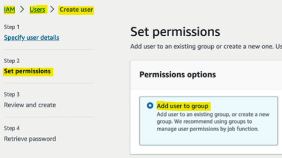

- [What is Cloud Computing?](#what-is-cloud-computing)
  - [Traditional IT Overview](#traditional-it-overview)
    - [Introduction to Cloud Computing](#introduction-to-cloud-computing)
    - [Basics of Website Functionality](#basics-of-website-functionality)
    - [Analogy of Network Communication](#analogy-of-network-communication)
    - [Components of a Server](#components-of-a-server)
    - [Traditional IT Setup](#traditional-it-setup)
    - [Transition to Cloud Computing](#transition-to-cloud-computing)
  - [What is Cloud Computing?](#what-is-cloud-computing-1)
    - [Flexibility and Scalability](#flexibility-and-scalability)
    - [User-Friendly Interface](#user-friendly-interface)
    - [Transition from Traditional IT to Cloud](#transition-from-traditional-it-to-cloud)
    - [Everyday Cloud Services](#everyday-cloud-services)
    - [Types of Clouds](#types-of-clouds)
      - [Private Cloud](#private-cloud)
      - [Public Cloud](#public-cloud)
      - [Hybrid Cloud](#hybrid-cloud)
    - [Characteristics of Cloud Computing](#characteristics-of-cloud-computing)
    - [Advantages of Cloud Computing](#advantages-of-cloud-computing)
  - [Types of Cloud Computing](#types-of-cloud-computing)
      - [Infrastructure as a Service (IaaS)](#infrastructure-as-a-service-iaas)
      - [Platform as a Service (PaaS)](#platform-as-a-service-paas)
      - [Software as a Service (SaaS)](#software-as-a-service-saas)
    - [Comparison of Cloud Models](#comparison-of-cloud-models)
      - [On-Premises](#on-premises)
      - [IaaS](#iaas)
      - [PaaS](#paas)
      - [SaaS](#saas)
    - [Examples of Cloud Services](#examples-of-cloud-services)
    - [Cloud Pricing Fundamentals](#cloud-pricing-fundamentals)
    - [Advantages of Cloud Pricing](#advantages-of-cloud-pricing)
  - [AWS Cloud Overview](#aws-cloud-overview)
    - [History of AWS Cloud](#history-of-aws-cloud)
    - [AWS Today](#aws-today)
    - [What Can You Build on AWS?](#what-can-you-build-on-aws)
    - [AWS Global Infrastructure](#aws-global-infrastructure)
    - [Choosing an AWS Region](#choosing-an-aws-region)
    - [Availability Zones](#availability-zones)
    - [Points of Presence (Edge Locations)](#points-of-presence-edge-locations)
    - [AWS Global Services](#aws-global-services)
    - [Checking Service Availability](#checking-service-availability)
  - [Shared Responsibility Model \& AWS Acceptable Policy](#shared-responsibility-model--aws-acceptable-policy)
    - [Introduction to Shared Responsibility Model](#introduction-to-shared-responsibility-model)
    - [Customer Responsibilities](#customer-responsibilities)
    - [AWS Responsibilities](#aws-responsibilities)
    - [Exam Relevance](#exam-relevance)
    - [Acceptable Use Policy](#acceptable-use-policy)
- [Quiz](#quiz)

 

 

# What is Cloud Computing?

## Traditional IT Overview

### Introduction to Cloud Computing
`Cloud Computing`
* Using the **internet** to **access and store data** and **applications** instead of relying on your computer's hard drive.
* Makes it easier to access resources, scale up or down, and save costs.

### Basics of Website Functionality
* `Server`: A computer that **hosts websites** and **serves content** to users.
* `Client`: Your web browser or device that **requests content** from the server.
* `Network`: The **connection** that allows **data to travel between the server and your device**.
* `IP Address`: A **unique number** that **identifies each device on the network**, like an address for sending and receiving data.

### Analogy of Network Communication
* Letter Analogy: Think of sending data over the internet like sending a letter through the mail.
  * **Client**: You, the sender of the letter.
  * **Network**: The postal system that delivers the letter.
  * **Server**: The recipient of the letter.
  * **IP Address**: The address on the letter, ensuring it reaches the right place.

### Components of a Server
* 🧠`CPU` (Central Processing Unit): The **brain** of the server, performing calculations and processing data.
* 🗃️`RAM` (Random Access Memory): **Temporary storage** for quick data access, like short-term memory.
* 📦`Storage`: **Permanent storage** for data, such as hard drives or SSDs.
* 📊`Database`: A structured way to **store data**, making it easy to search and retrieve.
* 🪢`Networking Components`: Routers, switches, and DNS servers that manage data flow and connectivity.

### Traditional IT Setup
* `Home/Garage Servers`: Early websites and companies started with servers in homes or garages.
* `Data Centers`: Dedicated facilities for housing multiple servers as the company grows.

Challenges:
* 💵`Cost`: High expenses for rent, power, cooling, and maintenance.
* 📈`Scalability`: Limited ability to quickly add or replace servers.
* ☠️`Disaster Recovery`: Risks from natural disasters, power outages, and hardware failures.
* ⚒️`Maintenance`: Need for a dedicated team to monitor and manage infrastructure.

### Transition to Cloud Computing
* `On-Demand Resources`: Access to computing power, storage, and networking as needed.
* `Scalability`: Easily scale resources up or down based on demand.
* `Cost-Efficiency`: Pay only for the resources used, reducing overall expenses.
* `Disaster Recovery`: Built-in redundancy and backup solutions to ensure data availability.

  

 

## What is Cloud Computing?
* Cloud computing is the **on-demand delivery** of **computing power**, **storage**, **applications**, and other IT **resources**.
  * **On-Demand**: You get resources when you need them.
  * **Pay-As-You-Go**: You only pay for what you use, and stop paying when you stop using it.

### Flexibility and Scalability
`Resource Provisioning`
* You can get exactly the type and size of resources you need.
  * Need a big server? It's available.
  * Need a small server? That's available too.
  * Need 10 servers today and 2 tomorrow? No problem.
`Instant Access`
* Resources are available instantly, without waiting.

### User-Friendly Interface
* Cloud platforms provide interfaces to **easily access** servers, storage, databases, and applications.

**AWS Example**: Amazon Web Services (AWS) owns and maintains the hardware, while you use what you need via a web application.

### Transition from Traditional IT to Cloud
* `Traditional IT`: Involves **setting up servers in homes** or data centers, which is **costly** and **time-consuming**.
* `Cloud Computing`: Uses data centers **managed by cloud providers**, allowing you to **pay only for what you use**.

### Everyday Cloud Services
* **Email**: Services like Gmail are cloud-based, and you pay only for the storage you use.
* **Storage**: Services like Dropbox and Google Drive store your files in the cloud.
* **Streaming**: Services like Netflix use cloud computing to deliver video on-demand.

 

### Types of Clouds

#### Private Cloud
* Used by a **single organisation**, **not exposed** to the public. 
* Managed by someone else but offers more **control** and **security**.

#### Public Cloud
* Provided by companies like Microsoft Azure, Google Cloud, and AWS. 
* **Resources** are **owned** and **operated** by **third-party providers** and **delivered over the internet**.

#### Hybrid Cloud
* **Combines** private and public clouds, allowing you to **keep some resources on-premises** and **extend others to the cloud**.

### Characteristics of Cloud Computing
* `On-Demand and Self-Service`: Users can provision resources without needing help from the provider.
* `Broad Network Access`: Resources are available over the network and can be accessed in various ways.
* `Multi-Tenancy and Resource Pooling`: Multiple customers share the same infrastructure while maintaining security and privacy.
* `Rapid Elasticity and Scalability`: Resources can be quickly scaled up or down based on demand.
* `Measured Service`: Usage is measured, and you pay only for what you use.

### Advantages of Cloud Computing
* `Cost Efficiency`: Trade capital expenses (buying hardware) for operational expenses (renting resources).
* `Economies of Scale`: Lower prices due to the large scale of cloud providers.
* `No Capacity Guessing`: Scale resources automatically based on actual usage.
* `Increased Speed and Agility`: Quickly create and operate resources without delays.
* `Reduced Maintenance Costs`: No need to spend money on running and maintaining data centers.
* `Global Reach`: Leverage global infrastructure to create applications accessible worldwide.

 

 

## Types of Cloud Computing

#### Infrastructure as a Service (IaaS)
* Provides the **basic building blocks** for cloud IT, such as networking, computers, and data storage. 
  * Think of it like building with LEGOs, giving you flexibility to migrate from traditional IT to the cloud.

#### Platform as a Service (PaaS)
* Removes the need to manage the underlying infrastructure, allowing you to **focus on deploying** and **managing** your applications.

#### Software as a Service (SaaS)
* A complete product run and **managed by the service provider**. 
* You just **use the software without worrying about the infrastructure**.

### Comparison of Cloud Models

#### On-Premises
* You **manage everything**, including applications, data, runtime, middleware, operating system, virtualization, servers, storage, and networking.

#### IaaS
* You **manage applications**, data, runtime, middleware, and the operating system. 
* The **provider** (e.g., AWS) **manages virtualisation**, servers, storage, and networking.

#### PaaS
* You only **manage applications** and **data**. 
* The **provider** manages **everything else**, including runtime and networking.

#### SaaS
* The **provider manages everything**. You just use the software.

### Examples of Cloud Services
* `IaaS`: Amazon EC2, Google Cloud, Azure, Rackspace, Digital Ocean, Linode.
* `PaaS`: AWS Elastic Beanstalk, Heroku, Google App Engine, Windows Azure.
* `SaaS`: AWS Rekognition, Google Apps (Gmail, Dropbox), Zoom.

### Cloud Pricing Fundamentals
* `Pay-As-You-Go`: You only pay for what you use.
* `Compute`: Pay for the exact compute time.
* `Storage`: Pay for the exact amount of data stored.
* `Networking`: Pay only when data leaves the cloud. Data entering the cloud is free.

### Advantages of Cloud Pricing
* `Cost Savings`: Only pay for what you need, reducing expenses compared to traditional IT.
* `Scalability`: Easily scale resources up or down based on demand.
* `Flexibility`: Access resources instantly without waiting.

 

 

## AWS Cloud Overview

### History of AWS Cloud
* **2002**: AWS launched internally at Amazon to externalize IT departments.
* **2004**: First public offering with SQS (Simple Queue Service).
* **2006**: Expanded offerings with SQS, S3 (Simple Storage Service), and EC2 (Elastic Compute Cloud).
* **Global Expansion**: AWS expanded beyond America to Europe and other regions.
* **Major Users**: Dropbox, Netflix, Airbnb, NASA, and more.

### AWS Today
* `Market Leader`: AWS is a leader in the cloud market, with $90 billion in revenue as of 2023.
* `Market Share`: Holds 31% of the market in Q1 2024, with Microsoft in second place at 25%.
* `Active Users`: Over 1 million active users.
* `Applications`: AWS enables building sophisticated and scalable applications for various industries.

### What Can You Build on AWS?
* **Enterprise IT**: Transfer enterprise IT to the cloud.
* **Backup and Storage**: Use the cloud for backup and storage solutions.
* **Big Data Analytics**: Perform big data analytics.
* **Web Hosting**: Host websites.
* **Mobile and Social Apps**: Create backends for mobile and social applications.
* **Gaming Servers**: Run gaming servers on the cloud.

### AWS Global Infrastructure
* `Regions`: AWS has multiple regions around the world, **each consisting of clusters of data centers**.
* `Availability Zones`: Each region has **multiple availability zones** for **redundancy** and **reliability**.
* `Edge Locations and Points of Presence`: Used for **content delivery** and **low-latency access**.

### Choosing an AWS Region
* `Compliance`: Some governments require data to be stored locally.
* `Latency`: Deploy applications close to users to reduce latency.
* `Service Availability`: Not all regions have all services, so ensure the required services are available in the chosen region.
* `Pricing`: Pricing varies by region, so consult the services pricing pages to see the differences.

### Availability Zones
* Availability zones are **discrete data centers within a region**, each with redundant power, networking, and connectivity.
  * **Example**: The Sydney region (ap-southeast-2) has three availability zones: ap-southeast-2A, ap-southeast-2B, and ap-southeast-2C.
* `Isolation`: Availability zones are designed to be **isolated from disasters**, ensuring that issues in one zone do not affect others.
* `Connectivity`: Connected with high bandwidth, ultra-low latency networking.

### Points of Presence (Edge Locations)
* AWS has over 400 points of presence in 90 cities across 40 countries.
* They** deliver content to end users with the lowest latency possible**.

### AWS Global Services
* **Examples**: IAM (Identity and Access Management), Route 53 (DNS service), CloudFront (Content Delivery Network), WAF (Web Application Firewall).
* **Region-Scoped Services**: Most AWS services are region-scoped, such as Amazon EC2, Elastic Beanstalk, Lambda, and Rekognition.

### Checking Service Availability
* `Region Table`: Use the region table to check if a service is available in your chosen region.

  

 

## Shared Responsibility Model & AWS Acceptable Policy

### Introduction to Shared Responsibility Model
* The Shared Responsibility Model **defines what you** (the customer) **are responsible for** versus **what AWS is responsible for** when **using the cloud**.

### Customer Responsibilities
* `Security in the Cloud`: You are responsible for **securing everything you use** in the cloud.
* `Configuration`: **How you configure** your cloud resources.
* `Security`: **Protecting your data**, **operating system**, **network**, and **firewall settings**.

### AWS Responsibilities
* `Security of the Cloud`: AWS is responsible for **securing the infrastructure** that runs all the services offered in the AWS Cloud.
* `Infrastructure`: Includes hardware, software, networking, and facilities.

### Exam Relevance
* **Certified Cloud Practitioner Exam**: You will be asked questions about what is your responsibility and what is AWS's responsibility.

### Acceptable Use Policy
* **Agreement**: When using AWS, you agree to their Acceptable Use Policy.
* **Prohibited Actions**: No illegal, harmful, or offensive use or content, no security violations, no network abuse, and no email or messaging abuse.

 

 

# Quiz

1. You ONLY want to manage Applications and Data. Which type of Cloud Computing model should you use?
   * Platform as a Service model, you only manage the data and the applications.

2. What is the pricing model of Cloud Computing?
   * Pay-as-you-go.
   * In Cloud Computing, you are only charged for what you use.

3. Which Global Infrastructure identity is composed of one or more discrete data centers with redundant power, networking, and connectivity, and are used to deploy infrastructure?
   * Availability Zones. 

4. Which of the following is NOT one of the Five Characteristics of Cloud Computing?
   * A dedicated support agent to help you deploy applications. 
   * In the cloud, everything is self-service.

5. Which are the 3 pricing fundamentals of the AWS Cloud?
   * Compute, Storage, and data transfer out of the AWS Cloud are the 3 pricing fundamentals of the AWS Cloud.

6. Which of the following options is NOT a point of consideration when choosing an AWS Region?
   * Capacity availability.
   * Capacity is unlimited in the cloud, you do not need to worry about it. 
   * The 4 points of considerations when choosing an AWS Region are: 
     * compliance with data governance and legal requirements, 
     * proximity to customers, 
     * available services and features within a Region, 
     * and pricing.

7. Which of the following is NOT an advantage of Cloud Computing?
   * Training your employees less.
   * You must train your employees more so they can use the cloud effectively.

8. AWS Regions are composed of?
   * Three or more availability zones. 
   * AWS Regions consist of multiple, isolated, and physically separate Availability Zones within a geographic area.

9. Which of the following services has a global scope? EC2, IAM, Lambda, Rekognition.
    * IAM (Identity and Access Management) is a global service (encompasses all regions).

10. Which of the following is the definition of Cloud Computing?
    * On-demand availability of computer system resources, especially data storage (cloud storage) and computing power, without direct active management by the user.

11. What defines the distribution of responsibilities for security in the AWS Cloud?
    * The Shared Responsibility Model defines who is responsible for what in the AWS Cloud.

12. A company would like to benefit from the advantages of the Public Cloud but would like to keep sensitive assets in its own infrastructure. Which deployment model should the company use?
    * Hybrid Cloud.
    * Using a Hybrid Cloud deployment model allows you to benefit from the flexibility, scalability and on-demand storage access while keeping security and performance of your own infrastructure.

13. What is NOT authorized to do on AWS according to the AWS Acceptable Use Policy?
    * Run analytics on stolen content.
    * You can run analytics on AWS, but you cannot run analytics on fraudulent content. Refer to the AWS Acceptable Use Policy to see what is not authorized to do on AWS.

 
