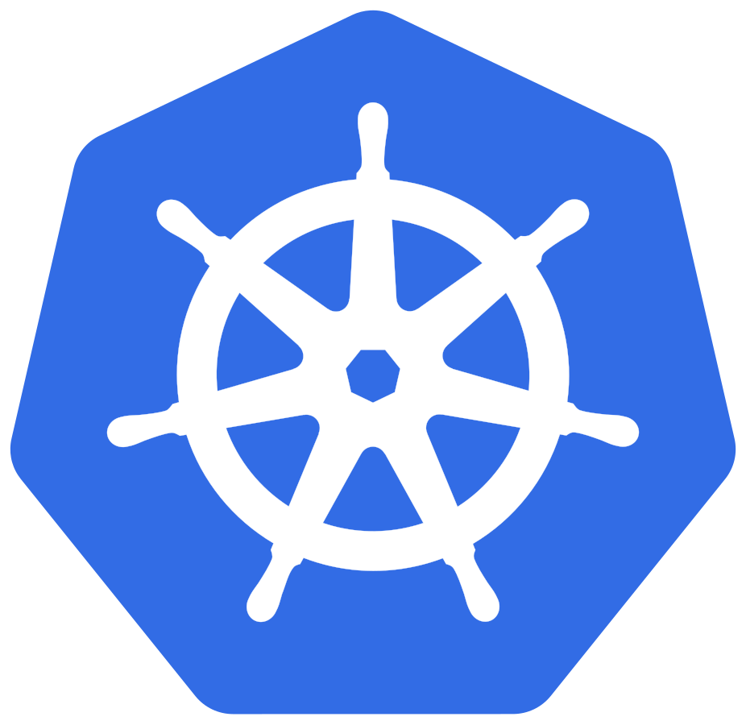
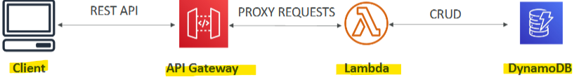

- [Other Compute Services: ECS, Lambda, Batch, Lightsail](#other-compute-services-ecs-lambda-batch-lightsail)
  - [What is Docker?](#what-is-docker)
    - [Introduction to Docker](#introduction-to-docker)
    - [Docker on EC2 Instances](#docker-on-ec2-instances)
    - [Docker vs. Virtual Machines](#docker-vs-virtual-machines)
    - [Key Concepts](#key-concepts)
  - [ECS, Fargate, and ECR Overview](#ecs-fargate-and-ecr-overview)
    - [Introduction to ECS](#introduction-to-ecs)
    - [Introduction to Fargate](#introduction-to-fargate)
    - [Comparison: ECS vs. Fargate](#comparison-ecs-vs-fargate)
    - [Introduction to ECR](#introduction-to-ecr)
  - [Elastic Kubernetes Service (EKS)](#elastic-kubernetes-service-eks)
    - [Introduction to Amazon EKS](#introduction-to-amazon-eks)
    - [Key Features](#key-features)
    - [Benefits of Using Kubernetes on Amazon EKS](#benefits-of-using-kubernetes-on-amazon-eks)
  - [Serverless](#serverless)
    - [Introduction to Serverless](#introduction-to-serverless)
    - [Key Concepts](#key-concepts-1)
    - [Examples of Serverless Services](#examples-of-serverless-services)
    - [AWS Lambda](#aws-lambda)
  - [Lambda Overview](#lambda-overview)
    - [Introduction to AWS Lambda](#introduction-to-aws-lambda)
    - [Key Features](#key-features-1)
    - [Benefits](#benefits)
    - [Supported Languages](#supported-languages)
    - [Common Use Cases](#common-use-cases)
      - [Serverless Thumbnail creation](#serverless-thumbnail-creation)
      - [Serverless CRON Job](#serverless-cron-job)
  - [Lambda Code-along](#lambda-code-along)
    - [Accessing the Lambda Console:](#accessing-the-lambda-console)
    - [Understanding Lambda](#understanding-lambda)
    - [Running a Simple Lambda Function](#running-a-simple-lambda-function)
    - [Invoking Lambda Functions](#invoking-lambda-functions)
    - [Scaling with Lambda](#scaling-with-lambda)
    - [Creating a Lambda Function](#creating-a-lambda-function)
    - [Testing the Lambda Function](#testing-the-lambda-function)
    - [Configuring the Lambda Function](#configuring-the-lambda-function)
    - [Monitoring and Logs](#monitoring-and-logs)
    - [Handling Errors](#handling-errors)
    - [Optimising Lambda Functions](#optimising-lambda-functions)
    - [Additional Notes](#additional-notes)
  - [API Gateway](#api-gateway)
    - [Amazon API Gateway Overview:](#amazon-api-gateway-overview)
    - [Key Concepts](#key-concepts-2)
    - [How It Works](#how-it-works)
    - [Features of API Gateway](#features-of-api-gateway)
  - [Batch Overview](#batch-overview)
    - [AWS Batch Overview](#aws-batch-overview)
    - [Key Concepts](#key-concepts-3)
    - [Defining a Batch Job](#defining-a-batch-job)
    - [Benefits](#benefits-1)
    - [Example Use Case](#example-use-case)
    - [Difference Between AWS Batch and AWS Lambda:](#difference-between-aws-batch-and-aws-lambda)
  - [Lightsail Overview](#lightsail-overview)
    - [Amazon Lightsail Overview](#amazon-lightsail-overview)
    - [Key Concepts](#key-concepts-4)
    - [Features](#features)
    - [Use Cases](#use-cases)
    - [Limitations](#limitations)
  - [Lightsail Code-along](#lightsail-code-along)
    - [Amazon Lightsail Overview:](#amazon-lightsail-overview-1)
    - [Key Concepts](#key-concepts-5)
    - [Creating an Instance](#creating-an-instance)
    - [Features](#features-1)
    - [Use Cases](#use-cases-1)
    - [Limitations](#limitations-1)
    - [Example: Deploying a WordPress Website](#example-deploying-a-wordpress-website)
- [Quiz](#quiz)

 

 

# Other Compute Services: ECS, Lambda, Batch, Lightsail

## What is Docker?

### Introduction to Docker
* Docker is a **software development platform** used to **deploy applications**.
* `Containers`: Applications are packaged into containers, which can **run on any operating system** without compatibility issues.
* `Benefits`: Containers ensure **predictable behavior**, are easier to **maintain** and **deploy**, and can **scale up and down** quickly.

### Docker on EC2 Instances
* `Multiple Containers`: You can run **multiple** Docker containers on a **single EC2 instance**, each running different applications or services (e.g., Java, NodeJS, MySQL).
* `Docker Images`: Containers are created from Docker images, which can be **stored in Docker** repositories like Docker Hub or Amazon ECR (Elastic Container Registry).

### Docker vs. Virtual Machines
* `Resource Sharing`: Docker containers share resources with the **host**, making them more **lightweight** compared to virtual machines.
* `Infrastructure`: Docker runs on the **host OS** and **Docker Daemon**, allowing multiple containers to run efficiently without the overhead of full operating systems.

### Key Concepts
* `Docker Repositories`: Public repositories like Docker Hub and private repositories like Amazon ECR store Docker images.
* `Docker Daemon`: The background service that manages Docker containers on the host OS.

 

 

## ECS, Fargate, and ECR Overview

### Introduction to ECS
`ECS` (Elastic Container Service)
* Used to launch Docker **containers** on AWS.
* Requires **provisioning** and maintaining EC2 instances.
* Works with application load balancers for web applications.
* Automatically places Docker containers on the appropriate EC2 instances.

### Introduction to Fargate
*  Also used to **launch Docker containers** on AWS, but **without the need to manage** EC2 instances.
*  AWS handles the infrastructure, making it a simpler, **serverless** option.
*  **Automatic Scaling**: Runs containers based on specified **CPU** and **RAM** requirements.

### Comparison: ECS vs. Fargate
* `ECS`: Requires **manual provisioning** of EC2 instances.
* `Fargate`: No need to manage EC2 instances; **AWS handles everything**.

### Introduction to ECR
* `ECR` (Elastic Container Registry): A private Docker registry on AWS.
* Stores Docker images that can be used by ECS or Fargate.
* Allows Fargate and ECS to **pull Docker images** and **run containers**.

  

 

 

## Elastic Kubernetes Service (EKS)

### Introduction to Amazon EKS
* Allows you to **launch** and **manage** Kubernetes **clusters** on AWS.
* `Kubernetes`: An open-source system for **managing**, **deploying**, and **scaling** containerised applications, typically managed by Docker containers.

### Key Features
* `Container Hosting`: Containers and pods can be **hosted on EC2 instances** or using Fargate for a **serverless** experience.
* `EKS Nodes`: EKS clusters can have **nodes**, such as EC2 instances, where Docker **containers** are automatically **launched as pods**.

### Benefits of Using Kubernetes on Amazon EKS
* `Managed Service`: Simplifies the process of launching and managing Kubernetes clusters.
* `Cloud Agnostic`: Kubernetes can run on multiple clouds and on-premises infrastructure, making it versatile and flexible.
* `Ease of Use`: Using EKS helps manage the complexity of Kubernetes, making it easier to deploy and scale containerized applications.

 

 

## Serverless

### Introduction to Serverless
* Serverless is a paradigm where **developers don't manage servers**; they just deploy code or functions.
* Initially pioneered as Function as a Service (FaaS) with AWS Lambda.

### Key Concepts
* `Managed Services`: Serverless includes managed services like databases, messaging, and storage.
* `Hidden Servers`: Servers exist but are managed by the provider, not the user.

### Examples of Serverless Services
* `Amazon S3`: Used as a storage layer without managing servers.
* `DynamoDB`: A serverless database that auto-scales based on load.
* `Fargate`: Runs Docker containers without managing EC2 instances.

### AWS Lambda
* Allows running functions in the cloud without managing servers.

 

 

## Lambda Overview

### Introduction to AWS Lambda
* AWS Lambda is a **serverless** compute service that allows you to **run code without provisioning or managing servers**.
* Functions are executed on **demand** and are intended for **short-duration tasks**.

### Key Features
* `On-Demand Execution`: Functions run only when needed, and you are billed only for the compute time used.
* `Automated Scaling`: Lambda automatically scales your application by running code in response to each trigger.
* `Event-Driven`: Functions are invoked by events from other AWS services or direct invocations.

### Benefits
* `Cost-Effective`: Pay per request and compute time. The free tier includes 1 million invocations and 400,000 GB-seconds of compute time per month.
* `Integration`: Fully integrated with the AWS suite of services and supports multiple programming languages.
* `Monitoring`: Easy monitoring through AWS CloudWatch.

### Supported Languages
* `Built-In Support`: Node.js, Python, Java, C#, Ruby.
* `Custom Runtime API`: Supports additional languages like Rust and Golang.

### Common Use Cases
#### Serverless Thumbnail creation
* `Serverless Thumbnail Creation`: Automatically create thumbnails from images uploaded to an S3 bucket and store metadata in DynamoDB.

#### Serverless CRON Job
* `Serverless CRON Jobs`: Use CloudWatch Events or EventBridge to trigger Lambda functions on a schedule.

 

 

## Lambda Code-along

### Accessing the Lambda Console:
* Open the `AWS Lambda` console.
* If you see the default screen, replace `/discover` with `/begin` in the URL to access a more educational interface.

### Understanding Lambda
* Lambda allows you to **run code without managing servers**, making it a truly **serverless** service.
* You can use various **programming languages** like .Net Core, Go, Java, Node.js, Python, Ruby, or any custom runtime.

### Running a Simple Lambda Function
* Write your code and upload it to the Lambda console.
* For example, use Python to create a Lambda handler that prints the event and returns "Hello from Lambda".

* Click on `Run` to execute the function and see the output.

### Invoking Lambda Functions
* Lambda functions can be **invoked manually** by clicking the `Run` button or **automatically** in response to events.
* Events can come from various sources like streaming analytics, mobile IoT backends, or S3 bucket uploads.

### Scaling with Lambda
* Lambda **automatically** scales with the load. 
* As more events **trigger** the function, the number of concurrent Lambda functions running will increase.
* This ensures that Lambda can handle high loads efficiently.

### Creating a Lambda Function
1. Click on `Create function`.
2. Choose `Use a blueprint` and search for "hello world".
3. Select the **Python** version (e.g., Python 3.10).

4. **Name** the function demo-lambda and **create a new role** with basic Lambda permissions.

5. Review the function code, which includes a Lambda handler that prints values and returns key1.

 

### Testing the Lambda Function

1. Click on `Test and create` a new test event named **DemoEvent** with JSON content like {"key1": "value1", "key2": "value2", "key3": "value3"}.

2. Run the test and check the response and logs to ensure the function works correctly.

### Configuring the Lambda Function
1. Adjust memory settings between 128 MB and 10,240 MB as needed.
2. Set the timeout duration between 3 seconds and 15 minutes.

3. Review the execution role created by Lambda for necessary permissions.

### Monitoring and Logs
1. Use the `Monitoring` tab to view invocation metrics, duration, and errors.

2. Access `CloudWatch` Logs to see detailed logs of each invocation.

### Handling Errors
1. Modify the function code to raise exceptions and test error handling.
2. Click "Deploy" to test your changes. 

3. Check `CloudWatch` Logs for error details and troubleshoot as needed.

### Optimising Lambda Functions
* Adjust memory and timeout settings based on function requirements.
* Monitor performance and costs to ensure efficient operation.
* These instructions should help you get started with AWS Lambda, understand its capabilities, and practice running and managing Lambda functions effectively.

### Additional Notes
* `Timeouts`: You can set timeouts between 3 seconds and 15 minutes. Ensure the function runs only for the necessary duration.
* `Execution Role`: The execution role created by Lambda initially is used for permissions.
* `Monitoring`: View invocation metrics, duration, errors, and successes in the Monitoring tab. Integration with CloudWatch provides detailed logs.
* `CloudWatch Logs`: Refresh recent invocations to access log streams. Logs are stored in a log group named after your Lambda function.
* `Modifying Code`: Comment or uncomment lines of code to test different scenarios. Deploy changes before testing.
* `Runtime Settings`: Check the runtime version and handler settings. Ensure the handler points to the correct function in your code.
* `Permissions`: The execution role should have permissions to write to CloudWatch Logs. Review the policy summary for details.

 

 

## API Gateway 

### Amazon API Gateway Overview:
* Used to build serverless HTTP APIs

Example Use Case: 
* Integrates with AWS **Lambda** and **DynamoDB** for **CRUD operations** (Create, Read, Update, Delete).

### Key Concepts
* `Serverless Technologies`: AWS Lambda and DynamoDB.
* `API Exposure`: Lambda functions are **not exposed as APIs** by default. 
  * **API Gateway** is needed to expose them.

### How It Works
* Clients **interact** with the API **Gateway**.
* API Gateway **proxies requests** to Lambda functions.
* Lambda functions handle **data transformations**.

### Features of API Gateway
* `Fully Managed Service`: **Simplifies** API **creation**, **publishing**, **maintenance**, **monitoring**, and **security**.
* `Serverless and Scalable`: No need to manage servers, and it **scales automatically**.
* `Supports Multiple API Types`: **RESTful APIs** and **WebSocket APIs** for **real-time** data **streaming**.
* `Security and Authentication`: Includes features like user **authentication**, API throttling, **API keys**, and monitoring.

 

 

## Batch Overview

### AWS Batch Overview
* Fully **managed** batch **processing service** for running batch jobs at **any scale**.
* `Batch Job`: A job with a defined **start** and **end time** (e.g., starts at 1 a.m. and finishes at 3 a.m.), unlike continuous or streaming jobs that run indefinitely.

### Key Concepts
* `Dynamic Resource Allocation`: AWS Batch **dynamically launches** EC2 instances or Spot Instances to **handle the load of batch jobs**.
* `Compute and Memory Provisioning`: **Automatically provisions** the right amount of **compute** and **memory** for batch queues.
* `Job Submission`: Users submit or schedule batch jobs into the **batch queue**, and **AWS Batch manages** the rest.

### Defining a Batch Job
* `Docker Image`: Batch jobs are defined as Docker images and task definitions that run on the ECS (Elastic Container Service).
* `Compatibility`: Anything that can run on ECS can run on AWS Batch.

### Benefits
* `Automatic Scaling`: Scales the number of EC2 instances or Spot Instances as needed, **optimising costs** and **reducing infrastructure management**.
* `Focus on Jobs`: Allows users to focus on their batch jobs rather than the underlying infrastructure.

### Example Use Case

`Image Processing`: 
* Users submit images to Amazon S3, triggering a batch job. 
* AWS Batch processes the images using an ECS cluster of EC2 instances or Spot Instances and stores the processed images back in Amazon S3.

1. Image Upload
   * Users upload images to Amazon S3.

2. Trigger Batch Job
   * S3 event triggers a batch job via SQS/SNS.

3. AWS Batch
   * AWS Batch provisions EC2 instances or Spot Instances.
   * Runs Docker containers with image processing code.

4. Image Processing
   * Processes images and saves them to another S3 bucket.

 

### Difference Between AWS Batch and AWS Lambda:

| Feature                | AWS Batch                                      | AWS Lambda                                  |
|------------------------|------------------------------------------------|---------------------------------------------|
| **Time Limit**         | No time limit                                  | 15-minute time limit                        |
| **Programming Languages** | Any runtime packaged as a Docker image       | Limited number of supported languages       |
| **Storage**            | Relies on EC2 instance storage (EBS volumes or EC2 instance store) | Limited temporary disk space                |
| **Service Type**       | Managed service relying on EC2 instances       | Serverless                                  |
| **Scaling**            | Automatically scales EC2 instances or Spot Instances | Automatically scales based on demand        |

 

 

## Lightsail Overview

### Amazon Lightsail Overview
* A **stand-alone service** in AWS for users with little to **no cloud experience**.
* Provides virtual servers, storage, databases, and networking in one place.
* Offers low and predictable pricing.

### Key Concepts
* **Easier to us**e compared to other AWS services like EC2, RDS, ELB, EBS, Route53, etc.
* Ideal for users with **little cloud experience** who don't want to learn the intricate details of AWS services.

### Features
* `Monitoring and Notifications`: Allows setting up monitoring and notifications for Lightsail resources.
* `Templates`: Offers templates for **deploying simple web applications** and websites (e.g., LAMP Stack, Nginx, MEAN, Node.js, WordPress, Magento, Plesk, Joomla).

### Use Cases
* `Simple Web Applications`: Deploying basic web applications using provided templates.
* `Simple Websites`: Hosting simple websites with minimal configuration.
* `Development and Test Environments`: Suitable for development and testing environments in AWS.

### Limitations
* `High Availability`: Supports high availability but lacks auto-scaling.
* `AWS Integrations`: Limited integrations with other AWS services.

 

 

## Lightsail Code-along

### Amazon Lightsail Overview:
* A simplified, stand-alone service in AWS for users with little to no cloud experience.
* Provides virtual servers, storage, databases, and networking in one place.
* Offers low and predictable pricing.

### Key Concepts
* Simplified Alternative: Easier to use compared to other AWS services like EC2, RDS, ELB, EBS, Route53, etc.
* Target Audience: Ideal for users with little cloud experience who don't want to learn the intricate details of AWS services.

### Creating an Instance

1. Choose the **region** and AZ for your instance.
2. Select an **instance image** (similar to an AMI in EC2). 
   * Options include OS-only or application blueprints (e.g., WordPress).
3. Choose a **plan** with predefined pricing and resource allocation (RAM, CPU, disk space).

### Features
* Allows setting up **monitoring** and **notifications** for Lightsail resources.
* Offers **templates** for deploying simple web applications and websites (e.g., LAMP Stack, Nginx, MEAN, Node.js, WordPress, Magento, Plesk, Joomla).
* Provides **SSH access** to instances through the browser.

### Use Cases
* `Simple Web Applications`: Deploying basic web applications using provided templates.
* `Simple Websites`: Hosting simple websites with minimal configuration.
* `Development and Test Environments`: Suitable for development and testing environments in AWS.

### Limitations
* `High Availability`: Supports high availability but lacks auto-scaling.
* `AWS Integrations`: Limited integrations with other AWS services.
* `Customisation`: Limited customization options compared to EC2.

### Example: Deploying a WordPress Website
1. Select a WordPress **blueprint**.
2. Choose an **instance plan** (e.g., free tier for the first month).
3. **Create** the instance.
4. Access the instance via **SSH** through the browser.
5. View the WordPress website using the **public IP** address.

 

 

# Quiz

1. How do you get charged in AWS Lambda?
   * Per call and per duration.
   * In AWS Lambda, you are charged per request and compute time, that's it.

2. You would like to launch Docker containers in AWS without worrying about provisioning or managing any infrastructure. The Docker containers will be used to host a heavy workloads to serve different types of requests. Some requests may need up to 30 minutes to be completed. Which AWS service should you use to run Docker containers in a Serverless way and satisfy the requirements?
   * AWS Fargate.
   * Fargate allows you to launch Docker containers on AWS, and you don't need to provision and maintain the infrastructure (=no EC2 instances to manage). 
   * It is Serverless.

3. A complete cloud beginner would like to create a simple application with predictable pricing. What service should this person use?
   * Amazon Lightsail.
   * Amazon Lightsail is designed to be the easiest way to launch and manage a virtual private server with AWS. 
   * Lightsail plans include everything you need to jumpstart your project – a virtual machine, SSD- based storage, data transfer, DNS management, and a static IP address – for a low, predictable price. 
   * It can be used to create a simple web application, a website or a dev/test environment.

4. What is the name of the software development platform that allows you to run applications the same way, regardless of where they are run?
   * Docker.
   * Docker is a software development platform that allows you to run applications the same way, regardless of where they are run. 
   * It can scale containers up and down within seconds.

5. How would you best describe "event-driven" in AWS Lambda?
   * Happens when needed.
   * "Event-driven" in Lambda means that functions are invoked when needed. 
   * They are triggered.

6. Which AWS service allows you to launch Docker containers on AWS, but requires you to provision and maintain the infrastructure?
   * Elastic Container Service (ECS).
   * ECS allows you to launch Docker containers on AWS, but you must provision and maintain the infrastructure (i.e. EC2 instances).

7. Which of the following statements is INCORRECT regarding the definition of the term "serverless"?
   * "There are no servers".
   * Serverless does not mean that there are no servers, you just do not manage, provision and see them, but they do exist.

8. Which of the following statements is NOT a feature of AWS Lambda?
   * "Definition of a minimum and maximum of EC2 instances running".
   * This is a feature of Auto Scaling Groups, not AWS Lambda.

9. A company needs to run thousands of jobs but would like to NOT manage the compute resources. What service can it use?
    * AWS Batch.
    * AWS Batch enables developers, scientists, and engineers to easily and efficiently run hundreds of thousands of batch computing jobs on AWS. 
    * AWS Batch dynamically provisions the optimal quantity and type of compute resources (e.g., CPU or memory-optimised instances) based on the volume and specific resource requirements of the batch jobs submitted.

10. Where should you store your private Docker images so they can be run by ECS or Fargate?
    * Amazon Elastic Container Registry (ECR).
    * Elastic Container Registry (ECR) is a service where you store your Docker image so they can be run by ECS or Fargate.

11. Which AWS serverless service can be used by developers to create APIs?
    * API Gateway.
    * Amazon API Gateway is a fully managed serverless service that makes it easy for developers to create, publish, maintain, monitor, and secure APIs at any scale.

 

