- [Databases and Analytics](#databases-and-analytics)
  - [Database Introduction](#database-introduction)
    - [Introduction to Databases](#introduction-to-databases)
    - [Types of Databases](#types-of-databases)
      - [Relational Databases](#relational-databases)
      - [NoSQL Databases](#nosql-databases)
    - [JSON in NoSQL Databases](#json-in-nosql-databases)
    - [Shared Responsibility Model for Databases on AWS](#shared-responsibility-model-for-databases-on-aws)
      - [AWS Responsibilities](#aws-responsibilities)
      - [User Responsibilities](#user-responsibilities)
    - [Benefits of Managed Databases on AWS](#benefits-of-managed-databases-on-aws)
    - [Running Your Own Database on EC2](#running-your-own-database-on-ec2)
  - [RDA \& Aurora Overview](#rda--aurora-overview)
    - [Introduction to Relational Databases](#introduction-to-relational-databases)
    - [Benefits of Using RDS](#benefits-of-using-rds)
    - [RDS in Solution Architecture](#rds-in-solution-architecture)
    - [Amazon Aurora](#amazon-aurora)
    - [Aurora Serverless](#aurora-serverless)
  - [RDS Code-along](#rds-code-along)
    - [Introduction to RDS](#introduction-to-rds)
    - [Creating a Database in RDS](#creating-a-database-in-rds)
      - [Step-by-Step Process](#step-by-step-process)
      - [Configure Settings](#configure-settings)
      - [Instance Configuration](#instance-configuration)
      - [Connectivity](#connectivity)
    - [Managing the Database](#managing-the-database)
    - [Deleting the Database](#deleting-the-database)
  - [RDS Deploments Options](#rds-deploments-options)
    - [RDS Read Replica](#rds-read-replica)
      - [How It Works](#how-it-works)
    - [Multi-AZ (Availability Zone)](#multi-az-availability-zone)
      - [How It Works](#how-it-works-1)
    - [Multi-Region](#multi-region)
      - [How It Works](#how-it-works-2)
    - [Benefits](#benefits)
    - [Considerations](#considerations)
  - [ElastiCache Overview](#elasticache-overview)
    - [Introduction to Amazon ElastiCache](#introduction-to-amazon-elasticache)
    - [Benefits of Using ElastiCache](#benefits-of-using-elasticache)
    - [Use Cases](#use-cases)
    - [Solution Architecture](#solution-architecture)
      - [Components](#components)
      - [Workflow](#workflow)
  - [DynamoDB Overview](#dynamodb-overview)
    - [Introduction to DynamoDB](#introduction-to-dynamodb)
    - [Key Features](#key-features)
    - [Data Structure - Type of Data](#data-structure---type-of-data)
    - [DynamoDB Accelerator (DAX)](#dynamodb-accelerator-dax)
  - [DynamoDB Code-along](#dynamodb-code-along)
    - [Creating a Table in DynamoDB](#creating-a-table-in-dynamodb)
    - [Understanding Serverless Nature](#understanding-serverless-nature)
    - [Inserting Data into the Table](#inserting-data-into-the-table)
      - [Create Item](#create-item)
    - [Key Differences from Relational Databases](#key-differences-from-relational-databases)
    - [Deleting the Table](#deleting-the-table)
  - [DynamoDB Global Tables](#dynamodb-global-tables)
    - [Introduction to DynamoDB Global Tables](#introduction-to-dynamodb-global-tables)
    - [How It Works](#how-it-works-3)
    - [Benefits](#benefits-1)
  - [Redshift Overview](#redshift-overview)
    - [Introduction to Amazon Redshift](#introduction-to-amazon-redshift)
    - [Key Features](#key-features-1)
    - [Redshift Serverless](#redshift-serverless)
      - [How It Works](#how-it-works-4)
  - [EMR Overview](#emr-overview)
    - [Introduction to Amazon EMR](#introduction-to-amazon-emr)
    - [Key Features](#key-features-2)
    - [Use Cases](#use-cases-1)
  - [Athena Overview](#athena-overview)
    - [Introduction to Amazon Athena](#introduction-to-amazon-athena)
    - [Supported File Formats](#supported-file-formats)
    - [How It Works](#how-it-works-5)
    - [Pricing](#pricing)
    - [Use Cases](#use-cases-2)
  - [QuickSight Overview](#quicksight-overview)
    - [Introduction to Amazon QuickSight](#introduction-to-amazon-quicksight)
    - [Key Features](#key-features-3)
    - [Use Cases](#use-cases-3)
    - [Integrations](#integrations)
  - [DocumentDB Overview](#documentdb-overview)
    - [Introduction to Amazon DocumentDB](#introduction-to-amazon-documentdb)
    - [Key Features](#key-features-4)
    - [Use Cases](#use-cases-4)
      - [Exam Tips](#exam-tips)
  - [Neptune Overview](#neptune-overview)
    - [Introduction to Amazon Neptune](#introduction-to-amazon-neptune)
    - [Key Features](#key-features-5)
    - [Use Cases](#use-cases-5)
      - [Exam Tips](#exam-tips-1)
  - [TimeStream Overview](#timestream-overview)
    - [Introduction to Amazon Timestream](#introduction-to-amazon-timestream)
    - [Key Features](#key-features-6)
    - [Use Cases](#use-cases-6)
  - [QLDB Overview](#qldb-overview)
    - [Introduction to Amazon QLDB](#introduction-to-amazon-qldb)
    - [Key Features](#key-features-7)
    - [How It Works](#how-it-works-6)
    - [Use Cases](#use-cases-7)
    - [Comparison with Amazon Managed Blockchain](#comparison-with-amazon-managed-blockchain)
  - [Managed Blockchain Overview](#managed-blockchain-overview)
    - [Introduction to Amazon Managed Blockchain](#introduction-to-amazon-managed-blockchain)
    - [Key Features](#key-features-8)
    - [Use Cases](#use-cases-8)
  - [Glue Overview](#glue-overview)
    - [Introduction to AWS Glue](#introduction-to-aws-glue)
    - [Key Features](#key-features-9)
    - [How It Works](#how-it-works-7)
    - [Glue Data Catalog](#glue-data-catalog)
  - [Database Migration Service (DMS) Overview](#database-migration-service-dms-overview)
    - [Introduction to AWS DMS](#introduction-to-aws-dms)
    - [Key Features](#key-features-10)
    - [Types of Migrations](#types-of-migrations)
      - [Homogeneous Migration](#homogeneous-migration)
      - [Heterogeneous Migration](#heterogeneous-migration)
    - [How It Works](#how-it-works-8)
- [Quiz](#quiz)

 

 

# Databases and Analytics

## Database Introduction

### Introduction to Databases
* Databases **store** **data** in a **structured way**, allowing efficient querying and indexing.
* `Types of Storage`: EBS drives, EBS volumes, EC2 Instance Store, Amazon S3.
* Databases provide more structure and allow defining relationships between datasets.

 

### Types of Databases

#### Relational Databases
* Looks just like Excel spreadsheets, with links between them.
* Can use the SQL language to perform queries / lookups.
* `Structure`: Tables with defined relationships (e.g., students table linked to departments table).
* `Query Language`: Uses SQL (Structured Query Language) for queries and lookups.

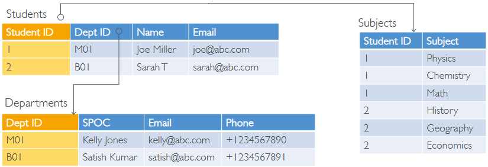

 

#### NoSQL Databases
* NoSQL = Non-SQL = non-relational databases.
* Built for specific purposes with flexible schemas.
* NoSQL databases are purpose built for specific data models and have flexible schemas for building modern applications.

`Benefits`:
* Flexibility: easy to evolve data model
* Scalability: designed to scale-out by using distributed clusters
* High-performance: optimized for a specific data model
* Highly functional: types optimized for the data model

**Examples**: Key-value databases, document databases, graph databases, in-memory databases, search databases.
* `Data Format`: Often uses JSON (JavaScript Object Notation) for data representation.

### JSON in NoSQL Databases
* JSON is a common way to **describe data**, with **nested fields** and support for arrays.
  * **Example**: A JSON document can have nested elements like an address within a higher object.

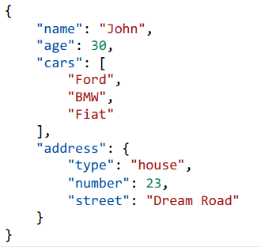

 

### Shared Responsibility Model for Databases on AWS

#### AWS Responsibilities
* Infrastructure management, including durability, availability, and compliance.
* Patching the operating system and database software.
* Monitoring and alerting integration.

#### User Responsibilities
* Setting up S3 Versioning and Bucket Policies.
* Enabling logging and monitoring.
* Optimising storage costs.
* Encrypting data if needed.

### Benefits of Managed Databases on AWS
* `Quick Provisioning`: Easy to set up and use.
* `High Availability`: Designed with high availability in mind.
* `Scalability`: Supports vertical and horizontal scaling.
* `Automated Backup and Restore`: Includes utilities for automated backups and restores.
* `Operations and Upgrades`: AWS handles operations and upgrades, reducing user responsibility.

### Running Your Own Database on EC2
* `Challenges`: Users must handle resiliency, backup, patching, high availability, fault tolerance, and scaling.
* `Managed Databases`: Using managed databases on AWS simplifies these tasks and provides significant benefits.

 

 

## RDA & Aurora Overview

### Introduction to Relational Databases
* `RDS` (Relational Database Service): A **managed database service** for relational databases using SQL as a query language. 
  * It allows you to **create and manage** **databases** in the **cloud**.
* Supported Databases: PostgreSQL, MySQL, MariaDB, Oracle, Microsoft SQL Server, IBM DB2, and Amazon Aurora.

 

### Benefits of Using RDS
* `Automatic` Provisioning: AWS handles the setup and configuration.
* `Patching`: AWS manages operating system patches.
* `Continuous Backups`: Includes Point in Time Restore options.
* `Monitoring Dashboards`: Provides insights into database performance.
* `Read Replicas`: Allows scaling of read operations.
* `Multi-AZ Setup`: Ensures disaster recovery across availability zones.
* `Maintenance Windows`: Schedule upgrades and maintenance.
* `Scalability`: Supports vertical and horizontal scaling.
* `EBS-Backed Storage`: Reliable and durable storage.
* `No SSH Access`: Users cannot SSH into RDS instances.

 

### RDS in Solution Architecture
* Load balancer fronts multiple backend EC2 instances, which **connect to an RDS database** for **structured data storage and retrieval**.
* Components: Load balancer, EC2 instances (application logic), and RDS database (data storage).

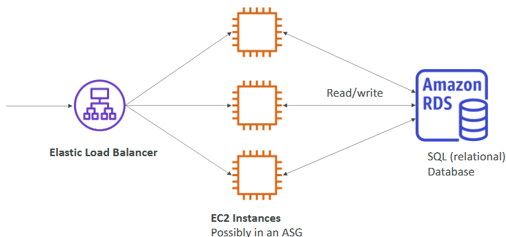

 

### Amazon Aurora
* `Cloud-Optimized Database`: Proprietary to AWS, supports PostgreSQL and MySQL.
* `Performance`: 5x improvement over MySQL on RDS, 3x improvement over PostgreSQL on RDS.
* `Automatic Storage Scaling`: Grows in 10 GB increments up to 128 TB.
* `Cost`: Approximately 20% more expensive than RDS but more efficient.
* `Not Included in Free Tier`: Unlike RDS, Aurora is not part of the AWS free tier.

 

### Aurora Serverless
* `Serverless Option`: Automated database instantiation and auto-scaling based on usage.
* `Supported Engines`: PostgreSQL and MySQL.
* `No Capacity Planning`: No need to manage servers, pay per second.
* `Ideal Use Cases`: Infrequent, intermittent, or unpredictable workloads.
* `How It Works`: Clients connect to a managed proxy fleet, which instantiates database instances as needed, sharing the same storage volume.

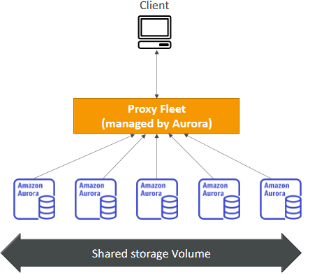

 

 

## RDS Code-along

### Introduction to RDS
`RDS` (Relational Database Service)
* A **managed service** for **relational databases** using SQL. 
* It supports various database engines like MySQL, PostgreSQL, MariaDB, Oracle, Microsoft SQL Server, and Amazon Aurora.

 

### Creating a Database in RDS

#### Step-by-Step Process
1. Go to the `RDS` section in the `AWS Management Console`.
2. Click on "Create database".
3. Select "Standard create" for customization or "Easy create" for recommended configurations.
4. Choose the database engine (e.g., MySQL).
5. Select the **latest** recommended version.
6. Choose a **template** (e.g., Free Tier) to pre-fill settings.

#### Configure Settings
1. DB Identifier: Name your **database** (e.g., database-1).
2. Master Username: Set a **username** (e.g., admin).
3. Master Password: Enter and confirm the **password**.

#### Instance Configuration
1. Choose the instance type (e.g., db.t2.microfor Free Tier).
2. Configure storage settings (e.g., 20 GB gp2 SSD, storage autoscaling).

#### Connectivity
1. Select a `Virtual Private Cloud` (VPC).
2. Enable public access if needed.
3. Create or select a security group (e.g., demo-database-rds).
4. Default is **3306** for MySQL.
5. Choose the authentication method (e.g., password).
6. Click "Create database".

### Managing the Database
* `Monitoring`: Access monitoring dashboards for CPU utilization and other metrics.
* `Snapshots`: Take snapshots of your database for backup and restoration.
  * **Create** Snapshot: Go to Actions > Take Snapshot.
  * **Restore** Snapshot: Use snapshots to create new databases.
  * **Copy** Snapshot: Copy snapshots to different regions for disaster recovery.
  * **Share** Snapshot: Share snapshots with other AWS accounts.

### Deleting the Database
* Go to `Actions` > `Delete Snapshot`.
* Go to `Actions` > `Delete`, confirm deletion, and type "delete me".

 

 

## RDS Deploments Options

### RDS Read Replica
* Used to scale read workloads by creating replicas of your main RDS database.

#### How It Works
* Applications **read from multiple** `Read Replicas`.
* **Write** operations are only performed on the **main database**.
* You can create up to 15 Read Replicas.
  * **Example**: If you have two Read Replicas, your applications can read from all of them, distributing the read load.

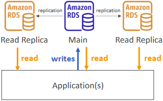

 

### Multi-AZ (Availability Zone)
* Provides high availability and failover support in case of an AZ outage.

#### How It Works
* Applications **read and write** from the **main RDS database**.
* A replication is set up across **different AZs**, creating a **failover database**.
* In case of a failure, RDS triggers a failover to the secondary database in a different AZ.
* The failover database is passive and only becomes active during a failure.
* Only one other AZ can be used as a failover AZ.

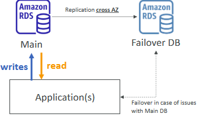

 

### Multi-Region
* Provides **disaster recovery** and **improved performance** for applications in different regions.

#### How It Works
* Read Replicas are created **across different regions**.
* Applications in **different regions** **read from their local Read Replica**, reducing latency.
* **Write** operations must still be performed on the **main database** in the **original region**.
  * Example: An RDS database in EU-West 1 with Read Replicas in US-East 2 and AP-Southeast 2.

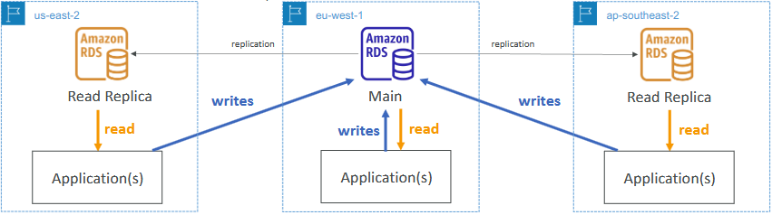

 

### Benefits
* Disaster recovery in case of a regional issue.
* Better performance for applications in different regions due to local reads.

### Considerations
* There are replication costs associated with network transfers of data between regions.

 

 

## ElastiCache Overview

### Introduction to Amazon ElastiCache
* Managed service for in-memory databases, specifically Redis or Memcached.
* High performance and low latency, ideal for read-intensive workloads.

### Benefits of Using ElastiCache
* `Reduce Database Load`: Offloads read queries from the main database, reducing pressure.
* `Managed Service`: AWS handles maintenance, patching, optimizations, setup, configuration, monitoring, failure recovery, and backups.

### Use Cases
* `In-Memory Database`: Anytime you need an in-memory database, think of ElastiCache.
* `Read-Intensive Workloads`: Ideal for applications with frequent read queries.

 

### Solution Architecture

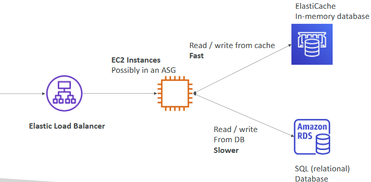

 

#### Components
* `Elastic Load Balancer`: Distributes incoming traffic to EC2 instances.
* `EC2 Instances`: Handle application logic, possibly in an Auto Scaling Group (ASG).
* `Amazon RDS Database`: Stores structured data, but can be slow for frequent read queries.
* `Amazon ElastiCache`: Caches frequently accessed data, providing fast in-memory access.

#### Workflow
* The Elastic Load Balancer **directs traffic** to EC2 instances.
* EC2 instances **read and write data** from the Amazon **RDS database**.
* Frequently accessed data is cached in Amazon ElastiCache, reducing load on the RDS database and improving performance.

 

 

## DynamoDB Overview

### Introduction to DynamoDB
* DynamoDB is a **fully managed**, highly available NoSQL database with replication across three availability zones.
* Unlike RDS or ElastiCache, DynamoDB does not require provisioning of instance types, making it a **serverless database**.

### Key Features
* `Scalability`: Scales to millions of requests per second, trillions of rows, and hundreds of terabytes of storage.
* `Performance`: Provides fast and consistent performance with single-digit millisecond latency.
* `Integration`: Integrated with IAM for security, authorization, and administration.
* `Cost-Effective`: Offers low cost and auto-scaling capabilities.
* `Table Classes`: Includes standard and infrequent access (IA) table classes for cost savings.

### Data Structure - Type of Data
* Data is stored in a **key-value** format.
* **Primary Key**: Consists of one or two columns (partition key and sort key).
* Attributes: Additional columns can be defined for your data.
* Items are stored **row by row**.

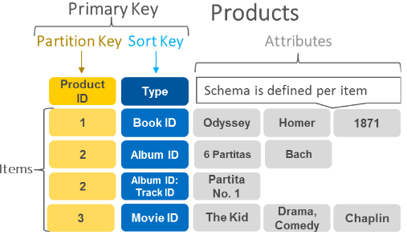

 

### DynamoDB Accelerator (DAX)
* Fully managed **in-memory cache** specifically for DynamoDB.
* Provides a 10x **performance improvement**, **reducing latency** to microseconds.
* **Fully integrated** with DynamoDB, unlike ElastiCache which can be used for other databases.
* Use Case: Ideal for caching frequently read objects to improve read performance.

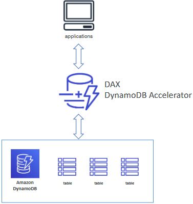

 

 

## DynamoDB Code-along

### Creating a Table in DynamoDB

Step-by-Step Process:
1. Go to the `DynamoDB` section in the AWS Management Console and click on "Create table".
2. Name your table (e.g., DemoTable).
3. Specify a **partition key** (e.g., user_id). 
   * Sort keys are not required for this example.
4. Leave the settings as **default** and click on "Create table".

### Understanding Serverless Nature
* DynamoDB is **serverless**, meaning you don't need to provision or manage servers. 
  * You simply create tables and store data.
* DynamoDB allows you to insert items with **different attributes**, making it a **flexible database**.

### Inserting Data into the Table
* Once the table is created, click on "View items" to insert data.

#### Create Item
Example 1:
* user_id: 1234
* first_name: Stephane
* last_name: Maarek
* favorite_number: 42

Example 2:
* user_id: 45678
* first_name: Alice

### Key Differences from Relational Databases
* All data lives within a **single table**, and there are no joins with other tables.
* DynamoDB is a `NoSQL database`, meaning it does **not** use SQL for **queries** and does **not** **support relational data** models.

### Deleting the Table
* When done, you can delete the table by selecting it and choosing "Delete". 
* Confirm the deletion by typing "delete" in the confirmation box.

 

 

## DynamoDB Global Tables

### Introduction to DynamoDB Global Tables
* DynamoDB Global Tables allow you to make your DynamoDB tables **accessible** with **low latency** across **multiple regions**.
* `Key Feature`: Provides low-latency access to data in multiple regions.

### How It Works
* Start with a DynamoDB table in one region (e.g., us-east-1).
* Set up replication to other regions (e.g., eu-west-3 in Paris).
* Data is replicated between regions, ensuring consistency.

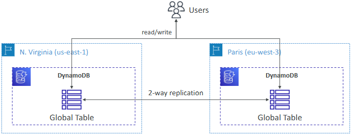

 

### Benefits
* `Low Latency`: Users in different regions can access the table with low latency.
* `Global Accessibility`: The table can be accessed from 1 to 10 regions.
* `Active-Active Replication`: Users can read and write to the table in any region, and changes are replicated across all regions.

 

 

## Redshift Overview

### Introduction to Amazon Redshift
* Redshift is a database based on `PostgreSQL`, designed for `Online Analytical Processing` (OLAP) rather than `Online Transaction Processing` (OLTP).
* Ideal for **analytics** and data **warehousing**.

### Key Features
* `Performance`: Offers 10x better performance than other data warehouses and scales to petabytes of data.
* `Columnar Storage`: Data is stored in columns, which is efficient for analytical queries.
* `Massively Parallel Processing` (MPP): Uses MPP engine for fast computations.
* `Pay-As-You-Go`: Charges are based on the instances you provision.
* `SQL Interface`: Supports SQL for querying data.
* `BI Integration`: Integrated with business intelligence tools like QuickSight and Tableau for creating dashboards.

### Redshift Serverless
* Allows you to run Redshift **without managing the infrastructure**.
* `Cost Efficiency`: Pay only for the compute and storage used during analysis.
* Use Cases: Suitable for reporting, dashboarding applications, and real-time analytics.

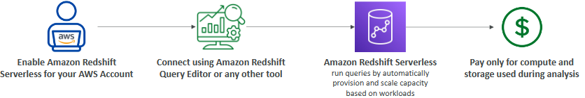

 

#### How It Works
1. Enable `Redshift Serverless` on your account.
2. Connect to the `Redshift Query Editor` or other tools to write queries.
3. Redshift Serverless **automatically provisions** and **scales capacity** based on workload.
4. Pay only for the resources used during analysis.

 

 

## EMR Overview

### Introduction to Amazon EMR
* Amazon EMR (`Elastic MapReduce`) is not a traditional database. 
* It is used to **create Hadoop clusters** for big data processing on AWS.

`Hadoop Clusters`: Hadoop is an **open-source technology** that allows **multiple servers to work together in a cluster** to **analyse** and **process** vast amounts of **data**.

### Key Features
* `Cluster Creation`: EMR allows you to create clusters made of hundreds of EC2 instances that collaborate to analyze data.
* `Hadoop Ecosystem`: Includes projects like Apache Spark, HBase, Presto, and Flink, which work on top of your Hadoop cluster.
* `Provisioning and Configuration`: EMR takes care of provisioning and configuring EC2 instances to work together for big data analysis.
* `Auto-Scaling`: Supports auto-scaling and is integrated with Spot instances for cost efficiency.

### Use Cases
* `Data Processing`: Efficiently processes large datasets.
* `Machine Learning`: Supports machine learning workloads.
* `Web Indexing`: Useful for indexing large amounts of web data.
* `Big Data`: General big data processing and analysis.

 

 

## Athena Overview

### Introduction to Amazon Athena
* Amazon Athena is a `serverless query service` designed to **perform analytics on objects stored** in Amazon S3.
* **Query Language**: Uses SQL to query data directly from S3 without needing to load it into a database.

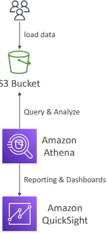

 

### Supported File Formats
* Athena supports **various** file formats, including CSV, JSON, ORC, Avro, and Parquet.
* Built on the **Presto** engine for **efficient querying**.

### How It Works
* Users store data in Amazon S3.
* Athena **queries** and **analyses** the **data** **directly** from S3.
* Can **integrate with tools** like Amazon QuickSight for reporting and visualization.

### Pricing
* `Cost`: Approximately $5 per terabyte of data scanned.
* `Cost Savings`: Using compressed or columnar data formats can reduce costs by minimising the amount of data scanned.

### Use Cases
* `Business Intelligence`: Ideal for BI, analytics, and reporting.
* `Log Analysis`: Useful for analyzing VPC Flow Logs, ELB Logs, CloudTrail logs, and other platform logs.
* `Serverless Analytics`: Anytime you need serverless analytics on data stored in S3 using SQL, Athena is the go-to service.

 

 

## QuickSight Overview

### Introduction to Amazon QuickSight
* Amazon QuickSight is a serverless, machine learning-powered business intelligence service designed to create interactive dashboards.
* `Key Feature`: Allows you to visually represent your data and provide insights to business users.

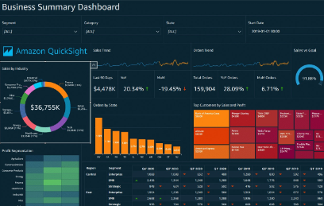

 

### Key Features
* `Fast and Scalable`: Automatically scales to meet your needs.
* `Embeddable`: Can be embedded into applications.
* `Per-Session Pricing`: No need to provision servers; you pay per session.

### Use Cases
* `Business Analytics`: Ideal for analysing business data.
* `Building Visualisations`: Create various types of graphs and charts.
* `Ad-Hoc Analysis`: Perform on-the-fly data analysis.
* `Business Insights`: Gain insights from your data to inform decision-making.

### Integrations
QuickSight can integrate with multiple AWS services, including:

* RDS (Relational Database Service).
* Aurora.
* Athena.
* Redshift.
* Amazon S3.

 

 

## DocumentDB Overview

### Introduction to Amazon DocumentDB
* Amazon DocumentDB is a **fully managed NoSQL database service** designed to be `compatible with MongoDB`.
* Based on MongoDB technology, it is used to **store**, **query**, and **index JSON data**.

### Key Features
* `Fully Managed`: AWS handles the management, maintenance, and scaling of the database.
* `High Availability`: Data is replicated across three availability zones to ensure high availability.
* `Automatic Storage Scaling`: Storage automatically grows in increments of 10 gigabytes.
* `Scalability`: Engineered to handle workloads with millions of requests per second.

### Use Cases
* `NoSQL Database`: Ideal for applications requiring a NoSQL database.
* `MongoDB Compatibility`: Suitable for applications that use MongoDB.

#### Exam Tips
* `MongoDB`: If you see anything related to MongoDB in the exam, think of DocumentDB.
* `NoSQL Databases`: For NoSQL database-related questions, consider both DocumentDB and DynamoDB.

 

 

## Neptune Overview

### Introduction to Amazon Neptune
* Amazon Neptune is a **fully-managed graph database** designed to handle highly connected datasets.
* Ideal for **applications** like social networks where entities (e.g., users, posts, comments) are **interconnected**.

 

### Key Features
* `Replication`: Data is replicated across three Availability Zones (AZs) for high availability.
* `Read Replicas`: Supports up to 15 read replicas to scale read operations.
* `Performance`: Optimised for complex queries on graph datasets, providing millisecond latency.
* `Scalability`: Can store billions of relationships and handle large-scale graph data.

### Use Cases
* `Social Networks`: Managing relationships and interactions between users.
* `Knowledge Graphs`: Storing interconnected information, like the Wikipedia database.
* `Fraud Detection`: Identifying patterns and connections in data to detect fraudulent activities.
* `Recommendation Engines`: Analysing user preferences and behaviors to provide recommendations.

#### Exam Tips
* `Graph Databases`: Anytime you see references to graph databases in the exam, think of Amazon Neptune.

 

 

## TimeStream Overview

### Introduction to Amazon Timestream
* Amazon Timestream is a **fully managed**, fast, scalable, and **serverless** **database** designed specifically for **time series data**.
* `Time Series Data`: Data that **evolves over time**, such as metrics, events, or measurements recorded at different points in time.

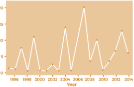

 

### Key Features
* `Automatic Scaling`: Scales up and down automatically based on capacity and compute needs.
* `High Performance`: Capable of storing and analyzing trillions of events per day.
* `Cost Efficiency`: Approximately 1,000 times faster and one-tenth the cost of traditional relational databases.
* `Real-Time Analytics`: Supports time series analytics functions to identify patterns in real-time data.

### Use Cases
* `Time Series Data`: Ideal for applications that require storing and analyzing time series data, such as IoT applications, monitoring systems, and financial data analysis.

 

 

## QLDB Overview

### Introduction to Amazon QLDB
* Amazon QLDB (Quantum Ledger Database) is a **fully managed**, serverless, and highly available database designed to **maintain a ledger of financial transactions**.
* `Ledger`: A ledger is a book recording financial transactions, and QLDB serves this purpose in a **digital format**.

### Key Features
* `Immutability`: Once data is written to QLDB, it cannot be removed or modified, ensuring data integrity.
* `Cryptographic Verification`: Uses cryptographic hashes to guarantee that data has not been altered or deleted.
* `Replication`: Data is replicated across three availability zones for high availability.
* `Performance`: Offers 2-3 times better performance than common ledger blockchain frameworks.
* `SQL Support`: Allows data manipulation using SQL.

### How It Works
* `Journal`: Behind the scenes, QLDB maintains a journal that **records** a **sequence of modifications**. 
  * Each modification is cryptographically **hashed** to ensure integrity.
* `Verification`: The cryptographic hashes can be **verified** by anyone **using the database**, ensuring transparency and trust.

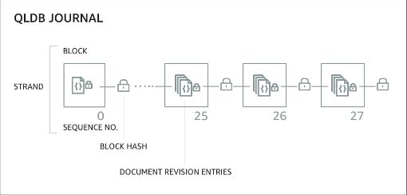

 

### Use Cases
* `Financial Transactions`: Ideal for applications that require a **reliable** and **immutable record** of financial transactions.
* `Regulatory Compliance`: Ensures compliance with financial regulations by maintaining an immutable ledger.

### Comparison with Amazon Managed Blockchain
* `Central Authority`: QLDB has a central authority component, meaning it is managed by AWS.
* `Decentralisation`: Unlike QLDB, Amazon Managed Blockchain supports decentralisation, allowing multiple parties to participate in the ledger.

 

 

## Managed Blockchain Overview

### Introduction to Amazon Managed Blockchain
* Amazon Managed Blockchain is a service that allows you to **join public blockchain networks** or **create your own** scalable private blockchain network within AWS.
* `Decentralisation`: Enables **multiple** parties to **execute transactions** without the need for a trusted central authority.

### Key Features
* `Blockchain Frameworks`: Compatible with two blockchain frameworks:
  * Hyperledger Fabric
  * Ethereum
* `Scalability`: Supports the creation of scalable blockchain networks.

### Use Cases
* `Decentralised Applications`: Ideal for building applications where decentralization is crucial.
* `Public and Private Networks`: Can be used to join public blockchain networks or create private ones.

 

 

## Glue Overview

### Introduction to AWS Glue
* AWS Glue is a managed `Extract`, `Transform`, and `Load` (ETL) `service`.
* `ETL`: ETL is used to prepare and transform datasets into the right format for analytics.

### Key Features
* `Serverless`: Fully serverless, meaning you don't need to manage servers.
* `Data Transformation`: Focus on transforming data while Glue handles the rest.

### How It Works
ETL Process:
* `Extract`: Pull data from sources like Amazon S3 and Amazon RDS.
* `Transform`: Use Glue to transform the data as needed.
* `Load`: Load the transformed data into destinations like Amazon Redshift for analytics.

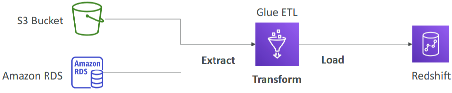

 

### Glue Data Catalog
* A catalog of your datasets in AWS infrastructure.
* Contains metadata such as column names, field names, and field types.
* Used by services like Athena, Redshift, and EMR to discover datasets and build schemas.

 

 

## Database Migration Service (DMS) Overview

### Introduction to AWS DMS
* AWS Database Migration Service (DMS) is designed to **migrate data** from **one database to another**.
* It runs on an **EC2 instance** that handles the migration process.

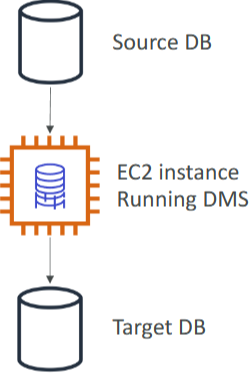

 

### Key Features
* `Quick and Secure Migration`: Ensures a fast and secure migration process.
* `Resilient and Self-Healing`: The service is designed to be resilient and self-healing.
* `Source Database Availability`: The source database remains available during the migration, so there's no downtime.

 

### Types of Migrations
#### Homogeneous Migration 
* Migrating between the **same** database technologies (e.g., Oracle to Oracle).

#### Heterogeneous Migration
* Migrating between **different** database technologies (e.g., Microsoft SQL Server to Aurora). 
* DMS can **convert data from the source to the target** format.

### How It Works
* `Extract Data`: DMS extracts data from the source database.
* `Transform Data`: If needed, DMS transforms the data to match the target database format.
* `Load Data`: DMS inserts the data into the target database.

 

# Quiz

1. You want to create a decentralized blockchain on AWS. Which AWS service would you use?
   * Amazon Managed Blockchain is a fully managed service that makes it easy to create and manage scalable blockchain networks using the popular open source frameworks Hyperledger Fabric and Ethereum. 
   * It allows multiple parties to execute transactions without the need of a trusted, central authority.

2. Which AWS database is a data warehouse?
   * Amazon Redshift is a fully managed, petabyte-scale data warehouse service in the cloud.

3. Which AWS service is always serverless and has SQL capabilities?
   * Amazon Athena.
   * Amazon Athena is an interactive query service that makes it easy to analyse data in Amazon S3 using standard SQL. 
   * Athena is serverless, so there is no infrastructure to manage, and you pay only for the queries that you run.

4. You would like to use a serverless service to prepare data so it can be loaded for analytics. Which service would you use?
   * AWS Glue.
   * AWS Glue is a fully managed extract, transform, and load (ETL) service that makes it easy for customers to prepare and load their data for analytics.

5. Which relational database is a proprietary technology from AWS and is cloud-optimized?
   * Amazon Aurora.
   * Amazon Aurora is a MySQL and PostgreSQL-compatible relational database built for the cloud, that combines the performance and availability of traditional enterprise databases with the simplicity and cost-effectiveness of open source databases. 
   * It is a proprietary technology from AWS.

6. You would like to migrate databases to AWS while still being able to use the database during the migration. What service allows you to do this?
   * Database Migration Service (DMS).
   * AWS Database Migration Service helps you migrate databases to AWS quickly and securely. 
   * The source database remains fully operational during the migration, minimising downtime to applications that rely on the database.

7. How can you create Hadoop clusters to analyze and process a vast amount of data?
   * Elastic MapReduce (EMR).
   * Amazon EMR is a web service that enables businesses, researchers, data analysts, and developers to easily and cost-effectively process vast amounts of data. 
   * EMR helps creating Hadoop clusters (Big Data) to analyze and process vast amount of data.

8. Which in-memory AWS database can you use to reduce the load off databases and has high performance, low latency?
   * ElastiCache.
   * Amazon ElastiCache is a web service that makes it easy to deploy and run Memcached or Redis protocol-compliant server nodes in the cloud. 
   * ElastiCache caches are in-memory databases with high performance, low latency. 
   * They help reduce load off databases for read intensive workloads.

9. What is the name of a central repository to store structural and operational metadata for data assets in AWS Glue?
    * The AWS Glue Data Catalog is a central repository to store structural and operational metadata for all your data assets. 
    * For a given data set, you can store its table definition, physical location, add business relevant attributes, as well as track how this data has changed over time.

10. Which of the following databases is a managed service with SQL capability suited for Online Transaction Processing (OLTP)?
    * Relational Database Service (RDS).
    * Amazon Relational Database Service (Amazon RDS) is a SQL managed service that makes it easy to set up, operate, and scale a relational database in the cloud. It is suited for OLTP workloads

11. Which AWS service is an immutable ledger database?
    * Amazon Quantum Ledger Database (QLDB).
    * Amazon QLDB is a fully managed ledger database that provides a transparent, immutable, and cryptographically verifiable transaction log owned by a central trusted authority. 
    * Amazon QLDB tracks each and every application data change and maintains a complete and verifiable history of changes over time.

12. You would like to set up a NoSQL database that can scale with no downtime and can handle millions of requests per second. Which AWS database is best suited for this work?
    * DynamoDB.
    * DynamoDB is a fast and flexible non-relational database service for any scale. 
    * It can scale with no downtime, it can process millions of requests per second, and is fast and consistent in performance.

13. Which AWS service can create complex graphs for fraud detection?
    * Neptune. 
    * Amazon Neptune is a fast, reliable, fully-managed graph database service that makes it easy to build and run applications that work with highly connected datasets. 
    * It can be used for knowledge graphs, fraud detection, recommendations engines, social networking, etc.

14. Which AWS serverless service can use machine learning-powered business intelligence to create interactive dashboards such as business analytics?
    * QuickSight. 
    * Amazon QuickSight is a fast, cloud-powered business intelligence (BI) service that makes it easy for you to deliver insights to everyone in your organisation. 
    * You can create and publish interactive dashboards.

15. A company would like to set up a fully managed MongoDB database. Which AWS database is best-suited for this task?
    * DocumentDB.
    * Amazon DocumentDB (with MongoDB compatibility) is a fast, calable, highly available, and fully managed document database service that supports MongoDB workloads.

16. Which exclusive DynamoDB feature is an in-memory cache that can improve your performance up to 10x?
    * DynamoDB Accelerator. 
    * Amazon DynamoDB Accelerator (DAX) is a fully managed, highly available, in-memory cache for Amazon DynamoDB that delivers up to a 10 times performance improvement—from milliseconds to microseconds—even at millions of requests per second.

17. True or false. RDS Multi-AZ deployments’ main purpose is high availability, while RDS Read replicas’ main purpose is scalability.
    * True. 
    * RDS Multi-AZ deployments’ main purpose is high availability, and RDS Read replicas’ main purpose is scalability. 
    * Moreover, Multi-Region deployments’ main purpose is disaster recovery and local performance.

  