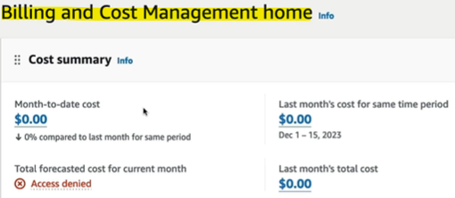

- [EC2 - Elastic Compute Cloud](#ec2---elastic-compute-cloud)
  - [AWS Budget Setup](#aws-budget-setup)
    - [Accessing the Billing Console](#accessing-the-billing-console)
    - [Viewing Billing Information](#viewing-billing-information)
    - [Free Tier Usage](#free-tier-usage)
    - [Setting Up a Budget](#setting-up-a-budget)
    - [Monitoring and Alerts](#monitoring-and-alerts)
  - [EC2 Basics](#ec2-basics)
    - [Introduction to Amazon EC2](#introduction-to-amazon-ec2)
      - [What is EC2?](#what-is-ec2)
      - [Components of EC2](#components-of-ec2)
    - [Choosing EC2 Instances](#choosing-ec2-instances)
    - [Bootstrapping with EC2 User Data](#bootstrapping-with-ec2-user-data)
    - [EC2 Instance Types](#ec2-instance-types)
  - [EC2 Instance Type Basics](#ec2-instance-type-basics)
    - [Introduction to EC2 Instance Types](#introduction-to-ec2-instance-types)
    - [Naming Convention](#naming-convention)
    - [Types of EC2 Instances](#types-of-ec2-instances)
    - [Comparing Instance Types](#comparing-instance-types)
    - [Practical Application](#practical-application)
  - [Security Groups \& Classic Ports Overview](#security-groups--classic-ports-overview)
    - [Introduction to Security Groups](#introduction-to-security-groups)
      - [Security Group Diagram](#security-group-diagram)
    - [Configuring Security Groups](#configuring-security-groups)
      - [Example Scenario](#example-scenario)
    - [Detailed Explanation](#detailed-explanation)
    - [Key Points](#key-points)
    - [Best Practices](#best-practices)
    - [Important Ports to Know](#important-ports-to-know)
  - [Security Groups Code-along](#security-groups-code-along)
    - [Accessing Security Groups](#accessing-security-groups)
    - [Understanding Security Group Rules](#understanding-security-group-rules)
    - [Editing Security Group Rules](#editing-security-group-rules)
    - [Troubleshooting Connection Issues](#troubleshooting-connection-issues)
    - [Adding Custom Rules](#adding-custom-rules)
    - [Multiple Security Groups](#multiple-security-groups)
    - [Important Ports to Know](#important-ports-to-know-1)
    - [Step-by-Step Instructions for Managing Security Groups](#step-by-step-instructions-for-managing-security-groups)
- [Quiz](#quiz)

 

 

# EC2 - Elastic Compute Cloud

## AWS Budget Setup

### Accessing the Billing Console
* Click on the top right of your screen and select "Billing and Cost Management".

> If you get access denied, log in with your root account, go to "Accounts", scroll down to "IAM user and role access to billing information", and activate IAM access.

### Viewing Billing Information
* After activating IAM access, refresh the billing console to view your cost information.

* The billing page shows month-to-date costs, forecasted costs, and last month's total cost.

* View detailed cost breakdown by service, such as EC2 costs, to understand your expenses.

 

### Free Tier Usage
* On the left-hand side, click on "Free Tier" to see current and forecasted usage.
* Ensure you do not exceed the free tier usage to avoid unexpected charges.

 

### Setting Up a Budget
1. On the left-hand side, click on "Budgets".
2. Click on "Create a budget" and use a template to set up your budget.

 

* Set a budget to alert you when you spend 1 cent. 
  * **Name** it "My Zero Spend Budget" and enter your **email**.
* Set a budget for a specific amount, e.g., $10 per month. 
  * Enter your email to **receive alerts** when you reach 85% and 100% of your budget.

 

### Monitoring and Alerts
* You will receive email alerts when your spending reaches the set thresholds.
* Use the billing console and free tier information to debug any costing issues and ensure you stay within your budget.

 

 

## EC2 Basics

### Introduction to Amazon EC2

#### What is EC2?
* Amazon EC2 (Elastic Compute Cloud) is a popular AWS service that provides Infrastructure as a Service (IaaS).

#### Components of EC2
* `EC2 Instances`: Virtual machines you can rent.
* `EBS Volumes`: Virtual drives for data storage.
* `Elastic Load Balancer`: Distributes load across machines.
* `Auto-Scaling Group` (ASG): Scales services automatically.

### Choosing EC2 Instances
* `Operating Systems`: Options include Linux, Windows, and Mac OS.
* `Compute Power`: Select the number of CPU cores.
* `Memory` (RAM): Choose the amount of RAM.
* `Storage`: Decide between network-attached storage (EBS/EFS) or hardware-attached storage (EC2 instance store).
* `Network`: Configure network settings, including public IP and network card speed.
* `Security Groups`: Handle firewall rules for your instance.
* `Bootstrap Script` (EC2 User Data): Configure the instance at first launch with a script that runs once.

### Bootstrapping with EC2 User Data
* Automate boot tasks such as installing updates, software, and downloading files.
* The script runs with root user privileges and only once at startup.

### EC2 Instance Types
Examples:
* `t2.micro`: 1 vCPU, 1 GB RAM, low to moderate network performance.
* `t2.xlarge`: 4 vCPUs, 16 GB RAM, moderate network performance.
* `c5d.4xlarge`: 16 vCPUs, 32 GB RAM, 400 GB NVMe SSD, up to 10 Gbps network performance.
* `r5.16xlarge`: High memory instance.
* `m5.8xlarge`: Balanced compute, memory, and network resources.

`Free Tier`: t2.microis part of the AWS free tier, offering up to 750 hours per month.

 

 

## EC2 Instance Type Basics

### Introduction to EC2 Instance Types
* Different EC2 instance types are optimised for various use cases.
* AWS website provides detailed information on instance types, costs, and specifications.

### Naming Convention
`t2.micro`
* `Instance Class`: The first letter (e.g., M) indicates the instance class (e.g., general purpose).
* `Generation`: The number (e.g., 5) indicates the generation of the instance.
* `Size`: The suffix (e.g., 2xlarge) indicates the size of the instance, with larger sizes having more memory and CPU.

### Types of EC2 Instances
`General Purpose`
* Balanced for a variety of workloads (e.g., web servers, code repositories).
* Example: T2 micro (free tier), M5.

`Compute Optimised`
* High-performance processors for compute-intensive tasks (e.g., batch processing, media transcoding, HPC, machine learning, gaming servers).
* Example: C5, C6.

`Memory Optimised`
* High memory performance for processing large datasets in memory (e.g., relational/non-relational databases, in-memory databases, BI applications).
* Example: R series, X1, Z1.

`Storage Optimised`
* Optimised for high-frequency access to local storage (e.g., OLTP systems, NoSQL databases, data warehousing, distributed file systems).
* Example: I, G, H1.

### Comparing Instance Types
* `t2.micro`: 1 vCPU, 1 GB memory, part of AWS free tier (750 hours/month).
* `r5.16xlarge`: 16 vCPUs, 512 GB memory, optimized for memory-intensive tasks.
* `c5d.4xlarge`: 16 vCPUs, 32 GB memory, optimized for compute-intensive tasks.

### Practical Application
* Use websites like [ec2instances.info](https://instances.vantage.sh/) to compare all EC2 instance types, costs, and specifications.

 

 

## Security Groups & Classic Ports Overview

### Introduction to Security Groups
* Security groups act as **firewalls** for EC2 instances, **controlling inbound** and **outbound traffic**.
* Security groups only contain **allow rules**, specifying what traffic is permitted.

#### Security Group Diagram

 

### Configuring Security Groups
* `Inbound and Outbound Rules`: Define rules for traffic coming into and going out of your EC2 instance.
* `IP Address and Security Group References`: Rules can reference IP addresses or other security groups.

#### Example Scenario
* Create a security group around your EC2 instance to control access from your computer.
* Rules specify allowed inbound traffic (e.g., port 22 for SSH).
* By default, all outbound traffic is allowed.

### Detailed Explanation
* `Firewall Functionality`: Security groups regulate access to ports and authorized IP ranges (IPv4 or IPv6).
* `Rule Structure`: Rules include type, protocol (e.g., TCP), port, and source (IP address range).

### Key Points
* `Multiple Instances`: Security groups can be attached to multiple instances, and instances can have multiple security groups.
* `Region/VPC Specific`: Security groups are specific to a region/VPC combination.
* `External Firewall`: Security groups live outside the EC2 instance, blocking traffic before it reaches the instance.

### Best Practices
* `Separate SSH Security Group`: Maintain a separate security group for SSH access to ensure proper configuration.
* `Timeout vs. Connection Refused`: Timeout indicates a security group issue, while connection refused indicates the application is not running or has an error.

`Advanced Feature`:
* Security groups can reference other security groups to allow communication between instances without specifying IP addresses.

### Important Ports to Know
* `SSH` (Port 22): Secure Shell for logging into Linux instances.
* `FTP` (Port 21): File Transfer Protocol for uploading files.
* `SFTP` (Port 22): Secure File Transfer Protocol using SSH.
* `HTTP` (Port 80): Accessing unsecured websites.
* `HTTPS` (Port 443): Accessing secured websites.
* `RDP` (Port 3389): Remote Desktop Protocol for logging into Windows instances.

 

 

## Security Groups Code-along

### Accessing Security Groups
* In the `AWS Management Console`, go to the left-hand side menu under "Networking and Security" and click on "Security Groups".
* You will see a list of security groups, including the default security group and any custom security groups created during instance launch.

 

### Understanding Security Group Rules
* Inbound Rules: Rules that allow traffic from the outside into the EC2 instance.
  * Example: SSH (port 22) from anywhere (0.0.0.0/0) and HTTP (port 80) from anywhere.
* Outbound Rules: Rules that allow traffic from the EC2 instance to the outside.
  * Example: Allow all traffic on IPv4 to anywhere.

### Editing Security Group Rules
Edit Inbound Rules:
1. Choose the security group you want to edit.
2. Click on `Edit Inbound Rules`: Modify the rules as needed.
3. Add Rule: For example, add an HTTP rule to allow port 80 from anywhere.
4. Save Rules: Save the changes to apply the new rules.

### Troubleshooting Connection Issues
* If you experience a timeout when trying to connect to your EC2 instance, it is likely due to incorrect security group rules.

> Check and update the security group rules to ensure the correct ports are open.

### Adding Custom Rules
* You can add rules for specific ports and protocols, such as HTTPS (port 443).
* Define where the traffic is allowed from, such as custom CIDR blocks or specific IP addresses.

### Multiple Security Groups
* An EC2 instance can have multiple security groups attached to it, and the rules will combine.
* A security group can be attached to multiple EC2 instances.

### Important Ports to Know
* `SSH` (Port 22): Secure Shell for logging into Linux instances.
* `HTTP` (Port 80): Accessing unsecured websites.
* `HTTPS` (Port 443): Accessing secured websites.

### Step-by-Step Instructions for Managing Security Groups
`Access Security Groups`:
* In the AWS Management Console, go to the left-hand side menu under "Networking and Security" and click on "Security Groups".

`View Security Groups`:
* You will see a list of security groups, including the default security group and any custom security groups created during instance launch.

`Edit Inbound Rules`:
1. Select the security group you want to edit.
2. Click on "Edit Inbound Rules".
3. Add a rule for HTTP to allow port 80 from anywhere (0.0.0.0/0).
4. Save the changes.

`Troubleshoot Connection Issues`:
* If you experience a timeout, check and update the security group rules to ensure the correct ports are open.

`Add Custom Rules`:
* Define the ports and protocols you need, such as HTTPS (port 443).
* Specify the source, such as custom CIDR blocks or specific IP addresses.

`Attach Multiple Security Groups`:
* An EC2 instance can have multiple security groups attached to it, and the rules will combine.
* A security group can be attached to multiple EC2 instances.

 

 

# Quiz

1. Which EC2 Purchasing Option can provide the biggest discount, but is not suitable for critical jobs or databases?
   * Spot Instances.
   * Spot Instances are good for short workloads, but are less reliable.

2. Which network security tool can you use to control traffic in and out of EC2 Instances?
   * Security Groups operate at instance level and can control traffic.

3. Under the Shared Responsibility Model, who is responsible for operating-system patches and updates on EC2 Instances?
   * The customer is responsible for operating-system patches and updates on EC2 Instances, as well as data security on the instances, Security Groups rules, etc.

4. How long can you reserve an EC2 Reserved Instance?
   * 1 year or 3 years terms are available for EC2 Reserved Instances.

5. A company would like to deploy a high-performance computing (HPC) application on EC2. Which EC2 instance type should it choose?
   * Compute Optimisded EC2 instances are great for compute-intensive workloads requiring high performance processors, such as batch processing, media transcoding, high performance web servers, high performance computing, scientific modeling & machine learning, and dedicated gaming servers.

6. Which of the following is NOT an EC2 Instance Purchasing Option?
   * Connect Instances does not exist. 

7. Which EC2 Purchasing Option should you use for an application you plan on running on a server continuously for 1 year?
   * Reserved Instances are good for long workloads. You can reserve instances for 1 or 3 years.

 

