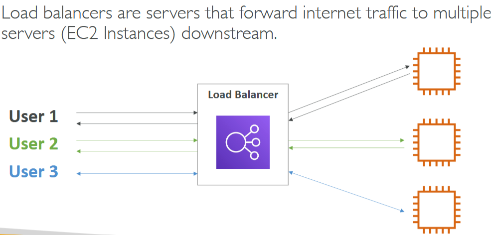
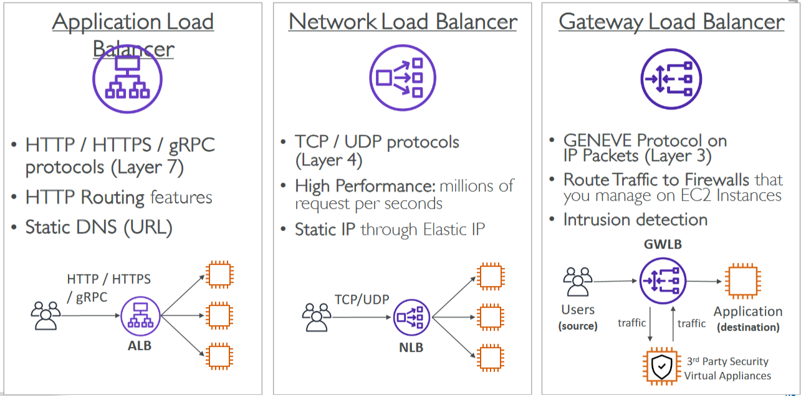
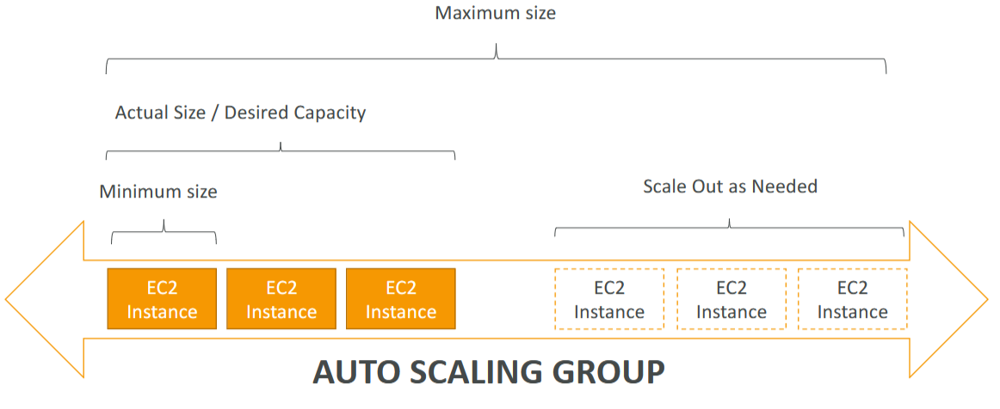
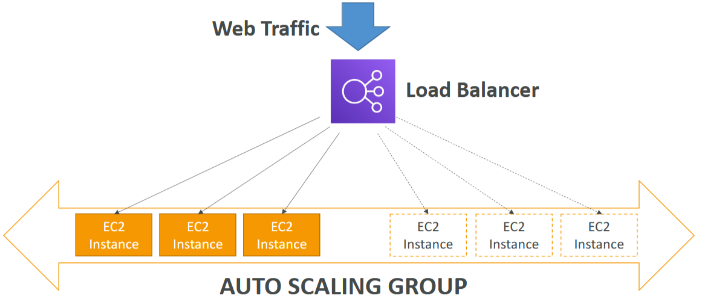
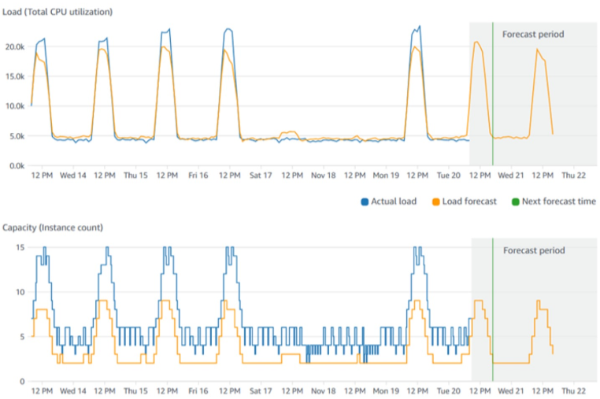

- [Elastic Load Balancing (ELB) \& Auto Scaling Groups (ASG)](#elastic-load-balancing-elb--auto-scaling-groups-asg)
  - [High Availability](#high-availability)
    - [Introduction to Scalability and High Availability](#introduction-to-scalability-and-high-availability)
    - [Vertical Scalability](#vertical-scalability)
    - [Horizontal Scalability](#horizontal-scalability)
    - [High Availability](#high-availability-1)
    - [Summary of High Availability and Scalability for EC2](#summary-of-high-availability-and-scalability-for-ec2)
    - [Key Concepts for the Exam](#key-concepts-for-the-exam)
  - [Elastic Load Balancing (ELB) Overview](#elastic-load-balancing-elb-overview)
    - [Introduction to Elastic Load Balancing](#introduction-to-elastic-load-balancing)
    - [Benefits of Using a Load Balancer](#benefits-of-using-a-load-balancer)
    - [Managed Service](#managed-service)
    - [Types of Load Balancers](#types-of-load-balancers)
      - [Application Load Balancer (ALB)](#application-load-balancer-alb)
      - [Network Load Balancer (NLB)](#network-load-balancer-nlb)
      - [Gateway Load Balancer (GWLB)](#gateway-load-balancer-gwlb)
      - [Classic Load Balancer (CLB)](#classic-load-balancer-clb)
    - [Architecture and Use Cases](#architecture-and-use-cases)
  - [Instructions for Launching a Load Balancer and EC2 Instances](#instructions-for-launching-a-load-balancer-and-ec2-instances)
    - [Launch EC2 Instances](#launch-ec2-instances)
    - [Verify EC2 Instances](#verify-ec2-instances)
    - [Create a Load Balancer](#create-a-load-balancer)
    - [Configure Load Balancer](#configure-load-balancer)
    - [Configure Listeners and Routing](#configure-listeners-and-routing)
    - [Finalise Load Balancer](#finalise-load-balancer)
    - [Verify Load Balancer](#verify-load-balancer)
    - [Test Health Checks](#test-health-checks)
  - [Auto Scaling Groups (ASG) Overview](#auto-scaling-groups-asg-overview)
    - [Introduction to Auto Scaling Groups](#introduction-to-auto-scaling-groups)
    - [Benefits of Auto Scaling Groups](#benefits-of-auto-scaling-groups)
    - [Handling Unhealthy Instances](#handling-unhealthy-instances)
    - [Cost Savings](#cost-savings)
    - [Auto Scaling Group Configuration](#auto-scaling-group-configuration)
    - [Integration with Load Balancer](#integration-with-load-balancer)
  - [Auto Scaling Groups (ASG) Code-along](#auto-scaling-groups-asg-code-along)
    - [Terminate Existing Instances](#terminate-existing-instances)
    - [Create an Auto Scaling Group](#create-an-auto-scaling-group)
    - [Create a Launch Template](#create-a-launch-template)
    - [Configure Template](#configure-template)
    - [Configure Auto Scaling Group](#configure-auto-scaling-group)
    - [Verify Auto Scaling Group](#verify-auto-scaling-group)
    - [Speed Up Health Checks](#speed-up-health-checks)
    - [Test Auto Scaling Group](#test-auto-scaling-group)
  - [Auto Scaling Group (ASG) Strategies](#auto-scaling-group-asg-strategies)
    - [Manual Scaling](#manual-scaling)
    - [Dynamic Scaling](#dynamic-scaling)
    - [Scheduled Scaling](#scheduled-scaling)
    - [Predictive Scaling](#predictive-scaling)
- [Quiz](#quiz)

 

 

# Elastic Load Balancing (ELB) & Auto Scaling Groups (ASG)

## High Availability

### Introduction to Scalability and High Availability

`Scalability`: The ability of an application to handle greater loads by adapting. There are two types:
* `Vertical Scalability`: Increasing the size of the instance (e.g., upgrading from t2.microto t2.large).
* `Horizontal Scalability` (Elasticity): Increasing the number of instances (e.g., adding more operators in a call center).

### Vertical Scalability
* Increasing the size of the instance to handle more load.
  * Example: Upgrading a junior operator to a senior operator in a call center.
* Use Case: Common for non-distributed systems like databases.

### Horizontal Scalability
* Increasing the number of instances to handle more load.
  * Example: Adding more operators to handle more calls in a call center.
* Use Case: Common for web applications and modern applications designed with horizontal scalability in mind.

### High Availability
* Running applications in at least two availability zones to survive data center loss or disasters.
  * Example: Having call centers in both New York and San Francisco to handle calls even if one center is down.

### Summary of High Availability and Scalability for EC2
* `Vertical Scaling`: Increasing or decreasing the instance size (e.g., from T2.nanoto u-12tb1.metal).
* `Horizontal Scaling`: Increasing or decreasing the number of instances using auto scaling groups and load balancers.
* `High Availability`: Running instances across multiple availability zones using auto scaling groups and load balancers in multi-AZ mode.

### Key Concepts for the Exam
* `Scalability`: Ability to accommodate larger loads by scaling up (vertical) or scaling out (horizontal).
* `Elasticity`: Auto scaling based on load, paying per use, and optimizing costs.
* `Agility`: Quick access to new IT resources, reducing time to make resources available from weeks to minutes.

 

 

## Elastic Load Balancing (ELB) Overview

 

### Introduction to Elastic Load Balancing
* Distributes incoming internet traffic across multiple EC2 instances (backend instances) to improve scalability and availability.
* Acts as a single point of access for users, directing traffic to healthy instances and handling failures seamlessly.

### Benefits of Using a Load Balancer
* `Load Distribution`: Spreads traffic across multiple instances to balance the load.
* `Single Point of Access`: Provides a single DNS hostname for your application.
* `Health Checks`: Regularly checks the health of instances and directs traffic only to healthy ones.
* `SSL Termination`: Easily provides HTTPS for your websites.
* `High Availability`: Can be used across multiple availability zones to ensure high availability.

### Managed Service
* `AWS Managed`: AWS handles provisioning, maintenance, and high availability of the load balancer.
* `Cost-Effective`: Less expensive and less effort compared to setting up your own load balancer on EC2.

 

### Types of Load Balancers

#### Application Load Balancer (ALB)
* Layer 7: For HTTP/HTTPS traffic.
* Use Case: HTTP routing features, static DNS.

#### Network Load Balancer (NLB)
* Layer 4: For TCP/UDP traffic.
* High Performance: Handles millions of requests per second.
* Static IP: Provides a static IP through elastic IPs.

#### Gateway Load Balancer (GWLB)
* Layer 3: Uses GENEVE protocol for IP packets.
* Use Case: Routes traffic to firewalls and virtual appliances for security operations.

#### Classic Load Balancer (CLB)
* Deprecated: Being retired in 2023, previously supported both Layer 4 and Layer 7.

 

### Architecture and Use Cases
* `ALB Architecture`: Routes HTTP/HTTPS traffic to downstream EC2 instances.
* `NLB Architecture`: Routes TCP/UDP traffic to downstream targets with high performance.
* `GWLB Architecture`: Routes traffic to virtual appliances for inspection and security before forwarding to applications.

 

 

## Instructions for Launching a Load Balancer and EC2 Instances

### Launch EC2 Instances
1. Navigate to the EC2 dashboard in the AWS Management Console.
2. Click on "Launch Instances".
3. On the right-hand side, set the number of instances to 2.
4. Name the first instance "My First Instance". You can rename the second instance later.
5. Choose "Amazon Linux 2" as the Amazon Machine Image (AMI).
6. Choose "t2.micro" as the instance type.
7. Proceed without a key pair since SSH capability is not needed.
8. Select an existing security group, such as "Launch Wizard 1", which allows HTTP and SSH traffic.
9. Use the default storage settings.
10. Scroll down to "Advanced Details" and add the EC2 user data script to launch the instances.
11. Click "Launch Instances" and then view all instances.
12. Rename the second instance to "My Second Instance" and save.

### Verify EC2 Instances
* Wait for the instances to be ready.
* Copy the IPv4 address of the first instance, paste it into a browser, and verify you get a "hello world" message.
* Repeat the process for the second instance to ensure both instances are working.

### Create a Load Balancer
1. Scroll down to "Load Balancers" in the EC2 dashboard.
2. Click on "Create Load Balancer".
3. Choose "Application Load Balancer" (ALB) for HTTP/HTTPS traffic.

### Configure Load Balancer
1. Enter a name for the load balancer (e.g., DemoALB).
2. Scheme: Set to "Internet-facing".
3. Address Type: Set to "IPv4".
4. Network Mapping: Deploy the load balancer in all availability zones.
5. Create a new security group allowing HTTP traffic and assign it to the load balancer.
6. Enter a name for the security group (e.g., demo-sg-load-balancer).
   * Inbound Rules: Allow HTTP traffic from anywhere.
   * Outbound Rules: Use default settings.
   * Create and assign the security group.

### Configure Listeners and Routing
1. Set Listener: Route traffic from HTTP on port 80 to a target group.
2. Click to create a target group.
3. Enter a name for the target group (e.g., demo-tg-alb).
4. Protocol: Set to HTTP on port 80.
5. Health Check: Use default settings.
6. Register Targets: Register both EC2 instances on port 80.
7. Create the target group and link it to the listener on the load balancer.

### Finalise Load Balancer
1. Click "Create Load Balancer".
2. Wait for the load balancer to be provisioned and become active.

### Verify Load Balancer
* `Get DNS Name`: Copy the DNS name of the load balancer and paste it into a browser.
* `Check Load Balancing`: Refresh the page multiple times to see the "hello world" message from both instances, indicating load balancing is working.

### Test Health Checks
* `Stop First Instance`: Stop the first instance to test health checks.
* `Verify Target Group`: Check the target group to see the first instance marked as unhealthy.
* `Restart Instance`: Restart the first instance and verify it becomes healthy again in the target group.

 

 

## Auto Scaling Groups (ASG) Overview

### Introduction to Auto Scaling Groups
* Automatically **create or remove** EC2 instances **based on the load** to ensure **optimal performance** and **cost efficiency**.
  * **Example**: User activity on websites can vary, with more activity during the day and less at night. Auto Scaling Groups help manage this variability.

### Benefits of Auto Scaling Groups
* `Scale Out`: Add EC2 instances to match increased load.
* `Scale In`: Remove EC2 instances to match decreased load.
* `Minimum and Maximum Instances`: Ensure a minimum and maximum number of instances are running at any time.
* `Integration with Load Balancer`: Automatically register or deregister instances with the load balancer.

### Handling Unhealthy Instances
* Auto Scaling Groups can **detect unhealthy instances** (e.g., due to application bugs).
* Automatically **terminate and replace unhealthy instances** with new, healthy ones.

### Cost Savings
* `Optimal Capacity`: Run at optimal capacity at all times, reducing costs by only using the necessary resources.
* `Elasticity`: One of the guiding principles of the cloud, ensuring resources match demand.

### Auto Scaling Group Configuration
* `Minimum Size`: The minimum number of instances (e.g., 1 EC2 instance).
* `Desired Capacity`: The actual size of the Auto Scaling Group, usually matching the current load.
* `Maximum Size`: The maximum number of instances the Auto Scaling Group can scale to.

 

### Integration with Load Balancer
* `Traffic Distribution`: The load balancer distributes incoming web traffic to the instances in the Auto Scaling Group.
* `Scaling`: As the Auto Scaling Group scales out, the load balancer registers new instances and distributes traffic to them.

 

 

## Auto Scaling Groups (ASG) Code-along

### Terminate Existing Instances
1. Navigate to the EC2 dashboard in the AWS Management Console.
2. Select your first two instances.
3. Click on "Instance State" and select "Terminate Instance".

### Create an Auto Scaling Group
1. On the bottom left, click on "Auto Scaling Groups".
2. Click on "Create Auto Scaling Group".
3. Enter a name for the auto scaling group (e.g., DemoASG).

### Create a Launch Template
1. Click on "Create Launch Template".
2. Enter a name for the launch template (e.g., DemoLaunchTemplate).

### Configure Template
1. `AMI`: Choose "Amazon Linux 2" as the base AMI.
2. `Instance Type`: Select "t2.micro".
3.  `Key Pair`: Proceed without a key pair.
4.  `Security Group`: Select an existing security group (e.g., launch-wizard-1).
5.  `User Data`: Scroll down to "Advanced Details" and add the user data script.
6.  Click "Create Launch Template".

### Configure Auto Scaling Group
1. Refresh the page and select the newly created launch template (DemoLaunchTemplate).
2. Select your VPC and multiple availability zones/subnets.
3. Attach the auto scaling group to an existing load balancer (e.g., application load balancer).
   * Target Group: Register instances with the target group (e.g., demo-tg-alb).
   * Health Checks: Enable both EC2 and ELB health checks.

4. Set Scaling Policies:
   * Desired Capacity: Set the desired number of instances (e.g., 2).
   * Minimum Capacity: Set the minimum number of instances (e.g., 1).
   * Maximum Capacity: Set the maximum number of instances (e.g., 4).

5. Review the settings and create the auto scaling group.

### Verify Auto Scaling Group
1. Go to the "Activity" tab to see the history of instance launches.
2. Go to the "Instance Management" tab to see the running instances.
3. Check the EC2 dashboard to see the instances created by the auto scaling group.
4. Go to the target group (e.g., demo-tg-alb) and check the registered targets.

### Speed Up Health Checks
1. Go to the health checks of your target group and edit the settings.
   * Healthy Threshold: Set to 2.
   * Interval: Set to 5 seconds.
   * Timeout: Set to 2 seconds.
2. Save the changes and verify that the instances become healthy.

### Test Auto Scaling Group
* `Terminate an Instance`: Select one of the instances and terminate it.
* `Observe Behavior`: Check the activity history to see the auto scaling group launch a new instance in response to the termination.
* `Verify New Instance`: Ensure the new instance is registered with the load balancer and becomes healthy.

 

 

## Auto Scaling Group (ASG) Strategies

### Manual Scaling
* Manually updating the size of an Auto Scaling Group (ASG)
  * **Example**: Changing the capacity from 1 to 2 instances, or from 2 to 1 instances.

### Dynamic Scaling
* Automatically responds to changing demands.

`Types of Dynamic Scaling`:
* Simple and Step Scaling:
  * Trigger: Based on CloudWatch alarms.
  * **Example**: If average CPU utilization exceeds 70% for 5 minutes, add 2 instances. If it drops below 30% for 10 minutes, remove 1 instance.

`Target Tracking Scaling`:
* Maintains a specific target metric.
  * **Example**: Keep average CPU utilization at 40%. The ASG will automatically adjust to maintain this target.

### Scheduled Scaling
* Anticipates scaling based on known patterns.
* **Example**: Increase minimum capacity to 10 instances at 5 PM on Fridays for expected high traffic.

### Predictive Scaling
* Uses Machine Learning to predict future traffic and adjust capacity accordingly.
* Function: Analyzes past traffic patterns to forecast future load.
  * **Example**: Automatically provisions the right number of instances in advance based on predicted traffic peaks.

 

 

# Quiz

1. What is the main purpose of High Availability in the Cloud?
   * Application thriving even in case of a disaster.
   * High Availability means applications running at least in two AZs to survive a data center loss.

2. Which AWS offered Load Balancer should you use to handle hundreds of thousands of connections with low latency?
   * A Network Load Balancer can handle millions of requests per second with low-latency. 
   * It operates at Layer 4, and is best-suited for load-balancing TCP, UDP, and TLS traffic with ultra high-performance.

3. Changing an EC2 Instance Type from a t3a.medium to a t3a.2xlarge is an example of?
   * Vertical scaling means increasing the size of the instance. 
   * Changing from a t3a.medium to a t3a.2xlarge is an example of size increase.

4. What can you use to handle quickly and automatically the changing load on your websites and applications by adding compute resources?
   * An Auto Scaling Group (ASG) can automatically and quickly scale-in and scale-out to match the changing load on your applications and websites.

5. Which of the following statements is INCORRECT regarding Auto Scaling Groups?
   * Auto Scaling Groups can add or remove instances, but from the same type. 
   * They cannot change the EC2 Instances Types on the fly.

6. Which Load Balancer is best suited for HTTP/HTTPS load balancing traffic?
   * Application Load Balancers are used for HTTP and HTTPS load balancing. 
   * They are the best-suited for this kind of traffic.

7. Which of the following is NOT an Auto Scaling Strategy?
   * Active Scaling.
   * This is not a scaling strategy. 
   * Auto Scaling Strategies include: Manual Scaling, Dynamic Scaling (Simple/Step Scaling, Target Tracking Scaling, Scheduled Scaling), and Predictive Scaling.

8. Which AWS service offers easy horizontal scaling of compute capacity?
   * Auto Scaling Groups (ASG) offers the capacity to scale-out and scale-in by adding or removing instances based on demand.

9. Which of the following statements is NOT a feature of Load Balancers?
    * Load Balancers cannot help with back-end autoscaling. 
    * You should use Auto Scaling Groups.

 

