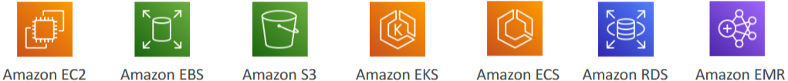

- [Leveraging the AWS Global Infrastructure](#leveraging-the-aws-global-infrastructure)
  - [Why Global Applications?](#why-global-applications)
    - [Global Applications](#global-applications)
    - [Reasons for Global Applications:](#reasons-for-global-applications)
    - [AWS Global Infrastructure](#aws-global-infrastructure)
    - [AWS Global Network](#aws-global-network)
    - [Key AWS Services for Global Applications](#key-aws-services-for-global-applications)
  - [Route 53 Overview](#route-53-overview)
    - [Amazon Route 53 Overview](#amazon-route-53-overview)
    - [Common DNS Records](#common-dns-records)
    - [How DNS Works with Route 53](#how-dns-works-with-route-53)
      - [Diagram for A Record](#diagram-for-a-record)
    - [Routing Policies](#routing-policies)
    - [Summary:](#summary)
  - [Route 53 Code-along](#route-53-code-along)
    - [Getting Started with Amazon Route 53](#getting-started-with-amazon-route-53)
    - [Creating EC2 Instances](#creating-ec2-instances)
    - [Creating DNS Records in Route 53](#creating-dns-records-in-route-53)
    - [Testing the Setup](#testing-the-setup)
  - [CloudFront](#cloudfront)
    - [Overview](#overview)
    - [Benefits of CloudFront](#benefits-of-cloudfront)
    - [How CloudFront Works](#how-cloudfront-works)
      - [Example Scenario](#example-scenario)
    - [CloudFront vs. S3 Cross-Region Replication:](#cloudfront-vs-s3-cross-region-replication)
  - [CloudFront Code-along](#cloudfront-code-along)
    - [Practicing with Amazon CloudFront](#practicing-with-amazon-cloudfront)
    - [Summary](#summary-1)
  - [S3 Transfer Acceleration](#s3-transfer-acceleration)
    - [Amazon S3 Transfer Acceleration Overview](#amazon-s3-transfer-acceleration-overview)
    - [How It Works](#how-it-works)
    - [Use Case](#use-case)
    - [Testing S3 Transfer Acceleration](#testing-s3-transfer-acceleration)
    - [Benefits](#benefits)
  - [AWS Global Accelerator](#aws-global-accelerator)
    - [AWS Global Accelerator Overview](#aws-global-accelerator-overview)
    - [How It Works](#how-it-works-1)
    - [Benefits](#benefits-1)
    - [Comparison with CloudFront](#comparison-with-cloudfront)
    - [Speed Comparison Tool](#speed-comparison-tool)
  - [AWS Outposts](#aws-outposts)
    - [AWS Outposts Overview](#aws-outposts-overview)
    - [Key Concepts](#key-concepts)
    - [Benefits of AWS Outposts](#benefits-of-aws-outposts)
    - [Supported Services](#supported-services)
    - [Summary](#summary-2)
  - [AWS WaveLength](#aws-wavelength)
    - [AWS WaveLength Overview](#aws-wavelength-overview)
    - [Key Concepts](#key-concepts-1)
    - [How It Works](#how-it-works-2)
    - [Benefits](#benefits-2)
    - [Summary](#summary-3)
  - [AWS Local Zones](#aws-local-zones)
    - [AWS Local Zones Overview:](#aws-local-zones-overview)
    - [Key Concepts](#key-concepts-2)
    - [How It Works](#how-it-works-3)
    - [Benefits](#benefits-3)
    - [Summary](#summary-4)
  - [Global Applications Architecture](#global-applications-architecture)
    - [Global Application Architecture Overview:](#global-application-architecture-overview)
    - [Single Region, Single AZ:](#single-region-single-az)
    - [Single Region, Multi AZ:](#single-region-multi-az)
    - [Multi-Region, Active-Passive:](#multi-region-active-passive)
    - [Multi-Region, Active-Active:](#multi-region-active-active)
    - [Key Terms](#key-terms)
      - [Example](#example)
  - [Global Application in AWS - Summary](#global-application-in-aws---summary)
- [Quiz](#quiz)

 

 

# Leveraging the AWS Global Infrastructure 

## Why Global Applications?

### Global Applications
* Deploy applications in multiple geographies to reduce latency and improve user experience.
* AWS Regions and Edge Locations: Deploy applications closer to users to decrease latency.

### Reasons for Global Applications:

`Decreased Latency`:
* Latency is the time it takes for a network packet to reach a server.
* Deploying applications closer to users reduces latency and improves user experience.

`Disaster Recovery Plan`:
* Avoid relying on a single data center or region.
* In case of a region failure (e.g., earthquake, storm), fail-over to another region to maintain application availability.

`Protection Against Attacks`: 
* Distribute applications globally to make it harder for attackers to target all locations simultaneously.

### AWS Global Infrastructure
Source: https://aws.amazon.com/about-aws/global-infrastructure/regions_az/

* `Regions`: Geographic areas where AWS has data centers.
* `Availability Zones` (AZs): Multiple data centers within a region, providing redundancy and fault tolerance.
* `Edge Locations`: Also known as Points of Presence, used for content delivery to be as close as possible to users.

 

### AWS Global Network
* `Private Network`: AWS has its own network infrastructure, including undersea cables, to ensure fast and reliable connections between regions, AZs, and Edge Locations.

 

### Key AWS Services for Global Applications

Global DNS: `Route 53`
* Global DNS service to route users to the closest deployment with the least latency.
* Useful for disaster recovery strategies.

 

 

Global Content Delivery Network (CDN): `CloudFront`
* Global Content Delivery Network (CDN) to replicate parts of applications into Edge Locations.
* Decreases latency and caches common requests for improved user experience.

S3 Transfer Acceleration: `S3 Transfer Acceleration`
* Accelerates global uploads and downloads into Amazon S3.

 

 

AWS Global Accelerator: `AWS Global Accelerator`
* Improves global application availability and performance using the AWS global network.

 

 

## Route 53 Overview

### Amazon Route 53 Overview
* Managed DNS (Domain Name System) service.
* Acts like a phone book, helping clients find the right servers through URLs.

### Common DNS Records
* `A Record`: Maps a domain (e.g., www.google.com) to an IPv4 address.
* `AAAA Record`: Maps a domain to an IPv6 address.
* `CNAME Record`: Maps a host name to another host name.
* `Alias Record`: Maps a host name to an AWS resource (e.g., ELB, CloudFront, S3, RDS).

### How DNS Works with Route 53

Example:
* A web browser requests myapp.mydomain.com.
* Route 53 replies with the IP address of the application server.
* The web browser uses the IP to access the server and get the HTTP response.

 

#### Diagram for A Record
* Map a domain name to an IPv4 address using an A Record.

`How It Works`:

1. Web Browser Request
   * A web browser wants to access an application server using a URL (e.g., myapp.mydomain.com).

2. Create A Record
   * In Route 53, create an A Record that maps the URL to the server's public IPv4 address.

3. DNS Request
   * The web browser sends a DNS request for myapp.mydomain.com.

4. DNS Response
   * Route 53 replies with the IPv4 address.

5. Access Server
   * The web browser uses the IP address to access the application server and receive the HTTP response.

`Basics of DNS`:

DNS (Domain Name System):
* Acts like a phone book, translating domain names into IP addresses.
* Helps clients find the correct servers through URLs.

 

### Routing Policies

`Simple Routing Policy`:
* No health checks.
* Direct DNS query results in an IP address.

 

`Weighted Routing Policy`:
* Distributes traffic across multiple instances based on assigned weights (e.g., 70%, 20%, 10%).
* Can use health checks.

 

`Latency Routing Policy`:
* Routes users to the server with the lowest latency based on their location.
* Minimizes latency by connecting users to the closest server.

 

`Failover Routing Policy`:
* Uses health checks to determine the primary instance's status.
* Redirects traffic to a failover instance if the primary instance fails.
* Helps with disaster recovery.

 

### Summary:
* `Managed DNS`: Route 53 is a managed DNS service that helps route traffic efficiently.
* `Routing Policies`: Understand the different routing policies and their use cases.
* `Simple`: Basic routing without health checks.
* `Weighted`: Distributes traffic based on weights.
* `Latency`: Minimizes latency by routing to the closest server.
* `Failover`: Ensures high availability with failover mechanisms.

 

 

## Route 53 Code-along

### Getting Started with Amazon Route 53

`Register a Domain`:
1. Go to the Route 53 console.

2. Click on "Registered domains" on the left-hand side.
   * This will cost you money. 

3. Choose a domain name (e.g., stephane-ccp.com).
   * If available, add it to your cart and complete the purchase (costs around $12 per year).
   * Register your information and wait for the domain registration to complete (takes about 10-15 minutes).

`Create Hosted Zones`:
4. Once the domain is registered, go to "Hosted zones" on the left-hand side.
   * You will see your domain (e.g., stephane-ccp.com) listed.
   * This is where you will place your DNS records.

 

### Creating EC2 Instances

1. Go to the EC2 console in your desired region (e.g., Ireland).

`Launch an EC2 instance with the following settings`:
1. Instance type: T2 Micro
2. Security group: Allow HTTP traffic
3. User data: Hello world from Ireland

> Note the public IP address of the instance.

`Launch Another EC2 Instance in a Different Region`:
1. Switch to another region (e.g., US West 2 - Oregon).

`Launch an EC2 instance with similar settings`:
1. Instance type: T2 Micro
2. Security group: Allow HTTP traffic
3. User data: Hello world from the US

> Note the public IP address of this instance as well.

 

### Creating DNS Records in Route 53

1. Create A Records
* Go to the Route 53 console and select your hosted zone (e.g., stephane-ccp.com).

 

2. Create a new record with the following settings:
   * Sub-domain: www.stephane-ccp.com.
   * Type: A record.

   * Value: Public IP address of the Ireland instance.
   * Routing policy: Latency-based (Region: EU-West 1).
   * Record ID: My instance from Ireland.

3. Add another record with similar settings:
   * Sub-domain: www.stephane-ccp.com.
   * Type: A record.
   * Value: Public IP address of the US instance.
   * Routing policy: Latency-based (Region: US-West 2).
   * Record ID: My US Instance.

  

### Testing the Setup

Access the Domain:
* Open a new tab and go to **www.stephane-ccp.com**.
* You should see "Hello World from Ireland" if you are closer to the Ireland instance.
* Use a VPN to connect from another country (e.g., the United States) and access the domain again.

> You should see "Hello World from the US" if you are closer to the US instance.

 

 

## CloudFront
Source: https://aws.amazon.com/cloudfront/features/?nc=sn&loc=2&whats-new-cloudfront.sort-by=item.additionalFields.postDateTime&whats-new-cloudfront.sort-order=desc 

### Overview
* CloudFront is a `Content Delivery Network` (CDN) that **improves read performance** by **caching content** at **different** edge **locations** around the world.
* CloudFront has 216 points of presence **globally**, corresponding to AWS edge locations.

 

### Benefits of CloudFront

`Improved Performance`:
* **Caches** content **globally**, reducing latency for users worldwide.
* Enhances user experience by serving content from the **nearest edge location**.

`DDoS Protection`:
* **Distributes** content **globally**, providing **protection** against **Distributed Denial of Service** (DDoS) **attacks**.
* Utilises **AWS Shield** and **Web Application Firewall** for additional security.

 

### How CloudFront Works

`Content Distribution`
* Users **request content** from the nearest edge location.
* If the content is not in the cache, the **edge location fetches it** from the origin (e.g., S3 bucket, HTTP server).
* The content is then **cached** at the edge location **for future requests**.

 

`Origins`
* **S3 Bucket**: Distributes and caches files at the edge.
* **Custom Origin HTTP Backend**: Can be an Application Load Balancer, EC2 instance, S3 website, or any HTTP backend.
* **Origin Access Control** (OAC): Ensures only CloudFront can access the S3 bucket, replacing the older Origin Access Identity (OAI).

 

#### Example Scenario

`User in America`
* Requests content from an **American edge location**, which fetches it from an **S3 bucket** in **Australia**. 
* Subsequent requests from the US are served directly from the edge.

`User in China`
* Requests content from a **Chinese point of presence**, which fetches it from the **same S3 bucket**. 
* The content is **cached** at the edge for **future requests**.

### CloudFront vs. S3 Cross-Region Replication:

`CloudFront`
* Uses the **Global Edge network** with 216 points of presence.
* Caches files at each **edge location**, typically for a day.
* Ideal for **static content** that needs to be **available globally**.

`S3 Cross-Region Replication`
* Must be set up for **each region individually**.
* Updates files in near **real-time** **without caching**.
* Suitable for **dynamic content** that **changes frequently** and needs **low-latency access** in specific regions.

 

 

## CloudFront Code-along

### Practicing with Amazon CloudFront

`Create an S3 Bucket`:
1. Go to the S3 console.
2. Create a new bucket (e.g., demo-cloudFront-stephane-V4).
3. Leave all settings as default and click "Create bucket".

 

`Upload Files to S3 Bucket`:
1. Upload files (e.g., beach, coffee, and index.html) to the bucket.

2. Verify the files are uploaded by checking the bucket contents.

 

`Accessing Files`:
1. Attempt to access index.html using the object URL (will result in access denied if not public).

2. Use the "Open" option to generate a pre-signed URL for temporary access.

 

`Set Up CloudFront Distribution`:
1. Open the CloudFront console (global service, no region selection).

2. Choose the origin domain (e.g., your S3 bucket).

3. Select "Origin access control (OAC)" for secure access.

4. Copy the policy for later steps.

5. Create an origin access control setting.

6. Scroll down to Web Application Firewall (WAF) and disable security protections.

 

`Configure CloudFront Distribution`:
1. Skip unnecessary settings.
2. Set the default root object to **index.html**.

3. Create the distribution and wait for it to deploy.

 

`Update S3 Bucket Policy`:
1. Copy the policy provided by CloudFront.
2. Go to the **S3 bucket permissions** and **edit** the bucket policy.

3. Paste the copied policy to allow CloudFront access.

 

`Test CloudFront Distribution`:
1. Copy the CloudFront **domain name** and open it in a new tab.
2. Verify that the content (e.g., index.html, coffee.jpeg, beach.jpeg) is **accessible**.
3. Refresh the page to see content served from the CloudFront cache.

 

`Verify Origin Access Control`:
1. Check the origin access controls in the **CloudFront** console.
2. Ensure the control is **active** and **assigned** to the distribution.

 

### Summary
* `CloudFront Setup`: Create an S3 bucket, upload files, and set up a CloudFront distribution.
* `Secure Access`: Use Origin Access Control (OAC) to secure access to the S3 bucket.
* `Content Delivery`: CloudFront caches content at edge locations, improving performance and reducing latency.
* `Testing`: Verify content delivery through CloudFront and ensure it is served from the cache.

 

 

## S3 Transfer Acceleration

### Amazon S3 Transfer Acceleration Overview
* **Speed up** the **transfer** of files **to and from** S3 buckets, especially when the bucket is in a different region from the user.

### How It Works

File Upload Process:
* A file is **uploaded** from a **user's location** (e.g., the United States) to an S3 bucket in a different region (e.g., Australia).
* The file is first **uploaded** to a **nearby edge location**.
* The edge location then **transfers the file** to the **S3 bucket** using **AWS's internal network**, which is faster and more reliable.

 

### Use Case
* Ideal for uploading or downloading files to/from an S3 bucket that is far away from the user's location.

 

### Testing S3 Transfer Acceleration
Where you can test the tool: https://s3-accelerate-speedtest.s3-accelerate.amazonaws.com/en/accelerate-speed-comparsion.html

`Speed Test`:
* Use the provided URL to test the speed of direct uploads versus accelerated uploads.
* The test compares the performance of uploading data to different S3 buckets around the world.

`Example Results`:
* From Europe to Northern Virginia, S3 Transfer Acceleration was about 13% faster.
* Similar tests showed improved speeds in regions like San Francisco, Oregon, Dublin, Frankfurt, Tokyo, Seoul, Mumbai, Ohio, and Canada.

 

### Benefits
* `Faster Uploads and Downloads`: Significantly speeds up the transfer of files to and from S3 buckets.
* `Global Application`: Useful for global applications that need to upload files to a specific S3 bucket.

 

 

## AWS Global Accelerator 

### AWS Global Accelerator Overview
* Improve **global** application **availability** and **performance** using the AWS global network.
* Routes requests through **AWS's internal network** to **optimise the route** to your application, improving performance by about 60%.

 

### How It Works

`Routing Requests`:
* Requests are routed through the **AWS internal network**, **reducing latency** and improving **reliability**.
* Users **connect** to the **nearest edge location**, which then **routes the traffic** to the application.

`Example`:
* An application is deployed in India, and users from around the world want to access it.
* Users connect to an edge location close to them, and the edge location routes the traffic to India using the AWS network.
* This minimizes the time spent on the public internet, leveraging AWS's private network for faster connections.

### Benefits

`Static Anycast IPs`:
* Users access the application through two static IPs called Anycast IPs.
* These IPs automatically route traffic to the nearest edge location.

`Improved Performance`:
* Reduces the number of network hops and potential latency issues.
* Provides a faster and more reliable connection to the application.

 

### Comparison with CloudFront

`CloudFront`:
* A content delivery network (CDN) that caches content at edge locations.
* Ideal for serving static content like images, videos, and websites.
* Integrates with AWS Shield for DDoS protection.

`Global Accelerator`:
* Does not cache content; instead, it routes requests through the AWS network.
* Improves performance for a wide range of TCP or UDP applications.
* Suitable for applications requiring static IP addresses and fast, deterministic regional failover.

 

### Speed Comparison Tool
Source: https://speedtest.globalaccelerator.aws/#/

`Testing Performance`:
* A tool to compare the performance of Global Accelerator versus the public internet.
* Example results showed significant improvements in download speeds using Global Accelerator, especially for regions far from the user's location.
* For instance, Northern Virginia saw a 23% improvement, while Sydney saw a 53% improvement.

 

 

## AWS Outposts

### AWS Outposts Overview
* **Extend AWS infrastructure**, services, APIs, and tools to **on-premises environments**.
* Combines on-premises infrastructure with cloud infrastructure, creating a **hybrid cloud** environment.

 

### Key Concepts

`Hybrid Cloud`:
* Businesses maintain both **on-premises** and **cloud infrastructures**.
* Requires different **skillsets** and **APIs** for **each environment**, which can be complex.

`AWS Outposts`:
* **Server racks** that provide the same **AWS infrastructure** and **services on-premises**.
* **Managed** and **set up** by **AWS** **within** your corporate **data center**.
* Allows seamless extension of AWS services to on-premises environments.

 

### Benefits of AWS Outposts
* `Low Latency Access`: Provides low latency access to on-premises systems.
* `Local Data Processing`: Data can be processed locally without leaving the on-premises environment.
* `Data Residency`: Ensures data remains within your own data centers.
* `Ease of Migration`: Facilitates migration from on-premises to Outposts, and eventually to the cloud.
* `Fully Managed Service`: AWS manages the Outposts infrastructure for you.

### Supported Services
* Amazon EC2: Virtual servers.
* Amazon EBS: Block storage.
* Amazon S3: Object storage.
* Amazon EKS: Kubernetes service.
* Amazon ECS: Container service.
* Amazon RDS: Relational database service.
* Amazon EMR: Big data processing.

 

### Summary
* `Revolutionary Extension`: AWS Outposts revolutionises the way **businesses** can **extend cloud services to on-premises** environments.
* `Security Responsibility`: **Physical security** of the **Outposts racks** is the **responsibility** of the **business**, as they are **located within the on-premises** data center.

 

 

## AWS WaveLength

### AWS WaveLength Overview
* Deploy AWS services **directly** at the **edge of 5G networks** to provide **ultra-low latency** for applications.
* `Infrastructure`: Embedded within telecommunications providers' datacenters at the edge of 5G networks.

 

### Key Concepts

`WaveLength Zones`:
* Infrastructure deployments at the edge of 5G networks.
* Allows deployment of AWS services like EC2 instances, EBS volumes, and VPCs directly to the edge.

`Low Latency`:
* Provides ultra-low latency for applications by deploying them at the edge of 5G networks.
* Ideal for mobile devices accessing applications through 5G.

 

### How It Works

`Deployment`:
* Telecom carriers with 5G networks have WaveLength Zones.
* Through a carrier gateway, you can deploy EC2 instances and other AWS services to these zones.

`Traffic Routing`:
* Traffic from mobile devices on the 5G network is routed to the nearest WaveLength Zone.
* The traffic remains within the Communication Service Provider (CSP) network, ensuring low latency.

> If needed, the WaveLength Zone can connect to the parent AWS region for accessing services like RDS or DynamoDB.

 

### Benefits
`No Additional Charges`: No extra charges or service agreements for using WaveLength.

`Use Cases`:
* Smart Cities
* ML-assisted diagnostics
* Connected Vehicles
* Interactive Live Video Streams
* AR and VR
* Real-time Gaming

 

### Summary
* `Ultra-Low Latency`: AWS WaveLength provides ultra-low latency by deploying services at the edge of 5G networks.
* `Seamless Integration`: Connects to the parent AWS region for accessing additional services if needed.
* `Ideal for 5G Applications`: Perfect for applications requiring low latency and close proximity to users.

 

 

## AWS Local Zones

### AWS Local Zones Overview:
* Extend AWS regions to place compute, storage, database, and other services **closer to end users** for latency-sensitive applications.
* Local Zones are **additional locations** within an **AWS region** that act like Availability Zones but are closer to specific geographic areas.

 

### Key Concepts

`Local Zones`:
* Allow you to extend your AWS region to **one or more locations**.
* Compatible with services like EC2, RDS, ECS, EBS, ElastiCache, Direct Connect, and more.

`Example`:
* Northern Virginia (US-East-1) region has six Availability Zones (AZs) by default.
* You can extend these AZs with Local Zones in cities like Boston, Chicago, Dallas, Houston, Miami, etc.

 

### How It Works

`Region and Local Zones`:
* Your AWS region (e.g., US-East-1) has multiple AZs.
* You can define a Local Zone (e.g., Boston) and extend your VPC to include this Local Zone.
* Launch EC2 instances into the Local Zone for low-latency access.

 

`Enabling Local Zones`:
* Go to the **EC2** console and select a **region** (e.g., US-East-1).
* Under **settings**, click on "Zones" to see available Local Zones.

* Enable the **desired Local Zone** (e.g., Boston) and update the zone group.

* Refresh the page for it to take effect.

 

`Creating Subnets in Local Zones`:
* Create a **new subnet** and **associate it** with the Local Zone (e.g., US-East-1-Boston-1).

* Configure the subnet with appropriate CIDR blocks.

* Now you can select your created subnet.

  

### Benefits
* `Low-Latency Access`: Provides low-latency access to applications for users in specific geographic areas.
* `Extended VPC`: Allows you to extend your VPC to Local Zones, deploying resources closer to end users.

 

### Summary
* `AWS Local Zones`: Extend AWS regions to place services closer to end users for latency-sensitive applications.
* `Enabling and Using Local Zones`: Enable Local Zones in the EC2 console, create subnets, and deploy resources for low-latency access.

 

 

## Global Applications Architecture

### Global Application Architecture Overview:
* Understand different architectures for deploying global applications on AWS.

### Single Region, Single AZ:
* `Setup`: EC2 instance in one Availability Zone (AZ) within a single region.
* `Pros`: Very simple to set up.
* `Cons`: No high availability, poor global latency, low difficulty.

 

### Single Region, Multi AZ:
* `Setup`: Two AZs within one region.
* `Pros`: High availability.
* `Cons`: No improvement in global latency, slightly increased difficulty.

 

### Multi-Region, Active-Passive:
* `Setup`: Two regions, each with one or multiple AZs. One region is active, the other is passive.
* `Active Region`: Users can read and write to EC2 instances.
* `Passive Region`: Data replication from the active region, users can read but not write.
* `Pros`: Improved read latency globally, data replicated across the world.
* `Cons`: Writes still have high latency, increased difficulty due to multiple regions.

 

### Multi-Region, Active-Active:
* `Setup`: EC2 instances in multiple regions, all active.
* `Pros`: Improved read and write latency globally, data replication between instances.
* `Cons`: Higher difficulty, complex setup.

 

### Key Terms
* `Active-Passive`: One region is active (read/write), the other is passive (read-only).
* `Active-Active`: All regions are active (read/write), with data replication.

#### Example
* `DynamoDB Global Tables`: An example of an active-active setup, providing global read and write capabilities with data replication.

 

 

## Global Application in AWS - Summary

 

# Quiz

1. Which Route 53 Routing Policies would you use to route traffic to multiple resources in proportions that you specify?
   * Weighted Routing Policy.
   * Weighted Routing Policy is used to route traffic to multiple resources in proportions that you specify.

2. Which service is optimized to deploy ultra-low latency applications to 5G devices?
   * WaveLength.
   * AWS Wavelength is an AWS Infrastructure offering optimized for mobile edge computing applications. 
   * Wavelength combines the high bandwidth and ultra-low latency of 5G networks with AWS compute and storage services to enable developers to innovate and build a whole new class of applications.

3. You need to enable fast, easy, and secure transfers of files over long distances on S3. Which service would you use?
   * S3 Transfer Accelerator.
   * Amazon S3 Transfer Acceleration enables fast, easy, and secure transfers of files over long distances between your client and an S3 bucket. 
   * Transfer Acceleration takes advantage of Amazon CloudFront’s globally distributed edge locations. 
   * As the data arrives at an edge location, data is routed to Amazon S3 over an optimized network path.

4. What does AWS CloudFront use to improve read performance?
   * Caching content in edge locations.
   * CloudFront uses Edge Location to cache content, and therefore bring more of your content closer to your viewers to improve read performance.

5. Which service can be used to run AWS infrastructure and services on-premises for a hybrid cloud architecture?
   * Outposts.
   * WS Outposts bring native AWS services, infrastructure, and operating models to virtually any data center, co-location space, or on-premises facility.

6. Which of the following statements is NOT a reason for a global application?
   * "Scale elastically on demand".
   * A global application is not specifically used to scale elastically on demand. 
   * You can use Auto Scaling Groups for example if you want to elastically scale based on demand.

7. Which features are available with Route 53?
   * Domain Registration, DNS, Health Checks, Routing Policy.

8. With which services does CloudFront integrate to protect against web attacks?
   * WAF & Sheild.
   * You can use AWS WAF web access control lists (web ACLs) to help minimize the effects of a distributed denial of service (DDoS) attack. 
   * For additional protection against DDoS attacks, AWS also provides AWS Shield Standard and AWS Shield Advanced.

 

