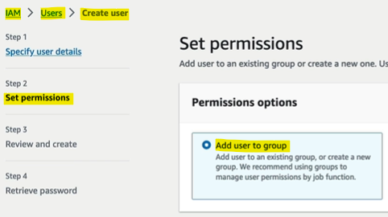
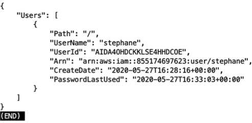

- [IAM - Identity and Access Management](#iam---identity-and-access-management)
  - [IAM Introduction: Users, groups, Policies](#iam-introduction-users-groups-policies)
    - [Root Account](#root-account)
    - [Creating Users](#creating-users)
    - [Example of Users and Groups](#example-of-users-and-groups)
    - [Assigning Permissions](#assigning-permissions)
    - [Importance of Policies](#importance-of-policies)
  - [IAM Users \& Groups Code-along with AWS](#iam-users--groups-code-along-with-aws)
    - [Accessing IAM Console](#accessing-iam-console)
    - [Creating Users](#creating-users-1)
    - [Adding Permissions](#adding-permissions)
    - [Managing Users and Groups](#managing-users-and-groups)
    - [Signing In with IAM User](#signing-in-with-iam-user)
    - [Best Practices](#best-practices)
  - [IAM Policies](#iam-policies)
    - [Introduction to IAM Policies](#introduction-to-iam-policies)
    - [Example of Group Policies](#example-of-group-policies)
    - [Multiple Group Membership](#multiple-group-membership)
    - [Policy Structure](#policy-structure)
    - [Key Concepts for the Exam](#key-concepts-for-the-exam)
    - [Detailed Policy Structure](#detailed-policy-structure)
    - [Managing Permissions](#managing-permissions)
  - [IAM MFA Overview](#iam-mfa-overview)
    - [Introduction to Protecting IAM Users and Groups](#introduction-to-protecting-iam-users-and-groups)
    - [Password Policy](#password-policy)
    - [Multi-Factor Authentication (MFA)](#multi-factor-authentication-mfa)
    - [Benefits of MFA](#benefits-of-mfa)
    - [MFA Device Options](#mfa-device-options)
  - [IAM MFA Code-along](#iam-mfa-code-along)
    - [Defining a Password Policy](#defining-a-password-policy)
    - [Setting Up Multi-Factor Authentication (MFA)](#setting-up-multi-factor-authentication-mfa)
      - [Assign MFA Device](#assign-mfa-device)
    - [Using MFA](#using-mfa)
  - [AWS Access Keys, CLI and SDK](#aws-access-keys-cli-and-sdk)
    - [Accessing AWS](#accessing-aws)
      - [How can users access AWS?](#how-can-users-access-aws)
    - [Generating Access Keys](#generating-access-keys)
    - [Command Line Interface (CLI)](#command-line-interface-cli)
    - [Software Development Kit (SDK)](#software-development-kit-sdk)
  - [AWS CLI Setup on Windows](#aws-cli-setup-on-windows)
    - [Searching for AWS CLI Installation](#searching-for-aws-cli-installation)
    - [Running the Installer](#running-the-installer)
    - [Verifying the Installation](#verifying-the-installation)
    - [Upgrading AWS CLI](#upgrading-aws-cli)
  - [AWS CLI Code-along](#aws-cli-code-along)
    - [Creating Access Keys](#creating-access-keys)
    - [Configuring AWS CLI](#configuring-aws-cli)
    - [Using AWS CLI](#using-aws-cli)
    - [Testing Permissions](#testing-permissions)
    - [Restoring Permissions](#restoring-permissions)
  - [AWS CloudShell](#aws-cloudshell)
    - [Introduction to CloudShell](#introduction-to-cloudshell)
    - [Using CloudShell](#using-cloudshell)
    - [File Management in CloudShell](#file-management-in-cloudshell)
    - [Multiple Tabs and Terminals](#multiple-tabs-and-terminals)
  - [IAM Roles for AWS Service](#iam-roles-for-aws-service)
    - [Introduction to IAM Roles](#introduction-to-iam-roles)
    - [Example of IAM Roles](#example-of-iam-roles)
    - [How IAM Roles Work](#how-iam-roles-work)
    - [Creating a Role for an EC2 Instance](#creating-a-role-for-an-ec2-instance)
    - [Verifying the Role](#verifying-the-role)
  - [IAM Security Tools](#iam-security-tools)
    - [Introduction to IAM Security Tools](#introduction-to-iam-security-tools)
    - [IAM Credentials Report](#iam-credentials-report)
    - [IAM Access Advisor](#iam-access-advisor)
    - [Practical Application](#practical-application)
    - [Generating IAM Credentials Report](#generating-iam-credentials-report)
    - [Details Included in IAM Credentials Report](#details-included-in-iam-credentials-report)
    - [Using IAM Access Advisor](#using-iam-access-advisor)
    - [Practical Application](#practical-application-1)
  - [IAM Best Practices](#iam-best-practices)
    - [Root Account Usage](#root-account-usage)
    - [One User Per Person](#one-user-per-person)
    - [User Groups and Permissions](#user-groups-and-permissions)
    - [Multi-Factor Authentication (MFA)](#multi-factor-authentication-mfa-1)
    - [Using Roles](#using-roles)
    - [Access Keys](#access-keys)
    - [Managing Permissions](#managing-permissions-1)
  - [Shared Responsibility Model for IAM](#shared-responsibility-model-for-iam)
    - [Introduction to Shared Responsibility Model](#introduction-to-shared-responsibility-model)
    - [AWS Responsibilities](#aws-responsibilities)
    - [Your Responsibilities (IAM)](#your-responsibilities-iam)
- [Quiz](#quiz)

 

 

# IAM - Identity and Access Management

## IAM Introduction: Users, groups, Policies
* IAM is a global service used to manage users and their access to AWS resources.

### Root Account
* `Root User`: Created by default when you set up your AWS account.
* `Usage`: Only use the root account for initial setup. Do not use it regularly or share it.

### Creating Users
* `Users`: Represent individual people within your organization.
* `Groups`: Users can be grouped together based on their roles or functions.

### Example of Users and Groups
Organisation Example:
* Alice, Bob, and Charles are developers.
* David and Edward are in operations.
* Fred is not part of any group (not best practice).

Groups:
* Developers Group: Alice, Bob, Charles.
* Operations Group: David, Edward.
* Audit Team: Charles, David (can belong to multiple groups).

### Assigning Permissions
* `Policies`: JSON documents that **define what actions users or groups can perform**.
  * **Example Policy**: Allows users to use EC2, Elastic Load Balancing, and CloudWatch services.
* `Least Privilege Principle`: Only give users the permissions they need to perform their tasks.

### Importance of Policies
* `Security`: Prevents unauthorized access and potential security risks.
* `Cost Management`: Avoids unnecessary costs by restricting access to only required services.

 

 

## IAM Users & Groups Code-along with AWS

### Accessing IAM Console
* Type `IAM` in the search bar and go to the `IAM console`.
* IAM is a global service, so there is **no region** selection.

### Creating Users
* `Root User`: **Avoid using the root account** for regular tasks. 

Create users for safer account management.
* `Create User`: Click on "Users" and then "Add User".
  * **Username**: Enter a username (e.g., Stephane).
  * **Access**: Provide access to the management console.
  * **Password**: Set a custom password or use an auto-generated one.

 

### Adding Permissions
* Create a **group** (e.g., admin) and **assign policies** (e.g., administrator access).

* Assign User to Group: Add the user to the created group.
* Complete the process and download the credentials.

Tags
**Optional**: Tags can be added to provide metadata (e.g., department: engineering).

 

### Managing Users and Groups
* `User List`: View the list of users and their groups.
* `Group Permissions`: Check the permissions assigned to groups and users.

### Signing In with IAM User
* `Sign-In URL`: Customise the sign-in URL with an account alias.
* `Private Window`: Use a private browser window to sign in with the IAM user without logging out the root user.

> These allow you to have two tabs open at the same time. 

### Best Practices
* `Use IAM User`: Prefer using IAM users over the root account for daily tasks.
* `Keep Credentials Safe`: Ensure you do not lose your root or admin login credentials.

 

 

## IAM Policies

### Introduction to IAM Policies
* IAM policies **define permissions for users** and **groups** in AWS.
* Policies attached to a group **apply to all members** of that group.

### Example of Group Policies
* `Developers Group`: Alice, Bob, and Charles inherit the policy attached to the developers group.
* `Operations Group`: David and Edward have a different policy specific to the operations group.
* `Inline Policies`: Policies that are attached directly to a user, regardless of group membership.

### Multiple Group Membership
* `Audit Team`: Charles and David belong to both the audit team and their respective groups (developers and operations), inheriting policies from both.

### Policy Structure
* `Version`: Indicates the policy language version (e.g., 2012-10-17).
* `ID`: Optional identifier for the policy.
* `Statements`: Can have one or multiple statements, each with key parts:
* `Sid`: Statement ID, optional identifier.
* `Effect`: Specifies whether the statement allows or denies access (e.g., allow, deny).
* `Principal`: Specifies the accounts, users, or roles to which the policy applies.
* `Action`: Lists the API calls that are allowed or denied.
* `Resource`: Lists the resources to which the actions apply (e.g., a bucket).
* `Condition`: Optional conditions for when the statement should be applied.

### Key Concepts for the Exam
* `Effect`: Understand whether the policy allows or denies actions.
* `Principal`: Know who the policy applies to.
* `Action`: Be familiar with the API calls that are controlled by the policy.
* `Resource`: Recognize the resources affected by the policy.

### Detailed Policy Structure
* `AdministratorAccess Policy`: Allows **all actions on all resources** (Action: *, Resource: *).
* `IAMReadOnlyAccess Policy`: Allows specific **read-only actions** (e.g., ListUsers, GetUser) on all resources.
* `Creating Custom Policies`: Use the visual editor or JSON editor to create custom policies.
  * **Example**: Allow ListUsers and GetUser actions on all resources.

### Managing Permissions
* **Deleting Groups**: Remove unnecessary groups (e.g., developers).
* **Adjusting User Permissions**: Modify user permissions as needed (e.g., removing IAMReadOnlyAccess).

 

 

## IAM MFA Overview
Multi Factor Authentication.

### Introduction to Protecting IAM Users and Groups
* To **prevent IAM users** and **groups** from being **compromised**.
* `Defense Mechanisms`: Password policies and Multi-Factor Authentication (MFA).

### Password Policy
* Stronger passwords increase account security.

Options:
* `Minimum Password Length`: Set a minimum number of characters.
* `Character Types`: Require uppercase letters, lowercase letters, numbers, and non-alphanumeric characters (e.g., question marks).
* `Password Changes`: Allow or disallow users to change their own passwords.
* `Password Expiration`: Require users to change their passwords periodically (e.g., every 90 days).
* `Prevent Password Reuse`: Ensure users do not reuse previous passwords.

### Multi-Factor Authentication (MFA)
* Adds an extra layer of security beyond just a password.
* `How It Works`: Combines something you know (password) with something you have (security device).
  * **Example**: Alice uses her password and an MFA token to log in securely.

### Benefits of MFA
* `Enhanced Security`: Even if a password is stolen, the account remains secure because the hacker also needs the physical MFA device.

### MFA Device Options
`Virtual MFA Device`:
* **Google Authenticator**: Works on one phone at a time.
* **Authy**: Supports multiple tokens on a single device, allowing multiple accounts and users.

`Universal 2nd Factor (U2F) Security Key`:
* **YubiKey by Yubico**: A physical device that supports multiple root and IAM users.

`Hardware Key Fob MFA Device`:
* **Gemalto**: A third-party hardware key fob.

`GovCloud Key Fob`:
* **SurePassID**: A special key fob for AWS GovCloud users.

 

 

## IAM MFA Code-along

### Defining a Password Policy
* Click on `account settings` on the left-hand side.
* Customise the **password policy** with the following options:
  * Set a minimum number of **characters**.
  * **Require** uppercase letters, lowercase letters, numbers, and non-alphanumeric characters.
  * Set passwords to **expire** after a certain period (e.g., 90 days).
  * Allow users to **change** their own passwords.
  * Ensure users **do not reuse** previous passwords.

 

### Setting Up Multi-Factor Authentication (MFA)
* Click on the **account name** and then on `security credentials`.
* Use MFA to protect the root user account.

#### Assign MFA Device
Follow these steps to set up an MFA device:
  * `Name the Device`: For example, "my iPhone".
  * `Select MFA Device Type`: Choose an authenticator app, security key, or hardware TOTP token.

  * `Set Up the App`: Use a compatible app (e.g., Twilio Authenticator) to scan the QR code.
    * e.g., iOS, Twilio Authy Authenticator.
    * Follow the instructions provided. 
    * Click "Show QR Code"

  * `Enter MFA Codes`: Enter the first and second MFA codes generated by the app to complete the setup.

 

### Using MFA
* After setting up MFA, log in to AWS with your root account and password, then enter the MFA code from the app.
* MFA adds an extra layer of security to your account.

 

 

## AWS Access Keys, CLI and SDK

### Accessing AWS
* `Management Console`: The web interface protected by username, password, and possibly multi-factor authentication (MFA).

Fake example:

* `CLI` (Command Line Interface): **Set up on your computer** and **protected by access keys**. 
  * Allows interaction with AWS services using commands from your terminal.
* `SDK` (Software Development Kit): Used to call AWS APIs from **within your application code**, also **protected by access keys**.

 

#### How can users access AWS?
To access AWS, you have three options:
1. `AWS Management Console`: Protected by your username, password, and possibly multi-factor authentication (MFA).
2. `AWS Command Line Interface` (CLI): Protected by access keys.
3. `AWS Software Development Kit` (SDK): Used for calling APIs from within your application code, also protected by access keys.

Access Keys:
* Generated through the AWS Console.
* Users manage their own access keys.
* Access keys are secret, just like a password. Do not share them.
* **Access Key ID**: Similar to a username.
* **Secret Access Key**: Similar to a password.

### Generating Access Keys
* `Management Console`: **Generate access keys** through the console.
* Users are responsible for their own access keys, which should be treated like passwords and not shared.

### Command Line Interface (CLI)
* A tool that allows you to **interact with AWS services** using **commands from your command-line shell**.
  * `Usage`: Start commands with "aws" (e.g., aws s3 cp).
  * `Benefits`: Direct access to AWS public APIs, ability to develop scripts to manage resources and automate tasks.
  * `Open-Source`: Source code available on GitHub.
  * `Alternative`: Some users prefer CLI over the Management Console.

### Software Development Kit (SDK)
* A **set of libraries** for different programming **languages to access and manage AWS services** and **APIs** **programmatically**.
  * `Languages Supported`: JavaScript, Python, PHP, .NET, Ruby, Java, Go, Node.js, C++, and more.
  * `Mobile SDK`: For Android and iOS.
  * `IoT SDK`: For Internet of Things devices.
  * **Example**: AWS CLI is built on the AWS SDK for Python named Boto.

 

 

## AWS CLI Setup on Windows

### Searching for AWS CLI Installation
* Search for "[aws CLI install windows](https://docs.aws.amazon.com/cli/latest/userguide/getting-started-install.html)" on Google.
* Choose to install the latest AWS CLI version.
* Scroll down to find the MSI installer link for Windows and click to download it.

### Running the Installer
* Start Installation: Run the downloaded MSI installer.

Installation Steps:
1. Click on "Next".
2. Accept the terms of the license agreement.
3. Click on "Next".
4. Click on "Install" and wait for the installation to complete.
5. Allow any permissions requested during the installation.
6. Click on "Finish" once the installation is complete.

### Verifying the Installation
* Open the Command Prompt on Windows.
* Check Version: Type `aws --version` and press **Enter**.

> If you see a result like aws-cli/2.x.x Python/3.x.x Windows/x.x, it means the AWS CLI is properly installed.

### Upgrading AWS CLI
* To upgrade, simply re-download the MSI installer. 
* Run the installer again to automatically upgrade the AWS CLI.

 

 

## AWS CLI Code-along

### Creating Access Keys
* Click on your **username**, go to Security credentials, and scroll down to **create an access key**.

* Choose the **purpose** of the access key (e.g., for CLI).
  * AWS may recommend alternatives like CloudShell or IAM Identity Center for CLI access.

* Click "Next".
* Create Access Key: Acknowledge the recommendations and create the access key. This is the only time you can view the access key and secret access key.

For example:

 

### Configuring AWS CLI
* Type aws `configure` in the command line.
* Enter Access Key ID: Input the access key ID.
* Enter Secret Access Key: Input the secret access key.
* Default Region Name: Choose a region close to you (e.g., eu-west-1).
* Default Output Format: Press `Enter` to accept the default.

For example:

 

### Using AWS CLI
* Use the command `aws iam list-users` to list all users in your account.

For exmple:

 

### Testing Permissions
* Remove a user from a group to test permissions.

* Refresh the UI and use the CLI to verify that permissions are denied if the user is removed from the group.

 

### Restoring Permissions
* Add User Back to Group: Ensure to add the user back to the group to restore permissions.
  * `Users` > `admins` > `Add Users to group` > refresh page > click "Stephanie". 

 

 

## AWS CloudShell

### Introduction to CloudShell
* CloudShell is an alternative to using the terminal for issuing commands against AWS.
* Icon Location: Found in the top right corner of your screen.

* Not available in all regions. 
  * Check CloudShell [availability regions](https://docs.aws.amazon.com/cloudshell/latest/userguide/supported-aws-regions.html) to ensure it is supported in your region.

 

### Using CloudShell
* Takes a minute to launch.
* You can issue AWS commands directly in CloudShell.
  * Example: `aws --version` to check the version.
* The default region in CloudShell is the region you are currently logged into.

### File Management in CloudShell
* `Creating Files`: Use commands like echo "test" > demo.txt to create files.
* Files created in CloudShell **persist** even after restarting the environment.
* **Customise** font size, theme (light or dark), and other settings.
* Easily **upload and download files** within CloudShell.

### Multiple Tabs and Terminals
* Open new tabs within CloudShell.
* Split the terminal into columns for multiple views.

 

 

## IAM Roles for AWS Service

### Introduction to IAM Roles
* IAM Roles are used to **assign permissions to AWS services** so they can **perform actions on your behalf**.
  * Unlike IAM users, IAM roles are not for physical people but for AWS services.

 

### Example of IAM Roles
* An EC2 instance (a virtual server) may need to perform actions on AWS. To do this, it uses an IAM role with the necessary permissions.

`Other Common Roles`:
* Lambda Function Roles: Used by AWS Lambda functions to perform actions.
* CloudFormation Roles: Used by AWS CloudFormation to manage resources.

 

### How IAM Roles Work
* Create an IAM role and assign it the necessary permissions.
* When an AWS service (e.g., an EC2 instance) tries to access AWS resources, it uses the IAM role. 
  * If the permissions are correct, the service can perform the actions.

 

### Creating a Role for an EC2 Instance
Step-by-Step Instructions:
1. Navigate to Roles: On the left-hand side, click on "Roles".
2. Create Role: Click on "Create role".

3. Select AWS Service: Choose "AWS service" as the type of trusted entity.
4. Choose Service: Select "EC2" from the list of services.

5. Attach Policy: Attach the "IAMReadOnlyAccess" policy to allow the EC2 instance to read IAM information.

6. Enter a role name, for example, "DemoRoleForEC2".

7. Verify the permissions and create the role.

 

### Verifying the Role
* The created role will appear in the role list.
*  Ensure the permissions are correct for the role.

 

 

## IAM Security Tools

### Introduction to IAM Security Tools
* To enhance security by monitoring and managing user credentials and permissions.

### IAM Credentials Report
* Generates a report containing all users in your account and the status of their various credentials.
* Helps in auditing and ensuring that credentials are managed properly.

### IAM Access Advisor
* Shows the service permissions granted to a user and when those services were last accessed.
* Helps identify unused permissions so they can be reduced, ensuring users have only the permissions they need.

### Practical Application
* Learn how to generate and interpret the IAM Credentials Report.
* Understand how to use the IAM Access Advisor to manage user permissions effectively.

 

### Generating IAM Credentials Report
* Provides a comprehensive report of all users in your account and the status of their credentials.

Steps:
1. Navigate to Credential Report: On the left-hand side, click on "Credential report".
2. Click on "Download credential report" to create a CSV file.

3. Open the CSV (or excel) file to review details such as user creation date, password status, MFA status, access keys, and more.

### Details Included in IAM Credentials Report
* `User Information`: Root account and user accounts.
* `Password Status`: Enabled or not, last used, last changed, and next rotation.
* `MFA Status`: Whether MFA is active for each account.
* `Access Keys`: Creation status, last rotated, last used, and other details.

### Using IAM Access Advisor
* Shows the service permissions granted to a user and when those services were last accessed.

Steps:
1. Go to the IAM section and select the user (e.g., stephane).
2. Click on the "Last Access" tab on the right-hand side.

3. View which services were accessed by the user and when.
4. Identify unused permissions and adjust them to align with the principle of least privilege.

### Practical Application
* Helps identify users who haven't changed their passwords or used their accounts, aiding in security management.
* Assists in managing granular user access permissions by showing which services are actually used.

 

 

## IAM Best Practices

### Root Account Usage
* Use the root account only for setting up your AWS account.
* After setup, create a personal account for daily use.

### One User Per Person
* Each AWS user should have their own account. Do not share credentials.
* If someone else needs access, create a new user for them.

### User Groups and Permissions
* Assign users to groups and manage permissions at the group level.
* Implement a strong password policy to enhance security.

### Multi-Factor Authentication (MFA)
* Use and enforce MFA to add an extra layer of security to your accounts.

### Using Roles
* Create and use roles to give permissions to AWS services, including EC2 instances (virtual servers).

### Access Keys
* For programmatic access or using the CLI, generate access keys.
* Treat access keys like passwords and keep them private.

### Managing Permissions
* Use this report to review and manage user credentials.
* Use this tool to see which services users have accessed and adjust permissions accordingly.

 

 

## Shared Responsibility Model for IAM

### Introduction to Shared Responsibility Model
* Ensures you understand what AWS is responsible for and what you are responsible for.

### AWS Responsibilities
* `Infrastructure`: AWS manages and secures the infrastructure.
* `Global Network Security`: AWS ensures the security of their global network.
* `Service Configuration and Vulnerability Analysis`: AWS handles the configuration and vulnerability analysis of the services they offer.
* `Compliance`: AWS is responsible for compliance with various standards and regulations.

### Your Responsibilities (IAM)
* `User Management`: Create and manage your own users, groups, roles, and policies.
* `Policy Management`: Manage and monitor the policies you create.
* `MFA`: Enable and enforce Multi-Factor Authentication (MFA) on all accounts.
* `Key Rotation`: Ensure that access keys are rotated regularly.
* `Permission Management`: Use IAM tools to apply appropriate permissions.
* `Access Analysis`: Analyse access patterns and review permissions in your accounts.

 

 

# Quiz

1. What is a proper definition of IAM Roles?
   * An IAM entity that defines a set of permissions for making AWS service requests, that will be used by AWS services. 
   * Some AWS service will need to perform actions on your behalf. To do so, you assign permissions to AWS services with IAM Roles.

2. Which of the following is an IAM Security Tool?
   * IAM Credentials Report. 
   * IAM Credentials report lists all your account's users and the status of their various credentials. The other IAM Security Tool is IAM Access Advisor. It shows the service permissions granted to a user and when those services were last accessed.

3. Which answer is INCORRECT regarding IAM Users?
   * IAM users access AWS with the root account credentials.
   * IAM Users access AWS using a username and a password.

4. Which of the following is an IAM best practice?
   * Don't use the root user account.
   * You only want to use the root account to create your first IAM user, and for a few account and service management tasks. For every day and administration tasks, use an IAM user with permissions.

5. What are IAM Policies?
   * JSON documents to define users, Groups and Roles' permissions. 
   * An IAM policy is an entity that, when attached to an identity or resource, defines their permissions.

6. Under the shared responsibility model, what is the customer responsible for in IAM?
   * Assigning users proper IAM policies.
   * Customers are responsible for defining and using IAM policies.

7. Which of the following statements is TRUE?
   * The `AWS CLI` (Command Line Interface) allows you to interact with AWS services using commands in your command-line shell. 
     * This is useful for tasks like managing AWS resources, automating workflows, and scripting.
   * `AWS SDK` (Software Development Kit) enables you to interact with AWS programmatically. 
     * It provides libraries for various programming languages, allowing you to integrate AWS services into your applications and automate tasks through code.

8. Which principle should you apply regarding IAM Permissions?
   * Grant least privilege.
   * Don't give more permissions than the user needs.

9. What should you do to increase your root account security?
    * Enable Multi-Factor Authentication (MFA).
    * You want to enable MFA in order to add a layer of security, so even if your password is stolen, lost or hacked your account is not compromised.

 
