- [Deployments \& Managing Infrastructure at Scale](#deployments--managing-infrastructure-at-scale)
  - [CloudFormation Overview](#cloudformation-overview)
    - [AWS CloudFormation Overview](#aws-cloudformation-overview)
    - [Key Concepts](#key-concepts)
    - [Benefits](#benefits)
    - [Visualisation](#visualisation)
    - [Use Cases](#use-cases)
  - [CloudFormation Code-along](#cloudformation-code-along)
    - [Creating a Stack](#creating-a-stack)
    - [Updating a Stack](#updating-a-stack)
    - [CloudFormation \& Application Composer Example](#cloudformation--application-composer-example)
  - [CDK Overview](#cdk-overview)
    - [AWS Cloud Development Kit (CDK) Overview](#aws-cloud-development-kit-cdk-overview)
    - [Key Concepts](#key-concepts-1)
    - [Example Workflow](#example-workflow)
    - [Benefits](#benefits-1)
    - [Example CDK Code](#example-cdk-code)
  - [Beanstalk Overview](#beanstalk-overview)
    - [AWS Elastic Beanstalk Overview:](#aws-elastic-beanstalk-overview)
    - [Key Concepts](#key-concepts-2)
      - [Web App 3-tier Architecture](#web-app-3-tier-architecture)
    - [Benefits](#benefits-2)
    - [Deployment Models](#deployment-models)
    - [Supported Platforms](#supported-platforms)
    - [Health Monitoring](#health-monitoring)
  - [Beanstalk Code-along](#beanstalk-code-along)
    - [AWS Elastic Beanstalk Overview](#aws-elastic-beanstalk-overview-1)
    - [Creating an Application](#creating-an-application)
    - [Configuring Service Access in AWS Elastic Beanstalk](#configuring-service-access-in-aws-elastic-beanstalk)
    - [Deploying the Application](#deploying-the-application)
    - [Accessing the Application](#accessing-the-application)
    - [Managing the Application](#managing-the-application)
      - [Upload New Version](#upload-new-version)
      - [Health Monitoring](#health-monitoring-1)
      - [Logs and Monitoring](#logs-and-monitoring)
      - [Configuration](#configuration)
    - [Creating Multiple Environments](#creating-multiple-environments)
  - [CodeDeploy Overview](#codedeploy-overview)
    - [AWS CodeDeploy Overview](#aws-codedeploy-overview)
    - [Key Concepts](#key-concepts-3)
    - [How It Works](#how-it-works)
    - [Benefits](#benefits-3)
  - [Codebuild Overview](#codebuild-overview)
    - [AWS CodeBuild Overview](#aws-codebuild-overview)
    - [Key Concepts](#key-concepts-4)
    - [Benefits](#benefits-4)
    - [Summary](#summary)
  - [CodePipeline Overview](#codepipeline-overview)
    - [AWS CodePipeline Overview](#aws-codepipeline-overview)
    - [Key Concepts](#key-concepts-5)
    - [How It Works](#how-it-works-1)
    - [Benefits](#benefits-5)
    - [Summary](#summary-1)
  - [CodeArtifact Overview](#codeartifact-overview)
    - [AWS CodeArtifact Overview](#aws-codeartifact-overview)
    - [Key Concepts](#key-concepts-6)
    - [How It Works](#how-it-works-2)
    - [Benefits](#benefits-6)
    - [Summary](#summary-2)
  - [Systems Manager (SSM) Overview](#systems-manager-ssm-overview)
    - [AWS Systems Manager (SSM) Overview](#aws-systems-manager-ssm-overview)
    - [Key Concepts](#key-concepts-7)
    - [Important Features](#important-features)
    - [How SSM Works](#how-ssm-works)
  - [SSM Session Manager](#ssm-session-manager)
    - [Session Manager Overview](#session-manager-overview)
    - [Key Concepts](#key-concepts-8)
    - [Instructions for Using SSM Session Manager:](#instructions-for-using-ssm-session-manager)
    - [Summary](#summary-3)
  - [SSM Parameter Store](#ssm-parameter-store)
    - [AWS Systems Manager Parameter Store Overview](#aws-systems-manager-parameter-store-overview)
    - [Key Concepts](#key-concepts-9)
    - [How It Works](#how-it-works-3)
    - [Summary](#summary-4)
- [Quiz](#quiz)

 

 

# Deployments & Managing Infrastructure at Scale

## CloudFormation Overview

### AWS CloudFormation Overview
* A **declarative** way to **outline** and **manage** AWS **infrastructure** as **code**.
* **Automatically** **creates** and **configures** AWS **resources** in the correct order **based on your specifications**.

### Key Concepts
* `Infrastructure as Code`: Define your infrastructure using **code**, ensuring **consistency** and **control**.
* `Declarative Syntax`: Specify what resources you need (e.g., security groups, EC2 instances, S3 buckets, load balancers) and CloudFormation handles the rest.

### Benefits

`Consistency and Control`
* No manual resource creation.
* Changes are reviewed through code review processes.

`Cost Management`
* Resources within a stack are tagged similarly.
* Easily estimate costs using CloudFormation templates.
* Implement cost-saving strategies (e.g., automate deletion and recreation of resources during off-hours).

`Productivity`
* Easily create and delete resources.
* Generate architecture diagrams automatically.
* Declarative programming simplifies resource dependencies.

`Leverage Existing Templates`
* Use existing templates and documentation.
* Supports almost all AWS resources.
* Use custom resources for unsupported resources.

### Visualisation
* `Application Composer`: Visualise CloudFormation templates to see all resources and their relationships.

### Use Cases
* **Repeatable** and **consistent** infrastructure across **different environments**, regions, or AWS accounts.

 
****

## CloudFormation Code-along

### Creating a Stack

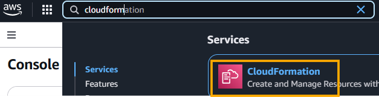

1. Select Region
   * Ensure you are in the US East (N. Virginia) region (us-east-1) as the template provided works only in this region.

2. Create a Stack
   * Choose to create a stack and prepare a template.
   * Options include using an **existing template**, a **sample template**, or **building from Application Composer**.

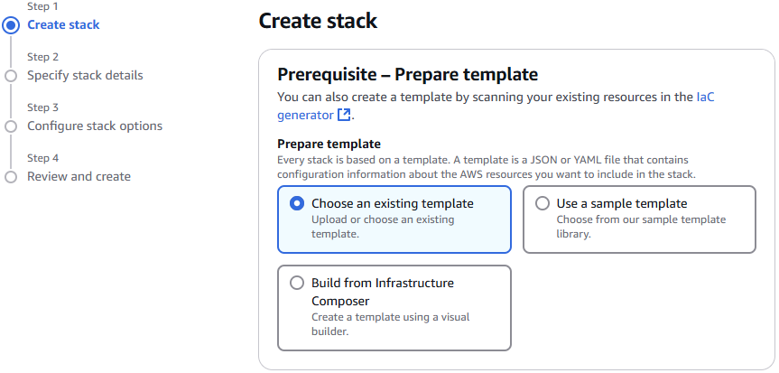

3. Upload Template
   * Upload the provided template file (e.g., 0-just-EC2.yaml).
   * This template defines an EC2 instance with specific properties (availability zone, AMI ID, instance type).

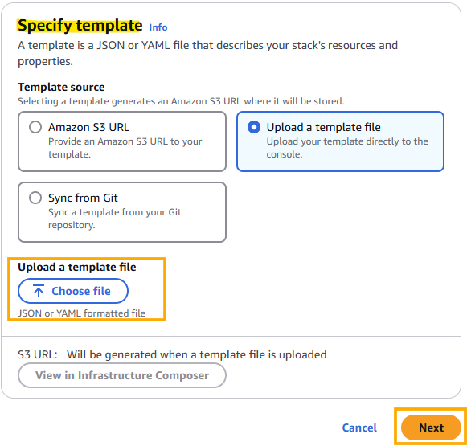

4. View in Application Composer
   * Open the template in `Application Composer` to visualise the resources and their relationships.

5. Configure Stack
   * Provide a stack name (e.g., demo CloudFormation).
   * Optionally, add tags (e.g., CFDemo).
   * Review and submit the stack creation.

 

### Updating a Stack
1. `Update Template`
   * Replace the existing template with a more complete one (e.g., 1-ec2-with-sg-eip.yaml).
   * This template includes additional resources like security groups and an Elastic IP.

2. `Provide Parameters`
   * Enter required parameters (e.g., security group description).

3. `Review Change Set`
   * Preview the changes that will be applied to the stack.
   * Understand which resources will be added, modified, or replaced.

4. `Submit Update`
   * Submit the update and let CloudFormation handle the resource creation and updates.

  

### CloudFormation & Application Composer Example
Example: `WordPress CloudFormation Stack`
* We can see all the resources.
* We can see the relations between the components.

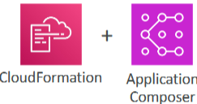

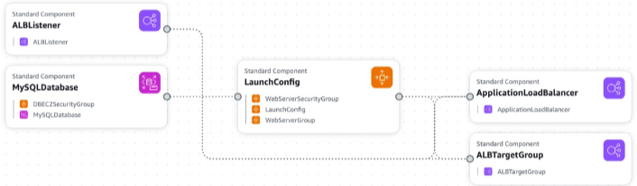

 

 

## CDK Overview

### AWS Cloud Development Kit (CDK) Overview
* **Define** your cloud infrastructure using familiar **programming languages** instead of YAML.
* `Supported Languages`: JavaScript, TypeScript, Python, Java, .NET.

### Key Concepts
* `Programming Language`: Use your **preferred** programming **language** to define cloud infrastructure.
* `Compilation`: **CDK code** is compiled into **CloudFormation templates** (JSON or YAML).
* `Deployment`: Deploy **infrastructure** and application **runtime code together**, which is beneficial for Lambda functions and Docker containers in ECS and EKS.

### Example Workflow
1. Choose a Programming Language
   * Example: Python.

2. Write CDK Application
   * Define resources like Lambda functions, DynamoDB tables, etc.

3. Compile with CDK CLI
   * Transform the CDK application into CloudFormation templates.

4. Deploy with CloudFormation
   * Use the generated CloudFormation templates to deploy infrastructure.

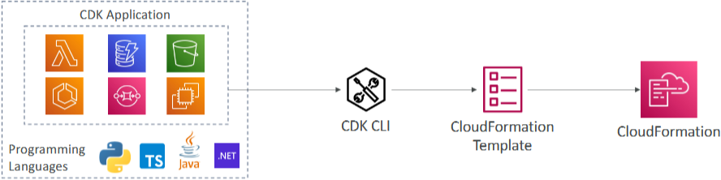

 

### Benefits
* `Type Safety`: Ensures code correctness.
* `Familiar Constructs`: Use loops, conditionals, and other programming constructs.
* `Code Reusability`: Reuse code across different projects.
* `Faster Development`: Write infrastructure code more quickly and efficiently.

### Example CDK Code
1. VPC that is defined.
2. An ECs Cluster.
3. An Application Load Balancer with a Fargate service. 

> These three things will be **compiled by the CDK**, CLI into **CloudFormation template** that will be **usable**, and that you can **upload and deploy**.

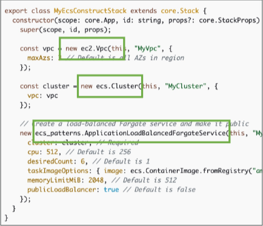

 

 

## Beanstalk Overview

### AWS Elastic Beanstalk Overview:
* A **developer-centric platform** for **deploying web applications** on AWS.
* `Architecture`: Typically follows a 3-tier architecture with a **load balancer**, EC2 instances in an **auto-scaling group**, and a **database** (e.g., Amazon RDS).

### Key Concepts
`3-Tier Architecture:`
* `Load Balancer`: Distributes traffic across multiple EC2 instances.
* `Auto Scaling Group`: Manages the EC2 instances to handle varying loads.
* `Database`: Stores data, can be Amazon RDS for relational data or ElastiCache for in-memory caching.

 

#### Web App 3-tier Architecture

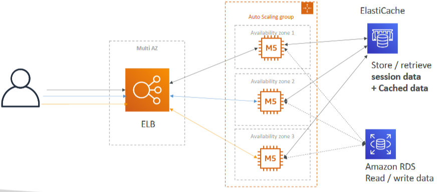

 

### Benefits
* `Developer-Centric`: Focus on deploying code without managing infrastructure.
* `Managed Service`: Beanstalk handles EC2 instance configuration, operating system, deployment, auto-scaling, load balancing, and health monitoring.
* `Platform as a Service` (PaaS): Simplifies the deployment process by abstracting the underlying infrastructure.

### Deployment Models
* `Single Instance Deployment`: Suitable for development environments.
* `Load Balancer and Auto Scaling Group`: Ideal for production or pre-production web applications.
* `Auto Scaling Group Only`: For non-web applications like workers.

### Supported Platforms
* `Programming Languages`: Go, Java, .NET, Node.js, PHP, Python, Ruby.
* `Containers`: Docker, Multi Docker, Preconfigured Docker.

### Health Monitoring
* `Health Agent`: Runs on each EC2 instance, pushing metrics to CloudWatch.
* `Monitoring Suite`: Available within Beanstalk for viewing metrics and application health.

 

 

## Beanstalk Code-along

### AWS Elastic Beanstalk Overview
* A developer-centric platform for deploying web applications on AWS.
* 3-tier architecture with a **load balancer**, EC2 instances in an **auto-scaling group**, and a **database** (e.g., Amazon RDS).

### Creating an Application

1. Access Elastic Beanstalk Console
   * Go to the Elastic Beanstalk console.

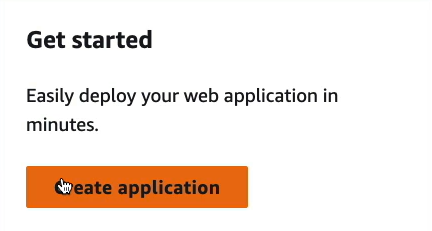

2. Create Application
   * Choose "Web server environment" for running a website.
   * Name your application (e.g., MyApplication).

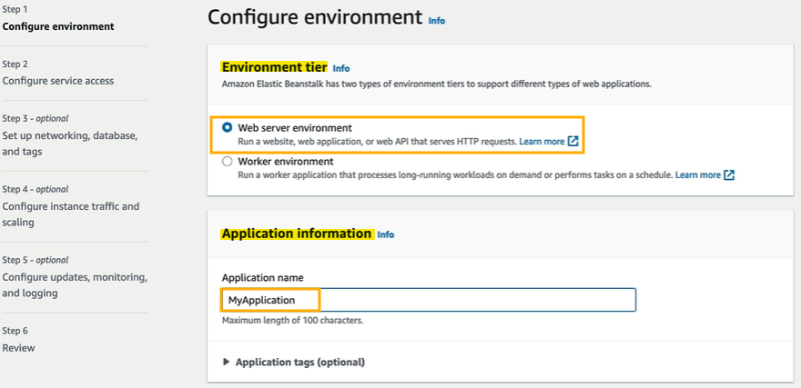

3. Environment Information
   * Name your environment (e.g., MyApplication-dev).
   * A domain name will be automatically generated.
     * This link will be how you access your web servers.

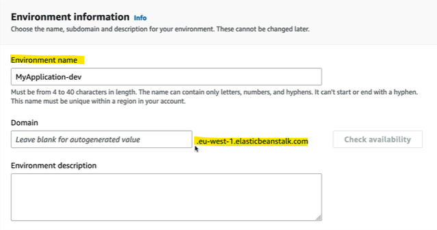

4. Choose Platform
   * Select a managed platform (e.g., Node.js) and use default options.

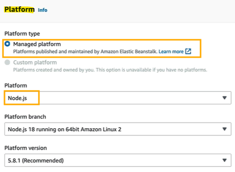

5. Application Code
   * Use a sample application for initial setup.
     * This will be matching the environment we've just created in step 4 (platform).

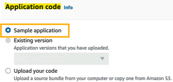

6. Configuration Presets
   * Choose "Single instance" for simplicity (free tier eligible).

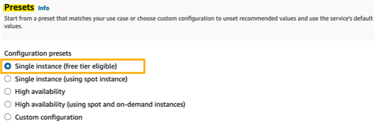

7. Service Access Configuration
   * Create a new service role (elasticbeanstalk-service-role).
   * Manually create an EC2 instance profile if needed (aws-elasticbeanstalk-ec2-role).

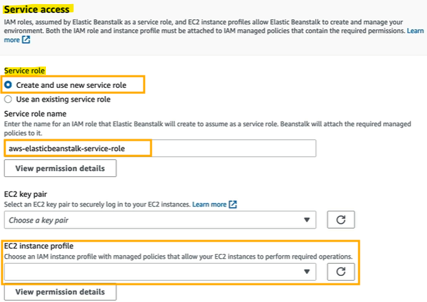

 

### Configuring Service Access in AWS Elastic Beanstalk
* Because our EC2 instance profile hasn't been created yet, we need to set up `IAM roles` that **allow Beanstalk to perform necessary actions**.

1. Go to the IAM Console
   * Navigate to the IAM console in AWS.

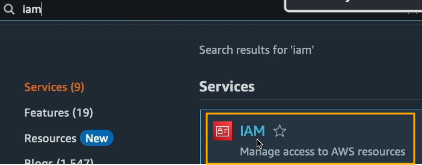

2. Create a Role
   * On the left-hand side, click on "Roles" and then "Create role".

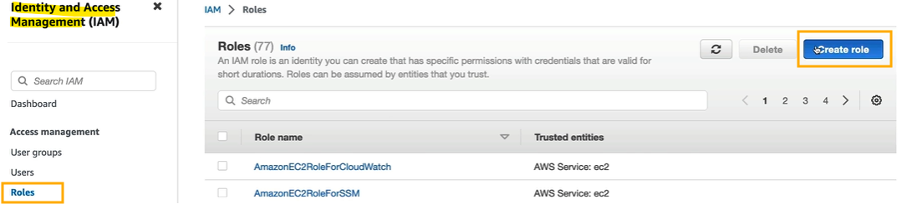

3. Select EC2 Service
   * Choose "EC2" as the service that will use this role and click "Next".

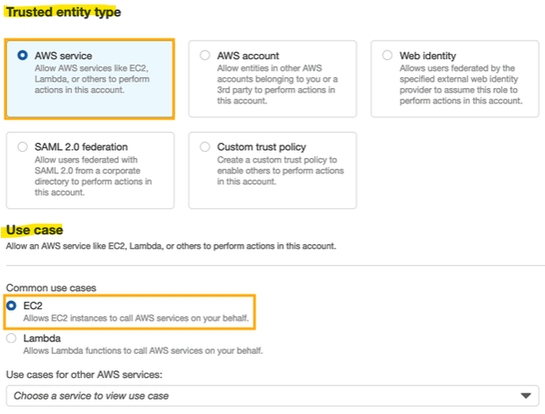

4. Add Permissions Policies
   * Filter by typing "beanstalk" and add the following policies:
     * AWSElasticBeanstalkWebTier
     * AWSElasticBeanstalkWorkerTier
     * AWSElasticBeanstalkMulticontainerDocker
   * Click on "Next".

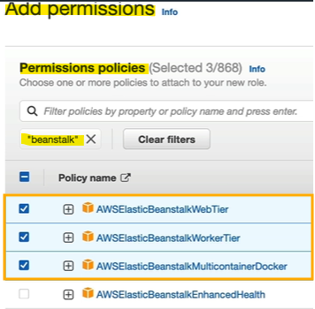

5. Name the Role
   * Enter the role name as "aws-elasticbeanstalk-ec2-role" (with hyphens).

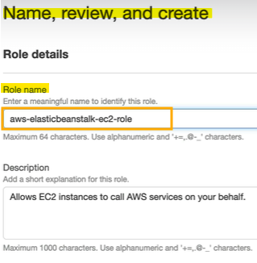

6. Create the Role
   * Click on "Create role" to finalize the creation.

7. Refresh the Beanstalk Console
    * Go back to the Elastic Beanstalk console and refresh the page.
    * The aws-elasticbeanstalk-ec2-role should now be pre-filled.

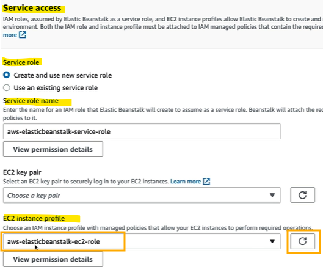

8. Proceed with the Setup
    * Once the roles are configured, you are good to go and can continue with the Elastic Beanstalk setup.

 

### Deploying the Application

1. `Submit Configuration`
   * Skip optional configurations and submit the setup by clicking "Skip to review".

2. `Monitor Events`
   * Check the Events tab for progress updates.
   * CloudFormation handles the creation of resources.

3. `Verify Resources`
   * Check EC2 console for running instances.
   * Verify Elastic IP and Auto Scaling group creation.

4. Click on "Submit" when you're happy.

 

### Accessing the Application

`Domain Name:`
* Use the **generated domain name** to access your Beanstalk environment.
* Verify the application is **running** (e.g., "Congratulations, you are now running Elastic Beanstalk on this EC2 Instance").

 

### Managing the Application

#### Upload New Version
Option to upload and deploy new application versions.

1. Navigate to the `Elastic Beanstalk` console.
2. Select **your** application environment.
3. Click on "Upload and deploy" to upload a **new version** of your application.
4. Choose the application **version file** and click "Deploy" to **update your instances** with the new version.

 

#### Health Monitoring
View health checks and metrics for your instances.

1. In the `Elastic Beanstalk` console, select **your** application environment.
2. Go to the "Health" tab to view the health status of your instances.
3. Monitor metrics such as CPU utilisation, latency, and request count to ensure your application is running smoothly.

 

#### Logs and Monitoring
Access application logs and monitoring metrics.

1. Select **your** application environment in the `Elastic Beanstalk` console.
2. Click on the "Logs" tab to access logs for your application.
3. You can request logs from your instances and view them directly in the console.
4. For detailed monitoring, go to the "Monitoring" tab to view metrics and set up alarms.

 

#### Configuration
Modify and apply configurations for your Beanstalk environment.

1. In the `Elastic Beanstalk` console, select **your** application environment.
2. Click on the "Configuration" tab to **view** and **modify** the **settings** for your environment.
3. You can adjust settings related to instances, capacity, load balancing, scaling, and more.
4. After making changes, click "Apply" to update your environment with the new configuration.

 

### Creating Multiple Environments

`Development and Production`
* Create separate environments (e.g., MyApplication-dev and MyApplication-prod) for different stages of your application.

 

 

## CodeDeploy Overview

### AWS CodeDeploy Overview
* **Automate** the deployment of applications.
* Does not require Beanstalk or CloudFormation; works **independently**.

### Key Concepts
* `Application Upgrade`: Deploy applications from version 1 to version 2.
* `Hybrid Service`: Works with both EC2 instances and On-Premises Servers.
  * Facilitates the transition from On-Premises to AWS.

### How It Works
* `EC2 Instances`: Upgrade applications on multiple EC2 instances.
* `On-Premises Servers`: Upgrade applications on On-Premises Servers.
* `Provisioning`: Servers must be provisioned ahead of time.
  * Install the CodeDeploy agent on servers to assist with upgrades.

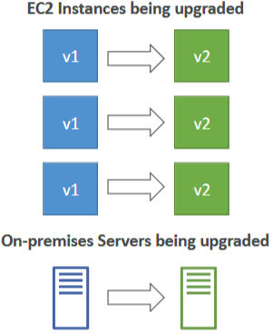

 

### Benefits
* `Flexibility`: Works with any kind of servers (EC2 or On-Premises).
* `Single Interface`: Manage upgrades from a single interface.
* `Consistency`: Use the same deployment method for both On-Premises and AWS environments.

  

 

## Codebuild Overview

### AWS CodeBuild Overview
* Build your code in the cloud.
* Functionality: Compiles source code, runs tests, and produces deployable packages.

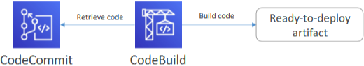

 

### Key Concepts
`Code Compilation:`
* Source code is compiled.Tests are run.
* Output produces packages ready for deployment.

`Integration:`
* Retrieves code from CodeCommit.
* Runs defined scripts to build the code.
* Produces ready-to-deploy artifacts.

 

### Benefits
`Fully Managed and Serverless:`
* No servers to manage.
* Focus on coding while AWS handles the build process.

`Scalability and Availability:`
* Continuously scalable and highly available.

`Security:`
* Secure environment for building code.

`Pay-As-You-Go Pricing:`
* Only pay for the time your code is being built.

 

### Summary
* `Ideal for Developers`: Best for developers who want to build code in the cloud without managing infrastructure.
* `Integration with CodeCommit`: Seamlessly integrates with CodeCommit for retrieving and building code.
* `Deployment Ready`: Produces artifacts ready for deployment, for example, by CodeDeploy.

 

 

## CodePipeline Overview

### AWS CodePipeline Overview
* **Orchestrate** the different **steps** to **automatically push code** to production.
* **Connects services** like CodeCommit and CodeBuild to create a seamless deployment pipeline.

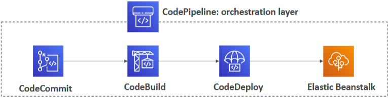

 

### Key Concepts

`Pipeline Orchestration:`
* Define a pipeline that takes **code**, **builds** it, **tests** it, **provisions** servers, and **deploys** the application.
* Can handle more complex workflows as needed.

`Continuous Integration and Continuous Delivery (CI/CD):`
* Ensures that every time a developer pushes code to a repository, it is built, tested, and deployed automatically.

 

### How It Works
`Orchestration Layer:`
* **Takes** code from CodeCommit.
* **Builds** it with CodeBuild.
* **Deploys** it with CodeDeploy.
* Can deploy to environments like Elastic Beanstalk.

 

### Benefits
`Fully Managed:`
* No need to manage the underlying infrastructure.

`Compatibility:`
* Works with various services such as CodeCommit, CodeBuild, CodeDeploy, Elastic Beanstalk, CloudFormation, GitHub, and other third-party services and custom plugins.

`Fast Delivery and Rapid Updates:`
* Enables quick and efficient code delivery and updates.

 

### Summary
* `Ideal for CI/CD`: Core service for Continuous Integration and Continuous Delivery in AWS.
* `Orchestration`: Manages the entire process from code commit to deployment.
* `Compatibility`: Integrates with a wide range of AWS services and third-party tools.

 

 

## CodeArtifact Overview

### AWS CodeArtifact Overview
* Secure, scalable, and cost-effective **artifact management service** for software development.
* **Stores** and **retrieves code** dependencies, also known as `software packages`.

 

### Key Concepts
`Code Dependencies:`
* Software packages often depend on each other to be built.
* Managing these dependencies is called `artifact management`.

`Traditional Setup:`
* Traditionally, you might set up your own artifact management system using Amazon S3 or custom software on EC2 instances, which can be complicated.

 

### How It Works
`AWS CodeArtifact:`
* Provides a **managed service** for artifact management.
* Supports **common dependency management** tools like Maven, Gradle, npm, yarn, twine, pip, and NuGet.
* Allows developers to store and retrieve code dependencies securely.

 

### Benefits
`Secure and Scalable:`
* Ensures **secure storage** and **retrieval** of dependencies.
* Scales according to your needs.

`Cost-Effective:`
* **Eliminates** the need to **set up and maintain** your own infrastructure.

`Integration:`
* Integrates with **CodeCommit** and **CodeBuild**.
* **CodeBuild** can **retrieve dependencies** directly from CodeArtifact during the build process.

 

### Summary
* `Ideal for Teams`: Best for teams needing an **artifact management system** or a place to store code dependencies.
* `Managed Service`: Simplifies the process of managing code dependencies by providing a secure and scalable solution.

 

 

## Systems Manager (SSM) Overview

### AWS Systems Manager (SSM) Overview
* Manage your fleet of EC2 instances and On-Premises systems at scale.
* Hybrid Service: Works with both On-Premises and AWS environments.

### Key Concepts
* `Operational Insights`: Provides insights into the state of your infrastructure.
* `Suite of Products`: Access to over 10 products for various management tasks.

### Important Features
* `Automated Patching`: Automatically patch servers and instances for enhanced compliance.
* `Run Commands`: Execute commands across your entire fleet of servers directly from SSM.
* `Parameter Store`: Store and manage configuration data securely.
* `Supported Platforms`: Works with Linux, Windows, Mac OS, and Raspberry Pi.

 

### How SSM Works

`SSM Agent:`
* Install the SSM agent on systems to be managed.
* The agent runs in the background and reports back to the SSM service.
* Pre-installed on Amazon Linux AMI and some Ubuntu AMIs.

`Hybrid Service:`
* Links to both EC2 instances and On-Premises virtual machines.
* Use SSM to run commands, patch, and configure servers consistently.

 

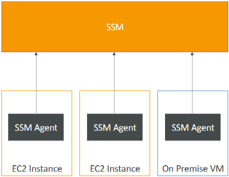

 

 

## SSM Session Manager

### Session Manager Overview
* Start a secure shell on EC2 instances and on-premises servers without SSH access, bastion host, or SSH keys.
* Port 22 on EC2 instances is closed, enhancing security.

### Key Concepts

`SSM Agent`: Installed on EC2 instances and on-premises servers.
  * Connects to the Session Manager service.

`User Access`: Users can access instances through the Session Manager service to execute commands.

`Supported Platforms`: Linux, macOS, and Windows.

`Logging`: Log data can be sent to Amazon S3 or CloudWatch Logs for enhanced security.

 

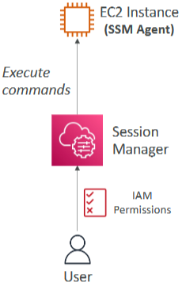

 

### Instructions for Using SSM Session Manager:

1. `Launch an EC2 Instance`
   * Choose **Amazon Linux 2 AMI**, **t2.micro**.
   * Do **not** use any key pair.
   * **Disable SSH** traffic (no HTTP, HTTPS, or SSH allowed).

2. `Attach IAM Instance Profile`
   * Create a new IAM role profile for the instance.
   * Create a role for Amazon EC2 with the Amazon SSM managed instance core policy.
   * Name the role (e.g., demo EC2 role for SSM).
   * Attach the role to the EC2 instance.

3. `Check SSM Service`
   * Go to Systems Manager and look for Fleet Manager.
   * Wait for the EC2 instance to appear as a managed node.

4. `Start a Session`
   * Go to Session Manager in Systems Manager.
   * Start a session on the EC2 instance.
   * Execute commands securely without SSH access.

 

### Summary

`Access Methods:`
* Port 22 and SSH Keys: Traditional method using SSH keys and terminal.
* EC2 Instance Connect: Temporary SSH keys uploaded to the instance.
* Session Manager: Secure shell without SSH keys or port 22 access.

`IAM Role`: Ensure the EC2 instance has an IAM role allowing access to Systems Manager.

`Session History`: Session history is saved in logs for review.

 

 

## SSM Parameter Store

### AWS Systems Manager Parameter Store Overview
* Store **configuration** and **secrets** **securely** on AWS.
* Store API keys, passwords, configurations, and more.

### Key Concepts
* `Serverless`: No infrastructure to manage.
* `Scalable`: Handles many API calls efficiently.
  * Durable and Easy to Use:
  * Reliable storage with a user-friendly interface.
* `Secure`: Control access to parameters using IAM.
* `Version Tracking`: Track changes to parameters over time.
* `Optional Encryption`: Encrypt parameters using AWS KMS for added security.

 

### How It Works

1. Create a Parameter
   * Go to `Systems Manager` and select `Parameter Store`.
   * Click on "Create parameter".
   * Name the parameter (e.g., demo parameter).
   * Choose the **tier** (standard or advanced).
   * Select the **type** (string, string list, or secure string).
   * Enter the **value** (e.g., my configuration parameter).
   * Create the parameter.

2. Retrieve and Manage Parameters
   * Click on the **parameter** to view its value.
   * **Edit** the parameter to **create new versions**.
   * Delete the parameter when no longer needed.

 

### Summary
* `Ideal for Secure Storage`: Best for securely storing and managing configuration data and secrets.
* `User-Friendly`: Simple to create, retrieve, and manage parameters.
* `Secure and Scalable`: Ensures secure access and handles large volumes of API calls.

 

 

# Quiz

1. Which AWS managed service allows to automate software deployments to a hybrid mix of EC2 Instances and On-Premises servers?
   * CodeDeploy.
   * AWS CodeDeploy is a service that automates code deployments to any instance, including Amazon EC2 instances and instances running on-premises.

2. You are a software developer working on a project with your team. You need a secure and reliable version control system to store, share, and collaborate your code with the team. Which AWS service can help the developers?
   * CodeCommit.
   * AWS CodeCommit is a secure, highly scalable, managed source control service that makes it easier for teams to collaborate on code. 
   * It also provides software version control.

3. You need a unified user interface that gives you visibility, control, and patching capabilities for your EC2 Instances on AWS, as well as for servers running in your on-premises data centers. Which service should you use?
   * AWS Systems Manager.
   * AWS Systems Manager gives you visibility and control of your infrastructure on AWS. 
   * It is used for patching systems at scale.

4. A developer would like to deploy infrastructure on AWS but only knows Python. Which AWS service can assist him?
   * AWS Cloud Development Kit (CDK).
   * The AWS Cloud Development Kit (AWS CDK) is an open source software development framework to define your cloud application resources using familiar programming languages.

5. Which of the following allows you to deploy any AWS Infrastructure as a Code?
   * AWS CloudFormation.
   * AWS CloudFormation provides a common language for you to model and provision AWS and third party application resources in your cloud environment. 
   * It allows you to deploy Infrastructure as a Code.

6. Which service is referred to as a Platform as a Service (PaaS)?
   * AWS Elastic Beanstalk.
   * Elastic Beanstalk is a Platform as a Service (PaaS). You only manage data and applications. 
   * AWS Elastic Beanstalk makes it even easier for developers to quickly deploy and manage applications in the AWS Cloud.

7. What is called the declaration of the AWS resources that make up a stack?
   * AWS CloudFormation Templates.
   * AWS CloudFormation templates are JSON or YAML-formatted text files. 
   * They are declarations of the AWS resources that make up a stack.

8. Which of the following services can a developer use to store code dependencies?
   * CodeArtifact.
   * WS CodeArtifact is a fully managed artifact repository (also called code dependencies) service that makes it easy for organizations of any size to securely store, publish, and share software packages used in their software development process.

9. Which serverless service can be used to build code and run tests?
    * CodeBuild.
    * AWS CodeBuild is a fully managed continuous integration service that compiles source code, runs tests, and produces software packages that are ready to deploy. 
    * With CodeBuild, you don’t need to provision, manage, and scale your own build servers, it is serverless.

10. True or false. CloudFormation and Elastic Beanstalk are free of use.
    * True.
    * CloudFormation and Elastic Beanstalk are free of use, but you do pay for the resources created.

 
