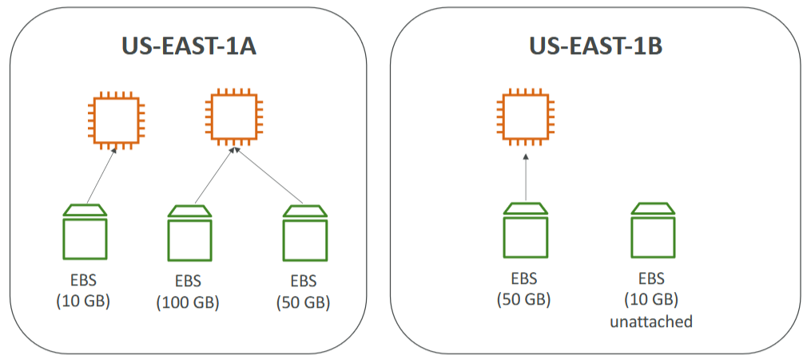
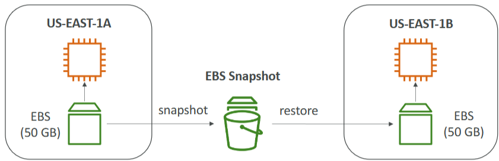
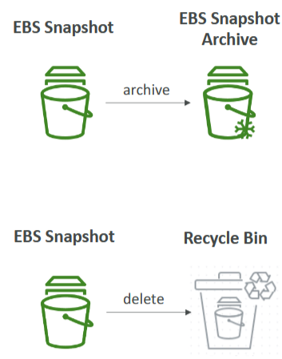
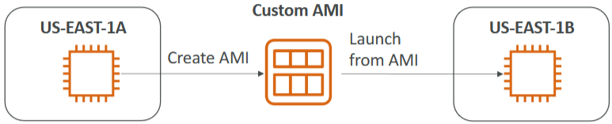
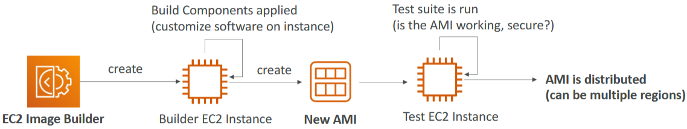
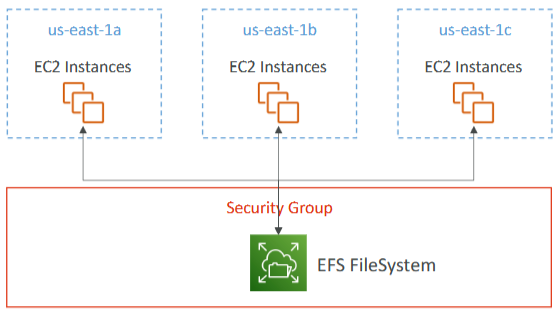
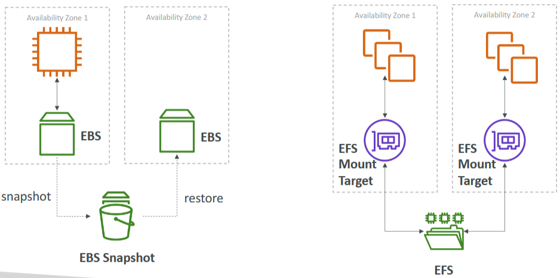
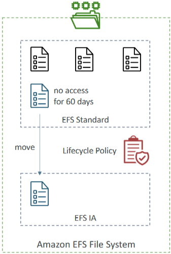
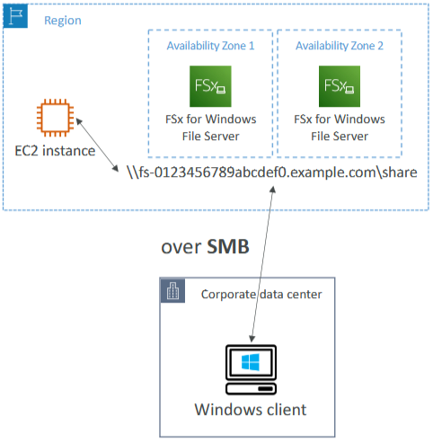
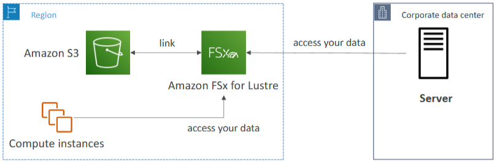

- [EC2 - Instance Storage](#ec2---instance-storage)
  - [EBS Overview](#ebs-overview)
    - [Introduction to EBS Volumes](#introduction-to-ebs-volumes)
    - [Key Features of EBS Volumes](#key-features-of-ebs-volumes)
    - [EBS Volume Types and Free Tier](#ebs-volume-types-and-free-tier)
    - [EBS Volume Characteristics](#ebs-volume-characteristics)
    - [EBS Volume Usage](#ebs-volume-usage)
    - [Availability Zone Considerations](#availability-zone-considerations)
    - [Unattached EBS Volumes](#unattached-ebs-volumes)
    - [Delete on Termination Attribute](#delete-on-termination-attribute)
  - [Step-by-Step Instructions for Managing EBS Volumes](#step-by-step-instructions-for-managing-ebs-volumes)
    - [Viewing Attached EBS Volumes](#viewing-attached-ebs-volumes)
    - [Creating a New EBS Volume](#creating-a-new-ebs-volume)
    - [Attaching the New EBS Volume](#attaching-the-new-ebs-volume)
    - [Verifying Attached Volumes](#verifying-attached-volumes)
    - [Creating a Volume in a Different Availability Zone](#creating-a-volume-in-a-different-availability-zone)
    - [Deleting an EBS Volume](#deleting-an-ebs-volume)
    - [Understanding Delete on Termination Attribute](#understanding-delete-on-termination-attribute)
    - [Terminating an Instance](#terminating-an-instance)
  - [EBS Snapshot Overview](#ebs-snapshot-overview)
    - [Introduction to EBS Snapshots](#introduction-to-ebs-snapshots)
    - [Creating EBS Snapshots](#creating-ebs-snapshots)
    - [Benefits of EBS Snapshots](#benefits-of-ebs-snapshots)
    - [Transferring EBS Volumes Using Snapshots](#transferring-ebs-volumes-using-snapshots)
    - [EBS Snapshot Features](#ebs-snapshot-features)
  - [Instructions for Managing EBS Snapshots](#instructions-for-managing-ebs-snapshots)
    - [Creating an EBS Snapshot](#creating-an-ebs-snapshot)
    - [Viewing Snapshots](#viewing-snapshots)
    - [Copying a Snapshot to Another Region](#copying-a-snapshot-to-another-region)
    - [Creating a Volume from a Snapshot](#creating-a-volume-from-a-snapshot)
    - [Using the Recycle Bin for Snapshots](#using-the-recycle-bin-for-snapshots)
    - [Deleting and Recovering Snapshots](#deleting-and-recovering-snapshots)
    - [Managing Storage Tiers](#managing-storage-tiers)
  - [AMI Overview](#ami-overview)
    - [Introduction to AMIs](#introduction-to-amis)
    - [Types of AMIs](#types-of-amis)
    - [Benefits of Custom AMIs](#benefits-of-custom-amis)
    - [Creating a Custom AMI](#creating-a-custom-ami)
    - [Use Case Example](#use-case-example)
  - [Instructions for Using AMIs](#instructions-for-using-amis)
    - [Launching an Instance](#launching-an-instance)
    - [Waiting for Instance Initialisation](#waiting-for-instance-initialisation)
    - [Creating an AMI](#creating-an-ami)
    - [Viewing and Launching from AMI](#viewing-and-launching-from-ami)
    - [Verifying the New Instance](#verifying-the-new-instance)
    - [Terminating Instances](#terminating-instances)
  - [EC2 Image Builder Overview](#ec2-image-builder-overview)
    - [Introduction to EC2 Image Builder](#introduction-to-ec2-image-builder)
    - [How EC2 Image Builder Works](#how-ec2-image-builder-works)
    - [Scheduling and Costs](#scheduling-and-costs)
  - [EC2 Instance Store](#ec2-instance-store)
    - [Introduction to EC2 Instance Store](#introduction-to-ec2-instance-store)
    - [Key Features of EC2 Instance Store](#key-features-of-ec2-instance-store)
    - [Use Cases for EC2 Instance Store](#use-cases-for-ec2-instance-store)
    - [Limitations and Responsibilities](#limitations-and-responsibilities)
    - [Performance Comparison](#performance-comparison)
  - [EBS Overview](#ebs-overview-1)
    - [Introduction to EFS](#introduction-to-efs)
    - [Key Features of EFS](#key-features-of-efs)
    - [EFS vs. EBS](#efs-vs-ebs)
      - [EBS (Elastic Block Store)](#ebs-elastic-block-store)
      - [EFS (Elastic File System)](#efs-elastic-file-system)
    - [EFS Storage Classes](#efs-storage-classes)
    - [Example Scenario](#example-scenario)
  - [Shared Responsibility Model for EC2 Storage](#shared-responsibility-model-for-ec2-storage)
    - [AWS Responsibilities](#aws-responsibilities)
    - [Customer Responsibilities](#customer-responsibilities)
  - [Amazon FSx Overview](#amazon-fsx-overview)
    - [Introduction to Amazon FSx](#introduction-to-amazon-fsx)
    - [Amazon FSx Offerings](#amazon-fsx-offerings)
    - [Amazon FSx for Windows File Server](#amazon-fsx-for-windows-file-server)
    - [Amazon FSx for Lustre](#amazon-fsx-for-lustre)
    - [Key Points to Remember](#key-points-to-remember)
  - [EC2 Instance Storage Summary](#ec2-instance-storage-summary)
    - [EBS Volumes](#ebs-volumes)
    - [AMIs (Amazon Machine Images)](#amis-amazon-machine-images)
    - [EC2 Instance Store](#ec2-instance-store-1)
    - [EFS (Elastic File System)](#efs-elastic-file-system-1)
    - [Amazon FSx](#amazon-fsx)
- [Quiz](#quiz)

 

 

# EC2 - Instance Storage

## EBS Overview

### Introduction to EBS Volumes
* `EBS` (Elastic Block Store): A network drive you can attach to your EC2 instances to **persist data** even **after** the instance is **terminated**.
* Allows **data** to be **retained and reused** by attaching the same EBS Volume to a new instance.

### Key Features of EBS Volumes
* `Single Instance Attachment`: At the CCP level, an EBS Volume can only be mounted to **one instance at a time**.
* `Availability Zone Bound`: EBS Volumes are **bound** to a specific availability zone (e.g., us-east-1a) and *cannot be attached to instances in different zones without a snapshot*.

> Think of EBS Volumes as network USB sticks that can be attached and detached from instances quickly.

 

### EBS Volume Types and Free Tier
* `Free Tier`: Offers 30 GB of free EBS storage per month of General Purpose (SSD) or Magnetic storage.

### EBS Volume Characteristics
* `Network Drive`: Communication between the instance and the EBS Volume uses the network, which may introduce some latency.
* `Provision Capacity`: You need to specify the capacity (GBs) and IOPS (I/O operations per second) in advance.
* `Billing`: You are billed for the provisioned capacity, and you can increase capacity over time.

### EBS Volume Usage
* EBS Volumes can be **detached** from one instance and **attached** to another quickly, useful for failovers.
* An instance can have **multiple EBS Volumes attached** to it, like having multiple USB sticks.

### Availability Zone Considerations
* EBS Volumes are **specific to an availability zone**. 
* To use them in another AZ, you need to **create a snapshot** and **restore** it in the **new AZ**.

### Unattached EBS Volumes
* `On-Demand Attachment`: EBS Volumes can be created and left unattached, ready to be attached to an instance when needed.

### Delete on Termination Attribute
* `Default Behavior`: The **root** EBS Volume is **deleted when the instance is terminated** (enabled by default), while other attached EBS Volumes are not deleted (disabled by default).
* `Control`: You can enable or disable the delete on termination attribute based on your needs.
* **Use Case**: Disable delete on termination for the root volume if you want to preserve data after instance termination.

 

 

## Step-by-Step Instructions for Managing EBS Volumes
### Viewing Attached EBS Volumes
1. Go to your EC2 instance in the AWS Management Console.
2. Click on the "Storage" tab to view **attached volumes**.
3. Click on the **volume** to access the volumes interface.

### Creating a New EBS Volume
1. In the left-hand side menu, click on "Volumes" under "Elastic Block Store".
2. Click on "Create Volume".
3. Choose the volume type (e.g., GP2).
4. Enter the size of the volume (e.g., 2 GB).
5. Ensure the availability zone matches your EC2 instance's zone (e.g., eu-west-1b).
6. Click "Create Volume".

### Attaching the New EBS Volume
1. Click on the newly created volume.
2. Click on "Actions" and select "Attach Volume".
3. Select the EC2 instance to attach the volume to.
4. Click "Attach Volume".

### Verifying Attached Volumes
1. Go back to the EC2 console and refresh the page.
2. In the "Storage" tab, verify that the new volume is listed under block devices.

### Creating a Volume in a Different Availability Zone
1. Follow the steps to create a volume, but select a different availability zone (e.g., eu-west-1a).
2. Try to attach the volume to your EC2 instance.

> Note that the volume cannot be attached because it is in a different availability zone.

### Deleting an EBS Volume
1. Click on the volume you want to delete.
2. Click on "Actions" and select "Delete Volume".
3. Confirm the deletion to remove the volume.

### Understanding Delete on Termination Attribute
1. In the "Storage" tab, check the "Delete on Termination" attribute for each volume.
2. When launching an instance, you can set this attribute to "Yes" or "No" under the "Advanced" storage settings.

### Terminating an Instance
1. Go to your EC2 instance and terminate it.
2. Refresh the volumes page to see that the root volume with "Delete on Termination" set to "Yes" is deleted, while other volumes remain.

 

 

## EBS Snapshot Overview

### Introduction to EBS Snapshots
* EBS snapshots are **backups of your EBS volumes**, allowing you to **restore the state** of the volume **at any** point in **time**.
* Snapshots can be **used to restore data** even if the original EBS volume is terminated.

 

### Creating EBS Snapshots
* It is **not necessary to detach the volume** before creating a snapshot, but it is recommended for a clean backup.
* You can **create a snapshot while the volume is in use** or after stopping the EC2 instance for a cleaner snapshot.

### Benefits of EBS Snapshots
* `Restoration`: Snapshots allow you to restore EBS volumes to their previous state.
* `Cross-AZ and Cross-Region Copy`: Snapshots can be copied across availability zones (AZ) or regions, enabling data transfer within AWS's global infrastructure.

### Transferring EBS Volumes Using Snapshots
Process:
1. `Create Snapshot`: Snapshot the EBS volume attached to your EC2 instance.
2. `Restore Snapshot`: Use the snapshot to create a new EBS volume in a different AZ.
3. `Attach Volume`: Attach the new EBS volume to an EC2 instance in the target AZ.

### EBS Snapshot Features

`Snapshot Archive`:
* Purpose: Move snapshots to a cheaper storage tier (75% cost reduction).
* Restoration Time: Takes 24 to 72 hours to restore from the archive.
* Use Case: Suitable for snapshots that are not urgently needed.

`Recycle Bin for EBS Snapshots`:
* Purpose: Protect against accidental deletion by storing deleted snapshots in a recycle bin.
* Retention Period: Specify a retention period from one day to one year.
* Recovery: Allows recovery of snapshots within the specified retention period.

 

 

 

## Instructions for Managing EBS Snapshots

### Creating an EBS Snapshot
1. Go to the "Volumes" section in the AWS Management Console and select the EBS volume you want to snapshot.
2. Click on "Actions" and select "Create Snapshot".
3. Enter a description for the snapshot (e.g., DemoSnapshots).
4. Click "Create Snapshot".

### Viewing Snapshots
1. In the left-hand side menu, click on "Snapshots".
2. You will see a list of all your snapshots. 
   * Check the status to ensure it is "Completed" and "Available".

### Copying a Snapshot to Another Region
1. Right-click on the snapshot you want to copy.
2. Select "Copy Snapshot".
3. Select the destination region where you want to copy the snapshot.
4. Click "Copy Snapshot".

### Creating a Volume from a Snapshot
1. Go to the "Snapshots" section and select the snapshot you want to use.
2. Click on "Actions" and select "Create Volume from Snapshot".
3. Choose the volume type (e.g., GP2), size (e.g., 2 GB), and target availability zone (e.g., eu-west-1b).
4. Click "Create Volume".

### Using the Recycle Bin for Snapshots
1. In the Recycle Bin section, click on "Create Retention Rule".
2. Name the rule (e.g., DemoRetentionRule), select "EBS Snapshots", apply to all resources, and set the retention period (e.g., one day).
3. Click "Create Retention Rule".

### Deleting and Recovering Snapshots
1. In the "Snapshots" section, select the snapshot you want to delete and click "Delete Snapshot".
2. Go to the Recycle Bin section and refresh to see the deleted snapshot.
3. Select the snapshot in the Recycle Bin and click "Recover". Confirm the recovery.

### Managing Storage Tiers
1. In the "Snapshots" section, check the storage tier of your snapshot (e.g., Standard Storage Tier).
2. Move the snapshot to a cheaper storage tier by selecting "Archive Snapshot". Note that restoring from the archive takes 24 to 72 hours.

 

 

## AMI Overview

### Introduction to AMIs
* A **pre-configured template** for your EC2 instances that includes the operating system, software, and configurations.
* AMIs allow you to quickly launch EC2 instances with the desired setup, reducing boot and configuration time.

### Types of AMIs
* `Public AMIs`: Provided by AWS, such as the Amazon Linux 2 AMI.
* `Custom AMIs`: Created and maintained by users, tailored to specific needs.
* `AWS Marketplace AMIs`: Created and sold by third-party vendors, often pre-configured with specific software.

### Benefits of Custom AMIs
* `Faster Boot Time`: Pre-packaged software and configurations lead to quicker instance startup.
* `Consistency`: Ensures all instances launched from the AMI have the same setup.
* `Portability`: Custom AMIs can be copied across regions to leverage AWS's global infrastructure.

### Creating a Custom AMI
1. Start an EC2 instance and configure it as needed.
2. Ensure data integrity by stopping the instance before creating the AMI.
3. Build the AMI from the stopped instance, which also creates EBS snapshots.
4. Use the custom AMI to launch new instances in the same or different availability zones.

### Use Case Example
Process:
1. Launch Instance in US-EAST-1A: Customise the instance.
2. Create AMI: Generate a custom AMI from the instance.
3. Launch in US-EAST-1B: Use the custom AMI to launch a new instance in a different availability zone, effectively creating a copy of the original instance.

 

 

## Instructions for Using AMIs
### Launching an Instance
1. In the AWS Management Console, navigate to the EC2 dashboard.
2. Click on "Launch Instance".
3. Scroll down and choose the Amazon Linux 2 AMI.
4. Select the T2 micro instance type.
5. Select your key pair (e.g., easy to draw).
6. Select an existing security group (e.g., launch wizard one).
7. Use the default storage settings.
8. Scroll down to the "Advanced Details" section and enter user data, excluding the last line.

### Waiting for Instance Initialisation
* Wait for the instance to initialise and run the user data script.
* Use the public IPv4 address to check if the Apache web server is running. It may take a few minutes.

### Creating an AMI
1. Right-click on the running instance.
2. Select "Image and Templates" and then "Create Image".
3. Enter a **name** for the image (e.g., demo image).
4. Click "Create Image".

### Viewing and Launching from AMI
1. In the left-hand side menu, click on "AMIs".
2. Wait for the AMI status to change from "pending" to "available".
3. Click on the AMI and select "Launch Instance from Image".
4. In the instance creation page, go to the "My AMIs" tab and select the demo image.
5. Configure the instance settings, including key pair and network settings.
6. Enter user data to create a new index file.

### Verifying the New Instance
* Wait for the new instance to initialize.
* Use the public IP address to verify that the "Hello World" page is displayed.

### Terminating Instances
1. Select the instances you created.
2. Click on "Actions" and select "Terminate Instances".

 

 

## EC2 Image Builder Overview

### Introduction to EC2 Image Builder
* Automates the creation, maintenance, validation, and testing of AMIs (Amazon Machine Images) for EC2 instances.
* Helps streamline the process of building and managing virtual machine or container images.

 

### How EC2 Image Builder Works
* Automatically creates an EC2 instance to build and **customise software components** (e.g., install Java, update CLI, install firewalls).
* Once customisation is complete, an AMI is created from the Builder EC2 instance.
* A test EC2 instance is launched from the AMI to run predefined tests (e.g., checking if the AMI works, is secure, and if the application runs correctly).
* The validated AMI can be distributed to multiple regions, making the application and workflow global.

### Scheduling and Costs
* EC2 Image Builder can be run on a schedule (e.g., weekly) or triggered manually or when packages are updated.
* The service itself is free, but you pay for the underlying resources:
* Costs for the EC2 instances created during the process.
* Costs for storing the created and distributed AMIs.

 

 

## EC2 Instance Store

### Introduction to EC2 Instance Store
* Provides higher I/O performance compared to network-attached storage (`EBS`).
* EC2 Instance Store is a hardware disk attached directly to the physical server hosting the EC2 instance.

### Key Features of EC2 Instance Store
* `High Performance`: Offers better I/O performance and throughput, making it ideal for applications requiring extremely high disk performance.
* `Ephemeral Storage`: Data is lost if the instance is stopped or terminated, making it unsuitable for long-term storage.

### Use Cases for EC2 Instance Store
* `Buffer and Cache`: Suitable for temporary data storage such as buffers and caches.
* `Scratch Data`: Ideal for storing temporary content that does not need to be retained long-term.

### Limitations and Responsibilities
* `Data Loss Risk`: If the underlying server fails, data on the EC2 Instance Store is lost.
* `Backup and Replication`: Users are responsible for backing up and replicating data as needed.

### Performance Comparison
* High-performance instances (e.g., I3) can achieve up to 3.3 million read IOPS and 1.4 million write IOPS.
* In comparison, EBS volumes (e.g., GP2) can achieve up to 32,000 IOPS.

 

 

## EBS Overview

### Introduction to EFS
* `EFS` (Elastic File System): A **managed network file system** that can be **mounted to hundreds of EC2 instances** simultaneously.
* Provides a **shared network file system** (NFS) for multiple EC2 instances.

 

### Key Features of EFS
* `Multi-AZ Support`: Works across multiple availability zones, allowing instances in different AZs to access the same EFS volume.
* `High Availability and Scalability`: EFS is highly available and scalable, making it suitable for large-scale applications.
* `Cost`: More expensive than EBS (about three times the price of gp2 EBS volume), but you pay per use without planning for capacity.

 

### EFS vs. EBS

#### EBS (Elastic Block Store)
* EBS volumes can only be **attached to one instance** in a specific AZ.
* To move an EBS volume to another AZ, **create a snapshot** and **restore** it in the new AZ.

#### EFS (Elastic File System)
* EFS can be **mounted to multiple instances** across different AZs, providing a shared file system.
* All instances mounted to the EFS drive can access the same files simultaneously.

 

### EFS Storage Classes
* EFS Standard: Default storage class for frequently accessed files.

EFS Infrequent Access (EFS-IA):
* `Cost Optimisation`: Designed for files that are not accessed frequently, offering up to 92% lower cost compared to EFS Standard.
* `Lifecycle Policy`: Automatically moves files to EFS-IA based on access patterns, and moves them back to EFS Standard when accessed again.

 

### Example Scenario
* `Shared Access`: Instances in different AZs (e.g., us-east-1a, us-east-1b, us-east-1c) can all mount the same EFS file system and access shared files.
* `Cost Savings`: Files not accessed for a specified period (e.g., 60 days) are moved to EFS-IA to save costs, and moved back to EFS Standard when accessed.

 

 

## Shared Responsibility Model for EC2 Storage

### AWS Responsibilities
* `Infrastructure Management`: AWS is responsible for maintaining the underlying infrastructure, including hardware and network components.
* `Data Replication`: AWS ensures that data stored in EBS and EFS is replicated across multiple hardware devices to prevent data loss in case of hardware failure.
* `Hardware Replacement`: AWS replaces any faulty hardware components to maintain data integrity and availability.
* `Data Security`: AWS ensures that their employees cannot access customer data, maintaining strict security protocols.

### Customer Responsibilities
* `Backup and Snapshot Procedures`: Customers must set up and manage their own backup and snapshot procedures to prevent data loss.
* `Data Encryption`: Implementing data encryption to protect data from unauthorised access, adding an extra layer of security.
* `Data Management`: Customers are responsible for the data they store on their drives, including what is written and how it is managed.
* `EC2 Instance Store Risks`: Understanding the risks associated with using EC2 Instance Store, such as data loss if the instance is stopped or terminated, and ensuring proper backups are in place.

 

 

## Amazon FSx Overview

### Introduction to Amazon FSx
* Managed service for third-party high-performance file systems on AWS.
* Ideal for users who need alternatives to EFS or S3.

### Amazon FSx Offerings
* `FSx for Lustre`: High-performance, scalable file storage for high-performance computing (HPC).
* `FSx for Windows File Server`: Fully managed, reliable, and scalable Windows native shared file system.
* `FSx for NetApp ONTAP`: Another option available, but not covered in detail here.

### Amazon FSx for Windows File Server
* `Deployment`: Typically deployed across two availability zones.
* `Protocols Supported`: Supports Windows native protocols like SMB and NTFS.
* `Integration`: Integrates with Microsoft Active Directory for user security.
* `Access`: Can be accessed from AWS directly or from on-premises infrastructure.

 

### Amazon FSx for Lustre
* Designed for **high-performance** computing (HPC) use cases.
* Suitable for machine learning, analytics, video processing, financial modeling.
* Handles **high traffic** with hundreds of gigabytes per second of data exchange, millions of IOPS, and sub-millisecond latency.
* Can be connected to corporate data centers or AWS compute instances.
* Data can be **stored on Amazon S3**.

 

### Key Points to Remember
* `FSx for Windows File Server`: Best for Windows-based environments needing shared file systems.
* `FSx for Lustre`: Best for high-performance computing tasks requiring fast and scalable storage.

 

 

## EC2 Instance Storage Summary 

### EBS Volumes
* `Network Drives`: Attached to one EC2 instance at a time and mapped to a specific Availability Zone.
* `Snapshots`: Use EBS snapshots for backups and transferring data across Availability Zones.

### AMIs (Amazon Machine Images)
* `Ready-to-Use Images`: Pre-configured EC2 instance images with desired customizations.
* `Automation`: Use EC2 Image Builder to automate the creation, testing, and distribution of AMIs.

### EC2 Instance Store
* `High Performance`: Provides high-performance hardware disks attached to EC2 instances.
* `Ephemeral Storage`: Data is lost if the instance is stopped or terminated.

### EFS (Elastic File System)
* `Network File System`: Can be mounted to hundreds of instances within a region.
* `Cost Optimisation`: Use EFS Infrequent Access (EFS-IA) to move infrequently accessed files to a lower-cost tier.

### Amazon FSx
* `FSx for Windows`: Managed network file system for Windows servers.
* `FSx for Lustre`: High-performance computing (HPC) file system for Linux.

 

 

# Quiz

1. Which EC2 Storage would you use to create a shared network file system for your EC2 Instances?
   * Amazon EFS is a fully managed service that makes it easy to set up, scale, and cost-optimize file storage in the Amazon Cloud.

2. Which service can be used to automate image management processes?
   * EC2 Image Builder is an automated pipeline for the creation, maintenance, validation, sharing, and deployment of Linux or Windows images for use on AWS and on-premises.

3. Which of the following is a fully managed native Microsoft Windows file system?
   * Amazon FSx makes it easy and cost effective to launch and run popular file systems that are fully managed by AWS. 
   * It comes in two offerings: 
     * FSx for Windows File Server (used for business applications).
     * FSx for Lustre (used for high-performance computing).

4. What are AMIs NOT used for?
   * Adding your own IP addresses.
   * You cannot use AMIs to add your IP addresses. IP addresses are added to an instance as you create it.

5. True or false. EBS Volumes CANNOT be attached to multiple EC2 instances at a time.
   * True.
   * EBS Volumes can be attached to only one EC2 Instance at a time, but EC2 Instances can have multiple EBS Volumes attached to them.

6. True or false. An EBS Volume is a network drive you can attach to your instances while they run, so your instances' data persist even after their termination.
   * True.
   * EBS Volumes allows instances' data to persist even after their termination.

7. Which statement is CORRECT regarding EC2 Instance Store?
   * EC2 Instance Store has a better I/O performance, but data is lost if: the EC2 instance is stopped or terminated, or when the underlying disk drive fails.

8. What is an EBS Snapshot?
   * EBS Snapshots are used to backup data on your EBS Volumes at a point in time.

9. Where can you find a third party's AMI so you can use it to launch your EC2 Instance?
    * You can use AWS Marketplace AMIs to use someone else's AMI.

10. What is an EBS Volume tied to?
    * EBS Volumes are tied to only one availability zone.

 

