- [Cloud Integrations](#cloud-integrations)
  - [Cloud Integration](#cloud-integration)
    - [Types of Communication Patterns](#types-of-communication-patterns)
      - [Synchronous Communication](#synchronous-communication)
      - [Asynchronous Communication (Event-Based)](#asynchronous-communication-event-based)
    - [Benefits of Decoupling Applications](#benefits-of-decoupling-applications)
    - [Key Services for Asynchronous Communication:](#key-services-for-asynchronous-communication)
  - [SQS Overview](#sqs-overview)
    - [Amazon SQS Overview](#amazon-sqs-overview)
    - [How It Works](#how-it-works)
      - [Producers and Consumers](#producers-and-consumers)
      - [Decoupling Applications](#decoupling-applications)
    - [Key Features](#key-features)
    - [Use Case Example](#use-case-example)
    - [FIFO Queues](#fifo-queues)
  - [SQS Code-along](#sqs-code-along)
    - [Amazon SQS Overview](#amazon-sqs-overview-1)
    - [Creating a Queue](#creating-a-queue)
      - [Steps to Create a Queue](#steps-to-create-a-queue)
    - [Sending and Receiving Messages](#sending-and-receiving-messages)
      - [Sending Messages](#sending-messages)
      - [Viewing Message Details](#viewing-message-details)
      - [Polling for Messages](#polling-for-messages)
      - [Deleting Messages](#deleting-messages)
    - [Managing Queues](#managing-queues)
  - [Kinesis Overview](#kinesis-overview)
    - [Amazon Kinesis Overview](#amazon-kinesis-overview)
    - [Key Services within Amazon Kinesis](#key-services-within-amazon-kinesis)
    - [Use Cases](#use-cases)
    - [Summary](#summary)
  - [SNS Overview](#sns-overview)
    - [Amazon SNS Overview](#amazon-sns-overview)
    - [How It Works](#how-it-works-1)
    - [Key Features](#key-features-1)
    - [Destinations for SNS Messages:](#destinations-for-sns-messages)
  - [SNS Code-along](#sns-code-along)
    - [Amazon SNS Overview](#amazon-sns-overview-1)
    - [Create a Topic](#create-a-topic)
    - [Defining Subscriptions](#defining-subscriptions)
    - [Confirming Subscription](#confirming-subscription)
    - [Sending Messages](#sending-messages-1)
    - [Managing Topics](#managing-topics)
  - [Amazon MQ Overview](#amazon-mq-overview)
    - [Amazon MQ Overview](#amazon-mq-overview-1)
    - [Key Concepts](#key-concepts)
    - [Implications](#implications)
    - [Use Case](#use-case)
- [Quiz](#quiz)
- [Cloud Monitoring](#cloud-monitoring)
    - [Cloud Monitoring Overview](#cloud-monitoring-overview)
    - [CloudWatch Metrics](#cloudwatch-metrics)
    - [Common Metrics](#common-metrics)
    - [CloudWatch Alarms](#cloudwatch-alarms)
      - [Alarm States](#alarm-states)
  - [CloudWatch Metrics and CloudWatch Alarms Code-along](#cloudwatch-metrics-and-cloudwatch-alarms-code-along)
    - [CloudWatch Metrics](#cloudwatch-metrics-1)
    - [Creating Alarms](#creating-alarms)
    - [Creating Alarms from EC2 Console](#creating-alarms-from-ec2-console)
    - [Billing Alarms](#billing-alarms)
  - [CloudWatch Logs overview](#cloudwatch-logs-overview)
    - [Amazon CloudWatch Logs Overview](#amazon-cloudwatch-logs-overview)
    - [What is a Log File?](#what-is-a-log-file)
    - [Sources of Logs](#sources-of-logs)
    - [Benefits of CloudWatch Logs](#benefits-of-cloudwatch-logs)
    - [How CloudWatch Logs Work for EC2 Instances](#how-cloudwatch-logs-work-for-ec2-instances)
    - [Hybrid Agent](#hybrid-agent)
  - [CloudWatch Logs Code-along](#cloudwatch-logs-code-along)
    - [Accessing Log Groups](#accessing-log-groups)
    - [Viewing Logs](#viewing-logs)
    - [Handling Exceptions](#handling-exceptions)
    - [General Use](#general-use)
  - [EventBridge Overview](#eventbridge-overview)
    - [Amazon EventBridge Overview:](#amazon-eventbridge-overview)
    - [Use Cases](#use-cases-1)
    - [Integrations](#integrations)
    - [Event Buses](#event-buses)
    - [Additional Capabilities](#additional-capabilities)
    - [Key Concept](#key-concept)
  - [EventBridge Code-along](#eventbridge-code-along)
    - [Creating an EventBridge Rule](#creating-an-eventbridge-rule)
    - [Creating a Rule for Login Notifications](#creating-a-rule-for-login-notifications)
    - [Creating a Rule for EC2 Instance Termination Notifications](#creating-a-rule-for-ec2-instance-termination-notifications)
    - [Managing Rules](#managing-rules)
  - [CloudTrail](#cloudtrail)
    - [Introduction to AWS CloudTrail](#introduction-to-aws-cloudtrail)
    - [Logging Activities](#logging-activities)
    - [Audit and Security](#audit-and-security)
    - [Example Use Case](#example-use-case)
    - [CloudTrail Console](#cloudtrail-console)
    - [CloudTrail Diagram](#cloudtrail-diagram)
    - [Inspection and Audit](#inspection-and-audit)
  - [CloudTrail Code-along](#cloudtrail-code-along)
    - [Introduction to AWS CloudTrail](#introduction-to-aws-cloudtrail-1)
    - [Viewing Event History](#viewing-event-history)
    - [Example Activity: Terminating an EC2 Instance](#example-activity-terminating-an-ec2-instance)
    - [Event Details](#event-details)
    - [Practical Use](#practical-use)
  - [X-Ray](#x-ray)
    - [Introduction to AWS X-Ray](#introduction-to-aws-x-ray)
    - [Traditional Debugging Challenges](#traditional-debugging-challenges)
    - [Benefits of AWS X-Ray](#benefits-of-aws-x-ray)
    - [How AWS X-Ray Works](#how-aws-x-ray-works)
    - [Practical Use Cases](#practical-use-cases)
  - [CodeGuru](#codeguru)
    - [Introduction to Amazon CodeGuru](#introduction-to-amazon-codeguru)
    - [Key Components](#key-components)
      - [CodeGuru Reviewer](#codeguru-reviewer)
      - [CodeGuru Profiler](#codeguru-profiler)
    - [How CodeGuru Works](#how-codeguru-works)
    - [Practical Use Cases](#practical-use-cases-1)
  - [AWS Health Dashboard](#aws-health-dashboard)
    - [Introduction to AWS Health Dashboard](#introduction-to-aws-health-dashboard)
    - [Components of AWS Health Dashboard](#components-of-aws-health-dashboard)
      - [Service History](#service-history)
      - [Account Health Dashboard](#account-health-dashboard)
    - [Accessing AWS Health Dashboard](#accessing-aws-health-dashboard)
    - [Practical Use Cases](#practical-use-cases-2)
  - [AWS HealthDashboard Code-along](#aws-healthdashboard-code-along)
    - [Accessing the AWS Health Dashboard](#accessing-the-aws-health-dashboard)
  - [Monitoring Summary](#monitoring-summary)
  - [Quiz](#quiz-1)

 

 

# Cloud Integrations

## Cloud Integration
* Enable communication between multiple applications.

### Types of Communication Patterns

#### Synchronous Communication
* Applications talk directly to each other.
  * **Example**: A buying service communicates directly with a shipping service to process orders.
  * `Pros`: Simple and direct integration.
* `Cons`: Can be problematic during traffic spikes, as the service being communicated with may get overwhelmed.

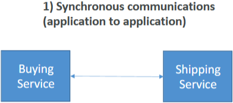

 

#### Asynchronous Communication (Event-Based)
* Applications communicate indirectly through a queue.
  * **Example**: A buying service places orders in a queue, and the shipping service reads from the queue to process orders.
* `Pros`: Decouples applications, allowing them to scale independently.
* `Cons`: Slightly more complex to set up.

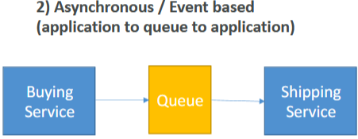

 

### Benefits of Decoupling Applications
* `Scalability`: Applications can scale independently, handling varying loads without overwhelming each other.
* `Reliability`: Reduces the risk of failure during traffic spikes or high-demand periods.

### Key Services for Asynchronous Communication:

`Amazon SQS` (Simple Queue Service):
* A queue model for decoupling applications.
* Allows messages to be stored and processed asynchronously.

`Amazon SNS` (Simple Notification Service):
* A pub/sub model for sending notifications.
* Allows messages to be published to multiple subscribers.

`Amazon Kinesis`:
* Used for real-time data streaming.
* Allows processing and analyzing streaming data in real-time.

 

 

## SQS Overview

### Amazon SQS Overview
* Decouple applications by using a queue to manage communication between producers and consumers.
* Service Type: Fully managed, serverless service.

### How It Works

#### Producers and Consumers
* `Producers`: Send messages into the SQS queue. There can be one or multiple producers.
* `Consumers`: Poll the queue to request messages. There can be one or multiple consumers.
* `Message Processing`: Consumers share the work by processing different messages. Once a message is processed, it is deleted from the queue.

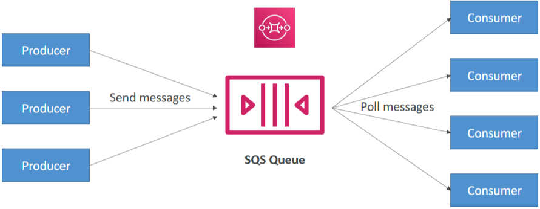

 

#### Decoupling Applications
* Producers and consumers are **decoupled**, allowing them to **operate at different speeds**.
* This setup ensures that applications can **scale independently** and handle varying loads efficiently.

### Key Features
* `Scalability`: Seamlessly scales from one message per second to tens of thousands of messages per second.
* `Message Retention`: Default retention period is 4 days, with a maximum of 14 days.
* `Unlimited Messages`: No limit to the number of messages in a queue.
* `Low Latency`: Less than 10 milliseconds for publishing and subscribing.
* `Horizontal Scaling`: Consumers can scale horizontally to share the workload.

 

### Use Case Example

Decoupling Application Tiers:
* `Web Servers`: Handle user requests through an application load balancer and EC2 instances in an auto-scaling group.
* `Video Processing`: Instead of processing videos directly, web servers insert messages into an SQS queue.
* `Processing Layer`: Another auto-scaling group of EC2 instances reads from the SQS queue and processes the videos.
* `Benefits`: Independent scaling of web servers and video processing layers, improved user experience, and cost efficiency.

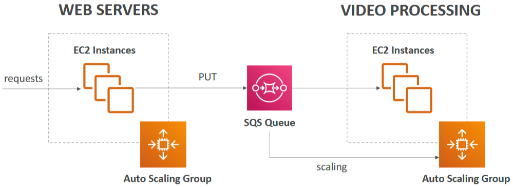

 

### FIFO Queues
* `First In First Out` (FIFO): Ensures messages are processed in the order they are sent.
* **Use Case**: When the order of message processing is important, such as processing transactions or logs.

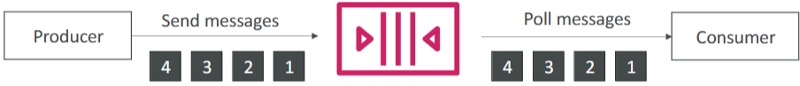

 

 

## SQS Code-along

### Amazon SQS Overview
* A message queuing service that enables high-throughput system-to-system messaging.

 

### Creating a Queue

Queue Types:
* `Standard Queue`: Suitable for most use cases.
* `FIFO Queue`: Ensures messages are processed in the order they are sent (beyond the scope of the Cloud Practitioner exam).

#### Steps to Create a Queue
1. Choose "Standard" and name the queue (e.g., demo-sqs).
   * Leave configuration and access policy settings as default.

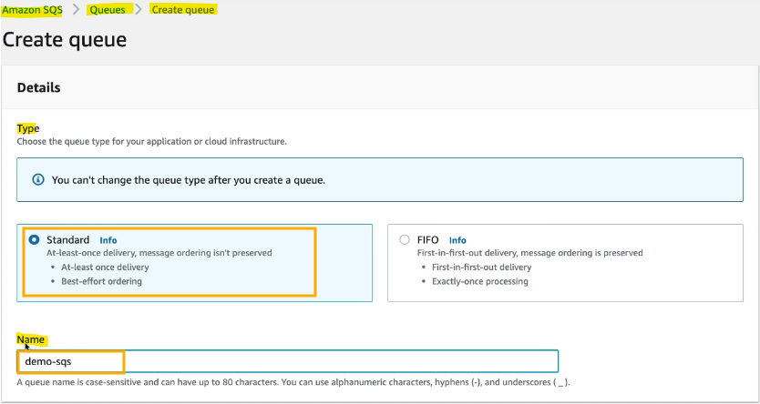

2. Click "Create Queue".

 

### Sending and Receiving Messages

#### Sending Messages
1. Go to "Send and Receive Messages".

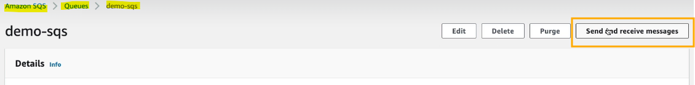

2. Enter a message (e.g., "hello world") and click "Send Message".

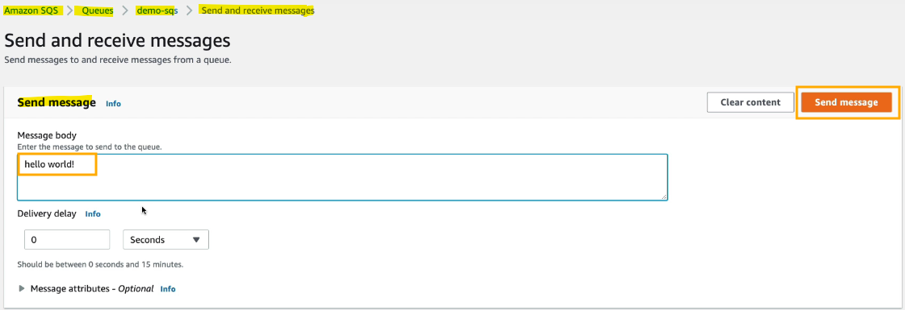

> The message is now in the queue, ready to be delivered.

 

#### Viewing Message Details
1. Click on "View Details" to see information like message ID and MD5 attributes.

#### Polling for Messages
1. Click "Poll for Messages" to retrieve messages from the queue.

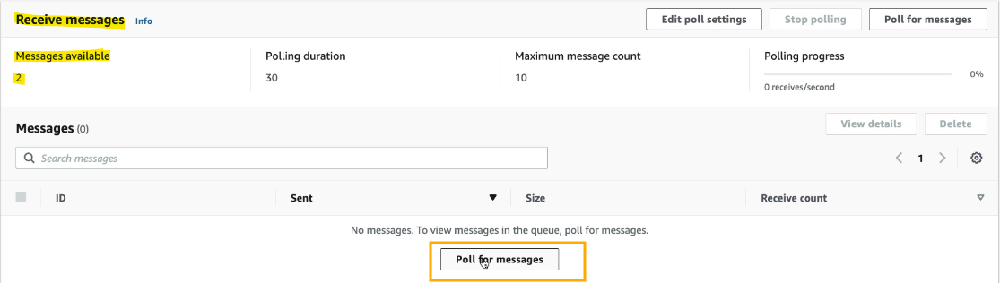

2. Messages will appear in the "Receive Message" section.

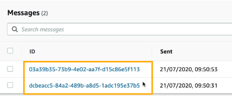

3. Click on a message to read its content.

 

#### Deleting Messages
* After processing a message, select it and click "Delete" to remove it from the queue.
* This ensures the message is no longer available for processing.

 

### Managing Queues

`Queue Details`:
* View details like queue type, name, encryption status, and message statistics (available, in-flight, delayed).

`Deleting a Queue`:
* Go to the list of queues.
* Select the queue to delete and confirm by entering "delete".
* This helps clean up and avoid unnecessary costs.

 

 

## Kinesis Overview

### Amazon Kinesis Overview
* Collect, process, and analyze real-time streaming data at any scale.
* Kinesis is synonymous with real-time big data streaming.

### Key Services within Amazon Kinesis
`Kinesis Data Streams`:
* Low latency streaming service.
* Ingests data at scale from various sources like trucks, boats, IoT devices, etc.

`Kinesis Data Firehose`:
* Loads streaming data into destinations such as Amazon S3, Redshift, and Elasticsearch.

`Kinesis Data Analytics`:
* Performs real-time analytics on streaming data using SQL.

`Kinesis Video Streams`:
* Monitors real-time video streams for analytics or machine learning.

 

### Use Cases
* `Data Ingestion`: Collect data from click streams, IoT devices, metrics, log servers, etc.
* `Real-Time Analytics`: Use Kinesis Data Analytics to analyze data in real-time and produce immediate outputs.
* `Data Loading`: Use Kinesis Data Firehose to send analyzed data to destinations like Amazon S3 or Redshift for further analysis.

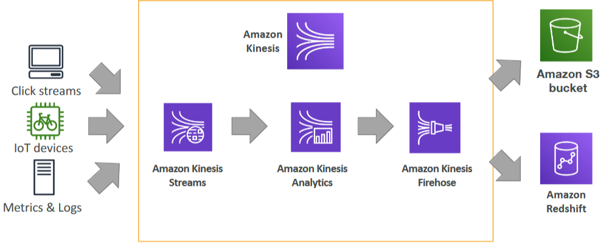

 

### Summary
* `Real-Time Big Data Streaming`: Kinesis is essential for handling real-time streaming data.
* `Sub-Services`: Kinesis Data Streams, Kinesis Data Firehose, Kinesis Data Analytics, and Kinesis Video Streams each serve specific purposes in the data processing pipeline.

 

 

## SNS Overview

### Amazon SNS Overview
* Send **one message** to **many receivers** using a `pub/sub` (publish/subscribe) model.

 

### How It Works

`Direct Integration`:
* **Example**: A bank service sends an email notification, talks to a fraud service, a shipping service, and an SQS queue.
* Cons: Complicated due to multiple direct integrations.

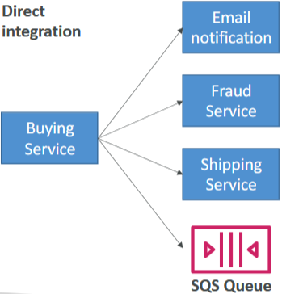

 

`Pub/Sub Integration`:
* SNS Topic: The buying service sends a message to an SNS topic.
* Automatic Notifications: The SNS topic sends notifications to multiple subscribers (e.g., email, fraud service, shipping service, SQS queue).

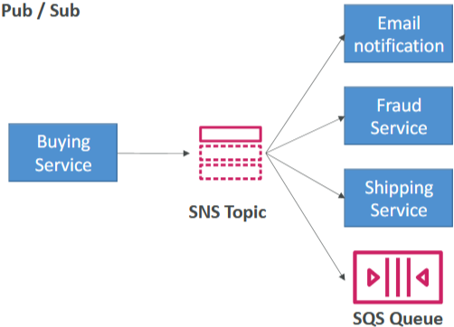

 

### Key Features
* `Event Publishers`: Send messages to one SNS topic.
* `Event Subscribers`: Can be as many as needed, each receiving all messages sent to the SNS topic.
* `High Scalability`: Each SNS topic can have over 12 million subscriptions. Soft limit of 100,000 topics per account.

### Destinations for SNS Messages:
* `AWS Services`: SQS, Lambda, Kinesis Data Firehose.
* `Direct Notifications`: Email, SMS, mobile notifications.
* `HTTP/HTTPS Endpoints`: Send data directly to web endpoints.

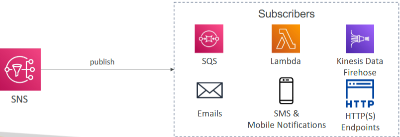

 

 

## SNS Code-along

### Amazon SNS Overview
* Goal: Send messages to multiple subscribers using a pub/sub model.

### Create a Topic
1. Go to the Simple Notification Service (SNS) console.
2. Create a topic (e.g., demo SNS).
3. Leave all options as default and click "Create Topic".

### Defining Subscriptions
`Add Subscriptions`:

1. Define subscriptions for the topic.
2. Choose from various protocols: HTTP, HTTPS, Email, Email-JSON, SQS, Lambda.
   * For this example, use Email for simplicity.

`Set Up Email Subscription`:
1. Enter an email address (e.g., stephaneccpdemo@mailinator.com) for the endpoint.
2. Create the subscription.

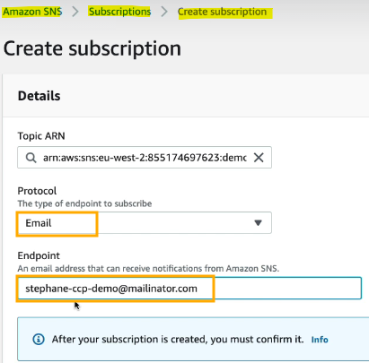

 

### Confirming Subscription

`Pending Confirmation`:
* The subscription will be in a pending state initially.

`Confirm Subscription`:
* Go to the Mailinator mailbox and confirm the subscription via the email received from AWS.

### Sending Messages

`Publish a Message`:
1. Go to the SNS topic and click "Publish Message".

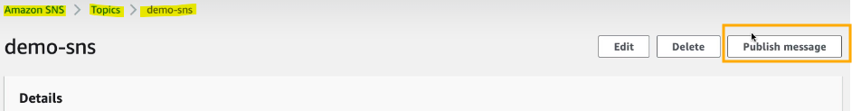

2. Enter a subject (e.g., demo subject line) and a message (e.g., hello world).
3. Click "Publish Message".

`Receive Message`:
* Check the Mailinator inbox to see the received message.

### Managing Topics

`Delete Topic`:
* After practicing, you can delete the topic to clean up.
* Deleting the topic won't cost any money.

 

 

## Amazon MQ Overview

### Amazon MQ Overview
* Managed **message broker** service for traditional applications using open protocols.
* `Protocols Supported`: MQTT, AMQP, STOMP, Openwire, WSS.

### Key Concepts

`Cloud-Native Services`:
* SQS and SNS: Use proprietary AWS protocols and APIs.
* Amazon MQ: Supports traditional open protocols, making it suitable for migrating on-premises applications to the cloud without re-engineering.

`Technologies Supported`:
* RabbitMQ and ActiveMQ: On-premises technologies that provide access to open protocols.
* Managed Version: Amazon MQ offers a managed version of these brokers on the cloud.

 

 

### Implications

`Scalability`:
* Amazon MQ does not scale as much as SQS or SNS, which have near-infinite scaling capabilities.

`Server Management`:
* Amazon MQ runs on servers, which may lead to server issues.
* Multi-AZ setup with failover is recommended for high availability.

`Features`:
* Queue Feature: Similar to SQS.
* Topic Feature: Similar to SNS, both features are part of a single broker.

### Use Case

`Migration to Cloud`:
* Amazon MQ is ideal for companies migrating to the cloud that need to use open protocols like MQTT, AMQP, STOMP, etc.
* If not using these protocols, SQS and SNS are preferred due to better scalability and integration with AWS services.

 

 

# Quiz

1. A company using Apache ActiveMQ is migrating to the cloud. Which AWS service can it use to easily set up and operate its message brokers in the cloud?
   * Amazon MQ.
   * Amazon MQ is a managed message broker service for Apache ActiveMQ and RabbitMQ that makes it easy to set up and operate message brokers in the cloud.

2. Which service is a fully managed pub/sub messaging service that makes it easy to set up, operate, and send notifications from the cloud, using a push-based system?
   * Simple Notification Service (SNS).
   * Amazon Simple Notification Service (SNS) is a highly available, durable, secure, fully managed pub/sub messaging service that enables you to decouple microservices, distributed systems, and serverless applications. 
   * It uses a push-based system.

3. True or false. You can use Kinesis to perform real-time analysis from video streams.
   * True.
   * Amazon Kinesis makes it easy to collect, process, and analyze real-time, streaming data so you can get timely insights and react quickly to new information. 
   * Kinesis offers four services: Data Firehose, Data Analytics, Data Streams, Video Streams.

4. Which principle is mainly applied when using Amazon SQS or Amazon SNS?
   * Decouple your applications.
   * When using SQS or SNS, you apply the "decouple your applications” principle. 
   * This means that IT systems should be designed in a way that reduces interdependencies—a change or a failure in one component should not cascade to other components.

5. Which service allows you to send, store, and receive messages between software components at any volume, without losing messages or requiring other services to be available, using a pull-based system?
   * Simple Queue Service (SQS).
   * Amazon Simple Queue Service (SQS) is a fully managed message queuing service that enables you to decouple and scale microservices, distributed systems, and serverless applications. 
   * It uses a pull-based system.

 

---

# Cloud Monitoring

### Cloud Monitoring Overview
* Understand how to **monitor** the **performance** of cloud deployments using AWS services.

### CloudWatch Metrics
* **Metrics** are **variables** to **monitor**, such as CPU-Utilization or NetworkIn.
* Metrics are **recorded over time** with **timestamps**.
* Create a CloudWatch **dashboard** to **visualize** all **metrics** at once.

### Common Metrics
* `Billing Metric`
  * Available only in **us-east-1**.
  * Represents the total amount **spent** on AWS cloud.
  * **Resets to zero** at the end of each month.

* `EC2 Metrics`
  * **CPU Utilization**: Measures CPU usage. High usage may indicate the need to scale up or out.
  * **Status Check**: Ensures the EC2 instance is functioning properly.
  * **Network**: Monitors network traffic in and out of the instance.

> Note: RAM is not an available metric for EC2 instances.

* `EBS Volumes`: Monitors disk read and write operations.
* `S3 Buckets`: Tracks bucket size, number of objects, and number of requests.
* `Service Limits`: Monitors usage of service APIs.
* `Custom Metrics`: Users can push their own custom metrics if needed.

### CloudWatch Alarms
* **Trigger notifications** for any metric that exceeds a threshold.

`Actions`:
* **Auto Scaling**: Adjust the number of EC2 instances in an auto-scaling group.
* **EC2 Actions**: Stop, terminate, reboot, or recover an EC2 instance.
* **SNS Notifications**: Send notifications to an SNS topic.
  * Example: If CPU utilization exceeds 90%, send an email notification.
  * Options: Choose sampling methods, periods (e.g., 5 minutes, 10 minutes, 1 hour), and create billing alarms.

#### Alarm States
* `OK`: Everything is functioning normally.
* `INSUFFICIENT_DATA`: Not enough data to determine the state.
* `ALARM`: The metric has exceeded the threshold.

 

---

## CloudWatch Metrics and CloudWatch Alarms Code-along

### CloudWatch Metrics

`Accessing Metrics`:
1. Go to the **CloudWatch** console and select "Metrics".
2. View metrics for various services, such as SQS and EC2.

`Example Metrics`:
* **SQS Queue Metrics**: Number of messages received, deleted, sent, etc.
* **EC2 Metrics**: CPU utilization, status checks, network traffic.

 

### Creating Alarms

`Steps to Create an Alarm`:
1. Go to "All alarms" and select "Create alarm".
2. Choose a metric (e.g., CPU utilization for an EC2 instance).
3. Set conditions (e.g., average CPU utilization over 5 minutes).
4. Define the threshold (e.g., CPU utilization > 80%).
5. Configure actions (e.g., send notification to an SNS topic).
6. Create the alarm.

`Example Alarm`:
* **Notification**: Send an email if CPU utilization exceeds 80%.
* **Auto Scaling**: Adjust the number of EC2 instances.
* **EC2 Actions**: Stop, terminate, reboot, or recover an instance.

 

### Creating Alarms from EC2 Console

`Monitoring Tab`:
* View monitoring information for an EC2 instance (CPU utilization, status checks).

`Adding an Alarm`:
1. Click the plus button next to "Alarm status".
2. Configure the alarm (e.g., recover the instance if status check fails).
3. Create the alarm.

 

### Billing Alarms

`Region-Specific`:
* Billing alarms can only be created in the us-east-1 region.

`Creating a Billing Alarm`:
1. Go to the **us-east-1** region in the **CloudWatch** console.
2. Select "Billing" and create an alarm based on estimated charges.
3. Configure notifications (e.g., send an email if charges exceed $8).

 

---

## CloudWatch Logs overview

### Amazon CloudWatch Logs Overview
* **Collect** and **monitor** **log files** from various sources.

### What is a Log File?
* Text records generated by applications to document their actions and status.
* Helps in troubleshooting by providing a history of application activities.

### Sources of Logs
* `Elastic Beanstalk`: Collect logs from applications deployed on Elastic Beanstalk.
* `ECS` (Elastic Container Service): Collect logs from containerized applications.
* `Lambda`: Collect logs from serverless functions.
* `CloudTrail`: Collect logs of AWS API calls.
* `CloudWatch Logs Agents`: Installed on EC2 instances or on-premises servers to collect logs.
* `Route 53`: Collect logs of DNS queries.

### Benefits of CloudWatch Logs
* `Real-Time Monitoring`: Allows for real-time monitoring and reaction to log events.
* `Adjustable Retention`: Logs can be retained for different periods (e.g., one week, 30 days, one year, or indefinitely).

### How CloudWatch Logs Work for EC2 Instances

`Default Behavior`:
* EC2 instances do not send log files to CloudWatch Logs by default.

`Setting Up CloudWatch Logs Agent`:
* Install the CloudWatch Logs agent on EC2 instances.
* The agent pushes log files to the CloudWatch Logs service.

`Instance Role and IAM Permissions`:
* Ensure the EC2 instance has the proper instance role with the correct IAM permissions to send log data to CloudWatch Logs.

 

### Hybrid Agent
* `Functionality`: The CloudWatch Logs agent can be set up on both on-premises servers and AWS EC2 instances.
* `Benefit`: Allows for centralized log collection from various sources into the CloudWatch Logs service.

 

---

## CloudWatch Logs Code-along

### Accessing Log Groups

`Log Groups`:
* Go to the CloudWatch console and select "Log groups".
  * **Example**: AWS Lambda log group (e.g., demo-lambda) created automatically when a Lambda function runs.

`Log Streams`:
* Within a log group, view one or more log streams.
* Each log stream contains log lines generated by the Lambda function.

### Viewing Logs

`Log Lines`:
* Example: Request ID, loading function, values, and end of request ID.
* Any log line logged by the Lambda function appears here.

`Updating Lambda Function`:
* Modify the Lambda function to print an extra log line.
* Deploy changes and test the function.
* New log stream appears with the updated log line.

### Handling Exceptions

`Raising Exceptions`:
* Modify the Lambda function to raise an exception (e.g., "something went wrong").
* Deploy changes and test the function.
* New log stream appears with the exception details.

`Troubleshooting`:
* Use CloudWatch Logs to identify and troubleshoot errors in Lambda functions or other applications.

### General Use

`Log Collection`:
* CloudWatch Logs can collect logs from various sources, not just Lambda functions.

`Log Analytics and Monitoring`:
* Perform log analytics and monitoring directly within CloudWatch Logs.
* Useful for DevOps to monitor and troubleshoot applications.

 

---

## EventBridge Overview
(formerly CloudWatch Events)

### Amazon EventBridge Overview:
* React to events happening within your AWS accounts.

### Use Cases

`Scheduling Cron Jobs`:
* Create a rule to trigger an event every hour.
* The event can run a script on a Lambda function, creating a serverless cron job.

 

`Reacting to Service Events`:
* Example: Alert the security team when someone logs in using the root user.
* Send IAM root user sign-in events to an SNS topic combined with email notifications.

 

### Integrations
* `Destinations`: Trigger Lambda functions, send SNS and SQS messages, and more.
* `Sources`: EC2 Instances, CodeBuild, S3 Events, Trusted Advisor, schedules, etc.

 

### Event Buses

`Default Event Bus`:
* Handles events from AWS Services and schedules.

 

`Partner Event Bus`:
* Receive events from AWS partners like Zendesk or Datadog.
* React to events happening outside of AWS.

 

`Custom Event Bus`:
* Plug in custom applications to send events.
* Create custom integrations.

 

### Additional Capabilities
* `Schema Registry`: Model event schemas to understand data types.
* `Event Archiving`: Archive events indefinitely or for a set period.
* `Event Replay`: Replay archived events.

### Key Concept
* `Amazon EventBridge`: A service to react to and manage events within AWS and from external sources.

 

---

## EventBridge Code-along

### Creating an EventBridge Rule
1. Go to the `EventBridge` console.

2. Create a new EventBridge **rule** named "InvokeLambdaEveryHour".

3. Click on "Schedule" and use the `EventBridge Scheduler` to create a Lambda function scheduler. 

4. Set the schedule to recur every one **hour**.
5. Set the "Flexible time window" to `Off`.
6. Select `AWS Lambda` as the **target** and choose your Lambda **function**.

7. Leave the default settings for enabling the schedule and retrying in case of errors.
8. A role is created automatically. Click "Next" and then "Create Schedule".

 

### Creating a Rule for Login Notifications
1. Go back to the `EventBridge` console and create a **new rule** named "send notification for login".

2. Use a rule with an event pattern and select `AWS events`.

3. Scroll to `Event pattern` and filter the events by typing "console" to find the AWS Console Sign-in.

4. Select "Sign-in events" as the event type.
5. Set the **target** to an **SNS topic** (e.g., my demo-ccp topic).

6. Click "Next" and then "Create Rule".

 

### Creating a Rule for EC2 Instance Termination Notifications

1. Create a new **rule** with an event pattern.

2. Select the EC2 service and the EC2 instance **State-change notification**.
3. Apply a filter for the state "terminated".

4. Set the **target** to an **SNS topic** (e.g., demo CCP topic).

5. Click "Next" and then "Create Rule".

 

### Managing Rules
1. After creating rules, you can disable or delete them as needed.
2. EventBridge allows you to send your own events or react to events from AWS partners in real time.

 

---

## CloudTrail 

### Introduction to AWS CloudTrail
* CloudTrail provides **governance**, **compliance**, and **audit** capabilities for your **AWS accounts**.
* CloudTrail is enabled by **default** for all AWS accounts.

### Logging Activities
* `API Calls and Events`: CloudTrail logs all API calls and events within your AWS accounts.
* `Console Logins`: Any actions taken by users logged into the console.
* `SDK Usage`: Activities performed using the AWS SDK.
* `Command Line Interface` (CLI): Commands executed via the CLI.
* `Service Activities`: Any activities performed by AWS services.

### Audit and Security
* `Log Storage`: Logs can be sent to:
* `CloudWatch Logs`: For real-time monitoring and alerting.
* `Amazon S3`: For long-term storage and archival.
* `Region Monitoring`: Trails can be applied to all regions or specific regions to monitor activities.

### Example Use Case
`Tracking Deletions`: If a user deletes something, CloudTrail logs will show what was deleted, who deleted it, and when it was deleted.

### CloudTrail Console
* `Information Display`: The console displays information about:
* `SDK, CLI, and Console Usage`: All actions taken using these methods.
* `IAM Users and Roles`: Activities performed by IAM users and roles.
* `Long-Term Data Retention`: Logs can be sent to CloudWatch Logs or S3 for long-term retention.

### CloudTrail Diagram

 

### Inspection and Audit
* `Capabilities`: CloudTrail allows for detailed inspection and auditing of all logged activities.

 

---

## CloudTrail Code-along

### Introduction to AWS CloudTrail
* CloudTrail **intercepts** any **API calls** or **user activity** within your **AWS accounts**.
* Provides a **history** of **management events** for the last 90 days.

### Viewing Event History
* `Accessing Event History`: On the left-hand side panel of the CloudTrail console, you can view the **event history**.

* `Details Available`: See all API calls made over time in your account.

 

### Example Activity: Terminating an EC2 Instance
1. Go to the `EC2 console` and create a **demo instance**.
2. Right-click on the **instance** and select "Terminate."

3. Wait about five minutes and refresh the **CloudTrail event history** page.

4. Verify the "terminate instances" API call appears in CloudTrail.

### Event Details
For each event, you can see:
* `Event Source`: The service from which the event originated (e.g., EC2).
* `Access Key`: The access key used.
* `Region`: The region where the event occurred.
* `Full Event Details`: Detailed information about the event.

### Practical Use
* `Audit and Security`: CloudTrail allows you to see all events happening within your account, which is useful for audit and security purposes.

 

---

## X-Ray 

### Introduction to AWS X-Ray
* AWS X-Ray provides **tracing** and **visual** **analysis** of your **application**, helping to debug and monitor distributed services.

### Traditional Debugging Challenges
* `Old Method`: Testing **locally**, adding log statements, and redeploying to production.
* `Challenges`: Logs from **different services** and applications are **hard to combine** and **analyse**, especially in distributed systems.

### Benefits of AWS X-Ray
* `Tracing and Visual Analysis`: X-Ray provides a full picture of what is happening in each service.
* `Performance Troubleshooting`: Identify bottlenecks and understand dependencies in a microservice architecture.
* `Service Issue Pinpointing`: Trace specific request behaviors and find errors and exceptions.
* `SLA Monitoring`: Check if services are meeting Service-Level Agreements (SLAs) and identify throttling issues.
* `User Impact Analysis`: Determine which users are affected by outages.

### How AWS X-Ray Works
* `Enable X-Ray`: Once enabled on your services, X-Ray collects data and provides visual insights.
* `Visualise Issues`: See where services are failing and their performance directly in the X-Ray console.

 

### Practical Use Cases
* `Distributed Tracing`: Useful for tracing requests across distributed services connected through SQS queues, SNS topics, etc.
* `Service Graph`: Provides a common view of your entire architecture, making it easier to debug and monitor.

 

---

## CodeGuru
Documentation: https://aws.amazon.com/codeguru/features/

### Introduction to Amazon CodeGuru
* Amazon CodeGuru is a machine learning-powered service that provides **automated code reviews** and **application performance recommendations**.

### Key Components
#### CodeGuru Reviewer 
* Performs **automated code reviews** with **static code analysis**.
* `Functionality`: Analyses code in repositories like CodeCommit or GitHub and provides actionable recommendations for bugs, memory leaks, and other issues.
* `Benefits`: Detects bugs before other reviewers, identifies critical issues, security vulnerabilities, and hard-to-find bugs.
* `Supported Languages`: Currently supports Java and Python.
* `Integrations`: Works with GitHub, Bitbucket, and CodeCommit.

 

#### CodeGuru Profiler
* Provides **visibility** and **recommendations** for application **performance** during **runtime or in production**.
* `Functionality`: Detects and optimises expensive lines of code pre-production and measures application performance in real time.
* `Benefits`: Identifies performance and cost improvements, reduces CPU utilisation, decreases compute costs, provides heap summaries, and detects anomalies.
* `Support`: Supports applications running on AWS Cloud or on-premises with minimal overhead.

 

### How CodeGuru Works
`Code Reviews`
* CodeGuru Reviewer looks at your **commits** and **identifies** lines of **code** that are likely **problematic**.
* `Capabilities`: Implements coding best practices, finds resource leaks, performs security detections, and validates inputs.
* `Learning Method`: Uses machine learning and automated reasoning, trained on thousands of open-source repositories and amazon.comrepositories.

`Performance Profiling`
* CodeGuru Profiler helps **understand** the **runtime behavior** of your application.
* `Capabilities`: **Identifies** and **removes** **code inefficiencies**, improves application performance, and provides detailed performance insights.

 

 

### Practical Use Cases
*` Automated Code Reviews`: Use CodeGuru Reviewer to automatically review code and get recommendations for improvements.
* `Performance Monitoring`: Use CodeGuru Profiler to monitor application performance, identify bottlenecks, and optimize resource usage.

 

---

## AWS Health Dashboard
* Service History. 
* Your Account.

### Introduction to AWS Health Dashboard
* AWS Health Dashboard provides **insights** into the **health** of **AWS services** and your specific **AWS account**.

### Components of AWS Health Dashboard
#### Service History
* `Functionality`: Shows the health of **all** AWS **services** across **different regions**.
* `Usage`: Allows you to **track** how services **behaved** over time and identify any issues.
* `Features`: Includes an **RSS feed** for updates. Previously known as the AWS Service Health Dashboard.

 

#### Account Health Dashboard
* `Functionality`: Provides **alerts** and remediation **guidance** for events impacting your specific **AWS account**.
* `Usage`: Displays the **performance** and **availability** of services you are using.
* `Features`: Offers **relevant** and **timely** **information**, notifications for scheduled maintenance, and data aggregation for your entire AWS organization. Previously known as the AWS Personal Health Dashboard (PHD).

 

### Accessing AWS Health Dashboard
* Click on the top right corner next to the bell icon in the AWS Management Console.

 

### Practical Use Cases
* `Service Health Monitoring`: Use the Service History to monitor the health of AWS services in different regions.
* `Account-Specific Alerts`: Use the Account Health Dashboard to receive alerts and remediation guidance for issues affecting your account.
* `Proactive Notifications`: Get notifications for scheduled maintenance activities to stay ahead of potential disruptions.
* `Event Logs`: Review past events to understand historical issues and their impact.

 

---

## AWS HealthDashboard Code-along

### Accessing the AWS Health Dashboard
1. In your `AWS console`, click on the **bell** icon and select "Event Log" to access the Health Dashboard.

2. You can view your **service** health, **account** health or your **organisational** health.

 

---

## Monitoring Summary
* `CloudWatch`:
  * **Metrics**: monitor the performance of AWS services and billing metrics
  * **Alarms**: automate notification, perform EC2 action, notify to SNS based on metric
  * **Logs**: collect log files from EC2 instances, servers, Lambda functions…
  * **Events** (or EventBridge): react to events in AWS, or trigger a rule on a schedule
* `CloudTrail`: audit API calls made within your AWS account
* `CloudTrail Insights`: automated analysis of your CloudTrail Events
* `X-Ray`: trace requests made through your distributed applications
* `AWS Health Dashboard`: status of all AWS services across all regions
* `AWS Account Health Dashboard`: AWS events that impact your infrastructure
* `Amazon CodeGuru`: automated code reviews and application performance
recommendations. 

 

---

## Quiz

1. Which CloudWatch feature would you use to trigger notifications when a metric reaches a threshold you specify?
   * CloudWatch Alarms.
   * The CloudWatch Alarms feature allows you to watch CloudWatch metrics and to receive notifications when the metrics fall outside of the levels (high or low thresholds) that you configure.

2. Which AWS service helps developers analyze and debug production as well as distributed applications?
   * AWS X-Ray.
   * AWS X-Ray helps developers analyze and debug production, distributed applications, such as those built using a microservices architecture.

3. Which AWS service provides alerts and remediation guidance when AWS is experiencing events that may impact you?
   * AWS Health Dashboard.
   * AWS Health Dashboard provides alerts and remediation guidance when AWS is experiencing events that may impact you.

4. You need to set up metrics monitoring for every service in AWS. Which service would you use?
   * Amazon CloudWatch.
   * Amazon CloudWatch is a monitoring service for AWS cloud resources and the applications you run on AWS. 
   * You can use Amazon CloudWatch to collect and track metrics, collect and monitor log files, and set alarms.

5. Which service allows you to inspect, audit, and record events and API calls made within your AWS account?
   * AWS CloudTrail.
   * AWS CloudTrail is a web service that records activity made on your account and delivers log files to your Amazon S3 bucket. 
   * AWS CloudTrail is a service that enables governance, compliance, operational auditing, and risk auditing of your AWS account.

6. Which AWS service automatically analyzes code and provides performance recommendations?
   * CodeGuru.
   * Amazon CodeGuru is a developer tool that provides intelligent recommendations to improve code quality and identify an application’s most expensive lines of code.

7. How would you describe Amazon CloudWatch Logs?
   * "A single, highly scalable service that centralises the logs from all of your systemms, applications, and AWS services that you use".
   * You can use Amazon CloudWatch Logs to monitor, store, and access your log files from Amazon Elastic Compute Cloud (Amazon EC2) instances, AWS CloudTrail, Route 53, and other sources.

8. If a resource is deleted in AWS, which service should you use to investigate first?
   * CloudTrail.
   * CloudTrail can record the history of events/API calls made within you AWS account, which will help determine who or what deleted the resource. 
   * You should investigate it first.

 

