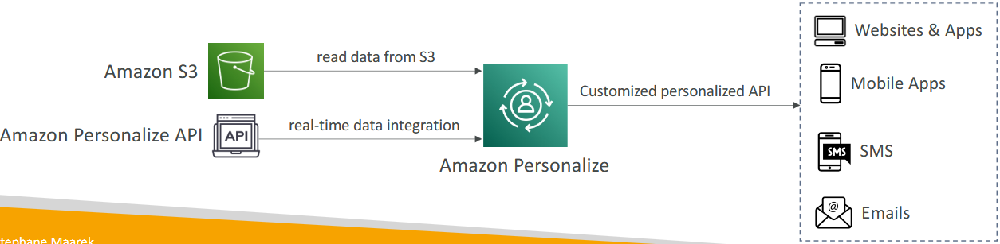

- [Machine Learning](#machine-learning)
  - [Rekognition](#rekognition)
    - [Introduction to Amazon Rekognition](#introduction-to-amazon-rekognition)
    - [Use Cases for Amazon Rekognition](#use-cases-for-amazon-rekognition)
    - [How Amazon Rekognition Works](#how-amazon-rekognition-works)
  - [Transcribe](#transcribe)
    - [Introduction to Amazon Transcribe](#introduction-to-amazon-transcribe)
    - [Key Features of Amazon Transcribe](#key-features-of-amazon-transcribe)
    - [Use Cases for Amazon Transcribe](#use-cases-for-amazon-transcribe)
    - [Step-by-Step Instructions](#step-by-step-instructions)
  - [Polly](#polly)
    - [Introduction to Amazon Polly](#introduction-to-amazon-polly)
    - [How Amazon Polly Works](#how-amazon-polly-works)
    - [Key Features of Amazon Polly](#key-features-of-amazon-polly)
    - [Step-by-Step Instructions](#step-by-step-instructions-1)
  - [Translate](#translate)
    - [Introduction to Amazon Translate](#introduction-to-amazon-translate)
    - [How Amazon Translate Works](#how-amazon-translate-works)
    - [Use Cases for Amazon Translate](#use-cases-for-amazon-translate)
  - [Lex + Connect](#lex--connect)
    - [Introduction to Amazon Lex](#introduction-to-amazon-lex)
    - [Use Cases for Amazon Lex](#use-cases-for-amazon-lex)
    - [Introduction to Amazon Connect](#introduction-to-amazon-connect)
    - [Benefits of Amazon Connect](#benefits-of-amazon-connect)
    - [How it Works](#how-it-works)
  - [Comprehend](#comprehend)
    - [Introduction to Amazon Comprehend](#introduction-to-amazon-comprehend)
    - [How Amazon Comprehend Works](#how-amazon-comprehend-works)
    - [Use Cases for Amazon Comprehend](#use-cases-for-amazon-comprehend)
  - [SageMaker](#sagemaker)
    - [Introduction to Amazon SageMaker](#introduction-to-amazon-sagemaker)
    - [Key Steps in Machine Learning with SageMaker](#key-steps-in-machine-learning-with-sagemaker)
    - [Deployment and Usage](#deployment-and-usage)
    - [Benefits of Amazon SageMaker](#benefits-of-amazon-sagemaker)
  - [Forecast](#forecast)
    - [Introduction to Amazon Forecast](#introduction-to-amazon-forecast)
    - [Use Cases for Amazon Forecast](#use-cases-for-amazon-forecast)
    - [How Amazon Forecast Works](#how-amazon-forecast-works)
  - [Kendra](#kendra)
    - [Introduction to Amazon Kendra](#introduction-to-amazon-kendra)
    - [How Amazon Kendra Works](#how-amazon-kendra-works)
    - [Key Features of Amazon Kendra](#key-features-of-amazon-kendra)
    - [Use Cases for Amazon Kendra](#use-cases-for-amazon-kendra)
  - [Personalise](#personalise)
    - [Introduction to Amazon Personalize](#introduction-to-amazon-personalize)
    - [How Amazon Personalize Works](#how-amazon-personalize-works)
    - [Use Cases for Amazon Personalize](#use-cases-for-amazon-personalize)
    - [Benefits of Amazon Personalize](#benefits-of-amazon-personalize)
  - [Textract](#textract)
    - [Introduction to Amazon Textract](#introduction-to-amazon-textract)
    - [How Amazon Textract Works](#how-amazon-textract-works)
    - [Use Cases for Amazon Textract](#use-cases-for-amazon-textract)
  - [Machine Learning Summary](#machine-learning-summary)
- [Quiz](#quiz)

 

 

# Machine Learning

## Rekognition
Source: https://aws.amazon.com/rekognition/

### Introduction to Amazon Rekognition
* Amazon Rekognition is a machine learning service used to **recognise** **objects**, **people**, **text**, and **scenes** in **images** and **videos**.
* `Key Features`: Facial analysis, facial search, user verification, and counting people.

### Use Cases for Amazon Rekognition
* `Labeling`: Identifying and labeling elements in images (e.g., person, rock, mountain bike).
* `Content Moderation`: Ensuring images and videos are appropriate for all ages.
* `Text Detection`: Detecting and reading text in images (e.g., numbers on runners in a race).
* `Face Detection and Analysis`: Analyzing facial features such as gender, age range, and emotions.
* `Face Search and Verification`: Verifying user identities and searching for familiar faces.
* `Celebrity Recognition`: Identifying celebrities in images.
* `Pathing`: Tracking movements in videos, such as monitoring a soccer game for real-time analytics.

### How Amazon Rekognition Works
* `Automation`: Automates image and video analysis using machine learning.
* `Website Demonstration`: The Rekognition website provides examples of how the service works, including identifying elements in images and performing various analyses.

 

 

## Transcribe
Source: https://aws.amazon.com/transcribe/

### Introduction to Amazon Transcribe
* Amazon Transcribe automatically converts speech into text.
* `Key Technology`: Uses a deep learning process called Automatic Speech Recognition (ASR) to convert speech to text quickly and accurately.

### Key Features of Amazon Transcribe
* `PII Redaction`: Automatically removes personally identifiable information (PII) such as age, name, and Social Security Number.
* `Automatic Language Identification`: Recognizes multiple languages in multilingual audio (e.g., French, English, Spanish).

### Use Cases for Amazon Transcribe
* `Customer Service Calls`: Transcribes customer service calls for record-keeping and analysis.
* `Closed Captioning and Subtitling`: Automates the creation of closed captions and subtitles for videos.
* `Metadata Generation`: Generates metadata for media assets to create a fully searchable archive.

 

 

### Step-by-Step Instructions

`Step 1`: Create a Transcript
1. Choose the specific **language** for the transcript (e.g., English US).

2. Begin streaming audio to be transcribed into text.

 

`Step 2`: Remove PII
1. Configure settings to identify and redact PII from the transcript.

2. Provide an example with PII to see how it is automatically hidden.

 

`Step 3`: Stream Multilingual Audio
1. Choose multiple languages for automatic language identification (e.g., English and French).

2. Stream audio in different languages and observe the recognition and transcription.

 

 

## Polly
Source: https://aws.amazon.com/polly/

### Introduction to Amazon Polly
* Amazon Polly is a service that converts text into speech using deep learning.
* Key Feature: Allows you to create applications that can talk by generating audio from text.

### How Amazon Polly Works
* Text-to-Speech: You input text, and Polly generates corresponding speech.
  * **Example**: For instance, if you input "Hello, my name is Stephane and this is a demo of Amazon Polly," Polly will generate an audio file saying that text.

### Key Features of Amazon Polly
* Voice Customization: Choose between different voices, including more natural-sounding or robotic voices.
* Interactive Console: Use the Amazon Polly console to input text and listen to the generated speech.

### Step-by-Step Instructions
`Step 1`: Use Amazon Polly Console
1. Navigate to the Amazon Polly console.
2. Enter the text you want to convert to speech (e.g., "Hi, my name is Stephane. I love AWS courses, and I love machine learning.").
3. Click on the "Listen" button to hear the generated audio.

 

`Step 2`: Customise Voice
1. Choose between **standard** and more **natural**-sounding voices.
2. Compare the different voice outputs to find the one that best suits your needs.

 

 

## Translate
Source: https://aws.amazon.com/translate/

### Introduction to Amazon Translate
* Amazon Translate is a natural and accurate language translation service.
* `Key Feature`: Allows you to localize content for international users by translating large volumes of text efficiently.

### How Amazon Translate Works
`Text Translation`: Converts text from one language to another accurately and quickly.

Example:
* English: "Hi, my name is Stephen."
* French: "Bonjour, je m'appelle Stephen."
* Portuguese: "Oi, meu nome é Stephen."
* Hindi: "नमस्ते, मेरा नाम स्टीफन है।"

### Use Cases for Amazon Translate
* `Website Localization`: Translate website content to cater to international audiences.
* `Application Localisation`: Translate application content for users in different regions.
* `Efficient Translation`: Handle large volumes of text translation efficiently.

 

 

## Lex + Connect

### Introduction to Amazon Lex
Source: https://aws.amazon.com/lex/

* Amazon Lex is the technology that **powers Alexa devices**, providing **automatic speech recognition** (ASR) to **convert speech into text**.
* `Key Feature`: **Understands** the **intent** of text and callers using natural language understanding (NLU).

### Use Cases for Amazon Lex
* `Chatbots`: Build chatbots that can interact with users through text or voice.
* `Call Center Bots`: Create bots for call centers to handle customer inquiries and tasks.

 

### Introduction to Amazon Connect
Source: https://aws.amazon.com/connect/

* Amazon Connect is a cloud-based visual contact center that **allows** you to **receive calls** and **create contact flows**.
* `Key Feature`: Integrates with customer relationship management (CRM) systems and other AWS services.

### Benefits of Amazon Connect
* `Cost-Effective`: No upfront payment and about 80% cheaper than traditional contact center solutions.
* `Integration`: Seamlessly integrates with other systems to enhance functionality.

 

### How it Works
`Step 1`: Building a Smart Contact Center
1. Use **Amazon Connect** to **receive calls** on a defined number.
2. **Amazon Lex** **streams information** from the call and **understands the intent**.
3. Based on the **intent**, **invoke the appropriate Lambda function** to **perform tasks** (e.g., scheduling a meeting).

`Step 2`: Using Amazon Lex
1. Convert spoken words into text.
2. Understand the intent behind the text and respond accordingly.

 

 

 

## Comprehend
Source: https://aws.amazon.com/comprehend/

### Introduction to Amazon Comprehend
* Amazon Comprehend is a Natural Language Processing (NLP) service.
* `Key Feature`: Uses machine learning to find **insights** and **relationships in text**.

### How Amazon Comprehend Works
* `Language Detection`: Identifies the language of the text.
* `Key Phrase Extraction`: Extracts key phrases, places, people, brands, or events from the text.
* `Sentiment Analysis`: Determines the sentiment (positive or negative) of the text.
* `Tokenisation and Parts of Speech`: Analyzes text using tokenization and parts of speech.
* `Topic Modeling`: Organizes a collection of text files by topic and finds topics within the text.

### Use Cases for Amazon Comprehend
* `Customer Interaction Analysis`: Analyzes customer emails to understand what leads to positive or negative experiences.
* `Article Grouping`: Groups articles by topics uncovered by Comprehend, making it easier to manage large volumes of text.

 

 

## SageMaker
Source: https://aws.amazon.com/sagemaker/

### Introduction to Amazon SageMaker
* Amazon SageMaker is a fully managed service for developers and data scientists to **build machine learning models**.
* `Key Feature`: Unlike other managed machine learning services with specific purposes (e.g., translating text, transcribing audio), SageMaker allows for the creation and deployment of custom machine learning models.

### Key Steps in Machine Learning with SageMaker
* `Data Gathering`: Collect data relevant to the problem you want to solve (e.g., student performance data).
* `Data Labeling`: Label the data to identify which columns correspond to specific features and outcomes.
* `Model Building`: Create a machine learning model to predict outcomes based on historical data.
* `Training and Tuning`: Train the model and refine it to improve accuracy and performance.

### Deployment and Usage
* `Deploying Models`: Once the model is built and trained, deploy it to make predictions on new data.
* **Example**: Survey new students, input their data into the model, and predict their exam scores based on the trained model.

 

### Benefits of Amazon SageMaker
* `End-to-End Solution`: SageMaker supports the entire machine learning workflow, from data labeling to model deployment.
* `Server Provisioning`: Automatically provisions the necessary servers to perform computations and create models, reducing the complexity of the process.

 

 

## Forecast
Source: https://aws.amazon.com/forecast/

### Introduction to Amazon Forecast
* Amazon Forecast is a fully managed service that uses machine learning to deliver highly **accurate forecasts**.
* `Key Feature`: Reduces forecasting time from months to hours and is 50% more accurate than traditional methods.

### Use Cases for Amazon Forecast
* `Product Demand Planning`: Predict future sales of products.
* `Financial Planning`: Forecast financial metrics and trends.
* `Resource Planning`: Plan resource allocation and usage.

### How Amazon Forecast Works
* `Data Collection`: Gather historical time-series data and additional data such as product features, prices, discounts, website traffic, and store locations.
* `Data Upload`: Upload the collected data to Amazon S3.
* `Model Creation`: Start the Amazon Forecast service to create a forecasting model.
* `Forecasting`: Use the model to predict future metrics, such as sales figures.

 

 

## Kendra
Source: https://aws.amazon.com/kendra/

### Introduction to Amazon Kendra
* Amazon Kendra is a fully-managed **document search** service powered by machine learning.
* `Key Feature`: Allows you to extract answers from various document types, such as text, PDF, HTML, PowerPoint, Microsoft Word, FAQs, etc.

### How Amazon Kendra Works
* `Document Indexing`: Indexes documents from various data sources to build a knowledge index powered by machine learning.
* `Natural Language Search`: Provides natural language search capabilities similar to Google, allowing users to ask questions and get accurate answers.

### Key Features of Amazon Kendra
* `Incremental Learning`: Learns from user interactions and feedback to promote preferred search results.
* `Fine-Tuning Search Results`: Allows fine-tuning of search results based on data importance, freshness, and custom filters.

### Use Cases for Amazon Kendra
* `IT Support`: For example, if a user asks, "Where is the IT support desk?" Kendra can reply with "1st floor" based on indexed resources.
* G`eneral Document Search`: Perform normal searches across various document types and get accurate answers.

 

 

## Personalise
Source: https://aws.amazon.com/personalize/

### Introduction to Amazon Personalize
* Amazon Personalize is a fully managed machine learning service that **builds apps** with **real-time personalised recommendations**.
* `Key Feature`: Provides personalized product recommendations, re-ranking, and customized direct marketing.

### How Amazon Personalize Works
* `Data Input`: Reads input data from Amazon S3, such as user interactions.
* `Real-Time Integration`: Uses the Amazon Personalize API for real-time data integration.
* `Personalized API`: Exposes a customized personalized API for websites, mobile applications, SMS, and emails.

 

### Use Cases for Amazon Personalize
* `Retail Stores`: Provide personalized product recommendations based on user purchase history.
* `Media and Entertainment`: Recommend content based on user preferences and interactions.

### Benefits of Amazon Personalize
* `Quick Model Building`: Takes days, not months, to build a model.
* `No Need for Custom ML Solutions`: Use the service as is without building, training, and deploying custom machine learning solutions.

 

 

## Textract
Source: https://aws.amazon.com/textract/

### Introduction to Amazon Textract
* Amazon Textract is a service used to extract text, handwriting, or data from scanned documents.
* `Key Feature`: Uses AI and machine learning to analyze documents and extract information.

### How Amazon Textract Works
* `Document Analysis`: Upload documents (e.g., driver licenses) to Amazon Textract, which automatically analyzes them.
* `Data Extraction`: Extracts specific data such as date of birth, document ID, etc., from forms, tables, PDFs, images, and more.

 

### Use Cases for Amazon Textract
* `Financial Services`: Process invoices and financial reports.
* `Healthcare`: Extract data from medical records and insurance claims.
* `Public Sector`: Process tax forms, ID documents, and passports.

 

 

## Machine Learning Summary
* `Rekognition`: face detection, labeling, celebrity recognition
* `Transcribe`: audio to text (ex: subtitles)
* `Polly`: text to audio
* `Translate`: translations
* `Lex`: build conversational bots – chatbots
* `Connect`: cloud contact center
* `Comprehend`: natural language processing
* `SageMaker`: machine learning for every developer and data scientist
* `Forecast`: build highly accurate forecasts
* `Kendra`: ML-powered search engine
* `Personalize`: real-time personalized recommendations
* `Textract`: detect text and data in documents

 

 

# Quiz

1. True or false. You should use Amazon Transcribe to turn text into lifelike speech using deep learning.
   * False.
   * Amazon Transcribe is an AWS service that makes it easy for customers to convert speech-to-text. 
   * Amazon Polly is a service that turns text into lifelike speech.

2. A company would like to implement a chatbot that will convert speech-to-text and recognize the customers' intentions. What service should it use?
   * Lex.
   * Amazon Lex is a service for building conversational interfaces into any application using voice and text. 
   * Lex provides the advanced deep learning functionalities of automatic speech recognition (ASR) for converting speech to text, and natural language understanding (NLU) to recognize the intent of the text, to enable you to build applications with highly engaging user experiences and lifelike conversational interactions.

3. Which fully managed service can deliver highly accurate forecasts?
   * Forecast. 
   * Amazon Forecast is a fully managed service that uses machine learning to deliver highly accurate forecasts.

4. You would like to find objects, people, text, or scenes in images and videos. What AWS service should you use?
   * Rekognition.
   * Amazon Rekognition makes it easy to add image and video analysis to your applications using proven, highly scalable, deep learning technology that requires no machine learning expertise to use.

5. A start-up would like to rapidly create customized user experiences. Which AWS service can help?
   * Personalize.
   * Amazon Personalize is a machine learning service that makes it easy for developers to create individualized recommendations for customers using their applications.

6. A research team would like to group articles by topics using Natural Language Processing (NLP). Which service should they use?
   * Comprehend.
   * Amazon Comprehend is a natural language processing (NLP) service that uses machine learning to find meaning and insights in text.

7. A company would like to convert its documents into different languages, with natural and accurate wording. What should they use?
   * Translate.
   * Amazon Translate is a neural machine translation service that delivers fast, high-quality, and affordable language translation.

8. A developer would like to build, train, and deploy a machine learning model quickly. Which service can he use?
   * SageMaker.
   * Amazon SageMaker is a fully managed service that provides every developer and data scientist with the ability to build, train, and deploy machine learning (ML) models quickly. 
   * SageMaker removes the heavy lifting from each step of the machine learning process to make it easier to develop high quality models.

9. Which AWS service makes it easy to convert speech-to-text?
    * Transcribe.
    * Amazon Transcribe is an AWS service that makes it easy for customers to convert speech-to-text.

10. Which of the following services is a document search service powered by machine learning? Forecast, Kendra, Comprehend, or Polly. 
    * Kendra.
    * Amazon Kendra is a highly accurate and easy to use enterprise search service that’s powered by machine learning.

 
