- [Other Services](#other-services)
  - [WorkSpaces](#workspaces)
    - [Introduction to Amazon WorkSpaces](#introduction-to-amazon-workspaces)
    - [How Amazon WorkSpaces Works](#how-amazon-workspaces-works)
    - [Use Cases for Amazon WorkSpaces](#use-cases-for-amazon-workspaces)
    - [WorkSpaces - Multiple Regions](#workspaces---multiple-regions)
    - [Minimising Latency for Amazon WorkSpaces](#minimising-latency-for-amazon-workspaces)
    - [Key Points to Remember](#key-points-to-remember)
  - [AppStream 2.0](#appstream-20)
    - [Introduction to Amazon AppStream](#introduction-to-amazon-appstream)
    - [How Amazon AppStream Works](#how-amazon-appstream-works)
    - [Comparison with Amazon WorkSpaces](#comparison-with-amazon-workspaces)
      - [Amazon WorkSpaces](#amazon-workspaces)
      - [Amazon AppStream](#amazon-appstream)
    - [Key Points to Remember](#key-points-to-remember-1)
  - [Internet of Things (IoT) Core](#internet-of-things-iot-core)
    - [Introduction to AWS IoT Core](#introduction-to-aws-iot-core)
    - [What is an IoT Device?](#what-is-an-iot-device)
    - [How AWS IoT Core Works](#how-aws-iot-core-works)
    - [Integration with AWS Services](#integration-with-aws-services)
    - [Use Cases for AWS IoT Core](#use-cases-for-aws-iot-core)
    - [Key Points to Remember](#key-points-to-remember-2)
  - [Elastic Transcoder](#elastic-transcoder)
    - [Introduction to Amazon Elastic Transcoder](#introduction-to-amazon-elastic-transcoder)
    - [How Amazon Elastic Transcoder Works](#how-amazon-elastic-transcoder-works)
    - [Benefits of Using Amazon Elastic Transcoder](#benefits-of-using-amazon-elastic-transcoder)
    - [Key Points to Remember](#key-points-to-remember-3)
  - [AppSync](#appsync)
    - [Introduction to AWS AppSync](#introduction-to-aws-appsync)
    - [How AWS AppSync Works](#how-aws-appsync-works)
    - [Use Cases for AWS AppSync](#use-cases-for-aws-appsync)
    - [Key Points to Remember](#key-points-to-remember-4)
  - [Amplify](#amplify)
    - [Introduction to AWS Amplify](#introduction-to-aws-amplify)
    - [How AWS Amplify Works](#how-aws-amplify-works)
    - [Amplify Studio](#amplify-studio)
    - [Integration with AWS Services](#integration-with-aws-services-1)
    - [Key Points to Remember](#key-points-to-remember-5)
  - [Application Composer](#application-composer)
    - [Introduction to AWS Application Composer](#introduction-to-aws-application-composer)
    - [How AWS Application Composer Works](#how-aws-application-composer-works)
    - [Importing Templates](#importing-templates)
    - [Example Usage](#example-usage)
    - [Enhanced Components](#enhanced-components)
    - [Key Points to Remember](#key-points-to-remember-6)
  - [Device Farm](#device-farm)
    - [Introduction to AWS Device Farm](#introduction-to-aws-device-farm)
    - [How AWS Device Farm Works](#how-aws-device-farm-works)
    - [Use Cases for AWS Device Farm](#use-cases-for-aws-device-farm)
    - [Key Points to Remember](#key-points-to-remember-7)
  - [AWS Backup](#aws-backup)
    - [Introduction to AWS Backup](#introduction-to-aws-backup)
    - [How AWS Backup Works](#how-aws-backup-works)
    - [Features of AWS Backup](#features-of-aws-backup)
    - [Key Points to Remember](#key-points-to-remember-8)
  - [Disaster Recovery Strategies](#disaster-recovery-strategies)
    - [Introduction to Disaster Recovery Strategies](#introduction-to-disaster-recovery-strategies)
    - [Types of Disaster Recovery Strategies](#types-of-disaster-recovery-strategies)
      - [Backup and Restore](#backup-and-restore)
      - [Pilot Light](#pilot-light)
      - [Warm Standby](#warm-standby)
      - [Multi-Site Hot Sites](#multi-site-hot-sites)
    - [Typical DR Setup for Cloud Deployments](#typical-dr-setup-for-cloud-deployments)
    - [Key Points to Remember](#key-points-to-remember-9)
  - [Elastic Disaster Recovery (DRS)](#elastic-disaster-recovery-drs)
    - [Introduction to AWS Elastic Disaster Recovery (DRS)](#introduction-to-aws-elastic-disaster-recovery-drs)
    - [How AWS Elastic Disaster Recovery Works](#how-aws-elastic-disaster-recovery-works)
    - [Use Cases for AWS Elastic Disaster Recovery](#use-cases-for-aws-elastic-disaster-recovery)
    - [Key Points to Remember](#key-points-to-remember-10)
  - [DataSync](#datasync)
    - [Introduction to AWS DataSync](#introduction-to-aws-datasync)
    - [How AWS DataSync Works](#how-aws-datasync-works)
    - [Use Cases for AWS DataSync](#use-cases-for-aws-datasync)
    - [Key Points to Remember](#key-points-to-remember-11)
  - [Cloud Migratioin Strategies - The 7Rs](#cloud-migratioin-strategies---the-7rs)
    - [Introduction to Cloud Migration Strategies](#introduction-to-cloud-migration-strategies)
    - [The Seven Rs of Cloud Migration](#the-seven-rs-of-cloud-migration)
    - [Key Points to Remember](#key-points-to-remember-12)
  - [Application Discovery Service \& Application Migration Service](#application-discovery-service--application-migration-service)
    - [Introduction to Cloud Migration](#introduction-to-cloud-migration)
    - [AWS Application Discovery Service](#aws-application-discovery-service)
    - [Types of Discovery](#types-of-discovery)
    - [Viewing Results](#viewing-results)
    - [AWS Application Migration Service (MGN)](#aws-application-migration-service-mgn)
      - [How It Works](#how-it-works)
    - [Benefits of AWS Application Migration Service](#benefits-of-aws-application-migration-service)
    - [Key Points to Remember](#key-points-to-remember-13)
  - [Migration Evaluator](#migration-evaluator)
    - [Introduction to AWS Migration Evaluator](#introduction-to-aws-migration-evaluator)
    - [How AWS Migration Evaluator Works](#how-aws-migration-evaluator-works)
    - [Data Collection Methods](#data-collection-methods)
    - [Benefits of AWS Migration Evaluator](#benefits-of-aws-migration-evaluator)
    - [Key Points to Remember](#key-points-to-remember-14)
  - [Migration Hub](#migration-hub)
    - [Introduction to AWS Migration Hub](#introduction-to-aws-migration-hub)
    - [How AWS Migration Hub Works](#how-aws-migration-hub-works)
    - [AWS Migration Hub Orchestrator](#aws-migration-hub-orchestrator)
    - [Key Points to Remember](#key-points-to-remember-15)
  - [Fault Injection Simulator (FIS)](#fault-injection-simulator-fis)
    - [Introduction to AWS Fault Injection Simulator (FIS)](#introduction-to-aws-fault-injection-simulator-fis)
    - [How AWS Fault Injection Simulator Works](#how-aws-fault-injection-simulator-works)
    - [Running Experiments](#running-experiments)
    - [Benefits of AWS Fault Injection Simulator](#benefits-of-aws-fault-injection-simulator)
    - [Key Points to Remember](#key-points-to-remember-16)
  - [Step Functions](#step-functions)
    - [Introduction to AWS Step Functions](#introduction-to-aws-step-functions)
    - [How AWS Step Functions Works](#how-aws-step-functions-works)
    - [Integration with AWS Services](#integration-with-aws-services-2)
    - [Human Approval Feature](#human-approval-feature)
    - [Use Cases for AWS Step Functions](#use-cases-for-aws-step-functions)
    - [Key Points to Remember](#key-points-to-remember-17)
  - [Ground Station](#ground-station)
    - [Introduction to AWS Ground Station](#introduction-to-aws-ground-station)
    - [How AWS Ground Station Works](#how-aws-ground-station-works)
    - [Use Cases for AWS Ground Station](#use-cases-for-aws-ground-station)
    - [Key Points to Remember](#key-points-to-remember-18)
  - [AWS Pinpoint](#aws-pinpoint)
    - [Introduction to Amazon Pinpoint](#introduction-to-amazon-pinpoint)
    - [How Amazon Pinpoint Works](#how-amazon-pinpoint-works)
    - [Use Cases for Amazon Pinpoint](#use-cases-for-amazon-pinpoint)
    - [Comparison with Amazon SNS and SES](#comparison-with-amazon-sns-and-ses)
    - [Key Points to Remember](#key-points-to-remember-19)
- [Quiz](#quiz)

 

 

# Other Services

## WorkSpaces

### Introduction to Amazon WorkSpaces
* Amazon WorkSpaces is a managed Desktop as a Service (DaaS) solution that allows you to easily provision Windows or Linux desktops.
* `Key Feature`: Eliminates the need for on-premises Virtual Desktop Infrastructure (VDI).

### How Amazon WorkSpaces Works
* `Provisioning`: Users can provision secure Windows or Linux desktops in the cloud.
* `Scalability`: Quickly scales to thousands of users.
* `Security`: Integrated with AWS Key Management Service (KMS) for enhanced security.
* `Pay-as-You-Go`: You only pay for the usage of the desktops.

 

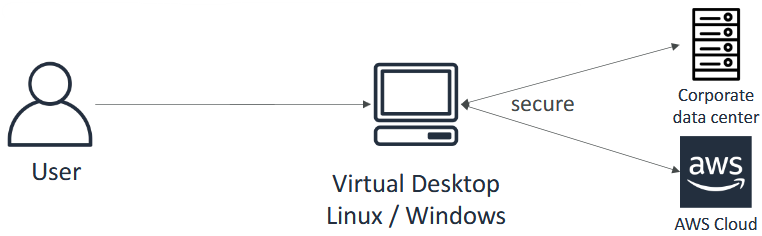

 

### Use Cases for Amazon WorkSpaces
* `Remote Access`: Users can access secure desktops from home or any location.
* `Corporate Data Access`: Provides access to cloud or corporate data centers through secure virtual desktops.
* `Virtual Desktops`: Ideal for scenarios requiring virtual desktops or managed desktop services.

 

### WorkSpaces - Multiple Regions

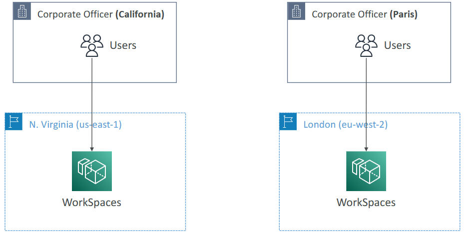

 

### Minimising Latency for Amazon WorkSpaces
* `Deploy Close to Users`: To minimize latency, deploy WorkSpaces as close as possible to your users' locations.
  * **Example**: For corporate offices in California and Paris, deploy WorkSpaces in the U.S. for California users and in Europe for Paris users.
* `General Best Practice`: Always deploy applications and services close to users to minimise latency.

### Key Points to Remember
* `Managed DaaS Solution`: Amazon WorkSpaces provides a managed solution for provisioning virtual desktops.
* `Scalability and Security`: Scales quickly and integrates with KMS for security.
* `Latency Minimisation`: Deploy WorkSpaces close to users to reduce latency.

 

 

## AppStream 2.0

### Introduction to Amazon AppStream
* Amazon AppStream is a service that allows you to stream desktop applications directly to your web browser.
* `Key Feature`: Application-focused streaming, enabling access to applications like Blender, Eclipse, Firefox, and OpenOffice from within a web browser.

### How Amazon AppStream Works
* `Application Streaming`: Streams specific desktop applications directly into your web browser without the need for a full virtual desktop.
* `Compatibility`: Works on any device with a web browser, offering broad compatibility.
* `Instance Configuration`: Allows you to configure instance types per application, providing the necessary resources (CPU, RAM, GPU) for each application.

### Comparison with Amazon WorkSpaces
#### Amazon WorkSpaces
* Provides a full Virtual Desktop Infrastructure (VDI) with a complete Windows or Linux desktop.
* **Usage**: Users connect using a remote desktop application and can launch multiple applications within the desktop.
* **Availability**: Can be on-demand or always on.

#### Amazon AppStream
* Streams specific desktop applications directly to the web browser.
* **Usage**: No need to connect to a virtual desktop; applications are accessed directly through the browser.
* **Compatibility**: More compatible with various devices due to browser-based access.

### Key Points to Remember
* `Application-Focused`: Amazon AppStream is ideal for streaming specific applications rather than providing a full desktop environment.
* `Resource Configuration`: You can configure the instance type per application to meet specific resource needs.
* `Minimising Latency`: Deploy AppStream instances close to users to minimise latency, similar to best practices for other AWS services.

 

 

## Internet of Things (IoT) Core

### Introduction to AWS IoT Core
* AWS IoT Core allows you to easily **connect** Internet of Things (IoT) **devices to the AWS Cloud**.
* `Key Feature`: Facilitates the connection and management of IoT devices, enabling data collection and transfer.

### What is an IoT Device?
`Examples`: Connected cars, lights, fridges, and other internet-connected devices.

`Functionality`: These devices can securely and scalably exchange data and messages.

 

### How AWS IoT Core Works
* `Pub-Sub Model`: Acts as a publish-subscribe (pub-sub) system to allow devices to exchange messages and communicate.
* `Offline Communication`: Applications can communicate with devices even when they are not connected.

 

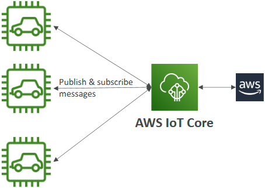

 

### Integration with AWS Services
* `AWS Lambda`: Use Lambda functions to process data from IoT devices.
* `Amazon S3`: Store and manage data from IoT devices.
* `Amazon SageMaker`: Analyze and act on data using machine learning models.

### Use Cases for AWS IoT Core
* `Data Gathering`: Collect data from billions of devices and trillions of messages.
* `Data Processing`: Process and analyze data to build IoT applications.
* `Secure Communication`: Ensure secure data exchange between devices and the cloud.

### Key Points to Remember
* `Scalability`: AWS IoT Core can handle a large number of devices and messages.
* `Integration`: Seamlessly integrates with other AWS services to add value to IoT devices.
* `Flexibility`: Supports a wide range of IoT devices and applications.

 

 

## Elastic Transcoder 

### Introduction to Amazon Elastic Transcoder
* Amazon Elastic Transcoder is used to convert media files stored in Amazon S3 into formats required by consumer playback devices, such as phones, tablets, and PCs.
* `Key Feature`: Transcodes media files to ensure compatibility with a wide array of devices.

### How Amazon Elastic Transcoder Works
* `Media File Conversion`: Upload a media file (e.g., a video) to an Amazon S3 bucket.
* `Transcoding Pipeline`: Run the file through a transcoding pipeline on Elastic Transcoder.
* `Output`: The transcoded files are stored in an S3 output bucket, compatible with various devices.

 

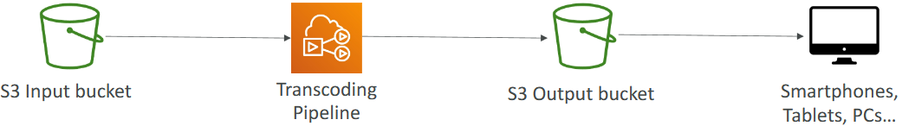

 

### Benefits of Using Amazon Elastic Transcoder
* `Ease of Use`: Simple to set up and use.
* `Scalability`: Highly scalable; the more files you have, the more processing power is allocated.
* `Cost-Effective`: Pay only for the time your media is being transcoded.
* `Fully Managed and Secure`: Managed by AWS, ensuring security and reliability.

### Key Points to Remember
* `Cloud-Based Solution`: Ideal for converting media files without the need for on-premises infrastructure.
* `Pay-As-You-Go`: Cost-effective as you only pay for what you use.
* `Device Compatibility`: Ensures media files are compatible with a wide range of consumer devices.

 

 

## AppSync

### Introduction to AWS AppSync
* AWS AppSync is used to **build** a **backend** for your **mobile** and web **applications**, enabling **real-time data storage** and synchronisation.
* `Key Feature`: Leverages GraphQL, a technology from Facebook, to manage and query data efficiently.

### How AWS AppSync Works
* `GraphQL Integration`: Uses GraphQL to automatically generate client code for your APIs.
* `Backend Integration`: Integrates with AWS services like DynamoDB and Lambda to build a robust GraphQL backend.
* `Real-Time Subscriptions`: Provides real-time updates for your web and mobile applications.
* `Offline Data Synchronisation`: Supports offline data synchronization, ensuring data consistency even when offline.

### Use Cases for AWS AppSync
* `Mobile and Web Applications`: Ideal for applications that require real-time data updates and synchronization.
* `GraphQL Backend`: Suitable for building a GraphQL backend with seamless integration with other AWS services.
* `AWS Amplify Integration`: Can be leveraged by AWS Amplify to build a GraphQL backend easily.

### Key Points to Remember
* `Real-Time Data`: AWS AppSync enables real-time data updates and synchronization.
* `GraphQL`: Utilizes GraphQL for efficient data management and querying.
* `Integration`: Works well with DynamoDB, Lambda, and AWS Amplify for building comprehensive backends.

 

 

## Amplify

### Introduction to AWS Amplify
* AWS Amplify is a set of tools and services designed to help you develop and deploy scalable full-stack web and mobile applications.
* `Key Feature`: Provides a comprehensive suite to manage all aspects of your web and mobile applications.

 

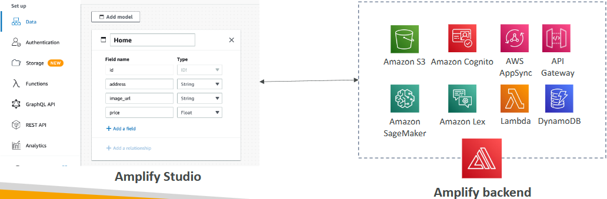

 

### How AWS Amplify Works
* `Comprehensive Suite`: Manages authentication, storage, APIs (REST and GraphQL), CI/CD, PubSub, analytics, machine learning, and monitoring.
* `Source Code Integration`: Supports source code from AWS, GitHub, and other repositories.

### Amplify Studio
* `Setup`: Allows you to set up data, authentication, storage, functions, and APIs within the Amplify Studio.
* `Backend Configuration`: Automatically configures an Amplify backend leveraging existing AWS services.

### Integration with AWS Services
* `Amazon S3`: For storage.
* `Amazon Cognito`: For authentication.
* `AWS AppSync`: For GraphQL backend.
* `API Gateway`: For REST backend.
* `SageMaker, Lex, Lambda, DynamoDB`: For various backend functionalities.

### Key Points to Remember
* `Elastic Beanstalk for Apps`: Think of Amplify as the Elastic Beanstalk for web and mobile applications.
* `Comprehensive Management`: Manages all aspects of application development and deployment.
* `Service Integration`: Integrates seamlessly with various AWS services to build robust backends.

 

 

## Application Composer
Source: https://docs.aws.amazon.com/infrastructure-composer/

### Introduction to AWS Application Composer
* AWS Application Composer allows you to **visually design** and **build** serverless **applications** quickly on AWS.
* `Key Feature`: Provides an interface to drag and drop components to build your template visually.

 

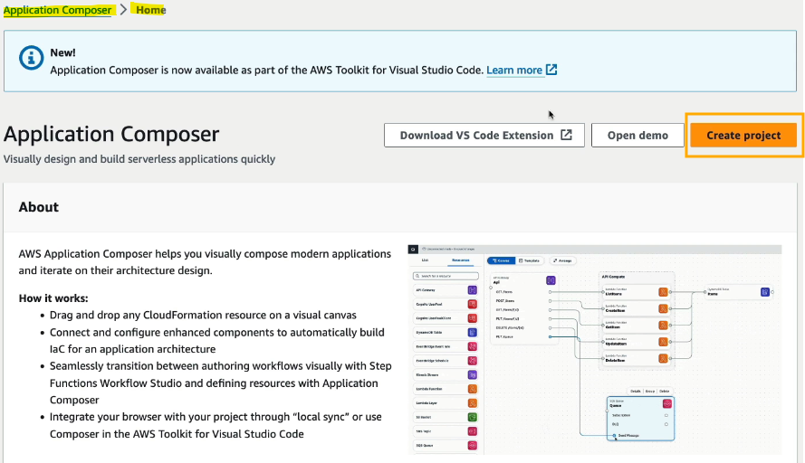

 

### How AWS Application Composer Works
* `Visual Interface`: Enables you to create infrastructure as code (IaC) without being an AWS expert.
* `Resource Interaction`: Configure how your resources interact by connecting them.
* `Output`: Generates an IaC template from CloudFormation.

 

### Importing Templates
* `CloudFormation and SAM`: You can import CloudFormation or SAM templates to visualize them in the Application Composer.

 

### Example Usage
* `API Gateway and Lambda`: Connect API Gateway routes to Lambda functions.
* `Kinesis Stream`: Drag and drop a Kinesis stream and connect it to a Lambda function.
* `Configuration`: Click on components to configure details, such as logical IDs and specific settings.

 

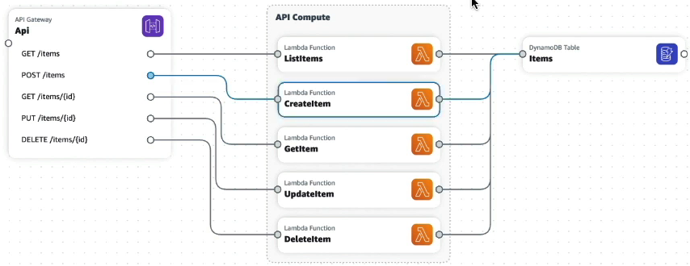

 

### Enhanced Components
* `Serverless Environments`: Includes components specific to serverless environments.
* `CloudFormation Resources`: Set up any kind of IaC resources from CloudFormation.

### Key Points to Remember
* `Visual Design`: AWS Application Composer simplifies the creation of serverless applications through a visual interface.
* `IaC Templates`: Generates CloudFormation templates that you can use in your code.
* `Flexibility`: Supports detailed configuration and a wide range of components.

 

 

## Device Farm

### Introduction to AWS Device Farm
* AWS Device Farm is a fully managed service that **tests your web** and mobile **applications** **against real** desktop **browsers**, mobile devices, and tablets.
* `Key Feature`: Allows concurrent testing on multiple devices to speed up test execution.

### How AWS Device Farm Works
* `Device Configuration`: Configure devices with settings like GPS, language, WiFi, and Bluetooth.
* `Real Devices`: Tests are conducted on actual devices, including desktop browsers, mobile devices, and tablets.

 

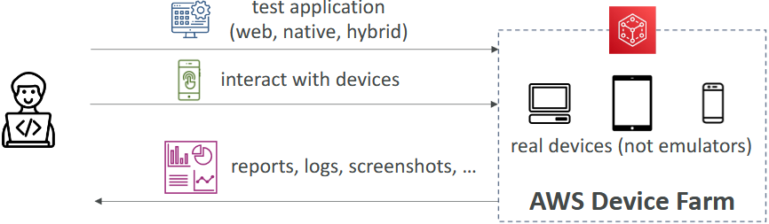

 

### Use Cases for AWS Device Farm
* `Application Testing`: Ideal for Android and iOS programmers to ensure their apps work across various devices with different screen sizes and configurations.
* `Bug Detection`: Helps catch bugs early by testing on a wide range of devices.
* `Interactive Testing`: Allows interaction with devices and provides reports, logs, and screenshots to help identify and fix issues.

### Key Points to Remember
* `Concurrent Testing`: Run tests on multiple devices simultaneously to speed up the process.
* `Device Variety`: Supports a wide range of devices, ensuring comprehensive testing.
* `Detailed Reports`: Provides detailed reports, logs, and screenshots to help with bug fixing.

 

 

## AWS Backup

### Introduction to AWS Backup
* AWS Backup is a fully-managed service that centrally manages and automates backups across AWS services.
* `Key Feature`: Supports on-demand and scheduled backups, as well as point-in-time recovery (PITR).

### How AWS Backup Works
* `Backup Plan`: Create a backup plan that defines the frequency and retention policy of your backups.
* `Resource Assignment`: Assign resources to be backed up, such as Amazon EC2, EBS, DynamoDB, RDS, EFS, Aurora, FSx, and Storage Gateway.
* `Automatic Backups`: The backup plan ensures that all assigned resources are automatically backed up into Amazon S3.

 

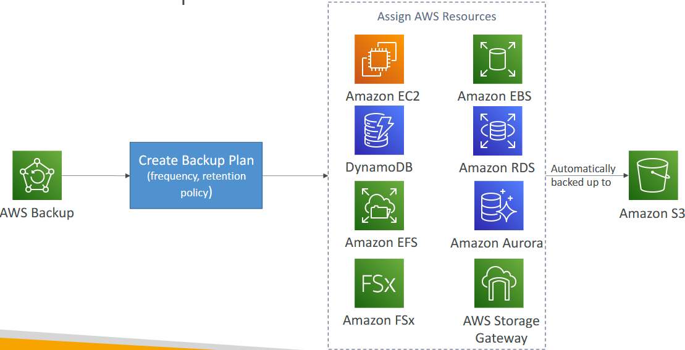

 

### Features of AWS Backup
* `Retention Periods`: Define how long backups are retained.
* `Lifecycle Management`: Manage the lifecycle of backups, including transitioning to cold storage.
* `Backup Policies`: Set policies for backup management.
* `Cross-Region and Cross-Account Backups`: Perform backups across different regions and accounts, supported by AWS Organizations.

### Key Points to Remember
* `Centralised Management`: AWS Backup provides a centralized way to manage and automate backups.
* `Integration with AWS Services`: Works with a variety of AWS services to ensure comprehensive backup coverage.

 

 

## Disaster Recovery Strategies

### Introduction to Disaster Recovery Strategies
* Disaster recovery strategies help ensure business continuity by preparing for and recovering from disasters.
* Key Feature: Different strategies vary in cost and complexity.

### Types of Disaster Recovery Strategies
#### Backup and Restore
* Data is backed up into the cloud and restored in case of a disaster.
* Cost: Cheapest option as the application is not running continuously.
* Use Case: Suitable for minimal cost and infrequent recovery needs.

 

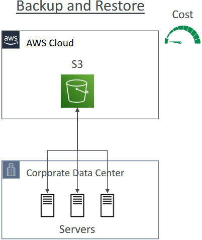

 

#### Pilot Light
* Core functions of the application (e.g., database) run in the cloud with minimal setup.
* Cost: More expensive than backup and restore.
* Use Case: Core functions are ready to scale, but full application servers are not running.

 

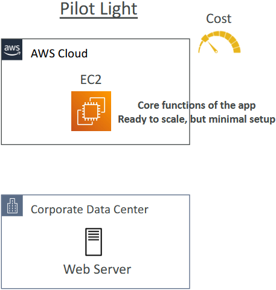

 

#### Warm Standby
* Full version of the application is ready in the cloud at a minimal size.
* Cost: More expensive than pilot light.
* Use Case: Application can be quickly scaled up in case of a disaster.

 

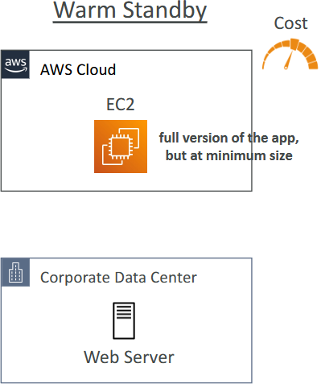

 

#### Multi-Site Hot Sites
* Full version of the application is running at full size, ready to be used immediately.
* Cost: Most expensive option.
* Use Case: Immediate availability and minimal downtime in case of a disaster.

 

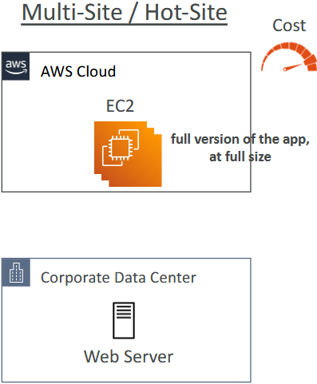

 

### Typical DR Setup for Cloud Deployments

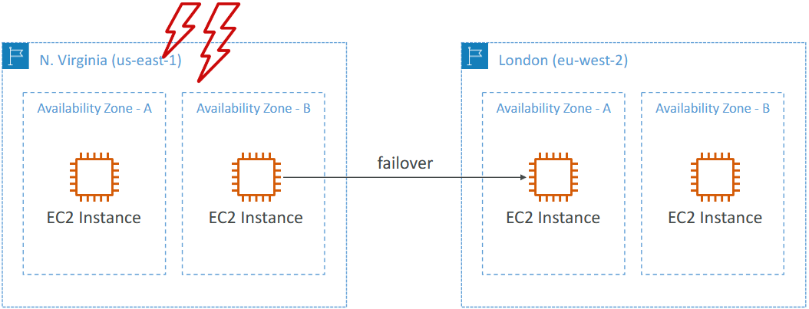

 

### Key Points to Remember
* `Cheapest Option`: Backup and restore is the cheapest disaster recovery strategy.
* `Most Expensive Option`: Multi-site hot sites are the most expensive due to continuous operation.
* `Multi-Region Recovery`: In the cloud, disaster recovery can involve multi-region setups, such as failing over traffic from one region to another using Route 53.

 

 

## Elastic Disaster Recovery (DRS)

### Introduction to AWS Elastic Disaster Recovery (DRS)
* AWS Elastic Disaster Recovery (DRS) allows you to quickly and easily **recover** your physical, virtual, and cloud-based servers into AWS **for disaster recovery**.
* `Key Feature`: Provides continuous block-level replication of your servers from your corporate data center into the cloud.

### How AWS Elastic Disaster Recovery Works
* `Continuous Replication`: Uses an AWS replication agent to continuously replicate disks from your corporate data center to a staging environment in AWS.
* `Staging Environment`: Utilizes low-cost EC2 instances and EBS volumes for the staging environment.
* `Failover`: In case of a disaster, you can failover within minutes from staging to production by creating larger EC2 instances and better EBS volumes.
* `Failback`: Once your corporate data center is back online, you can perform a failback to return operations to normal.

 

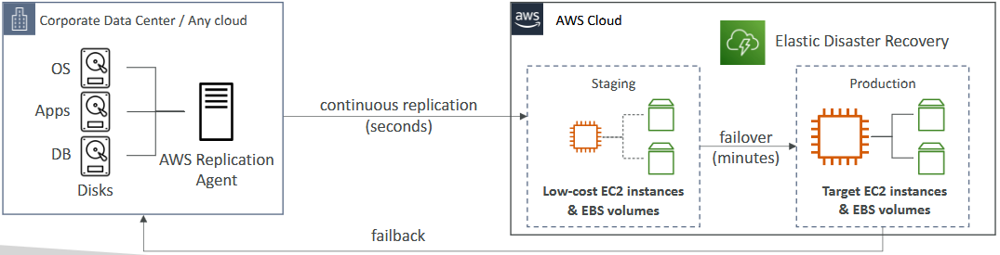

 

### Use Cases for AWS Elastic Disaster Recovery
* `Critical Databases`: Protect critical databases like Oracle, MySQL, and SQL Server.
* `Enterprise Applications`: Safeguard enterprise applications such as SAP.
* `Ransomware Protection`: Protect data from attacks and ransom demands.

### Key Points to Remember
* `Continuous Replication`: Ensures continuous replication of data for minimal downtime.
* `Cost-Effective Staging`: Uses low-cost resources for the staging environment.
* `Quick Recovery`: Enables quick failover and failback to minimize disruption.

 

 

## DataSync

### Introduction to AWS DataSync
* AWS DataSync allows you to move large amounts of data from on-premises to AWS.
* `Key Feature`: Supports synchronization of data into Amazon S3, Amazon EFS, or Amazon FSx for Windows.

### How AWS DataSync Works
* `Replication Tasks`: Can be scheduled regularly (e.g., every hour, day, or week).
* `Incremental Tasks`: After the initial full load of data, subsequent tasks are incremental, transferring only the changes.

 

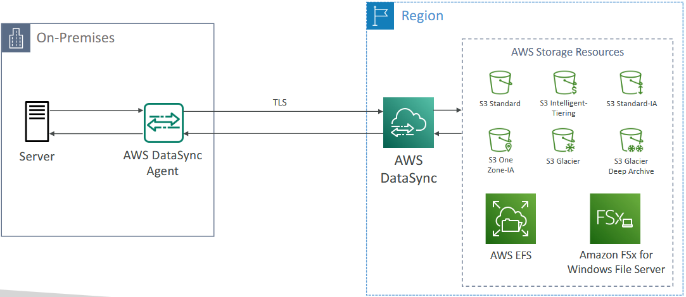

 

### Use Cases for AWS DataSync
* `Data Migration`: Ideal for migrating or replicating data from on-premises servers to AWS.
* `Incremental Updates`: Efficiently handles ongoing data synchronization with incremental updates.

### Key Points to Remember
* `DataSync Agent`: Runs on-premises and connects to DataSync servers to transfer data.
* `Storage Classes`: Supports various storage classes in Amazon S3, EFS, and FSx for Windows.

 

 

## Cloud Migratioin Strategies - The 7Rs
Source: https://aws.amazon.com/blogs/enterprise-strategy/new-possibilities-seven-strategies-to-accelerate-your-application-migration-to-aws/

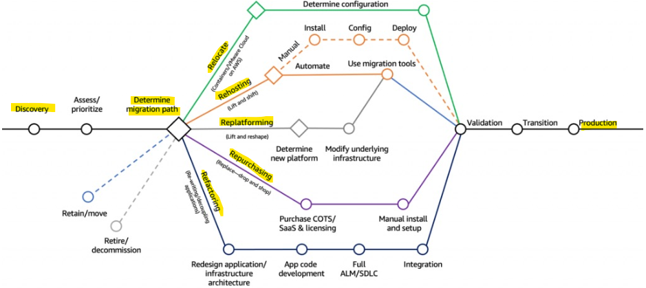

### Introduction to Cloud Migration Strategies
* Cloud migration strategies **help** organisations **move** their **applications** and **data** to the **cloud efficiently**.
* `Key Feature`: The seven Rs of cloud migration provide different approaches based on business needs and goals.

 

### The Seven Rs of Cloud Migration
`Retire`:
* Turn off services you no longer need.
* **Benefits**: Reduces attack surface, saves costs, and focuses on essential resources.

`Retain`:
* Keep resources on-premises.
* **Reasons**: Security, data compliance, performance, unresolved dependencies, or lack of business value in migrating.

`Relocate`:
* Move applications or EC2 instances to the cloud or different AWS regions/accounts.
  * **Example**: Using VMware Cloud on AWS to maintain the same setup as on-premises.

`Rehost "lift and shift"` (Lift and Shift):
* Migrate applications, databases, and data to AWS without changes.
* **Benefits**: Simple migration, potential cost savings, no cloud optimization required.

`Replatform "lift and reshape"` (Lift and Reshape):
* Migrate to AWS with some cloud optimizations.
  * **Example**: Moving databases to RDS or applications to Elastic Beanstalk for managed services benefits.

`Repurchase "drop and shop"` (Drop and Shop):
* Move to a different product or SaaS platform.
  * **Example**: Switching CRM to Salesforce, HR to Workday, or CMS to Drupal.

`Refactor / Re-architect`:
* Re-imagine and re-architect applications using cloud-native features.
* **Benefits**: Improved scalability, performance, security, and agility. Transition from monolithic to microservices architecture.

 

### Key Points to Remember
* `Cheapest Strategy`: Retire services you don't need.
* `Most Effort and Payoff`: Refactor and re-architect for maximum cloud benefits.
* `Incremental Approach`: Strategies like rehost and replatform offer a balance between effort and benefits.

 

 

## Application Discovery Service & Application Migration Service

### Introduction to Cloud Migration
* Cloud migration involves **moving on-premises servers** and data centers **to the cloud**.
* `Key Feature`: Planning and executing migration using AWS services.

 

### AWS Application Discovery Service
* Helps **plan** your migration by **scanning servers** and **gathering information** about server utilisation and dependency mapping.

### Types of Discovery
* `Agentless Discovery`: Uses a Connector to gather information about virtual machines, configuration, and performance history (CPU, memory, disk usage).
* `Agent-Based Discovery`: Uses an Application Discovery Agent to provide more detailed information, including system configuration, performance, running processes, and network connections.

### Viewing Results
* `AWS Migration Hub`: Centralized service to view data collected by the Application Discovery Service, helping to map out what needs to be moved and how they are interconnected.

 

### AWS Application Migration Service (MGN)
* Simplifies the migration process by enabling rehosting (lift-and-shift) of physical, virtual, or other cloud servers to AWS.

#### How It Works
* `Replication Agent`: Installed on your data center to perform continuous replication of disks to a staging environment in AWS.
* `Staging to Production`: When ready, move from staging to production with larger EC2 instances and EBS volumes as needed.

 

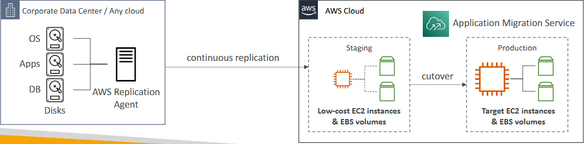

 

### Benefits of AWS Application Migration Service
* `Wide Range of Support`: Supports various platforms, operating systems, and databases.
* `Minimal Downtime`: Ensures minimal downtime during migration.
* `Cost-Effective`: Reduces costs by automating the migration process and eliminating the need for complex engineering efforts.

 

### Key Points to Remember
* `Planning with Discovery Service`: Use AWS Application Discovery Service to gather necessary information for migration planning.
* `Executing with Migration Service`: Use AWS Application Migration Service for a seamless lift-and-shift migration with minimal downtime and reduced costs.

 

 

## Migration Evaluator

### Introduction to AWS Migration Evaluator
* AWS Migration Evaluator helps build a data-driven business case for migrations to AWS.
* `Key Feature`: Provides insights into your current infrastructure and helps plan your migration.

### How AWS Migration Evaluator Works
* `Baseline Assessment`: Install the Agentless Collector to conduct a broad-based discovery of your infrastructure.
* `Snapshot`: Take a snapshot of your on-premises footprint, server dependencies, and more.
* `Analysis`: Analyze your current state, define the target state in AWS, and develop a migration plan.

 

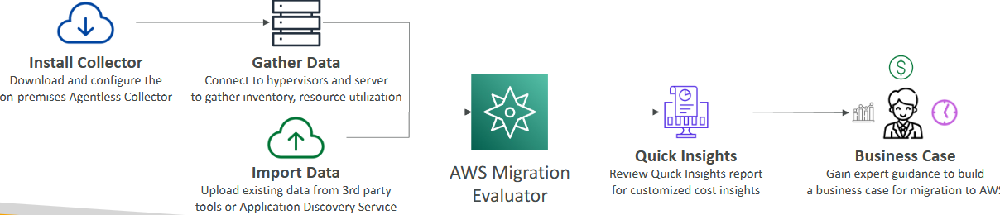

 

### Data Collection Methods
* `Collector Installation`: Gather data using the Agentless Collector.
* `Data Import Feature`: Use a tool and template to shape your data for the Migration Evaluator Service.

### Benefits of AWS Migration Evaluator
* `Quick Insights`: Provides quick insights to understand your customized cost insights.
* `Cost Efficiency`: Ensures your migration is cost-efficient and beneficial for your business.
* `Expert Guidance`: Access expert guidance on your business case from AWS if needed.

### Key Points to Remember
* `Data-Driven Decisions`: AWS Migration Evaluator helps make informed decisions based on data.
* `Comprehensive Analysis`: Offers a thorough analysis of your current and target states.
* `Business Case`: Develops a strong business case for migration to AWS.

 

 

## Migration Hub

### Introduction to AWS Migration Hub
* AWS Migration Hub is a central location for **collecting server** and **application inventory data** to **assess**, **plan**, and **track** migrations to AWS.
* `Key Feature`: Centralizes migration activities to accelerate and automate the lift-and-shift process.

### How AWS Migration Hub Works
* `Centralised Management`: Helps you manage and track your migration process from a single location.
* `Integration`: Works with other AWS services like Application Migration Service (MGN) and Database Migration Service (DMS).

 

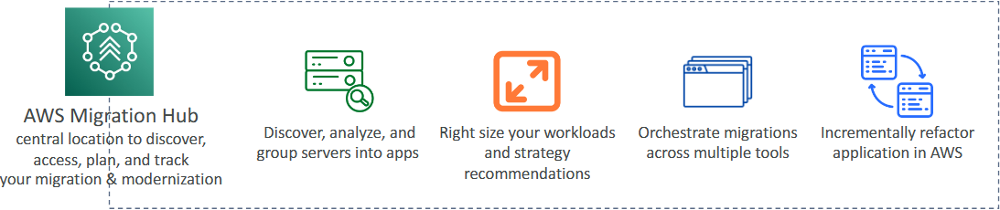

 

### AWS Migration Hub Orchestrator
* `Pre-Built Templates`: Uses pre-built templates to save time and effort when migrating enterprise applications like SAP and Microsoft SQL Server.
* `Orchestration`: Facilitates the orchestration of migrations across multiple tools.

### Key Points to Remember
* `Central Location`: AWS Migration Hub is the go-to service for discovering, accessing, planning, and tracking your migration and modernization efforts.
* `Right-Sizing`: Helps in right-sizing your workloads and providing strategy recommendations.
* `Incremental Refactoring`: Supports incremental refactoring of applications to move them to AWS.

 

 

## Fault Injection Simulator (FIS)

### Introduction to AWS Fault Injection Simulator (FIS)
* AWS Fault Injection Simulator (FIS) allows you to run fault injection experiments on AWS workloads.
* `Key Feature`: Based on Chaos Engineering, which involves creating disruptive events to stress test applications.

### How AWS Fault Injection Simulator Works
* `Chaos Engineering`: Simulates disruptive events like CPU spikes, memory exhaustion, and database failures to see how your application stack reacts.
* `Supported Services`: Includes EC2 (terminating instances), ECS (stopping tasks), EKS (stopping Kubernetes tasks), and RDS (inducing database failures).

 

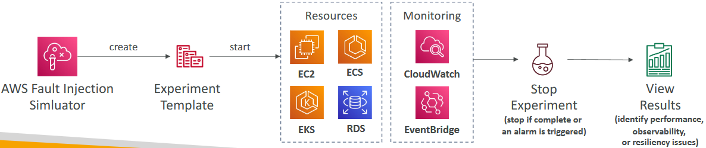

 

### Running Experiments
* `Creating Experiments`: Use pre-built templates to generate disruptions on resources.
* `Monitoring`: Monitor the impact using CloudWatch, EventBridge, X-Ray, or other tools.
* `Analysing Results`: After the experiment, analyze performance, observability, and resiliency issues to improve your application.

### Benefits of AWS Fault Injection Simulator
* `Uncover Hidden Bugs`: Helps identify hidden bugs and performance bottlenecks.
* `Improve Resiliency`: Ensures your application is solid and resilient to failures.
* `Advanced Monitoring`: Provides advanced monitoring and debugging capabilities.

### Key Points to Remember
* `Chaos Engineering`: AWS FIS is based on Chaos Engineering principles to test application robustness.
* `Service Integration`: Supports various AWS services for comprehensive fault injection.
* `Continuous Improvement`: Use the insights gained to continuously improve your application's performance and resiliency.

 

 

## Step Functions

### Introduction to AWS Step Functions
* AWS Step Functions allows you to build serverless visual workflows to orchestrate various AWS services.
* `Key Feature`: Enables the design of complex workflows using a graphical interface.

### How AWS Step Functions Works
* `Workflow Design`: Create a graph where each step defines actions based on success or failure.
* `Internal Features`: Supports sequencing, parallel functions, conditions, timeouts, error handling, and more.

 

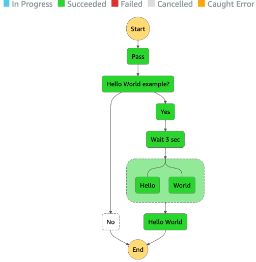

 

### Integration with AWS Services
* `Lambda Functions`: Commonly used to orchestrate Lambda functions.
* `Other Services`: Integrates with EC2 instances, ECS tasks, on-premises servers, API Gateway, SQS queues, and many other AWS services.

### Human Approval Feature
* `Human Interaction`: Allows for human approval steps within the workflow. For example, a human can review results and decide whether to proceed or fail the workflow.

### Use Cases for AWS Step Functions
* `Order Fulfillment`: Automate and manage order processing workflows.
* `Data Processing`: Handle complex data processing tasks.
* `Web Applications`: Manage workflows for web applications.
* `Complex Workflows`: Suitable for any workflow that requires visualization and orchestration of multiple steps.

### Key Points to Remember
* `Visual Workflow`: AWS Step Functions provides a visual interface to design and manage workflows.
* `Service Integration`: Works with a wide range of AWS services for comprehensive orchestration.
* `Human Approval`: Supports human approval steps within workflows for added flexibility.

 

 

## Ground Station

### Introduction to AWS Ground Station
* AWS Ground Station is a fully managed service that lets you control satellite communications, process data, and scale satellite operations.
* `Key Feature`: Provides a global network of satellite ground stations near AWS regions to facilitate data access from satellites to the AWS cloud.

### How AWS Ground Station Works
* `Data Download`: Allows you to download satellite data to your AWS VPC within seconds.
* `Integration`: Connects satellites to the cloud, enabling data transfer to Amazon S3 buckets or EC2 instances for further processing.

 

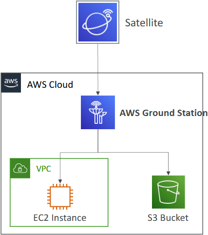

 

### Use Cases for AWS Ground Station
* `Weather Forecasting`: Collect and analyze weather data from satellites.
* `Surface Imaging`: Obtain high-resolution images of the Earth's surface.
* `Communications`: Facilitate satellite-based communication services.
* `Video Broadcast`: Stream video content from satellites.

### Key Points to Remember
* `Ease of Use`: Simplifies the process of accessing and processing satellite data.
* `Global Network`: Leverages a global network of ground stations for efficient data transfer.
* `Versatile Applications`: Supports various applications, including weather forecasting, surface imaging, communications, and video broadcast.

 

 

## AWS Pinpoint

### Introduction to Amazon Pinpoint
* Amazon Pinpoint is a **scalable** **inbound** and **outbound** **marketing communication** service.
* `Key Feature`: Allows you to send emails, SMS, push notifications, voice messages, and in-app messaging.

### How Amazon Pinpoint Works
* `Message Sending`: Send SMS, emails, and other messages to customers.
* `Segmentation and Personalisation`: Create groups and segments to personalize messages with the right content.
* `Scalability`: Capable of handling billions of messages per day.

 

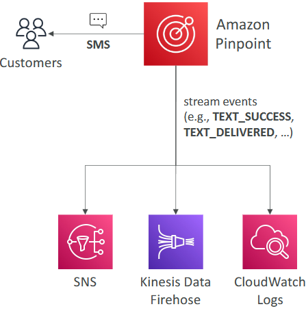

 

### Use Cases for Amazon Pinpoint
* `Marketing Campaigns`: Send bulk marketing emails and transactional SMS messages.
* `Event Tracking`: Track events such as text success, text delivered, and replies, which are delivered to Amazon SNS, Kinesis Data Firehose, and CloudWatch Logs.

### Comparison with Amazon SNS and SES
`Amazon SNS/SES`:
* **Management**: Requires managing each message's audience, content, and delivery schedule within your application.
* **Scalability**: May require more effort and is less scalable for complex campaigns.

`Amazon Pinpoint`:
* **Automation**: Manages message templates, delivery schedules, targeted segments, and full campaigns.
* **Efficiency**: Provides a more scalable and efficient solution for marketing communications.

### Key Points to Remember
* `Comprehensive Service`: Amazon Pinpoint is designed for full-blown marketing communications, offering more features and automation compared to SNS and SES.
* `Event Tracking and Automation`: Easily build automation on top of Amazon Pinpoint using event tracking and integration with other AWS services.

 

 

# Quiz

1. You would like to access desktop applications through a browser. Which AWS service would you use?
   * AppStream 2.0
   * Amazon AppStream 2.0 is a fully managed non-persistent application and desktop streaming service that provides users instant access to their desktop applications from anywhere.

2. Which AWS service can be used to test your application across real desktop browsers and mobile devices?
   * Device Farm.
   * AWS Device Farm is an application testing service that lets you improve the quality of your web and mobile apps by testing them across an extensive range of desktop browsers and real mobile devices; without having to provision and manage any testing infrastructure.

3. Which AWS service is serverless and lets you connect billions of devices to the AWS Cloud? 
   * IoT Core.
   * AWS IoT Core lets you securely connect IoT devices to the AWS Cloud and other devices without the need to provision or manage servers.

4. True or false. CloudEndure Disaster Recovery is used to centrally automate backups across AWS services while AWS Backup is used to quickly and easily recover servers into AWS.
   * False.
   * AWS Backup is a centralized backup service that makes it easy and cost-effective for you to backup your application data across AWS services in the AWS Cloud. 
   * CloudEndure Disaster Recovery minimizes downtime and data loss by providing fast, reliable recovery into AWS of your physical, virtual, and cloud-based servers.

5. A hybrid company would like to provision desktops to their employees so they can access securely both the AWS Cloud and their data centers. Which AWS service can help?
   * WorkSpaces.
   * Amazon WorkSpaces is a fully managed, secure cloud desktop service. 
   * You can use Amazon WorkSpaces to provision either Windows or Linux desktops in just a few minutes and quickly scale to provide thousands of desktops to workers across the globe.

 