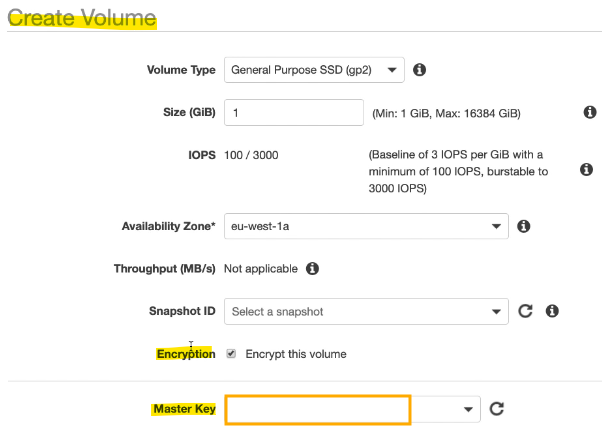
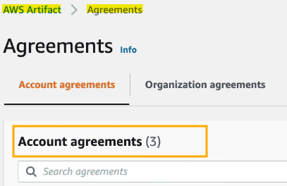
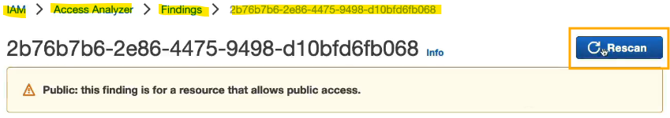

- [Security and Compliance](#security-and-compliance)
  - [Shared Responsibility Model: Reminders \& Examples](#shared-responsibility-model-reminders--examples)
    - [Introduction to Shared Responsibility Model](#introduction-to-shared-responsibility-model)
    - [Shared Controls](#shared-controls)
    - [Detailed Technology Responsibilities](#detailed-technology-responsibilities)
      - [Amazon RDS](#amazon-rds)
      - [Amazon S3](#amazon-s3)
    - [Diagram Overview](#diagram-overview)
  - [DDoS Protection: WAS \& Sheild](#ddos-protection-was--sheild)
    - [Introduction to DDoS Attacks](#introduction-to-ddos-attacks)
    - [AWS Services for DDoS Protection](#aws-services-for-ddos-protection)
    - [Sample Reference Architecture for DDoS Protection](#sample-reference-architecture-for-ddos-protection)
    - [Deep Dive into AWS Shield](#deep-dive-into-aws-shield)
    - [Deep Dive into AWS WAF](#deep-dive-into-aws-waf)
  - [AWS Network Firewall](#aws-network-firewall)
    - [Introduction to AWS Network Firewall](#introduction-to-aws-network-firewall)
    - [How AWS Network Firewall Works](#how-aws-network-firewall-works)
    - [Set Up AWS Network Firewall](#set-up-aws-network-firewall)
  - [AWS Firewall Manager](#aws-firewall-manager)
    - [Introduction to AWS Firewall Manager](#introduction-to-aws-firewall-manager)
    - [Additional Management Capabilities](#additional-management-capabilities)
    - [Application of Rules](#application-of-rules)
    - [Set Up AWS Firewall Manager](#set-up-aws-firewall-manager)
  - [Penetration Testing](#penetration-testing)
    - [Introduction to Penetration Testing](#introduction-to-penetration-testing)
    - [Authorized Services for Penetration Testing](#authorized-services-for-penetration-testing)
    - [Prohibited Activities](#prohibited-activities)
  - [Encryption with KMS \& CloudHSM](#encryption-with-kms--cloudhsm)
    - [Introduction to Encryption](#introduction-to-encryption)
    - [Encryption at Rest](#encryption-at-rest)
    - [Encryption in Transit](#encryption-in-transit)
    - [Encryption Keys](#encryption-keys)
    - [AWS Key Management Service (KMS)](#aws-key-management-service-kms)
    - [AWS CloudHSM](#aws-cloudhsm)
    - [CloudHSM Diagram](#cloudhsm-diagram)
    - [Types of KMS Keys](#types-of-kms-keys)
    - [Enable Encryption for AWS Services](#enable-encryption-for-aws-services)
  - [Encryption with KMS \& CloudHSM Code-along](#encryption-with-kms--cloudhsm-code-along)
    - [Using AWS Managed Keys](#using-aws-managed-keys)
    - [Opt-In Encryption vs. Default Encryption](#opt-in-encryption-vs-default-encryption)
    - [Creating Customer Managed Keys](#creating-customer-managed-keys)
    - [Using Customer Managed Keys](#using-customer-managed-keys)
  - [AWS certificate Manager (ACM)](#aws-certificate-manager-acm)
    - [Introduction to AWS Certificate Manager (ACM)](#introduction-to-aws-certificate-manager-acm)
    - [How ACM Works](#how-acm-works)
    - [Features of ACM](#features-of-acm)
    - [Provision a TLS Certificate with ACM](#provision-a-tls-certificate-with-acm)
  - [Secrets Manager](#secrets-manager)
    - [Introduction to AWS Secrets Manager](#introduction-to-aws-secrets-manager)
    - [Features of AWS Secrets Manager](#features-of-aws-secrets-manager)
    - [Using AWS Secrets Manager](#using-aws-secrets-manager)
    - [Retrieve a Secret](#retrieve-a-secret)
  - [Artifact](#artifact)
    - [Introduction to AWS Artifact](#introduction-to-aws-artifact)
    - [Types of Documents Available](#types-of-documents-available)
    - [Uses of AWS Artifact](#uses-of-aws-artifact)
    - [Access AWS Artifact](#access-aws-artifact)
  - [GuardDuty](#guardduty)
    - [Introduction to Amazon GuardDuty](#introduction-to-amazon-guardduty)
    - [Enabling GuardDuty](#enabling-guardduty)
    - [Data Sources Analysed by GuardDuty](#data-sources-analysed-by-guardduty)
    - [Notifications and Automations](#notifications-and-automations)
    - [Cryptocurrency Attack Protection](#cryptocurrency-attack-protection)
    - [How to Enable Amazon GuardDuty](#how-to-enable-amazon-guardduty)
  - [Inspector](#inspector)
    - [Introduction to Amazon Inspector](#introduction-to-amazon-inspector)
    - [Key Features](#key-features)
    - [Reporting and Integration](#reporting-and-integration)
    - [Evaluation Criteria](#evaluation-criteria)
    - [How to Enable Amazon Inspector](#how-to-enable-amazon-inspector)
  - [Config](#config)
    - [Introduction to AWS Config](#introduction-to-aws-config)
    - [How AWS Config Works](#how-aws-config-works)
    - [Example of AWS Config Usage](#example-of-aws-config-usage)
    - [How to Set Up AWS Config](#how-to-set-up-aws-config)
  - [Macie](#macie)
    - [Introduction to Amazon Macie](#introduction-to-amazon-macie)
    - [How Amazon Macie Works](#how-amazon-macie-works)
    - [Enabling Amazon Macie](#enabling-amazon-macie)
    - [How to Enable Amazon Macie](#how-to-enable-amazon-macie)
  - [Security Hub](#security-hub)
    - [Introduction to AWS Security Hub](#introduction-to-aws-security-hub)
    - [How AWS Security Hub Works](#how-aws-security-hub-works)
    - [Enabling AWS Security Hub](#enabling-aws-security-hub)
    - [Pricing](#pricing)
    - [Step-by-Step Instructions](#step-by-step-instructions)
  - [Amazon Detective](#amazon-detective)
    - [Introduction to Amazon Detective](#introduction-to-amazon-detective)
    - [How Amazon Detective Works](#how-amazon-detective-works)
    - [Integration with Other AWS Services](#integration-with-other-aws-services)
    - [How to Enable Amazon Detective](#how-to-enable-amazon-detective)
  - [AWS Abuse](#aws-abuse)
    - [Introduction to AWS Abuse](#introduction-to-aws-abuse)
    - [Types of Abusive and Prohibited Behaviors](#types-of-abusive-and-prohibited-behaviors)
    - [Reporting Abusive Activities](#reporting-abusive-activities)
  - [Root User Privileges](#root-user-privileges)
    - [Introduction to Root User](#introduction-to-root-user)
    - [Best Practices for Root User](#best-practices-for-root-user)
    - [Actions Only Performed by Root User](#actions-only-performed-by-root-user)
  - [IAM Access Analyser](#iam-access-analyser)
    - [Introduction to IAM Access Analyzer](#introduction-to-iam-access-analyzer)
    - [How IAM Access Analyzer Works](#how-iam-access-analyzer-works)
    - [Example of IAM Access Analyzer Usage](#example-of-iam-access-analyzer-usage)
    - [Step-by-Step Instructions](#step-by-step-instructions-1)
  - [Security \& Compliance Summary](#security--compliance-summary)
- [Quiz](#quiz)

 

 

# Security and Compliance
Source: https://aws.amazon.com/compliance/shared-responsibility-model/

## Shared Responsibility Model: Reminders & Examples

### Introduction to Shared Responsibility Model
`AWS Responsibility`: Security of the cloud.
* **Infrastructure**: Hardware, software, facilities, networking.
* **Managed Services**: AWS manages services like S3, DynamoDB, RDS.

`Customer Responsibility`: Security in the cloud.
* **Usage**: How you use the services provided by AWS.
* **Examples**: Managing operating systems, configuring firewalls, ensuring correct IAM roles, encrypting application data.

 

### Shared Controls
`Patch Management`:
* AWS: Manages patching for services like RDS.
* Customer: Manages patching for services like EC2.

`Configuration Management`: Both AWS and customers share responsibility.

`Awareness and Training`:
* AWS: Trains employees to use facilities correctly.
* Customer: Trains employees to use the cloud correctly.

 

### Detailed Technology Responsibilities

#### Amazon RDS
* `AWS Responsibility`: Manages underlying EC2 instance, automates database and OS patching, ensures instance functionality.
* `Customer Responsibility`: Configures ports, IP security groups, in-database user permissions, public access, parameter groups, and data encryption.

 

#### Amazon S3
* `AWS Responsibility`: Provides unlimited storage, ensures encryption when enabled, separates data between customers, restricts employee access to data.
* `Customer Responsibility`: Configures bucket policies, uses IAM users and roles, enables and manages data encryption.

 

### Diagram Overview
`Customer Responsibilities`:
* Data, applications, platform, identity and access management.
* Operating system, network, and firewall configuration.
* Client-side and server-side encryption, network traffic protection.

`AWS Responsibilities`:
* Software and services.
* Compute, storage, database, and networking.
* Hardware and global infrastructure (regions, AZs, edge locations).

 

 

## DDoS Protection: WAS & Sheild
Source: https://d1.awsstatic.com/whitepapers/Security/DDoS_White_Paper.pdf

### Introduction to DDoS Attacks
* `Distributed Denial-of-Service` attack **overwhelms** your **application** server with **requests**, making it **inaccessible** to **normal users**.

 

 

### AWS Services for DDoS Protection

`AWS Shield Standard`:
* **Free** for all customers.
* **Basic protection** against DDoS attacks for websites and applications.

`AWS Shield Advanced`:
* Approximately **$3000** per month per organisation.
* **24/7 protection** against sophisticated DDoS attacks on EC2, ELB, CloudFront, Global Accelerator, and Route 53.
* **Additional Benefits**: Access to AWS response team and cost protection during attacks.

 

`AWS WAF` (Web Application Firewall):
* **Filters specific requests** based on rules to protect web applications from common web exploits (e.g., SQL injection, Cross-Site Scripting).
* Can be deployed on Application Load Balancer, API Gateway, and CloudFront.

`CloudFront and Route 53`:
* Provide protection using the **global edge network**.
* **Combined with Shield**: Offer attack mitigation at edge locations.

`Auto Scaling`:
* **Automatically scales** your infrastructure to handle increased demand during an attack.

### Sample Reference Architecture for DDoS Protection
* `Users`: Routed through DNS on Route 53, protected by Shield.
* `CloudFront Distribution`: Caches content at the edge, protected by Shield.
* `Web Application Firewall` (WAF): Filters and protects from attacks.
* `Load Balancer`: Scales to handle increased demand.
* `EC2 Instances`: In an auto-scaling group to scale with demand.

 

 

### Deep Dive into AWS Shield
`Shield Standard`:
* **Free Service**: Activated for every AWS customer.
* **Protection**: Against common DDoS attacks (e.g., SYN/UDP Reflection Floods, Reflection attacks, layer 3 and layer 4 attacks).

`Shield Advanced`:
* **Optional Service**: Costs about $3000 per month.
* **Protection**: Against sophisticated attacks on EC2, ELB, CloudFront, Global Accelerator, and Route 53.
* **Response Team**: Access to AWS response team during attacks.
* **Cost Protection**: AWS covers fees incurred during attacks.

### Deep Dive into AWS WAF
* Protects web applications from common** web exploits** (layer 7 attacks).
* **Deployment**: On Application Load Balancer, API Gateway, and CloudFront.

`Web ACL` (Access Control Lists):
* **Rules**: Filter based on IP addresses, HTTP headers, body, strings.
* **Protection**: Against SQL injection, Cross-Site Scripting.
* **Size Constraints**: Ensure requests are not too large.
* **Geo-Match**: Block certain countries.
* **Rate-Based Rules**: Limit the number of requests per second to protect against DDoS attacks.

 

 

## AWS Network Firewall

### Introduction to AWS Network Firewall
* Protects your entire VPC from layer three to layer seven threats in any direction.
* Benefits: Provides comprehensive protection for all traffic entering and leaving your VPC.

### How AWS Network Firewall Works
* `Traffic Inspection`: Inspects traffic from and to your VPC, including:
  * Outbound traffic to the internet.
  * Inbound traffic from the internet.
  * Traffic to and from Direct Connect and site-to-site VPN.
  * Traffic between peered VPCs.
* `Protection Level`: Operates at the VPC level, offering better protection than network ACLs, which operate at the subnet level.

 

 

### Set Up AWS Network Firewall
`Step 1`:
1. Navigate to the `VPC` section in the `AWS Management` Console.
2. Click on "Network Firewall" and then "Create Firewall."
3. Provide a **name** and **description** for the firewall. 
   * Select the VPC you want to protect.
4. Define the rules and policies for the firewall to inspect and filter traffic
5. Attach the firewall to the subnets within your VPC that you want to protect.

`Step 2: Define Firewall Rules`
1. Create rules to **allow or deny** specific types of traffic.
2. Define rules for different layers of traffic, from IP addresses (layer 3) to application-specific rules (layer 7).

`Step 3: Monitor and Manage Firewall`
1. Use AWS CloudWatch to monitor traffic and firewall activity.
2. Regularly update firewall rules to adapt to new threats and changes in your network.

 

 

## AWS Firewall Manager

### Introduction to AWS Firewall Manager
* Allows you to **manage all security rules** across **all accounts** in your AWS Organisation from a **central place**.
* `Key Feature`: Centralised management of VPC Security Groups, WAF rules, AWS Shield Advanced rules, AWS Network Firewall, and other services.

### Additional Management Capabilities
* `WAF Rules`: Manage Web Application Firewall rules.
* `AWS Shield Advanced Rules`: Manage advanced DDoS protection rules.
* `AWS Network Firewall`: Manage network firewall rules.

### Application of Rules
* `Current and Future Accounts`: Rules applied in **Firewall Manager** are **enforced across all** current and future **accounts**.
* `Resource Creation`: Rules are **applied** to **all resources** as they are created in these accounts, ensuring consistent security management.

### Set Up AWS Firewall Manager
`Step 1`: 
1. Navigate to the AWS Firewall Manager section.
2. Ensure your AWS Organization is set up and all accounts are part of it.
3. Set up Firewall Manager to manage security rules across your organization.

`Step 2: Define Security Policies`
1. Define policies for VPC Security Groups, WAF rules, AWS Shield Advanced rules, and AWS Network Firewall.
2. Apply these policies to all accounts within your AWS Organisation.

`Step 3: Monitor and Manage`
1. Use Firewall Manager to monitor compliance with the defined security policies.
2. Regularly update security policies to adapt to new threats and changes in your network.

 

 

## Penetration Testing

### Introduction to Penetration Testing
* Penetration testing involves attacking your own infrastructure to test its security.

### Authorized Services for Penetration Testing
Customers can perform penetration testing on the following AWS services without prior approval:

* Amazon EC2 instances
* NAT Gateways and Elastic Load Balancers
* Amazon RDS
* CloudFront
* Aurora
* API Gateways
* Lambda and Lambda Edge functions
* Lightsail resources
* Elastic Beanstalk environments

### Prohibited Activities
* `DNS Zone Walking`: Not allowed via Amazon Route 53 Hosted Zone.
* `Distributed Attacks`: DoS, DDoS, Simulated DoS, and Simulated DDoS attacks are prohibited.
* `Port Flooding`: Not allowed.
* `Protocol Flooding`: Not allowed.
* `Request Flooding`: Not allowed.
* `Other Activities`: For any other events, contact the AWS security team for approval.

 

 

## Encryption with KMS & CloudHSM
Source: https://aws.amazon.com/security/penetration-testing/

### Introduction to Encryption
Types of Encryption:

* `Encryption at Rest`: Data stored or archived on a physical device (e.g., hard drive, RDS instance, S3 bucket).
* `Encryption in Transit` (in motion): Data encrypted while being transferred from one place to another (e.g., from on-premises to AWS, between EC2 and DynamoDB).

 

### Encryption at Rest
* Data stored on a physical device.
  * **Examples**: EFS network drive, Amazon S3, RDS instances, S3 Glacier Deep Archive.

### Encryption in Transit
* Data encrypted while being moved.
  * **Examples**: Transferring data from on-premises to AWS, between EC2 and DynamoDB, from EFS to Amazon S3.

### Encryption Keys
* Used to encrypt and decrypt data.
* Data is protected as only those with access to the keys can decrypt and read it.

 

### AWS Key Management Service (KMS)

* `Function`: Central service for managing encryption keys.
* `Key Management`: AWS manages the keys, and customers define who can access them.
* `Opt-In Encryption`: Customers can choose to encrypt EBS volumes, S3 buckets, Redshift databases, RDS instances, and EFS files using KMS.
* `Automatic Encryption`: Some services like CloudTrail Logs, S3 Glacier, and Storage Gateway have automatic encryption.

 

### AWS CloudHSM

* Provides dedicated hardware for encryption.
* `Key Management`: Customers manage their own encryption keys.
* `Security`: HSM devices are tamper-resistant and comply with FIPS 140-2 Level 3.

 

### CloudHSM Diagram

 

### Types of KMS Keys
`Customer-Managed Keys`:
* Created, managed, and used by the customer.
* Features: Enable/disable keys, key rotation policy, bring your own key.

`AWS-Managed Keys`:
* Created, managed, and used by AWS on behalf of the customer.
* Identified by key names like aws/s3 or aws/ebs.

`AWS-Owned Keys`:
* Managed by AWS and used in multiple accounts.
* Customers cannot view these keys.

`CloudHSM Keys`:
* Generated from the customer's CloudHSM hardware device.
* Cryptographic operations performed within the CloudHSM cluster.

 

### Enable Encryption for AWS Services
`Step 1`

EBS Volumes:
1. Go to the EC2 console.
2. Select the EBS volume and choose to encrypt it using KMS.

S3 Buckets:
1. Go to the S3 console.
2. Enable server-side encryption for the bucket.

Redshift Databases:
1. Go to the Redshift console.
2. Enable encryption for the database.

RDS Instances:
1. Go to the RDS console.
2. Enable encryption for the instance.

EFS Files:
1. Go to the EFS console.
2. Enable encryption for the file system.

`Step 2: Use AWS CloudHSM`
Provision HSM:
1. Go to the CloudHSM console.
2. Create and configure an HSM cluster.

Manage Keys:
1. Use the CloudHSM client to manage encryption keys.
2. Ensure the connection between the client and CloudHSM is encrypted.

 

 

## Encryption with KMS & CloudHSM Code-along

### Using AWS Managed Keys
* **Example**: AWS/EBS key for encrypting EBS volumes.

Steps:
1. Go to the `EC2` console and create a **volume**.

2. Choose the **default AWS master key** for encryption or use your own key if available.

3. Click on "Create Volume" to complete the process.

 

### Opt-In Encryption vs. Default Encryption
* `Opt-In Encryption`: Services like EBS volumes require you to **opt-in for encryption** using KMS.
* `Default Encryption`: Services like CloudTrail and S3 Glacier have encryption **enabled by default**.

 

### Creating Customer Managed Keys
Steps:
1. Go to the `KMS` console and create a **new key** (symmetric or asymmetric).

2. Choose the **origin** (KMS, external, or custom key store).

3. Provide an **alias** for the key (e.g., demokey).

4. Define key **administrators** and **users**.
5. Review the **key policy** and finish the creation process.

6. Enable **key rotation** to change the key **annually** for enhanced security.

 

### Using Customer Managed Keys
* **Example**: Encrypting an EBS volume with a customer managed key.

Steps:
1. Go to the `EC2` console and create a **volume**.

2. Choose the **customer managed key** (e.g., demokey) for encryption.

3. Click on "Create Volume" to complete the process.

 

 

## AWS certificate Manager (ACM)

### Introduction to AWS Certificate Manager (ACM)
* Easily provision, manage, and **deploy SSL/TLS certificates**.
* `Use Case`: Provides in-flight encryption for websites by offering **HTTPS endpoints**.

 

### How ACM Works
Example:

* `Application Load Balancer`: Connected to an auto-scaling group with EC2 instances via HTTP.
* `HTTPS Endpoint`: ACM provisions and maintains TLS certificates, which are loaded onto the application load balancer to offer HTTPS endpoints for clients, ensuring in-flight encryption over the public web.

 

 

### Features of ACM
* `Public and Private TLS Certificates`: Supports both types.
* `Cost`: Free of charge for public TLS certificates.
* `Automatic Renewal`: Automatically renews TLS certificates, ensuring continuous protection.
* `Integration`: Loads TLS certificates onto various AWS services, including:
  * Elastic Load Balancer
  * CloudFront distributions
  * API Gateway

 

### Provision a TLS Certificate with ACM
`Step 1`: 
1. Navigate to the AWS Certificate Manager section in the AWS Management Console.
2. Click on "Request a certificate."
3. Select either a public or private TLS certificate.
4. Validate your domain ownership through DNS or email validation.
5. Review the details and confirm the request.

`Step 2: Attach the Certificate to an Application Load Balancer`
1. Navigate to the EC2 section in the AWS Management Console.
2. Choose the application load balancer you want to secure.
3. Go to the "Listeners" tab and add an HTTPS listener.
4. Choose the TLS certificate provisioned by ACM.
5. Save the configuration to enable HTTPS for your load balancer.

`Step 3: Verify HTTPS Endpoint`
1. Open your web browser and navigate to your website's URL using HTTPS.
2. Verify that the TLS certificate is active and the connection is secure.

 

 

## Secrets Manager

### Introduction to AWS Secrets Manager
* AWS Secrets Manager is designed for **storing** and **managing secrets**, such as database credentials, API keys, and other sensitive information.
* `Key Feature`: Allows you to **force the rotation of secrets**, ensuring they change every specified number of days (e.g., every 90 days).

### Features of AWS Secrets Manager
* `Automated Secret Rotation`: Secrets can be automatically rotated using AWS Lambda.
* `Integration with Amazon RDS`: Automatically create and manage passwords for Amazon RDS databases.
* `Encryption`: Secrets are encrypted using AWS Key Management Service (KMS).

### Using AWS Secrets Manager
Store a New Secret:
1. Navigate to the `AWS Secrets Manager` section in the `AWS Management` Console.

2. Click on "Store a new secret."
3. Select the **type** of secret (e.g., database credentials for RDS, Redshift, or other types of secrets).

4. Provide the necessary **information**, such as username and password.

5. Choose **how** the secret will be **encrypted** using KMS.

6. Provide a **name** for the secret (e.g., "myproductionapplicationpassword").

7. Enable **automatic rotation** and specify the **rotation interval** (e.g., every 30 days). Choose the Lambda function for rotation.

8. Review the details and store the secret.

 

### Retrieve a Secret
1. Go to the `AWS Secrets Manager` section in the `AWS Management` Console.
2. Choose the secret you want to retrieve.
3. Click on "Retrieve secret value" to view the secret.

 

 

## Artifact
(not really a service).

### Introduction to AWS Artifact
* AWS Artifact is a portal that provides customers with on-demand access to compliance reports and AWS agreements.
* `Key Feature`: Allows you to download security and compliance documents from third-party auditors.

 

### Types of Documents Available
`Artifact Reports`: Security and compliance documents, such as:
* ISO certifications
* Payment Card Industry (PCI) reports
* SOC reports

`Artifact Agreements`: Allows you to review, accept, and track the status of AWS agreements, such as:
* Business Associate Agreement (BAA)
* Health Insurance Portability and Accountability Act (HIPAA) agreements

 

### Uses of AWS Artifact
* `Internal Audits`: Supports internal audit capabilities within your company.
* `Compliance Needs`: Demonstrates compliance when using the AWS cloud.

 

### Access AWS Artifact
`Step 1`: 
1. Go to the `AWS Management` Console and select `AWS Artifact`.

 

`Step 2`: View and Download Reports
1. Click on "View Reports" to see the available compliance reports.
2. Select the report you need, accept the NDA, and download the report for internal use.

 

`Step 3`: View and Accept Agreements
1. Click on "View Agreements" to see the available AWS agreements.
2. Select the agreement you need, accept the terms, and download the agreement.

 

 

## GuardDuty

### Introduction to Amazon GuardDuty
* Amazon GuardDuty provides intelligent **threat discovery** to **protect** your AWS **accounts**.
* `How It Works`: Uses machine learning **algorithms**, anomaly **detection**, and third-party data to **identify threats**.

### Enabling GuardDuty
* `One-Click Enablement`: Easily enable GuardDuty with a single click.
* `Trial Period`: 30-day free trial available.
* `No Software Installation`: No need to install any software.

### Data Sources Analysed by GuardDuty
* `CloudTrail Event Logs`: Monitors for unusual API calls and unauthorised deployments.
* `Management Events`: E.g., create VPC Subnet event.
* `Data Events`: E.g., get object, list objects, delete objects.
* `VPC Flow Logs`: Detects unusual internet traffic and IP addresses.
* `DNS Logs`: Identifies EC2 instances sending encoded data within DNS queries, indicating potential compromise.
* `Optional Features`: Analyses additional data sources such as EKS audit logs, RDS and Aurora login events, EBS, Lambda, and S3 data events.

 

 

### Notifications and Automations
* `EventBridge Rules`: Set up rules to be notified automatically in case of findings.
* `Automation Targets`: Rules can trigger AWS Lambda functions or send notifications via SNS topics.

### Cryptocurrency Attack Protection
* `Dedicated Findings`: GuardDuty has specific findings to protect against cryptocurrency attacks.

 

### How to Enable Amazon GuardDuty
`Step 1`: 
1. Navigate to the Amazon `GuardDuty` section in the `AWS Management` Console.
2. Click on "Enable GuardDuty" to start the service.
3. Utilise the 30-day free trial to evaluate the service.

`Step 2`: Configure Data Sources
1. Ensure **CloudTrail logs** are **enabled** to monitor API calls and deployments.
2. Enable **VPC flow logs** to detect unusual internet traffic.
3. Enable **DNS logs** to monitor EC2 instances for encoded data within DNS queries.
4. Enable **additional data sources** such as EKS audit logs, RDS and Aurora login events, EBS, Lambda, and S3 data events.

`Step 3`: Set Up EventBridge Rules
1. Navigate to the Amazon `EventBridge` section in the `AWS Management` Console.
2. Create a rule to **trigger notifications** or **automations** based on GuardDuty findings.
3. **Specify targets** such as AWS Lambda functions or SNS topics for the rule.

 

 

## Inspector

### Introduction to Amazon Inspector
* Amazon Inspector is a service that allows you to run automated security assessments on your infrastructure.

### Key Features
`EC2 Instances`:
* Uses the Systems Manager agent to assess the security of EC2 instances.
* Analyzes unintended network accessibility and operating system vulnerabilities.
* Continuous assessment.

`Container Images`: Analyses Docker images pushed to Amazon ECR for known vulnerabilities.

`Lambda Functions`:
* Analyses Lambda functions for software vulnerabilities in the function code and package dependencies.
* Assessment occurs as functions are deployed.

 

 

### Reporting and Integration
* `AWS Security Hub`: Reports findings to the AWS Security Hub for centralized visibility.
* `Amazon EventBridge`: Sends findings and events to Amazon EventBridge for automation.

 

 

### Evaluation Criteria
* `Continuous Scanning`: Continuously scans EC2 instances, container images on Amazon ECR, and Lambda functions.
* `Vulnerability Database`: Uses a database of vulnerabilities (CVE) to identify package vulnerabilities.
* `Network Reachability`: Assesses network reachability on Amazon EC2.
* `Automatic Reassessment`: Automatically reassesses infrastructure when the CVE database is updated.
* `Risk Score`: Assigns a risk score to vulnerabilities for prioritisation.

 

### How to Enable Amazon Inspector
`Step 1`: 
1. Navigate to the Amazon Inspector section in the AWS Management Console.
2. Define the EC2 instances, container images, and Lambda functions to be assessed.
3. Create assessment templates specifying the rules and criteria for the assessments.

`Step 2`: Run Security Assessments
1. Initiate the security assessment for the defined targets.
2. Monitor the progress of the assessment in the Amazon Inspector console.

`Step 3`: Review Findings
1. View the findings in the Amazon Inspector console.
2. Review the risk scores assigned to vulnerabilities for prioritization.
3. Send findings to AWS Security Hub for centralized visibility.
4. Use Amazon EventBridge to automate responses to findings.

 

 

## Config

### Introduction to AWS Config
* AWS Config helps with **auditing** and **recording** the **compliance of your resources** by **tracking** their **configuration** and **changes** over time.
* `Key Feature`: Provides a list of all changes made to your AWS resources.

 

### How AWS Config Works
* `Configuration Data`: Stored in Amazon S3, can be analyzed by Athena or recovered.
* `Questions Solved by Config`:
  * Is there unrestricted SSH access to my security groups?
  * Do buckets have any public access?
  * Has my ALB configuration changed over time?
* `Alerts`: Receive alerts through SNS notifications for any changes made to your infrastructure.
* `Per-Region Service`: Config is a per-region service but can aggregate results across multiple accounts and regions.

 

### Example of AWS Config Usage
* `Compliance Over Time`: View the compliance status of a resource (e.g., security group) over time.

* `Configuration Changes`: Track how the configuration of a resource has changed.

* `Change Tracking`: View who made changes to resources based on CloudTrail logs.

 

### How to Set Up AWS Config
`Step 1`:
1. Navigate to the AWS `Config` section in the `AWS Management` Console.
2. Select the **type** of resources you want to record (e.g., all resources in the region).

3. Create a **bucket** to store the configuration data.

> Optionally, set up an SNS topic to receive notifications for configuration changes. This has been disabled in the task but it would look like this:

4. AWS will create a **Config service-linked role**.

 

`Step 2`: Define Config Rules
1. Choose **rules** to apply to your account (e.g., restricted-ssh, s3-bucket-logging-enabled).

2. Apply the selected rules to check the compliance of your resources.

 

`Step 3`: Monitor Compliance
1. See the **inventory** of all your AWS resources.

2. Identify **noncompliant resources** based on the applied Config rules.

3. Make necessary **changes** to resources to **ensure compliance** by clicking on the rule.

 

`Step 4`: Track Changes
1. `AWS Config` > `Resources` > search for your security group that is not compliant > click on it. 

2. View the **configuration timeline** of a resource to see changes over time.

3. Check the **compliance timeline** to see when a resource became compliant or noncompliant.

4. Use **CloudTrail logs** to see who made changes to resources.

 

 

## Macie 

### Introduction to Amazon Macie
* Amazon Macie is a fully managed **data security** and **data privacy** **service** that uses machine learning and pattern matching to discover and protect sensitive data in AWS.
* `Key Feature`: **Alerts** you about **sensitive data**, such as personally identifiable information (PII).

### How Amazon Macie Works
* `Data Analysis`: Analyses data in your S3 buckets to discover and classify PII.
* `Notifications`: Notifies you of discoveries through EventBridge.
* `Integrations`: Can integrate with SNS topics, Lambda functions, and other services for further processing and automation.

### Enabling Amazon Macie
* `Simple Setup`: Enable Macie with just one click.
* `Specify S3 Buckets`: Select the S3 buckets you want Macie to analyze for sensitive data.

 

 

### How to Enable Amazon Macie
`Step 1`: 
1. Navigate to the Amazon `Macie` section in the `AWS Management` Console.
2. Click on "Enable Macie" to start the service.

`Step 2`: Specify S3 Buckets
1. Choose the `S3 buckets` you want Macie to analyse for sensitive data.
2. Save your configuration to start the analysis.

`Step 3`: Monitor and Respond to Alerts
1. Check the `Macie` console for alerts about sensitive data discoveries.
2. Set up **integrations** with SNS topics, Lambda functions, or other services to automate responses to alerts.

 

 

## Security Hub

### Introduction to AWS Security Hub
* AWS Security Hub is a central security tool used to manage security across multiple AWS accounts and automate security checks.
* `Key Feature`: Provides an integrated dashboard to show the current security and compliance status, allowing for quick actions.

### How AWS Security Hub Works
* `Aggregation`: Aggregates alerts from various AWS services and partner tools, including:
  * AWS Config
  * GuardDuty
  * Inspector
  * Macie
  * IAM Access Analyzer
  * AWS Systems Manager
  * AWS Firewall Manager
  * AWS Health
  * AWS Partner Solutions
* `Multi-Account Coverage`: Can cover multiple accounts and gather findings from various services.
* `Automatic Checks`: Performs automatic security checks and displays findings in the dashboard.
* `EventBridge Integration`: Generates events in EventBridge for security issues.
* `Amazon Detective`: Used to investigate the source of security issues.

 

 

### Enabling AWS Security Hub
Prerequisite: Must enable AWS Config service.

Setup:
1. Ensure AWS Config is enabled.
2. Select the security standards to adhere to.
3. Configure integrations based on enabled services.
4. Click on "Enable Security Hub" to start using the service.

 

### Pricing
* `Per Check`: First 1000 checks have a specific cost, with additional costs for more checks.
* `Ingestion Events`: First 10,000 events are free, with additional costs per finding.
* `30-Day Trial`: A 30-day free trial is available for Security Hub.

 

 

### Step-by-Step Instructions
`Step 1`: Enable AWS Config
1. Navigate to the AWS `Config` section in the `AWS Management` Console.
2. Follow the prompts to enable AWS `Config`.

 

`Step 2`: Enable AWS Security Hub
1. Navigate to the AWS `Security Hub` section in the `AWS Management` Console.
2. Click on "Enable Security Hub."

3. Choose the security standards you want to adhere to.
4. Set up integrations with other AWS services and partner tools.
5. Confirm the settings and enable Security Hub.

 

`Step 3`: Monitor and Respond to Findings
1. Check the `Security Hub` dashboard for security and compliance findings.
2. Use `Amazon Detective` to investigate the source of security issues.
3. Respond to alerts and findings as needed.

 

 

## Amazon Detective

### Introduction to Amazon Detective
* Amazon Detective helps analyze, investigate, and quickly identify the root cause of security issues or suspicious activities.
* `Key Feature`: Uses machine learning and graphs to provide detailed visualisations and context for security findings.

 

### How Amazon Detective Works
* `Data Collection`: Automatically collects and processes events from:
  * VPC Flow Logs
  * CloudTrail trails
  * GuardDuty
* `Unified View`: Creates a unified view of security data to help identify the root cause of issues.
* `Visualisations`: Provides visualizations with details and context to aid in the investigation.

### Integration with Other AWS Services
* `GuardDuty`: Identifies potential security issues.
* `Macie`: Discovers and protects sensitive data.
* `Security Hub`: Manages security across multiple AWS accounts and aggregates alerts.

  

### How to Enable Amazon Detective
`Step 1`: 
1. Navigate to the `Amazon Detective` section in the `AWS Management` Console.
2. Click on "Enable Detective" to start the service.

`Step 2`: Configure Data Sources
1. Ensure **VPC Flow Logs** are **enabled** for your VPCs.
2. Ensure **CloudTrail** is **enabled** and configured to log events.
3. Ensure **GuardDuty** is **enabled** and configured to detect potential security issues.

`Step 3`: Investigate Security Issues
1. Check the **Detective console** for security findings and visualizations.
2. Use the provided visualisations and context to analyse and investigate the root cause of security issues.
3. Respond to security findings and take necessary actions to mitigate issues.

 

 

## AWS Abuse

### Introduction to AWS Abuse
* AWS Abuse is a mechanism to **report resources** in AWS that are suspected of being used for **abusive** or **illegal purposes**.

### Types of Abusive and Prohibited Behaviors
* `Spam`: Receiving undesired emails from IPs owned by AWS, or websites and forums spammed by AWS resources.
* `Port Scanning`: Unauthorized port scanning attempts from AWS resources.
* `DDoS Attack`: Distributed Denial-of-Service attacks originating from AWS resources.
* `Intrusion Attempts`: Unauthorized attempts to log into your resources.
* `Illegal Content`: Hosting questionable or copyrighted content on AWS.
* `Malware Distribution`: Hosting or distributing malware on AWS.

### Reporting Abusive Activities
* `Contact AWS Abuse Team`: If you suspect any abusive activities, you should report them to the AWS Abuse team.

Methods to Report:
* Online Form: Use the online form available on the AWS website.
* Email: Send an email to abuse@amazonaws.com.

 

 

## Root User Privileges

### Introduction to Root User
* The root user is the account owner and has complete access to all AWS services and resources.
* `Key Point`: The root user can perform actions that even the most privileged created user cannot do.

### Best Practices for Root User
* `Lock Away Account`: Do not use the root account for everyday tasks, even administrative tasks.
* `Create Admin User`: Create a specific admin user for administrative tasks.

### Actions Only Performed by Root User
`Account Settings`:
* Change account name, email address, root user password, and root user access keys.
* View certain tax invoices.
* Close your account.

`IAM User Permissions`:
* Restore IAM user permissions.

`AWS Support Plan`:
* Change or cancel your AWS Support plan.

`Reserved Instance Marketplace`:
* Register as a seller in the Reserved Instance Marketplace.
* Use Case: If you buy a Reserved Instance for three years but need to sell it after two years, only the root user can register as a seller.

`Amazon S3`:
* Configure an S3 bucket to enable MFA.
* Edit or delete an S3 bucket policy with an invalid VPC ID or VPC endpoint ID.

`GovCloud`:
* Sign up for GovCloud.

 

 

## IAM Access Analyser

### Introduction to IAM Access Analyzer
* IAM Access Analyzer is a service **within the IAM console** used to **identify** which **resources** are **shared externally**.
* `Key Resources`: Analyzes S3 buckets, IAM Roles, KMS Keys, Lambda Functions and Layers, SQS Queues, and Secrets Manager Secrets.

### How IAM Access Analyzer Works
* `Resource Policies`: Identifies resources with attached policies or shared with other accounts.
* `Security Risk`: Helps mitigate security risks by identifying resources accessible by external sources.
* `Zone of Trust`: Define a zone of trust corresponding to your AWS accounts or organization. Any access outside this zone is reported as findings.

### Example of IAM Access Analyzer Usage
* `S3 Buckets`: Can be shared with roles, users, accounts, external clients by IP, or VPC endpoint.
* `Findings`: Resources shared outside the zone of trust are flagged as findings.

 

 

### Step-by-Step Instructions
`Step 1`: Set Up IAM Access Analyzer
1. Navigate to the `IAM` section in the `AWS Management` Console.
2. On the left-hand side, select `Access Analyzer` and create a new analyzer.

3. Provide a **name** for the analyzer (e.g., console analyzer).
4. Set the **zone of trust** to the current account or organization.

5. Create the analyser, which will generate a service-linked role.

 

`Step 2`: Review Findings
1. Check the **findings** reported by the analyzer.

2. Determine if the access is intended or a security risk.

 

`Step 3`: Resolve Findings
1. Click on the **finding** to access the resource directly.

2. Edit the **resource policy** to restrict access if necessary.

3. Rescan the resource to update the findings.

4. Status changes to "Resolved".

 

`Step 4`: Archive Findings
1. If the access is intended, **archive** the finding.

2. Set up archive rules to automatically archive similar findings in the future.
   * `Archive Rules` > `Create archive rule`.

 

 

## Security & Compliance Summary
* `Shared Responsibility on AWS`.
* `Shield`: Automatic DDoS Protection + 24/7 support for advanced.
* `WAF`: Firewall to filter incoming requests based on rules.
* `KMS`: Encryption keys managed by AWS.
* `CloudHSM`: Hardware encryption, we manage encryption keys.
* `AWS Certificate Manager`: provision, manage, and deploy SSL/TLS Certificates.
* `Artifact`: Get access to compliance reports such as PCI, ISO, etc…
* `GuardDuty`: Find malicious behavior with VPC, DNS & CloudTrail Logs.
* `Inspector`: find software vulnerabilities in EC2, ECR Images, and Lambda functions.
* `Network Firewall`: Protect VPC against network attacks.

 

 

# Quiz

1. Data sitting on an RDS instance would be referred to as?
   * "Data at rest".
   * Data at rest means data stored or archived on a device.

2. According to the Shared Responsibility Model, who is responsible for firewall and network configuration for EC2 Instances?
   * The customer.
   * The customer is responsible for firewall and network configuration. Customers are responsible for "Security IN the Cloud". 
   * It also includes server-side encryption, client-side data protection, customer data protection, etc

3. Which of the following services can you use to discover and protect your sensitive data in AWS?
   * Macie.
   * Amazon Macie is a security service that uses machine learning to automatically discover, classify, and protect sensitive data in AWS, such as personally identifiable information (PII) or intellectual property.

4. Which AWS service lets you quickly find the root of potential security issues to take faster actions?
   * Detective.
   * Amazon Detective makes it easy to analyze, investigate, and quickly identify the root cause of potential security issues or suspicious activities.

5. A company would like to protect its web applications from common web exploits that may affect availability, compromise security, or consume excessive resources. Which AWS service should they use?
   * Web Application Firewall (WAF).
   * AWS WAF is a web application firewall that helps protect your web applications or APIs against common web exploits that may affect availability, compromise security, or consume excessive resources.

6. Where can you find on-demand access to AWS compliance documentation and AWS agreements?
   * Artifact.
   * AWS Artifact is your go-to, central resource for compliance-related information that matters to you.

7. True or false. You can perform any kind of penetration testing on any AWS service without prior approval.
   * False.
   * Penetration Testing is allowed without prior approval on 8 services. DDoS, port flooding and protocol flooding are examples of prohibited activities.

8. You want to record configurations and changes over time. Which service allows you to do this?
   * Config.
   * AWS Config is a service that enables you to assess, audit, and evaluate the configurations of your AWS resources.

9. A company would like to secure network communications using SSL & TLS certificates. Which AWS service can it use?
    * Certiificate Manager (AMC). 
    * AWS Certificate Manager is a service that lets you easily provision, manage, and deploy public and private Secure Sockets Layer/Transport Layer Security (SSL/TLS) certificates for use with AWS services and your internal connected resources.

10. According to the Shared Responsibility Model, who is responsible for Patch Management?
    * AWS and the customer. 
    * AWS is responsible for patching and fixing flaws within the infrastructure, but customers are responsible for patching their guest OS and applications. 
    * Shared Controls also includes Configuration Management, and Awareness and Training.

11. You want to centrally automate security checks across several AWS accounts. Which AWS service can you use?
    * Security Hub.
    * AWS Security Hub provides you with a comprehensive view of your security state within AWS and your compliance with security standards and best practices.

12. Which of the following services is managed by AWS and is used to manage encryption keys? CloudHSM, KMS, AWS Secrets Manager, or IAM.
    * Key Management Service.
    * AWS KMS is a managed service that enables you to easily create and control the keys used for cryptographic operations. 
    * It is managed by AWS.

13. A company would like to automate security on EC2 instances to assess security and vulnerabilities in these instances. Which AWS service should it use?
    * Inspector.
    * Amazon Inspector is an automated security assessment service that helps improve the security and compliance of applications deployed on AWS. 
    * It helps you test the network accessibility of your Amazon EC2 instances and the security state of your applications running on the instances.

14. Which of the following actions does NOT require the root user? 'Close your AWS account', 'Change your AWS Support plan', Register as a seller in the reserved Instance Marketplace', or 'Access the billing dashboard'.
    * Access the billinf dashboard. 
    * This is an action that does not require the root user. 
    * By default, only the root user can access the billing dashboard, but you can attach a policy to an IAM user for it to access the billing dashboard.

15. According to the Shared Responsibility Model, who is responsible for protecting hardware?
    * AWS.
    * AWS is responsible for protecting hardware. 
    * AWS is responsible for "Security OF the Cloud". 
    * AWS is also responsible for the infrastructure that runs all services in the AWS Cloud, etc.

16. Which AWS service's ONLY role is to safeguard running applications from DDoS attacks?
    * Shield. 
    * Shield is only used to safeguard running applications from DDoS attacks.

17. Which service is a threat detection service that continuously monitors for malicious activity and unauthorized behavior to protect your AWS accounts and workloads?
    * GuardDuty. 
    * Amazon GuardDuty is a threat detection service that continuously monitors for malicious activity and unauthorized behavior to protect your AWS accounts and workloads.

18. Which of the following options is NOT a situation where you should contact the AWS Abuse team? 'DDoS attack from AWS-owned IP addresses', 'Spam frpm AWS-owned IP addresses or AWS resources', 'hosting objectionable or copyrighted content on AWS', or 'Losing your MFA device'.
    * 'Losing your MFA device'.
    * This is not a situation where you should contact the AWS Abuse team. 
    * The situations where you should contact the AWS Abuse team are: Spam, Port scanning, DoS or DDoS attacks, Intrusion attempts, Hosting objectionable or copyrighted content, Distributing malware.

 

