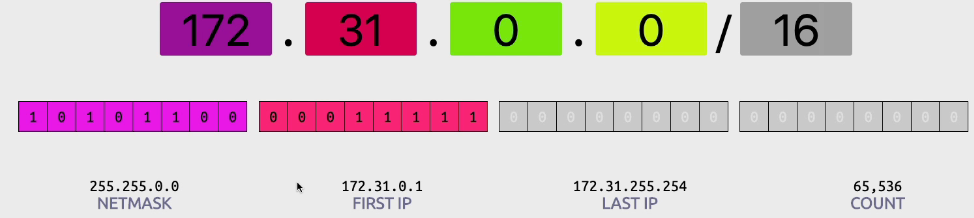
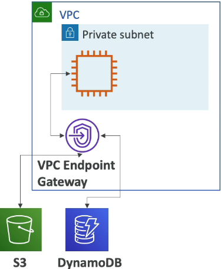

- [VPC and Networking](#vpc-and-networking)
  - [Introduction to VPC](#introduction-to-vpc)
    - [Key Concepts to Know](#key-concepts-to-know)
  - [IP Addresses in AWS](#ip-addresses-in-aws)
    - [Introduction to IP Addresses](#introduction-to-ip-addresses)
    - [Public IPv4 Addresses](#public-ipv4-addresses)
    - [Private IPv4 Addresses](#private-ipv4-addresses)
    - [IPv6 Protocol](#ipv6-protocol)
  - [VPC, Subnet, Internet Gateway \& NAT Gateways](#vpc-subnet-internet-gateway--nat-gateways)
    - [Introduction to VPC](#introduction-to-vpc-1)
    - [Key Components of a VPC](#key-components-of-a-vpc)
    - [Public and Private Subnets](#public-and-private-subnets)
    - [CIDR Range](#cidr-range)
      - [Architecture](#architecture)
    - [VPC Diagram](#vpc-diagram)
    - [Internet Gateway](#internet-gateway)
    - [NAT Gateway](#nat-gateway)
      - [Architecture](#architecture-1)
    - [Default VPC](#default-vpc)
    - [Step-by-Step Instructions](#step-by-step-instructions)
  - [Security Groups \& Network Access Control List (NACL)](#security-groups--network-access-control-list-nacl)
    - [Introduction to Network Security in VPC](#introduction-to-network-security-in-vpc)
    - [Network ACL (NACL)](#network-acl-nacl)
    - [Security Groups](#security-groups)
    - [Network ACLs vs Security Groups](#network-acls-vs-security-groups)
    - [Key Differences Between NACL and Security Groups](#key-differences-between-nacl-and-security-groups)
    - [Practical Example in Default VPC](#practical-example-in-default-vpc)
    - [Step-by-Step Instructions](#step-by-step-instructions-1)
      - [Step 1: Access Security Groups](#step-1-access-security-groups)
      - [Step 2: Access Network ACLs](#step-2-access-network-acls)
      - [Step 3: Create Custom Rules for Network ACL](#step-3-create-custom-rules-for-network-acl)
      - [Step 4: Verify Security Group Rules](#step-4-verify-security-group-rules)
  - [VPC Flow Logs \& VPC Peering](#vpc-flow-logs--vpc-peering)
    - [VPC Flow Logs](#vpc-flow-logs)
    - [VPC Peering](#vpc-peering)
    - [Steps to Create a VPC Peering Connection](#steps-to-create-a-vpc-peering-connection)
      - [Step 1: Create VPC Flow Logs](#step-1-create-vpc-flow-logs)
      - [Step 2: Create a VPC Peering Connection](#step-2-create-a-vpc-peering-connection)
  - [VPC Endpoints - Interface \& Gateway (S3 \& DynamoDB)](#vpc-endpoints---interface--gateway-s3--dynamodb)
    - [Introduction to VPC Endpoints](#introduction-to-vpc-endpoints)
    - [Types of VPC Endpoints](#types-of-vpc-endpoints)
      - [Gateway Endpoint](#gateway-endpoint)
      - [Interface Endpoint](#interface-endpoint)
    - [Creating a VPC Endpoint](#creating-a-vpc-endpoint)
    - [Key Points to Remember](#key-points-to-remember)
  - [PrivateLink](#privatelink)
    - [Introduction to AWS PrivateLink](#introduction-to-aws-privatelink)
    - [How AWS PrivateLink Works](#how-aws-privatelink-works)
    - [Steps to Establish AWS PrivateLink](#steps-to-establish-aws-privatelink)
    - [Key Points to Remember](#key-points-to-remember-1)
  - [Direct Connect \& Site-to-Site VPN](#direct-connect--site-to-site-vpn)
    - [Introduction to Hybrid Cloud](#introduction-to-hybrid-cloud)
    - [Options for Connecting On-Premises Data Center to AWS](#options-for-connecting-on-premises-data-center-to-aws)
      - [Site-to-Site VPN](#site-to-site-vpn)
      - [Direct Connect (DX)](#direct-connect-dx)
    - [Choosing Between Site-to-Site VPN and Direct Connect](#choosing-between-site-to-site-vpn-and-direct-connect)
    - [Details on Site-to-Site VPN](#details-on-site-to-site-vpn)
  - [Client VPN](#client-vpn)
    - [Introduction to AWS Client VPN](#introduction-to-aws-client-vpn)
    - [Benefits of AWS Client VPN](#benefits-of-aws-client-vpn)
    - [How AWS Client VPN Works](#how-aws-client-vpn-works)
  - [Transit Gateway](#transit-gateway)
    - [Introduction to AWS Transit Gateway](#introduction-to-aws-transit-gateway)
    - [How AWS Transit Gateway Works](#how-aws-transit-gateway-works)
    - [Key Features](#key-features)
    - [Step-by-Step Instructions](#step-by-step-instructions-2)
      - [Step 1: Set Up AWS Transit Gateway](#step-1-set-up-aws-transit-gateway)
      - [Step 2: Attach VPCs to Transit Gateway](#step-2-attach-vpcs-to-transit-gateway)
      - [Step 3: Connect VPN and Direct Connect Gateways](#step-3-connect-vpn-and-direct-connect-gateways)
      - [Step 4: Manage Routes](#step-4-manage-routes)
  - [VPC \& Networking Summary](#vpc--networking-summary)
- [Quiz](#quiz)

 

 

# VPC and Networking

## Introduction to VPC
* `VPC` (Virtual Private Cloud): A virtual network dedicated to your AWS account.
* `Importance`: Essential for AWS Certified Solutions Architect Associate and AWS Certified SysOps Administrator Associate certifications.
* `AWS Certified Cloud Practitioner Level`: Requires a high-level understanding of VPC concepts and their uses.

### Key Concepts to Know
* `VPC`: A virtual network where you can launch AWS resources.
* `Subnets`: Segments within a VPC to group resources based on security and operational needs.
* `Internet Gateways`: Allow communication between your VPC and the internet.
* `NAT Gateways`: Enable instances in a private subnet to connect to the internet without exposing them to incoming traffic.
* `Security Groups`: Act as virtual firewalls to control inbound and outbound traffic for AWS resources.
* `Network ACLs` (NACLs): Provide an additional layer of security by controlling traffic at the subnet level.
* `VPC Flow Logs`: Capture information about the IP traffic going to and from network interfaces in your VPC.
* `VPC Peering`: Connects two VPCs to enable communication between them.
* `VPC Endpoints`: Allow you to privately connect your VPC to supported AWS services without using an internet gateway.
* `Site-to-Site VPN`: Establishes a secure connection between your on-premises network and your VPC.
* `Direct Connect`: Provides a dedicated network connection from your premises to AWS.
* `Transit Gateway`: Connects multiple VPCs and on-premises networks through a single gateway.

 

 

## IP Addresses in AWS

### Introduction to IP Addresses
`IPv4 Protocol`
* The most commonly used internet protocol with **4.3 billion addresses**.
* `Public IPv4`: IP addresses that can be used on the **internet** and are **publicly reachable**.
* `Private IPv4`: IP addresses used within a **private network**, such as an internal AWS VPC, and are not publicly accessible.

### Public IPv4 Addresses
* `Behavior`: When you create an EC2 instance, it gets a public IPv4 address. If you stop the instance, the IPv4 is released. When you start it again, it gets a new public IP address.
* `Elastic IP`: A **fixed** public IPv4 address for an EC2 instance that **remains the same** even if the instance is stopped and started again.
* `Usage`: Desirable for maintaining a consistent public IP address.

> $0.005 per hour for each public IPv4, including elastic IPs. The free tier offers 750 hours of usage per month for public IPs.

### Private IPv4 Addresses
* Used within a **private network** and **remain the same** for the entire EC2 instance lifetime, even if the instance is stopped and restarted.
  * **Example**: An IP address like 192.168.1.1 that can only be accessed within your own network.

### IPv6 Protocol
* `Newer Protocol`: Provides a much larger address space with 3.4 x 10^38 addresses.
* `Public Addresses`: All IPv6 addresses in AWS are public, with no private range.
* `Free Usage`: IPv6 addresses are free in AWS, making them a cost-effective option for exposing services on the internet.

 

 

## VPC, Subnet, Internet Gateway & NAT Gateways

### Introduction to VPC
* `VPC` (Virtual Private Cloud): A private network for deploying AWS resources like EC2 instances.
* `Region-Specific`: Each VPC is linked to a specific AWS region.

### Key Components of a VPC
* `Subnets`: Partitions within a VPC, associated with an availability zone (AZ).
  * `Public Subnet`: Accessible from the internet.
  * `Private Subnet`: Not accessible from the internet.
* `Route Tables`: Define access to the internet and communication between subnets.

### Public and Private Subnets
* `Public Subnet`: Contains resources like EC2 instances and load balancers that need internet access.
* `Private Subnet`: Ideal for resources like databases that do not need internet access, enhancing security.

### CIDR Range
* `CIDR` (Classless Inter-Domain Routing): Defines the range of IP addresses allowed within your VPC.
  * **Example**: A VPC with a CIDR range of 172.31.0.0/16 provides about 65,000 IP addresses.

 

#### Architecture

 

### VPC Diagram

 

### Internet Gateway
* `Functionality`: Allows VPC instances to connect to the internet.
* `Public Subnet Access`: A public subnet must have a route to the Internet Gateway to access the internet.

### NAT Gateway
* `Purpose`: Allows instances in private subnets to access the internet while remaining private.
* `Setup`: Create a NAT Gateway in a public subnet and route private subnet traffic through it.

 

#### Architecture

 

### Default VPC
* `Pre-Created`: AWS provides a default VPC with subnets, a route table, and an Internet Gateway.
* `Usage`: Suitable for initial practice and understanding VPC components.

 

### Step-by-Step Instructions
`Step 1: Access the VPC Console`
1. Navigate to the **AWS Management** Console.
2. Type "VPC" in the search bar and select "VPC" from the results.

 

`Step 2: Explore the Default VPC`
1. In the **VPC** console, you will see the **default VPC** created by AWS.
2. Review the default VPC, subnets, route table, and Internet Gateway provided by AWS.

 

`cidr.xyz`

Source: https://cidr.xyz/

1. Go to your Google terminal and search: cidr xyz.
2. Enter the CIDR you can see on your VPC tab.

3. This will tell you all the details of your IP address and its range. 

 

`Step 3: Understand Subnet Types`
1. **Public Subnet**: Check the subnets associated with your VPC.

2. Identify which subnets are public by checking if they have a route to the Internet Gateway.

 

`Step 4: Set Up Internet Access`
1. Ensure your VPC has an **Internet Gateway** attached.
2. Verify that the **route table** for the public subnet includes a route to the Internet Gateway.

 

`Step 5: Use NAT Gateway`
1. In the VPC console, create a **NAT Gateway** in a public subnet.
2. **Update** the route table for the **private subnet** to **route traffic** through the **NAT Gateway**.

 

`Step 6: Launch an EC2 Instance`
1. Go to the **EC2** console and launch a **new instance**.
2. Select the **default VPC** and choose a **subnet** (public or private) for the instance.
3. Complete the instance launch process.

 

`Step 7: Clean Up`
1. After practicing, terminate any EC2 instances you created to avoid unnecessary charges.
2. Right-click on the instance and select "Terminate."

 

 

## Security Groups & Network Access Control List (NACL)

### Introduction to Network Security in VPC
* `Network ACL` (NACL): A firewall that controls traffic to and from a subnet.
* `Security Groups`: A firewall that controls traffic to and from an EC2 instance.

 

### Network ACL (NACL)
* `Level`: Operates at the subnet level.
* `Rules`: Can include both allow and deny rules.
* `IP Addresses`: Rules can only include IP addresses.
* `Traffic Filtering`: Filters traffic in and out of the subnet before it reaches the EC2 instance.

 

### Security Groups
* `Level`: Operates at the EC2 instance level.
* `Rules`: Can only include allow rules.
* `References`: Can reference IP addresses and other security groups.
* `Traffic Control`: Controls traffic going in and out of the EC2 instance.

 

 

### Network ACLs vs Security Groups

| Security Group | Network ACL |
|----------------|-------------|
| Operates at the instance level | Operates at the subnet level |
| Supports allow rules only | Supports allow rules and deny rules |
| Is stateful: Return traffic is automatically allowed, regardless of any rules | Is stateless: Return traffic must be explicitly allowed by rules |
| We evaluate all rules before deciding whether to allow traffic | We process rules in number order when deciding whether to allow traffic |
| Applies to an instance only if someone specifies the security group when launching the instance, or associates the security group with the instance later on | Automatically applies to all instances in the subnets it's associated with (therefore, you don't have to rely on users to specify the security group) |

 

### Key Differences Between NACL and Security Groups

| Key Difference          | Security Groups                              | Network ACLs (NACLs)                      |
|-------------------------|----------------------------------------------|-------------------------------------------|
| Instance vs. Subnet Level | Operate at the instance level                | Operate at the subnet level                |
| Allow vs. Deny Rules    | Support only allow rules                     | Support both allow and deny rules          |
| Statefulness            | Stateful (return traffic is automatically allowed) | Stateless (return traffic must be explicitly allowed by rules) |

 

### Practical Example in Default VPC
`Security Groups`:
* Inbound Rules: Allow HTTP on port 80 and SSH on port 22 from anywhere.
* Outbound Rules: Allow all traffic on all ports and protocols to anywhere.

`Network ACLs`:
* Default NACL: Allows all traffic in and out by default.
* Custom Rules: You can create custom rules to allow or deny specific traffic.

 

### Step-by-Step Instructions
#### Step 1: Access Security Groups
1. Navigate to the `VPC` section in the `AWS Management` Console.
2. On the left-hand side, click on "Security Groups."

3. Review the existing security groups and their rules.

 

#### Step 2: Access Network ACLs
1. In the `VPC` section, click on "Network ACLs."

2. Review the existing Network ACLs and their rules.

> Note that the default Network ACL allows all traffic in and out.

 

#### Step 3: Create Custom Rules for Network ACL
1. Select the `Network ACL` you want to modify.
2. Click on "Inbound Rules" or "Outbound Rules" to add a new rule.

3. Define the rule number, type of traffic, and whether to allow or deny it.

4. Save the changes.

 

#### Step 4: Verify Security Group Rules
1. Select a **security group** to review its rules.
2. Check the **inbound** and **outbound** rules to ensure they meet your security requirements.
3. Modify the rules if necessary to allow or restrict specific traffic.

 

 

## VPC Flow Logs & VPC Peering

### VPC Flow Logs
* VPC flow logs capture all IP traffic going through your network interfaces.
* Logs can be sent to S3, CloudWatch Logs, and Kinesis Data Firehose.

`Types of Flow Logs`:
* VPC flow log
* Subnet flow log
* Elastic network interface flow log

`Use Cases`:
* Monitor and troubleshoot connectivity issues.
* Identify if a subnet cannot connect to the internet or another subnet.
* Determine if the internet cannot access a subnet.

`Benefits`:
* Provides information for EC2 instances, elastic load balancers, ElastiCache, RDS, Aurora, etc.

 

### VPC Peering
* Connects two VPCs privately using AWS's network, making them behave as if they are part of the same network.
  * **Example**: VPC A and VPC B can be peered together to share the same network.

`Requirements`:
* IP **address** ranges must **not overlap**.
* VPC peering connections are **not transitive** (e.g., VPC A to VPC B does not automatically connect VPC B to VPC C).

 

### Steps to Create a VPC Peering Connection
1. Select a **local VPC** (requester VPC).
2. Select **another VPC** to peer with (can be in the same or different account/region).
3. Enter the **VPC ID** and **create the peering connection**.
4. Once accepted, the two networks will behave as one.

 

#### Step 1: Create VPC Flow Logs
1. Navigate to the `VPC` section in the `AWS Management` Console.
2. Select your **VPC** and click on "Flow Logs."

3. Click "Create Flow Log."

4. Name the **flow log** and **set filters** (all traffic, accepted traffic, or rejected traffic).
5. Choose the **maximum aggregation** interval (10 minutes or 1 minute).
6. Select the **destination** (CloudWatch Logs, S3 bucket, or Kinesis Data Firehose).

7. Specify additional parameters based on the chosen destination (e.g., log group and IAM role for CloudWatch Logs).

8. Review the log record format and create the flow log.

 

#### Step 2: Create a VPC Peering Connection
1. In the `VPC` section, click on "Peering Connections."

2. Click "Create Peering Connection."
3. **Name** the peering connection.
4. Select the **local VPC** (requester VPC).
5. Select another VPC to peer with (can be in the same or different account/region).
6. Enter the **VPC ID** of the peer VPC.

7. Create the peering connection.
8. Once accepted, the two networks will behave as one.

 

 

## VPC Endpoints - Interface & Gateway (S3 & DynamoDB)

### Introduction to VPC Endpoints
* VPC endpoints allow you to **connect** to **AWS services** using a **private AWS network** instead of the public internet.

`Benefits`:
* **Better Security**: Avoids using the public internet.
* **Less Latency**: Reduces network hops.

### Types of VPC Endpoints
#### Gateway Endpoint
* Used for Amazon **S3** and **DynamoDB**.
  * **Example**: An EC2 instance in a private subnet can connect to Amazon S3 or DynamoDB through a gateway endpoint privately.

 

#### Interface Endpoint
* Used for other **AWS services**, such as **CloudWatch**.
  * **Example**: An EC2 instance can push custom metrics to CloudWatch through an interface endpoint.

 

### Creating a VPC Endpoint
1. Navigate to the `VPC` section in the `AWS Management` Console.
2. Click on "Endpoints" on the left-hand side.
3. Click on "Create Endpoint."

4. Select the AWS service you want to connect to.
   * `Interface Endpoint`: For most AWS services.
   * `Gateway Endpoint`: For Amazon S3 and DynamoDB.
5. Follow the prompts to configure the endpoint based on the selected service.

### Key Points to Remember
* `VPC Endpoints`: Used for accessing AWS services privately.
* `Gateway Endpoint`: Specifically for Amazon S3 and DynamoDB.
* `Interface Endpoint`: For all other AWS services.

 

 

## PrivateLink
(VPC Endpoint Services)

### Introduction to AWS PrivateLink
* AWS PrivateLink allows you to **connect services** running **within your VPC** to other VPCs **directly** and **privately**.

`Benefits`:
* **Better Security**: Avoids using the public internet.
* **Scalability**: More scalable than VPC peering.
* **No Need for Additional Components**: Does not require VPC peering, internet gateway, NAT, or route tables.

### How AWS PrivateLink Works
* `Scenario`: You have a service running **within your VPC**, or a vendor on the AWS Marketplace has a service in their VPC that you want to access.
* `Private Access`: PrivateLink allows thousands of VPCs to have **private access to the service** **without** using the **public internet**.

 

### Steps to Establish AWS PrivateLink
`Vendor Side`:
* **Network Load Balancer**: The vendor creates a Network Load Balancer to expose their service.

`Your Side`:
* **Elastic Network Interface**: You create an Elastic Network Interface in your VPC.
* **Private Link**: Establish a Private Link between your Elastic Network Interface and the vendor's Network Load Balancer.
* **Private Communication**: All internet traffic goes through your private network, ensuring all communications remain private.

 

 

### Key Points to Remember
* `PrivateLink`: Used for private access to services running in other VPCs.
* `Network Load Balancer`: Required on the vendor's side to expose the service.
* `Elastic Network Interface`: Required on your side to establish the Private Link.
* `Scalability`: Easy to manage and scalable for multiple customers.

 

 

## Direct Connect & Site-to-Site VPN

### Introduction to Hybrid Cloud
* `Hybrid Cloud`: Connecting your on-premises data center to the AWS cloud.

### Options for Connecting On-Premises Data Center to AWS
#### Site-to-Site VPN
* Connects your **on-premises** **VPN to AWS**.
* An encrypted connection between your on-premises data center and VPC over the public internet.
* `Benefits`: Quick setup (about five minutes), encrypted communication.
* `Drawbacks`: Limited bandwidth and potential security concerns due to public internet usage.

 

#### Direct Connect (DX)
* Establishes a **physical connection** between your **on-premises data center** and **AWS**.
* A private, secure, and fast connection over a private network.
* `Benefits`: More private, faster, and reliable.
* `Drawbacks`: More expensive and takes at least a month to establish.

 

### Choosing Between Site-to-Site VPN and Direct Connect
Factors to Consider:
* Privacy: Is a private connection required?
* Speed of Establishment: Does the connection need to be established quickly?

### Details on Site-to-Site VPN
* Connects your corporate data center to your VPC.

Components:
* `Customer Gateway` (CGW): Required on the on-premises side.
* `Virtual Private Gateway` (VGW): Required on the AWS side.
* `Implementation`: Once CGW and VGW are provisioned, they can be connected using a site-to-site VPN over the public internet.

 

 

 

## Client VPN

### Introduction to AWS Client VPN
* Allows you to privately connect your computer to your AWS VPC using a VPN.
* Uses OpenVPN to establish a secure connection to your private network in AWS or on-premises.

### Benefits of AWS Client VPN
* `Private Access`: Enables access to EC2 instances in a private VPC using their private IP addresses.
* `Secure Connection`: Establishes a VPN connection over the public internet, ensuring secure communication.
* `Extended Access`: If your VPC has a site-to-site VPN connection to your on-premises data center, your computer can also access on-premises servers privately.

 

### How AWS Client VPN Works
* `Setup`: Install the client VPN on your computer.
* `Connection`: Establish the VPN connection over the public internet.
* `Private Network Access`: Once connected, you can access your VPC and on-premises resources as if you were directly connected to the private network.

 

 

 

## Transit Gateway

### Introduction to AWS Transit Gateway
* Simplifies network topology by **connecting** thousands of **VPCs** and **on-premises systems** using a `hub-and-spoke star connection`.

`Benefits`:
* **Reduces complexity** by eliminating the need for multiple peering connections and routes.
* **Centralises connectivity** management.

 

### How AWS Transit Gateway Works
* Acts as a **central hub** for connecting VPCs, Direct Connect gateways, and VPN connections.
* **Simplified Connectivity**: All VPCs, Direct Connect, and VPN connections are connected through the Transit Gateway, eliminating the need for individual peering connections.

 

### Key Features
* `Scalability`: Supports connecting hundreds or thousands of VPCs.
* `Compatibility`: Works with Amazon VPCs, VPN connections, and Direct Connect gateways.
* `Centralised Management`: Provides a single gateway for managing all connections.

 

### Step-by-Step Instructions
#### Step 1: Set Up AWS Transit Gateway
1. Navigate to the `VPC` section in the `AWS Management` Console.
2. Click on "Transit Gateways" and then "Create Transit Gateway."
3. Provide a **name** and **description** for the `Transit Gateway`. 
4. Configure any additional settings as needed.
5. Click "Create Transit Gateway" to set it up.

#### Step 2: Attach VPCs to Transit Gateway
1. In the `VPC` console, select the `Transit Gateway` you created.
2. Click on "Create Attachment" and select the VPCs you want to attach to the Transit Gateway.
3. Provide the necessary details and click "Create Attachment."

#### Step 3: Connect VPN and Direct Connect Gateways
1. In the `VPC` console, navigate to "VPN Connections" and create a new **VPN connection**. 
2. Attach it to the `Transit Gateway`.
3. In the Direct Connect console, create a new **Direct Connect** gateway and attach it to the **Transit Gateway**.

#### Step 4: Manage Routes
1. In the VPC console, navigate to "Route Tables."
2. Update the route tables to direct traffic through the Transit Gateway for connected VPCs, VPNs, and Direct Connect gateways.

 

 

## VPC & Networking Summary
* `VPC` – Virtual Private Cloud
* `Subnets` – Tied to an AZ, network partition of the VPC
* `Internet Gateway` – at the VPC level, provide Internet Access
* `NAT Gateway / Instances` – give internet access to private subnets
* `NACL` – Stateless, subnet rules for inbound and outbound
* `Security Groups` – Stateful, operate at the EC2 instance level or ENI
* `VPC Peering` – Connect two VPC with non overlapping IP ranges, nontransitive.
* `Elastic IP` –fixed public IPv4, ongoing cost if not in-use.

 

 

# Quiz

1. Your private subnets need to connect to the Internet while still remaining private. Which AWS-managed VPC component allows you to do this?
   * AWS-managed Network Address Translation (NAT) Gateway.
   * NAT Gateways allow your instances in your private subnets to access the Internet while remaining private, and are managed by AWS.

2. True or false. A public subnet is accessible from the Internet while a private subnet is not accessible from the Internet.
   * True.
   * A public subnet is accessible from the Internet while a private subnet is not accessible from the Internet.

3. Which type of firewall has both ALLOW and DENY rules and operates at the subnet level?
   * Network Access Control list (NACL).
   * A network access control list (NACL) is an optional layer of security for your VPC that acts as a firewall for controlling traffic in and out of one or more subnets. 
   * They have both ALLOW and DENY rules.

4. You would like to connect hundreds of VPCs and your on-premises data centers together. Which AWS service allows you to do link all these together efficiently?
   * Transit Gateway.
   * Transit Gateway connects thousands of VPC and on-premises networks together in a single gateway.

5. A company needs two VPCs to communicate with each other. What can they use?
   * VPC Peering.
   * VPC Peering connection is a networking connection between two VPCs using AWS' network.

6. You need a logically isolated section of AWS, where you can launch AWS resources in a private network that you define. What should you use?
   * Virtual Private Cloud (VPC).
   * A virtual private cloud (VPC) is a virtual network dedicated to your AWS account. 
   * It is logically isolated from other virtual networks in the AWS Cloud. 
   * You can launch your AWS resources, such as Amazon EC2 instances, into your VPC.

7. A company needs to have a private, secure, and fast connection between its on-premises data centers and the AWS Cloud. Which connection should they use?
   * AWS Direct Connect.
   * AWS Direct Connect is a cloud service solution that makes it easy to establish a dedicated private network connection from your premises to AWS.

8. Your VPC needs to connect with the Internet. Which VPC component can help?
   * Internet Gateway.
   * An internet gateway is a horizontally scaled, redundant, and highly available VPC component that allows communication between your VPC and the internet.

 

