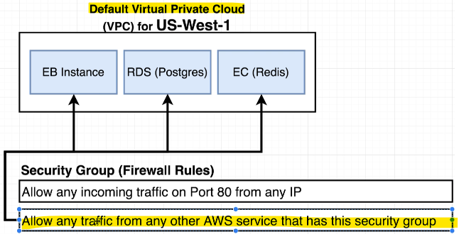
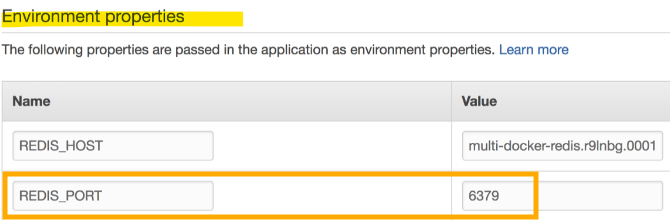

- [Section 11: Multi-Container Deployments to AWS](#section-11-multi-container-deployments-to-aws)
  - [Multi-Container Definition Files](#multi-container-definition-files)
    - [Travis CI Deployment Process](#travis-ci-deployment-process)
    - [Amazon Elastic Beanstalk](#amazon-elastic-beanstalk)
    - [Dockerrun.aws.jsonFile](#dockerrunawsjsonfile)
      - [Comparison with Docker Compose](#comparison-with-docker-compose)
    - [Key Differences](#key-differences)
  - [Finding Docs on Container Definitions](#finding-docs-on-container-definitions)
    - [Dockerrun.aws.jsonFile](#dockerrunawsjsonfile-1)
    - [Amazon Elastic Beanstalk and ECS](#amazon-elastic-beanstalk-and-ecs)
    - [Documentation](#documentation)
    - [Key Points](#key-points)
  - [Adding Container Definitions to DockerRun](#adding-container-definitions-to-dockerrun)
    - [Creating Dockerrun.aws.jsonFile](#creating-dockerrunawsjsonfile)
    - [AWS Elastic Beanstalk Configuration](#aws-elastic-beanstalk-configuration)
    - [Container Definitions](#container-definitions)
    - [Example Configuration Block](#example-configuration-block)
    - [Host Name](#host-name)
    - [Key Points](#key-points-1)
  - [More Container Definitions](#more-container-definitions)
    - [Essential Flag](#essential-flag)
    - [Adding Container Definitions](#adding-container-definitions)
      - [1. Client Container](#1-client-container)
      - [2. Server Container](#2-server-container)
      - [3. Worker Container](#3-worker-container)
    - [Key Points](#key-points-2)
  - [Forming Container Links](#forming-container-links)
    - [NGINX Container Definition](#nginx-container-definition)
    - [Validating JSON](#validating-json)
    - [Key Points](#key-points-3)
  - [Creating the Elastic Beanstalk Environment](#creating-the-elastic-beanstalk-environment)
  - [AWS Configuration](#aws-configuration)
    - [Elastic Beanstalk Application Creation](#elastic-beanstalk-application-creation)
    - [RDS Database Creation](#rds-database-creation)
    - [ElastiCache Redis Creation](#elasticache-redis-creation)
    - [Creating a Custom Security Group](#creating-a-custom-security-group)
    - [Applying Security Groups to ElastiCache](#applying-security-groups-to-elasticache)
    - [Applying Security Groups to RDS](#applying-security-groups-to-rds)
    - [Applying Security Groups to Elastic Beanstalk](#applying-security-groups-to-elastic-beanstalk)
    - [Add AWS configuration details to .travis.yml file's deploy script](#add-aws-configuration-details-to-travisyml-files-deploy-script)
    - [Setting Environment Variables](#setting-environment-variables)
    - [IAM Keys for Deployment](#iam-keys-for-deployment)
    - [AWS Keys in Travis](#aws-keys-in-travis)
    - [Deploying App](#deploying-app)
  - [Managed Data Service Providers](#managed-data-service-providers)
    - [Elastic Beanstalk Environment](#elastic-beanstalk-environment)
    - [Missing References](#missing-references)
    - [Development vs. Production Environment](#development-vs-production-environment)
    - [External Services](#external-services)
    - [Reasons for Using External Services](#reasons-for-using-external-services)
    - [Key Points](#key-points-4)
    - [Time and Cost Efficiency](#time-and-cost-efficiency)
      - [Course Focus](#course-focus)
      - [Next Steps](#next-steps)
  - [Overview of AWS VPC's and Security Groups](#overview-of-aws-vpcs-and-security-groups)
    - [Setting Up External Services](#setting-up-external-services)
    - [Overview](#overview)
    - [AWS Regions and VPC](#aws-regions-and-vpc)
    - [Security Groups](#security-groups)
    - [Steps to Connect Services](#steps-to-connect-services)
    - [Key Points](#key-points-5)
  - [RDS Database Creation](#rds-database-creation-1)
    - [Setting Up RDS (Relational Database Service)](#setting-up-rds-relational-database-service)
    - [Steps to Create RDS Instance](#steps-to-create-rds-instance)
    - [Key Points](#key-points-6)
  - [ElastiCache Redis Creation](#elasticache-redis-creation-1)
    - [Creating an ElastiCache Instance](#creating-an-elasticache-instance)
  - [Creating a Custom Security Group](#creating-a-custom-security-group-1)
    - [Setting Up Security Groups for ElastiCache and RDS](#setting-up-security-groups-for-elasticache-and-rds)
  - [Applying Security Groups to Resources](#applying-security-groups-to-resources)
    - [Applying Security Groups to Instances](#applying-security-groups-to-instances)
  - [Setting Environment Variables](#setting-environment-variables-1)
    - [Configuring Environment Variables for Elastic Beanstalk](#configuring-environment-variables-for-elastic-beanstalk)
    - [Automatic Environment Variable Mapping](#automatic-environment-variable-mapping)
    - [Final Steps](#final-steps)
  - [IAM Keys for Deployment](#iam-keys-for-deployment-1)
    - [Overview](#overview-1)
    - [Finalising Deployment with Travis CI](#finalising-deployment-with-travis-ci)
  - [Travis Deploy Script](#travis-deploy-script)
    - [Adding the Deploy Section to Travis CI](#adding-the-deploy-section-to-travis-ci)
  - [Container Memory Allocations](#container-memory-allocations)
    - [Troubleshooting and Memory Allocation](#troubleshooting-and-memory-allocation)
    - [Deployment Process](#deployment-process)
    - [Checking Deployment Status](#checking-deployment-status)
    - [Elastic Beanstalk Dashboard](#elastic-beanstalk-dashboard)
    - [Memory Allocation Error](#memory-allocation-error)
    - [Setting Memory Allocation](#setting-memory-allocation)
    - [Redeploying Changes](#redeploying-changes)
    - [Travis CI and Elastic Beanstalk](#travis-ci-and-elastic-beanstalk)
  - [Verifying Deployment](#verifying-deployment)
    - [Finalising Deployment and Debugging](#finalising-deployment-and-debugging)

<br>

<hr style="height:4px;background:black">

<br>

# Section 11: Multi-Container Deployments to AWS

## Multi-Container Definition Files

### Travis CI Deployment Process
* `Travis CI`: **Automates** the process of **pulling** down the **repository**, building production images, and **pushing** them to **Docker Hub** whenever changes are made to the GitHub repository.

<br>

### Amazon Elastic Beanstalk
* `Elastic Beanstalk`: Used for **deploying** Docker images in production.
* `Single Docker Container`: Previously, Elastic Beanstalk automatically built and ran the Docker image without custom configuration
* `Multiple Docker Containers`: Now, with multiple Docker files, additional configuration is needed.

<Br>

### Dockerrun.aws.jsonFile
* `Purpose`: Tells Elastic Beanstalk **where** to **pull** images from, resources to allocate, port mappings, and other information.

#### Comparison with Docker Compose
* `Docker Compose`: Used in **development** environments, contains build directions for images.
* `Dockerrun.aws.json`: Used in **production** with AWS, specifies pre-built images to use.

<br>


<br>

### Key Differences
* `Docker Compose`: Contains build directions for images.
* `Dockerrun.aws.json`: Specifies pre-built images, no build required.

<br>

<hr style="height:4px;background:black">

<br>

## Finding Docs on Container Definitions

### Dockerrun.aws.jsonFile
> **Purpose**: Tells Elastic Beanstalk **how** to work with **multiple containers**.

<bR>

### Amazon Elastic Beanstalk and ECS
* `Elastic Beanstalk`: Doesn't directly handle containers, especially multi-container environments.
* `Elastic Container Service` (ECS): Amazon service that Elastic Beanstalk **delegates** to for **hosting containers**.
* `Task Definitions`: Files that **tell** ECS **how to run a single container**, similar to container definitions in Dockerrun.aws.json.

<br>


<br>

### Documentation
* `Task Definition Documentation`: Important for understanding the **options** available for container definitions in Dockerrun.aws.json.
* `Finding Documentation`: Search for "[Amazon ECS task definition](https://docs.aws.amazon.com/AmazonECS/latest/developerguide/task_definitions.html)" on the AWS documentation site.

<br>

### Key Points
* [`Task Definition Parameters`](https://docs.aws.amazon.com/AmazonECS/latest/developerguide/task_definition_parameters.html): Look for container definitions in the task definition parameters section.
* `Properties to Add`: Include properties like name, image, memory, etc., in Dockerrun.aws.json.

<br>


<br>

<hr style="height:4px;background:black">

<br>

## Adding Container Definitions to DockerRun

### Creating Dockerrun.aws.jsonFile
* `File Creation`: Create a new file named **dockerrun.aws.json** in the **root** project directory.
* `File Type`: JSON file with a wrapping object using curly braces {}.

<br>


<br>

### AWS Elastic Beanstalk Configuration
* `Syntax Version`: Specify the syntax version with "AWSEBDockerrunVersion": "2".
* `Container Definitions`: List multiple container definitions in an **array**.

<br>


<br>

### Container Definitions
* `Purpose`: Each **entry** in the **array** represents a **separate container** to be created.
  * **Example**: For four custom images, add four **separate** entries.

<br>

### Example Configuration Block
* `Name`: Provide a name for the container (e.g., "name": "client").
* `Image`: Specify the image to use for the container (e.g., "image": "your-docker-id/multi-client").

<br>


<br>

### Host Name
* `Purpose`: Allows **other** containers to **access** this container using the specified **host name**.
  * **Example**: Set the host name to "hostname": "client".

<br>


<br>

### Key Points
* `Docker Hub`: Use Docker Hub to specify images easily.
* `Consistency`: Keep names consistent with sub-project names for clarity.

<br>

<hr style="height:4px;background:black">

<br>

## More Container Definitions

### Essential Flag
* `Purpose`: Indicates whether a container is essential.
* `Default`: Set to **false** by **default**.
* `Behavior`: If marked as **true**, all **other containers** will be **shut down** if this container **crashes**.
  * **Example**: Mark **NGINX** as **essential** because it routes traffic to other services.

<br>


<br>

> **Note**:
> * The essential flag is crucial for determining the importance of a container. 
> * If a container marked as essential crashes, it will cause all other containers to shut down. 
> * This is useful for critical services like NGINX, which routes traffic to other services. 
> * If NGINX goes down, it makes sense to shut down everything else because no one can access the services anyway.

<br>

### Adding Container Definitions
#### 1. Client Container
* Name: "name": "client"
* Image: "image": "your-docker-id/multi-client"
* Host Name: "hostname": "client"
* Essential: "essential": false

<br>


<br>

> **Note**:
> * The **client container** is not marked as essential because if it crashes, other services can still run. 
> * The image is specified using your Docker ID and the name of the image on Docker Hub. 
> * The host name allows other containers to access this container using the name "client".

<br>

#### 2. Server Container
* Name: "name": "server"
* Image: "image": "your-docker-id/multi-server"
* Host Name: "hostname": "API"
* Essential: "essential": false

<br>


<br>

> **Note**:
> * The **server container** is also not marked as essential. 
> * The **host name** is set to "API" because that's what NGINX will look for when redirecting traffic. 
> This helps keep things organised and ensures that traffic is routed correctly.

<br>

#### 3. Worker Container
* Name: "name": "worker"
* Image: "image": "your-docker-id/multi-worker"
* Host Name: "hostname": "worker"
* Essential: "essential": false

<br>


<br>

> **Note**:
> * The **worker container** is the least critical. 
> * If it crashes, the application can still function, but new calculations won't be processed. 
> * This is acceptable because users can still interact with the application and see previously calculated values.

<br>

### Key Points
* `Essential Flag`: At least one container must be marked as essential.
* `NGINX Container`: Will be marked as essential because it routes traffic.

<br>

<hr style="height:4px;background:black">

<br>

## Forming Container Links

### NGINX Container Definition
> * **Purpose**: Routes incoming requests to either the client or the backend API server.

<br>

1. `Adding NGINX Container Definition`
* Name: "name": "NGINX"
* Image: "image": "your-docker-id/multi-NGINX"

> Note: 
> * The NGINX container is responsible for routing traffic. 
> * The image is specified using your Docker ID and the name of the image on Docker Hub.

<br>

2. `Host Name`
> **Optional**: No other service needs to directly access NGINX, so the host name is not required.

* Host names are used for **inter-container communication**. 
* Since no other service needs to access NGINX directly, the host name can be omitted. However, you can add it if you want to be thorough.

<br>

3. `Essential Flag`
* Essential: "essential": true

> **Note**:
> * Marking NGINX as essential means that if it crashes, all other containers will be shut down. 
> * This is important because if NGINX goes down, users cannot access the client or API, making the entire group of containers non-functional.

<br>


<br>

4. `Port Mappings`
`Port Mappings`:

```json
"portMappings": [
  {
    "hostPort": 80,
    "containerPort": 80
  }
]
```

> **Note**: 
> * Port mappings expose the container's network ports to the outside world. 
> In this case, port 80 on the host is mapped to port 80 inside the container, which is the default port that NGINX listens to.

<br>


<br>

5. `Links`
`Links`:

```json
"links": ["client", "server"]
```

> Note:
> * Links are used to form connections between containers. 
> * NGINX needs to know about the client and server containers to route traffic to them. 
> * Links are unidirectional, meaning NGINX points to the client and server, but not the other way around.

<br>


<br>

### Validating JSON
* `Validation`: Use a JSON validator to check for **typos** and ensure the JSON is correctly **formatted**.

> Note:
> * Validating the JSON file helps catch any errors before deploying the application. 
> * Elastic Beanstalk can be strict about JSON formatting, so it's important to ensure there are no typos or syntax errors.

<br>

### Key Points
* `NGINX Container`: Routes traffic to client and API.
* `Essential Flag`: Ensures the entire group of containers is shut down if NGINX crashes.
* `Port Mappings`: Expose container ports to the host.
* `Links`: Form connections between containers for communication.

<br>

<hr style="height:4px;background:black">

<br>

## Creating the Elastic Beanstalk Environment
> **Note**: The following instructions create an environment with the Amazon Linux 2023 Platform. 

1. Go to AWS Management Console
2. Search for Elastic Beanstalk and click the **Elastic Beanstalk** service.

<br>


<br>

3. Click the **Create environment** button.


<br>

4. You will need to provide an **Application name**, which will auto-populate an **Environment name**.


<br>

5. Scroll down to find the **Platform** section. 
   * You will need to select the Platform of **Docker**. 
   * This will auto-select several default options.


<br>

6. Scroll down to the **Presets** section and make sure that **free tier** eligible has been selected


<br>

7. Click the **Next** button to move to Step #2.
8. You will be taken to a Service Access configuration form.
   * Ensure that Use an **existing service role** is selected and that the service role created in Section 7 is listed. 
   * This should also auto-populate the EC2 instance profile with the ec2-role that was previously created.


<br>

9. Click the **Skip to Review** button.
10. Click the **Submit** button and wait for your new Elastic Beanstalk application and environment to be created and launch.

<br>

<hr style="height:4px;background:black">

<br>

## AWS Configuration 
> **Note**: quickly run through the AWS configuration steps or easily see if you missed a step. It will also help navigate through the changes to the AWS UI since the course was recorded.

<br>

### Elastic Beanstalk Application Creation
2. Go to **AWS Management** Console and use **Find Services** to search for **Elastic Beanstalk**.
3. Click “Create Application”.
4. Set **Application Name** to 'multi-docker'.
5. Scroll down to **Platform** and select **Docker**.
6. Verify that "Single Instance (free tier eligible)" has been selected.
7. Click the "Next" button.
8. In the "Service Role" section, verify that "Use an Existing service role" is selected.
9. Verify that **aws-elasticbeanstalk-service-role** has been auto-selected for the service role.
10. Verify that **aws-elasticbeanstalk-ec2-role** has been **auto-selected** for the instance profile.
11. Click "Skip to review" button.
12. Click the "Submit" button.
13. You may need to refresh, but eventually, you should see a green checkmark underneath Health.

<br>

### RDS Database Creation
1. Go to **AWS Management** Console and use **Find Services** to search for **RDS**
2. Click **Create database** button.
3. Select **PostgreSQL**.
4. In Templates, check the **Free tier** box.
5. Scroll down to **Settings**.
6. Set **DB Instance identifier** to **multi-docker-postgres**.
7. Set Master Username to **postgres**.
8. Set Master Password to **postgrespassword** and confirm.
9. Scroll down to **Connectivity**. Make sure **VPC** is set to **Default** VPC.
10. Scroll down to **Additional Configuration** and click to **unhide**.
11. Set Initial database name to **fibvalues**.
12. Scroll down and click **Create Database** button.

<br>

### ElastiCache Redis Creation
1. Go to **AWS Management** Console and use **Find Services** to search for **ElastiCache**
2. In the sidebar under **Resources**, click **Redis OSS caches**.
3. Click the **Create Redis OSS caches** button.
4. Select **Design your own cache** and **Cluster cache**.
5. Make sure Cluster Mode is **DISABLED**.
6. Scroll down to Cluster info and set Name to **multi-docker-redis**.
7. Scroll down to Cluster settings and change Node type to **cache.t3.micro**.
8. Change Number of Replicas to **0** (Ignore the warning about Multi-AZ).
9. Scroll down to **Subnet group**. Select **Create a new subnet group** if not already selected.
10. Enter a **name** for the Subnet Group such as **redis**.
11. Scroll down and click the **Next** button.
12. Scroll down and click the **Next** button again.
13. Scroll down and click the **Create** button.

<br>

### Creating a Custom Security Group
1. Go to **AWS Management** Console and use **Find Services** to search for **VPC**.
2. Find the Security section in the left sidebar and click **Security Groups**.
3. Click **Create Security Group** button.
4. Set Security group name to **multi-docker**.
5. Set Description to **multi-docker**.
6. Make sure VPC is set to your **default VPC**.
7. Scroll down and click the **Create Security Group** button.
8. After the security group has been created, find the **Edit inbound rules** button.
9. Click **Add Rule**.
10. Set Port Range to **5432-6379**.
11. Click in the box next to Source and start typing **'sg'** into the box. Select the **Security Group** you just created.
12. Click the **Save rules** button.

<br>

### Applying Security Groups to ElastiCache
1. Go to **AWS Management** Console and use **Find Services** to search for **ElastiCache**.
2. Under **Resources**, click **Redis clusters** in Sidebar.
3. Check the box next to your **Redis cluster**.
4. Click **Actions** and click **Modify**.
5. Scroll down to find **Selected security groups** and click **Manage**.
6. Tick the box next to the new multi-docker group and click **Choose**.
7. Scroll down and click **Preview Changes**.
8. Click the **Modify** button.

<br>

### Applying Security Groups to RDS
1. Go to **AWS Management** Console and use **Find Services** to search for **RDS**.
2. Click **Databases** in Sidebar and check the box next to **your instance**.
3. Click **Modify** button.
4. Scroll down to **Connectivity** and add select the **new** multi-docker security group.
5. Scroll down and click the **Continue** button.
6. Click **Modify DB instance** button.

<br>

### Applying Security Groups to Elastic Beanstalk
1. Go to **AWS Management** Console and use **Find Services** to search for **Elastic Beanstalk**.
2. Click **Environments** in the left sidebar.
3. Click **MultiDocker-env**.
4. Click **Configuration**.
5. In the **Instances row**, click the **Edit** button.
6. Scroll down to EC2 Security Groups and tick the box next to **multi-docker**.
7. Click Apply and Click Confirm.
8. After all the instances restart and go from No Data to Severe, you should see a green checkmark under Health.

<br>

### Add AWS configuration details to .travis.yml file's deploy script
1. Set the **region**. The region code can be found by clicking the region in the toolbar next to your username.
   * eg: 'us-east-1'.
2. **app** should be set to the Elastic Beanstalk **Application Name**.
   * eg: 'multi-docker'.
3. **env** should be set to your Elastic Beanstalk **Environment name**.
   * eg: 'MultiDocker-env'.
4. Set the **bucket_name**. This can be found by searching for the S3 Storage service. Click the link for the elasticbeanstalk bucket that matches your region code and copy the name.
   * eg: 'elasticbeanstalk-us-east-1-923445599289'.
5. Set the **bucket_path** to 'docker-multi'.
6. Set **access_key_id** to $AWS_ACCESS_KEY.
7. Set **secret_access_key** to $AWS_SECRET_KEY.

<br>

### Setting Environment Variables
1. Go to **AWS Management** Console and use **Find Services** to search for **Elastic Beanstalk**.
2. Click **Environments** in the left sidebar.
3. Click **MultiDocker-env**.
4. In the left sidebar click **Configuration**.
5. Scroll down to the **Updates**, **monitoring**, and **logging** section and click **Edit**.
6. Scroll down to the **Environment Properties** section. Click **Add environment property**.
7. In another tab Open up **ElastiCache**, click **Redis** and check the box next to your cluster. Find the **Primary Endpoint** and **copy that value** but omit the :6379.
8. Set **REDIS_HOST key** to the **primary endpoint** listed above, remember to omit :6379.
9. Set **REDIS_PORT** to 6379.
10. Set **PGUSER** to **postgres**.
11. Set **PGPASSWORD** to **postgrespassword**.
12. In another tab, open up the **RDS dashboard**, click **databases** in the sidebar, click **your instance** and scroll to **Connectivity and Security**. Copy the endpoint.
13. Set the **PGHOST** key to the endpoint value listed above.
14. Set **PGDATABASE** to **fibvalues**.
15. Set **PGPORT** to **5432**.
16. Click **Apply** button.
17. After all instances restart and go from No Data, to Severe, you should see a **green checkmark** under Health.

<br>

### IAM Keys for Deployment
> You can use the same IAM User's access and secret keys from the single container app we created earlier, or, you can create a new IAM user for this application:

1. Search for the "IAM Security, Identity & Compliance Service"
2. Click "Create Individual IAM Users" and click "Manage Users"
3. Click "Add User"
4. Enter any name you’d like in the "User Name" field.
   * eg: docker-multi-travis-ci
5. Click "Next"
6. Click "Attach Policies Directly"
7. Search for "beanstalk"
8. Tick the box next to "AdministratorAccess-AWSElasticBeanstalk"
9.  Click "Next"
10. Click "Create user"
11. Select the IAM user that was just created from the list of users
12. Click "Security Credentials"
13. Scroll down to find "Access Keys"
14. Click "Create access key"
15. Select "Command Line Interface (CLI)"
16. Scroll down and tick the "I understand..." check box and click "Next"

> Copy and/or download the Access Key ID and Secret Access Key to use in the Travis Variable Setup.

<br>

### AWS Keys in Travis
1. Go to your **Travis Dashboard** and find the project repository for the application we are working on.
2. On the repository page, click "More Options" and then "Settings".
3. Create an **AWS_ACCESS_KEY** variable and paste your **IAM access key**.
4. Create an **AWS_SECRET_KEY** variable and paste your **IAM secret key**.

<br>

### Deploying App
1. Make a small change to your src/App.js file in the greeting text.
2. In the project root, in your terminal run:

```sh
git add.
git commit -m “testing deployment"
git push origin main
```

3. Go to your Travis Dashboard and check the status of your build.
4. The status should eventually return with a green checkmark and show "build passing".
5. Go to your AWS Elastic Beanstalk application.
6. It should say "Elastic Beanstalk is updating your environment".
7. It should eventually show a green checkmark under "Health". You will now be able to access your application at the external URL provided under the environment name.

<br>

<hr style="height:4px;background:black">

<br>

## Managed Data Service Providers

### Elastic Beanstalk Environment
> **Note**: Successfully created a new Elastic Beanstalk environment for a multi-container Docker application.

<br>

### Missing References
* `Docker Run File`: No references to Postgres or Redis containers in the Docker run file or Travis setup.

### Development vs. Production Environment
* `Development Environment`: Used containers for Redis and Postgres.
* `Production Environment`: Uses external services for Redis and Postgres.

### External Services
* `AWS Relational Database Service` (RDS): Used for Postgres.
* `Amazon ElastiCache`: Used for Redis.

<br>

### Reasons for Using External Services
* `Professional Setup`: AWS services provide a professional-grade setup with optimal configurations.
* `Scalability`: Easy to scale resources without manual configuration.
* `Built-in Features`: Includes logging, maintenance, and security patches.
* `Security`: AWS handles security, reducing the burden on developers.
* `Decoupling`: Services are independent of Elastic Beanstalk, making future migrations easier.
* `Automated Backups`: RDS provides automated backups, simplifying data maintenance and recovery.

<br>

### Key Points
* `ElastiCache`: Automatically creates and manages Redis instances, making it easy to scale and maintain.
* `RDS`: Provides automated backups and professional-grade Postgres setup, ensuring data security and easy recovery.

### Time and Cost Efficiency
* `Time is Money`: Setting up and maintaining Postgres and Redis on Elastic Beanstalk can take a lot of time, which translates to money.
* `Cost Justification`: Spending $10-$20 per month on a managed Postgres instance through RDS is often more cost-effective than maintaining it yourself.

<br>

#### Course Focus
* `Automated Services`: While using automated services like RDS and ElastiCache is recommended, the course will also cover setting up Redis and Postgres from scratch in a production environment.
* `Learning Both Approaches`: Understanding both managed and self-managed setups is valuable, especially for environments that don't offer managed solutions (e.g., DigitalOcean).

#### Next Steps
* `Upcoming Project`: The next project will involve setting up Redis and Postgres without using external services.
* `Setting Up ElastiCache and RDS`: The next section will cover setting up instances of ElastiCache and RDS and connecting them to Elastic Beanstalk.

<br>


<br>

<hr style="height:4px;background:black">

<br>

## Overview of AWS VPC's and Security Groups

### Setting Up External Services
> **Purpose**: Connect external services (RDS and ElastiCache) to Elastic Beanstalk.

<br>


<br>

### Overview
* `Elastic Beanstalk Instance`: Contains four different containers.
  * Contains four different containers: Nginx, Express API, Worker, and Client.
  * These containers handle different parts of the application, such as routing requests, serving the API, processing background tasks, and serving the frontend.

* `External Services`: PostgreSQL (RDS) and Redis (ElastiCache).
  * `PostgreSQL` (RDS): A managed relational database service provided by AWS. It offers automated backups, scaling, and maintenance.
  * `Redis` (ElastiCache): A managed in-memory data store and cache service provided by AWS. It offers high performance, scalability, and ease of use.

<br>


<br>

### AWS Regions and VPC
* `Regions`: AWS has different regions (data centers) around the world.
  * `Regions`: AWS has multiple regions (data centers) around the world where you can create and manage services. Each region operates independently.

* `Virtual Private Cloud` (VPC): A private network for your AWS services, ensuring isolation and security.
  * `Virtual Private Cloud` (VPC): A private network within AWS that **isolates** your services from other users. Each region has a default VPC created automatically.

<br>


<br>

### Security Groups
* A security group is a set of firewall rules that control traffic to your AWS services.
* `Default Security Group`: Automatically created for Elastic Beanstalk, allowing HTTP traffic on port 80.

<br>


<br>

### Steps to [Connect Services](#aws-configuration)
1. `Create a New Security Group`: This group will allow traffic between Elastic Beanstalk, RDS, and ElastiCache.
2. `Attach Security Group`: Apply the new security group to all three services (Elastic Beanstalk, RDS, and ElastiCache).

<br>

### Key Points
* `Isolation`: By default, AWS services do not communicate with each other.
* `Security Group`: Allows specified services to communicate by permitting traffic within the group.

<br>

<hr style="height:4px;background:black">

<br>

## RDS Database Creation

### Setting Up RDS (Relational Database Service)
> **Purpose**: Create a managed version of Postgres using RDS.

<br>


<br>

### Steps to Create RDS Instance
1. `Access RDS Dashboard`:
   * Go to the AWS **Management Console**.
   * Ensure you are in the same region as your **Elastic Beanstalk instance**.
   * Search for "RDS" in the services drop-down menu.

<br>


1. `Create Database`:
   * Click on "Create Database".
   * Select the **database engine** (e.g., Postgres).
   * Check the box for "Enable only options for free tier usage" if applicable.

<br>

3. `Configure Database Settings`:
   * **DB Instance Class**: Choose T2 Micro (suitable for free tier).
   * **Allocated Storage**: Minimum 20 GB.
   * **DB Instance Identifier**: Name your instance (e.g., multi-docker-postgres).
   * **Master Username and Password**: Set and remember these credentials for later use.

<br>

4. `Network and Security Settings`:
   * **VPC**: Use the default VPC.
   * **Public Accessibility**: Ensure "No" is selected to keep the database private.
   * **VPC Security Groups**: Select "Create new VPC security group" (will be customised later).

<br>

5. `Database Name and Port`:
   * **Database Name**: Set a name (e.g., fib-values) and remember it.
   * **Port**: Leave as default (5432 for Postgres).

<br>

6. `Backup Settings`:
   * **Automated Backups**: Enable and set the retention period (default is 7 days).

<br>

7. `Create Database`:
   * Click on "Create Database" at the bottom.
   * The database creation process will take a few minutes.

<br>

### Key Points
* `RDS`: Managed service for databases, providing automated backups, scaling, and maintenance.
* `Security`: Ensure the database is not publicly accessible and is secured within the VPC.

<br>

<hr style="height:4px;background:black">

<br>

## ElastiCache Redis Creation

### Creating an ElastiCache Instance
> ElastiCache: A caching service for Redis or Memcached.

1. `Search for ElastiCache`: Go to the services menu and search for ElastiCache.
2. `Select Redis`: Click on Redis on the left-hand side.
3. `Create Cluster`: Click on the Create button to start the process.

<br>

2. `Cluster Creation Details`
   * **Cluster**: A high-powered copy of Redis with separate nodes relaying information from the primary Redis node.

`Default Settings`:
* **Cluster Option**: Uncheck the cluster option if not needed.
* **Name**: Enter a name (e.g., Multi Docker Redis).
* **Node Type**: Change from the default (expensive) to cache.t2.micro (cheapest option).
* **Replicas**: Set the number of replicas to none if high performance is not required.

<br>

3. `Subnet and Security Group`
   * **Subnet**: Create a new subnet for security purposes.
     * **Name**: Enter a name (e.g., Redis Group).
     * **VPC ID**: Select the default VPC.
     * **Subnets**: Check both subnets for access.
   * **Security Group**: Will be set up later to apply to Elastic Beanstalk, RDS, and EC instances.

<br>

<hr style="height:4px;background:black">

<br>

## Creating a Custom Security Group



<br>

### Setting Up Security Groups for ElastiCache and RDS

1. `Checking ElastiCache Redis Instance`
   * **Status**: Ensure the status is green and available.
   * **Refresh**: If not, click the refresh button (may take 4-5 minutes).
   * **Node Type**: Confirm it's set to cache.t2.micro to avoid high costs.

<br>


<br>

2. `Creating a Security Group`
   * **Purpose**: Allow communication between Redis, Postgres, and other services.

Steps:
1. **Navigate to VPC Dashboard**: Go to Services, search for VPC, and click on it.
2. **Find Security Groups**: Scroll down to the Security section and select Security Groups.
3. **Create Security Group**: Click on Create Security Group.

<br>


<br>

3. `Security Group Details`
   * **Name**: Enter a name (e.g., Multi Dash Docker).
   * **Description**: Enter a description (e.g., Traffic for Services in Multi Dash Docker App).
   * **VPC**: Select the default VPC.

<br>


<br>

4. `Creating Inbound Rules`
   * **Select Security Group**: Choose the newly created security group.
   * **Inbound Rules Tab**: Go to the Inbound Rules tab and click Edit.

Rule Settings:
* **Type**: Custom TCP.
* **Protocol**: TCP.
* **Port Range**: 5432 to 6379 (default Redis and Postgres ports).
* **Source**: Select the same security group (SG Multi-Docker).

<br>


<br>

<hr style="height:4px;background:black">

<br>

## Applying Security Groups to Resources


<br>

### Applying Security Groups to Instances
> **Purpose**: Apply the multi-docker security group to ElastiCache, RDS, and Elastic Beanstalk instances to **allow traffic** between them.

<br>

1. `Applying Security Group to ElastiCache`

Steps:
1. **Open Services Tab**: Go to the services tab and search for ElastiCache.
2. **Select Redis**: Click on Redis on the left-hand side.
3. **Modify Cluster**: Select the cluster, click on modify, and change the VPC security groups.
4. **Select Security Group**: Check the box next to the multi-docker security group and save.
5. **Apply Changes**: Click on modify to apply changes immediately.

<br>

2. `Applying Security Group to RDS`

Steps:
1. **Open Services Tab**: Go to the services tab and search for RDS.
2. **Select Instance**: Find the 'multi Docker Postgres' instance.
3. **Modify Instance**: Scroll down to the details section, click on modify, and go to 'network and security'.
4. **Select Security Group**: Choose the multi-docker security group from the dropdown.
5. **Apply Changes**: Click on continue and then modify DB instance to apply changes immediately.

<br>

3. `Applying Security Group to Elastic Beanstalk`

Steps:
1. **Open Services Tab**: Go to the services tab and search for Elastic Beanstalk.
2. **Select Configuration**: Click on configuration on the left-hand side.
3. **Modify Instances**: Click on modify under the instances card.
4. **Select Security Group**: Check the box next to the multi-docker security group and apply.
5. **Confirm Changes**: Click on confirm to update the environment.

<br>

<hr style="height:4px;background:black">

<br>

## Setting Environment Variables


<br>

### Configuring Environment Variables for Elastic Beanstalk
> **Purpose**: Ensure containers in Elastic Beanstalk can **communicate** with RDS and ElastiCache by setting environment variables.

<bR>

1. `Setting Environment Variables`

Steps:
1. **Open Elastic Beanstalk Console**: Go to the Elastic Beanstalk instance and find the configuration on the left-hand side.
2. **Modify Software Configuration**: Select modify on the software card and scroll to the environment properties section.

<br>


<br>

2. `Adding Environment Variables`

`REDIS_HOST`:
* **Name**: Redis host.
* **Value**: Get the primary endpoint from the ElastiCache dashboard (exclude the port number).

<br>

> #### Note: **How to get the primary endpoint**. 
> 
> 1. **Open ElastiCache Dashboard**: Go to the AWS Management Console, open the services tab, and search for ElastiCache.
> 2. **Select Redis**: Click on Redis on the left-hand side.
> 3. **Expand Redis Cluster**: Click on the little arrow next to your Redis cluster to expand the details.
> 4. **Find Primary Endpoint**: Look for the primary endpoint listed in the details. Make sure to copy everything to the left of the colon (:) that designates the port number.

<br>


<br>

`REDIS_PORT`:
* **Name**: Redis port.
* **Value**: 6379 (default Redis port).

<br>




<br>

`Document of various usernames`:


<br>

`Postgres Variables`:
* **PG User**:
  * Name: PG user.
  * Value: Your Postgres username (e.g., Postgres).
* **PG Password**:
  * Name: PG password.
  * Value: Your Postgres password.
* **PG Host**:
  * Name: PG host.
  * Value: Get the endpoint from the RDS dashboard.


> #### Note: **How to get the endpoint from the RDS dashboard**.
>
> 1. **Open RDS Dashboard**: Go to the AWS Management Console, open the services tab, and search for RDS.
> 2. **Select Instances**: Click on the Instances section on the left-hand side.
> 3. **Select Your Instance**: Find and select your RDS instance (e.g., 'multi Docker Postgres').
> 4. **Find Endpoint**: Scroll down to the details section and look for the endpoint listed under the Connect section. Copy the entire endpoint.

<br>


<br>

* **PG Database**:
  * Name: PG database.
  * Value: Your database name (e.g., Fib Values).
* **PG Port**:
  * Name: PG port.
  Value: 5432 (default Postgres port).

<br>


<br>

3. `Applying Changes`
   * **Triple Check**: Ensure all names and values are correct to avoid errors.
   * **Apply**: Click the apply button to save changes.

<br>

### Automatic Environment Variable Mapping
* **Elastic Beanstalk**: Automatically adds environment variables to all containers listed in the Docker run AWS.JSON file.

> **Note**: 
> * On Elastic BeanStalk, when you set up those environment variables they **automatically get added** to all of the **different containers** that you listed inside that **Dockerrun.AWS.JSON file** (e.g., server, client, worker, etc.).
> * Every single one of these containers has **automatic access** to that set of **environment variables**.
> * We do not have to do any additional environment variable mapping, that makes life a little bit easier.

<br>


<br>

### [Final Steps](#iam-keys-for-deployment-1)
* **Travis.ymlFile**: Update the Travis.ymlfile to build images, push them to Docker Hub, and notify Elastic Beanstalk to deploy them.

<br>

<hr style="height:4px;background:black">

<br>

## IAM Keys for Deployment

### Overview
* `Purpose`: Deploy the application to Elastic Beanstalk using **Travis CI**.
* `Current Status`: Building production versions of images and pushing them to Docker Hub.

<br>

### Finalising Deployment with Travis CI

1. `Deployment Process`
   * **Elastic Beanstalk**: Deploy the entire project, focusing on the Dockerrun.aws.json file.
   * **Travis CI**: Use Travis CI to automate the deployment process.

<br>

2. `Setting Up AWS Access`

`Create IAM User`:
1. **Open AWS Dashboard**: Go to Services and select IAM.
2. **Add User**: Click on Add User and create a new user (e.g., Multidockerdeployer).
3. **Access Type**: Select Programmatic Access.
4. **Permissions**: Attach existing policies directly (search for Beanstalk and add all relevant policies).
5. **Create User**: Generate the access key ID and secret access key.

<br>


<br>

3. `Configuring Travis CI`

`Set Environment Variables`:
1. **Open Travis Dashboard**: Go to travis-ci.org and open the Multi-docker project.
2. **Add Environment Variables**: Go to Options, Settings, and add new environment variables.

<br>


<br>

3. **AWS Access Key**: Add the access key ID as AWS_ACCESS_KEY.
4. **AWS Secret Key**: Add the secret access key as AWS_SECRET_KEY.

<br>


<br>


4. [`Deploy Script`](#travis-deploy-script)
   * **Add Deploy Script**: Add the deploy script to the bottom of the travis.yml file to automate the deployment process.

<br>


<br>

<hr style="height:4px;background:black">

<br>

## Travis Deploy Script
* **Purpose**: Add the deploy section to the travis.yml file to automate deployment to Elastic Beanstalk.

<br>

### Adding the Deploy Section to Travis CI

1. `Deploy Section Configuration`
   * **Provider**: Set the provider to elasticbeanstalk.
   * **Region**: Get the region from the Elastic Beanstalk dashboard URL subdomain.
   * **App Name**: Set the app name (e.g., Multi-docker).
   * **Environment**: Set the environment name (e.g., multi-docker-env).

<br>


<br>

2. `S3 Bucket Configuration`
   * **Bucket Name**: Go to the S3 dashboard, find the bucket for your region, and copy the bucket name.

<br>


<br>

   * **Bucket Path**: Set a path for the project (e.g., Docker-multi).

<bR>


<bR>

3. `Branch Deployment`
   * **Branch**: Configure Travis to deploy only when the branch is master.

<br>


<br>

4. `AWS Access Keys`
   * **Access Key ID**: Set the access key ID as AWS_ACCESS_KEY.
   * **Secret Access Key**: Set the secret access key as AWS_SECRET_KEY.

<br>


<br>

5. `Final Steps`
   * **Save and Deploy**: Save the travis.yml file and deploy the project to test it out.

<br>

<hr style="height:4px;background:black">

<br>

## Container Memory Allocations

### Troubleshooting and Memory Allocation
> **Objective**: Ensure successful deployment to Elastic Beanstalk and troubleshoot any errors.

<br>

### Deployment Process
* `Push Code to GitHub`: Push all code to GitHub.
* `Travis CI`: Travis pulls the code, builds the project, and deploys it to Elastic Beanstalk.

### Checking Deployment Status
* `Travis CI`: Check the build status on Travis CI. If there are errors, it might be due to typos.
* `GitHub Repository`: Refer to the GitHub repository for troubleshooting.

### Elastic Beanstalk Dashboard
* `Check for Errors`: Go to the Elastic Beanstalk dashboard and check for any errors or warnings.
* `Recent Events`: Look at recent events to identify any issues.

### Memory Allocation Error
* `Error Message`: If you see an error about invalid settings for the container client, it means the memory option is missing in the dockerrun.aws.json file.
* `Add Memory Option`: Add a memory option to each container definition.

<br>

### Setting Memory Allocation
* `Memory Value`: Allocate 128 megabytes of memory to each service.

`Update dockerrun.aws.json`:
* **Client**: Add "memory": 128 under the essential flag.
* **Server**: Add "memory": 128 under the essential flag.
* **Worker**: Add "memory": 128 under the essential flag.
* **Nginx**: Add "memory": 128 under the essential flag.

<br>


<br>

### Redeploying Changes
`Git Commands`:
* **git status**: Check the status of your changes.
* **git add**: Stage the changes.
* **git commit**: Commit the changes (e.g., "added memory allocation").
* **git push origin master**: Push the changes to GitHub.

<br>


<br>

### Travis CI and Elastic Beanstalk
* `Travis CI`: Travis will pull the updated code, build the images, push them to Docker Hub, and send the dockerrun.aws.json file to Elastic Beanstalk.
* `Debugging`: If any errors occur, continue troubleshooting in the next section.

<br>

<hr style="height:4px;background:black">

<br>

## Verifying Deployment
> * **Objective**: Ensure the application is successfully deployed and troubleshoot any errors.

### Finalising Deployment and Debugging
1. `Deployment Status`
   * **Check Health**: Ensure the health status is OK on the Elastic Beanstalk dashboard.

> **Errors**: If there are errors, follow the debugging steps below.

<bR>

2. `Debugging Tips`
   * **Logs Tab**: Click on the logs tab on the left-hand side of the Elastic Beanstalk dashboard.
   * **Request Logs**: Click on request logs and select the last 100 lines.
   * **Download Logs**: Download the log file to view the last 100 lines of output from each container and other services.

<br>


<br>

3. `Log File Sections`
   * **ECS-init Logs**: Logs from the Elastic Container Service application.
   * **PHP App Logs**: Logs from the default Elastic Beanstalk application.
   * **Container Logs**: Logs from the client container, Nginx container, Nginx proxy, and server logs.

<bR>


<bR>

4. `Finding Errors`
   * **Read Logs**: Look through the logs to find messages indicating what went wrong.

<br>

5. `Accessing the Application`
   * **Application URL**: Find the URL to the application at the top of the Elastic Beanstalk dashboard.
   * **Open Application**: Click on the link to open the application.
   * **Test Application**: Enter an index value to calculate and click submit. Refresh the page to see the result.

<br>


<br>

6. `Final Steps`
   * **Redeploying the App**: Ensure the application is working and updates appear on the screen.

<br>

<hr style="height:4px;background:black">

<br>

