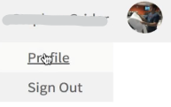
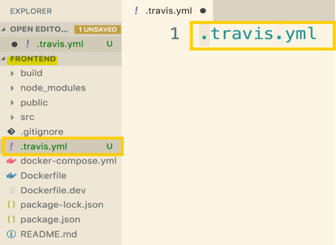
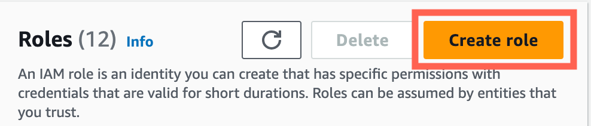
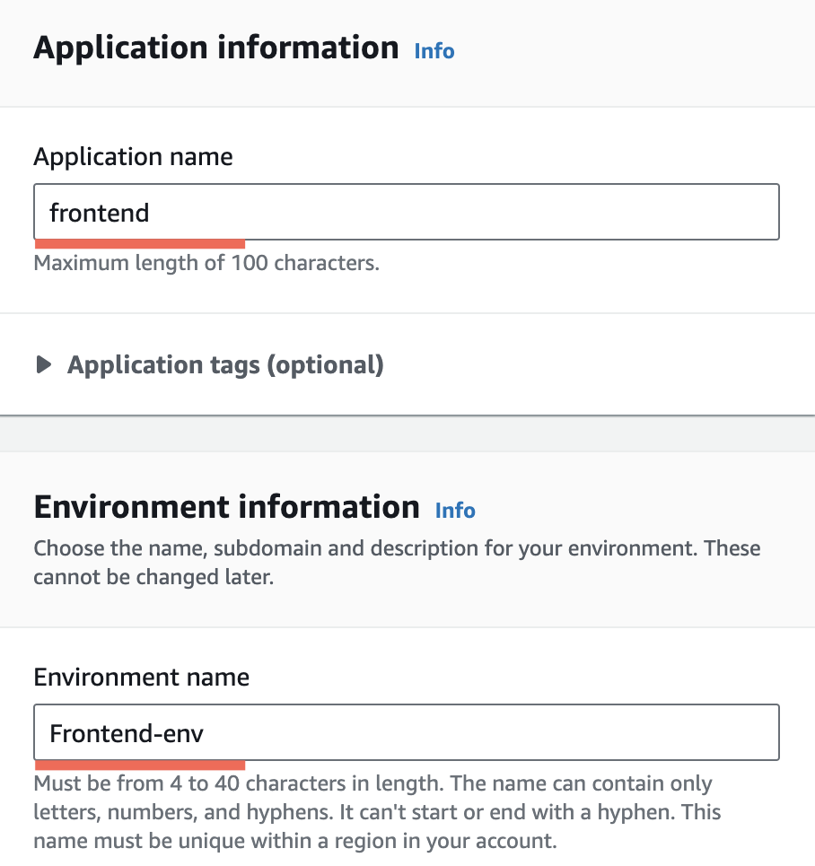

- [Section 7: Continuous Integration and Deployment with AWS](#section-7-continuous-integration-and-deployment-with-aws)
  - [Services Overview](#services-overview)
    - [Docker Containers](#docker-containers)
    - [Development and Deployment Flow](#development-and-deployment-flow)
    - [Using GitHub](#using-github)
    - [Using Travis CI](#using-travis-ci)
    - [Using AWS](#using-aws)
    - [General Deployment Knowledge](#general-deployment-knowledge)
    - [Key Takeaways](#key-takeaways)
  - [GitHub Setup](#github-setup)
    - [Creating a GitHub Repository](#creating-a-github-repository)
    - [Setting Up Local Git Repository](#setting-up-local-git-repository)
    - [Connecting to GitHub Remote](#connecting-to-github-remote)
    - [Verifying the Setup](#verifying-the-setup)
    - [Next Steps](#next-steps)
    - [Key Takeaways](#key-takeaways-1)
  - [Travis CI Setup](#travis-ci-setup)
    - [Overview of Travis CI](#overview-of-travis-ci)
    - [Getting Started with Travis CI](#getting-started-with-travis-ci)
    - [Enabling Travis CI for Your Repository](#enabling-travis-ci-for-your-repository)
    - [Verifying Travis CI Setup](#verifying-travis-ci-setup)
    - [Next Steps](#next-steps-1)
    - [Key Takeaways](#key-takeaways-2)
  - [Travis YAML File Configuration](#travis-yaml-file-configuration)
    - [Integration with Travis CI](#integration-with-travis-ci)
    - [Creating the Travis Configuration File](#creating-the-travis-configuration-file)
      - [Steps in the Travis Configuration File](#steps-in-the-travis-configuration-file)
    - [Running Tests](#running-tests)
    - [Future Steps](#future-steps)
    - [Key Takeaways](#key-takeaways-3)
  - [More Travis CI Setup](#more-travis-ci-setup)
    - [Adding the Script Section](#adding-the-script-section)
    - [Running the Test Suite](#running-the-test-suite)
    - [Handling Default Behavior](#handling-default-behavior)
    - [Finalising the Configuration](#finalising-the-configuration)
    - [Key Takeaways](#key-takeaways-4)
  - [Automatic Build Creation: Committing Changes and Pushing to GitHub](#automatic-build-creation-committing-changes-and-pushing-to-github)
    - [Committing Changes](#committing-changes)
    - [Pushing to GitHub](#pushing-to-github)
    - [Travis CI Build Process](#travis-ci-build-process)
    - [Monitoring the Build](#monitoring-the-build)
    - [Build Logs](#build-logs)
    - [Successful Build](#successful-build)
    - [Pipeline in Place](#pipeline-in-place)
    - [Key Takeaways](#key-takeaways-5)
  - [AWS Elastic Beanstalk: Setting Up Automatic Deployment to AWS](#aws-elastic-beanstalk-setting-up-automatic-deployment-to-aws)
    - [Successful Tests on Travis CI](#successful-tests-on-travis-ci)
    - [Logging into AWS](#logging-into-aws)
    - [Using Elastic Beanstalk](#using-elastic-beanstalk)
    - [Creating a New Application](#creating-a-new-application)
    - [Key Takeaways](#key-takeaways-6)
  - [Elastic Beanstalk Setup and Configuration](#elastic-beanstalk-setup-and-configuration)
    - [Creating EC2 IAM Instance Profile](#creating-ec2-iam-instance-profile)
    - [Elastic Beanstalk Environment Creation](#elastic-beanstalk-environment-creation)
    - [S3 Bucket Configuration](#s3-bucket-configuration)
    - [Required Updates for Docker Compose](#required-updates-for-docker-compose)
  - [More on Elastic Beanstalk](#more-on-elastic-beanstalk)
    - [Elastic Beanstalk Overview](#elastic-beanstalk-overview)
    - [User Requests and Load Balancer](#user-requests-and-load-balancer)
    - [Scaling with Elastic Beanstalk](#scaling-with-elastic-beanstalk)
    - [Application URL](#application-url)
    - [Key Takeaways](#key-takeaways-7)
  - [Travis Config for Deployment](#travis-config-for-deployment)
    - [Adding Deployment Configuration](#adding-deployment-configuration)
    - [Provider Configuration](#provider-configuration)
    - [Region Configuration](#region-configuration)
    - [Application and Environment Name](#application-and-environment-name)
    - [Bucket Name and Path](#bucket-name-and-path)
    - [Branch Configuration](#branch-configuration)
    - [Final Configuration](#final-configuration)
    - [Key Takeaways](#key-takeaways-8)
  - [Automated Deployments](#automated-deployments)
    - [Generating API Keys](#generating-api-keys)
    - [Storing API Keys in Travis CI](#storing-api-keys-in-travis-ci)
    - [Updating .travis.yml File](#updating-travisyml-file)
    - [Committing and Pushing Changes](#committing-and-pushing-changes)
    - [Monitoring the Build](#monitoring-the-build-1)
    - [Key Takeaways](#key-takeaways-9)
  - [Exposing Ports Through the Dockerfile](#exposing-ports-through-the-dockerfile)
    - [Deploying to Travis CI](#deploying-to-travis-ci)
    - [Refreshing the Docker Dashboard](#refreshing-the-docker-dashboard)
    - [Issue with Port Mapping](#issue-with-port-mapping)
    - [Exposing Ports in Dockerfile](#exposing-ports-in-dockerfile)
    - [Elastic Beanstalk Behavior](#elastic-beanstalk-behavior)
    - [Committing and Pushing Changes](#committing-and-pushing-changes-1)
    - [Key Takeaways](#key-takeaways-10)
  - [Workflow With GitHub](#workflow-with-github)
    - [Deploying the Application](#deploying-the-application)
    - [Working with Feature Branches](#working-with-feature-branches)
    - [Creating a Feature Branch](#creating-a-feature-branch)
    - [Making Changes](#making-changes)
    - [Committing Changes](#committing-changes-1)
    - [Pushing to GitHub](#pushing-to-github-1)
    - [Creating a Pull Request](#creating-a-pull-request)
    - [Review and Merge](#review-and-merge)
    - [Deployment](#deployment)
    - [Key Takeaways](#key-takeaways-11)
  - [Merging Pull Requests and Deploying with Travis CI](#merging-pull-requests-and-deploying-with-travis-ci)
    - [Creating a Pull Request](#creating-a-pull-request-1)
    - [Running Tests](#running-tests-1)
    - [Merging the Pull Request](#merging-the-pull-request)
    - [Monitoring the Build and Deployment](#monitoring-the-build-and-deployment)
    - [Verifying Deployment](#verifying-deployment)
    - [Key Takeaways](#key-takeaways-12)
  - [Reviewing the Deployment Workflow](#reviewing-the-deployment-workflow)
    - [Deployment Flow Recap](#deployment-flow-recap)
    - [Development Workflow](#development-workflow)
    - [Using Docker](#using-docker)
    - [Reusability](#reusability)
    - [Benefits of Docker](#benefits-of-docker)
    - [Key Takeaways](#key-takeaways-13)
  - [Environment Clean-Up](#environment-clean-up)
  - [AWS Configuration Cheat Sheet](#aws-configuration-cheat-sheet)
    - [Docker Compose config Update](#docker-compose-config-update)
    - [Create EC2 IAM Instance Profile](#create-ec2-iam-instance-profile)
    - [Create Elastic Beanstalk Environment](#create-elastic-beanstalk-environment)

<br>

<hr style="height:4px;background:black">

<br>

# Section 7: Continuous Integration and Deployment with AWS

## Services Overview

### Docker Containers
* We have set up Docker containers to handle `npm run start` in **development**, `npm run test` in **development**, and `npm run build` in **production**.
* This completes the Docker setup needed for our application.

<br>


<br>

### Development and Deployment Flow
* We will use `GitHub` for **version control**, `Travis CI` for **continuous integration**, and `AWS` for **hosting the application**.
* The flow involves developing on a **feature** branch, **merging** to the **master** branch, and **deploying** from the **master** branch.

<br>


<br>

### Using GitHub
* GitHub is a free service for version control.
* Assumes basic knowledge of Git, including commits, pushing branches, and creating branches.
* Ensure you have a GitHub account.

<br>


<br>

### Using Travis CI
* Travis CI is a free continuous integration service.
* It will automatically run tests and deploy the application to AWS.
* No prior experience with Travis CI is assumed; we will walk through it step by step.

<br>


<br>

### Using AWS
* AWS will host the application once deployed.
* AWS requires a credit card for sign-up, but the service is free to start.
* If you don't have an AWS account or don't want to create one, you can still follow along to understand the process.


<br>

### General Deployment Knowledge
* The deployment process is similar across different providers like AWS, Google Cloud, and Digital Ocean.
* Understanding the deployment process with AWS will help with other providers as well.

<br>

### Key Takeaways
* `Docker Setup`: Completed for development and production environments.
* `Development Flow`: Involves GitHub, Travis CI, and AWS.
* `GitHub`: Used for version control; basic Git knowledge assumed.
* `Travis CI`: Handles continuous integration and deployment; no prior experience required.
* `AWS`: Hosts the application; requires a credit card for sign-up.

<br>

<hr style="height:4px;background:black">

<br>

## GitHub Setup

### Creating a GitHub Repository
1. Navigate to GitHub and sign in.
2. Click the plus button on the top right and select "New repository".
3. Name the repository (e.g., docker-react).
4. Set the repository to public to avoid issues with the setup.
5. Click "Create repository".

<bR>

### Setting Up Local Git Repository
1. Open your terminal (GitBash) and navigate to your project directory.
2. Initialise a new Git repository

```bash
git init
```

3. Add all files to the repository:

```bash
git add .
```

4. Commit the changes:

```bash
git commit -m "initial commit"
```

<br>

### Connecting to GitHub Remote
1. Copy the repository link from GitHub.
2. Add the remote repository:

```bash
git remote add origin <repository_link>
```

3. Push the changes to the remote repository:

```bash
git push -u origin master
```

<br>

### Verifying the Setup
* Go back to GitHub and refresh the repository page.
* Ensure all files, including the Dockerfile, are present.

### Next Steps
* We will revisit GitHub for pull requests and feature branches.
* The next focus will be on setting up Travis CI for continuous integration.

<br>

### Key Takeaways
* `GitHub Repository`: Create and set up a public repository.
* `Local Git Repository`: Initialise, add files, commit changes, and connect to GitHub.
* `Push Changes`: Ensure all work is pushed to the remote repository.
* `Verification`: Confirm all files are present on GitHub.

<br>

<hr style="height:4px;background:black">

<br>

## Travis CI Setup


<br>

### Overview of Travis CI
* Travis CI is a **continuous integration** service that **watches for changes** in your GitHub **repository**.
* When you push new code to GitHub, **Travis CI pulls** the **code** and **performs tasks** such as testing and deployment.
* We will use Travis CI for both testing our code and deploying our application to AWS.

<br>


<br>

### Getting Started with Travis CI
* Open a new browser tab and navigate to [Travis CI](https://www.travis-ci.com/).
* Sign in with your [GitHub](https://app.travis-ci.com/signin) account and authorise Travis CI to access your repositories.

<br>


<br>

### Enabling Travis CI for Your Repository
* Once signed in, go to your Travis CI **dashboard**.


<br>

* Click on the **profile link** on the top right.

<br>



<br>

* If prompted to **enable Travis CI** as a GitHub app, click the green button to authorise.
* You will see a list of your **GitHub repositories**. 
  * Find the docker-react repository and enable it by clicking the switch next to it.

<br>

### Verifying Travis CI Setup
* After enabling the repository, go back to your Travis CI dashboard.
* You should see the **docker-react** repository listed on the left-hand side.

<br>


<br>

* **Click** on the repository to view its details. 
  * It should show "No builds for this repository" since no builds have been triggered yet.

<br>

### Next Steps
* We will customise Travis CI to perform specific tasks such as testing and deploying our application.
* This involves creating a **.travis.yml** file in your repository to define the build and deployment steps.

<br>

### Key Takeaways
* `Travis CI`: A continuous integration service that automates testing and deployment.
* `Integration`: Connect Travis CI with your GitHub repository.
* `Enabling Repository`: Authorise Travis CI to watch your repository and perform tasks.
* `Verification`: Ensure the repository is listed in Travis CI and ready for builds.

<br>

<hr style="height:4px;background:black">

<br>

## Travis YAML File Configuration


<bR>

### Integration with Travis CI
* Travis CI is set up to **watch for changes** in your GitHub repository.
* When new code is pushed, Travis CI **pulls the code** and **performs tasks** such as testing and deployment.

<br>


<br>

### Creating the Travis Configuration File
* Create a **.travis.yml** file in the root project directory.
  * This file will contain instructions for Travis CI on how to handle the code.

<br>



<br>

#### Steps in the Travis Configuration File

1. Specify Superuser Permissions:

```yaml
sudo: required
```

* Travis CI needs **superuser** permissions to run Docker commands.

<br>

2. Install Docker:

```yaml
services:
  - docker
```

* Ensure Docker is **pre-installed** in the Travis CI environment.

<br>

3. Build Docker Image:

```yaml
before_install:
  - docker build -t <your_docker_username>/docker-react -f Dockerfile.dev .
```

* Use the **Dockerfile.dev** to build the image.
* Tag the image with your Docker **username** and **repository name**.

<br>


<br>

### Running Tests
* Instruct Travis CI to run the test suite:

```yaml
script:
  - docker run <your_docker_username>/docker-react npm run test
```

* This command runs the tests **inside** the Docker **container**.

<br>

### Future Steps
* Later, we will add instructions for deploying the application to AWS.
* For now, focus on getting the tests to run successfully on Travis CI.

<br>

### Key Takeaways
* `Travis CI Configuration`: Use the .travis.yml file to define the build and test steps.
* `Superuser Permissions`: Required for running Docker commands.
* `Docker Installation`: Ensure Docker is available in the Travis CI environment.
* `Building and Tagging`: Build the Docker image using Dockerfile.dev and tag it appropriately.
* `Running Tests`: Define the script to run the test suite inside the Docker container.

<br>

<hr style="height:4px;background:black">

<br>

## More Travis CI Setup


<br>

### Adding the Script Section
* The script section in the **.travis.yml** file contains commands to run the test suite.
* Travis CI watches the output of these commands and determines if the build **passes or fails** based on the **return status code**.

<br>

### Running the Test Suite
* Use the docker run command to start the container and run the tests:

```yaml
script:
  - docker run -e CI=true <your_docker_username>/docker-react npm run test -- --coverage
```

* The `-- --coverage` flag ensures that the test suite runs once and then exits, providing a **coverage report**.

<br>


<br>

### Handling Default Behavior
* The default behavior of `npm run test` is to wait for user input after running the tests.
* The `-- --coverage` flag forces the test suite to exit automatically after the first run, which is necessary for Travis CI to process the results.

<br>

### Finalising the Configuration
* Save the **.travis.yml** file with the complete configuration.
* Now, whenever a new commit is pushed to GitHub, Travis CI will **clone the code**, **build** the Docker **image**, **run** the **tests**, and **report** the **results**.

<bR>

### Key Takeaways
* `Script Section`: Defines the commands to run the test suite.
* `Running Tests`: Use docker run with the `-- --coverage` flag to ensure the test suite exits automatically.
* `Travis CI Workflow`: Clones the code, builds the Docker image, runs tests, and reports results based on the configuration.

<br>

<hr style="height:4px;background:black">

<br>

## Automatic Build Creation: Committing Changes and Pushing to GitHub


<br>

### Committing Changes
* After finishing the **.travis.yml** file, commit the changes locally.

Run the following commands in your terminal:

```bash
git add .
git commit -m "added travis file"
```


<br>

### Pushing to GitHub
* Push the committed changes to the GitHub repository:

```bash
git push origin master
```


<br>

### Travis CI Build Process
* Once the changes are pushed, **Travis CI** will automatically **start the build process**.
* Travis CI will **pull** down the **code**, **build** the Docker **image**, **run** the **tests**, and **report** the **results**.

<br>

### Monitoring the Build
* Open Travis CI in your browser and find the project on the left-hand side.
* If the build does not appear immediately, refresh the page.

<br>


<br>

* You will see the **build logs**, including steps like starting Docker, building the image, and running the tests.

<br>

### Build Logs
* The logs will show the **progress** of the build, including Docker **build steps** and npm install.
> Note: Any warnings during npm install can be ignored if they do not affect the build.

<br>


<br>

### Successful Build
* If the tests **pass**, you will see a status code of **zero**, indicating a successful build.
* The build status will be shown in **green**.

<br>


<br>

### Pipeline in Place
* The pipeline is now set up to automatically watch the GitHub repository for changes, run tests, and report the results.

<br>


<br>

### Key Takeaways
* `Committing and Pushing`: Commit changes locally and push them to GitHub.
* `Travis CI Build`: Automatically starts the build process upon detecting changes.
* `Monitoring`: Check Travis CI for build logs and status.
* `Successful Build`: Indicated by a status code of zero and green status.

<br>

<hr style="height:4px;background:black">

<br>

## AWS Elastic Beanstalk: Setting Up Automatic Deployment to AWS

### Successful Tests on Travis CI
* We have successfully run our tests on Travis CI.
* The application is now ready to be **deployed** to an **outside hosting provider** such as AWS, Windows Azure, or DigitalOcean.

<br>

### Logging into AWS
* Open a new browser tab and navigate to AWS.
* Sign in by going to "My Account" and opening the AWS Management Console.
* Once signed in, you will be redirected to the AWS dashboard.

<br>

### Using Elastic Beanstalk
* [Elastic Beanstalk](https://aws.amazon.com/elasticbeanstalk/?gclid=CjwKCAiAhP67BhAVEiwA2E_9g0Vb5D7gUcy_ZTZaporsrm7o3dXEQDGucqCqRrTmcYbIREhdQQ15dxoCygQQAvD_BwE&trk=6026bd9c-2401-4939-b63b-4110018d589a&sc_channel=ps&ef_id=CjwKCAiAhP67BhAVEiwA2E_9g0Vb5D7gUcy_ZTZaporsrm7o3dXEQDGucqCqRrTmcYbIREhdQQ15dxoCygQQAvD_BwE:G:s&s_kwcid=AL!4422!3!651612449948!e!!g!!amazon%20elastic%20beanstalk!19836376276!147297603579) is the easiest way to get started with production Docker instances.
* It is most appropriate for running exactly **one container at a time**, although multiple copies of the same container can be started.

<br>

### Creating a New Application
* In the AWS Management Console, search for "Elastic Beanstalk".


* Use Elastic Beanstalk to create a new application that will be the target for your deployment.

<br>

### Key Takeaways
* `AWS Account`: Ensure you have an AWS account for deployment.
* `Elastic Beanstalk`: Use Elastic Beanstalk for easy deployment of Docker instances.
* `Creating Application`: Set up a new application in Elastic Beanstalk as the deployment target.

<br>

<hr style="height:4px;background:black">

<br>

## Elastic Beanstalk Setup and Configuration

### Creating EC2 IAM Instance Profile
* The first thing we need to do is to create an EC2 IAM Instance Profile. 
* This is something that AWS used to generate automatically when creating the environment but now must be created manually.

1. Go to AWS Management Console
2. Search for **IAM** and click the **IAM Service**.

<br>


<br>

3. Click **Roles** under **Access Management** in the left sidebar.

<br>


<br>

4. Click the **Create role** button.

<br>



<br>

5. Select **AWS Service** under **Trusted entity type**.

<br>


<br>

* Then select **EC2** under common use cases and click **Next**.

<br>


<br>

6. Search for **AWSElasticBeanstalk** and select the:
   * `AWSElasticBeanstalkWebTier`, 
   * `AWSElasticBeanstalkWorkerTier` and 
   * `AWSElasticBeanstalkMulticontainerDocker` policies. 
   * Click the **Next** button.
7. Give the role the name of **aws-elasticbeanstalk-ec2-role**.
8. Click the **Create role** button.

<br>

### Elastic Beanstalk Environment Creation
* After you've created this Instance Profile, you will need to create an **Elastic Beanstalk environment**.

1. Go to AWS **Management Console**.
2. Search for **Elastic Beanstalk** and click the **Elastic Beanstalk service**.

<br>


<br>

3. If you've never used Elastic Beanstalk before you will see a splash page. 
   * Click the **Create Application** button. 
     * If you have created Elastic Beanstalk environments and applications before, you will be taken directly to the Elastic Beanstalk dashboard. 
       * In this case, click the **Create environment** button.

<br>


<br>

4. You will need to provide an Application **name**, which will auto-populate an **Environment Name**.

<br>



<br>

5. Scroll down to find the **Platform** section. 
   * You will need to select the **Platform of Docker**. 
   * This will auto-select several default options. 
   * **Change** the **Platform branch** to Docker running on 64bit Amazon Linux 2. 

> Note: The new 2023 branch currently has issues with single-container deployments.

<br>


<br>

6. Scroll down to the Presets section and make sure that free tier eligible has been selected:

<br>


<br>

7. Click the **Next** button.
8. You will be taken to a **Service Access** configuration form.
   * Select **Create** and use **new service role** and name it **aws-elasticbeanstalk-service-role**. 
   * You will then need to **set** the EC2 instance profile to the aws-elasticbeanstalk-ec2-role created earlier (this will likely be auto-populated for you):

<br>


<br>

9. Click the **Skip to Review** button.
10. Click the **Submit** button and wait for your new Elastic Beanstalk application and environment to be created and launch.

<br>

### S3 Bucket Configuration
* After you have created an Elastic Beanstalk environment, you will need to modify the S3 bucket.

1. Go to AWS **Management Console**
2. Search for **S3** and click the **S3 service**.

<br>


<br>

3. Find and click the **elasticbeanstalk** bucket that was automatically created with your environment (Your bucket region will likely be different).

<br>


<br>

4. Click **Permissions** menu tab.


<br>

5. Find **Object Ownership** and click **Edit**.

<br>


<br>

6. Change from ACLs disabled to ACLs **enabled**. 
   * Change Bucket owner Preferred to **Object Writer**. 
   * Check the box acknowledging the warning:

<br>


<br>

7. Click **Save** changes.

<br>

### Required Updates for Docker Compose
* This new Amazon Linux platforms will conflict with the project we have built since it will look for a **docker.compose.yml** file to build from by default instead of a Dockerfile.

To resolve this, please do the following:

1. Rename the development Compose config file
   * Rename the docker-compose.yml file to **docker-compose-dev.yml**. 
   * Going forward you will need to pass a flag to specify which compose file you want to build and run from:

```shell
docker-compose -f docker-compose-dev.yml up
docker-compose -f docker-compose-dev.yml up --build
docker-compose -f docker-compose-dev.yml down
```

<br>

1. Create a production Compose config file
   * Create a **docker-compose.yml** file in the **root** of the project and paste the following:

```yml
version: '3'
services:
  web:
    build:
      context: .
      dockerfile: Dockerfile
    ports:
      - '80:80'
```

* Elasticbeanstalk will see a file named **docker-compose.yml** and use it to build the single container application.

<br>

<hr style="height:4px;background:black">

<br>

## More on Elastic Beanstalk
> **Objective**: Understanding Elastic Beanstalk and Setting Up Deployment.

<br>

### Elastic Beanstalk Overview
* Elastic Beanstalk is a service that **simplifies** the **deployment** and **scaling** of **web applications**.
* It **automatically** handles the **deployment**, from capacity provisioning, load balancing, and auto-scaling to application health monitoring.

<br>

### User Requests and Load Balancer
* When a user navigates to the application, their **request is handled by a load balancer**.
* The load balancer **routes the request** to a **virtual machine** running Docker, which hosts the application.

<br>


<br>

### Scaling with Elastic Beanstalk
* Elastic Beanstalk **monitors traffic** and automatically **adds additional virtual machines** as needed.
* This ensures that the application can handle increased traffic without manual intervention.

<br>


<br>

### Application URL
* After setting up Elastic Beanstalk, a **URL** is provided for the application.
* This URL can be opened in a browser to see the **default application**, which will be **replaced** with the **actual application**.

<br>

### Key Takeaways
* `Elastic Beanstalk`: Simplifies deployment and scaling of web applications.
* `Load Balancer`: Routes user requests to virtual machines running Docker.
* `Auto-Scaling`: Automatically adds virtual machines to handle increased traffic.
* `Application URL`: Provided after setup, showing the default application.

<br>

<hr style="height:4px;background:black">

<br>

## Travis Config for Deployment

### Adding Deployment Configuration
* Open the **.travis.yml** file in your root project directory.
* Add a new section called deploy to specify the deployment settings.

### Provider Configuration
* Specify the provider as Elastic Beanstalk:

```yaml
deploy:
  provider: elasticbeanstalk
```

<br>


<br>

### Region Configuration
* Determine the region where your Elastic Beanstalk instance was created.
* The region code can be found in the **URL** of your **Elastic Beanstalk dashboard**.


<br>

Add the region to the configuration:

```yaml
  region: "us-west-2"  # Replace with your region code
```


<br>

### Application and Environment Name
* Specify the name of your application and environment as seen in the Elastic Beanstalk dashboard:

```yaml
  app: "docker"  # Replace with your app name
  env: "docker-env"  # Replace with your environment name
```


<br>

### Bucket Name and Path
* Find the **S3 bucket name** created by Elastic Beanstalk in the S3 dashboard.
  * Services > S3 > click on your desired bucket.

<bR>


<br>

* Specify the bucket name and path in the configuration:
  * By default, the bucket path that you're supposed to use is going to be exactly equal to the app name.

```yaml
  bucket_name: "elasticbeanstalk-us-west-2-123456789012"  # Replace with your bucket name
  bucket_path: "docker"  # Replace with your app name
```

<br>


<br>

### Branch Configuration
* Ensure deployment only occurs when changes are pushed to the **master** branch:

```yaml
  on:
    branch: master
```

<br>


<br>

### Final Configuration
* The complete deploy section should look like this:

```yaml
deploy:
  provider: elasticbeanstalk
  region: "us-west-2"  # Replace with your region code
  app: "docker"  # Replace with your app name
  env: "docker-env"  # Replace with your environment name
  bucket_name: "elasticbeanstalk-us-west-2-123456789012"  # Replace with your bucket name
  bucket_path: "docker"  # Replace with your app name
  on:
    branch: master
```

<br>


<br>

### Key Takeaways
* `Deployment Configuration`: Add the deploy section to the .travis.yml file.
* `Provider and Region`: Specify Elastic Beanstalk as the provider and include the region code.
* `Application and Environment`: Include the application and environment names from Elastic Beanstalk.
* `Bucket Name and Path`: Find and specify the S3 bucket name and path.
* `Branch Configuration`: Ensure deployment only occurs on the master branch.

<br>

<hr style="height:4px;background:black">

<br>

## Automated Deployments
> Objective: Adding AWS API Keys to Travis CI.
>
> * We have to add in here is a set of API keys that are going to give access to our AWS account over to Travis CI.
> * We have to generate that set of API keys and then enter them into this travis.yml script.

<br>

### Generating API Keys
1. Open the **AWS Management Console** and search for **IAM** (Identity and Access Management).

<br>


<br>

2. In the **IAM dashboard**, go to the "Users" section and click "Add user".

<br>


<br>

3. Provide a **username** (e.g., Docker React Travis CI) and select "Programmatic access".

<br>


<br>

4. Click "Next: Permissions" and **attach** the policy "Elastic Beanstalk Full Access".

<br>


<br>

5. Click "Next: Review" and then "Create user" to generate the API keys.

<br>

### Storing API Keys in Travis CI
* The generated API keys will be shown only once. Make sure to copy them.

1. Go to your **Travis CI dashboard** and select your **project**.
2. Click on "More options" and go to "Settings".

<br>


<br>

In the "Environment Variables" section, add the API keys:
1. For the access key, use the name **AWS_ACCESS_KEY** and paste the access key **value**.
2. For the secret key, use the name **AWS_SECRET_KEY** and paste the secret key **value**.
3. Ensure "Display value in build log" is not checked for both keys.

<br>


<br>

### Updating .travis.yml File
* Open the **.travis.yml** file and update it to use the **environment variables** for the AWS keys:

```yaml
deploy:
  provider: elasticbeanstalk
  region: "us-west-2"  # Replace with your region code
  app: "docker"  # Replace with your app name
  env: "docker-env"  # Replace with your environment name
  bucket_name: "elasticbeanstalk-us-west-2-123456789012"  # Replace with your bucket name
  bucket_path: "docker"  # Replace with your app name
  on:
    branch: master
  access_key_id: $AWS_ACCESS_KEY
  secret_access_key: $AWS_SECRET_KEY
```

<br>


<br>

### Committing and Pushing Changes
* Commit the changes to the **.travis.yml** file and **push** them to the **master** branch:

```bash
git add .
git commit -m "Added Travis deploy config"
git push origin master
```

<bR>

### Monitoring the Build
* Go to your Travis CI dashboard and monitor the build process.
* Refresh the page if necessary to see the new build.

<br>

### Key Takeaways
* `Generating API Keys`: Use IAM in AWS to create a user with programmatic access and attach the Elastic Beanstalk Full Access policy.
* `Storing API Keys`: Add the API keys as environment variables in Travis CI settings.
* `Updating .travis.yml`: Use the environment variables for the AWS keys in the deployment configuration.
* `Committing and Pushing`: Commit and push the changes to trigger a new build in Travis CI.

<br>

<hr style="height:4px;background:black">

<br>

## Exposing Ports Through the Dockerfile

### Deploying to Travis CI
* We pushed our project to GitHub, and Travis CI picked it up and started building it.
* The build finished successfully, and the deployment process began.

<bR>

### Refreshing the Docker Dashboard
* After deployment, refresh the Docker dashboard to see the updates.
* You might see spinners indicating that the deployment is in **progress**.

<br>


<br>

### Issue with Port Mapping
* After deployment, the application might **not load** because the **port mapping** was not set up.
* In Docker, we usually use` docker run -p` to map ports, but this step was **missed** in Elastic Beanstalk.

<br>

### Exposing Ports in Dockerfile
* To expose a port in Elastic Beanstalk, add the `EXPOSE` instruction in the **Dockerfile** used for **production deployments**.

Open the Dockerfile and add the following line after FROM nginx:

```dockerfile
EXPOSE 80
```

* The `EXPOSE` instruction **tells Elastic Beanstalk** which **port to map** for **incoming traffic**.

<br>


<br>

### Elastic Beanstalk Behavior
* Elastic Beanstalk looks for the `EXPOSE` instruction in the Dockerfile and **automatically maps** the **specified port**.
* This behavior is different from local development, where the `EXPOSE` instruction does nothing automatically.

<br>

### Committing and Pushing Changes
* Save the Dockerfile with the `EXPOSE 80` instruction.

Commit the changes and push them to the master branch:

```bash
git add .
git commit -m "added EXPOSE 80"
git push origin master
```

* This will trigger a **new build** and **deployment process**.

<br>


<br>

### Key Takeaways
* `Port Mapping`: Ensure ports are exposed in the Dockerfile for Elastic Beanstalk to map them automatically.
* `EXPOSE Instruction`: Use the EXPOSE instruction in the Dockerfile to specify the port.
* `Committing Changes`: Commit and push the changes to trigger a new build and deployment.

<br>

<hr style="height:4px;background:black">

<br>

## Workflow With GitHub

### Deploying the Application
* We made a change to the Dockerfile, redeployed the application, and verified it on Amazon Elastic Beanstalk.
* The application is now running with a health status of "okay".

<br>

### Working with Feature Branches
* When working with a team, changes are typically pushed to a **feature** branch rather than directly to the master branch.
* The **feature** branch can have any name other than "master".

<br>

### Creating a Feature Branch
* Checkout a new branch from the command line:

```bash
git checkout -b feature
```

* This creates and switches to a new branch named "feature".

<br>


<br>

### Making Changes
* Make changes to the codebase. For example, update the text in app.js:

```javascript
// Inside app.js file
<p>I was changed on the feature branch</p>
```

* Save the file.

<br>


<br>

### Committing Changes
* Add and commit the changes:

```bash
git add .
git commit -m "change app text"
```

<br>


<br>

### Pushing to GitHub
* Push the changes to the feature branch on GitHub:

```bash
git push origin feature
```
<br>


<br>

### Creating a Pull Request
1. Go to the GitHub repository and refresh the page.
2. You should see a **notification** about the new branch. 
   * Click on "Compare & pull request".


3. Fill out the **pull request form**, describing the changes made.
4. Click on "Create pull request".

<br>


<br>

### Review and Merge
* Other engineers can review the pull request, leave comments, and approve the changes.
* Travis CI will automatically run tests on the pull request.
* Once the tests pass, merge the pull request into the master branch.

<br>

### Deployment
* After merging into the master branch, Travis CI will trigger a new build and deployment process.
* The changes will be deployed to AWS Elastic Beanstalk.

<br>

### Key Takeaways
* `Feature Branches`: Use feature branches for development and create pull requests to merge changes into the master branch.
* `Pull Requests`: Allow for code review and automated testing before merging changes.
* `Automated Deployment`: Merging into the master branch triggers automated deployment to AWS.

<br>

<hr style="height:4px;background:black">

<br>

## Merging Pull Requests and Deploying with Travis CI

### Creating a Pull Request
* We created a pull request to merge code from our feature branch into the master branch.
* Travis CI automatically ran tests on the codebase as soon as the pull request was created.

<br>

### Running Tests
* Travis CI issued two **sets of checks**:
  * The first check **validated the code pushed** to GitHub.
  * The second check **simulated merging the code into the master branch** and then **ran the tests**.
* Both sets of checks ensure that the code is valid both on its own and when merged into the master branch.

<br>


<br>

### Merging the Pull Request
* Once both checks succeeded, we merged the pull request.
* Merging the **pull request** triggered Travis CI to **run the tests again**.
* Since the change was made to the **master** branch, Travis CI automatically **attempted to deploy** the application to Elastic Beanstalk.

<br>


<bR>

### Monitoring the Build and Deployment
* After merging the pull request, a **new build** appeared in Travis CI.
* Refreshing the Travis CI dashboard showed the new build kicking off.
* Travis CI ran the tests and then deployed the application to Elastic Beanstalk.

<br>


<br>

### Verifying Deployment
* After the build and deployment processes completed, we verified that the application was successfully deployed.

<br>

### Key Takeaways
* `Pull Requests`: Create pull requests to merge feature branches into the master branch.
* `Automated Testing`: Travis CI runs tests on both the feature branch and the merged code.
* `Automated Deployment`: Merging into the master branch triggers automated deployment to Elastic Beanstalk.
* `Monitoring`: Use Travis CI to monitor the build and deployment processes.

<br>

<hr style="height:4px;background:black">

<br>

## Reviewing the Deployment Workflow

### Deployment Flow Recap
* We made a change to our application, created a pull request, and merged it into the master branch.
* This triggered Travis CI to run tests and redeploy the application to Elastic Beanstalk.
* The application was successfully updated, reflecting the changes made on the feature branch.

<br>

### Development Workflow
* This workflow is robust and can be used by a team of engineers or individually.
* It includes creating feature branches, making changes, creating pull requests, and merging into the master branch for deployment.

<br>

### Using Docker
* While Docker was not strictly necessary for this process, it significantly simplified the setup.
* Docker made it easier to manage dependencies and ensure consistency across different environments.
* The main complexity in the deployment process was the .travis.yml file, which handled building the Docker image and running tests.

<br>

### Reusability
* The setup can be reused with other types of applications, such as a Rails application.
* The only difference would be how the tests are run, but the overall infrastructure remains the same.
* Docker allows for a flexible and maintainable deployment pipeline that can adapt to changes in project composition.

<br>

### Benefits of Docker
* Docker simplifies the deployment pipeline setup.
* It ensures consistency across development, testing, and production environments.
* Docker allows for easy updates and changes without re-architecting the entire deployment process.

<br>

### Key Takeaways
* `Deployment Workflow`: A robust process involving feature branches, pull requests, and automated deployment.
* `Docker's Role`: Simplifies setup, ensures consistency, and makes the deployment pipeline flexible and maintainable.
* `Reusability`: The setup can be adapted for different types of applications with minimal changes.
* `Benefits`: Docker provides a streamlined and efficient way to manage deployments.

<br>

<hr style="height:4px;background:black">

<br>

## Environment Clean-Up
* Remember, we need to delete the resources we created or you might end up paying real money for them. 
* To clean up the Elastic Beanstalk instance we created, do the following:

1. Go to the **Elastic Beanstalk** dashboard.
2. In the left sidebar click "Applications".
3. Click the application you'd like to delete.
4. Click the "Actions" button and click "Delete Application".

<br>


<br>

5. You will be prompted to enter the name of your application to confirm the deletion.

> Note: it might take a few minutes for the dashboard to update and show that your app is being deleted.  Be a little patient!

<br>

<hr style="height:4px;background:black">

<br>

## AWS Configuration Cheat Sheet
* This lecture note is not intended to be a replacement for the videos, but to serve as a cheat sheet for students who want to quickly run thru the AWS configuration steps or easily see if they missed a step. 
* It will also help navigate through the changes to the AWS UI since the course was recorded.

### Docker Compose config Update

1. Rename the development docker-compose.yml file to **docker-compose-dev.yml**.
2. Create a production **docker-compose.yml** file in the root of the project and paste the following:

```yml
version: '3'
services:
  web:
    build:
      context: .
      dockerfile: Dockerfile
    ports:
      - '80:80'
```

<br>

### Create EC2 IAM Instance Profile

1. Go to **AWS Management Console**.
2. Search for **IAM** and click the **IAM Service**.
3. Click **Roles** under Access Management in the left sidebar.
4. Click the **Create role** button.
5. Select **AWS Service** under **Trusted entity** type. 
   * Then select **EC2** under common use cases.
6. Search for **AWSElasticBeanstalk** and select the **AWSElasticBeanstalkWebTier**, **AWSElasticBeanstalkWorkerTier** and **AWSElasticBeanstalkMulticontainerDocker** policies. 
   * Click the **Next** button.
7. Give the role the name of **aws-elasticbeanstalk-ec2-role**.
8. Click the **Create role** button.

<br>

### Create Elastic Beanstalk Environment

1. Go to **AWS Management Console**.
2. Search for **Elastic Beanstalk** and click the **Elastic Beanstalk service**.
3. If you've never used Elastic Beanstalk before you will see a splash page. 
   * Click the **Create Application** button. 
   * If you have created Elastic Beanstalk environments and applications before, you will be taken directly to the **Elastic Beanstalk dashboard**. 
   * In this case, click the **Create environment** button. 
   * There is now a flow of 6 steps that you will be taken through.
4. You will need to provide an Application **name**, which will auto-populate an **Environment Name**.
5. Scroll down to find the **Platform** section. 
   * You will need to select the **Platform of Docker**. 
   * This will auto-select several default options. 
   * Change the Platform branch to **Docker running on 64bit Amazon Linux 2**. 
> Note: The new 2023 branch currently has issues with single-container deployments.

6. Scroll down to the **Presets** section and make sure that **free tier eligible** has been selected:
7. Click the **Next** button to move to Step #2.
8. You will be taken to a **Service Access** configuration form.
   * Select **Create** and use **new service role** and name it **aws-elasticbeanstalk-service-role**. 
   * You will then need to set the **EC2 instance profile** to the **aws-elasticbeanstalk-ec2-role** created earlier (this will likely be auto-populated for you).
9.  Click the **Skip to Review** button as Steps 3-6 are not applicable.
10. Click the **Submit** button and wait for your new Elastic Beanstalk application and environment to be created and launch.
11. Click the link below the checkmark under Domain. 
    * This should open the application in your browser and display a Congratulations message.

<br>

<hr style="height:4px;background:black">

<br>