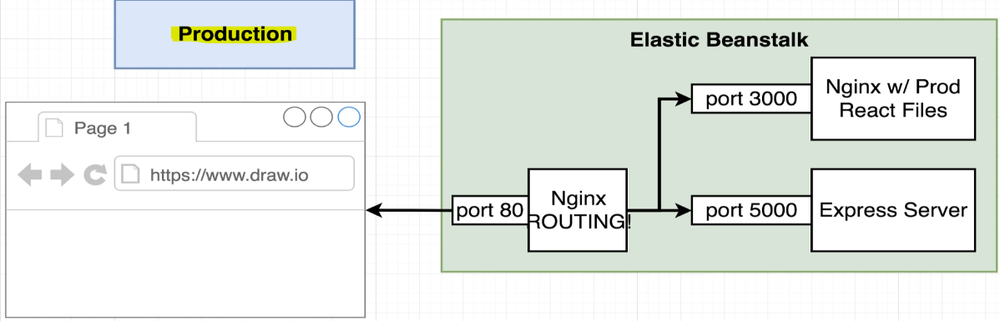
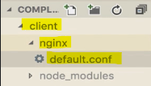
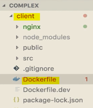

- [Section 10: A Continuous Integration Workflow for Multiple Images](#section-10-a-continuous-integration-workflow-for-multiple-images)
  - [Production Multi-Container Deployments](#production-multi-container-deployments)
    - [Review of Single Container Deployment](#review-of-single-container-deployment)
    - [Issues with Previous Approach](#issues-with-previous-approach)
    - [New Deployment Flow for Multi-Container Setup](#new-deployment-flow-for-multi-container-setup)
    - [`Using Docker Hub for Deployment`:](#using-docker-hub-for-deployment)
    - [Benefits of the New Setup](#benefits-of-the-new-setup)
  - [Production Dockerfiles](#production-dockerfiles)
    - [Creating Production Dockerfiles for Multi-Container Deployment](#creating-production-dockerfiles-for-multi-container-deployment)
    - [Current Setup](#current-setup)
    - [Worker Service](#worker-service)
    - [Server Service](#server-service)
    - [Nginx Service](#nginx-service)
    - [Steps Summary](#steps-summary)
  - [Multiple Nginx Instances](#multiple-nginx-instances)
    - [Creating a Production Dockerfile for the Client Project](#creating-a-production-dockerfile-for-the-client-project)
    - [Previous Single Container Deployment](#previous-single-container-deployment)
    - [Current Multi-Container Setup](#current-multi-container-setup)
    - [Production Setup](#production-setup)
    - [Why Two Nginx Servers?](#why-two-nginx-servers)
  - [Nginx Fix fo React Router](#nginx-fix-fo-react-router)
  - [Altering Nginx's Listen Port](#altering-nginxs-listen-port)
    - [Setting Up a Production Dockerfile for the Client Project](#setting-up-a-production-dockerfile-for-the-client-project)
    - [Creating Nginx Configuration File](#creating-nginx-configuration-file)
    - [Nginx Configuration](#nginx-configuration)
    - [Creating the Production Dockerfile](#creating-the-production-dockerfile)
    - [Dockerfile Content](#dockerfile-content)
    - [Steps Summary](#steps-summary-1)
    - [Preparing the Client Project for Deployment](#preparing-the-client-project-for-deployment)
    - [App.test.jsFile](#apptestjsfile)
      - [Issue with the Test](#issue-with-the-test)
      - [Fixing the Test](#fixing-the-test)
      - [Mocking Requests in a Real Test Suite](#mocking-requests-in-a-real-test-suite)
    - [Steps Summary](#steps-summary-2)
  - [Travis Configuration Setup](#travis-configuration-setup)
    - [Setting Up Travis CI for Multi-Container Deployment](#setting-up-travis-ci-for-multi-container-deployment)
    - [Steps in Travis Configuration](#steps-in-travis-configuration)
    - [Creating the .travis.yml File](#creating-the-travisyml-file)
    - [Configuration Details](#configuration-details)
    - [Steps Summary](#steps-summary-3)
  - [GitHub and Travis CI Setup](#github-and-travis-ci-setup)
    - [Creating a New GitHub Repository and Linking to Travis CI](#creating-a-new-github-repository-and-linking-to-travis-ci)
    - [Creating a GitHub Repository](#creating-a-github-repository)
    - [Linking GitHub Repository to Local Repository](#linking-github-repository-to-local-repository)
    - [Linking GitHub Repository to Travis CI](#linking-github-repository-to-travis-ci)
      - [Verifying Travis CI Setup](#verifying-travis-ci-setup)
    - [Steps Summary](#steps-summary-4)
  - [Pushing Images to Docker Hub](#pushing-images-to-docker-hub)
    - [Pushing Docker Images to Docker Hub Using Travis CI](#pushing-docker-images-to-docker-hub-using-travis-ci)
    - [Steps Summary](#steps-summary-5)

<br>

<hr style="height:4px;background:black">

<br>

# Section 10: A Continuous Integration Workflow for Multiple Images

## Production Multi-Container Deployments

> Objective: Deploy the application to AWS Elastic Beanstalk.

<br>

### Review of Single Container Deployment
1. Code was pushed to **GitHub**.
2. Travis CI automatically **pulled** the **repository**.
3. Travis **built an image** from the code using the Docker build command.
4. The built image was used to **test the code** with the `npm run test` command.
5. Travis **pushed the code** to **Elastic Beanstalk** using a deployment script.
6. Elastic Beanstalk **built the image** again and **deployed** it to a **web server**.

<br>


<br>

### Issues with Previous Approach
* Building images on Elastic Beanstalk was inefficient.

> Note: It required downloading dependencies and building images on the web server, which affected its primary job of serving web requests.

<br>

### New Deployment Flow for Multi-Container Setup
* We will use a Travis CI-driven deployment flow.
* Code is pushed to GitHub.
* Travis CI **pulls** the code and **starts** the **build process**.

<br>


<br>

1. `Building and Testing Images`:
   * Travis builds a test image to test the React code.
   * The test image is discarded after testing.
   * If tests pass, Travis **builds production images** for **each service** (client, Nginx, server, worker).

<br>

2. `Pushing Images to Docker Hub`:
   * Travis **pushes** the **built production images** to Docker Hub.
   * Docker Hub **hosts** both **public** and **private** **repositories** for Docker images.

<br>

### `Using Docker Hub for Deployment`:
* Docker Hub is a universal hub for Docker images.
* Many deployment services, including AWS Elastic Beanstalk and Google Cloud, can pull images from Docker Hub.
* Elastic Beanstalk will download the images from Docker Hub and use them for deployment.

<br>

### Benefits of the New Setup
* **No dependency** on Elastic Beanstalk to build images.
* **Images** are **built once** by Travis and **pushed** to **Docker Hub**.
* Deployment can be done easily from Docker Hub to various services.

<br>

<hr style="height:4px;background:black">

<br>

## Production Dockerfiles

### Creating Production Dockerfiles for Multi-Container Deployment
> **Overview**:
> * We discussed the new deployment practice using Travis CI to build images and push them to Docker Hub.
> * Elastic Beanstalk will not need to build images, making the process more efficient.
> * The first step is to create **production** versions of all Dockerfiles.

<br>

### Current Setup
* Each service currently has a **Dockerfile.**dev for **development**.
* We need to create production **Dockerfiles** for **deployment**.

<br>

### Worker Service
1. Create a new Dockerfile in the **worker** directory.
2. Copy the contents of **Dockerfile.dev** to the new Dockerfile.
3. Change the startup command from `npm run dev` to `npm run start`.
4. Verify the start script exists in **package.json**.

<br>


<br>

### Server Service
1. Create a new Dockerfile in the **server** directory.
2. Copy the contents of **Dockerfile.dev** to the new Dockerfile.
3. Change the startup command from `npm run dev` to `npm run start`.
4. Verify the start script exists in **package.json**.

<br>


<br>

### Nginx Service
1. Create a new Dockerfile in the **Nginx** directory.
2. Copy the contents of **Dockerfile.dev** to the new Dockerfile.
3. Copy the **default.conf** file to the Nginx image to **override** the **default configuration**.

> **Note**: For a more production-specific setup, you might create a separate default.conf **without** development-specific configurations like web socket routing.

<br>


<br>

### Steps Summary
1. `Create Production Dockerfiles`:
   * **Worker**: Copy Dockerfile.dev to Dockerfile and change the startup command.
   * **Server**: Copy Dockerfile.dev to Dockerfile and change the startup command.
   * **Nginx**: Copy Dockerfile.dev to Dockerfile and copy default.conf.

2. `Verify start Script`:
   * Ensure the start script exists in the package.json file for both worker and server services.

3. `Optional Production-Specific Configuration`:
   * Consider creating a separate default.conf for Nginx without development-specific configurations.

<br>

<hr style="height:4px;background:black">

<br>

## Multiple Nginx Instances

### Creating a Production Dockerfile for the Client Project
> **Overview**:
> * We are creating a production Dockerfile for a React project.

<br>

### Previous Single Container Deployment
* We used a **multi-stage **Dockerfile for the React application.
  * The **first** stage used a **Node image** to install dependencies and build production assets.
  * The **second** stage used an **Nginx image** to serve the production assets on port 80.

<br>


<br>

### Current Multi-Container Setup
* In the **development** environment, the **browser** makes **requests** to an initial **Nginx server** responsible for routing.
* Requests for React assets are forwarded to port 3000 on the React server.

<br>


<br>

### Production Setup
* We will have an **Nginx server** dedicated to serving **production** React files.
* This Nginx server will listen on **port 3000** instead of port 80.
* Users will **access** this Nginx server through another **Nginx server responsible for routing**.

<br>



<br>

### Why Two Nginx Servers?
* While we could use a single Nginx server for both routing and serving production files, there are reasons to use two:
  * Different services might be used for **routing** and **serving files**.
  * This setup is more **realistic** for **real-world production** deployments.

<br>

<hr style="height:4px;background:black">

<br>

## Nginx Fix fo React Router
* In the next lecture, we will be adding some Nginx config to the client-side project, but I neglected to add one line that would get the **Nginx server to work correctly when using React Router**!

In the **client/nginx/default.conf** file, please add the following line to the end of the location directive:

```conf
    try_files $uri $uri/ /index.html;
```

The **default.conf** should now look like this:

```conf
server {
  listen 3000;
 
  location / {
    root /usr/share/nginx/html;
    index index.html index.htm;
    try_files $uri $uri/ /index.html;
  }
}
```

<br>

<hr style="height:4px;background:black">

<br>

## Altering Nginx's Listen Port

### Setting Up a Production Dockerfile for the Client Project
> **Overview**:
> * We need to set up a different Dockerfile for the **client** project to **customise Nginx** to listen on port 3000.

<br>

### Creating Nginx Configuration File
1. Inside the **client** project, create a new folder called **nginx**.
2. Inside the **nginx** folder, create a file called **default.conf**.
   * This file will contain the configuration for the Nginx server.

<br>



<br>

### Nginx Configuration
* The **default.conf** file should contain the following configuration:

```nginx
server {
  listen 3000;
  location / {
    root /usr/share/nginx/html;
    index index.html index.htm;
  }
}
```

* This configuration ensures that Nginx listens on **port 3000** and serves the React **production files** from **/usr/share/nginx/html**.

<br>


<br>

### Creating the Production Dockerfile
* Inside the **client** directory, create a new file called **Dockerfile**.
* This Dockerfile will use a **multi-step build process** similar to the previous setup.
  * Configuring Nginx to listen on port 3000 ensures that it **aligns** with the **routing setup** in the multi-container environment.

<br>



<br>

### Dockerfile Content

The Dockerfile should look like this:

```dockerfile
# Step 1: Build the React application
FROM node:alpine as builder
WORKDIR /app
COPY package.json ./
RUN npm install
COPY . ./
RUN npm run build

# Step 2: Serve the React application with Nginx
FROM nginx
EXPOSE 3000
COPY nginx/default.conf /etc/nginx/conf.d/default.conf
COPY --from=builder /app/build /usr/share/nginx/html
```

<bR>


<br>

> 1. The first step builds the React application.
> 2. The second step sets up Nginx to serve the built files and listens on port 3000.

<br>

### Steps Summary
1. `Create Nginx Configuration File`:
   * Create **nginx/default.conf** with the necessary configuration.

2. `Create Production Dockerfile`:
   * Create Dockerfile in the **client** directory.
   * Use a multi-step build process to build the React application and set up Nginx.

3. `Nginx Configuration`:
   * Ensure Nginx listens on port **3000** and serves the React **production files**.

<br>

### Preparing the Client Project for Deployment
* Before deploying the client project, we need to ensure that the test suite runs successfully.

<br>

### App.test.jsFile
* Inside the `/client/src` directory, locate the **App.test.js** file.
  * This file contains a simple test to assert that the app component **renders without crashing**.

<br>

#### Issue with the Test
* The app component now attempts to render the **fib** component.
* The fib component tries to make a **request to the backend Express server**, which may not be running during the test.
> Note: This can cause the test to crash.

<br>

#### Fixing the Test
* To ensure the test runs successfully, delete the three lines of tests in the **App.test.js** file.
* Save the file after making this change.

<br>


<br>

#### Mocking Requests in a Real Test Suite
* In a real test suite, instead of making requests to the actual Express API, you would set up a **mock module**.
* The mock module would **return dummy JSON data** quickly, ensuring the test runs smoothly.
* After making the changes, the test suite should pass 100% of the time.

<br>

### Steps Summary
1. `Locate App.test.js`:
   * Find the App.test.js file in the /client/src directory.

2. `Delete Test Lines`:
   * Remove the three lines of tests to prevent crashes.

3. `Save the File`:
   * Save the App.test.js file after making the changes.

4. `Mock Requests in Real Test Suite`:
   * Use a mock module to simulate API requests in a real test suite.

5. `Ensure Test Suite Passes`:
   * Verify that the test suite passes without any issues.

<br>

<hr style="height:4px;background:black">

<br>

## Travis Configuration Setup

### Setting Up Travis CI for Multi-Container Deployment
> **Overview**:
> * We need to configure Travis CI to handle our build process when we push code to GitHub.
> * The configuration will be specified in the **.travis.yml** file.

<br>

### Steps in Travis Configuration
1. Specify Docker as a **dependency**.
2. Build a **test** version of the React project using the **development** Dockerfile.
3. Run tests on the **React** project.
4. If tests pass, build production versions of all sub-projects.
5. **Push** the production images to Docker Hub.
6. Tell Elastic Beanstalk to **update**.

<br>


<br>

### Creating the .travis.yml File
   * In the **root** project directory, create a new file called **.travis.yml**.
   * Ensure the file has a leading dot (.).

`Travis Configuration`:
* The configuration will look similar to previous Travis files but with some additions for multi-container setup.

<br>


<br>

### Configuration Details

1. `Specify Docker as a Dependency`:

```yaml
sudo: required
services:
  - docker
```

<br>


<br>

2. `Before Install Step`:
   * Build a test version of the **client** project using the **development** Dockerfile.

```yaml
before_install:
  - docker build -t your_docker_id/react-test -f ./client/Dockerfile.dev ./client
```

<br>


<br>

3. `Script Section`:
   * Run tests using the built image.

```yaml
script:
  - docker run your_docker_id/react-test npm test -- --coverage
```

<br>


<br>

4. `After Success Block`:
   * Build production versions of all sub-projects and push them to Docker Hub.

```yaml
after_success:
  - docker build -t your_docker_id/multi-client ./client
  - docker build -t your_docker_id/multi-nginx ./nginx
  - docker build -t your_docker_id/multi-server ./server
  - docker build -t your_docker_id/multi-worker ./worker
```

<br>


<br>

5. `Running Tests`:
   * The script section runs tests on the React project using the development Dockerfile.
   * If tests pass, the after success block builds and pushes production images.

<br>

### Steps Summary
1. `Create .travis.yml File`:
   * Create the file in the root project directory with a leading dot.

2. `Specify Docker as a Dependency`:
   * Add Docker to the services section.

3. `Build Test Version`:
   * Use the development Dockerfile to build a test version of the client project.

4. `Run Tests`:
   * Run tests using the built image and ensure they pass.

5. `Build and Push Production Images`:
   * Build production images for all sub-projects.
   * Push the images to Docker Hub.

<br>

<hr style="height:4px;background:black">

<br>

## GitHub and Travis CI Setup


<br>

### Creating a New GitHub Repository and Linking to Travis CI
> **Overview**:
> * We need to create a new **GitHub** repository and **link** it to **Travis CI**.
> * This will allow Travis CI to build and test our code whenever we push changes to GitHub.

<br>

1. `Creating a New Git Repository`:
   * Open the terminal and navigate to the project directory (e.g., complex directory).

<br>

2. `Initialise a new Git repository`:

```sh
git init
```

3. `Add all the code to the repository`:

```sh
git add .
```

4. `Commit the code with a message`:

```sh
git commit -m "initial commit"
```

<br>

### Creating a GitHub Repository
1. Go to GitHub and click on the plus button in the top right corner.
2. Select "New Repository".
3. Enter a repository name (e.g., multi-docker).
4. Ensure the repository is public and click "Create Repository".

<br>

### Linking GitHub Repository to Local Repository
1. Copy the remote repository URL provided by GitHub.
2. In the terminal, set up the remote repository:

```sh
git remote add origin <remote-repository-URL>
```

<bR>

1. `Verify the remote repository`:

```sh
git remote -v
```

<br>

2. `Push the code to GitHub`:

```sh
git push origin master
```

<br>

### [Linking GitHub Repository to Travis CI](ci-and-deployment.md#travis-ci-setup)
1. Go to Travis CI and sign in with your GitHub account.
2. Click on "Profile" in the top right corner.
3. Click on "Sync Account" to refresh the list of repositories.
4. Find the newly created repository (e.g., multi-docker) and enable it by clicking the slider.

<bR>

#### Verifying Travis CI Setup
* Go to the Travis CI dashboard and check if the new repository appears.
* Travis CI might attempt to build the repository, but without a **.travis.yml** file, it will show an error, which is expected.

<br>

### Steps Summary
1. `Create Git Repository`:
   * Initialise a new Git repository, add code, and commit changes.

2. `Create GitHub Repository`:
   * Create a new repository on GitHub and set it to public.

3. `Link Repositories`:
   * Set up the remote repository and push code to GitHub.

4. `Link to Travis CI`:
   * Enable the repository on Travis CI and sync the account.

5. `Verify Setup`:
   * Check the Travis CI dashboard for the new repository.

<br>

<hr style="height:4px;background:black">

<br>

## Pushing Images to Docker Hub

### Pushing Docker Images to Docker Hub Using Travis CI
> **Overview**:
> * We need to add steps to our Travis CI configuration to push built images to Docker Hub.
> * This involves logging into the Docker CLI and pushing the images.

<br>


<br>

1. `Logging into Docker CLI`:
   * To push images to Docker Hub, we need to **log into** the **Docker CLI**.
   * We previously logged into Docker CLI using docker login and entered our Docker ID and password.
   * We need to do the same in our Travis CI **script** but securely.

<br>


<bR>

2. `Using Encrypted Environment Variables`:
   * We will use encrypted **environment variables** in Travis CI to store our Docker ID and password securely.
   * These variables will be accessible only by Travis CI.

<br>

3. `Setting Up Environment Variables in Travis CI`:
   * Go to the Travis CI **project settings** for the new repository.
   * Add two environment variables: DOCKER_ID and DOCKER_PASSWORD.
   * Enter your Docker ID and password as the values for these variables.

<br>


<br>

4. `Updating .travis.yml File`:
   * Add a script to log into Docker CLI using the environment variables.

Use the following command to log in:

```yaml
echo "$DOCKER_PASSWORD" | docker login -u "$DOCKER_ID" --password-stdin
```

<br>


<br>

5. `Pushing Images to Docker Hub`:
   * After logging in, add commands to push the images to Docker Hub.

Use the following commands to push the images:

```yaml
- docker push your_docker_id/multi-client
- docker push your_docker_id/multi-nginx
- docker push your_docker_id/multi-server
- docker push your_docker_id/multi-worker
```

<br>


<br>

6. `Testing the Script`:
   * Commit the changes to the **.travis.yml** file and push them to GitHub.
   * Travis CI will run the build process and attempt to push the images to Docker Hub.

<bR>


<br>

### Steps Summary
1. `Set Up Environment Variables`:
   * Add DOCKER_ID and DOCKER_PASSWORD to Travis CI project settings.

2. `Update .travis.yml File`:
   * Add a script to log into Docker CLI using the environment variables.
   * Add commands to push the images to Docker Hub.

3. `Test the Script`:
   * Commit and push the changes to GitHub.

<br>

<hr style="height:4px;background:black">

<br>
