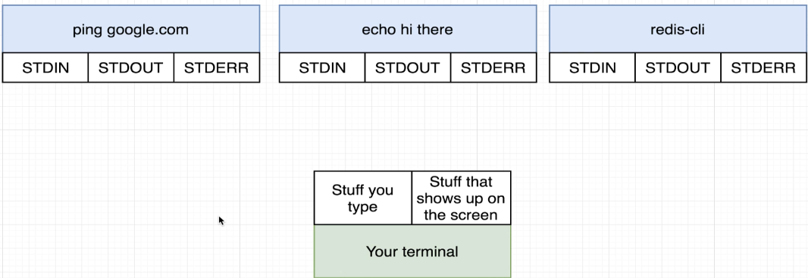

- [Section 1: Dive into Docker](#section-1-dive-into-docker)
  - [Why Use Docker?](#why-use-docker)
    - [Traditional Software Installation](#traditional-software-installation)
    - [Docker's Solution](#dockers-solution)
  - [Demonstration: Installing Redis](#demonstration-installing-redis)
    - [Traditional Installation](#traditional-installation)
    - [Using Docker](#using-docker)
    - [Benefits of Using Docker](#benefits-of-using-docker)
  - [What is Docker?](#what-is-docker)
    - [Key Terminology](#key-terminology)
      - [Container](#container)
      - [Image](#image)
    - [Example Command](#example-command)
  - [Using the Docker Client](#using-the-docker-client)
      - [First Command with Docker CLI](#first-command-with-docker-cli)
    - [Steps Executed by the Command](#steps-executed-by-the-command)
    - [Key Points](#key-points)
    - [Summary](#summary)
  - [What is a Container?](#what-is-a-container)
    - [Understanding Containers](#understanding-containers)
      - [Hypothetical Scenario](#hypothetical-scenario)
    - [Namespacing and Control Groups](#namespacing-and-control-groups)
    - [What is a Container?](#what-is-a-container-1)
    - [Relationship Between Containers and Images](#relationship-between-containers-and-images)
    - [Summary](#summary-1)
- [Section 2: Manipulating Containers with the Docker Client](#section-2-manipulating-containers-with-the-docker-client)
  - ['Docker Run' in Detail](#docker-run-in-detail)
    - [Basic Docker Commands](#basic-docker-commands)
    - [Running a Container](#running-a-container)
    - [What Happens When You Run the Command](#what-happens-when-you-run-the-command)
    - [Key Points](#key-points-1)
    - [Summary](#summary-2)
  - [Overriding Default Commands](#overriding-default-commands)
    - [Creating and Running a Container from an Image](#creating-and-running-a-container-from-an-image)
    - [Docker Run Command Variations](#docker-run-command-variations)
    - [Overriding the Default Command](#overriding-the-default-command)
    - [Examples](#examples)
      - [Echo Command](#echo-command)
      - [LS Command](#ls-command)
    - [Key Points](#key-points-2)
    - [Summary](#summary-3)
  - [Listing Running Containers](#listing-running-containers)
    - ['docker ps'](#docker-ps)
    - [Example Scenario](#example-scenario)
    - [Viewing Running Containers](#viewing-running-containers)
    - [Stopping a Running Container](#stopping-a-running-container)
    - [Viewing All Containers](#viewing-all-containers)
    - [Key Points](#key-points-3)
    - [Summary](#summary-4)
  - [Container Lifecycle](#container-lifecycle)
    - [Creation and Running a Container](#creation-and-running-a-container)
    - [Creating and Starting a Container](#creating-and-starting-a-container)
    - [Key Points](#key-points-4)
    - [Summary](#summary-5)
  - [Restarting Stopped Containers](#restarting-stopped-containers)
    - [Investigating Container Status](#investigating-container-status)
    - [Creating, Running, and Stopping Containers](#creating-running-and-stopping-containers)
      - [Create and Run a Container](#create-and-run-a-container)
      - [Start an Exited Container:](#start-an-exited-container)
    - [Key Points](#key-points-5)
    - [Example Scenario](#example-scenario-1)
    - [Summary](#summary-6)
  - [Removing Stopped Containers](#removing-stopped-containers)
    - [Viewing Stopped Containers](#viewing-stopped-containers)
    - [Deleting Stopped Containers](#deleting-stopped-containers)
    - [Steps to Delete Stopped Containers](#steps-to-delete-stopped-containers)
    - [Key Points](#key-points-6)
    - [Summary](#summary-7)
  - [Retrieving Log Outputs](#retrieving-log-outputs)
    - [Starting and Creating Containers](#starting-and-creating-containers)
    - [Viewing Container Logs](#viewing-container-logs)
    - [Example Scenario](#example-scenario-2)
    - [Key Points](#key-points-7)
    - [Summary](#summary-8)
  - [Stopping Containers](#stopping-containers)
    - [Stopping a Running Container](#stopping-a-running-container-1)
    - [Example Scenario](#example-scenario-3)
    - [Key Points](#key-points-8)
    - [Summary](#summary-9)
  - [Multi-Command Containers](#multi-command-containers)
    - [Redis and Docker](#redis-and-docker)
    - [Running Redis Without Docker](#running-redis-without-docker)
    - [Running Redis with Docker](#running-redis-with-docker)
    - [Key Points](#key-points-9)
    - [Summary](#summary-10)
  - [Executing Commands in Running Containers](#executing-commands-in-running-containers)
    - [Starting Redis CLI Inside a Docker Container](#starting-redis-cli-inside-a-docker-container)
    - [Steps to Start Redis CLI Inside the Container](#steps-to-start-redis-cli-inside-the-container)
    - [Key Points](#key-points-10)
    - [Example Scenario](#example-scenario-4)
    - [Summary](#summary-11)
  - [The Purpose of the -it Flag](#the-purpose-of-the--it-flag)
    - [Understanding the -IT Flag](#understanding-the--it-flag)
    - [Example Scenario](#example-scenario-5)
    - [Key Points](#key-points-11)
    - [Summary](#summary-12)
  - [Getting a Command Prompt in a Container](#getting-a-command-prompt-in-a-container)
    - [Getting Shell Access to a Running Container](#getting-shell-access-to-a-running-container)
    - [Steps to Get Shell Access](#steps-to-get-shell-access)
    - [Example Commands Inside the Shell](#example-commands-inside-the-shell)
    - [Key Points](#key-points-12)
    - [What is SH?](#what-is-sh)
    - [Summary](#summary-13)
  - [Starting with a Shell](#starting-with-a-shell)
    - [Using Docker Run to Start a Shell](#using-docker-run-to-start-a-shell)
    - [Example Scenario](#example-scenario-6)
    - [Key Points](#key-points-13)
    - [Summary](#summary-14)
  - [Container Isolation](#container-isolation)
    - [Container File Systems](#container-file-systems)
    - [Example Scenario](#example-scenario-7)
    - [Key Points](#key-points-14)
    - [Summary](#summary-15)
- [Section 3: Building Custom Images Through Docker Server](#section-3-building-custom-images-through-docker-server)
  - [Creating Docker Images](#creating-docker-images)
    - [Using Pre-built Images](#using-pre-built-images)
    - [Building Custom Images](#building-custom-images)
    - [What is a Dockerfile?](#what-is-a-dockerfile)
    - [Steps to Create a Dockerfile](#steps-to-create-a-dockerfile)
    - [Key Components of a Dockerfile](#key-components-of-a-dockerfile)
    - [Summary](#summary-16)
  - [Buildkit for Docker Desktop](#buildkit-for-docker-desktop)
    - [Objective](#objective)
    - [Steps to Create a Custom Dockerfile](#steps-to-create-a-custom-dockerfile)
    - [Summary](#summary-17)
  - [Dockerfile Teardown](#dockerfile-teardown)
    - [Recap of Dockerfile Creation](#recap-of-dockerfile-creation)
    - [Understanding Dockerfile Instructions](#understanding-dockerfile-instructions)
    - [Key Instructions in Dockerfile](#key-instructions-in-dockerfile)
    - [Arguments to Instructions](#arguments-to-instructions)
    - [Summary](#summary-18)
  - [What's a Base Image?](#whats-a-base-image)
    - [Analogy for Dockerfile Instructions](#analogy-for-dockerfile-instructions)
    - [Purpose of Dockerfile Instructions](#purpose-of-dockerfile-instructions)
    - [Why Use Alpine as a Base Image?](#why-use-alpine-as-a-base-image)
    - [Summary](#summary-19)
  - [The Build Process in Detail](#the-build-process-in-detail)
    - [Purpose of Docker Build Command](#purpose-of-docker-build-command)
    - [Steps in the Docker Build Process](#steps-in-the-docker-build-process)
      - [`Step 1`: FROM Alpine](#step-1-from-alpine)
      - [`Step 2`: RUN apk add --update Redis](#step-2-run-apk-add---update-redis)
      - [`Step 3`: CMD \["Redis-server"\]](#step-3-cmd-redis-server)
    - [Key Concepts](#key-concepts)
    - [Specifying the Startup Command](#specifying-the-startup-command)
    - [End Result](#end-result)
    - [Key Takeaway](#key-takeaway)
  - [A Brief Recap](#a-brief-recap)
    - [Key Steps in the Docker Build Process](#key-steps-in-the-docker-build-process)
    - [Summary](#summary-20)
  - [Rebuilds with Cache](#rebuilds-with-cache)
    - [Key Concept: Docker Build Cache](#key-concept-docker-build-cache)
    - [Example: Adding a New Instruction](#example-adding-a-new-instruction)
    - [Rebuilding the Image](#rebuilding-the-image)
    - [Using the Cache](#using-the-cache)
    - [Order of Instructions](#order-of-instructions)
    - [Summary](#summary-21)
  - [Tagging an Image](#tagging-an-image)
    - [Creating a Custom Image](#creating-a-custom-image)
    - [Running a Container](#running-a-container-1)
    - [Tagging the Image](#tagging-the-image)
    - [Using the Tagged Image](#using-the-tagged-image)
    - [Understanding Tags](#understanding-tags)
    - [Summary](#summary-22)
  - [Manual Image Generation with Docker Commit](#manual-image-generation-with-docker-commit)
    - [Steps to Manually Create an Image](#steps-to-manually-create-an-image)
    - [Key Points](#key-points-15)
    - [Summary](#summary-23)

 

 

# Section 1: Dive into Docker

## Why Use Docker?

### Traditional Software Installation
* Download installer.
* Run installer.
* Encounter error messages.
* Troubleshoot using Google.
* Solve the issue and rerun the installer.
* Face new errors and repeat the troubleshooting process.

 

 

### Docker's Solution
* Simplifies the installation and running of software on any computer (personal, web servers, cloud platforms).
* Eliminates the need for extensive troubleshooting and dependency installation.

 

## Demonstration: Installing Redis
### Traditional Installation 
* Visit Redis homepage and download page.
  * www.redis.io/download
* Follow installation commands.
* Encounter error messages due to missing programs.

* Troubleshoot and install missing programs.
* Repeat the process.

> Notice how difficult this was?

 

### Using Docker
* Run a single command: `docker run -it redis`.
* Instantly have Redis up and running without errors or additional setup.

 

 

### Benefits of Using Docker
* Easy and straightforward software installation.
* No need for extensive setup or dependency installation.
* Consistent environment across different machines and platforms.

 

 

## What is Docker?
* `Ecosystem of Projects and Tools`: Docker refers to an entire ecosystem of different projects, tools, and pieces of software.
* `Components`: When someone mentions using Docker, they might be referring to:
  * Docker Client
  * Docker Server
  * Docker Hub
  * Docker Compose

 

 

### Key Terminology
#### Container
* A container is an **instance** of an image, similar to a running program. 
* It has its own **isolated** set of **hardware resources**, including memory, networking, and storage.

 

#### Image
* An image is a **single file** containing **all** the **dependencies** and **configuration** required to **run** a specific program. 
* It is stored on your **hard drive** and can be **used** to **create containers**.

 

 

### Example Command
`Docker Run Redis`: When running the command docker run redis, the Docker CLI reaches out to Docker Hub and downloads an image file. This image contains everything needed to run Redis.

 

 

## Using the Docker Client

#### First Command with Docker CLI
* Command: `docker run hello-world`
* **Purpose**: This command runs a simple program that prints a "hello from Docker" message.

### Steps Executed by the Command
* `Execution`: Running docker run hello-world starts the Docker client (CLI).
* `Communication`: The Docker CLI processes the command and communicates it to the Docker server.
* `Image Check`: The Docker server checks if the "hello-world" image is available locally.
* `Image Download`: If the image is not found locally, the Docker server downloads it from Docker Hub.
* `Container Creation`: The Docker server creates a container from the downloaded image.
* `Program Execution`: The container runs the program inside the image, which prints the "hello from Docker" message.

 

 

### Key Points
* `Image Cache`: The first time you run the command, the image is downloaded and stored in the ImageCache. Subsequent runs use the cached image, making the process faster.
* `Docker Hub`: A repository of free public images that can be downloaded and run on your personal computer.

### Summary
* `Docker CLI`: Takes commands from the user and communicates them to the Docker server.
* `Docker Server`: Handles the heavy lifting, including checking for images, downloading them, and creating containers.
* `Image and Container`: An image is a file with all dependencies and configurations, while a container is a running instance of an image.

 

 

## What is a Container?

### Understanding Containers
* Most operating systems have a `kernel`, a running software process that **manages access between programs and physical hardware**.
  * Programs like Chrome, Terminal, Spotify, or Node.jsinteract with the kernel through system calls to access hardware resources.

 

#### Hypothetical Scenario
**Example**: Imagine Chrome requires Python version 2 and Node.jsrequires Python version 3, but only Python version 2 is available on the hard drive.

**Solution**: Use an operating system feature called namespacing to segment hardware resources, allowing different programs to access different versions of Python.

 

### Namespacing and Control Groups
* `Namespacing`: **Isolates resources** per process or group of processes,** directing system calls** to specific **hardware segments**.
* `Control Groups`: **Limits** the **amount of resources** (memory, CPU, hard drive I/O, network bandwidth) a process can use.

 

### What is a Container?
* A container is a **process** or set of processes with a **grouping of resources** specifically **assigned to it**.
* `Function`: The kernel** directs system calls** from the container to specific portions of hardware resources (hard drive, RAM, CPU).

 

 

### Relationship Between Containers and Images
* `Image`: A **file system snapshot** containing a specific set of directories or files and a startup command.

 

* `Creating a Container`: The **kernel isolates a section** of the hard drive, **places the file snapshot from the image into it**, and **executes** the **startup command** to **create a running process** (container).

 

 

### Summary
* `Containers`: Isolated processes with dedicated resources, created from images.
* `Images`: File system snapshots with all necessary files and startup commands to create containers.

 

 

# Section 2: Manipulating Containers with the Docker Client

## 'Docker Run' in Detail

### Basic Docker Commands
* `Docker Client` (CLI): The Docker CLI is used to interact with Docker containers and images through the terminal.

### Running a Container
* **Command**: `docker run [image_name]`
  * **Example**: docker run hello-world
* **Purpose**: This command creates and runs a container using the specified image.

 

 

### What Happens When You Run the Command
* `Image on Hard Disk`: The image (e.g., hello-world) is a file system snapshot with a single program inside it.
* `Creating a Container`: The snapshot is placed into a container (a grouping of resources).
* `Executing the Command`: The command runs the program inside the container, which then executes and eventually exits.

 

 

### Key Points
* There are many variations and subtleties to the docker run command that can be explored further.

### Summary
* `Docker CLI`: Used to create and run containers using images.
* Image and Container: An image is a file system snapshot, and a container is a running instance of that image.

 

 

## Overriding Default Commands

### Creating and Running a Container from an Image

 

### Docker Run Command Variations
* **Default Command**: When you execute `docker run` with an image, it runs a default command specified in the image.

 

### Overriding the Default Command
* **Syntax**: `docker run [image_name] [alternate_command]`
  * **Example**: docker run busybox echo hi there
* **Purpose**: This allows you to override the default command with an alternate command to be executed inside the container.

 

### Examples
#### Echo Command
* Command: `docker run busybox echo hi there`
* **Output**: Prints "hi there" in the terminal.

#### LS Command
* Command: `docker run busybox ls`
* **Output**: Lists all files and folders inside the container's directory (e.g., bin, dev, etc., home, proc, root, system, user, var).
  * These folders exist souly inside this container. 

 

 

### Key Points
* `Busybox Image`: Contains programs like **ls** and **echo**, allowing these commands to be executed inside the container.

 

 

* `Hello World Image`: Only contains a single program to print a message, so alternate commands like ls and echo will result in errors.

 

 

### Summary
* `Docker Run Command`: Used to create and run containers with specified images.
* `Overriding Commands`: You can override the default command in an image with an alternate command to be executed inside the container.

 

 

## Listing Running Containers

 

### 'docker ps'
* **Purpose**: The docker ps command lists all the running containers on your machine.
* Command: `docker ps`
* **Output**: Displays a table with headers but no entries if no containers are running.

 

### Example Scenario
* `Short-Lived Containers`: Containers that run quickly and then exit (e.g., docker run busybox echo hi there) will not appear in the docker ps output.
* `Long-Running Containers`: To see a container in the docker ps output, run a command that keeps the container active for a longer time (e.g., docker run busybox ping google.com).

 

### Viewing Running Containers
* **Run a Long-Running Command**: `docker run busybox ping google.com`
* **Open a Second Terminal Window**: Execute `docker ps` to see the running container.
* **Output**: Displays container ID, image, command, creation time, status, ports, and a randomly generated name.

 

 

### Stopping a Running Container
* **Stop Command**: Press `Ctrl` + `C` in the terminal running the ping command to stop the container.
* **Verify**: Running `docker ps` again will show no running containers.

 

### Viewing All Containers
* **Command**: `docker ps --all`
* **Output**: Lists all containers ever created on your machine, including those that have exited.

 

### Key Points
* `Container ID`: Useful for issuing commands on specific containers.
* `Randomly Generated Name`: Each container is assigned a unique name for identification.

 

### Summary
* `Docker PS Command`: Used to list running containers and their details.
* `Viewing All Containers`: Use **docker ps --all** to see all containers, including those that have exited.

 

 

## Container Lifecycle

 

### Creation and Running a Container
* Creating and running a container are two separate processes
  * `Docker Run`: Combines creating and starting a container.
  * `Docker Create`: Prepares the file system for the container.
  * `Docker Start`: Executes the startup command inside the container.

 

### Creating and Starting a Container
1. `Create Command`: docker create [image_name]
   * **Example**: docker create hello-world
   * **Output**: Container ID

 

2. `Start Command`: docker start [container_id]
   * **Example**: docker start -a [container_id]
   * **-a flag**: Attaches to the container and prints output to the terminal.

 

 

### Key Points
* `File System Preparation`: Creating a container involves setting up the file system.
* `Executing Startup Command`: Starting a container runs the specified command inside it.
* `Output Visibility`: docker run shows logs by default, while docker start requires the **-a** flag to show output.

### Summary
* `Docker PS`: Lists running containers.
* `Container Lifecycle`: Involves creating and starting containers with separate commands.
* `Output Control`: Use **-a** flag with docker start to see container output.

 

 

## Restarting Stopped Containers

### Investigating Container Status
* `docker ps --all`: Lists all containers that have ever been started on your machine, including those that have exited.

 

### Creating, Running, and Stopping Containers
#### Create and Run a Container
* Command: `docker run busybox echo hi there`
* **Output**: Container ID and status (exited).

#### Start an Exited Container:
* Command: `docker start -a [container_id]`
* **Output**: Re-runs the default command and prints "hi there" again.

 

### Key Points
* `Exited Containers`: Containers that have stopped can be started again using their ID.
* `Default Command`: Once a container is created, the default command cannot be replaced. Starting the container will reissue the original command.

 

### Example Scenario
BusyBox Image:
* Created and ran a container with **docker run busybox echo hi there**.
* Verified the container's status as exited with **docker ps --all**.
* Started the container again with **docker start -a [container_id]**, which re-ran the echo command.

 

 

### Summary
* `Container Lifecycle`: Understanding the lifecycle of a container is crucial for troubleshooting and debugging.
* `Docker Commands`: **docker ps --all** to list all containers, **docker start -a** to start an exited container and see its output.

 

 

## Removing Stopped Containers

### Viewing Stopped Containers
* Command: `docker ps --all`
* Output: Lists all containers, including those that have stopped.

### Deleting Stopped Containers
* Command: `docker system prune`

> Warning: This command deletes stopped containers and other items, including the build cache (images fetched from Docker Hub).

* `Re-download Images`: After running this command, you will need to re-download images from Docker Hub, which may take a few seconds.

 

### Steps to Delete Stopped Containers
1. Run Command: `docker system prune`
2. **Confirm**: Enter "yes" to confirm the deletion.
3. **Output**: The command will display the deleted containers and the amount of space reclaimed.
4. **Verify**: Run `docker ps --all` again to ensure no stopped containers remain.

 

### Key Points
* `Disk Space Management`: Regularly running docker system prune helps free up disk space by deleting unused containers and images.
* `Build Cache`: Be aware that the build cache will also be deleted, requiring re-download of images.

### Summary
* `Docker System Prune`: A useful command to clear stopped containers and free up disk space.
* `Regular Maintenance`: Running this command periodically helps manage disk space effectively.

 

 

## Retrieving Log Outputs

 

### Starting and Creating Containers
* `Docker Create`: Prepares the file system for the container.
  * Example command: docker create busybox echo hi there
  * **Output**: Container ID
* `Docker Start`: Executes the startup command inside the container.
  * Example command: docker start -a [container_id]
  * **-a flag**: Attaches to the container and prints output to the terminal.

 

### Viewing Container Logs
* `Docker Logs`: Retrieves all the information emitted from a container without rerunning or restarting it.
* Example command: docker logs [container_id]
* **Output**: Displays the logs from the container.

 

### Example Scenario
1. Create a Container
   * Command: `docker create busybox echo hi there`
   * Output: Container ID

2. Start the Container
   * Command: `docker start [container_id]`
   * Output: Container runs and exits.

3. Retrieve Logs
   * Command: `docker logs [container_id]`
   * Output: Displays "hi there" from the container logs.

 

### Key Points
* `Logs Command`: Useful for debugging and inspecting containers.
* `Output Visibility`: docker logs provides a record of all logs emitted from the container.

### Summary
* `Docker Create and Start`: Used to prepare and execute containers.
* `Docker Logs`: Retrieves logs from containers without restarting them.

 

 

## Stopping Containers

### Stopping a Running Container
* `Docker Stop`: Sends a SIGTERM signal to the process inside the container, allowing it to shut down gracefully.
  * **Example command**: docker stop [container_id]
  * If the container does not stop within 10 seconds, Docker automatically sends a SIGKILL signal.

 

 

* `Docker Kill`: Sends a SIGKILL signal to the process inside the container, forcing it to shut down immediately.
  * **Example command**: docker kill [container_id]

 

 

### Example Scenario
1. `Create a Container`
   * **Command**: docker create busybox ping google.com
   * **Output**: Container ID

2. `Start the Container`
   * **Command**: docker start [container_id]
   * **Output**: Container runs and continues executing the ping command.

3. `Stop the Container`
   * **Command**: docker stop [container_id]
   * **Output**: Waits 10 seconds, then sends a SIGKILL signal if the container does not stop.

 

4. `Kill the Container`
   * **Command**: docker kill [container_id]
   * **Output**: Instantly stops the container.

 

### Key Points
* `Logs Command`: Useful for debugging and inspecting containers.
* `Stop vs. Kill`: Use docker **stop** to allow **graceful** shutdown, and docker **kill** for immediate **termination**.

### Summary
* `Docker Create and Start`: Used to prepare and execute containers.
* `Docker Logs`: Retrieves logs from containers without restarting them.
* `Docker Stop and Kill`: Commands to stop running containers, with docker stop allowing for graceful shutdown and docker kill forcing immediate termination.

 

 

## Multi-Command Containers

### Redis and Docker
* `Redis`: An in-memory data store commonly used with web applications.
* `Docker`: A platform that makes it easy to run applications in containers.

### Running Redis Without Docker
1. `Install Redis`: Install Redis directly on your local machine.
2. `Start Redis Server`: Run the command redis-server to start the Redis server.
3. `Use Redis CLI`: Open a second terminal window and run redis-cli to interact with the Redis server.
   * **Example Commands**:
     * SET mynumber 5: Stores the value 5 with the key "mynumber".
     * GET mynumber: Retrieves the value stored with the key "mynumber".

 

### Running Redis with Docker
1. `Start Redis Container`: Run the command **docker run redis** to start a Redis instance using Docker.
   * The Redis server will start inside the Docker container.
   * Ensure the last line says "ready to accept connections" to confirm it's running.

2. `Accessing Redis CLI`
   * Running redis-cli outside the container will not work because the Redis server is inside the container.
   * To use Redis CLI, you need to execute the command [inside the running container](#executing-commands-in-running-containers).

 

 

### Key Points
* `Redis CLI`: A tool to interact with the Redis server, allowing you to set and get data.
* `Docker Container`: Isolates the Redis server, so commands must be run inside the container to interact with it.

### Summary
* `Running Redis`: You can run Redis directly on your machine or inside a Docker container.
* `Interacting with Redis`: Use Redis CLI to interact with the Redis server, but ensure you run it inside the container if using Docker.

 

 

## Executing Commands in Running Containers
Execute an additional command in a container:

 

### Starting Redis CLI Inside a Docker Container
* Used to execute an additional command inside a running container.
* **Syntax**: `docker exec -it [container_id] [command]`
* `-it flag`: Allows you to type input directly into the container.

 

### Steps to Start Redis CLI Inside the Container
1. `Verify Redis Container is Running`
   * **Command**: docker ps
   * **Output**: Lists running containers, including the Redis container.

2. `Get Container ID`
   * **Command**: docker ps
   * **Output**: Displays the container ID for the running Redis container.

3. `Execute Redis CLI Inside the Container`
   * **Command**: docker exec -it [container_id] redis-cli
   * **Output**: Opens the Redis CLI prompt, allowing you to interact with the Redis server.
     * **Example Commands**:
       * set myvalue 5: Stores the value 5 with the key "myvalue".
       * get myvalue: Retrieves the value stored with the key "myvalue".

 

### Key Points
* `Exec Command`: Allows you to start additional programs inside a running container.
* `-it Flag`: Necessary for **entering text input** into the container.

 

### Example Scenario
1. `Start Redis Container`
   * **Command**: docker run redis
   * **Output**: Starts the Redis server inside the container.

2. `Start Redis CLI Inside the Container`
   * **Command**: docker exec -it [container_id] redis-cli
   * **Output**: Opens the Redis CLI prompt for interacting with the Redis server.

 

### Summary
* `Docker Exec`: Used to execute commands inside a running container.
* `Redis CLI`: Can be started inside the container using the docker exec command with the -it flag.

 

 

## The Purpose of the -it Flag

 

### Understanding the -IT Flag
* Every process in a Linux environment has three communication channels:
  * `stdin`: Standard input, used to send information into the process.
  * `stdout`: Standard output, used to send information from the process to the terminal.
  * `stderr`: Standard error, used to send error messages from the process to the terminal.
* `-i Flag`: Attaches your terminal to the stdin channel of the running process, allowing you to type input.
* `-t Flag`: Ensures the text input and output are nicely formatted on your screen.

 

### Example Scenario
1. `Verify Redis Container is Running`
   * **Command**: docker ps
   * **Output**: Lists running containers, including the Redis container.

2. `Get Container ID`
   * **Command**: docker ps
   * **Output**: Displays the container ID for the running Redis container.

3. `Execute Redis CLI Inside the Container`
   * **Command**: docker exec -it [container_id] redis-cli
   * **Output**: Opens the Redis CLI prompt, allowing you to interact with the Redis server.
   * **Example Commands**:
     * **set myvalue 5**: Stores the value 5 with the key "myvalue".
     * **get myvalue**: Retrieves the value stored with the key "myvalue".

 

### Key Points
* `Exec Command`: Allows you to start additional programs inside a running container.
* `-it Flag`: Necessary for entering text input into the container and ensuring output is nicely formatted.

### Summary
* `Docker Exec`: Used to execute commands inside a running container.
* `Redis CLI`: Can be started inside the container using the docker exec command with the -it flag.
* `-it Flag`: Ensures proper input and output handling for the running process.

 

 

 

## Getting a Command Prompt in a Container

 

### Getting Shell Access to a Running Container
* `Docker Exec Command`: Used to execute an additional command inside a running container.
  * **Syntax**: docker exec -it [container_id] sh
  * `-it flag`: Allows you to type input directly into the container and ensures the output is nicely formatted.
  * `sh`: Starts a shell session inside the container.

 

### Steps to Get Shell Access
1. `Verify Redis Container is Running`
   * **Command**: docker ps
   * **Output**: Lists running containers, including the Redis container.

2. `Get Container ID`
   * **Command**: docker ps
   * **Output**: Displays the container ID for the running Redis container.

3. `Open Shell Session Inside the Container`
   * **Command**: docker exec -it [container_id] sh
   * **Output**: Opens a shell prompt (#) inside the container, allowing you to run typical Unix commands.

 

### Example Commands Inside the Shell
* Change Directory: cd /home
* List Files and Folders: ls
* Echo Command: echo hi there
* Export Environment Variable: export b=5
* Echo Environment Variable: echo $b

 

### Key Points
* `Exec Command`: Allows you to start additional programs inside a running container.
* `Shell Access`: Using sh with docker exec provides full terminal access inside the container, which is powerful for debugging.

 

### What is SH?
* `SH`: A **command processor** or shell that allows you to type commands and have them executed inside the container.
* `Similar Programs`: On Mac OS, you might use Bash; on Windows, you might use Git Bash or PowerShell; on some systems, you might use Z Shell.

 

 

### Summary
* `Docker Exec`: Used to execute commands inside a running container.
* `Shell Access`: Using sh with docker exec provides full terminal access inside the container.
* `-it Flag`: Ensures proper input and output handling for the running process.

 

 

## Starting with a Shell

### Using Docker Run to Start a Shell
`Docker Run Command`: Can be used to start a shell immediately when a container first starts up.
* **Syntax**: docker run -it [image_name] sh
* **Example**: docker run -it busybox sh

> This command starts a new container from the busybox image, runs the sh program (a shell), and attaches to standard input of that program.

 

### Example Scenario
1. Run Docker Run with Shell
   * Command: docker run -it busybox sh
   * Output: Opens a shell prompt inside the container, allowing you to run typical Unix commands.
     * Example Commands:
       * ls: Lists files and folders.
       * ping google.com: Pings Google's servers.
       * echo hi there: Prints "hi there" to the terminal.

 

### Key Points
* `Docker Exec vs. Docker Run`:
  * **Docker Exec**: Used to execute additional commands inside an already running container.
  * **Docker Run**: Can start a shell immediately when a container starts, but displaces any other default command.
* `Shell Access`: Using sh with docker run provides full terminal access inside the container, useful for debugging and exploring.

### Summary
* `Docker Exec`: Used to execute commands inside a running container.
* `Docker Run with Shell`: Starts a shell immediately when a container starts, providing full terminal access.
* `-it Flag`: Ensures proper input and output handling for the running process.

 

 

## Container Isolation

### Container File Systems
* `Isolation`: Containers do not automatically share their file systems. 
  * Each container has its own isolated file system.

 

For example:

 

### Example Scenario
1. `Start a New Container`
   * Command: docker run -it busybox sh
   * Output: Opens a shell prompt inside the container.
     * Example Commands:
       * ls: Lists files and folders inside the container.

2. `Start a Second Container`
   * Command: docker run -it busybox sh
   * Output: Opens another shell prompt inside a separate container.

3. `Verify Running Containers`
   * Command: docker ps
   * Output: Lists all running containers, showing two separate containers.

4. `Create a File in the First Container`
   * Command: touch hi_there
   * Output: Creates a file named "hi_there" in the first container.
   * Verify: Run ls to see the file in the first container.

5. `Check the Second Container`
   * Command: ls
   * Output: The file "hi_there" will not appear in the second container because the file systems are isolated.

 

### Key Points
* `File System Isolation`: Containers have separate file systems and do not share data unless explicitly connected.
* `Commands`: Use docker run -it busybox sh to start a shell in a new container and docker ps to verify running containers.

### Summary
* `Container Isolation`: Each container has its own isolated file system.
* `Shell Access`: Use docker run -it busybox sh to start a shell in a new container and explore its file system.

 

 

# Section 3: Building Custom Images Through Docker Server

## Creating Docker Images

### Using Pre-built Images
* So far, we've used images created by other engineers (e.g., Hello World, Redis, BusyBox).
* These images are downloaded onto our local machine and used to create containers.

### Building Custom Images
* Now, we'll learn to build our own custom images to run our applications in personalised containers.
  * The process involves creating a **dockerfile**.

 

### What is a Dockerfile?
* A dockerfile is a plain text file with configuration lines.
* It defines how the container behaves, what programs it contains, and what it does when it starts up.

 

### Steps to Create a Dockerfile
1. Create the Dockerfile
   * Write the configuration in a plain text file.

2. Pass the Dockerfile to the Docker Client
   * The Docker Client (CLI) sends the file to the Docker Server.

3. Docker Server Builds the Image
   * The Docker Server reads the configuration and builds a usable image.

 

 

### Key Components of a Dockerfile
`Base Image`:
* The first thing to specify in every dockerfile.

`Additional Configuration`:
* Run commands to add dependencies, software, and programs needed for the container.

`Startup Command`:
* Specifies the command to execute when the container starts.

 

 

### Summary
* Creating a custom image involves writing a **dockerfile** with specific **configurations**.
* The dockerfile is **processed** by the **Docker Client** and **Server** to **build** a usable **image**.
* Every dockerfile typically includes a **base image**, additional **configurations**, and a **startup command**.

 

 

## Buildkit for Docker Desktop

### Objective
> Build a Dockerfile to create an image that runs a Redis server whenever it starts up.

### Steps to Create a Custom Dockerfile
1. `Create a Working Directory`
   * Create a new project directory (e.g., Redis image).
   * Change into that directory and open your code editor.

 

 

2. `Create the Dockerfile`
   * Create a new file named Dockerfile (with a capital D and no extension).
     * Command: 'nano Dockerfile'.

 

3. `Write Comments for Guidance`
   * Use comments to outline the steps:
     * Use an existing Docker image as a base.
     * Download and install dependencies.
     * Define what the image should do when it starts as a container.

 

 

4. `Write the Dockerfile Configuration`
   * Base Image: FROM Alpine
   * Install Dependencies: RUN apk add --update Redis
   * Startup Command: CMD ["Redis-server"]

 

 

5. `Build the Image`
   * Save the Dockerfile and run `docker build .` in the terminal.
     * This is us giving our Dockerfile to the Docker CLI. 
   * Look for a success message indicating the image was built.

 

 

6. `Run the Container`
   * Copy the image ID and run docker run <image_id> to start the container.
   * Verify the output to ensure the Redis server is ready to accept connections.

 

 

### Summary
* Creating a custom Dockerfile involves setting up a working directory, writing the Dockerfile with specific configurations, building the image, and running the container.
* The Dockerfile typically includes a base image, commands to install dependencies, and a startup command.

 

 

## Dockerfile Teardown

### Recap of Dockerfile Creation
* We created our first [Dockerfile](#objective) and used it to build a new image at the terminal.
* Now, we'll explore the configuration added to the Dockerfile and what happened at the terminal.

### Understanding Dockerfile Instructions
* Each line in the Dockerfile starts with an **instruction**.
* Instructions tell the Docker server to **perform specific preparation steps** on the image.

 

### Key Instructions in Dockerfile
* `FROM`: Specifies the base Docker image to use (e.g., FROM Alpine).
* `RUN`: Executes a command while preparing the custom image (e.g., RUN apk add --update Redis).
* `CMD`: Specifies the command to execute when the image is used to start a new container (e.g., CMD ["Redis-server"]).

 

### Arguments to Instructions
* Each instruction is followed by an argument that customises how the instruction is executed.
  * `FROM Alpine`: Uses Alpine as the base image.
  * `RUN apk add --update Redis`: Runs the command to install Redis.
  * `CMD ["Redis-server"]`: Specifies the startup command for the container.

 

 

### Summary
* Dockerfile configuration involves using **instructions** like FROM, RUN, and CMD.
* Each instruction has an **argument** that **defines** its **execution**.
* Understanding these instructions helps in creating effective Dockerfiles.

 

 

## What's a Base Image?

### Analogy for Dockerfile Instructions

> Writing a Dockerfile is like being given a computer with **no operating system** and being told to install Google Chrome.

For example,

Steps to install Chrome:
1. Turn on the computer (no OS message).
2. Install an operating system.
3. Use the OS to download and install Chrome.

 

 

### Purpose of Dockerfile Instructions
`Base Image (FROM)`
* Similar to installing an operating system on a computer.
* Provides an initial set of programs to customize the image.
  * **Example**: FROM Alpine uses the Alpine Docker image as the base.

`RUN Instruction`
* Executes a command while preparing the custom image.
  * **Example**: RUN apk add --update Redis uses Alpine's package manager to install Redis.

`CMD Instruction`
* Specifies the command to execute when the image starts a new container.
  * **Example**: CMD ["Redis-server"] sets the startup command for the container.

 

### Why Use Alpine as a Base Image?
* Similar to choosing an operating system that **suits your needs** (Windows, Mac OS, Ubuntu).
* Alpine includes a **default** set of **programs** useful for installing and running Redis.
* The **apk package manager** in Alpine helps download and install Redis.

 

 

### Summary
* Dockerfile **instructions** like FROM, RUN, and CMD help **customise the image**.
* The base image provides an **initial set of programs**.
* RUN and CMD instructions **execute commands** and **set startup behavior** for the container.

 

 

## The Build Process in Detail

 

### Purpose of Docker Build Command
* The `docker build` command is used to take a Dockerfile and **generate an image** from it.
* The `.` (dot) specifies the **build context**, which includes the set of **files** and **folders** for the project.

 

### Steps in the Docker Build Process
#### `Step 1`: FROM Alpine

 

* Docker server **checks the local build cache** for the Alpine image.
  * If not found, it downloads the image from Docker Hub.
* **Output**: "Downloaded newer image for Alpine:latest."

 

 

 

#### `Step 2`: RUN apk add --update Redis

 

* Docker server creates a **temporary** container from the Alpine image.

 

* Executes the `RUN` command **inside the container** to install Redis.

 

 

> * It downloaded and installed ReDIS and a couple of dependencies for ReDIS.
> * We now have a container that has a file system snapshot that contains the newly installed copy of ReDIS.

 

* We took a **file system snapshot** of that container (30c5aa616f98), save it as a **temporary image** and then we stopped it entirely.

* The temporary container that was just created, we stop it, and we then take its current file system snapshot, and we save it as a temporary image with this ID (**38ec9aea7e10**).

 

 

* We also "threw away" the **intermediate container** now that we have our desired image.

 

 

* **Output**: "Running in [container ID]" and "Removing intermediate container [container ID]."

 

 

 

#### `Step 3`: CMD ["Redis-server"]

 

 

* Docker server **creates** another **temporary container** from the **previous image** that was made in the previous step.

 

* Sets the **primary command** for the container to run Redis server.

 

> The container does not actually execute ReDIS server. It doesn't execute this command.
> * It just tells the container, "Hey, like just so you know,  if you were to ever run for real, you should be running ReDIS server as your primary command."
> * Tthe container is told this is supposed to be your intermediate or something.
> * This is supposed to be your primary command.

 

* It then shuts down that intermediate container and takes a **snapshot** of the **container's file system** and **primary command**.
* We then save it as an output, as an image with an ID of **fc60771eaa08**.

 

 

* **Output**: "Successfully built [image ID]."

 

 

### Key Concepts
* `Build Context`: The set of **files** and **folders** included in the **build process**.
* `Intermediate Container`: **Temporary** containers created during each step of the build process.
* `File System Snapshot`: A **saved state** of the container's file system after each step.

 

> ### Summary
>
> * The `docker build` command **processes each line** in the Dockerfile, **creating** intermediate **containers** and **taking snapshots**.
> * The final image is built by **combining** these **snapshots** and **setting** the **primary command**.

 

### Specifying the Startup Command
* The startup command is specified as **Redis-server**.
* The entire configuration is saved as an image with the ID FC60.

### End Result
The final image has:
* A full **file system snapshot** with **Redis installed**.
* A **specified startup command**.

 

### Key Takeaway
* Each step in the Dockerfile process involves:
  1. Taking the image generated from the previous step.
  2. Creating a new container from it.
  3. Executing a command or making a change to the container's file system.
  4. Taking a snapshot of the container's file system.
  5. Saving the snapshot as an output for the next instruction and the intermediate container is deleted.
* When all instructions are executed, the final image generated from the last step is the one we care about.

 

> ### Summary
>
> * The Dockerfile process involves a series of steps where **each instruction builds upon the previous** one.
> * The final image includes **all** the **changes made during each step** and is **ready to be used**.

 

 

## A Brief Recap

 

 

### Key Steps in the Docker Build Process
1. `FROM Alpine` Instruction
   * The Docker server downloads the Alpine image.
   * Alpine is used as a base because it includes handy pre-installed programs.

2. `RUN` Instruction
   * The Docker server uses the Alpine image to create a temporary container.
   * Executes the command apk add --update redis inside the container.
   * The APK program installs Redis in the container's file system.
   * A snapshot of the modified file system is taken and saved as an image.

3. `CMD` Instruction
   * The Docker server creates another temporary container from the previous image.
   * Specifies the startup command redis-server for the container.
   * The container's primary command is set, and a snapshot is taken.
   * The final image is generated from this last step.

 

### Summary
* Each step in the Dockerfile process involves creating temporary containers, executing commands, and taking snapshots.
* The final image includes all the changes made during each step and is ready to be used.

 

 

## Rebuilds with Cache

 

### Key Concept: Docker Build Cache
* Docker uses a cache to **speed up** the **build process**.
* Each instruction in the Dockerfile generates a new image.
  * Docker caches these images to **avoid redundant work**.

 

### Example: Adding a New Instruction
* Original Dockerfile has three instructions: 
    1. FROM Alpine
    2. RUN apk add --update redis 
    3. CMD ["redis-server"]
* Adding a new instruction `RUN apk add --update gcc` creates a new image with the additional dependency.

 

 

 

### Rebuilding the Image
* When rebuilding the image, Docker uses the **cache** for **unchanged steps**.
* If an instruction **hasn't changed**, Docker uses the cached image **instead of re-executing** the command.
* For **new or changed** instructions, Docker **executes the command** and **updates the cache**.

 

### Using the Cache
* Docker **recognises** unchanged instructions and uses cached images for those steps.
* This significantly speeds up the build process.

 

 

* If you ran the `docker build .` command again, this will be the result:

 

 

### Order of Instructions
* Changing the order of instructions affects the cache usage.
* Docker can only use the cache for **steps** that **haven't changed**.
* Placing **frequently changed instructions** at the **end of the Dockerfile** minimises the need to rerun earlier steps.

 

 

* It will have to go through the installation process all over again because the order has changed. 

 

 

### Summary
* Docker's caching mechanism **improves build performance** by reusing images from previous builds.
* Understanding how to optimise the order of instructions in the Dockerfile can further enhance build efficiency.

 

 

## Tagging an Image

For example:

 

### Creating a Custom Image
* We can create a new custom image from our Dockerfile using the command `docker build .`.
* The output will include an image ID, which can be used to create a container.

 

 

### Running a Container
* To create a container from the image, use the command `docker run <image_id>`.
* This will start a new container running an instance of Redis Server.

 

 

### Tagging the Image
* Instead of using the image ID, we can tag the image to make it easier to refer to.
* Use the command `docker build -t <docker_id>/<project_name>:<version> .` to tag the image.
  * **Example**: docker build -t your_docker_id/redis:latest .
* The convention for tagging includes your Docker ID, project name, and version (usually "latest").

 

### Using the Tagged Image
* To run a container from the tagged image, use the command `docker run <docker_id>/<project_name>`.
  * **Example**: docker run your_docker_id/redis
* If the version is not specified, the latest version will be used by default.

 

### Understanding Tags
* The version number at the end of the tag is technically the "tag."
* The process of adding this tag is known as "tagging the image."
* The rest of the name (Docker ID and project name) is the repository or project name.

 

### Summary
* Tagging images makes it easier to refer to them without memorising image IDs.
* The `docker build -t` command allows you to tag images with a custom name and version.
* Running containers from tagged images simplifies the process and improves readability.

 

 

## Manual Image Generation with Docker Commit

 

### Steps to Manually Create an Image
1. Create a Container
   * Use the command `docker run -it alpine sh` to start a shell inside an Alpine container so that we can run a few comands within the container. 

 

2. Install Redis
   * Inside the running container, run `apk add --update redis` to install Redis.

 

 

3. Take a Snapshot
   * Open a **second** terminal window and run `docker ps` to get the container ID.

 

* Use the command `docker commit -c 'CMD ["redis-server"]' <container_id>` to take a snapshot and set the default command.

 

4. Run the New Image
   * Use the command `docker run <new_image_id>` to start a new container from the created image.
   * The container will have Redis installed and will run redis-server by default.

 

### Key Points
* This manual process mimics what a Dockerfile does automatically.
* The docker commit command is used to create an image from a running container.
* It's generally better to use Dockerfiles for reproducibility and ease of use.

 

### Summary
* Manually creating images from containers helps understand Docker's inner workings.
* The Dockerfile approach is preferred for its simplicity and ability to rerun steps easily.

 

 