- [Section 5: Docker Compose with Multiple Local Containers](#section-5-docker-compose-with-multiple-local-containers)
  - [App Overview](#app-overview)
    - [Application Purpose](#application-purpose)
    - [Components Needed](#components-needed)
    - [Why Use Redis?](#why-use-redis)
    - [Application Architecture](#application-architecture)
      - [❌ Single Container Approach ❌](#-single-container-approach-)
      - [✅ Separate Container Approach ✅](#-separate-container-approach-)
    - [Initial Setup](#initial-setup)
  - [Assembling a Dockerfile](#assembling-a-dockerfile)
    - [Purpose of the Dockerfile](#purpose-of-the-dockerfile)
    - [Steps to Create the Dockerfile](#steps-to-create-the-dockerfile)
    - [Building the Docker Image](#building-the-docker-image)
    - [Summary](#summary)
  - [Introducing Docker Compose](#introducing-docker-compose)
    - [](#)
  - [Starting the Node.jsApplication](#starting-the-nodejsapplication)
    - [Encountering an Error](#encountering-an-error)
    - [Starting the Redis Server](#starting-the-redis-server)
    - [Connecting the Containers](#connecting-the-containers)
    - [Setting Up Networking](#setting-up-networking)
    - [Using Docker Compose](#using-docker-compose)
    - [Summary](#summary-1)
  - [Docker Compose Files](#docker-compose-files)
    - [Purpose of Docker Compose](#purpose-of-docker-compose)
    - [Creating the Docker Compose File](#creating-the-docker-compose-file)
    - [Structure of the Docker Compose File](#structure-of-the-docker-compose-file)
    - [Defining Services](#defining-services)
    - [Summary](#summary-2)
  - [Networking with Docker Compose](#networking-with-docker-compose)
    - [Automatic Networking with Docker Compose](#automatic-networking-with-docker-compose)
    - [Accessing Redis from Node.js](#accessing-redis-from-nodejs)
    - [How It Works](#how-it-works)
    - [Summary](#summary-3)
  - [Docker Compose Commands](#docker-compose-commands)
    - [Starting Docker Compose](#starting-docker-compose)
    - [Rebuilding Images](#rebuilding-images)
    - [Running Docker Compose](#running-docker-compose)
    - [Verifying the Setup](#verifying-the-setup)
    - [Key Points](#key-points)
    - [Summary](#summary-4)
  - [Stopping Docker Compose Containers](#stopping-docker-compose-containers)
    - [Starting Containers in the Background](#starting-containers-in-the-background)
    - [Stopping Containers](#stopping-containers)
    - [Commands Summary](#commands-summary)
    - [Example Workflow](#example-workflow)
    - [Summary](#summary-5)
  - [Container Maintenance with Compose](#container-maintenance-with-compose)
    - [Overview](#overview)
    - [Forcing a Server Crash](#forcing-a-server-crash)
    - [Testing the Crash](#testing-the-crash)
    - [Summary](#summary-6)
  - [Automatic Container Restarts](#automatic-container-restarts)
    - [Overview](#overview-1)
    - [Exit Status Codes](#exit-status-codes)
    - [Restart Policies in Docker Compose](#restart-policies-in-docker-compose)
    - [Adding a Restart Policy](#adding-a-restart-policy)
    - [Testing the Restart Policy](#testing-the-restart-policy)
    - [Choosing the Right Restart Policy](#choosing-the-right-restart-policy)
    - [Summary](#summary-7)
  - [Container Status with Docker Compose](#container-status-with-docker-compose)
    - [Overview](#overview-2)
    - [Checking Container Status](#checking-container-status)
    - [Commands Summary](#commands-summary-1)
    - [Important Note](#important-note)
    - [Example Workflow](#example-workflow-1)
    - [Summary](#summary-8)

<br>

<hr style="height:4px;background:black">

<br>

# Section 5: Docker Compose with Multiple Local Containers

## App Overview

### Application Purpose
> The application will display the number of times a server has been visited.
> * **Example**: "Number of visits: 10" indicates the page has been visited 10 times.

<br>

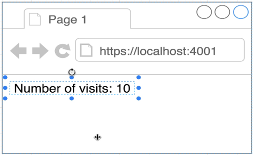

<br>

### Components Needed
1. `Web Server`: Responds to **HTTP requests** and **generates HTML** for the browser.
2. `Redis Server`: An **in-memory data store** to keep track of the number of visits.

<br>

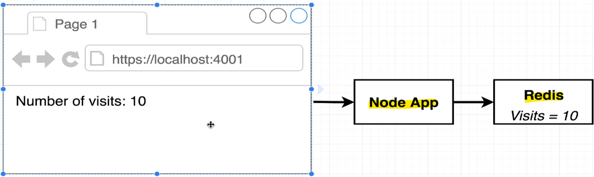

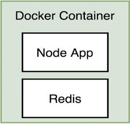

<br>

### Why Use Redis?
* Although the visit count could be stored in the Node application, using Redis adds **complexity** and demonstrates **advanced Docker features**.

<br>

### Application Architecture
#### ❌ Single Container Approach ❌
* Running both the Node application and Redis server in one container is possible but **not ideal for scaling.**
* **Multiple instances** of Redis would be **disconnected**, leading to **inconsistent visit counts**.

#### ✅ Separate Container Approach ✅
* Use **separate** Docker containers for the Node application and Redis server.
* **Each Node** app **container connects** to the **Redis server container** to store the visit count.

<br>

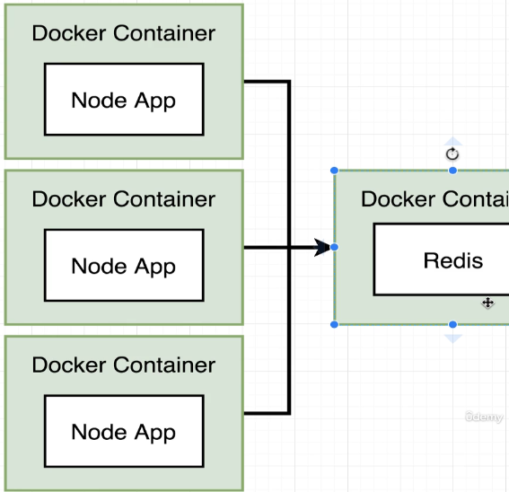

<br>

### Initial Setup
For the first iteration, set up one Docker container for the Node app and another for the Redis server.

<br>

<hr style="height:4px;background:black">

<br>

## Assembling a Dockerfile

### Purpose of the Dockerfile
* The **Dockerfile** is solely for the **Node application**.
* It has nothing to do with the Redis server.

<br>

### Steps to Create the Dockerfile
1. Specify the Base Image
   * Use `node:alpine` as the base image.

2. Set Up a Working Directory
   * Use `app` as the working directory.

3. Copy Package.jsonand Install Dependencies
   * Copy only the `package.json` file first.
   * Run `npm install` to install dependencies.

4. Copy the Rest of the Source Code
   * Use `COPY . .` to copy all remaining source code.

5. Start the Server
   * Use `CMD ["npm", "start"]` to start the server.

<br>

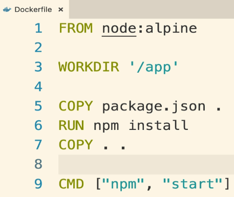

<br>

### Building the Docker Image
1. Build the Image
   * Make sure you are in the right directory, e.g. "visits".
   * Run `docker build .` in the terminal.
   * Ignore any warnings that appear.

<br>

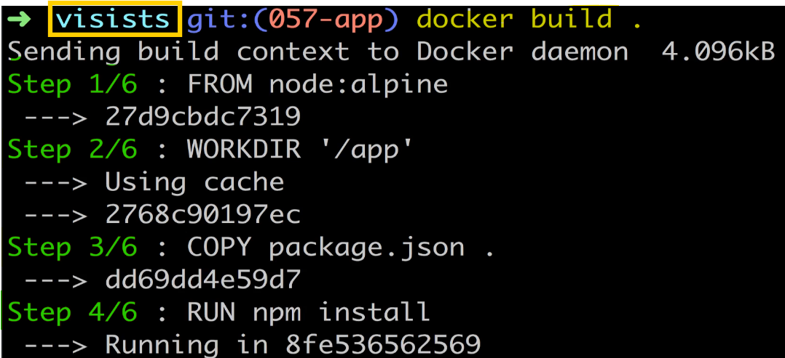

<br>

2. Tag the Image
   * To avoid using the image ID, tag the image with a **name**.
   * Use the command `docker build -t <docker_username>/project_name:latest .`.


<br>

### Summary
* The Dockerfile is created to build the Node.jsapplication.
* Tagging the image makes it easier to reference without using the image ID.

<br>

<hr style="height:4px;background:black">

<br>

## Introducing Docker Compose

###

<br>

<hr style="height:4px;background:black">

<br>

## Starting the Node.jsApplication
* We created a Dockerfile and built a new image for our application.
* To start the application, use the command `docker run <docker_username>/visits`.
* You can optionally add :latest at the end, but it's not necessary.

<br>

### Encountering an Error
* Running the command results in an error: "Redis connection failed."
* This happens because there's no Redis server running for the application to connect to.

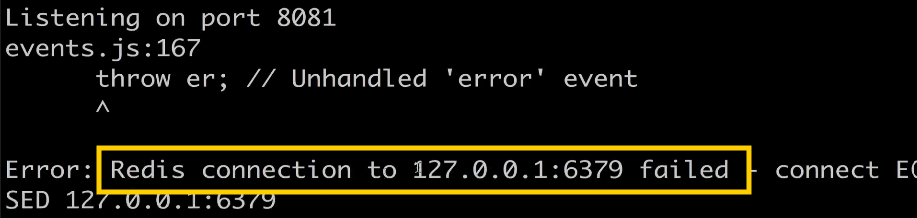

<br>

### Starting the Redis Server
* To start a Redis server, use the command `docker run redis`.
* This pulls the Redis image from Docker Hub and starts a Redis server on your local machine.

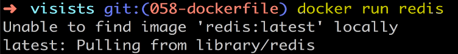

<br>

### Connecting the Containers
* Even with the Redis server running, the Node.jsapplication still shows the same error.
* The Node.jsapplication and Redis server are in **separate containers** with **no automatic communication** between them.

<br>

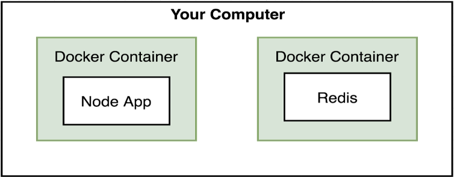

<br>

### Setting Up Networking
* To enable communication between the containers, we need to set up networking infrastructure.
* There are **two** options for **setting up networking**:
    1. `Docker CLI`:
        * The built-in Docker CLI can set up a network between containers.
        * However, it's cumbersome and involves running multiple commands each time you start the containers.
    2. `Docker Compose`:
        * Docker Compose is a separate CLI tool installed with Docker.
        * It simplifies the process of starting multiple containers and connecting them with networking.
        * Docker Compose avoids repetitive commands and makes container management easier.

<br>

### Using Docker Compose
* Docker Compose helps **manage multiple containers** and their networking.
* It reduces the need to write repetitive Docker CLI commands.
* Docker Compose is **already installed** on your machine and can be accessed using docker-compose.

<br>

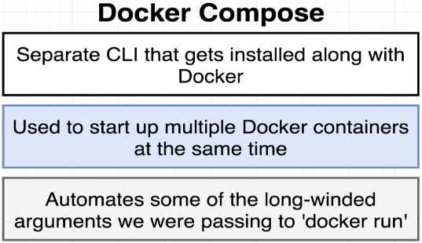

<br>

### Summary
* To run the Node.jsapplication and Redis server, we need to **set up networking** between the containers.
* Docker Compose **simplifies this process** and makes it easier to manage multiple containers.

<br>

<hr style="height:4px;background:black">

<br>

## Docker Compose Files

### Purpose of Docker Compose
* Docker Compose automates long-winded Docker CLI commands.
* It allows us to easily start multiple Docker containers and connect them together.

<br>

### Creating the Docker Compose File
* We encode Docker CLI commands into a special file called **docker-compose.yml**.
* This file uses a specific syntax to define the configuration for multiple containers.

<br>

### Structure of the Docker Compose File
1. `Version`
   * Specify the version of Docker Compose being used.
   * Example: version: '3'

2. `Services`:
   * Define the containers (services) to be created.

Example:

```yaml
services:
  redis-server:
    image: 'redis'
  node-app:
    build: .
    ports:
      - '4001:8081'
```

<br>

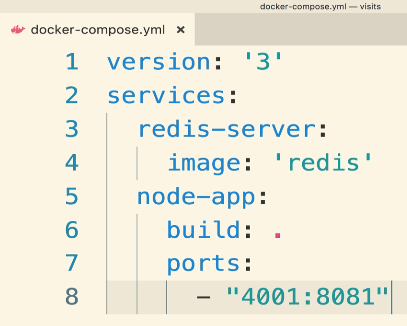

<br>

### Defining Services
* `redis-server`
  * Uses the Redis image from Docker Hub.
* `node-app`
  * Built using the Dockerfile in the current directory.
  * Maps port 4001 on the local machine to port 8081 inside the container.

<br>

### Summary
* Docker Compose simplifies the process of managing multiple containers.
* The docker-compose.yml file defines the configuration for these containers.
* Using Docker Compose, we can start and connect containers with ease.

<br>

<hr style="height:4px;background:black">

<br>

## Networking with Docker Compose

### Automatic Networking with Docker Compose
* Docker Compose **automatically creates containers on the same network**.
* Containers can **freely communicate** without additional configuration.

<br>

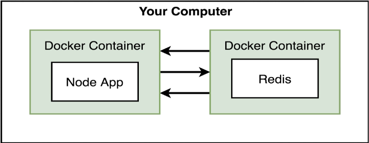

<br>

### Accessing Redis from Node.js
* In the **index.js** file, specify the **Redis server location** using the **host** option.
* Use the service name redis-server to connect to the Redis container.

Example:

```javascript
const client = redis.createClient({
  host: 'redis-server',
  port: 6379 // Default Redis port
});
```

<br>

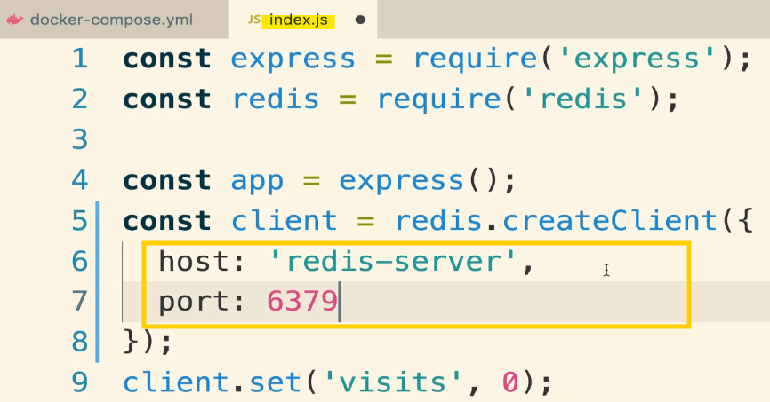

<br>

### How It Works
* The Node.jsapplication tries to connect to redis-server.
* Docker redirects the connection to the Redis container.
* This setup allows seamless communication between the Node.jsapp and Redis server.

<br>

### Summary
* Docker Compose simplifies networking between containers.
* Use service names to connect containers within the same Docker Compose file.
* The redis-server service name allows the Node.jsapp to connect to the Redis container.

<br>

<hr style="height:4px;background:black">

<br>

## Docker Compose Commands

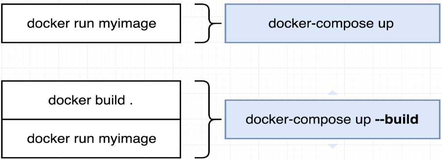

<br>

### Starting Docker Compose
* Instead of using docker run, we use `docker-compose up` to start all containers listed in the Docker Compose file.
* Docker Compose automatically looks for a **docker-compose.yml** file in the **current directory**.

<br>

### Rebuilding Images
* To rebuild images before starting containers, use `docker-compose up --build`.
* This ensures that any **changes** to the Dockerfile **are included** in the new build.

<br>

### Running Docker Compose
* Run the command `docker-compose up` in the terminal.

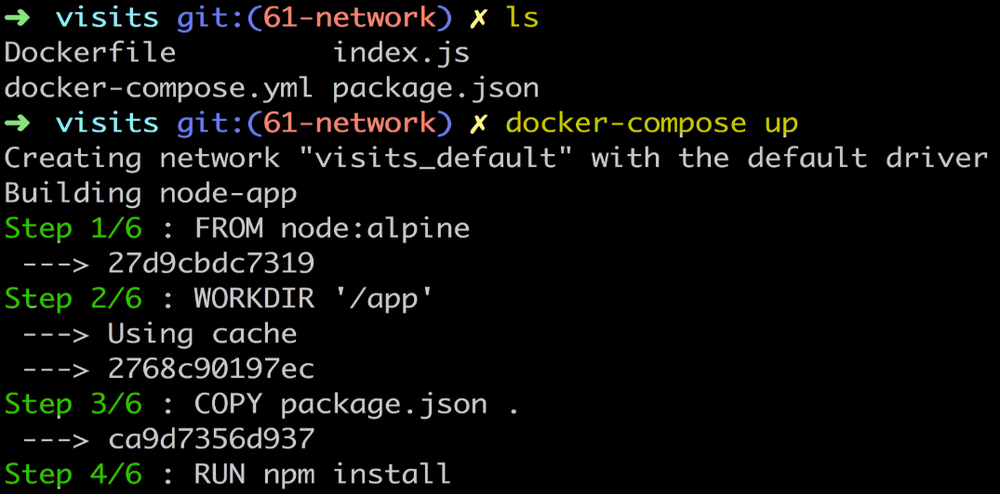

<br>

* Docker Compose creates a **network** for the **containers** and **starts** them.

Example output:
* "Creating network visits_default"
* "Creating visits_node-app_1"
* "Creating visits_redis-server_1"

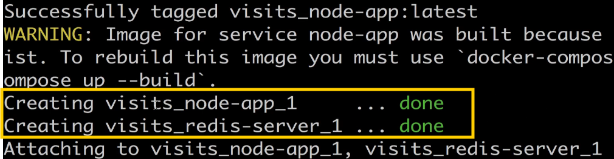

<br>

### Verifying the Setup
* Open a browser and navigate to **localhost:4001** (or the specified port).
* The application should display the number of visits, which increments with each refresh.

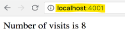

<br>

### Key Points
* Docker Compose **automatically handles networking** between containers.
* Use service names defined in the Docker Compose file to connect containers.
  * **Example**: Use redis-server as the host name in the Node.jsapplication to connect to the Redis container.

<br>

### Summary
* Docker Compose simplifies container management and networking.
* Use `docker-compose up` to start containers and `docker-compose up --build` to rebuild images.
* Verify the setup by accessing the application in the browser.

<br>

<hr style="height:4px;background:black">

<br>

## Stopping Docker Compose Containers

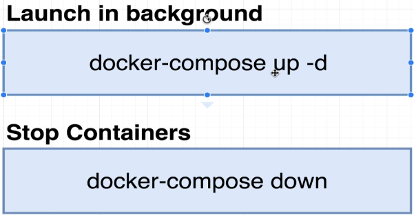

<br>

### Starting Containers in the Background
* Previously, we used `docker run -d <image>` to start a container in the background.
* With Docker Compose, use `docker-compose up -d` to **start all containers** in the **background**.

<br>

### Stopping Containers
* Instead of stopping each container individually with `docker stop <container_id>`, use `docker-compose down` to **stop all containers** at once.

<br>

### Commands Summary
**Start Containers in the Background:** `docker-compose up -d`
* This starts all containers defined in the docker-compose.yml file in the background.

**Stop All Containers:** `docker-compose down`
* This stops and removes all containers started by Docker Compose.

<br>

### Example Workflow
**Start Containers:**
* Run `docker-compose up -d` to start containers in the background.
* Use `docker ps` to see the running containers.

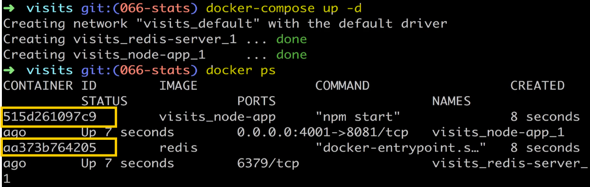

<br>

**Stop Containers:**
* Run `docker-compose down` to stop and remove all containers.

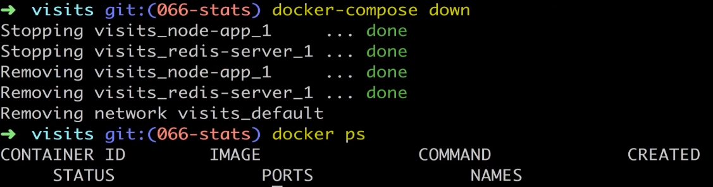

<br>

### Summary
* Docker Compose makes it easier to manage multiple containers.
* Use `docker-compose up -d` to **start** containers in the **background** and `docker-compose down` to **stop** them.

<br>

<hr style="height:4px;background:black">

<br>

## Container Maintenance with Compose

### Overview
* Containers can crash due to errors in the software running inside them.
* We'll explore ways to **automatically restart a container** when it crashes.

### Forcing a Server Crash
* Add code to **index.js** to force the server to crash when the root route is accessed.

Example:

```javascript
const process = require('process');

app.get('/', (req, res) => {
  process.exit(0); // Force the server to crash
});
```

<br>

### Testing the Crash
1. Rebuild and Start Containers
   * Run `docker-compose up --build` to rebuild and start the containers.
   * Verify that the server is running on port 4001.

2. Access the Root Route
   * Open a browser and navigate to **localhost:4001**.
   * The server should crash, and an error message will appear.

<br>

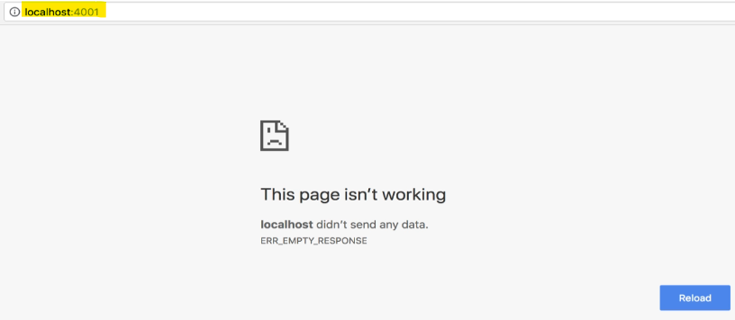

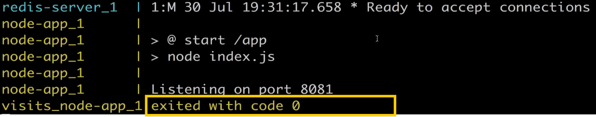

<br>

3. Check Running Containers
   * Run `docker ps` to see the running containers.
   * Only the Redis container should be running, indicating the Node server has crashed.

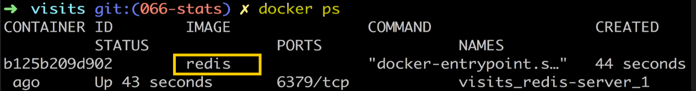

<br>

### Summary
* We added code to force the server to crash and tested it.
* The next step is to explore options for automatically restarting the crashed container.

<br>

<hr style="height:4px;background:black">

<br>

## Automatic Container Restarts

### Overview
* We added code to our Node.jsserver to force it to exit when the root route is accessed.
* Now, we'll explore how to get Docker Compose to **automatically restart a crashed** or **stopped container**.

<br>

### Exit Status Codes
* `process.exit(0)`: Indicates the server exited intentionally without errors.
* Any non-zero status code (e.g., process.exit(1)) indicates the server exited due to an **error**.

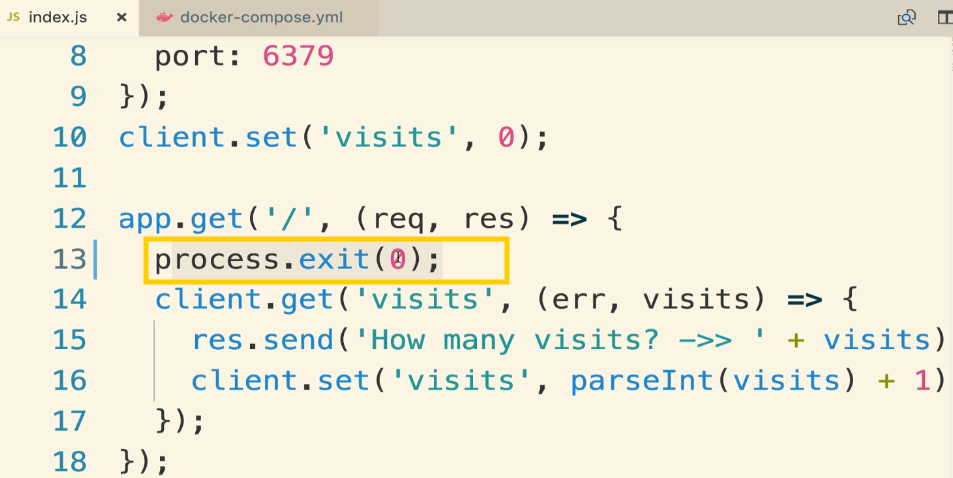

<br>

### Restart Policies in Docker Compose
* `no`: Default policy.
  * Do **not** attempt to restart the container if it crashes.
* `always`: **Restart** the container **regardless** of the reason for stopping.
* `on-failure`: **Restart** the container only **if it exits** with a **non-zero status** code.
* `unless-stopped`: Always restart the container unless it is **explicitly stopped** by the **user**.

<br>

### Adding a Restart Policy
Example of adding the always restart policy to the Node.jscontainer:

```yaml
services:
  node-app:
    build: .
    ports:
      - '4001:8081'
    restart: always
```

<br>

### Testing the Restart Policy
1. **Set the Restart Policy**
   * Add `restart: always` to the Node.jsservice in the **docker-compose.yml** file.

<br>

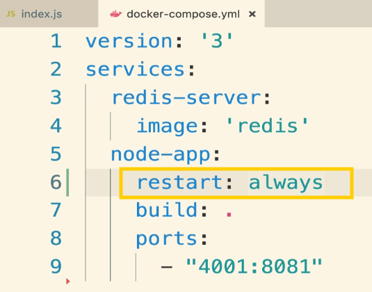

<br>

2. **Rebuild and Start Containers**
   * Run `docker-compose up --build` to rebuild and start the containers.

<br>

3. **Trigger the Crash**
   * Access localhost:4001 in the browser to trigger the server crash.

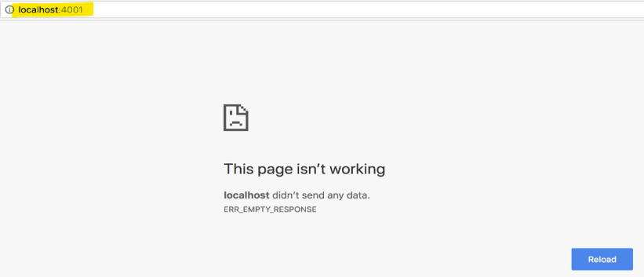

<br>

   * Verify that Docker Compose **automatically restarts** the container.

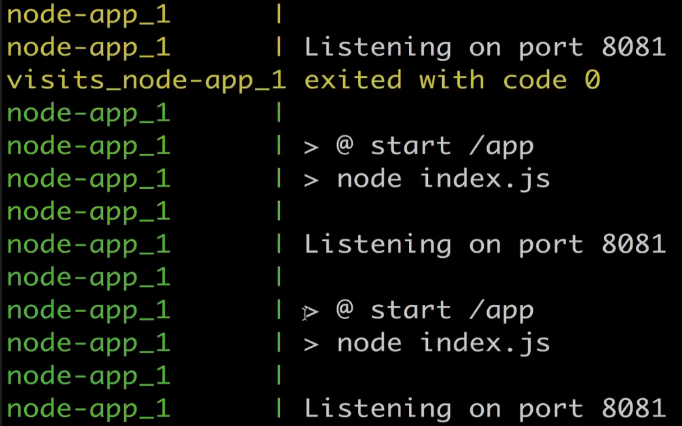

<br>

### Choosing the Right Restart Policy
* `always`: Suitable for web servers that need to be available 100% of the time.
* `on-failure`: Suitable for worker processes that should only restart if an error occurs.

<br>

### Summary
* Docker Compose can automatically restart containers using restart policies.
* Choose the appropriate restart policy based on the purpose of the container.

<br>

<hr style="height:4px;background:black">

<br>

## Container Status with Docker Compose

### Overview
* Docker Compose simplifies managing multiple containers.
* We can check the status of running containers using Docker Compose commands.

<br>

### Checking Container Status
* Previously, we used `docker ps` to check the status of running containers.
* With Docker Compose, use `docker-compose ps` to check the **status of containers defined** in the **docker-compose.yml** file.

<br>

### Commands Summary
1. Start Containers
   * Use `docker-compose up` to start containers.
   * Example: docker-compose up

2. Check Container Status
   * Use `docker-compose ps` to print the status of containers.
   * Example: docker-compose ps

<br>

### Important Note
* Run `docker-compose ps` from the same directory as the **docker-compose.yml** file.
* If you run the command from a **different directory**, Docker Compose **won't** know which containers to check and will return an **error**.

<br>

### Example Workflow
1. Start Containers
   * Run `docker-compose up` to start containers.

2. Check Status
   * Open a second terminal window.
   * Run `docker-compose ps` to see the status of the containers.

3. Error Handling
   * If you run `docker-compose ps` from a directory without a docker-compose.yml file, you'll get an error message.

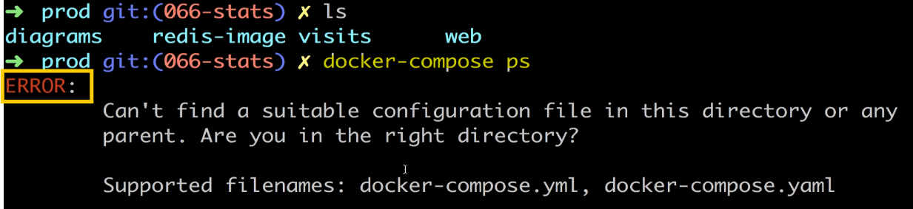

<br>

### Summary
* Docker Compose provides a convenient way to check the status of containers.
* Use `docker-compose ps` to see the status of containers defined in the docker-compose.yml file.

<br>

<hr style="height:4px;background:black">

<br>