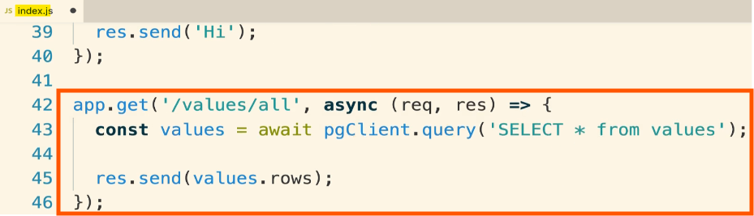

- [Section 8: Building a Multi-Container Application](#section-8-building-a-multi-container-application)
  - [Single Container Deployment Issues](#single-container-deployment-issues)
    - [Terminating the Application](#terminating-the-application)
    - [Issues with Single Container Deployment](#issues-with-single-container-deployment)
    - [Improving the Deployment Process](#improving-the-deployment-process)
    - [Key Takeaways](#key-takeaways)
  - [Building a Multi-Container Application: Fibonacci Calculator](#building-a-multi-container-application-fibonacci-calculator)
    - [Introduction to the Fibonacci Sequence](#introduction-to-the-fibonacci-sequence)
    - [Application Overview: Objective](#application-overview-objective)
    - [Application Mock-Up](#application-mock-up)
    - [Why Fibonacci Calculator](#why-fibonacci-calculator)
    - [Key Takeaways](#key-takeaways-1)
  - [Application Architecture](#application-architecture)
    - [Backend Components](#backend-components)
    - [Data Storage](#data-storage)
    - [Application Flow](#application-flow)
    - [Why Overcomplicated?](#why-overcomplicated)
  - [Worker Process Setup](#worker-process-setup)
    - [Worker Process](#worker-process)
    - [Redis Client Setup](#redis-client-setup)
    - [Fibonacci Calculation](#fibonacci-calculation)
    - [Watching Redis](#watching-redis)
    - [Running the Worker Process](#running-the-worker-process)
    - [Testing the Worker Process](#testing-the-worker-process)
  - [Express API Setup](#express-api-setup)
    - [Creating the Server Directory](#creating-the-server-directory)
    - [Setting Up package.json](#setting-up-packagejson)
    - [Creating keys.js](#creating-keysjs)
    - [Important Notes](#important-notes)
  - [Connecting to Postgress](#connecting-to-postgress)
    - [Server Implementation](#server-implementation)
    - [Creating index.js](#creating-indexjs)
    - [Express App Setup](#express-app-setup)
    - [PostgreSQL Client Setup](#postgresql-client-setup)
  - [More Express API Setup](#more-express-api-setup)
    - [Redis Client Setup](#redis-client-setup-1)
    - [Express Route Handlers](#express-route-handlers)
    - [Final Setup](#final-setup)
    - [Testing the Server Setup](#testing-the-server-setup)
    - [Steps to Test](#steps-to-test)
  - [Fetching data in the React App](#fetching-data-in-the-react-app)
    - [Setting Up the React Application](#setting-up-the-react-application)
    - [Creating the "Other Page"](#creating-the-other-page)
    - [Creating the Fibonacci Calculator Page](#creating-the-fibonacci-calculator-page)
    - [Fetching Data from Backend API](#fetching-data-from-backend-api)
    - [Summary](#summary)
  - [Rendering Logic in the App](#rendering-logic-in-the-app)
    - [Adding Render Method to Fib Component](#adding-render-method-to-fib-component)
    - [Steps to Render the Component](#steps-to-render-the-component)
    - [Helper Methods](#helper-methods)
    - [Adding Event Handlers](#adding-event-handlers)
    - [Summary](#summary-1)
  - [Routing in the React App](#routing-in-the-react-app)
    - [Wiring Up Components with React Router](#wiring-up-components-with-react-router)
    - [Steps to Add Dependencies](#steps-to-add-dependencies)
    - [Importing Components and React Router](#importing-components-and-react-router)
    - [Setting Up Routes](#setting-up-routes)
    - [Summary](#summary-2)

<br>

<hr style="height:4px;background:black">

<br>

# Section 8: Building a Multi-Container Application

## Single Container Deployment Issues
> Objective: Reviewing Single Container Deployment and Moving Forward.

<br>

### Terminating the Application
* Ensure you terminate the application on Amazon Elastic Beanstalk to avoid incurring charges.
  * This is what we created in [Section 7](ci-and-deployment.md#section-7-continuous-integration-and-deployment-with-aws).
* Instructions for terminating the application were provided in the previous section: [Environment Clean-Up](ci-and-deployment.md#environment-clean-up).

<br>

### Issues with Single Container Deployment
* `Simplicity`: The application was a simple React app with an NGINX server, lacking complexity and external services.
* `Multiple Builds`: The Docker image was built multiple times, once on Travis CI and again on Elastic Beanstalk, which is not efficient.
* `No External Services`: The application did not use any databases, APIs, or caching services, limiting its complexity.

<bR>


<br>

### Improving the Deployment Process
* `Complexity`: Work on a more complex application that uses multiple services.
* `Single Build`: Ensure the Docker image is built once and reused, rather than building it multiple times.
* `External Services`: Incorporate databases, APIs, and caching services to create a more robust application.

<br>

### Key Takeaways
* `Terminate Application`: Avoid charges by terminating the Elastic Beanstalk application if not needed.
* `Address Issues`: Recognize and address issues with simplicity, multiple builds, and lack of external services.
* `Enhance Complexity`: Work on a more complex application with multiple services and a single build process.

<br>

> ### Next Steps
> * Build a multi-container application using Docker and Docker Compose.
> * Integrate multiple databases and sources of information.
> * Deploy the multi-container application to Amazon Elastic Beanstalk.

<br>

<hr style="height:4px;background:black">

<br>

## Building a Multi-Container Application: Fibonacci Calculator


<br>

### Introduction to the Fibonacci Sequence
* The Fibonacci sequence is a series of numbers where **each number** is the **sum of the two preceding ones**.
  * The sequence starts with 1, 1, 2, 3, 5, 8, 13, 21, and so on.
* In computer science, a common interview question is to write a function that calculates the Fibonacci value at a particular index.

<br>

### Application Overview: Objective
* We will build a fancy Fibonacci sequence calculator.
* The application will be intentionally overcomplicated to provide experience with a multi-container deployment.

> The goal is to focus on Docker and deployment rather than the application implementation details.

<br>

This is what it will look like:

<br>


<br>

### Application Mock-Up
* The user will be presented with a form to enter an index.
* Upon submission, the back-end processes will calculate the Fibonacci value at the given index.
* The application will display the indices that have been calculated and their corresponding Fibonacci values.

<br>

### Why Fibonacci Calculator
* The Fibonacci calculator is chosen to avoid focusing on learning new programming concepts or authentication.
* It allows us to **concentrate on Docker** and **deployment aspects**.

<br>

### Key Takeaways
* `Fibonacci Sequence`: A series of numbers where each number is the sum of the two preceding ones.
* `Application Goal`: Build a multi-container Fibonacci calculator to gain experience with Docker and deployment.
* `Focus`: Concentrate on Docker and deployment rather than application implementation details.

<br>

<hr style="height:4px;background:black">

<br>

## Application Architecture


<br>

### Backend Components
`Nginx Web Server`:
* Routes incoming requests.
* Decides if the request is for front-end assets (HTML, JavaScript) or backend API.

`React Server`:
* Serves front-end assets.

`Express Server`:
* Functions as the API server.
* Handles requests for submitting and retrieving numbers.

<br>

### Data Storage
`Redis`:
* In-memory data store.
* Used for temporary or cached values.

`Postgres`:
* Database similar to MySQL.
* Stores permanent data (indices submitted by users).

<br>


<br>

### Application Flow
1. `User Interaction`:
   * User submits a number via the React application.

2. `API Request`:
   * React app sends an Ajax request to the Express server.

3. `Data Storage`:
   * Express server stores the number in Postgres (permanent storage).
   * Also stores the number in Redis (temporary storage).

4. `Worker Process`:
   * Node.jsprocess (worker) watches Redis for new indices.
   * Calculates the Fibonacci value for the new index.
   * Stores the calculated value back in Redis.

5. `Display Result`:
   * React application retrieves the calculated value from Redis.
   * Displays the result to the user.

<br>


<br>

### Why Overcomplicated?
`Learning Experience`:
* Demonstrates how to work with multiple containers and data sources.
* Provides a comprehensive example of multi-container deployment.

<br>

<hr style="height:4px;background:black">

<br>

## Worker Process Setup

### Worker Process
> **Purpose**: Watches Redis for new indices and calculates the Fibonacci value for each new index.

**Steps**:

1. `Create a New Folder`:
   * Name: "Complex"
   * Subfolder: "Worker"

2. `Initialise Project`:
   * Create package.json file.
   * Add dependencies: **nodemon** (1.18.3) and Redis client (**2.8.0**).

<br>


<br>

3. `Add Scripts`:
   * "start": "node index.js"
   * "dev": "nodemon"

<br>


<br>

<hr style="height:4px;background:black">

<br>

4. `Create index.js`:
   * Main logic for connecting to Redis and calculating Fibonacci values.
     
4.1. **Import Keys and Redis Client**:
```js
const keys = require('./keys');
const redis = require('redis');
```

<br>


<br>

4.2. **Create a Redis Client**:
```js
const redisClient = redis.createClient({ 
  host: keys.redisHost, 
  port: keys.redisPort, 
  retry_strategy: () => 1000 
});
```
* The `retry_strategy` option ensures the client **reconnects** every second **if** the **connection is lost**.

<br>


<br>

4.3. **Duplicate the Redis Client for Subscription**:
```js
const sub = redisClient.duplicate();
```

<br>


<br>

4.4. **Fibonacci Calculation Function**:
```js
function fib(index) { 
  if (index < 2) return 1; 
  return fib(index - 1) + fib(index - 2); 
}
```
* This **recursive** function **calculates** the Fibonacci **value** for a **given index**.

<br>


<br>

4.5. **Watch Redis for New Values**:
```js
sub.on('message', (channel, message) => { 
  redisClient.hset('values', message, fib(parseInt(message))); 
});
```
* When a **new value** is inserted into **Redis**, the **worker calculates** the Fibonacci **value** and **stores** it back in **Redis**.

<br>

4.6. **Subscribe to Insert Event**:
```js
sub.subscribe('insert');
```

<br>


<br>

> This code sets up the worker process to watch for new values in Redis, calculate the Fibonacci value for each new index, and store the result back in Redis.

<br>

<hr style="height:4px;background:black">

<br>

5. `Create Keys.js`:
   * Stores Redis connection details (**host** and **port**).
   * This will be inside of the "worker" folder.

<br>


<br>

<hr style="height:4px;background:black">

<br>

### Redis Client Setup
`Import Redis Client`:
* Create a Redis client with connection details.
* Add retry_strategy to reconnect automatically if the connection is lost.

`Duplicate Client`:
* Create a duplicate client for subscription.

<br>

### Fibonacci Calculation
`Function`:
* **fib(index)**: Calculates Fibonacci value using a recursive solution.
* Returns 1 if the index is less than 2, otherwise sums the previous two values.

<br>

### Watching Redis
`Subscription`:
* Watch Redis for new values.
* Calculate Fibonacci value for new indices and store the result in Redis.

<br>

### Running the Worker Process
`Insert Value into Redis`:
* When a new value is inserted into Redis, the **worker** process **calculates** the Fibonacci **value** and **stores** it back in **Redis**.

<br>

### Testing the Worker Process
`Run index.js`:
1. Change to the worker directory.
2. Execute node index.js.

Expected Output: If you see "Cannot find module Redis," it indicates the code is correct so far.

<br>


<br>

<hr style="height:4px;background:black">

<br>

## Express API Setup
> **Objective**: Start setting up the Express server to serve as the API layer.
> * **Express Server**: Will serve as the API layer, communicating with Redis, Postgres, and the React application.

<br>


<br>

### Creating the Server Directory
`Directory Structure`:
* Create a new directory named **server** as a sibling to the worker directory.
* Do not place the **server** directory inside the **worker** directory.

<br>

### Setting Up package.json
`Dependencies`:
* express (4.16.3)
* pg (Postgres client, 8.0.3)
* redis (2.8.0)
* cors (2.8.4)
* nodemon (1.18.3)

`Scripts`:
* dev: Runs nodemon
* start: Runs node index.js

`Example package.json`:

```json
{
  "dependencies": {
    "express": "4.16.3",
    "pg": "8.0.3",
    "redis": "2.8.0",
    "cors": "2.8.4",
    "nodemon": "1.18.3",
    "body-parser": "*"
  },
  "scripts": {
    "dev": "nodemon",
    "start": "node index.js"
  }
}
```

<br>


<br>

### Creating keys.js
> **Purpose**: Store environment variables for connecting to Redis and Postgres.

Example **keys.js**:

```javascript
module.exports = {
  redisHost: process.env.REDIS_HOST,
  redisPort: process.env.REDIS_PORT,
  pgUser: process.env.PG_USER,
  pgHost: process.env.PG_HOST,
  pgDatabase: process.env.PG_DATABASE,
  pgPassword: process.env.PG_PASSWORD,
  pgPort: process.env.PG_PORT
};
```

<br>


<br>

### Important Notes
* `Environment Variables`: Ensure all environment variable names are capitalised (e.g., PG_USER, PG_HOST).
* `Double-Check`: Verify the spelling and placement of keys and values to avoid future issues.

<br>

<hr style="height:4px;background:black">

<br>

## Connecting to Postgress

### Server Implementation
> **Objective**: Create **index.js** to house all logic for connecting to Redis, PostgreSQL, and the React application.

<br>

### Creating index.js
* `File Location`: Inside the **server** directory.
* `Purpose`: Connect to Redis, PostgreSQL, and broker information between them and the React application.

<br>

### Express App Setup
1. `Require Libraries`:
   * **express**: Import the Express library.
   * **body-parser**: Import the body-parser library.
   * **cors**: Import the CORS library.

<br>

2. `Create Express Application`:
   * This creates a new Express application instance.
```js
const app = express();
```

<br>

3. `Middleware Setup`:
```js
app.use(cors());    # Enable CORS to allow cross-origin requests.
app.use(bodyParser.json());   # Use body-parser to parse incoming JSON requests.
```

<br>


<br>

<hr style="height:4px;background:black">

<br>

### PostgreSQL Client Setup

<br>


<br>

1. `Require PG Library`:
   * This will import the Pool module from the PG library.
```js
const { Pool } = require('pg');
```

<br>

2. `Create PG Client`:
   * This creates a **new** PostgreSQL **client** using the **connection details** from the **environment variables**.

```javascript
const pgClient = new Pool({
  user: keys.pgUser, // PostgreSQL user from environment variables
  host: keys.pgHost, // PostgreSQL host from environment variables
  database: keys.pgDatabase, // PostgreSQL database name from environment variables
  password: keys.pgPassword, // PostgreSQL password from environment variables
  port: keys.pgPort // PostgreSQL port from environment variables
});
```

<br>


<br>

3. `Error Handling`:
   * This sets up an error handler to **log** a **message** if the PostgreSQL **connection is lost**.
```js
pgClient.on('error', () => console.log('Lost PG connection'));
```


<br>

4. `Create Table`:
   * This is going to store all of the **values** that have ever been, or all the **indices** (to be precise), that have been **submitted** to our **Fib calculator**.
   * This creates a table named **values** with a **single column** number to store the indices of submitted values.
   * The `catch` statement **logs an error** if the table creation **fails**.

<br>


<br>

```javascript
pgClient
  .query('CREATE TABLE IF NOT EXISTS values (number INT)')
  .catch(err => console.log(err));
```

<br>


<br>

> ### Important Notes
> * **Environment Variables**: Ensure all environment variable names are capitalized (e.g., PG_USER, PG_HOST).
> * **Double-Check**: Verify the spelling and placement of keys and values to avoid future issues.

<br>

<hr style="height:4px;background:black">

<br>

## More Express API Setup
`Objective`:
* Make sure that the **express server** has a **connection** over to **Redis**.
* So anytime that user submits a new number to the React Application.
  * React App will push that index over to the express server, and the express server will then push that index into the running Redis instance.

<br>


<br>

### Redis Client Setup
1. `Require Redis Library`:
   * Inside of my **index.js** file, inside of the **server** directory. Underneath all the Postgres stuff, I'll put on a new section that we'll call, **"Redis client setup"**.
```js
const redis = require('redis');
```

<br>


<br>

2. `Create Redis Client`:

```javascript
const redisClient = redis.createClient({
  host: keys.redisHost, // Redis host from environment variables
  port: keys.redisPort, // Redis port from environment variables
  retry_strategy: () => 1000 // Reconnect every second if the connection is lost
});
```

<br>


<br>

3. `Create Redis Publisher`:
```js
const redisPublisher = redisClient.duplicate();
```
* **Duplicate** connection is needed for **listening** or **publishing information** on Redis.


<br>

### Express Route Handlers
1. `Test Route`:

```javascript
app.get('/', (req, res) => {
  res.send('Hi');
});
```

* Responds with "Hi" to ensure the application is working.

<br>


<br>

2. `Get All Values`:

```javascript
app.get('/values/all', async (req, res) => {
  const values = await pgClient.query('SELECT * FROM values');
  
  -res.send(values.rows);
});
```

* Queries PostgreSQL to **retrieve** all **submitted values** and sends them back to the client.

<br>



<br>

3. `Get Current Values`:

```javascript
app.get('/values/current', (req, res) => {
  redisClient.hgetall('values', (err, values) => {
    res.send(values);
  });
});
```

* Retrieves all **indices** and calculated **values** **from Redis** and sends them back to the client.

<br>


<br>

4. `Receive New Values`:

```javascript
app.post('/values', async (req, res) => {
  const index = req.body.index;

  if (parseInt(index) > 40) {
    return res.status(422).send('Index too high');
  }

  redisClient.hset('values', index, 'Nothing yet!');
  redisPublisher.publish('insert', index);
  pgClient.query('INSERT INTO values(number) VALUES($1)', [index]);
  
  res.send({ working: true });
});
```

* Receives **new indices from** the **React** application.
* **Stores** them in **Redis** and **PostgreSQL**.
* **Publishes** an **insert event**.

<br>

`4. Receive New Values: Line-by-Line Explanation`

```javascript
app.post('/values', async (req, res) => {
```
**Explanation**: 
* This line sets up a POST route handler for the `/values` endpoint. 
* It uses an asynchronous callback function to handle **incoming requests**.

<br>

```javascript
  const index = req.body.index;
```
**Explanation**: 
* This line extracts the `index` value from the request body. 
* The `index` is the number **submitted by the user** through the React application.

<br>

```javascript
  if (parseInt(index) > 40) {
    return res.status(422).send('Index too high');
  }
```

**Explanation**: 
* This block checks if the `index` is greater than 40. 
  * If it is, the server responds with a status code of **422** (Unprocessable Entity) and a message saying **"Index too high"**. 
* This is to **prevent** the worker process from being **overwhelmed** by calculating very large Fibonacci numbers.

<br>

```javascript
  redisClient.hset('values', index, 'Nothing yet!');
```
**Explanation**: 
* This line stores the `index` in the Redis data store with the value "Nothing yet!". 
* This indicates that the Fibonacci value for this index has **not been calculated yet**.

<br>

```javascript
  redisPublisher.publish('insert', index);
```

**Explanation**: 
* This line publishes an **insert event** to the Redis publisher with the **index as the message**. 
* This notifies the worker process to **start calculating** the Fibonacci value for the new index.

<br>

```javascript
  pgClient.query('INSERT INTO values(number) VALUES($1)', [index]);
```

**Explanation**: 
* This line inserts the `index` into the **PostgreSQL database**. 
* The `$1` is a **placeholder** for the index value, which is provided as an **array** [index]. 
* This stores a **permanent record** of the **submitted index**.

<br>

```javascript
  res.send({ working: true });
```
**Explanation**: 
* This line sends a response back to the client indicating that the server is working on calculating the Fibonacci value. 
* The response is an object with a property working set to true.

<br>

> `Summary`
> * This route **receives** new **indices** from the **React application**.
> * **Stores** them in **Redis** and **PostgreSQL**.
> * **Publishes** an **insert event** to **notify** the **worker** process.

<br>

`Flow`:
1. Extract the index from the request body.
2. Check if the index is greater than 40 and respond with an error if it is.
3. Store the index in Redis with the value "Nothing yet!".
4. Publish an insert event to notify the worker process.
5. Insert the index into PostgreSQL.
6. Send a response back to the client indicating that the server is working on the request.

<br>

### Final Setup
`Start Server`:

```javascript
app.listen(5000, () => {
  console.log('Listening');
});
```

* Starts the Express server on port **5000**.

<br>


<br>

### Testing the Server Setup
* `Current Status`: The server won't work yet because Redis and PostgreSQL servers are not running.
* `Objective`: To check for typos in the code.

<br>

### Steps to Test
1. `Navigate to the Server Directory`:
   * Change to the **server** directory from the **root** complex directory.
   * Command: **cd server**

<br>


<br>

2. `Run the Server`:
   * Command: **node index.js**
   * Expected Message: "Cannot find module 'express'".
     * If you see this message, it means the code is correct so far.
     * If you see any other message, there might be a **typo** in **index.js** or **keys.js**.

<br>


<br>

<hr style="height:4px;background:black">

<br>

## Fetching data in the React App

### Setting Up the React Application
> **Objective**: Create new files in the **src** folder to represent **different screens** in the application.

<br>

### Creating the "Other Page"
1. `File Creation`:
   * Create a new file named **otherpage.js** in the **src** folder.

<br>

2. `Code for otherpage.js`:
   * Import **React** and **Link** from **React Router DOM**.
     * This imports the necessary libraries to create a React component and handle routing.
   * Export a functional component that **returns** a **div** with **text** and a **link** back to the **main page**.
     * This defines and exports a functional component that returns a div with text and a link back to the main page.

Example:

```javascript
import React from 'react';
import { Link } from 'react-router-dom';

export default () => {
  return (
    <div>
      I'm some other page!
      <Link to="/">Go back home</Link>
    </div>
  );
};
```

<br>


<br>

### Creating the Fibonacci Calculator Page
1. `File Creation`:
   * Create a new file named **fib.js** in the **src** folder.

<br>


<br>

2. `Code for fib.js`:
   * Import React, Component, and Axios.
   * Create a class component named Fib that extends Component.
   * Initialise state with seenIndexes, values, and index.


Example:

```javascript
import React, { Component } from 'react';
import axios from 'axios';
```

* This imports React, Component, and Axios for making **HTTP requests**.
  * Axios is a module that we're going to use for **making requests** to that **backend express server**.

<br>


<br>

```javascript
class Fib extends Component {
  state = {
    seenIndexes: [],
    values: {},
    index: ''
  };
```

* This defines a **class** component named **Fib** and **initialises its state** with **seenIndexes** [array], **values** {empty object}, and **index** 'empty string'.

<br>


<br>

```javascript
  async componentDidMount() {
    this.fetchValues();
    this.fetchIndexes();
  }
```

* This lifecycle method is called when the component is **rendered**. 
* It calls fetchValues and fetchIndexes to **fetch data** from the **backend API**.

<br>


<br>

```javascript
  fetchValues = async () => {
    const values = await axios.get('/api/values/current');
    this.setState({ values: values.data });
  };
```

* This asynchronous (async) method makes a `GET` request to `/api/values/current` to fetch the **current values** and **updates** the state with the **fetched data**.

<br>


<br>

```javascript
  fetchIndexes = async () => {
    const seenIndexes = await axios.get('/api/values/all');
    this.setState({ 
      seenIndexes: seenIndexes.data 
    });
  }
}
```

* This asynchronous method makes a `GET` request to `/api/values/all` to fetch all the **indexes** and **updates** the state with the **fetched data**.

<br>


<br>

### Fetching Data from Backend API
1. `Component Lifecycle Method`:
   * Use **componentDidMount** to fetch data when the component is rendered.
   * Call **fetchValues** and **fetchIndexes** methods.

<br>

2. `Fetching Values`:
   * Define `fetchValues` as an asynchronous method.
   * Use Axios to make a GET request to `/api/values/current`.
   * Update state with the fetched values.

<bR>

3. `Fetching Indexes`:
   * Define `fetchIndexes` as an asynchronous method.
   * Use Axios to make a GET request to `/api/values/all`.
   * Update state with the fetched indexes.

<br>


<br>

### Summary
* `Other Page`: Created a simple page with a link back to the main page.
* `Fibonacci Calculator Page`: Set up the initial structure and state, and defined methods to fetch data from the backend API.

<br>

<hr style="height:4px;background:black">

<br>

## Rendering Logic in the App

### Adding Render Method to Fib Component
> **Objective**: Render the **Fib** component onto the browser **screen** and **show information** to the **user**.

<br>

### Steps to Render the Component
1. `Define Render Method`:
   * Go to the bottom of the Fib class (**Fib.js**) and define a **render** method.
   * Inside the **render** method, return a **div** containing the **JSX elements**.

For example:

<br>


* This method returns a div containing a: 
  * form with a **label**, **input**, and **button**, as well as two sections for displaying **indices** and **calculated values**.

<br>

2. `Create Form`:
   * Add a form tag with a **label**, **text input**, and a submit **button**.

Example:

```javascript
render() {
  return (
    <div>
      <form>
        <label>Enter your index:</label>
        <input />
        <button>Submit</button>
      </form>
    </div>
  );
}
```

<br>


<br>

3. `Add Event Handlers`:
   * Add **[event handlers](#helper-methods)** to the form and **input tags** (details will be added later).

<br>

4. `Display Indices and Calculated Values`:
   * Add two **h3** tags for titles: 
     * "Indexes I have seen" 
     * "Calculated values".
   * Call **helper methods** to **render** the lists of indices and calculated values.

Example:

```javascript
render() {
  return (
    <div>
      <form>
        <label>Enter your index:</label>
        <input />
        <button>Submit</button>
      </form>

      <h3>Indexes I have seen:</h3>
      {this.renderSeenIndexes()}

      <h3>Calculated values:</h3>
      {this.renderValues()}
    </div>
  );
}
```

<br>


<br>

### Helper Methods
1. `Render Seen Indexes`:
   * Define a helper method **renderSeenIndexes** to print the **list** of all **indices seen** by the **backend**.

Example:

```javascript
renderSeenIndexes() {
  return this.state.seenIndexes.map(({ number }) => number).join(', ');
}
```


* This method maps over the **seenIndexes array**, extracts the **number property** from each object, and **joins** them into a **string** separated by commas.

<br>

2. `Render Calculated Values`:
   * Define a helper method **renderValues** to print the list of all **calculated values**.

Example:

```javascript
renderValues() {
  const entries = [];
  for (let key in this.state.values) {
    entries.push(
      <div key={key}>
        For index {key}, I calculated {this.state.values[key]}
      </div>
    );
  }
  return entries;
}
```

<br>


* This method iterates over the **values** object, creates a **div** for each **key-value pair**, and **returns** an **array** of these divs.

<br>

### Adding Event Handlers
1. `Input Event Handler`:
   * Add a **value property** and an **onChange** event handler to the **input tag**.

Example:

```javascript
<input
  value={this.state.index}
  onChange={event => this.setState({ index: event.target.value })}
/>
```

<br>


* This input field is controlled by the **component's state**. 
* The `onChange` event handler **updates the state** with the **current value** of the **input field**.

<br>

2. `Form Submit Event Handler`:
   * Add an **onSubmit** event handler to the **form tag**.
   * Define the **handleSubmit** method to handle form submission.

Example:

```javascript
<form onSubmit={this.handleSubmit}>
```

<br>


* This form has an `onSubmit` event handler that calls the `handleSubmit` method when the **form** is **submitted**.

<br>

3. `Handle Submit Method`:
   * Define the handleSubmit method to send data to the backend API.

Example:

```javascript
handleSubmit = async event => {
  event.preventDefault();
  await axios.post('/api/values', {
    index: this.state.index
  });
  this.setState({ index: '' });
}
```

<br>


* This method **prevents** the **default form submission behavior**, sends a **POST request** to the **backend API** with the **current index**, and **clears the input field**.

<br>

4. `Exporting the Fib Class`:
   * Open **fib.js** and scroll to the **bottom** of the file.
   * Ensure you are **outside** the closing curly brace of the Fib class.
   * Add the following line to export the Fib component:

```javascript
export default Fib;
```

<br>


<br>

`Explanation`
* **Why Export?**: Exporting the component allows it to be imported and used in other files. Without this step, the component cannot be accessed from other parts of the application.
* **Common Mistake**: It's easy to forget to add the export statement, but it's crucial for the component's functionality.

<br>

### Summary
* `Render Method`: Defined the render method to display the form, indices, and calculated values.
* `Helper Methods`: Created helper methods to render the lists of indices and calculated values.
* `Event Handlers`: Added event handlers to handle input changes and form submission.
* `Export Statement`: Added export default Fib; to the bottom of fib.js to ensure the component can be used elsewhere in the application.
  * **Importance**: Exporting components is essential for modular and reusable code in React applications.

<br>

<hr style="height:4px;background:black">

<br>

## Routing in the React App

### Wiring Up Components with React Router
> **Purpose**: Connect **otherpage.js** and **fib.js** components to **app.js** and **enable navigation** between them using **React Router**.

<br>

### Steps to Add Dependencies
1. `Add React Router and Axios`:
   * Open **package.json** in the **client** directory.
   * Add the following dependencies:

```json
"react-router-dom": "4.3.1",
"axios": "0.18.0"
```

<br>


<br>

### Importing Components and React Router
1. `Open app.js`:
   * Locate **app.js** inside the **src** directory.

<br>


<br>

2. `Add Import Statements`:
   * Import React Router components and the newly created components:

```javascript
import { BrowserRouter as Router, Route, Link } from 'react-router-dom';
import OtherPage from './otherpage';
import Fib from './fib';
```

<br>


<br>

* Import `BrowserRouter`, `Route`, and `Link` from **react-router-dom** to enable routing.
* Import the `OtherPage` and `Fib` components to use them in the application.

<br>

### Setting Up Routes
1. `Wrap Existing Markup with Router`:
   * **Inside** the **render** method, wrap the existing markup with a **Router component**:


* Wrap the existing markup **inside** the render method with a Router component to **enable routing**.
* Make sure you indent the **div** and everything inside of it. 

<br>

2. `Replace Paragraph Tag with Div and Routes`:
   * Replace the existing paragraph tag with a **div** containing routes:
     * /
     * /otherpage

```javascript
<div>
  <Route exact path="/" component={Fib} />
  <Route path="/otherpage" component={OtherPage} />
</div>
```

<br>


<br>

* Replace the paragraph tag with a `div` containing **Route components**.
* Define **routes** for the **root path** (`/`) and the `/otherpage` path, **associating** them with the `Fib` and `OtherPage` components, respectively.

<br>

3. `Add Navigation Links`:
   * Inside the header, add **links** to **navigate** between the pages (home page and the other page):

```javascript
<header>
  ...
  <Link to="/">Home</Link>
  <Link to="/otherpage">Other Page</Link>
</header>
```

<br>


<br>

### Summary
* `Dependencies`: Added react-router-dom and axios to package.json.
* `Import Statements`: Imported necessary components for routing and the newly created components.
* `Routes and Navigation`: Set up routes and navigation links in app.js to enable switching between the Fib and OtherPage components.

<br>

<hr style="height:4px;background:black">

<br>

