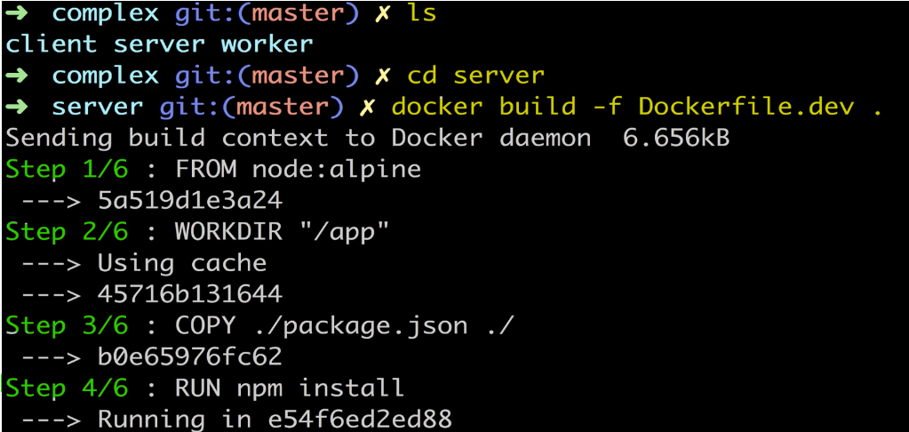
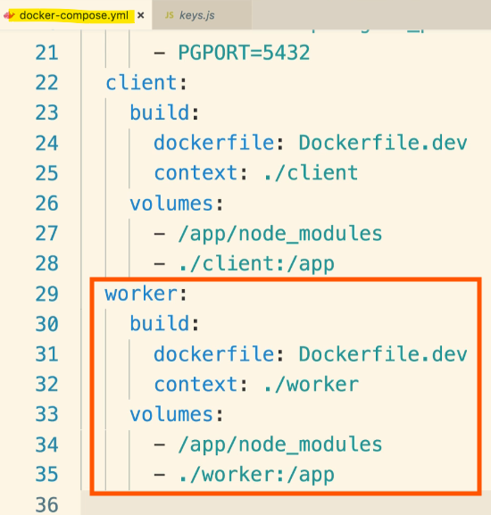
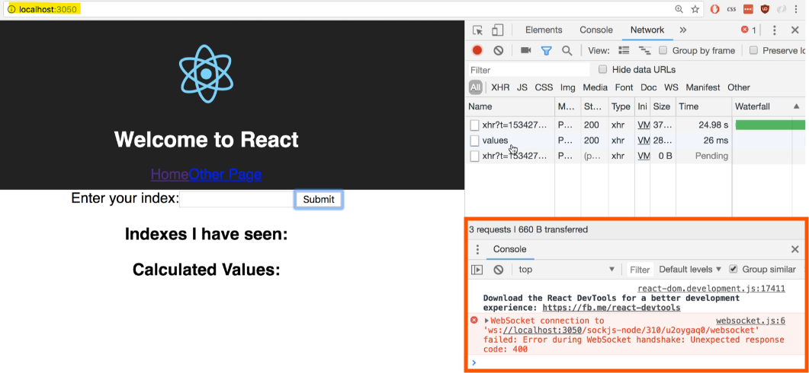
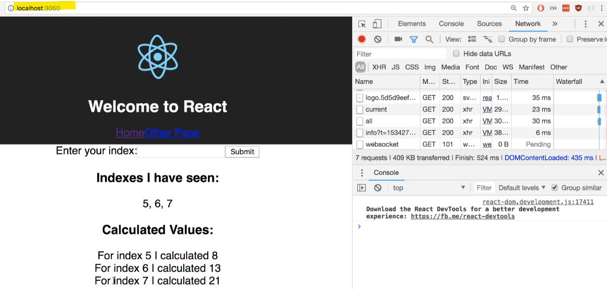

- [Section 9: "Dockerizing" Multiple Services](#section-9-dockerizing-multiple-services)
  - [Dockerizing a React App - Again!](#dockerizing-a-react-app---again)
    - [Adding Docker Containers for Development](#adding-docker-containers-for-development)
    - [Steps to Set Up Docker Containers](#steps-to-set-up-docker-containers)
    - [Setting Up Dockerfile for Client Directory](#setting-up-dockerfile-for-client-directory)
    - [Summary](#summary)
  - [Dockerizing Generic Node Apps](#dockerizing-generic-node-apps)
    - [Setting Up Development Dockerfiles for Server and Worker Projects](#setting-up-development-dockerfiles-for-server-and-worker-projects)
    - [Steps to Set Up Dockerfiles](#steps-to-set-up-dockerfiles)
    - [Building Docker Images](#building-docker-images)
    - [Summary](#summary-1)
  - [Adding Postgres as a Service](#adding-postgres-as-a-service)
    - [Setting Up Docker Compose for Development](#setting-up-docker-compose-for-development)
    - [Steps to Set Up Docker Compose](#steps-to-set-up-docker-compose)
    - [Summary](#summary-2)
  - [Docker-compose Configuration](#docker-compose-configuration)
    - [Adding Postgres and Redis to Docker Compose](#adding-postgres-and-redis-to-docker-compose)
    - [Server Configuration](#server-configuration)
  - [Environment Variables with Docker Compose](#environment-variables-with-docker-compose)
    - [Setting Up Environment Variables in Docker Compose](#setting-up-environment-variables-in-docker-compose)
    - [Steps Summary](#steps-summary)
  - [Required Worker Environment Variables](#required-worker-environment-variables)
  - [The Worker and Client Services](#the-worker-and-client-services)
    - [Adding Services for Worker and Client Projects in Docker Compose](#adding-services-for-worker-and-client-projects-in-docker-compose)
    - [Steps Summary](#steps-summary-1)
  - [Nginx Path Routing](#nginx-path-routing)
    - [Adding Nginx for Routing in Docker Compose](#adding-nginx-for-routing-in-docker-compose)
    - [Purpose of Nginx](#purpose-of-nginx)
    - [Client and Server Routes](#client-and-server-routes)
    - [Adding Nginx Service](#adding-nginx-service)
      - [For example:](#for-example)
    - [Port Mapping](#port-mapping)
    - [Chopping Off /API](#chopping-off-api)
    - [Steps Summary](#steps-summary-2)
  - [Routing with Nginx](#routing-with-nginx)
    - [Setting Up Nginx for Routing in Docker Compose](#setting-up-nginx-for-routing-in-docker-compose)
    - [Steps Summary](#steps-summary-3)
  - [Building a Custom Nginx Image](#building-a-custom-nginx-image)
    - [Creating a Custom Nginx Image with Docker](#creating-a-custom-nginx-image-with-docker)
    - [Steps Summary](#steps-summary-4)
  - [Starting Up Docker Compose](#starting-up-docker-compose)
    - [Testing the Nginx Service in Docker Compose](#testing-the-nginx-service-in-docker-compose)
    - [Steps Summary](#steps-summary-5)
  - [Nginx connect() failed - Connection refused while connecting to upstream](#nginx-connect-failed---connection-refused-while-connecting-to-upstream)
  - [Troubleshooting Startup Bugs](#troubleshooting-startup-bugs)
  - [Openinig Websocket Connections](#openinig-websocket-connections)
    - [Fixing Web Socket Connection Issue in Nginx](#fixing-web-socket-connection-issue-in-nginx)
    - [Understanding the Issue](#understanding-the-issue)
    - [Steps Summary](#steps-summary-6)

<br>

<hr style="height:4px;background:black">

<br>

# Section 9: "Dockerizing" Multiple Services

## Dockerizing a React App - Again!

### Adding Docker Containers for Development
> **Purpose**: Set up **Docker containers** for the **React** project, **Express API**, and **worker process** for development.

<br>


<br>

### Steps to Set Up Docker Containers
1. `Directory Structure`:
   * Ensure you have a complex directory with **client**, **server**, and **worker** folders.


<br>

   * Each folder represents the **React server**, **Express API**, and **worker process**, respectively.

<br>


<br>

2. `Development Docker Files`:
   * Create **development** Docker files for each application to ensure a smooth development process.
   * Avoid rebuilding the entire image for every small code change.

<br>

3. `Dockerfile Workflow`:
   * Copy `package.json` file.
   * Run `npm install`.
   * Copy over all other files.
   * Set up Docker Compose to share source code and avoid rebuilding images.

<br>

### Setting Up Dockerfile for Client Directory
1. `Open Terminal`:
   * Navigate to the **complex** directory.
   * Open your code editor based on the **complex** directory.

<br>

2. `Create Dockerfile.dev`:
   * Inside the **client** directory, create a new file named **Dockerfile.dev**.

<br>


<br>

Add the following content:
* **Base Image**: `FROM node:alpine`
  * Use the Node.jsAlpine image as the base image.
* **Working Directory**: `WORKDIR /app`
  * Set the working directory inside the container to /app.
* **Copy package.json**: `COPY package.json ./`
  * Copy the package.json file to the working directory.
* **Install Dependencies**: `RUN npm install`
  * Install the project dependencies.
* **Copy All Files**: `COPY . .`
  * Copy all files from the current directory to the working directory inside the container.
* **Set Default Command**: `CMD ["npm", "run", "start"]` 
  * Set the default command to start the React development server.

<br>

```dockerfile
FROM node:Its-alpine
WORKDIR /app
COPY package.json ./
RUN npm install
COPY . .
CMD ["npm", "run", "start"]
```

<br>


<br>

3. `Build Docker Image`:
   * In the terminal, change to the **client** directory:

```bash
cd client
```

<br>

* Build the Docker image using the **dockerfile.dev** file:

```bash
docker build -f Dockerfile.dev .
```

<br>


<br>

4. `Run Docker Container`:
   * Run the Docker container using the built image:

```bash
docker run -p 3000:3000 client-dev
```

* Use the docker run command to run the Docker container, mapping **port 3000** to access the React development server.
* The React development server should start, and the application should be accessible.

<br>


<br>

### Summary
* `Docker Containers`: Set up Docker containers for the React project, Express API, and worker process for development.
* `Dockerfile.dev`: Created a development Dockerfile for the client directory.
* `Build and Run`: Built and ran the Docker image to start the React development server.

<br>

<hr style="height:4px;background:black">

<br>

## Dockerizing Generic Node Apps

### Setting Up Development Dockerfiles for Server and Worker Projects
> **Purpose**: Create development Dockerfiles for the server and worker projects to ensure a smooth development process.

<br>

### Steps to Set Up Dockerfiles
1. `Server Project`:
   
   Create Dockerfile.dev:
   * Inside the **server** folder, create a new file named **Dockerfile.dev**.

Add the following content:

```dockerfile
FROM node:14.14.0-alpine
WORKDIR /app
COPY package.json ./
RUN npm install
COPY . .
CMD ["npm", "run", "dev"]
```

<br>

Add the following content:
* **Base Image**: `FROM node:alpine`
  * Use the Node.jsAlpine image as the base image.
* **Working Directory**: `WORKDIR /app`
  * Set the working directory inside the container to /app.
* **Copy package.json**: `COPY package.json ./`
  * Copy the package.json file to the working directory.
* **Install Dependencies**: `RUN npm install`
  * Install the project dependencies.
* **Copy All Files**: `COPY . .`
  * Copy all files from the current directory to the working directory inside the container.
* **Set Default Command**: `CMD ["npm", "run", "start"]` 
  * Set the default command to start the React development server.

<br>

2. `Worker Project`:

    * Create **Dockerfile.dev**:
      * Inside the **worker** folder, create a new file named **Dockerfile.dev**.
      * **Copy** the content from the server's Dockerfile.dev:

```dockerfile
FROM node:Isalpine
WORKDIR /app
COPY package.json ./
RUN npm install
COPY . .
CMD ["npm", "run", "dev"]
```

* The Dockerfile for the **worker** project is identical to the **server**'s Dockerfile, using `npm run dev` to start the worker with **nodemon**.

<br>


<br>

<hr style="height:4px;background:black">

<br>

### Building Docker Images
1. `Build Server Image`:

   * Open Terminal:
     * Navigate to the **complex** directory.
     * Change to the **server** directory:

```bash
cd server
```

* Build Image:
  * Run the following command to **build** the Docker image:

```bash
docker build -f Dockerfile.dev .
```

<br>




<br>

2. `Build Worker Image`:

   * Open Terminal:
     * Navigate to the **complex** directory.
     * Change to the **worker** directory:

```bash
cd worker
```

<br>

* Build Image:
  * Run the following command to build the Docker image:

```bash
docker build -f Dockerfile.dev .
```

<br>


<br>

### Summary
* `Dockerfiles`: Created development Dockerfiles for the server and worker projects.
* `Build and Run`: Built and ran Docker images for the server and worker projects.

<br>

<hr style="height:4px;background:black">

<br>

## Adding Postgres as a Service

### Setting Up Docker Compose for Development
> **Purpose**: Create a Docker Compose file to easily **start** up the **client**, **server**, and **worker** projects along with **Redis** and **Postgres databases**.

<br>

### Steps to Set Up Docker Compose
1. `Create Docker Compose File`:
   * In the **root** project directory (not inside any folder), create a file named **docker-compose.yml**.

<br>

2. `Basic Configuration`:
   * Add the following basic configuration to the **Docker Compose** file:

```yaml
version: '3'        # Specifies the version of the Docker Compose file format.
services:       # Defines the list of services to be started by Docker Compose.
```

<br>

3. `Add Postgres Service`:
   * Define the Postgres service in the Docker Compose file:

```yaml
services:
  postgres:
    image: postgres:latest
```

`Explanation`:
* **Service Name**: postgres
* **Image**: Specifies the Docker image to use for the Postgres service. 
  * The latest tag ensures the most recent version is used.

<br>

4. `Test Postgres Service`:
   * **Open Terminal**: Navigate to the complex directory.
   * **Run Docker Compose**: Use the following command to start the Postgres service:
     * Docker Compose will automatically **pull** the **Postgres image** and **start** the **database**.

```bash
docker-compose up
```

`Expected Output`:
* After downloading and setting up, you should see a message indicating that the database system is** ready to accept connections**.

<br>

### Summary
* `Docker Compose`: Created a Docker Compose file to manage the client, server, worker, Redis, and Postgres services.
* `Postgres Service`: Added and tested the Postgres service in the Docker Compose file.

<br>

<hr style="height:4px;background:black">

<br>

## Docker-compose Configuration


<br>

### Adding Postgres and Redis to Docker Compose
1. Postgres Setup:
   * Added Postgres as a **service** in the Docker Compose file.
   * Running `docker-compose up` will automatically make Postgres available.

2. Redis Setup:
   * Follow similar steps as Postgres to add Redis.
   * Find the Redis image on Docker Hub (explore tab).
   * Use the **latest** version of Redis (e.g., `redis:latest`).
   * No further configuration needed for Redis.

<br>


<br>

### Server Configuration
1. `Build Options`:
   * Specify how Docker Compose should build an image from the **source code**.
   * Use the **DockerFile.dev** file for building.
   * Set the context to the **server directory** to use the source code inside it.

<br>


<br>

2. `Volumes Setup`:
   * Ensure changes to the source code are reflected **inside** the container.
   * Specify the work directory as `/app` in the **DockerFile.dev**.
   * Prevent overriding the **node_modules** folder inside the container.
   * Map the **server directory** to the `/app` folder in the container.

<br>


<br>

3. `Environment Variables`:
   * Customise container behavior when started.
   * Set **variables** to **define** how the container **finds** the **Redis host** and **database**.

<br>

<hr style="height:4px;background:black">

<br>

## Environment Variables with Docker Compose


<br>

Dockumentation:
* Postgress: https://hub.docker.com/_/postgres
* Redis: https://hub.docker.com/_/redis


<br>

### Setting Up Environment Variables in Docker Compose
1. `Environment Variables`:
   * Environment variables **customise** the **server's behavior** when started as a container.
   * These variables are **referenced** in the **keys.js** file using **process.env**.

<br>


<br>

2. `Adding Environment Variables`:
   * In the Docker Compose file, add a section for **environment variables** under the **server** service.
   * Use the syntax `VARIABLE_NAME=value` to set variables.

<br>

3. `Syntax for Environment Variables`:
   * Common Syntax: `VARIABLE_NAME=value` (sets the variable inside the container at runtime).
   * Alternative Syntax: `VARIABLE_NAME` (takes the value from your computer's environment variables).

<br>


<br>

4. `Example Variables`:
   * **Redis Host**: REDIS_HOST=Redis (name of the Redis service).
   * **Redis Port**: REDIS_PORT=6379 (default port for Redis).

<br>


<br>

> Side note: you can highlight `env.` and then press `Ctrl + D` several times and that will do a **multi select** on that text selection.
> * You can then press `right` on your arrow key and then `Shift + Ctrl + right arrow` and that will select just the keyword.
> * You can then do a `Ctrl + C`, go back over to the Docker Compose file and then do a `Ctrl + V` to paste all that stuff in.

<br>


<br>

5. `Postgres Variables`:
   * **PG User**: PG_USER=postgres
   * **PG Host**: PG_HOST=postgres
   * **PG Database**: PG_DATABASE=postgres
   * **PG Password**: PG_PASSWORD=postgrespassword
   * **PG Port**: PG_PORT=5432 (default port for Postgres).

<br>


<br>

6. `Setting Up Environment Variables`:
   * Add environment variables in the Docker Compose file under the server service.
   * Use the syntax `VARIABLE_NAME=value` for each variable.

7. `Rebuild the server image`.
   * Save the Docker Compose file.
   * Run `docker-compose up` to rebuild the server image and apply the environment variables.

<br>

### Steps Summary
1. `Add Environment Variables`:
   * Define variables in the Docker Compose file under the server service.
   * Use the syntax VARIABLE_NAME=value.

2. `Example Variables`:
   * **Redis**: Redis_host=Redis, Redis_port=6379.
   * **Postgres**: PG_user=postgres, PG_host=postgres, PG_database=postgres, PG_password=postgrespassword, PG_port=5432.

3. `Testing`:
   * Save the Docker Compose file.
   * Run `docker-compose up` to rebuild the server image and apply the environment variables.

<br>

<hr style="height:4px;background:black">

<br>

## Required Worker Environment Variables
* When adding the "Worker" service, include the Redis host and port as environment variables:

For example:

```yml
worker:
    build:
      dockerfile: Dockerfile.dev
      context: ./worker
    volumes:
      - /app/node_modules
      - ./worker:/app
    environment:
      - REDIS_HOST=redis
      - REDIS_PORT=6379
```

<br>

<hr style="height:4px;background:black">

<br>

## The Worker and Client Services

### Adding Services for Worker and Client Projects in Docker Compose

> **Overview**:
> * The server is configured with environment variables to connect to Redis and Postgres.
> * Next, add services for the **worker** and **client** projects.

<br>

1. `Client Service`:
   * `Build Option`: Specify the Docker file and context folder.
     * Docker file: **dockerfile.dev**
     * Context: **./client**
   * `Volumes`: Set up volumes to avoid rebuilding the client image with every code change.
     * Prevent overwriting node_modules inside the container.
     * Map the client directory to the app folder inside the container.

<br>


<br>

2. `Worker Service`:
   * `Build Option`: Specify the Docker file and context folder.
     * Docker file: **dockerfile.dev**
     * Context: **./worker**
   * `Volumes`: Set up volumes similar to the client service.
     * Prevent overwriting node_modules inside the container.
     * Map the worker directory to the app folder inside the container.

<br>



<br>

3. [`Port Mapping`](#nginx-path-routing):
   * No port mapping has been set up yet.
   * Port mapping is needed to **expose the server** and **React project** to the **outside** world.

<br> 

4. `NGINX Server`:
   * NGINX will proxy or route requests from the browser to the React server or the Express server.

<br>

### Steps Summary
1. `Add Client Service`:
   * Define the **client service** in the Docker Compose file.
   * Specify the **build** option with **dockerfile.dev** and **context** as **./client**.
   * Set up **volumes** to map the **client directory** to the app folder **inside** the container.

2. `Add Worker Service`:
   * Define the **worker service** in the Docker Compose file.
   * Specify the **build** option with **dockerfile.dev** and **context** as **./worker**.
   * Set up **volumes** to map the **worker directory** to the app folder **inside the container**.

3. `Port Mapping`:
   * Ensure port mapping is set up to **expose the server** and React project to the outside world.

4. `NGINX Configuration`:
   * Understand the role of NGINX in proxying or routing requests.

<br>

<hr style="height:4px;background:black">

<br>

## Nginx Path Routing


<br>

### Adding Nginx for Routing in Docker Compose
> **Overview**:
> * The Docker Compose file currently has no port mappings, so nothing is exposed to the outside world.
> * Nginx will be used to route requests to the appropriate servers (React or Express).

<br>


<br>

### Purpose of Nginx
* Nginx will handle **routing requests** from the **browser** to the correct **server**.
* It will differentiate between requests for the React server (HTML, JS files) and the Express server (API requests).

<br>

### Client and Server Routes
* **Server** handles routes like `/values/all`, `/values/current`, etc.

<br>


<br>

* **Client** makes requests to `/API` routes.
* Nginx will route `/API` requests to the **Express server** and **other** requests to the **React server**.

<br>


<br>

### Adding Nginx Service
* Add an **Nginx service** to the Docker Compose file.
* Nginx will **inspect incoming requests** and **route them** based on the **request path**.
* Requests with `/API` will be routed to the **Express server**.
* **Other** requests will be routed to the **React server**.

<br>


<br>

#### For example:


<br>

### Port Mapping
* Instead of assigning ports to each server, use Nginx to handle routing.
* This **simplifies the setup** and **avoids** the need to **manage multiple ports**.

<br>

### Chopping Off /API
* Nginx will remove the `/API` part of the route before forwarding the request to the Express server.
* This allows the **Express server** to **handle routes** without needing to account for `/API`.
  * For example, api/values/all will now be '/values/all'.

<br>


<br>

### Steps Summary
1. `Add Nginx Service`:
   * Define the Nginx service in the Docker Compose file.
   * Configure Nginx to **route requests** based on the **request path**.

2. `Routing Logic`:
   * Route **/API** requests to the **Express server**.
   * Route **other** requests to the **React server**.

3. `Port Mapping`:
   * Use Nginx to handle routing instead of assigning ports to each server.

4. `Chopping Off /API`:
   * Nginx will **remove /API** from the request path **before forwarding** to the Express server.

<br>

<hr style="height:4px;background:black">

<br>

## Routing with Nginx

### Setting Up Nginx for Routing in Docker Compose
> **Overview**:
> * Nginx will watch for incoming requests and route them to the appropriate back-end server.
> * Create a special configuration file called **default.conf** to set up routing rules.

<br>


<br>

1. `Creating default.conf`:
   * Create a new folder called "nginx" and create a file called **default.conf**.
   * This file will be added to an Nginx image.
   * It contains configuration to implement **routing rules**.
     * This file is where you define the rules for routing requests. 
     * It tells Nginx how to handle incoming requests and where to send them.

<br>


<br>

2. `Upstream Servers`:
   * Define **upstream servers** for **client** and **server**.
     * **Client**: client:3000 (Create React App listens on port 3000 by default).
     * **Server**: server:5000 (Express server listens on port 5000).

<br>


<br>

3. `Nginx Configuration`:
   * Nginx listens on **port 80** inside the container.

4. `Set up routing rules`:
   * Requests to `/` are routed to the **client** upstream.
   * Requests to `/API` are routed to the **server** upstream.

5. `Changing Service Names`:
   * To avoid confusion with the keyword server, **rename** the **Express** service to **API** in the Docker Compose file.

<br>


<br>

6. `Routing Rules`:
   * **Client**: proxy_pass http://client;
   * **API**: proxy_pass http://API;
   * Add a **rewrite rule** to remove `/API` from the request path before forwarding to the server.
     * The rewrite rule **removes** the `/API` part of the request path before forwarding it to the server. 
     * This ensures that the server receives the correct path.

<br>


<br>

7. `Double-Check Configuration`:
   * Ensure all statement lines in the **default.conf** file have **semicolons** at the end.

<br>

8. [`Creating Nginx Container`](#building-a-custom-nginx-image):
   * The **default.conf** file needs to be added to an **Nginx image**.
   * Create a separate Nginx **container**.
   * Build a Docker file for the Nginx container.

<br>

9. `Docker File for Nginx`:
    * The Docker file will create a custom Nginx image with the custom configuration applied.

<br>

### Steps Summary
1. `Add Nginx Service`:
   * Define the **Nginx service** in the Docker Compose file.
   * Configure Nginx to route requests based on the request path.

<br>

2. `Routing Logic`:
   * Route **/API** requests to the **Express** server.
   * Route **other** requests to the **React** server.

<br>

3. `Port Mapping`:
   * Use Nginx to handle routing instead of assigning ports to each server.

<br>

4. `Chopping Off /API`:
   * Nginx will **remove /API** from the request path before forwarding to the server.

<br>

5. `Double-Check Configuration`:
   * Ensure all statement lines in the default.conf file have semicolons at the end.

<br>

6. [`Create Nginx Container`](#building-a-custom-nginx-image):
   * Add the **default.conf** file to an Nginx image.
   * **Create** a separate **Nginx** container.
   * Build a Docker file for the Nginx container.

<br>

<hr style="height:4px;background:black">

<br>

## Building a Custom Nginx Image

### Creating a Custom Nginx Image with Docker
> **Overview**:
> * We will create a Docker file to build a custom Nginx image and apply the default.conf configuration file to it.

<br>

1. `Pulling the Nginx Image`:
   * Go to Docker Hub.
   * Search for the [Nginx](https://hub.docker.com/_/nginx) image in the explore tab.
     *  What you see right here, is all we have to do inside of our docker file.

<br>


<br>

2. `Creating the Docker File`:
   * Create a new file called **Dockerfile.dev** inside the **Nginx folder**.
   * Set up the base image with **FROM nginx**.
   * Copy the **default.conf** file into the image's file system.

<br>

3. `Docker File Content`:
   * The Docker file should look like this:

```dockerfile
FROM nginx
COPY default.conf /etc/nginx/conf.d/default.conf
```

* This copies the **default.conf** file into the **/etc/nginx/conf.d/** directory, overwriting the existing default configuration.

<br>


<br>

4. `Adding Nginx Service to Docker Compose`:
   * Open the **Docker-Compose** file.
   * Add a new **service** called **nginx**.
     * **Use the restart**: always policy to ensure Nginx is **always** running.
     * Specify the **build** context and Docker file for the custom Nginx image.
     * Set up **port mapping** to expose Nginx to the outside world.
       * This maps port **3050** on your local machine to **port 80** inside the Nginx container.

The Docker-Compose configuration for Nginx should look like this:
<br>


<br>

### Steps Summary
1. `Pull Nginx Image`:
   * Go to Docker Hub and search for the Nginx image.

2. `Create Docker File`:
   * Create **Dockerfile.dev** in the Nginx folder.
   * Set up the base image with **FROM nginx**.
   * Copy **default.conf** to /etc/nginx/conf.d/.

3. `Add Nginx Service to Docker Compose`:
   * Open the Docker Compose file.
   * Add the Nginx service with **restart: always**.
   * Specify the build context and Docker file.
   * Set up port mapping to expose Nginx.

<br>

<hr style="height:4px;background:black">

<br>

## Starting Up Docker Compose

### Testing the Nginx Service in Docker Compose
1. `Starting Docker Compose`:
   * Open the terminal.
   * Make sure you are in the correct directory (e.g., the complex directory) before running the command.

> Note: If you have a previous copy of Docker Compose running, stop it by hitting `Ctrl + C`.

* Start all services listed in the Docker Compose file with the command:

```sh
docker-compose up --build
```

* The `--build` flag forces a rebuild of everything.

<br>

### Steps Summary
1. `Expect Initial Crashes`:
   * Be prepared for some services to crash on the first startup.
   * Nginx should automatically reboot due to the restart policy.

2. `Start Docker Compose`:
   * Open the terminal and stop any previous Docker Compose instances with `Ctrl + C`.
   * Run `docker-compose up --build` to start and rebuild all services.

3. `Ensure Correct Directory`:
   * Verify you are in the correct directory before running the command.

4. `Build Process`:
   * Allow time for the build process to complete.
   * Address any crashes in the next steps.

<br>

<hr style="height:4px;background:black">

<br>

## Nginx connect() failed - Connection refused while connecting to upstream
* The nginx upstream connection is failing after they run docker-compose up --build:

```sh
connect() failed (111: Connection refused) while connecting to upstream, client:[DOCKER INTERNAL IP], server:, request: "GET / HTTP/1.1", upstream: [NETWORK IP]
```

The solution they found was to add this to their nginx service in the **docker-compose.yml** file:

```yml
  nginx:
    depends_on:
      - api
      - client
```

<br>

<hr style="height:4px;background:black">

<br>

## Troubleshooting Startup Bugs

1. `Troubleshooting Initial Errors`:
   * If you encounter errors, restart the Docker Compose process.
   * Stop all containers by hitting `Ctrl + C`.

Start them again with the command:

```sh
docker-compose up
```

<br>

2. `Checking for Successful Startup`:
   * Look for messages indicating the development server has started and compiled successfully.
   * If you see errors related to typos or invalid syntax, download the completed intermediate code zip file from earlier lectures.
   * Extract the zip file into your project directory, overwriting any existing files.
   * Restart the Docker Compose process.

<br>

3. `Testing the Application`:
   * Open your browser and navigate to localhost:3050 (based on the port mapping in the Docker Compose file).
   * You should see the application page.

<br>


<br>

4. `Handling Console Errors`:
   * Open the Chrome console by right-clicking and selecting "Inspect" or by pressing F12 on Windows.
   * You might see a red error message related to the web socket connection.
     * This error occurs because the React application in development mode tries to keep an active connection to the development server.

<br>



<br>

5. `Testing Fibonacci Calculation`:
   * Enter a value (e.g., 5) in the input field to calculate a Fibonacci value.
   * Submit the value and check the **network request** tab for the **values request**.
   * If the request takes a long time, it is okay. The error will be fixed in the next steps.
   * Refresh the page to see the calculated Fibonacci value.

<br>


<br>

<hr style="height:4px;background:black">

<br>

## Openinig Websocket Connections

### Fixing Web Socket Connection Issue in Nginx
> **Overview**:
> * We got our application working, but there is a red error message in the Chrome console about a web socket connection.
> * The issue is that our **Nginx server** is **not** set up to **allow web socket connections**.

<br>

### Understanding the Issue
* The **React** app in the browser wants to **maintain** an **active connection** to the **development server** to get **notifications** when the **source code changes**.
* This requires a **web socket connection**, which is not currently allowed by our Nginx configuration.

> Note: Web socket connections allow the React app to receive **live updates** from the development server. This is essential for a smooth development experience.

<br>

1. `Modifying Nginx Configuration`:
   * Open the **default.conf** file in your code editor.
   * Inside the **server** block, add a route to **allow web socket connections**.

<br>


<br>

2. `Configuration Changes`:
   * Add the following configuration to the **default.conf** file:

```nginx
location /sockjs-node {
  proxy_pass http://client;
  proxy_http_version 1.1;
  proxy_set_header Upgrade $http_upgrade;
  proxy_set_header Connection "Upgrade";
}
```

<br>


<br>

* This configuration **allows** web socket connections to be **proxied** to the running **React process**.
  * The `proxy_pass` directive **forwards web socket connections** to the **React** process. 
  * The proxy_http_version, proxy_set_header Upgrade, and proxy_set_header Connection directives ensure that the **web socket connection** is properly **established**.

<br>

3. `Rebuilding Nginx Container`:
   * After making changes to the Nginx configuration, rebuild the Nginx container.
   * Stop all running containers with `Ctrl + C`.
   * Run the following command to rebuild and start the containers:

```sh
docker-compose up --build
```

<br>


<br>

4. `Handling Dependency Issues`:
   * If you see any error messages, stop the process with `Ctrl + C` and restart with `docker-compose up`.

> Note: Sometimes the API might start too quickly before Redis or Postgres are ready. This will be fixed in the **production** environment.

<br>

5. `Testing the Application`:
   * Navigate to **localhost:3050** in your browser.
   * **Refresh** the page to see if the error message is gone.
   * Test the Fibonacci calculation by entering an index (e.g., 7) and submitting it.
   * Refresh the page to see the calculated value.

<br>



<br>

### Steps Summary
1. `Understand the Issue`:
   * The React app needs a web socket connection to the development server for live updates.

2. `Modify Nginx Configuration`:
   * Open default.conf and add the configuration to allow web socket connections.

3. `Rebuild Nginx Container`:
   * Stop running containers with `Ctrl + C`.
   * Rebuild and start containers with `docker-compose up --build`.

4. `Handle Dependency Issues`:
   * Restart the process if you see any error messages.

5. `Test the Application`:
   * Navigate to localhost:3050 and refresh the page.
   * Test the Fibonacci calculation and verify the results.

<br>

<hr style="height:4px;background:black">

<br>


