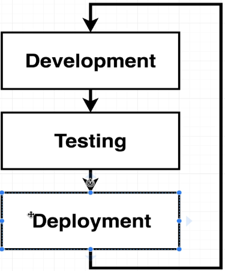
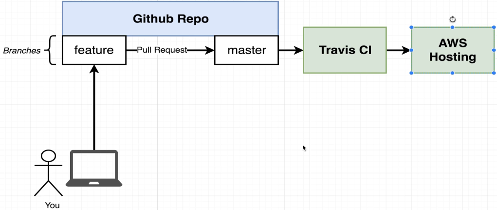

- [Section 6: Creating a Production-Grade Workflow](#section-6-creating-a-production-grade-workflow)
  - [Development Workflow](#development-workflow)
  - [Flow Specifics](#flow-specifics)
    - [Key Components](#key-components)
    - [Workflow Steps](#workflow-steps)
    - [Summary](#summary)
    - [The Flow Diagram](#the-flow-diagram)
  - [Docker's Purpose](#dockers-purpose)
    - [Key Points](#key-points)
    - [Workflow Without Docker](#workflow-without-docker)
    - [Why Use Docker?](#why-use-docker)
    - [Focus on Services](#focus-on-services)
    - [Summary](#summary-1)
  - [Project Generation](#project-generation)
    - [Overview](#overview)
    - [Project Setup](#project-setup)
    - [Installing Node.js](#installing-nodejs)
    - [Next Steps](#next-steps)
    - [Summary](#summary-2)
  - [Project Generation frontend Folder](#project-generation-frontend-folder)
  - [Necessary Commands](#necessary-commands)
    - [Changing into the Project Directory](#changing-into-the-project-directory)
    - [Key Commands](#key-commands)
    - [Running the Commands](#running-the-commands)
    - [Summary](#summary-3)
  - [Creating the Dev Dockerfile](#creating-the-dev-dockerfile)
    - [Steps to Create the Development Dockerfile](#steps-to-create-the-development-dockerfile)
    - [Handling Warnings and Errors](#handling-warnings-and-errors)
    - [Summary](#summary-4)
  - [Duplicating Dependencies](#duplicating-dependencies)
    - [Issue with Build Context Size](#issue-with-build-context-size)
    - [Solution](#solution)
    - [Steps to Optimise the Build Process](#steps-to-optimise-the-build-process)
    - [Summary](#summary-5)
  - [Starting the Container](#starting-the-container)
    - [Steps to Run the Development Server](#steps-to-run-the-development-server)
    - [Making Changes to the Source Code](#making-changes-to-the-source-code)
    - [Summary](#summary-6)
  - [Docker Volumes](#docker-volumes)
    - [Overview](#overview-1)
    - [Current Dockerfile Workflow](#current-dockerfile-workflow)
    - [Solution: Docker Volumes](#solution-docker-volumes)
    - [Setting Up Docker Volumes](#setting-up-docker-volumes)
    - [Handling Errors](#handling-errors)
  - [Bookmarking Volumes](#bookmarking-volumes)
    - [Understanding Docker Volume Mapping](#understanding-docker-volume-mapping)
    - [Key Takeaways](#key-takeaways)
  - [Shorthand with Docker Compose](#shorthand-with-docker-compose)
    - [Simplifying Docker Commands with Docker Compose](#simplifying-docker-commands-with-docker-compose)
    - [Creating a Docker Compose File](#creating-a-docker-compose-file)
    - [Docker Compose File Structure](#docker-compose-file-structure)
    - [Key Takeaways](#key-takeaways-1)
  - [Overriding Dockerfile Selection](#overriding-dockerfile-selection)
    - [Fixing Docker Compose File Issues](#fixing-docker-compose-file-issues)
    - [Key Takeaways](#key-takeaways-2)
  - [Do We Need Copy?](#do-we-need-copy)
    - [Setting Up Docker Compose and Volume Mounts](#setting-up-docker-compose-and-volume-mounts)
    - [Key Takeaways](#key-takeaways-3)
  - [Executing Tests](#executing-tests)
    - [Building the Container](#building-the-container)
    - [Running Tests](#running-tests)
    - [Interactive Mode](#interactive-mode)
    - [Using Tags](#using-tags)
    - [Key Takeaways](#key-takeaways-4)
  - [Live Updating Tools](#live-updating-tools)
    - [Running Tests with Docker Compose](#running-tests-with-docker-compose)
    - [Solution 1: Attach to Existing Container](#solution-1-attach-to-existing-container)
    - [Solution 2: Create a Second Service](#solution-2-create-a-second-service)
      - [Example of adding a second service for tests:](#example-of-adding-a-second-service-for-tests)
    - [Key Takeaways](#key-takeaways-5)
  - [Docker Compose for Running Tests](#docker-compose-for-running-tests)
    - [New Approach: Creating a Second Service](#new-approach-creating-a-second-service)
    - [Limitations](#limitations)
    - [Key Takeaways](#key-takeaways-6)
  - [Shortcomings on Testing](#shortcomings-on-testing)
    - [Handling Interactive Commands](#handling-interactive-commands)
    - [Using Docker Attach](#using-docker-attach)
    - [Exploring Processes](#exploring-processes)
    - [Limitations](#limitations-1)
    - [Key Takeaways](#key-takeaways-7)
  - [Nginx: Preparing Docker Container for Production](#nginx-preparing-docker-container-for-production)
    - [Development vs. Production](#development-vs-production)
    - [npm run build](#npm-run-build)
    - [Development Environment](#development-environment)
    - [Production Environment](#production-environment)
    - [Using NGINX](#using-nginx)
    - [Creating the Production Dockerfile](#creating-the-production-dockerfile)
    - [Key Takeaways](#key-takeaways-8)
  - [Multi-Step Docker Builds: Using NGINX for Production Environment](#multi-step-docker-builds-using-nginx-for-production-environment)
    - [Development vs. Production](#development-vs-production-1)
    - [Creating a Production Dockerfile](#creating-a-production-dockerfile)
    - [Using Node Alpine](#using-node-alpine)
    - [Generating Production Assets](#generating-production-assets)
    - [Using NGINX](#using-nginx-1)
    - [Multi-Step Build Process](#multi-step-build-process)
    - [Benefits of Multi-Step Build](#benefits-of-multi-step-build)
    - [Key Takeaways](#key-takeaways-9)
  - [Implementing Multi-Step Builds for Production Dockerfile](#implementing-multi-step-builds-for-production-dockerfile)
    - [Multi-Step Build Process](#multi-step-build-process-1)
    - [Creating the Dockerfile](#creating-the-dockerfile)
    - [Build Phase](#build-phase)
    - [Run Phase](#run-phase)
    - [Benefits of Multi-Step Build:](#benefits-of-multi-step-build-1)
    - [Key Takeaways](#key-takeaways-10)
  - [Running Nginx](#running-nginx)
    - [Building the Docker Image:](#building-the-docker-image)
    - [Build Process](#build-process)
    - [Running the Docker Container](#running-the-docker-container)
    - [Testing the Application](#testing-the-application)
    - [Production-Ready Setup](#production-ready-setup)
    - [Key Takeaways](#key-takeaways-11)

<br>

<hr style="height:4px;background:black">

<br>

# Section 6: Creating a Production-Grade Workflow

## Development Workflow



<br>

<hr style="height:4px;background:black">

<br>

## Flow Specifics

### Key Components
1. `GitHub Repository`
   * Central point for coordinating code.
   * Two branches: **feature** branch (development) and **master** branch (clean working copy).


<br>

2. `Development Process`
   * **Pull** the latest code from the feature branch.
   * Make **changes** on your local machine.

<br>


<br>

   * **Push** changes back to the feature branch.

<br>


<br>

   * Create a **pull request** to **merge changes** into the master branch.

<br>


<br>

3. `Continuous Integration with Travis CI`
   * **Travis CI** (continuous integration provider) **pulls** the **code** from the **master branch**.
   * **Runs tests** on the code.
   * If tests pass, Travis CI **deploys the application** to **AWS**.

<br>



<br>

### Workflow Steps
1. `Development Phase`
   * Make **changes** to the **feature** branch.
   * **Push** changes to GitHub.
   * Create a **pull request** to merge with the master branch.

2. `Testing Phase`
   * Travis CI **pulls the master** branch.
   * **Runs tests** on the code.
   * If tests pass, **merge changes** to the **master branch**.

3. `Production Phase`
   * Travis CI **deploys the application to AWS** Elastic Beanstalk.

<br>

### Summary
* The workflow involves developing on the feature branch, testing with Travis CI, and deploying to AWS.
* This process ensures code quality and automates deployment.

<br>

### The Flow Diagram


<br>

<hr style="height:4px;background:black">

<br>

## Docker's Purpose

### Key Points
* Docker is **not** a requirement for the development workflow.
* The workflow can be executed without Docker, using tools like GitHub, Travis CI, and AWS.
* Docker is a tool that makes **executing tasks easier** but is not essential.

<br>

### Workflow Without Docker
* The development workflow involves using **GitHub** for **version control**, **Travis CI** for **continuous integration**, and **AWS** for **deployment**.
* Docker is not mentioned in the core steps of this workflow.

<br>

### Why Use Docker?
* Docker **simplifies the process** of **managing dependencies** and **environments**.
* It **ensures consistency** across different stages of development, testing, and deployment.
* Docker makes it **easier to replicate** the same **environment** across **different machines**.

<br>

### Focus on Services
* At times, the focus will be more on GitHub, AWS, or Travis CI rather than Docker.
* Understanding how to use these services with Docker is crucial.

<br>

### Summary
* Docker is a helpful tool but not a requirement for the development workflow.
* The focus is on using Docker to make tasks easier and ensure consistency.

<br>

<hr style="height:4px;background:black">

<br>

## Project Generation

### Overview
> Install dependencies and generate a project to wrap inside a Docker container.

### Project Setup
* The application will be a simple React front end.
* We'll use a project generator to create the application, with no custom code required from us.

<br>

### Installing Node.js
1. **Check Node.jsInstallation**
   * Open your terminal and run `node -v`.
   * If you see a version number, Node.jsis installed.

2. **Install Node.js** (if not installed)
   * Search for "Node download" in your browser.
   * Go to the [Node.jsdownload](https://nodejs.org/en/download) page (e.g., nodejs.org).
   * Choose either the stable version (LTS) or the current version.
   * Download the installer for your operating system (Windows, macOS, or Linux).
   * Run the installer and follow the prompts.

3. **Verify Installation**
   * After installation, restart your terminal.
   * Run `node -v` again to ensure Node.jsis installed correctly.


<br>

### Next Steps
* Once Node.jsis installed, we'll generate a **React project** and wrap it **inside a Docker container**.

### Summary
* We need Node.jsinstalled to generate the React project.
* Follow the steps to install Node.jsif it's not already installed.
* We'll use a project generator to create the React application.

<br>

<hr style="height:4px;background:black">

<br>

## Project Generation frontend Folder
* Can be found in Udemy Learning > "Docker" folder.


<br>

## Necessary Commands


<br>

### Changing into the Project Directory
* Change into the directory created for the project (e.g., cd front-end).

### Key Commands
1. `npm run start`
   * Starts a development server to host the application.

> Note: This server is for development only and not suitable for production.

2. `npm run test`
   * Runs tests associated with the project.
   * The generated React project includes one or two default tests.

3. `npm run build`
   * Creates an optimized production build.
   * Combines all JavaScript files into a single file for production.

<br>

### Running the Commands
1. **Run Tests**
   * Execute `npm run test` to start the test runner.
   * Press Q to exit the test runner.

2. **Build the Project**
   * Execute `npm run build` to create a production build.
   * A build directory will be created with the optimized files.

3. **Start the Development Server**
   * Execute `npm run start` to start the development server.
   * The application will open in a browser tab at **localhost:3000**.

<br>

### Summary
* We have commands to start the application in development, run tests, and create a production build.
* These commands are essential for understanding how to interact with the project.

<br>

<hr style="height:4px;background:black">

<br>

## Creating the Dev Dockerfile


<br>

### Steps to Create the Development Dockerfile
1. **Create the Dockerfile**
   * In your project directory, create a new file named **Dockerfile.dev**.
   * This file will be used specifically for development purposes.

2. **Write the Dockerfile Configuration**
   * Base Image
     * Use node:alpine as the base image.
     * Ideally, you want to specify a specific version of Node to avoid bugs.
     * Example: `FROM node:alpine`

   * Set Working Directory
      * Set the working directory to /app.
      * Example: `WORKDIR /app`

   * Copy package.json
      * Copy the package.json file to the working directory.
      * Example: `COPY package.json ./`

   * Install Dependencies
      * Run npm install to install dependencies.
      * Example: `RUN npm install`

   * Copy All Files
      * Copy all remaining files to the working directory.
      * Example: `COPY . ./`

   * Start the Application
      * Use CMD to start the application in development mode.
      * Example: `CMD ["npm", "run", "start"]`

<br>


<br>

3. **Build the Docker Image**
   * Use the docker build command with the `-f` flag to specify the custom Dockerfile.
   * Example: `docker build -f Dockerfile.dev -t your_image_name .`

<br>


<br>

### Handling Warnings and Errors
* It's normal to see warnings during the build process; they can be **ignored**.
* If you see any errors, address them as needed.

<br>

### Summary
* We created a **Dockerfile.dev** for development purposes.
* The Dockerfile includes steps to set up the **environment**, **install dependencies**, and **start** the **application**.
* Use the docker build command with the `-f` flag to build the image using the custom Dockerfile.

<br>

<hr style="height:4px;background:black">

<br>

## Duplicating Dependencies

### Issue with Build Context Size
* The **Create React App** tool automatically installed dependencies into the project directory.
* The node_modules folder contained 155 megabytes of dependencies.
* This caused the build context to be larger than necessary.

<br>

### Solution
* Delete the node_modules folder from the working directory.
* This ensures that dependencies are only installed within the Docker image, not in the local project directory.

<br>

### Steps to Optimise the Build Process
1. **Delete node_modules Folder**
   * Remove the node_modules folder from the project directory.
   * This can be done by moving it to the trash.

2. **Rebuild the Docker Image**
   * Use the docker build command with the -f flag to specify the custom Dockerfile.
     * **Example**: `docker build -f Dockerfile.dev -t your_image_name` 
   * The build process should now be faster and more efficient.

<br>

### Summary
* Deleting the node_modules folder from the project directory reduces the build context size.
* Rebuilding the Docker image after this change results in a faster and more efficient build process.

<br>

<hr style="height:4px;background:black">

<br>

## Starting the Container

> Create a container from the image and ensure we can access the development server.

<br>

### Steps to Run the Development Server
1. **Create a Container**
   * Copy the image ID from the build process.
   * Run the command `docker run <image_id>` to create a container.
   * The development server will start, and you'll see a message indicating it can be accessed at **localhost:3000**.

<br>


<br>

2. **Access the Development Server**
   * Open a new browser tab and navigate to **localhost:3000**.
   * If you see "This site can't be reached," it means the **port** is **not exposed**.

<br>


<br>

3. **Expose the Port**
   * Use the `-P` flag to map the port from the container to your local machine.
     * **Example**: `docker run -P 3000:3000 <image_id>`.
   * This maps port 3000 on your local machine to port 3000 inside the container.

<br>


<br>

4. **Verify the Server**
   * The development server should start, and you should see the welcome message in the browser at **localhost:3000**.

<br>


<br>

### Making Changes to the Source Code
1. `Edit the Source Code`
   * Open the **src** directory and find the **App.js** file.
   * Replace the text "To get started, edit src/App.js" with something like "Hi there."

<br>


<br>

2. `Refresh the Browser`
   * Save the changes and refresh the browser.
   * You won't see the changes reflected because the image was built with a snapshot of the source code.

<br>

### Summary
* We created a container from the Docker image and accessed the development server.
* To see changes in the source code, we need a solution to automatically propagate changes into the container.

<br>

<hr style="height:4px;background:black">

<br>

## Docker Volumes

### Overview
> Use Docker volumes to ensure changes are automatically propagated into the container.

<br>

### Current Dockerfile Workflow
* The Dockerfile copies the **package.json** file, **installs dependencies**, and **copies** the **source code** into the container.
* This creates a **snapshot** of the source code that **doesn't update with changes**.

<br>

### Solution: Docker Volumes
* Docker volumes allow us to **map** (reference) a **folder inside the container** to a **folder outside the container**.
* This ensures **changes** to the source code are **reflected** in the **running container** without rebuilding the image.

<br>


<br>

### Setting Up Docker Volumes


<br>

1. **Adjust the docker run Command**
   * Use the `-v` flag to set up a volume.
     * Example command: `docker run -p 3000:3000 -v $(pwd):/app <image_id>`
   * This maps the current **working directory** to the **/app** directory **inside** the **container**.
     * We're essentially saying **get** the present **working directory** (or the path to it), and take this folder (like this front end folder and everything inside of it), and **map** it up to the **app folder** running **inside** of our **container**.

> Note: This command won't work for Windows CLI or PowerShell but should work via Git Bash.

<br>

1. **Explanation of the Command**
   * `-p 3000:3000`: Maps **port 3000** on the **local** machine to **port 3000** **inside** the **container**.
   * `-v $(pwd):/app`: Sets up a **volume mapping** the present working directory (pwd) to /app **inside** the container.

<br>

3. **Running the Command**
   * Rebuild the image if necessary:
     * Example command: `docker build -f Dockerfile.dev -t your_image_name .`
   * Run the container with the volume mapping:
     * Example command: `docker run -p 3000:3000 -v $(pwd):/app <image_id>`

<br>

### Handling Errors
* If you encounter an error like "React Scripts not found," it indicates an issue with the volume setup.
* Ensure the volume mapping is correct and includes all necessary files.
* For more information on this error, please visit: [Solutions](https://spartaglobal.udemy.com/course/docker-and-kubernetes-the-complete-guide/learn/lecture/18799500#overview). 

<br>

> ### Summary
> * Docker volumes allow changes to the source code to be reflected in the running container.
> * Use the `-v` flag with the `docker run` command to set up the volume mapping.

<br>

<hr style="height:4px;background:black">

<br>

## Bookmarking Volumes

### Understanding Docker Volume Mapping
1. **Volume Command:**
   * The `-v` flag in Docker is used to **set up a mapping** between a **file or folder inside** the Docker **container** and a **file or folder** on your **local machine**.

<br>


<br>

2. **Common Issue:**
   * When mapping the entire present working directory to the app folder inside the container, the **node_modules folder** (which contains dependencies) might get **overwritten** if it **doesn't exist** in the **local directory**.

<br>


<br>

3. **Solution:**
   * To prevent overwriting, use an additional `-v` flag specifically for node_modules:
     * **Example**: `-v /app/node_modules`
   * This tells Docker to **keep** the node_modules **folder** inside the container **intact** and **not map** it to anything on the local machine.

<br>


<br>

4. **Running the Command:**
   * Modify the Docker run command to include the additional `-v` flag:
     * **Example**: `docker run -v /app/node_modules -v $(pwd):/app your_image_name`
   * This ensures the project starts up correctly without losing dependencies.

<br>


<br>

5. **Automatic Refresh with React:**
   * Changes made to local files are propagated into the running container.
   * The **React server** inside the container **detects** these changes and **updates the page automatically**.

For example:

<br>


<br>

After a refresh, it changes into:

<br>


<br>

6. **Testing Changes:**
   * After setting up the volume correctly, you can make changes to files (e.g., app.js) and see them reflected in real-time on the browser.

<br>

### Key Takeaways
* `Volume Mapping`: Essential for linking local files with container files.
* `Prevent Overwriting`: Use specific `-v` flags to protect important folders like node_modules.
* `Real-Time Updates`: Proper volume setup allows for seamless development with automatic updates.

<br>

<hr style="height:4px;background:black">

<br>

## Shorthand with Docker Compose

### Simplifying Docker Commands with Docker Compose
`Docker Volumes`:
* Docker volumes allow **changes** made to **source code** on your **local machine** to be **reflected inside** the **container** automatically.

`Long Docker Run Command`:
* Running the Docker container with volumes requires a long command with multiple options (ports, volumes, image ID), which can be cumbersome.

`Docker Compose`:
* Docker Compose **simplifies** the process of **running Docker containers** by allowing you to **define** and **manage multi-container** Docker **applications**.
* Even with a single container, Docker Compose can make the command shorter and easier to manage.

<br>

### Creating a Docker Compose File
* Create a file named **docker-compose.yml** in the root project directory.
* The file will include settings for ports and volumes.

<br>

### Docker Compose File Structure

1. Specify the version: "3"
2. Define services (containers to be created):

```yaml
services:
  web:
    build: .
    ports:
      - "3000:3000"
    volumes:
      - /app/node_modules
      - .:/app
```
* In this example, the service is named web, and it uses the current directory for building the image. Ports and volumes are also specified.

<br>


<br>

`Running Docker Compose`:
* Instead of using the long docker run command, you can now start the container with:
  * **Example**: `docker-compose up`
* This command uses the settings defined in the docker-compose.yml file.

`Handling Errors`:
* If you encounter an error like "Cannot find a docker file," ensure that the correct Dockerfile is specified in the docker-compose.yml file.
* For example, if your Dockerfile is named Dockerfile.dev, update the build section:

```yaml
build:
  context: .
  dockerfile: Dockerfile.dev
```

<br>

### Key Takeaways
* `Docker Compose`: Simplifies running Docker containers by using a configuration file.
* `Shorter Commands`: Replace long docker run commands with docker-compose up.
* `Configuration`: Define ports, volumes, and other settings in the docker-compose.yml file.

<br>

<hr style="height:4px;background:black">

<br>

## Overriding Dockerfile Selection

### Fixing Docker Compose File Issues
1. `Docker Compose File`:
   * We created a **docker-compose.yml** file to simplify running Docker containers without using long docker run commands.

2. `Issue with Dockerfile`:
   * The issue arose because our **Dockerfile** is **not** named Dockerfile, which is the **convention**.

3. `Fixing the Build Option`:
   * To fix this, we need to tweak the build option in the docker-compose.yml file.

4. `Adding Context and Dockerfile Options`:
   * **Context**: Specifies where to pull files and folders for the image. 
   * Use a dot (`.`) to indicate the current working directory.

```yaml
context: .
```

  * `Dockerfile`: Specifies the location of the Dockerfile to be used. 
  * If your Dockerfile is named Dockerfile.dev, specify it like this:

```yaml
dockerfile: Dockerfile.dev
```

<br>

5. `Updated Docker Compose File`:
   * The updated docker-compose.yml file should look like this:

```yaml
version: "3"
services:
  web:
    build:
      context: .
      dockerfile: Dockerfile.dev
    ports:
      - "3000:3000"
    volumes:
      - /app/node_modules
      - .:/app
```

<br>


<br>

6. `Running Docker Compose`:
   * Save the changes and run the command: `docker-compose up`
   * This should successfully build the image and start the container.

<br>


<br>

### Key Takeaways
* `Docker Compose`: Simplifies running Docker containers by using a configuration file.
* `Context and Dockerfile Options`: Ensure the correct files and folders are used for building the image.
* `Shorter Commands`: Replace long docker run commands with docker-compose up.

<br>

<hr style="height:4px;background:black">

<br>

## Do We Need Copy?

### Setting Up Docker Compose and Volume Mounts
1. `Docker Compose Up Command`:
   * The `docker-compose up` command starts the container and sets up two volume mounts:
     * One for the node_modules **folder inside** the **container**.
     * One to **map all source code files** from the **local** machine to the **container's app directory**.

<br>

2. `Successful Startup`:
   * After running `docker-compose up`, you should see a successful startup message.
   * You can then refresh your browser to see the app running.
   * Changes made in the code editor (e.g., app.js) should be reflected in the browser.

<br>

3. `Volume Mounting System`:
   * The volume mount ensures that any **changes** made to **local files** are **reflected inside the container**.
   * This allows for real-time updates and development.

<br>

4. `Copy Step in Dockerfile`:
   * The `COPY` instruction in the Dockerfile **copies files** into the **container's app directory**.
   * With volume mounts, the container references local files, so the `COPY` step might seem redundant.

> However, it's recommended to keep the COPY instruction for future use cases, such as production builds or if you decide to stop using Docker Compose.

<br>

5. `Updated Dockerfile`:
   * Keep the `COPY` instruction for **package.json** to ensure dependencies are installed:

<br>


<br>

### Key Takeaways
* `Docker Compose`: Simplifies running Docker containers with volume mounts.
* `Volume Mounts`: Ensure real-time updates by referencing local files.
* `COPY Instruction`: Keep it for future use cases and production builds.

<br>

<hr style="height:4px;background:black">

<br>

## Executing Tests

> The goal is to run tests inside the container using the Dockerfile.dev file.

### Building the Container
* Build the container using the Dockerfile.dev file:
  * **Example**: `docker build -f Dockerfile.dev .`
* This command generates an image ID.


<br>

### Running Tests
* To run a specific command inside the container, append the command to the docker run command:
  * **Example**: `docker run <container_id> npm run test`
* This starts the test suites and presents an interactive menu to run specific tests, quit, or rerun the test suite.


<br>

### Interactive Mode
* If tests do not run, ensure you are connected to standard input (stdin) by adding the `-it` options to docker run:
  * **Example**: `docker run -it <container_id> npm run test`
* This provides a full-screen experience and allows you to interact with the test menu.

<br>


<br>

### Using Tags
* To avoid losing the container ID, use tags when building the image:

Example: 
* `docker build -f Dockerfile.dev -t my_image .`
* `docker run -it my_image npm run test`

<br>

### Key Takeaways
* `Docker Compose`: Simplifies running Docker containers with volume mounts.
* `Running Tests`: Use docker run with the -it options for interactive testing.
* `Using Tags`: Helps manage container IDs and simplifies running commands.

<br>

<hr style="height:4px;background:black">

<br>

## Live Updating Tools

### Running Tests with Docker Compose
1. `Overriding Default Command`:
   * We can override the default start command to run tests using docker run with standard input and pseudoterminal attached.
     * **Example command**: `docker run -it <container_id> npm run test`

2. `Issue with Volume Mapping`:
   * When running tests, the container does not have volume mapping set up, leading to outdated files being used.
   * Changes made to the test suite are not reflected inside the container.

<br>

### Solution 1: Attach to Existing Container
* Instead of creating a new service, attach to the existing container and execute the test command.

Steps:

1. Start Docker Compose: `docker-compose up`

<br>


<br>

2. Open a second terminal and get the container ID: `docker ps`

<br>


<br>

3. Execute the test command inside the running container: `docker exec -it <container_id> npm run test`

<br>


<br>

> This approach uses the existing container with volume mapping set up, allowing real-time updates.
> THIS IS NOT IDEAL. 
> Click [here](#docker-compose-for-running-tests) for the recommended approach.

<br>

### Solution 2: Create a Second Service
* Add a second **service** to the **docker-compose.yml** file specifically for running tests.
* This service will have **volume mapping** set up, ensuring that changes are reflected in real-time.

#### Example of adding a second service for tests:

```yaml
version: "3"
services:
  web:
    build:
      context: .
      dockerfile: Dockerfile.dev
    ports:
      - "3000:3000"
    volumes:
      - /app/node_modules
      - .:/app
  test:
    build:
      context: .
      dockerfile: Dockerfile.dev
    volumes:
      - /app/node_modules
      - .:/app
    command: npm run test
```

<br>

### Key Takeaways
* `Docker Compose`: Simplifies running Docker containers with volume mounts.
* `Running Tests`: Use docker exec -it for interactive testing or add a second service in docker-compose.yml.
* `Volume Mapping`: Ensures real-time updates by referencing local files.

<br>

<hr style="height:4px;background:black">

<br>

## Docker Compose for Running Tests
> * Create a second service in the docker-compose.yml file specifically for running tests.
> * This service will have volume mapping set up, ensuring real-time updates.

<br>

### New Approach: Creating a Second Service
* Open the docker-compose.yml file and add a new service named test.
* Ensure correct indentation in the YAML file.

1. `Service Configuration`
   * Copy the configuration from the existing service, but omit the ports since the test suite doesn't use them.

Example configuration:

```yaml
version: "3"
services:
  web:
    build:
      context: .
      dockerfile: Dockerfile.dev
    ports:
      - "3000:3000"
    volumes:
      - /app/node_modules
      - .:/app
  test:
    build:
      context: .
      dockerfile: Dockerfile.dev
    volumes:
      - /app/node_modules
      - .:/app
    command: ["npm", "run", "test"]
```

<br>

We now have **two** containers.
1. Responsible for **hosting** our **development server**.

<br>


<br>

2. Responsible for **running** our **tests** and **rerunning** any time that any file inside of our volumes **change**.

<br>


<br>

2. `Running Docker Compose`:
   * Start the services with: `docker-compose up --build`
   * This command builds and starts **both** the development server and the test suite.

<br>


<br>

3. `Testing Changes`:
   * Make changes to the test file (e.g., app.test.js) and save.
   * The test suite should **automatically** rerun and reflect the changes (check in terminal).

<br>


<br>

### Limitations
* The test suite output appears in the Docker Compose **log interface**, and you **can't interact** with it (e.g., pressing enter to rerun tests).
* To interact with the test suite, you can attach directly to the container using:
  * `docker attach <container_id>`

<br>

### Key Takeaways
* `Docker Compose`: Simplifies running Docker containers with volume mounts.
* `Second Service`: Create a dedicated service for running tests with volume mapping.
* `Interactivity`: Use docker attach to interact with the test suite if needed.

<br>

<hr style="height:4px;background:black">

<br>

## Shortcomings on Testing

### Handling Interactive Commands
1. `Starting Test Suite with Docker Compose`:
   * We set up a **separate container** for running tests using Docker Compose.
   * This container respects the volume mappings, so changes to project files are detected, and the test suite reruns automatically.

2. `Interactive Menu Issue`:
   * The test suite has an **interactive menu** (e.g., pressing P, T, Q) that doesn't work when using Docker Compose.
   * Input from the terminal is not forwarded to the test suite's stdin.

3. `Understanding the Issue`:
   * **Each container** process has its own **stdin**, **stdout**, and **stderr**.
   * The primary process (PID 1) in the test container is `npm`, which starts the test suite as a **secondary process**.
   * Docker Compose attaches to the primary process, not the secondary one running the tests.

<br>

### Using Docker Attach
* To forward input to the test suite, use the docker attach command.

Steps:
1. Open a second terminal window.
2. Get the container ID with `docker ps`.


<br>

3. Run `docker attach <container_id>`.
   * You'll notice that the input is not working. That's just how it is. You won't be able to interact with your Test Suit.


> This attaches to the primary process's stdin, but it may not work as expected for the test suite.

<br>

### Exploring Processes
* Use docker exec to start a shell inside the container and explore running processes:

1. Get the container ID with `docker ps`.


2. Run `docker exec -it <container_id> sh`.


> This shows the primary and secondary processes running inside the container.

<br>

### Limitations
* Docker Compose cannot forward input to the secondary process running the test suite.

Two options:
1. Use `Docker Compose` to **start tests** but **without interactive** commands.
2. Use `docker exec` to **run tests inside** the primary **container**, **allowing interactive commands** but requiring **manual steps**.

<br>

### Key Takeaways
* `Docker Compose`: Simplifies running Docker containers with volume mounts.
* `Interactive Commands`: Limited when using Docker Compose; use docker exec for full interactivity.
* `Process Management`: Understand primary and secondary processes inside containers.

<br>

<hr style="height:4px;background:black">

<br>

## Nginx: Preparing Docker Container for Production

### Development vs. Production
* In a development environment, a development server processes and serves JavaScript files to the browser.
* In a production environment, the development server is not used. Instead, npm run build creates a production version of the application.

<bR>

### npm run build
* This command **processes all JavaScript files**, **combines** them into a **single file**, and **outputs** it to a **folder** on your **hard drive**.
* The resulting files (e.g., index.html and main.js) are served to the user's browser.

<br>

### Development Environment
* The development server is essential for **processing** and **serving** **JavaScript files** during development.
* Requests to localhost:3000 are handled by the development server, which sends the necessary files to the browser.

<br>


<br>

### Production Environment
* The development server is **not suitable for production** due to its processing overhead.
* Instead, a web server like **NGINX** is used to serve static files (e.g., index.html and main.js) to the browser.

<br>


<br>

### Using NGINX
* NGINX is a popular web server that efficiently **handles incoming traffic** and **serves static files**.
* We will create a separate Dockerfile to set up a production version of the web container using NGINX.

<br>


<br>

### Creating the Production Dockerfile
* The Dockerfile will start an NGINX instance and serve the production build files.
* This setup ensures that the application is efficiently served in a production environment.

<br>

### Key Takeaways
* `Development vs. Production`: Different environments require different setups for serving the application.
* `npm run build`: Creates a production-ready version of the application.
* `NGINX`: Used to serve static files in a production environment.
* `Production Dockerfile`: Sets up NGINX to serve the application efficiently.

<br>

<hr style="height:4px;background:black">

<br>

## Multi-Step Docker Builds: Using NGINX for Production Environment

### Development vs. Production
* In `development`, we use a development **server** to **process** and **serve** **JavaScript files**.
* In `production`, we use **npm run build** to **create** a **production version** of the application, which is then **served by NGINX**.

<br>

### Creating a Production Dockerfile
* We need a new **Dockerfile** to create an image specifically for production.
* This Dockerfile will have different configurations compared to the development Dockerfile (dockerfile.dev).

<br>

### Using Node Alpine
* The base image for the build phase will be **Node Alpine**, as we need to run `npm run build`.

Steps:

1. Copy package.json file.
2. Install dependencies.
3. Execute `npm run build` to generate production assets.

<br>


<br>

### Generating Production Assets
* The build step creates a build directory containing production-ready files (e.g., index.html, main.js).

<br>

### Using NGINX
* NGINX will be used to serve the production build files.
* We need to start NGINX and configure it to serve the contents of the build directory.

<br>

### Multi-Step Build Process
* The Dockerfile will have **two** blocks of configuration:
* `Build Phase`: Uses Node Alpine to build the application.
* `Run Phase`: Uses NGINX to serve the built application.

Steps:

`Build Phase`:
1. Use Node Alpine as the base image.
2. Copy package.json and install dependencies.
3. Run `npm run build` to generate the build directory.

`Run Phase`:
1. Use NGINX as the base image.
2. Copy the build directory from the build phase.
3. Start NGINX to serve the application.

<br>


<br>

### Benefits of Multi-Step Build
* **Reduces** the final **image size** by excluding unnecessary dependencies.
* Ensures that **only** the **production-ready** files are **included** in the **final image**.

<br>

### Key Takeaways
* `Development vs. Production`: Different environments require different setups for serving the application.
* `Multi-Step Build`: Efficiently creates a production-ready Docker image using Node Alpine and NGINX.
* `NGINX`: Used to serve static files in a production environment.
* `Production Dockerfile`: Configures both build and run phases to optimise the final image.

<br>

<hr style="height:4px;background:black">

<br>

## Implementing Multi-Step Builds for Production Dockerfile

### Multi-Step Build Process
* Allows using **different base images** for **different phases**.
* Helps **build** the **application** and then **copy** the **result** to the **final phase**.

<br>

### Creating the Dockerfile
* Open your code editor and create a new file named **Dockerfile** in the **root project directory**.
* The Dockerfile will have two sections
  * Build phase.
  * Run phase.

<br>


<br>

### Build Phase
* Use Node Alpine as the base image to install dependencies and build the application.

`Steps`:

1. Specify the base image and tag the phase:

```dockerfile
FROM node:16-alpine as builder
```

2. Set the working directory: 

```dockerfile
WORKDIR /app
```
3. Copy package.json and install dependencies:

```dockerfile
COPY package.json ./
RUN npm install
```

4. Copy all source code and run the build command:

```dockerfile
COPY . ./
RUN npm run build
```

> The output will be the build folder containing production assets.

<br>


<br>

### Run Phase
* Use NGINX as the base image to serve the built application.

`Steps`:

1. Specify the base image: 

```dockerfile
FROM nginx
```

2. Copy the build folder from the build phase to the NGINX container: 

```dockerfile
COPY --from=builder /app/build /usr/share/nginx/html
```

3. NGINX will automatically serve the contents of the html folder.

<br>


<br>

### Benefits of Multi-Step Build:
* **Reduces** the **final image size** by excluding unnecessary dependencies.
* Ensures that only the **production-ready files** are **included** in the **final image**.

<br>

### Key Takeaways
* `Multi-Step Build`: Efficiently creates a production-ready Docker image using Node Alpine and NGINX.
* `Build Phase`: Installs dependencies and builds the application.
* `Run Phase`: Uses NGINX to serve the built application.
* `Production Dockerfile`: Configures both build and run phases to optimise the final image.

<br>

<hr style="height:4px;background:black">

<br>

## Running Nginx

### Building the Docker Image:
* Ensure you are in the Frontend directory.
Run the command to build the Docker image:

```bash
docker build .
```

* Since the Dockerfile follows the naming convention, there's no need to use the `-f` flag.

<br>

### Build Process
* The build process includes running `npm run build` to generate the **production assets**.


* The second step involves **pulling** the **NGINX image** and **copying** the **build output** from the builder process.


<br>

### Running the Docker Container
* Copy the **image ID** generated from the build process.
* Run the Docker container and map the ports:

```bash
docker run -p 8080:80 <image_id>
```


* This maps port **8080** on your **machine** to port **80** **inside** the **container**, which is the **default port** for NGINX.

<br>

### Testing the Application
* Open your browser and navigate to localhost:8080.
* You should see the 'Welcome to React' application, indicating that the NGINX server is serving the application correctly.

<br>


<br>

### Production-Ready Setup
* The Dockerfile can now be used to build and serve the application from an NGINX server, which is suitable for production environments.

<br>

### Key Takeaways
* `Building the Image`: Use docker build . to create the Docker image.
* `Running the Container`: Map ports correctly to serve the application.
* `Testing`: Verify the application is served correctly by navigating to localhost:8080.
* `Production-Ready`: NGINX is suitable for serving the application in production.

<br>

<hr style="height:4px;background:black">

<br>