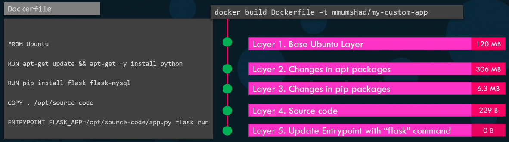
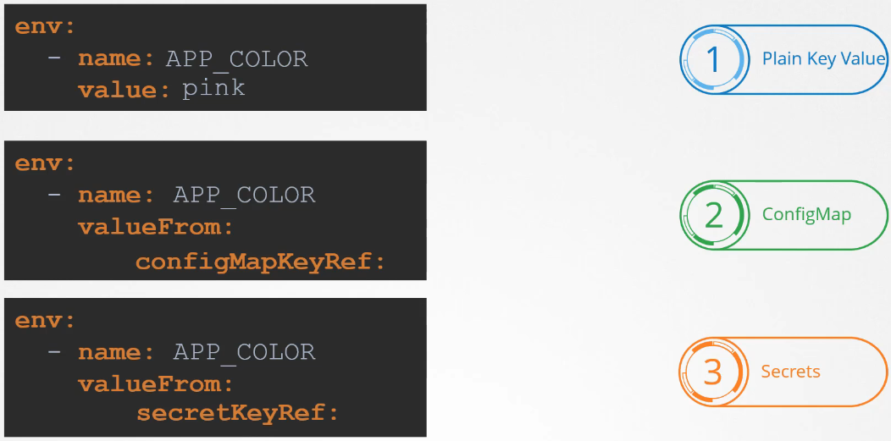
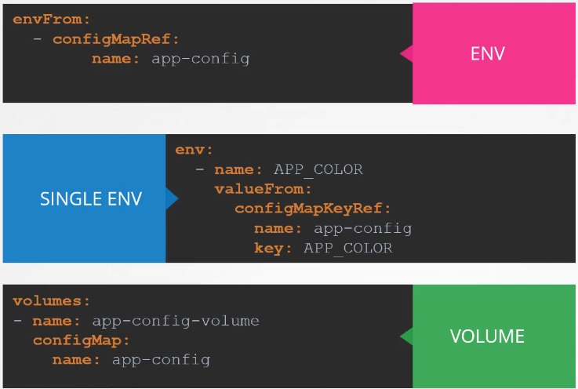
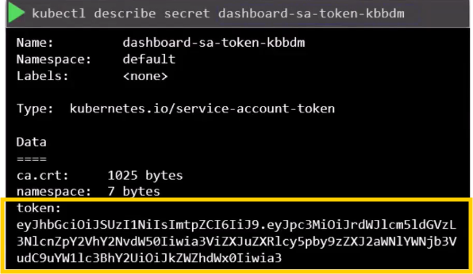
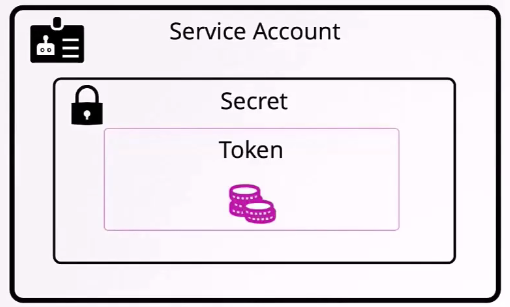
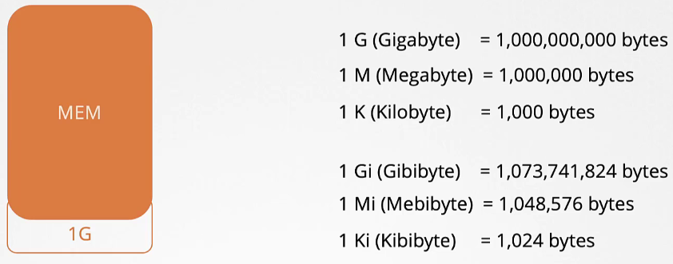

- [Configuration](#configuration)
  - [Define, Build, and Modify Container Images](#define-build-and-modify-container-images)
    - [Introduction](#introduction)
    - [Why Create Your Own Image?](#why-create-your-own-image)
    - [Example: Containerizing a Python Flask Web Application](#example-containerizing-a-python-flask-web-application)
    - [Docker File Instructions](#docker-file-instructions)
    - [Layered Architecture](#layered-architecture)
    - [Containerising Applications](#containerising-applications)
  - [Commands and Arguments in Docker](#commands-and-arguments-in-docker)
    - [Introduction](#introduction-1)
    - [Running a Docker Container](#running-a-docker-container)
    - [CMD Instruction](#cmd-instruction)
    - [BASH as Default Command](#bash-as-default-command)
    - [Overriding the Default Command](#overriding-the-default-command)
    - [ENTRYPOINT Instruction](#entrypoint-instruction)
    - [Combining ENTRYPOINT and CMD](#combining-entrypoint-and-cmd)
    - [Overriding ENTRYPOINT](#overriding-entrypoint)
    - [Summary](#summary)
  - [Commands and Arguments in Kubernetes](#commands-and-arguments-in-kubernetes)
    - [Introduction](#introduction-2)
    - [Creating a Pod Using a Custom Image](#creating-a-pod-using-a-custom-image)
    - [Overriding CMD Instruction](#overriding-cmd-instruction)
    - [Overriding ENTRYPOINT Instruction](#overriding-entrypoint-instruction)
    - [Summary](#summary-1)
  - [Environment Variables](#environment-variables)
    - [Introduction](#introduction-3)
    - [Setting Environment Variables in a Pod Definition File](#setting-environment-variables-in-a-pod-definition-file)
    - [Advanced Methods](#advanced-methods)
    - [Summary](#summary-2)
  - [Config Maps](#config-maps)
    - [Introduction](#introduction-4)
    - [Creating ConfigMaps](#creating-configmaps)
    - [Viewing ConfigMaps](#viewing-configmaps)
    - [Injecting ConfigMaps into Pods](#injecting-configmaps-into-pods)
    - [Other Methods](#other-methods)
    - [Summary](#summary-3)
  - [Secrets](#secrets)
    - [Introduction](#introduction-5)
    - [Creating Secrets](#creating-secrets)
    - [Viewing Secrets](#viewing-secrets)
    - [Injecting Secrets into Pods](#injecting-secrets-into-pods)
    - [Other Methods](#other-methods-1)
    - [Security Considerations](#security-considerations)
    - [Summary](#summary-4)
  - [Demo: Encrypting Secret Data at Rest](#demo-encrypting-secret-data-at-rest)
    - [Encryption Algorithms](#encryption-algorithms)
      - [Common algorithms](#common-algorithms)
    - [Creating the Encryption Configuration File](#creating-the-encryption-configuration-file)
    - [Editing the Kube-API Server Manifest](#editing-the-kube-api-server-manifest)
    - [Verifying Encryption](#verifying-encryption)
    - [Summary](#summary-5)
  - [Docker Security](#docker-security)
    - [Introduction](#introduction-6)
    - [Process Isolation in Docker](#process-isolation-in-docker)
    - [User Security in Docker](#user-security-in-docker)
    - [Root User in Containers](#root-user-in-containers)
    - [Managing Capabilities](#managing-capabilities)
    - [Summary](#summary-6)
  - [Security Contexts](#security-contexts)
    - [Introduction](#introduction-7)
    - [Configuring Security Context in Kubernetes](#configuring-security-context-in-kubernetes)
    - [Pod Definition File](#pod-definition-file)
    - [Summary](#summary-7)
  - [Service Account](#service-account)
    - [Introduction](#introduction-8)
    - [Types of Accounts](#types-of-accounts)
    - [Creating a Service Account](#creating-a-service-account)
    - [Service Accounts for Applications Hosted on Kubernetes](#service-accounts-for-applications-hosted-on-kubernetes)
    - [Custom Service Accounts](#custom-service-accounts)
    - [Changes in Kubernetes 1.22 and 1.24](#changes-in-kubernetes-122-and-124)
    - [Summary](#summary-8)
    - [Token Expiry and Security Issues](#token-expiry-and-security-issues)
    - [TokenRequestAPI (Introduced in Kubernetes 1.22)](#tokenrequestapi-introduced-in-kubernetes-122)
    - [Changes in Kubernetes 1.24](#changes-in-kubernetes-124)
    - [Creating Non-Expiring Tokens](#creating-non-expiring-tokens)
    - [Recommendations](#recommendations)
    - [Summary](#summary-9)
  - [Resource Requirements](#resource-requirements)
    - [Introduction](#introduction-9)
    - [Resource Scheduling](#resource-scheduling)
    - [Resource Requests](#resource-requests)
    - [CPU and Memory Units](#cpu-and-memory-units)
    - [Resource Limits](#resource-limits)
    - [Exceeding Resource Limits](#exceeding-resource-limits)
    - [Default Configuration](#default-configuration)
    - [Scenarios](#scenarios)
    - [Summary](#summary-10)
    - [Ideal Resource Configuration](#ideal-resource-configuration)
    - [Use Cases for Setting Limits](#use-cases-for-setting-limits)
    - [Ensuring Resource Requests](#ensuring-resource-requests)
    - [Memory Resource Management](#memory-resource-management)
    - [Limit Ranges](#limit-ranges)
    - [Resource Quotas](#resource-quotas)
    - [Summary](#summary-11)
  - [Taints and Tolerations](#taints-and-tolerations)
    - [Introduction](#introduction-10)
    - [Basic Concepts](#basic-concepts)
    - [Example Scenario](#example-scenario)
    - [Taint Effects](#taint-effects)
    - [Example Commands](#example-commands)
    - [NoExecute Taint Effect](#noexecute-taint-effect)
    - [Master Nodes](#master-nodes)
    - [Summary](#summary-12)
  - [Node Selectors](#node-selectors)
    - [Introduction](#introduction-11)
    - [Example Scenario](#example-scenario-1)
    - [Default Setup](#default-setup)
    - [Using NodeSelectors](#using-nodeselectors)
    - [Limitations of NodeSelectors](#limitations-of-nodeselectors)
    - [Advanced Features](#advanced-features)
    - [Summary](#summary-13)
  - [Node Affinity](#node-affinity)
    - [Introduction](#introduction-12)
    - [Node Affinity vs. NodeSelectors](#node-affinity-vs-nodeselectors)
    - [Node Affinity Specification](#node-affinity-specification)
    - [Operators](#operators)
    - [Types of Node Affinity](#types-of-node-affinity)
    - [Future Node Affinity Types](#future-node-affinity-types)
    - [Summary](#summary-14)
  - [Taints and Tolerations vs Node Affinity](#taints-and-tolerations-vs-node-affinity)
    - [Introduction](#introduction-13)
    - [Exercise Scenario](#exercise-scenario)
    - [Using Taints and Tolerations](#using-taints-and-tolerations)
    - [Using Node Affinity](#using-node-affinity)
    - [Combining Taints, Tolerations, and Node Affinity](#combining-taints-tolerations-and-node-affinity)
    - [Summary](#summary-15)

<br>

<hr style="height:4px;background:black">

<br>

# Configuration

## Define, Build, and Modify Container Images

### Introduction
* `Docker Images`: **Pre-configured environments** that include **everything needed to run an application**, such as code, runtime, libraries, and dependencies.

<br>

### Why Create Your Own Image?
* `Custom Components`: If you can't find a component or service on Docker Hub.
* `Dockerizing Applications`: For ease of shipping and deployment.

<br>

### Example: Containerizing a Python Flask Web Application

1. `Manual Deployment Steps`:

   1. Start with an **operating system** (e.g., Ubuntu).
   2. **Update source repositories** using the `APT` command.
   3. **Install dependencies** using the `APT` command.
   4. **Install Python dependencies** using the `pip` command.
   5. **Copy** the **source code** to a **location** (e.g., /opt).
   6. Run the **web server** using the `flask` command.

<br>

2. `Creating a Docker File`:
   * Write down the instructions for setting up your application in a Docker file.

**Example Docker file**:

```dockerfile
FROM ubuntu
RUN apt-get update && apt-get install -y python3-pip
COPY . /opt/source-code
RUN pip3 install -r /opt/source-code/requirements.txt
ENTRYPOINT ["python3", "/opt/source-code/app.py"]
```

<br>



<br>

3. `Building and Pushing the Image`:
   * Build the Image: `docker build -t myaccount/mycustomapp .`
   * Push the Image to Docker Hub: `docker push myaccount/mycustomapp`

<br>

### Docker File Instructions
* `FROM`: Defines the **base OS** for the container.
* `RUN`: **Executes commands** on the base image (e.g., installing packages).
* `COPY`: **Copies files** from the **local system** to the **Docker image**.
* `ENTRYPOINT`: **Specifies** the **command to run** when the **image** is **used** as a **container**.

<br>

### Layered Architecture
* `Layers`: Each **instruction** in the Docker file **creates a new layer** in the Docker **image**.
* `Caching`: Layers are **cached**, so if a build step fails, **Docker can reuse previous layers** and **continue building** from the failed step.
* `Efficiency`: Only layers above the updated layers need to be rebuilt, making the process faster.

<br>

### Containerising Applications
* `Versatility`: Almost **any application** can be containerized, including databases, development tools, operating systems, browsers, utilities, and more.
* `Future of Applications`: Applications will increasingly be run using Docker, simplifying installation and cleanup.

<br>

<hr style="height:4px;background:black">

<br>

## Commands and Arguments in Docker

### Introduction
* `Commands and Arguments`: Important concepts in Docker and Kubernetes, often overlooked but crucial for container behavior.

<br>

### Running a Docker Container
* `docker run ubuntu`: **Runs an instance** of the Ubuntu **image** and **exits immediately**.
* Containers are meant to **run specific tasks** or processes, not to host an operating system.

<Br>

### CMD Instruction
* `Purpose`: Defines the **default command** to **run** within the **container** when it **starts**.
  * **Example**: For the nginx image, the CMD instruction is nginx.
* `Behavior`: If no command is specified, the container runs the **default** `CMD` command.

<Br>

### BASH as Default Command
* `Ubuntu Image`: Uses **BASH** as the default command.
* `Behavior`: BASH requires a **terminal** to listen for inputs. 
  * Without a terminal, it exits, causing the container to exit.

<br>

### Overriding the Default Command
`Appending a Command`:
* `docker run ubuntu sleep 5`: **Overrides** the **default command** and runs **sleep 5**.

`Creating a Custom Image`:
* Specify a new command in the Docker file.

**Example**:

```dockerfile
FROM ubuntu
CMD ["sleep", "5"]
```

<br>

### ENTRYPOINT Instruction
* `Purpose`: Specifies the program to **run** when the **container starts**. 
  * Command line parameters are appended to the `ENTRYPOINT`.

**Example**:

```dockerfile
FROM ubuntu
ENTRYPOINT ["sleep"]
CMD ["5"]
Behavior: docker run ubuntu-sleeper 10 runs sleep 10.
```

<br>

### Combining ENTRYPOINT and CMD
* `Default Value`: Use both `ENTRYPOINT` and `CMD` to provide a **default value** if no command line parameters are specified.

**Example**:

```dockerfile
FROM ubuntu
ENTRYPOINT ["sleep"]
CMD ["5"]
```

<Br>

### Overriding ENTRYPOINT
`Runtime Modification`:
* Use the `--entrypoint` option to override the `ENTRYPOINT` during runtime.
  * **Example**: `docker run --entrypoint sleep2.0 ubuntu-sleeper 10`

<br>

### Summary
* `CMD`: Defines the **default** command to run **within the container**.
* `ENTRYPOINT`: Specifies the program to run, with command line parameters appended.
* `Combining`: Use both to provide default values and allow overrides.
* `Overriding`: Use `--entrypoint` to modify the **ENTRYPOINT** during runtime.

<br>

<hr style="height:4px;background:black">

<br>

## Commands and Arguments in Kubernetes

### Introduction
* `Commands and Arguments`: Important concepts in Kubernetes pods, similar to Docker commands and arguments.

<br>

### Creating a Pod Using a Custom Image
1. `Docker Image`:
   * **Example**: Ubuntu Sleeper image that sleeps for a given number of seconds.
   * **Default behavior**: Sleeps for 5 seconds, but can be overridden with a command line argument.

2. `Pod Definition Template`
   * Start with a **blank** template.
   * Input the **name** of the **pod** and **specify** the **image name**.

**Example**:

```yaml
apiVersion: v1
kind: Pod
metadata:
  name: ubuntu-sleeper
spec:
  containers:
  - name: sleeper
    image: ubuntu-sleeper
```

<br>

### Overriding CMD Instruction
`Arguments (args) Field`:
* Used to specify additional arguments in the pod definition file.
* Overrides the CMD instruction in the Docker file.

**Example**:

```yaml
spec:
  containers:
  - name: sleeper
    image: ubuntu-sleeper
    args: ["10"]
```

<br>

### Overriding ENTRYPOINT Instruction
`Command (command) Field`:
* Used to override the **ENTRYPOINT** instruction in the Docker file.

**Example**:

```yaml
spec:
  containers:
  - name: sleeper
    image: ubuntu-sleeper
    command: ["sleep2.0"]
    args: ["10"]
```

<br>

### Summary
* `Command Field`: **Overrides** the **ENTRYPOINT** instruction in the Docker file.
* `Args Field`: **Overrides** the **CMD instruction** in the Docker file.
* `Usage`: Use the **command field** to **change the entry point** and the **args field** to **pass additional arguments**.

<br>

<hr style="height:4px;background:black">

<br>

## Environment Variables

### Introduction
* `Environment Variables`: Used to configure settings for applications running in containers.

<br>

### Setting Environment Variables in a Pod Definition File
`Using the env Property`:
* `Format`: env is an **array**, and each item in the array **starts with a dash** (-), indicating an item in the array.
* `Properties`: Each item has a **name** and a **value** property.

**Example**:

```yaml
apiVersion: v1
kind: Pod
metadata:
  name: myapp-pod
spec:
  containers:
  - name: myapp-container
    image: myapp-image
    env:
    - name: ENV_VAR_NAME
      value: "value"
```

<bR>

### Advanced Methods
`Using ConfigMaps and Secrets`:
* `ConfigMaps`: Used to store configuration data in **key-value pairs**.
* `Secrets`: Used to **store sensitive data**, such as passwords and API keys.
* `Format`: Instead of specifying value, use **valueFrom** and then specify **ConfigMap** or **Secret**.

**Example**:

```yaml
env:
- name: ENV_VAR_NAME
  valueFrom:
    configMapKeyRef:
      name: configmap-name
      key: config-key
```

<br>



<br>

### Summary
* `Direct Method`: Use the **env property** with **key-value pairs** to **set environment variables** directly in the pod definition file.
* `Advanced Method`: Use ConfigMaps and Secrets to **manage environment variables** more securely and flexibly.

<br>

<hr style="height:4px;background:black">

<br>

## Config Maps

### Introduction
* `ConfigMaps`: Used to **manage configuration data centrally** in Kubernetes, making it easier to handle environment variables across multiple pod definition files.

<br>

### Creating ConfigMaps
1. `Imperative Way`:
   * **Command Line**: Use the `kubectl create configmap` command with the `--from-literal` option to specify **key-value pairs** directly.

**Example**:

```bash
kubectl create configmap app-config --from-literal=app.color=blue
```

<br>

* `Multiple Key-Value Pairs`: Specify the `--from-literal` option **multiple times** for additional pairs.
* `From File`: Use the `--from-file` option to **specify a path** to a **file containing** the **required data**.

```bash
kubectl create configmap app-config --from-file=path/to/config/file
```

<br>


<br>

2. `Declarative Way`:
   * `Definition File`: Create a ConfigMap definition file with API version, kind, metadata, and data sections.

**Example**:

```yaml
apiVersion: v1
kind: ConfigMap
metadata:
  name: app-config
data:
  app.color: blue
```

* `Create ConfigMap`: Use the `kubectl create -f` command to create the ConfigMap from the definition file.

```bash
kubectl create -f configmap-definition.yaml
```

<br>


<br>

### Viewing ConfigMaps
* List ConfigMaps: `kubectl get configmaps`
* Describe ConfigMap: `kubectl describe configmap app-config`

<br>

### Injecting ConfigMaps into Pods
`Pod Definition File`:
* `Add envFrom Property`: Inject **environment variables** from the ConfigMap into the pod.

**Example**:

```yaml
apiVersion: v1
kind: Pod
metadata:
  name: myapp-pod
spec:
  containers:
  - name: myapp-container
    image: myapp-image
    envFrom:
    - configMapRef:
        name: app-config
```

<br>



<br>

### Other Methods
* `Single Environment Variable`: Inject a single environment variable from a ConfigMap.
* `Files in a Volume`: Inject the entire ConfigMap data as files in a volume.

<br>

### Summary
* `ConfigMaps`: Manage configuration data centrally in Kubernetes.
* `Creating ConfigMaps`: Use **imperative** or **declarative** methods to create ConfigMaps.
* `Injecting ConfigMaps`: Use the **envFrom** property in the pod definition file to **inject environment variables from ConfigMaps**.

<br>

<hr style="height:4px;background:black">

<br>

## Secrets

### Introduction
* `Secrets`: Used to **store sensitive information** like passwords or keys in Kubernetes. 
  * Similar to ConfigMaps but stored in an encoded format.

<br>
 
### Creating Secrets
1. `Imperative Way`:
   * **Command Line**: Use the `kubectl create secret` generic command with the `--from-literal` option to specify key-value pairs directly.

**Example**:

```bash
kubectl create secret generic app-secret --from-literal=DB_Host=mysql
```

<br>

* `Multiple Key-Value Pairs`: Specify the `--from-literal` option multiple times for additional pairs.
* `From File`: Use the `--from-file` option to specify a path to a file containing the required data.

```bash
kubectl create secret generic app-secret --from-file=path/to/secret/file
```

<br>

2. `Declarative Way`:
   * **Definition File**: Create a Secret definition file with API version, kind, metadata, and data sections.

**Example**:

```yaml
apiVersion: v1
kind: Secret
metadata:
  name: app-secret
data:
  DB_Host: bXlzcWw=
```

* `Encoding Data`: Use the **base64** utility to **encode data before adding it** to the definition file.

```bash
echo -n 'mysql' | base64
```

<br>

### Viewing Secrets
* List Secrets: `kubectl get secrets`
* Describe Secret: `kubectl describe secret app-secret`
* View Encoded Values: `kubectl get secret app-secret -o yaml`
* Decode Values: `echo 'bXlzcWw=' | base64 --decode`

<br>

### Injecting Secrets into Pods
`Pod Definition File`:
* **Add envFrom Property**: Inject environment variables from the Secret into the pod.

**Example**:

```yaml
apiVersion: v1
kind: Pod
metadata:
  name: myapp-pod
spec:
  containers:
  - name: myapp-container
    image: myapp-image
    envFrom:
    - secretRef:
        name: app-secret
```

<br>

### Other Methods
* `Single Environment Variable`: Inject a single environment variable from a Secret.
* `Files in a Volume`: Inject the entire Secret data as files in a volume. 
  * Each attribute in the Secret is created as a file with the value of the Secret as its content.

<br>

### Security Considerations
* `Not Encrypted`: Secrets are **encoded**, not encrypted. 
  * Anyone with access to the Secret object can decode it.
* `ETCD Encryption`: Secrets are **not encrypted** in ETCD by **default**. 
  * Consider enabling encryption at rest.
* `Access Control`: Configure **role-based access control** (RBAC) to restrict access to Secrets.
* `Third-Party Providers`: Consider using **third-party secret providers** like AWS, Azure, GCP, or Vault for enhanced security.

<br>

### Summary
* `Secrets`: **Store sensitive information** in an **encoded format**.
* `Creating Secrets`: Use **imperative** or **declarative** methods to create Secrets.
* `Injecting Secrets`: Use the **envFrom** property in the pod definition file to **inject environment variables** from Secrets.
* `Security`: Be mindful of security considerations and use RBAC and third-party providers for better security.

<br>

<hr style="height:4px;background:black">

<br>

## Demo: Encrypting Secret Data at Rest
* Documentation: [Encrypting Confidential Data at Rest](https://kubernetes.io/docs/tasks/administer-cluster/encrypt-data/).

### Encryption Algorithms
* `Types`: Various **encryption algorithms** can be used to encrypt data at rest in Kubernetes. 
* `Order of Providers`: The order of providers in the list is crucial. 
  * The **first provider** in the list is used for **encryption**, while any provider in the list can be used for decryption. 

> **Note**: This means that if the identity provider (which does not encrypt data) is listed first, **no encryption will be applied**.

* `Identity Provider`: The identity provider is a special provider that **indicates no encryption**. 
  * If it is the **first provider** in the list, data will not be encrypted.

<br>

#### Common algorithms
* `secretbox`: Uses the NaCl (Networking and Cryptography Library) secretbox algorithm for **encryption**.
* `AES-GCM`: Advanced Encryption Standard (AES) in Galois/Counter Mode (GCM), which **provides** both **encryption** and **authentication**.
* `AES-CBC`: Advanced Encryption Standard (AES) in Cipher Block Chaining (CBC) mode, which provides **encryption** but requires **additional steps for authentication**.

<br>

### Creating the Encryption Configuration File
1. `Example Configuration`:

```yaml
apiVersion: apiserver.config.k8s.io/v1
kind: EncryptionConfiguration
resources:
- resources:
  - secrets
  providers:
  - aescbc:
      keys:
      - name: key1
        secret: <base64-encoded-secret>
  - identity: {}
```

<br>

2. `Generate a 32-byte Random Key`:
   * Command: `head -c 32 /dev/urandom | base64`
   * This command generates a 32-byte **random key** and **encodes** it in **base64 format**, which is required for the encryption configuration.

<br>

3. `Create the Configuration File`:
   * Save the configuration file **locally**, for example, as /etc/kubernetes/encryption-config.yaml.

<br>

### Editing the Kube-API Server Manifest
1. `Add Encryption Provider Config`:

**Example**:

```yaml
- --encryption-provider-config=/etc/kubernetes/encryption-config.yaml
```

<br>

2. `Mount the Configuration File`:

**Volumes and Volume Mounts**:

```yaml
volumeMounts:
- name: encryption-config
  mountPath: /etc/kubernetes/encryption-config.yaml
  subPath: encryption-config.yaml
volumes:
- name: encryption-config
  hostPath:
    path: /etc/kubernetes/encryption-config.yaml
    type: File
```

<br>

3. `Restart Kube-API Server`:

**Command**:

```bash
sudo systemctl restart kubelet
```

<br>

### Verifying Encryption
1. `Create a New Secret`:

**Command**:

```bash
kubectl create secret generic my-secret2 --from-literal=key2=topsecret
```

<br>

2. `View Data in ETCD`:

**Command**:

```bash
ETCDCTL_API=3 etcdctl --endpoints=https://127.0.0.1:2379 --cacert=/etc/kubernetes/pki/etcd/ca.crt --cert=/etc/kubernetes/pki/etcd/server.crt --key=/etc/kubernetes/pki/etcd/server.key get /registry/secrets/default/my-secret2 --hex
```

* **Check for Encrypted Data**: Ensure the data is now encrypted and not visible in plain text.

<br>

3. `Re-encrypt Existing Secrets`:

**Command**:

```bash
kubectl get secrets -o json | kubectl replace -f -
```

* This command **retrieves all existing secrets** and **replaces** them with the **same data**, effectively **re-encrypting** them with the **new encryption configuration**.

<br>

### Summary
* `Encryption Algorithms`: Choose from various algorithms like secretbox, AES-GCM, and AES-CBC. 
  * Ensure the correct order of providers, with the desired encryption algorithm listed first.
* `Configuration File`: Create and specify the encryption configuration file with the appropriate encryption algorithm and keys.
* `Kube-API Server`: Edit the manifest to include the encryption provider config and mount the configuration file.
* `Verification`: Create new secrets and verify that the data is encrypted in ETCD. 
  * Re-encrypt existing secrets if necessary to ensure all data is protected.

<br>

<hr style="height:4px;background:black">

<br>

## Docker Security

### Introduction
* `Security Context`: Defines **privilege** and **access control settings** for a Pod or Container in Kubernetes.
* `Docker Security`: Understanding Docker security concepts is essential before diving into Kubernetes security context.

<br>

### Process Isolation in Docker
* `Host Processes`: The host **runs its own processes**, including the Docker daemon and other system processes.
* `Container Processes`: **Containers share** the **same kernel** as the **host** but are **isolated using Linux namespaces**.
* `Namespace Isolation`: Each **container** has its **own namespace**, isolating its processes from those of other containers and the host.
* `Process IDs`: Processes **within a container** have **different process IDs** compared to the host.

<br>

### User Security in Docker
* `Default User`: By default, Docker runs container processes as the **root user**.
* `Changing User`: Use the `--user` option in the docker run command to specify a **different user ID**.

**Example**:

```bash
docker run --user 1000 ubuntu sleep 3600
```

* `Defining User in Dockerfile`: Set the user in the Dockerfile using the **USER** instruction.

**Example**:

```dockerfile
FROM ubuntu
USER 1000
```

<br>

### Root User in Containers
* `Root User Limitations`: The root user within a container does not have the same privileges as the root user on the host.
* `Linux Capabilities`: Docker uses **Linux capabilities** to **limit the privileges** of the **root user** within a container.
* `Capabilities`: Different capabilities control various system operations, such as modifying files, network operations, and system operations.

<br>

### Managing Capabilities
* `Default Capabilities`: Docker runs containers with a limited set of capabilities by default.
* `Adding Capabilities`: Use the `--cap-add` option to add specific capabilities.

**Example**:

```bash
docker run --cap-add=NET_ADMIN ubuntu
```

<br>

* `Dropping Capabilities`: Use the --cap-drop option to remove specific capabilities.

**Example**:

```bash
docker run --cap-drop=MKNOD ubuntu
```

<br>

* `Privileged Mode`: Use the --privileged flag to run a container with all capabilities enabled.

**Example**:

```bash
docker run --privileged ubuntu
```

<br>

### Summary
* `Security Context`: Defines privilege and access control settings for Pods and Containers in Kubernetes.
* `Process Isolation`: Containers are isolated using namespaces, and processes have different IDs in different namespaces.
* `User Security`: Docker runs container processes as the root user by default, but this can be changed using the --user option or the USER instruction in the Dockerfile.
* `Root User Limitations`: The root user within a container has limited privileges compared to the root user on the host.
* `Managing Capabilities`: Use the `--cap-add` and `--cap-drop` options to manage capabilities, or use the `--privileged` flag to enable all capabilities.

<br>

<hr style="height:4px;background:black">

<br>

## Security Contexts

### Introduction
* `Security Context`: Defines **privilege** and **access control settings** for a Pod or Container in Kubernetes.
* `Docker Security`: Understanding Docker security concepts is essential before diving into Kubernetes security context.

<br>

### Configuring Security Context in Kubernetes
* `Pod vs. Container Level`: **Security settings** can be configured at both the **pod** and **container levels**.
  * Container-level settings **override pod-level settings**.

<br>

### Pod Definition File
1. `Basic Pod Definition`:

**Example**:

```yaml
apiVersion: v1
kind: Pod
metadata:
  name: ubuntu-sleeper
spec:
  containers:
  - name: sleeper
    image: ubuntu
    command: ["sleep", "3600"]
```

<br>

2. `Adding Security Context at Pod Level`:
   * `Security Context`: Add a field called securityContext under the spec section of the pod.
   * `Run as User`: Use the runAsUser option to set the user ID for the pod.

**Example**:

```yaml
apiVersion: v1
kind: Pod
metadata:
  name: ubuntu-sleeper
spec:
  securityContext:
    runAsUser: 1000
  containers:
  - name: sleeper
    image: ubuntu
    command: ["sleep", "3600"]
```

<br>

3. `Adding Security Context at Container Level`:
   * `Move Security Context`: Move the **securityContext** section under the **container specification** to apply settings at the **container level**.

**Example**:

```yaml
apiVersion: v1
kind: Pod
metadata:
  name: ubuntu-sleeper
spec:
  containers:
  - name: sleeper
    image: ubuntu
    command: ["sleep", "3600"]
    securityContext:
      runAsUser: 1000
```

<br>

4. `Adding Capabilities`:
   * `Capabilities Option`: Use the **capabilities** option to specify a list of capabilities to **add** to the **pod or container**.

**Example**:

```yaml
apiVersion: v1
kind: Pod
metadata:
  name: ubuntu-sleeper
spec:
  containers:
  - name: sleeper
    image: ubuntu
    command: ["sleep", "3600"]
    securityContext:
      runAsUser: 1000
      capabilities:
        add: ["NET_ADMIN", "SYS_TIME"]
```

<Br>

### Summary
* `Security Context`: Defines **privilege** and **access control settings** for Pods and Containers in Kubernetes.
* `Pod vs. Container Level`: Security settings can be configured at both levels, with container-level settings overriding pod-level settings.
* `Configuring Security Context`: Use the **securityContext** field to **set user IDs** and **capabilities** for pods and containers.

<br>

<hr style="height:4px;background:black">

<br>

## Service Account

### Introduction
* `Service Accounts`: Used by applications to **interact** with the **Kubernetes cluster**. 
  * Different from user accounts, which are used by humans.

<br>

### Types of Accounts
* `User Accounts`: Used by **administrators** and **developers** to perform tasks on the Kubernetes cluster.
* `Service Accounts`: Used by **applications** to **interact** with the **Kubernetes API**.

<br>


<br>

### Creating a Service Account
1. `Command`:
   * Create Service Account: `kubectl create serviceaccount dashboard-sa`
   * View Service Accounts: `kubectl get serviceaccounts`

<br>

2. `Service Account Token`:
   * When a service account is created, a **token** is **automatically generated** and **stored** as a **secret object**.

**View Secret**:

```bash
kubectl describe secret dashboard-sa-token-<suffix>
```

<br>




<br>

3. `Using the Token`:
   * The token can be used as an **authentication bearer** token for making **REST calls** to the **Kubernetes API**.

**Example with cURL**:

```bash
curl -H "Authorization: Bearer <token>" https://<kubernetes-api-server>
```

<br>

### Service Accounts for Applications Hosted on Kubernetes
* `Automatic Mounting`: When an application is **hosted** on the **Kubernetes cluster**, the **service account token** can be **automatically mounted** as a **volume inside the pod**.
* `Default Service Account`: Each namespace has a default service account that is **automatically mounted to pods** if no other service account is specified.

**Example**:

```yaml
apiVersion: v1
kind: Pod
metadata:
  name: myapp-pod
spec:
  containers:
  - name: myapp-container
    image: myapp-image
```

<br>

### Custom Service Accounts
* `Specify Service Account`: Modify the pod definition file to include a **service account field**.

**Example**:

```yaml
apiVersion: v1
kind: Pod
metadata:
  name: myapp-pod
spec:
  serviceAccountName: dashboard-sa
  containers:
  - name: myapp-container
    image: myapp-image
```

<br>

### Changes in Kubernetes 1.22 and 1.24
* `Service Account Secrets and Tokens`: Changes in these versions affect how service account secrets and tokens are managed.
* `Automatic Association`: Service accounts are automatically associated with pods and tokens are mounted to a well-known location within the pod.

<br>



<br>

### Summary
* `Service Accounts`: Used by **applications** to **interact** with the Kubernetes **API**.
* `Creating Service Accounts`: Use **kubectl create serviceaccount** to create a service account and **kubectl get serviceaccounts** to view them.
* `Using Tokens`: Tokens are **stored** as **secret objects** and can be used for authentication.
* `Automatic Mounting`: Service account tokens can be **automatically mounted to pods**, simplifying the process for applications hosted on Kubernetes.
* `Custom Service Accounts`: Specify a custom service account in the pod definition file to use it instead of the default service account.

<bR>

### Token Expiry and Security Issues
* `No Expiry Date`: Tokens generated **before** Kubernetes **version 1.22** do not have an expiry date, making them valid as long as the service account exists.
* `Security and Scalability Issues`: Tokens are **not bound to any audience** and are **not time-bound**, leading to potential **security risks** and **scalability issues**.

<br>

### TokenRequestAPI (Introduced in Kubernetes 1.22)
* `Purpose`: Provides a more secure and scalable mechanism for provisioning service account tokens.
* `Automatic Token Generation`: When a new pod is created, a **token** with a **defined lifetime** is generated through the **TokenRequestAPI** and **mounted** as a **projected volume** onto the pod.

**Features**:
* `Audience Bound`: Tokens are bound to a specific audience.
* `Time Bound`: Tokens have a defined lifetime.
* `Object Bound`: Tokens are bound to specific objects.

<br>

### Changes in Kubernetes 1.24
`Reduction of Secret-Based Service Account Tokens`:
* `Automatic Creation`: Service accounts no longer automatically create a secret or token access secret.
* `Manual Token Creation`: Use the **kubectl create token** command to **generate a token** for a service account if needed.

**Example**:

```bash
kubectl create token dashboard-sa
```

* `Token Expiry`: Tokens generated this way have an **expiry date**, usually one hour from the time the command is run.
  * Additional options can be passed to increase the expiry time.

<br>

### Creating Non-Expiring Tokens
* `Manual Creation`: If needed, create a secret object with a **non-expiring token**.

**Example**:

```yaml
apiVersion: v1
kind: Secret
metadata:
  name: my-secret
  annotations:
    kubernetes.io/service-account.name: dashboard-sa
type: kubernetes.io/service-account-token
```

* `Ensure Service Account Exists`: The **service account** must be **created before** creating the **secret object**.

<br>

### Recommendations
* `Use TokenRequestAPI`: Preferred method for generating tokens due to better security and bounded lifetime.
* `Avoid Non-Expiring Tokens`: Only create non-expiring tokens if the security exposure is acceptable.

<br>

### Summary
* `Token Expiry and Security`: Tokens generated before Kubernetes 1.22 have no expiry date, leading to potential security risks.
* `TokenRequestAPI`: Introduced in Kubernetes 1.22 for more secure and scalable token provisioning.
* `Changes in Kubernetes 1.24`: Service accounts no longer automatically create secrets; use kubectl create token to generate tokens.
* `Non-Expiring Tokens`: Can be created manually but are not recommended due to security risks.

<br>

<hr style="height:4px;background:black">

<br>

## Resource Requirements

### Introduction
* `Kubernetes Cluster`: Consists of multiple **nodes**, each with its own **CPU** and **memory resources**.
* `Pods`: Require a set of resources (CPU and memory) to run.

<br>

### Resource Scheduling
* `Kubernetes Scheduler`: **Decides** which **node a pod should be placed on** based on available resources.
* `Pending State`: If **no node has sufficient resources**, the pod remains in a **pending state**.

<br>

### Resource Requests
* `Definition`: The **minimum amount of CPU** and **memory required** by a container.
* `Pod Definition File`: Add a **resources section** with **requests** to specify **CPU** and **memory** requirements.

**Example**:

```yaml
apiVersion: v1
kind: Pod
metadata:
  name: myapp-pod
spec:
  containers:
  - name: myapp-container
    image: myapp-image
    resources:
      requests:
        memory: "4Gi"
        cpu: "2"
```

<br>

### CPU and Memory Units
* `CPU`: Can be specified in units like 0.1 (100m) or 1 (1 vCPU).
* `Memory`: Can be specified in units like Mi (mebibyte) or Gi (gibibyte).

**Example**:

```yaml
resources:
  requests:
    memory: "256Mi"
    cpu: "0.5"
```

<Br>

### Resource Limits
* `Definition`: The **maximum amount** of **CPU** and **memory** a container can use.
* `Pod Definition File`: Add a **limits section** under resources to **specify CPU** and **memory limits**.

**Example**:

```yaml
resources:
  limits:
    memory: "512Mi"
    cpu: "1"
```

<br>



<br>

### Exceeding Resource Limits
* `CPU`: The system throttles the CPU usage to prevent exceeding the limit.
* `Memory`: If a container exceeds its memory limit, it is terminated with an **"Out of Memory" (OOM) error**.


<br>

### Default Configuration
* `No Default Limits`: By default, Kubernetes does not set CPU or memory requests or limits.
* `Impact`: Without limits, a pod can consume all available resources, affecting other pods and processes.

<br>

### Scenarios
* `No Requests or Limits`: One pod can consume all resources, preventing others from running.
* `Limits Only`: Kubernetes sets requests **equal to limits**, guaranteeing resources but not allowing flexibility.
* `Requests and Limits`: Each pod gets guaranteed resources (requests) and can use up to the specified limits.

<br>

### Summary
* `Resource Requests`: Minimum resources required by a container.
* `Resource Limits`: Maximum resources a container can use.
* `Pod Definition`: Use the resources section to specify requests and limits.
* `Default Configuration`: No default requests or limits, which can lead to resource contention.

<br>

### Ideal Resource Configuration
`Requests but No Limits`: 
* Each pod is **guaranteed** its **requested resources** (e.g., 1 vCPU). 
* If additional **resources** are **available**, **any pod can consume them**. 
* This setup allows flexibility and ensures that pods can use available resources without being unnecessarily limited.

<br>

### Use Cases for Setting Limits
* `Prevent Misuse`: In public environments, setting limits prevents users from consuming excessive resources (e.g., Bitcoin mining).
* `Ensure Fair Resource Distribution`: Limits ensure that **no single pod can monopolize resources**, affecting other pods.

<bR>

### Ensuring Resource Requests
* `Set Requests for All Pods`: To guarantee resources, ensure that **all pods** have **resource requests set**. 
  * This prevents any pod from being starved of resources.

<br>

### Memory Resource Management
* `No Requests or Limits`: One pod can consume all memory resources, preventing others from running.
* `Limits Only`: Kubernetes sets requests equal to limits, guaranteeing resources but not allowing flexibility.
* `Requests and Limits`: Each pod gets guaranteed memory (e.g., 1 GiB) and can use up to the specified limits (e.g., 3 GiB).
* `Requests but No Limits`: Each pod is guaranteed its requested memory (e.g., 1 GiB). 
  * If additional memory is available, any pod can consume it. 
  * If a pod exceeds its memory limit, it is terminated to free up resources.

<br>

### Limit Ranges
* `Purpose`: Define default values for resource requests and limits for containers in pods.
* `Namespace Level`: Applicable at the namespace level.

`Definition File`:

**Example**:

```yaml
apiVersion: v1
kind: LimitRange
metadata:
  name: cpu-resource-constraint
spec:
  limits:
  - default:
      cpu: 500m
      memory: 512Mi
    defaultRequest:
      cpu: 500m
      memory: 512Mi
    max:
      cpu: "1"
      memory: "1Gi"
    min:
      cpu: 100m
      memory: 128Mi
```

<br>

### Resource Quotas
* `Purpose`: Set **hard limits** for resource requests and limits at the namespace level.

`Definition File`:

**Example**:

```yaml
apiVersion: v1
kind: ResourceQuota
metadata:
  name: example-quota
spec:
  hard:
    requests.cpu: "4"
    requests.memory: "4Gi"
    limits.cpu: "10"
    limits.memory: "10Gi"
```

<br>

### Summary
* `Ideal Configuration`: Setting resource requests but no limits allows flexibility and ensures guaranteed resources.
* `Use Cases for Limits`: Prevent misuse and ensure fair resource distribution.
* `Memory Management`: Similar principles apply to memory as to CPU.
* `Limit Ranges`: Define default resource requests and limits at the namespace level.
* `Resource Quotas`: Set hard limits for resource consumption at the namespace level.

<br>

<hr style="height:4px;background:black">

<br>

## Taints and Tolerations

### Introduction
* `Taints and Tolerations`: Used to control which pods can be scheduled on which nodes in a Kubernetes cluster.

> `Analogy`: Think of taints as a **repellent spray** on a person (node) and bugs (pods) that may or may not tolerate the smell.

<br>

### Basic Concepts
* `Taints`: Applied to **nodes** to **repel** certain **pods**.
* `Tolerations`: Applied to **pods** to **allow them** to be **scheduled on nodes with matching taints**.

<br>

### Example Scenario
1. `Cluster Setup`:
   * **Three worker nodes**: Node1, Node2, Node3.
   * **Four pods to be deployed**: PodA, PodB, PodC, PodD.

<br>

2. `Without Taints and Tolerations`:
   * Scheduler places pods across **all nodes** to **balance the load**.

<br>

3. `Applying Taints`:
   * **Taint Node1**: Prevent all pods from being placed on Node1 by applying a taint (e.g., app=blue).

**Command**:

```bash
kubectl taint nodes Node1 app=blue:NoSchedule
```

<Br>

4. `Adding Tolerations`:
   * **Tolerate Taint**: Allow PodD to be placed on Node1 by adding a toleration.

<br>

5. `Pod Definition File`:

```yaml
apiVersion: v1
kind: Pod
metadata:
  name: pod-d
spec:
  tolerations:
  - key: "app"
    operator: "Equal"
    value: "blue"
    effect: "NoSchedule"
  containers:
  - name: myapp-container
    image: myapp-image
```

<br>

### Taint Effects
* `NoSchedule`: Pods that **do not tolerate the taint** will **not be scheduled on the node**.
* `PreferNoSchedule`: The system will try to **avoid placing a pod on the node**, but it is **not guaranteed**.
* `NoExecute`: New pods will **not be scheduled** on the node, and **existing pods** that **do not tolerate the taint** will be **evicted**.

<br>

### Example Commands
1. `Taint Node`:

```bash
kubectl taint nodes Node1 app=blue:NoSchedule
```

<br>

2. `Add Toleration to Pod`:

```yaml
apiVersion: v1
kind: Pod
metadata:
  name: pod-d
spec:
  tolerations:
  - key: "app"
    operator: "Equal"
    value: "blue"
    effect: "NoSchedule"
  containers:
  - name: myapp-container
    image: myapp-image
```

<br>

### NoExecute Taint Effect
* `Eviction`: Pods that do not tolerate the taint will be evicted from the node.
  * **Example**: Taint Node1 with NoExecute effect, and PodC will be evicted if it does not tolerate the taint.

<br>

### Master Nodes
* `Default Taint`: **Master nodes** have a **default taint** that **prevents pods** from **being scheduled** on them.
* View Taint: `kubectl describe node master-node`

<br>

### Summary
* `Taints`: Applied to nodes to control pod placement.
* `Tolerations`: Applied to pods to allow them to be scheduled on nodes with matching taints.
* `Taint Effects`: NoSchedule, PreferNoSchedule, NoExecute.
* `Master Nodes`: Have a default taint to prevent scheduling of pods.

<br>

<hr style="height:4px;background:black">

<br>

## Node Selectors

### Introduction
* `NodeSelectors`: A simple method to control which nodes a pod can be scheduled on in a Kubernetes cluster.

<br>

### Example Scenario
1. `Cluster Setup`:
   * `Three nodes`: **Two smaller nodes** with **lower resources** (Node2, Node3) and one **larger node** with **higher resources** (Node1).
   * Different workloads running in the cluster.

2. `Requirement`:
   * Dedicate data processing workloads that require higher resources to the larger node (Node1).

<br>

### Default Setup
* `Default Behavior`: Any pod can be scheduled on any node, which may lead to resource-intensive pods being placed on smaller nodes.

<br>

### Using NodeSelectors
1. `Pod Definition File`:
   * Add a **nodeSelector** property to the **spec** section to **specify** the **desired node**.

**Example**:

```yaml
apiVersion: v1
kind: Pod
metadata:
  name: data-processing-pod
spec:
  containers:
  - name: data-processing-container
    image: data-processing-image
  nodeSelector:
    size: large
```

<br>

2. `Labels`:
   * `Assign Labels`: Nodes must be labeled to match the nodeSelector criteria.

Comman`:

```bash
kubectl label nodes Node1 size=large
```

<br>

3. `Creating the Pod`:
   * With the **nodeSelector** set to **size: large**, the pod will be scheduled on **Node1**.

<br>

### Limitations of NodeSelectors
* `Single Label`: NodeSelectors use a **single label** and selector, which may not be sufficient for complex requirements.
* `Complex Requirements`: For more complex scenarios, such as "place the pod on a large or medium node" or "place the pod on any nodes that are not small," NodeSelectors are **not** suitable.

<br>

### Advanced Features
* `Node Affinity and Anti-Affinity`: Introduced to handle more complex scheduling requirements, which will be discussed in the next lecture.

<Br>

### Summary
* `NodeSelectors`: A simple method to control pod placement on specific nodes using labels.
* `Labels`: Nodes must be labeled to match the nodeSelector criteria.
* `Limitations`: NodeSelectors are limited to single label matching and are not suitable for complex requirements.

<br>

<hr style="height:4px;background:black">

<br>

## Node Affinity

### Introduction
* `Node Affinity`: Ensures that pods are hosted on specific nodes based on advanced rules and expressions.

<br>

### Node Affinity vs. NodeSelectors
* `NodeSelectors`: Simple method to place pods on specific nodes using labels.
* `Node Affinity`: Provides advanced capabilities to limit pod placement on specific nodes using complex expressions.

<br>

### Node Affinity Specification
1. `Pod Definition File`:

**Example**:

```yaml
apiVersion: v1
kind: Pod
metadata:
  name: data-processing-pod
spec:
  affinity:
    nodeAffinity:
      requiredDuringSchedulingIgnoredDuringExecution:
        nodeSelectorTerms:
        - matchExpressions:
          - key: size
            operator: In
            values:
            - large
```

<Br>

2. `Key Components`:
   * `Affinity`: Top-level field under spec.
   * `Node Affinity`: Field under affinity.
   * `Type of Node Affinity`: requiredDuringSchedulingIgnoredDuringExecution or preferredDuringSchedulingIgnoredDuringExecution.
   * `Node Selector Terms`: Specifies the key, operator, and values for matching nodes.

<br>

### Operators
* `In`: Ensures the pod is placed on a node with a label that matches any value in the list.
  * **Example**: size In [large, medium]
* `NotIn`: Ensures the pod is not placed on a node with a label that matches any value in the list.
  * **Example**: size NotIn [small]
* `Exists`: Ensures the pod is placed on a node that has the specified label, regardless of its value.
  * **Example**: size Exists

<br>

### Types of Node Affinity
1. `Required During Scheduling Ignored During Execution`:
   * `Behavior`: The pod must be placed on a node that matches the affinity rules during scheduling. If no matching node is found, the pod will not be scheduled.

**Example**:

```yaml
requiredDuringSchedulingIgnoredDuringExecution:
  nodeSelectorTerms:
  - matchExpressions:
    - key: size
      operator: In
      values:
      - large
```

<br>

2. `Preferred During Scheduling Ignored During Execution`:
   * `Behavior`: The scheduler will try to place the pod on a matching node, but if no matching node is found, the pod will be placed on any available node.

**Example**:

```yaml
preferredDuringSchedulingIgnoredDuringExecution:
  nodeSelectorTerms:
  - matchExpressions:
    - key: size
      operator: In
      values:
      - large
```

<br>

### Future Node Affinity Types
`Required During Scheduling Required During Execution`:
* `Behavior`: The pod must be placed on a matching node during scheduling and will be evicted if the node no longer meets the affinity rules during execution.

<br>

### Summary
* `Node Affinity`: Provides advanced capabilities to control pod placement on specific nodes using complex expressions.
* `Operators`: Use In, NotIn, and Exists to define matching rules.
* `Types of Node Affinity`: requiredDuringSchedulingIgnoredDuringExecution and preferredDuringSchedulingIgnoredDuringExecution.
* `Future Types`: requiredDuringSchedulingRequiredDuringExecution will ensure pods are evicted if nodes no longer meet affinity rules.

<br>

<hr style="height:4px;background:black">

<br>

## Taints and Tolerations vs Node Affinity

### Introduction
* `Taints and Tolerations`: Used to control which pods can be scheduled on which nodes.
* `Node Affinity`: Provides advanced capabilities to limit pod placement on specific nodes using complex expressions.

<br>

### Exercise Scenario
1. `Cluster Setup`:
* **Three nodes**: Blue, Red, and Green.
* **Three pods**: Blue, Red, and Green.
* **Goal**: Place the blue pod on the blue node, the red pod on the red node, and the green pod on the green node.
* **Shared Cluster**: Other teams have pods and nodes in the same cluster.

<br>

2. `Requirements`:
   * Prevent other pods from being placed on our nodes.
   * Prevent our pods from being placed on other nodes.

<bR>

### Using Taints and Tolerations
`Apply Taints to Nodes`:

**Command**:

```bash
kubectl taint nodes BlueNode color=blue:NoSchedule
kubectl taint nodes RedNode color=red:NoSchedule
kubectl taint nodes GreenNode color=green:NoSchedule
```

<br>

3. `Set Tolerations on Pods`:

`Pod Definition File`:

```yaml
apiVersion: v1
kind: Pod
metadata:
  name: blue-pod
spec:
  tolerations:
  - key: "color"
    operator: "Equal"
    value: "blue"
    effect: "NoSchedule"
  containers:
  - name: myapp-container
    image: myapp-image
```

<br>

3. `Outcome`:
   * Green pod ends up on the green node.
   * Blue pod ends up on the blue node.
   * Red pod may end up on a node without a taint, which is not desired.

<br>

### Using Node Affinity
1. `Label Nodes`:

**Command**:

```bash
kubectl label nodes BlueNode color=blue
kubectl label nodes RedNode color=red
kubectl label nodes GreenNode color=green
```

<br>

2. `Set Node Selectors on Pods`:

`Pod Definition File`:

```yaml
apiVersion: v1
kind: Pod
metadata:
  name: blue-pod
spec:
  affinity:
    nodeAffinity:
      requiredDuringSchedulingIgnoredDuringExecution:
        nodeSelectorTerms:
        - matchExpressions:
          - key: color
            operator: In
            values:
            - blue
  containers:
  - name: myapp-container
    image: myapp-image
```

<br>

3. `Outcome`:
   * Pods end up on the right nodes.
   * Other pods may still be placed on our nodes, which is not desired.

<br>

### Combining Taints, Tolerations, and Node Affinity
1. `Apply Taints and Tolerations`:
   * Prevent other pods from being placed on our nodes.

**Command**:

```bash
kubectl taint nodes BlueNode color=blue:NoSchedule
kubectl taint nodes RedNode color=red:NoSchedule
kubectl taint nodes GreenNode color=green:NoSchedule
```

<br>

2. `Set Node Affinity`:
   * Prevent our pods from being placed on other nodes.

`Pod Definition File`:

```yaml
apiVersion: v1
kind: Pod
metadata:
  name: blue-pod
spec:
  affinity:
    nodeAffinity:
      requiredDuringSchedulingIgnoredDuringExecution:
        nodeSelectorTerms:
        - matchExpressions:
          - key: color
            operator: In
            values:
            - blue
  tolerations:
  - key: "color"
    operator: "Equal"
    value: "blue"
    effect: "NoSchedule"
  containers:
  - name: myapp-container
    image: myapp-image
```

<br>

3. `Outcome`:
   * Nodes only accept pods with the right toleration.
   * Pods are placed on the right nodes and other pods are prevented from being placed on our nodes.

<br>

### Summary
* `Taints and Tolerations`: Control which pods can be scheduled on which nodes.
* `Node Affinity`: Provides advanced capabilities to limit pod placement on specific nodes.
* `Combining Both`: Use taints and tolerations to prevent other pods from being placed on our nodes and node affinity to prevent our pods from being placed on other nodes.

<br>

<hr style="height:4px;background:black">

<br>
