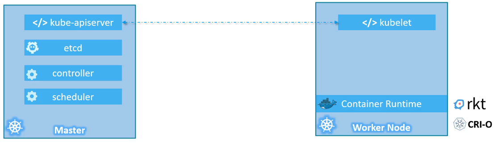

- [Core Concepts](#core-concepts)
  - [Kubernetes Architecture](#kubernetes-architecture)
    - [Nodes](#nodes)
    - [Clusters](#clusters)
    - [Master Node](#master-node)
    - [Components of Kubernetes](#components-of-kubernetes)
    - [Worker Nodes](#worker-nodes)
    - [Command-Line Tool (kubectl)](#command-line-tool-kubectl)
  - [Docker vs Container](#docker-vs-container)
    - [Docker and containerd](#docker-and-containerd)
    - [Kubernetes and Container Runtime Interface (CRI)](#kubernetes-and-container-runtime-interface-cri)
    - [Transition from Docker to containerd](#transition-from-docker-to-containerd)
    - [CLI Tools](#cli-tools)
    - [Key Commands](#key-commands)
    - [Additional Notes](#additional-notes)
  - [Pods](#pods)
    - [Understanding Pods](#understanding-pods)
    - [Scaling Applications](#scaling-applications)
    - [One-to-One Relationship](#one-to-one-relationship)
    - [Multi-Container Pods](#multi-container-pods)
    - [Benefits of Pods](#benefits-of-pods)
    - [Deploying Pods](#deploying-pods)
    - [Viewing Pods](#viewing-pods)
    - [Accessing Services](#accessing-services)
  - [Pods with YAML](#pods-with-yaml)
    - [Introduction](#introduction)
    - [Top-Level Fields](#top-level-fields)
    - [Creating a Pod](#creating-a-pod)
    - [Viewing Pods](#viewing-pods-1)
    - [Summary](#summary)
  - [Creating Pods with YAML](#creating-pods-with-yaml)
    - [Introduction](#introduction-1)
    - [Creating a Project in PyCharm](#creating-a-project-in-pycharm)
    - [YAML File Structure](#yaml-file-structure)
    - [Using PyCharm for YAML Files](#using-pycharm-for-yaml-files)
    - [Creating the Pod](#creating-the-pod)
    - [Viewing Pods](#viewing-pods-2)
    - [Summary](#summary-1)
  - [ReplicaSets](#replicasets)
    - [Introduction](#introduction-2)
    - [Replication Controller](#replication-controller)
    - [Replica Set](#replica-set)
    - [Creating a Replication Controller](#creating-a-replication-controller)
    - [Creating a Replica Set](#creating-a-replica-set)
    - [Labels and Selectors](#labels-and-selectors)
    - [Scaling Replica Sets](#scaling-replica-sets)
    - [Commands](#commands)
    - [Summary](#summary-2)
  - [Deployments](#deployments)
    - [Introduction](#introduction-3)
    - [Key Capabilities](#key-capabilities)
    - [Hierarchy](#hierarchy)
    - [Creating a Deployment](#creating-a-deployment)
    - [Commands](#commands-1)
    - [Summary](#summary-3)
  - [Namespaces](#namespaces)
    - [Introduction](#introduction-4)
    - [Default Namespaces](#default-namespaces)
    - [Custom Namespaces](#custom-namespaces)
    - [Communication Within and Between Namespaces](#communication-within-and-between-namespaces)
    - [Operational Aspects](#operational-aspects)
    - [Resource Quotas](#resource-quotas)
    - [Summary](#summary-4)

<br>

<hr style="height:4px;background:black">

<br>

# Core Concepts

## Kubernetes Architecture

### Nodes
* `Node`: A **machine** (physical or virtual) where **Kubernetes** is **installed**. 
  * It is a worker machine where containers are launched.
  * **Minions**: An older term for nodes, sometimes used interchangeably.

<br>


<br>

### Clusters
* `Cluster`: A **group of nodes** working together. 
* It ensures **application availability** even if one node fails and helps in load sharing.

<br>


<br>

### Master Node
* `Master Node`: **Manages** the **cluster** and **orchestrates containers** on worker nodes. 

It includes several components:
  * `API Server`: The **front end** for Kubernetes, **interacting** with **users** and **command-line interfaces**.
  * `etcd`: A distributed **key-value store** for storing cluster **data**.
  * `Scheduler`: **Distributes work** across nodes by assigning newly created containers to nodes.
  * `Controllers`: **Monitor** and **respond to node**, **container**, or **endpoint failures** by bringing up **new containers**.
  * `Container Runtime`: Software used to **run containers** (e.g., Docker).
  * `Kubelet`: An **agent** on each **node** ensuring **containers run as expected**.

<bR>


<br>

### Components of Kubernetes
* `API Server`: Interacts with users and devices to manage the cluster.
* `etcd`: Stores all cluster data in a distributed manner and implements locks to prevent conflicts.
* `Scheduler`: Assigns containers to nodes.
* `Controllers`: Manage the orchestration and ensure containers are running.
* `Container Runtime`: Runs containers (e.g., Docker, Rocket, CRI-O).
* `Kubelet`: Runs on each node, ensuring containers are running as expected.

<br>

### Worker Nodes
* `Worker Node`: **Hosts containers** and interacts with the master node to **provide health information** and **execute actions**.
* `Container Runtime`: Installed on worker nodes to run containers (e.g., Docker).

<br>



<br>

### Command-Line Tool (kubectl)
* `kubectl`: Used to deploy and manage applications on a Kubernetes cluster.
  * `kubectl run`: Deploys an application on the cluster.
  * `kubectl cluster-info`: Views information about the cluster.
  * `kubectl get nodes`: Lists all nodes in the cluster.

<br>

<hr style="height:4px;background:black">

<br>

## Docker vs Container

### Docker and containerd
* `Docker`: Initially the most dominant **container tool** due to its **user-friendly** experience. 
  * It includes multiple tools like Docker CLI, Docker API, build tools, and the container runtime called RunC.
* `containerd`: Originally **part** of Docker, it is now a **separate project** and a **CRI-compatible container runtime**. 
  * It can work directly with Kubernetes and is used to run containers.

<br>

### Kubernetes and Container Runtime Interface (CRI)
* `Kubernetes`: Initially built to **orchestrate Docker containers**. 
  * As it grew, it needed to support other container runtimes.
* `Container Runtime Interface` (CRI): An interface introduced by Kubernetes to **allow any container runtime to work with Kubernetes**, as long as they **adhere to OCI** (Open Container Initiative) standards.
* `Open Container Initiative` (OCI): **Defines standards** for **how container images** and **runtimes** should be **built** and **developed**.

<bR>

### Transition from Docker to containerd
* `Dockershim`: A **temporary** solution introduced by Kubernetes to **support Docker outside** of the **CRI standards**.
* `Kubernetes v1.24`: **Removed support** for Docker by **eliminating dockershim**, but Docker images continue to work with containerd due to OCI standards.

<br>

### CLI Tools
* `ctr`: A command-line tool for **debugging containerd**. 
  * It supports basic container-related activities but is **not user-friendly** for production use.
* `nerdctl`: A **Docker-like CLI for containerd**, supporting most Docker commands and additional features like encrypted container images, lazy pulling, and P2P image distribution.
* `crictl`: A **CLI tool** maintained by the **Kubernetes** community to interact with CRI-compatible container runtimes. 
  * It is used for **debugging** and **inspecting container runtimes** but not for creating containers in production.

<br>

### Key Commands
**ctr**:
* `ctr images pull <image>`: Pull an image.
* `ctr run <image>`: Run a container.

**nerdctl**:
* `nerdctl run <image>`: Run a container (similar to docker run).
* `nerdctl -p <port>`: Expose ports (similar to Docker).

**crictl**:
* `crictl ps`: List containers (similar to docker ps).
* `crictl exec -i -t <container-id> <command>`: Run a command inside a container (similar to docker exec).
* `crictl logs <container-id>`: View logs (similar to docker logs).
* `crictl pods`: List pods (unique to crictl).

<br>

### Additional Notes
* `crictl vs Docker Commands`: Many crictl commands like attach, exec, images, info, inspect, logs, ps, stats, and version work similarly to Docker commands.
* `Kubernetes v1.24 Changes`: The **default runtime endpoint** for crictl changed from dockershim.sock to **cri-dockerd.sock**. 
  * Users are now encouraged to manually set the endpoint.
* `CLI Tool Comparison`:
  * `ctr`: Used for debugging containerd, limited features.
  * `nerdctl`: General-purpose, Docker-like CLI for containerd.
  * `crictl`: Debugging tool for CRI-compatible runtimes, maintained by the Kubernetes community.

<br>


<br>

<hr style="height:4px;background:black">

<br>

## Pods

### Understanding Pods
* `Pod`: The smallest Kubernetes object, encapsulating a **single instance** of an **application**. 
  * It is the unit of deployment in Kubernetes.
* `Single-Node Cluster`: A **single instance** of your **application running** in a **single Docker container**, **encapsulated** in a **Pod**.

<br>


<br>

### Scaling Applications
* `Scaling Up`: Create **new Pods** with **new instances** of the application to **handle increased load**.
* `Scaling Down`: **Delete existing Pods** to reduce the number of instances.
* `Multi-Node Cluster`: **Deploy additional Pods** on new nodes to expand the cluster's capacity.

<br>

### One-to-One Relationship
* `Pods and Containers`: Usually have a one-to-one relationship. 
  * To scale, create new Pods rather than adding containers to existing Pods.

<br>

### Multi-Container Pods
* `Multiple Containers`: A **single Pod** can have **multiple containers**, usually for supporting tasks (e.g., helper containers).
* `Communication`: Containers in the same Pod can **communicate directly** using **localhost** and **share** the same **storage space**.

<br>

### Benefits of Pods
* `Automatic Management`: Kubernetes handles network connectivity, storage sharing, and lifecycle management of containers within a Pod.
* `Future-Proof`: Even single-container applications benefit from being in Pods, as it prepares them for future architectural changes and scaling.

<br>

### Deploying Pods
* `kubectl run`: Deploys a Docker container by creating a Pod.
  * Use the `--image` parameter to specify the application image.
* `Docker Hub`: Public repository for Docker images.
  * Kubernetes can pull images from Docker Hub or a private repository.

<Br>

### Viewing Pods
* `kubectl get pods`: Lists all Pods in the cluster. 
  * Shows the **state** of each Pod (e.g., ContainerCreating, Running).

<br>

### Accessing Services
* `Internal Access`: Initially, services like the nginx web server are accessible internally from the node.
* `External Access`: Learn about networking and services in later lectures to make services accessible to end users.

<br>

<hr style="height:4px;background:black">

<br>

## Pods with YAML

### Introduction
* `YAML Files`: Used by Kubernetes to create objects like pods, replicas, deployments, and services.
* `Structure`: A Kubernetes definition file contains four top-level fields: API version, kind, metadata, and spec.

<br>

### Top-Level Fields
`API Version`:
* Specifies the version of the Kubernetes API used to create the object.
  * **Example**: apiVersion: v1 for pods.

`Kind`:
* Refers to the type of object being created.
  * **Example**: kind: Pod.

`Metadata`:
* Contains data about the object, such as its name and labels.

**Example**:

```yaml
metadata:
  name: my-app-pod
  labels:
    app: my-app
```

`Spec`:
* Provides additional information about the object.

**Example for a pod with a single container**:

```yaml
spec:
  containers:
  - name: my-container
    image: nginx
```

<br>

### Creating a Pod
`YAML Configuration`:

```yaml
apiVersion: v1
kind: Pod
metadata:
  name: my-app-pod
  labels:
    app: my-app
spec:
  containers:
  - name: my-container
    image: nginx
```

<br>

`Command to Create Pod`:

```bash
kubectl create -f pod-definition.yaml
```

<br>

### Viewing Pods
`List Pods`:

```bash
kubectl get pods
```

<br>

`Detailed Information`:

```bash
kubectl describe pod my-app-pod
```

<br>

### Summary
* `Four Top-Level Properties`: API version, kind, metadata, and spec.
* `Creating a Pod`: Define the YAML file with the necessary fields and use kubectl create -f to create the pod.
* `Viewing Pods`: Use kubectl get pods to list pods and kubectl describe pod to get detailed information.

<br>

<hr style="height:4px;background:black">

<br>

## Creating Pods with YAML

### Introduction
* `Editors`: You can use any editor to create YAML files, such as Notepad, Notepad++, Atom, or PyCharm.
* `PyCharm`: A Python editor from JetBrains with good support for YAML files. You can download the free community version from [jetbrains.com/pycharm](https://www.jetbrains.com/pycharm/).

<br>

### Creating a Project in PyCharm
1. `Create a New Project`:
   * Name the project (e.g., "Pod").
   * Create a folder named "Pod" within the project.

2. `Create a YAML File`:
   * Name the file pod-definition.yaml.

<br>

### YAML File Structure
* `Four Root-Level Properties`: API Version, kind, metadata, spec.

1. `API Version`: **Example**: apiVersion: v1

2. `Kind`: **Example**: kind: Pod

3. `Metadata`: **Contains data about the object**, such as its name and labels.

**Example**:

```yaml
metadata:
  name: myapp-pod
  labels:
    app: MyApp
```

<br>

4. `Spec`: Provides additional information about the object.

**Example for a pod with a single container**:

```yaml
spec:
  containers:
  - name: nginx-container
    image: nginx
```

<br>

### Using PyCharm for YAML Files
* `Indentation`: Ensure proper indentation for hierarchy.
* `Tree Structure`: PyCharm shows a tree structure of the YAML file, helping you visualize the hierarchy.

<br>


<br>

### Creating the Pod
1. `Copy the YAML Content`:

**Example YAML content**:

```yaml
apiVersion: v1
kind: Pod
metadata:
  name: myapp-pod
  labels:
    app: MyApp
spec:
  containers:
  - name: nginx-container
    image: nginx
```

<br>

2. `Create the Pod`:

**Run the command**:

```bash
kubectl create -f pod-definition.yaml
```

<br>

### Viewing Pods
`List Pods`:

```bash
kubectl get pods
```

<br>

`Detailed Information`:

```bash
kubectl describe pod myapp-pod
```

<br>

### Summary
* **Four Root-Level Properties**: API version, kind, metadata, and spec.
* **Creating a Pod**: Define the YAML file with the necessary fields and use `kubectl create -f` to create the pod.
* **Viewing Pods**: Use `kubectl get pods` to list pods and `kubectl describe pod` to get detailed information.

<br>

<hr style="height:4px;background:black">

<br>

## ReplicaSets

### Introduction
* `Kubernetes Controllers`: The brain behind Kubernetes, **monitoring objects** and **responding accordingly**.
* `Replication Controller`: Ensures **high availability** by **running multiple** instances of a **pod**.

<br>

### Replication Controller
`Purpose`:
* Ensures specified number of **pods** are **running at all times**.
* Provides **high availability** by running multiple instances of a pod.
* **Balances load** across multiple pods.

`Usage`:
* Even with a single pod, it can **automatically** bring up a **new pod** if the **existing one fails**.
* Helps in **scaling applications** by creating multiple pods.

<br>

### Replica Set
* `Replica Set`: The newer, recommended way to set up replication, replacing the older replication controller.
* `Similarities`: Both serve the same purpose of ensuring high availability and load balancing.
* `Differences`: Minor differences in implementation, with replica set being the preferred method.

<br>

### Creating a Replication Controller
1. `Definition File`:
   * **Name**: rc-definition.yaml
   * **Four sections**: API version, kind, metadata, and spec.

2. `API Version`: **Example**: apiVersion: v1
3. `Kind`: **Example**: kind: ReplicationController

4. `Metadata`: Contains data about the replication controller, such as its name and labels.

**Example**:

```yaml
metadata:
  name: myapp-rc
  labels:
    app: myapp
    type: frontend
```

<br>

5. `Spec`: Defines the number of replicas and the pod template.

**Example**:

```yaml
spec:
  replicas: 3
  template:
    metadata:
      name: myapp-pod
      labels:
        app: myapp
    spec:
      containers:
      - name: nginx-container
        image: nginx
```

<br>

### Creating a Replica Set
1. `Definition File`:
   * Similar to replication controller but with a different API version.

**Example**:

```yaml
apiVersion: apps/v1
kind: ReplicaSet
metadata:
  name: myapp-rs
  labels:
    app: myapp
    type: frontend
spec:
  replicas: 3
  template:
    metadata:
      name: myapp-pod
      labels:
        app: myapp
    spec:
      containers:
      - name: nginx-container
        image: nginx
  selector:
    matchLabels:
      app: myapp
```

<br>

### Labels and Selectors
* `Labels`: Used to identify and group Kubernetes objects.
* `Selectors`: Used by replica sets to identify which pods to monitor.
* `matchLabels`: Matches the labels specified under it to the labels on the pod.

<br>

### Scaling Replica Sets
`Updating Replicas`:
* `Method 1`: Update the number of replicas in the definition file and use kubectl replace -f to apply the changes.
* `Method 2`: Use kubectl scale command to scale the replica set.

```bash
kubectl scale --replicas=6 -f rs-definition.yaml
```

> **Note**: Using the kubectl scale command does not update the number of replicas in the definition file.

<br>

### Commands
* Create Replication Controller: `kubectl create -f rc-definition.yaml`
* View Replication Controllers: `kubectl get replicationcontroller`
* View Pods: `kubectl get pods`
* Create Replica Set: `kubectl create -f rs-definition.yaml`
* View Replica Sets: `kubectl get replicaset`
* Delete Replica Set: `kubectl delete replicaset myapp-rs`
* Replace Replica Set: `kubectl replace -f rs-definition.yaml`
* Scale Replica Set: `kubectl scale --replicas=6 -f rs-definition.yaml`

<br>

### Summary
* `Replication Controller`: Ensures high availability and load balancing by running multiple instances of a pod.
* `Replica Set`: The newer, recommended way to set up replication.
* `Creating Controllers`: Define YAML files with the necessary fields and use kubectl create -f to create the controller.
* `Viewing Controllers and Pods`: Use kubectl get replicationcontroller and kubectl get pods to view controllers and pods.
* `Scaling`: Use kubectl replace or kubectl scale to update the number of replicas.

<br>

<hr style="height:4px;background:black">

<br>

## Deployments

### Introduction
* `Kubernetes Deployments`: **Higher-level** Kubernetes object that **manages pods** and **replica sets**, **providing advanced capabilities** for deploying applications.

<br>

### Key Capabilities
* `Multiple Instances`: Deploy multiple instances of a web server for **high availability**.
* `Rolling Updates`: Upgrade instances one after the other to **avoid impacting users**.
* `Rollback`: **Undo recent changes** if an upgrade results in an error.
* `Pause and Resume`: Apply multiple changes together by pausing the environment, making changes, and then resuming.

<br>

### Hierarchy
* `Pods`: Deploy single instances of an application.
* `Replication Controllers/Replica Sets`: Deploy multiple pods.
* `Deployments`: Manage replica sets and **provide advanced capabilities** like rolling updates, rollbacks, and pause/resume.

<br>

### Creating a Deployment
`Definition File`:
* Similar to the replica set definition file but with kind: Deployment.

**Example**:

```yaml
apiVersion: apps/v1
kind: Deployment
metadata:
  name: myapp-deployment
  labels:
    app: myapp
spec:
  replicas: 3
  selector:
    matchLabels:
      app: myapp
  template:
    metadata:
      labels:
        app: myapp
    spec:
      containers:
      - name: nginx-container
        image: nginx
```

<br>

### Commands

* Create Deployment: `kubectl create -f deployment-definition.yaml`
* View Deployments: `kubectl get deployments`
* View Replica Sets: `kubectl get replicaset`
* View Pods: `kubectl get pods`
* Viewing All Created Objects: `kubectl get all`
  * **Output**: Shows the deployment, replica set, and pods created as part of the deployment.

<br>

### Summary
* `Deployments`: Provide advanced capabilities for managing applications, including rolling updates, rollbacks, and pause/resume.
* `Creating Deployments`: Define YAML files with the necessary fields and use kubectl create -f to create the deployment.
* `Viewing Deployments`: Use kubectl get deployments, kubectl get replicaset, and kubectl get pods to view deployments, replica sets, and pods.

<br>

<hr style="height:4px;background:black">

<br>

## Namespaces

### Introduction
* `Namespaces`: Used to **organize** and **manage resources** in a Kubernetes **cluster**, similar to houses with different members and rules.

<Br>

### Default Namespaces
* `default`: The namespace where all user-created objects are placed by default.
* `kube-system`: Contains Kubernetes internal components like **networking** and **DNS services**.
* `kube-public`: Contains resources that should be **accessible** to **all users**.

<br>

### Custom Namespaces
* `Creating Custom Namespaces`: Useful for **isolating resources** between **different environments** (e.g., dev and production).
* `Policies and Quotas`: Each namespace can have its **own set of policies** and **resource quotas** to **control usage**.

<br>

### Communication Within and Between Namespaces
* `Within a Namespace`: Resources can **refer to each other** by their names (e.g., dbservice).
* `Between Namespaces`: Use the format **service-name.namespace.svc.cluster.local** (e.g., dbservice.dev.svc.cluster.local).

<br>

### Operational Aspects
1. `Listing Pods`:
   * Default namespace: `kubectl get pods`
   * Specific namespace: `kubectl get pods --namespace=kube-system`

2. `Creating Pods in a Specific Namespace`:
   * Command line: `kubectl create -f pod-definition.yaml --namespace=dev`

**Pod definition file**:

```yaml
metadata:
  name: myapp-pod
  namespace: dev
```

<br>

3. `Creating a New Namespace`:

**Definition file**:

```yaml
apiVersion: v1
kind: Namespace
metadata:
  name: dev
```

<br>

**Command line**:

```bash
kubectl create namespace dev
```

<br>

4. `Switching Namespaces`:
   * Set current context to a specific namespace:

```bash
kubectl config set-context --current --namespace=dev
```

<br>

5. `Viewing Pods in All Namespaces`:

```bash
kubectl get pods --all-namespaces
```

<br>

### Resource Quotas
`Definition File`:

```yaml
apiVersion: v1
kind: ResourceQuota
metadata:
  name: quota
  namespace: dev
spec:
  hard:
    pods: "10"
    requests.cpu: "10"
    requests.memory: "10Gi"
```

<br>

### Summary
* `Namespaces`: Organize and manage resources in a Kubernetes cluster.
* `Default Namespaces`: default, kube-system, and kube-public.
* `Custom Namespaces`: Useful for isolating resources and managing policies and quotas.
* `Communication`: Resources can communicate within and between namespaces using specific formats.
* `Operational Commands`: Use kubectl commands to list, create, and manage resources in namespaces.

<br>

<hr style="height:4px;background:black">

<br>
