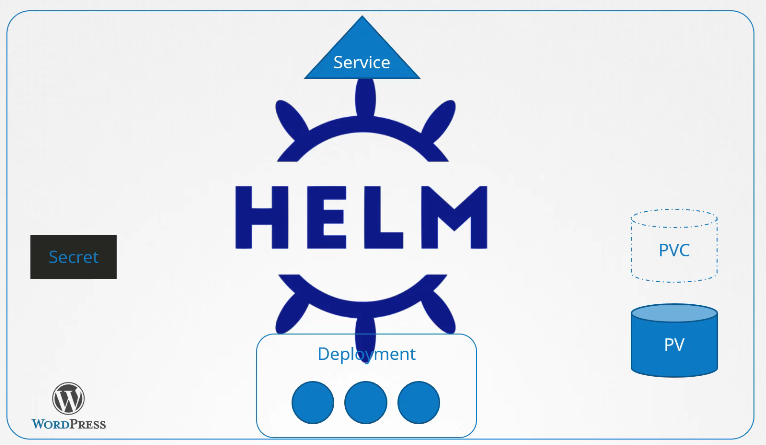
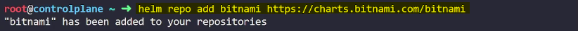

- [Helm Fundamentals](#helm-fundamentals)
  - [Helm Introduction](#helm-introduction)
    - [Introduction to Helm](#introduction-to-helm)
    - [Challenges Without Helm](#challenges-without-helm)
    - [Advantages of Helm](#advantages-of-helm)
    - [How Helm Works](#how-helm-works)
    - [Summary](#summary)
  - [Install Helm](#install-helm)
    - [Prerequisites](#prerequisites)
    - [Installing Helm on Linux](#installing-helm-on-linux)
    - [Summary](#summary-1)
  - [Demo: Install Helm](#demo-install-helm)
    - [Identifying the Operating System](#identifying-the-operating-system)
    - [Installing Helm](#installing-helm)
    - [Retrieving Helm Client Environment Information](#retrieving-helm-client-environment-information)
    - [Identifying Helm Version](#identifying-helm-version)
    - [Enabling Verbose Output](#enabling-verbose-output)
    - [Summary](#summary-2)
  - [Helm Concepts](#helm-concepts)
    - [Introduction to Helm Concepts](#introduction-to-helm-concepts)
    - [Helm Charts](#helm-charts)
    - [Using Helm Charts](#using-helm-charts)
    - [Summary](#summary-3)
  - [Demo: Helm Concepts](#demo-helm-concepts)
    - [Searching for a Helm Chart](#searching-for-a-helm-chart)
    - [Adding a Helm Repository](#adding-a-helm-repository)
    - [Searching for a Package in a Repository](#searching-for-a-package-in-a-repository)
    - [Identifying Versions](#identifying-versions)
    - [Listing Helm Repositories](#listing-helm-repositories)
    - [Installing a Helm Chart](#installing-a-helm-chart)
    - [Uninstalling a Helm Chart](#uninstalling-a-helm-chart)
    - [Downloading a Helm Package](#downloading-a-helm-package)
    - [Modifying and Installing a Helm Chart](#modifying-and-installing-a-helm-chart)
    - [Summary](#summary-4)

<br>

<hr style="height:4px;background:black">

<br>

# Helm Fundamentals

## Helm Introduction

### Introduction to Helm
* `Purpose`: **Simplifies** the **management** of complex **applications** in Kubernetes.
* `Function`: Acts as a **package manager** for Kubernetes, treating **applications** as a **whole** rather than a collection of individual objects.

<br>



<br>

### Challenges Without Helm
* `Complexity`: Applications **consist** of multiple **interconnected objects** (e.g., deployments, services, persistent volumes).
* `Manual Management`: Editing multiple YAML files for each object, applying changes, and managing upgrades can be tedious and error-prone.

<br>

### Advantages of Helm
1. `Single Command Installation`:
   * **Install Whole App**: Use a **single command to install an entire application**, even if it consists of many objects.
     * **Example**: Installing a WordPress site with all its components.

<br>

2. `Customisation`:
   * **Values File**: Customize settings in a **single values.yaml file**.
   * **Example**: Change persistent volume size, website name, admin password, and database settings.

<br>

3. `Upgrades and Rollbacks`:
   * **Upgrade**: Use a single command to **upgrade the application**, with Helm managing the necessary changes to individual objects.
   * **Rollback**: Easily revert to a previous version if needed.

<br>

4. `Uninstallation`:
   * `Single Command`: Uninstall the entire application with **one command**, with **Helm tracking** and **removing all associated objects**.

<br>

### How Helm Works
* `Package Manager`: Helm treats applications as **packages**, managing all **related objects as a group**.
* `Release Manager`: Helps **upgrade** or **roll back applications**, ensuring consistency and reducing manual effort.

<br>

### Summary
* `Helm`: Simplifies the deployment, management, and maintenance of applications in Kubernetes.
* `Key Features`: Single command installation, customization through values file, easy upgrades and rollbacks, and efficient uninstallation.
* `Benefit`: Reduces the complexity and manual effort required to manage Kubernetes applications.

<br>

<hr style="height:4px;background:black">

<br>

## Install Helm

### Prerequisites
* `Kubernetes Cluster`: Ensure you have a functional Kubernetes cluster.
* `kubectl Utility`: Install and configure kubectl on your local computer with the correct credentials in the kubeconfig file.
* **Documentation**: [Installing Helm](https://helm.sh/docs/intro/install/).

<br>

### Installing Helm on Linux
1. `Using Snap Utility`:

Command:

```bash
sudo snap install helm --classic
```

* `Classic Parameter`: Provides a more relaxed sandbox, allowing Helm to access the kubeconfig file in the home directory

<br>

2. `For apt-based Systems` (Debian/Ubuntu):

<br>

Add Key and Sources List:

```bash
curl https://baltocdn.com/helm/signing.asc | sudo apt-key add -

sudo apt-get install apt-transport-https --yes

echo "deb https://baltocdn.com/helm/stable/debian/ all main" | sudo tee /etc/apt/sources.list.d/helm-stable-debian.list

sudo apt-get update
```

<br>

3. `Install Helm`:

```bash
sudo apt-get install helm
```

<br>

4. `For yum-based Systems` (CentOS/RHEL):

<br>

Install Helm:

```bash
sudo yum install helm
```

<br>

### Summary
* `Helm Installation`: Ensure you have a Kubernetes cluster and kubectl configured. Install Helm using snap, apt, or yum based on your Linux distribution.
* `Documentation`: Always refer to the latest instructions from the [Helm documentation](https://helm.sh/docs/intro/install/) pages for your operating system.

<br>

<hr style="height:4px;background:black">

<br>

## Demo: Install Helm

### Identifying the Operating System
Command:

```bash
cat /etc/*release*
```

* **Output**: Shows the operating system, e.g., Ubuntu.

<br>


<br>

### Installing Helm
1. `Helm Documentation`:
   * **Visit**: [Helm installation page](https://helm.sh/docs/intro/install/).
   * **Find Instructions**: Scroll to the section for your specific operating system (e.g., Ubuntu).

<br>


<br>

2. `Install Helm on Ubuntu`:

Commands:

```bash
curl https://baltocdn.com/helm/signing.asc | sudo apt-key add -

sudo apt-get install apt-transport-https --yes

echo "deb https://baltocdn.com/helm/stable/debian/ all main" | sudo tee /etc/apt/sources.list.d/helm-stable-debian.list

sudo apt-get update

sudo apt-get install helm
```

<br>

3. `Validation`:
   * **Run**: `helm version` to verify installation.

### Retrieving Helm Client Environment Information
`Help Command`:
* **Run**: `helm --help`
* **Command**: helm env retrieves Helm client environment information.

<br>

### Identifying Helm Version
Command:
* **Run**: `helm version`
* **Output**: Shows the installed Helm version, e.g., 3.9.2.

<br>

### Enabling Verbose Output
`Help Command`:
* **Run**: `helm --help`
* **Flag**: Use `--debug` to enable verbose output.

<br>

### Summary
* `Helm Installation`: Follow the Helm documentation for your operating system to install Helm.
* `Commands`: Use `helm env` for environment information, helm version to check the installed version, and `--debug` to enable verbose output.

<br>

<hr style="height:4px;background:black">

<br>

## Helm Concepts

### Introduction to Helm Concepts
* `Purpose`: Simplifies the deployment and management of applications in Kubernetes using charts.
* `Function`: Treats applications as packages, managing all related objects as a group.

<br>

### Helm Charts
1. `Components`:
   * `Templates`: YAML files with variables indicated by double curly braces ({{ }}).
   * `Values File`: values.yaml contains the values for the variables in the templates.
   * `Chart File`: Chart.yaml contains information about the chart, such as name, version, description, keywords, and maintainers.

<br>

2. `Example Files`:
   * **Deployment.yaml**: Defines the deployment.
   * **Secret.yaml**: Defines secrets.
   * **PV.yaml**: Defines persistent volumes.
   * **PVC.yaml**: Defines persistent volume claims.
   * **Service.yaml**: Defines services.

<br>

### Using Helm Charts
1. `Creating a Chart`:
   * Command: `helm create <chart-name>`
   * **Customize**: Modify the templates and values.yaml file as needed.

<br>

2. `Searching for Charts`:
   * **Artifact Hub**: Community-driven chart repository with over 5,700 charts.
   * Command: `helm search hub <chart-name>` to search the Artifact Hub.

<br>

3. `Adding Repositories`:
   * Command: `helm repo add <repo-name> <repo-url>`
     * **Example**: helm repo add bitnami https://charts.bitnami.com/bitnami

<br>

4. `Searching Repositories`:
   * Command: `helm search repo <chart-name>`

5. `Installing a Chart`:
   * Command: `helm install <release-name> <chart-name>`
   * **Release**: Each installation of a chart is called a release, and each release has a unique name.

6. `Managing Releases`:
   * **List Installed Packages**: Command: `helm list`
   * **Uninstall Packages**: Command: `helm uninstall <release-name>`

7. `Downloading and Extracting Charts`:
   * Download Only: Command: `helm pull <chart-name> --untar`
   * **Modify and Install**: Edit: Modify the values.yaml file as needed.

8. `Install`:
   * Command: `helm install <release-name> <path-to-chart-directory>`

<br>

### Summary
* `Helm Charts`: Simplify the deployment and management of applications in Kubernetes.
* `Key Commands`: Create, search, install, list, uninstall, and pull charts.
* `Customization`: Use templates and values.yaml to customize deployments.

<br>

<hr style="height:4px;background:black">

<br>

## Demo: Helm Concepts

### Searching for a Helm Chart
1. `Command to Search for WordPress Chart`:

Command:

```bash
helm search hub wordpress
```

<br>

### Adding a Helm Repository
1. `Add Bitnami Helm Chart Repository`:

Command:

```bash
helm repo add bitnami https://charts.bitnami.com/bitnami
```



<br>

### Searching for a Package in a Repository
1. `Search for Joomla Package`:

Command:

```bash
helm search repo joomla
```


<br>

### Identifying Versions
1. `App Version of Joomla in Bitnami Repository`:
   * **Version**: 4.1.5

2. `Chart Version of Joomla in Bitnami Repository`:
   * **Version**: 13.2.16

<br>

### Listing Helm Repositories
1. `List Added Helm Repositories`:

Command:

```bash
helm repo list
```

* **Result**: Shows the number of repositories added (e.g., 3).

<br>


<br>

### Installing a Helm Chart
1. `Install Drupal Helm Chart`:

Command:

```bash
helm install bravo bitnami/drupal
```

<br>

2. `List Installed Packages`:

Command:

```bash
helm list
```


<br>

### Uninstalling a Helm Chart
1. `Uninstall Drupal Helm Package`:

Command:

```bash
helm uninstall bravo
```

<br>

### Downloading a Helm Package
1. `Download Bitnami Apache Package`:

Command:

```bash
helm pull --untar bitnami/apache
```

<br>

### Modifying and Installing a Helm Chart
1. `Modify Values File`:
   * **File**: values.yaml

`Changes`:
* **Replicas**: Set replicaCount to 2.
* **NodePort**: Set HTTP port to 30080.

<br>

2. `Install Modified Apache Helm Chart`:

Command:

```bash
helm install mywebapp .
```

<br>

### Summary
* `Helm Commands`: Search, add repositories, install, list, uninstall, and pull charts.
* `Customization`: Modify values.yaml for specific configurations before installation.

<br>

<hr style="height:4px;background:black">

<br>

