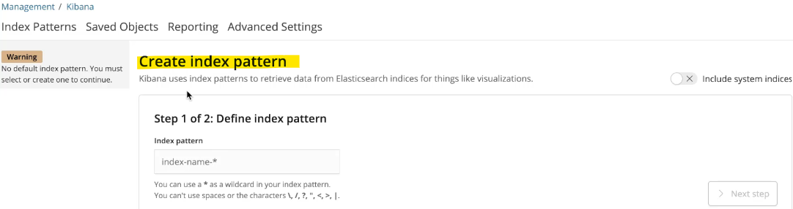

- [Multi-Container Pods](#multi-container-pods)
  - [Multi-Container Pods](#multi-container-pods-1)
    - [Introduction](#introduction)
    - [Benefits of Multi-Container Pods](#benefits-of-multi-container-pods)
    - [Shared Characteristics](#shared-characteristics)
    - [Creating Multi-Container Pods](#creating-multi-container-pods)
    - [Common Patterns](#common-patterns)
    - [Summary](#summary)
  - [Practise Test/Solution: Creating Multi Container Pods](#practise-testsolution-creating-multi-container-pods)
    - [Creating a Multi-Container Pod](#creating-a-multi-container-pod)
      - [Steps:](#steps)
    - [Setting Up Logging with Elastic Stack](#setting-up-logging-with-elastic-stack)
    - [Inspecting Kibana UI](#inspecting-kibana-ui)
    - [Summary](#summary-1)
  - [Init Containers](#init-containers)
    - [Introduction](#introduction-1)
    - [Purpose of Init Containers](#purpose-of-init-containers)
    - [Characteristics of Init Containers](#characteristics-of-init-containers)
    - [Configuring Init Containers](#configuring-init-containers)
    - [Example with Multiple Init Containers](#example-with-multiple-init-containers)
    - [Summary](#summary-2)
  - [Practise Test/Solution: Init Containers](#practise-testsolution-init-containers)
    - [Identifying Pods with Init Containers](#identifying-pods-with-init-containers)
    - [Checking Init Container Details](#checking-init-container-details)
    - [New App with Init Containers](#new-app-with-init-containers)
    - [Updating Pod with Init Container](#updating-pod-with-init-container)
    - [Fixing Issues with New Application](#fixing-issues-with-new-application)
    - [Summary](#summary-3)

<br>

<hr style="height:4px;background:black">

<br>

# Multi-Container Pods

## Multi-Container Pods

### Introduction
* `Multi-Container Pods`: Pods that contain **multiple containers** working together **within the same pod**.

<br>

### Benefits of Multi-Container Pods
* `Decoupling`: Break down large monolithic applications into smaller, **independent microservices**.
* `Scalability`: **Scale up or down** individual services as needed.
* `Modularity`: Modify **each service independently** without affecting the entire application.

<br>


<br>

### Shared Characteristics
* `Lifecycle`: **Containers** in a multi-container pod are **created** and **destroyed together**.
* `Network Space`: Containers **share** the same **network space** and can **communicate** with each other **using localhost**.
* `Storage Volumes`: Containers have **access** to the **same storage volumes**, simplifying data sharing.

<br>


<br>

### Creating Multi-Container Pods
* `Pod Definition File`: Add multiple containers to the containers section, which is an array.

**Example**:

```yaml
apiVersion: v1
kind: Pod
metadata:
  name: multi-container-pod
spec:
  containers:
  - name: web-server
    image: web-server-image
  - name: log-agent
    image: log-agent-image
```

<br>

### Common Patterns
`Sidecar Pattern`:
* **Example**: Deploying a **logging agent** alongside a web server to **collect** and **forward logs**.
* **Use Case**: Enhance or extend the functionality of the main container without modifying its code.

<br>

`Adapter Pattern`:
* **Example**: **Converting logs** to a common format before sending them to a central server.
* **Use Case**: Transform or process data before it reaches its final destination.

<br>

`Ambassador Pattern`:
* **Example**: **Proxying database requests** to different database instances **based on the environment** (development, testing, production).
* **Use Case**: Manage connectivity and routing logic outside the main application code.

<br>

### Summary
* `Multi-Container Pods`: Enable multiple containers to work together within the same pod, sharing lifecycle, network space, and storage volumes.
* `Patterns`: Sidecar, Adapter, and Ambassador patterns provide different ways to design multi-container pods based on specific use cases.
* `Implementation`: Use the pod definition file to specify multiple containers within the containers array.

<br>

<hr style="height:4px;background:black">

<br>

## Practise Test/Solution: Creating Multi Container Pods

### Creating a Multi-Container Pod
> **Task**: Create a multi-container pod with two containers.

* `Pod Name`: Yellow
* `Containers`:
  * `First Container`:
    * **Name**: Lemon
    * **Image**: BusyBox
    * **Command**: sleep 1000
  * `Second Container`:
    * **Name**: Gold
    * **Image**: Redis

<br>

#### Steps:

1. `Generate Pod Definition`:

```bash
kubectl run Yellow --image=busybox --dry-run=client -o yaml > yellow.yaml
```

<br>


<br>

2. `Edit Pod Definition`:
   * Change the name of the **first** container to **Lemon**.
   * Add the **second** container with the name **Gold** and **image Redis**.
   * Add the command **sleep 1000** to the **Lemon** container.

<bR>

`Example Pod Definition`:

```yaml
apiVersion: v1
kind: Pod
metadata:
  name: Yellow
spec:
  containers:
  - name: Lemon
    image: busybox
    command: ["sleep", "1000"]
  - name: Gold
    image: redis
```

<br>


<br>

3. `Create the Pod`: kubectl apply -f yellow.yaml

<br>


<br>

### Setting Up Logging with Elastic Stack


<br>

1. `Namespace`: Elastic Stack

2. `Components`:
   * **App Pod**: Generates logs.
   * **ElasticSearch Pod**: Collects logs.
   * **Kibana Pod**: Dashboard for viewing logs.

<br>

3. `Inspecting the Namespace`:

```bash
kubectl get pods -n elastic-stack
```

<br>


<bR>

4. `Viewing Logs`:

```bash
kubectl logs app -n elastic-stack
```

* **Identify User Issues**: Look for login issues in the logs (e.g., user5).

```bash
kubectl -n elastic-stack exec -it app -- cat /log/app.log
```

<br>


<br>

5. `Adding a Sidecar Container for Logging`:

<br>


<br>

**Edit Pod Definition**:
* Add a **sidecar** container named **sidecar** with the **image filebeat**.
* Configure **volume mounts** to **share** the **log directory**.

```bash
kubectl edit pod app -n elastic-stack
```

<br>

**Example Pod Definition**:

<bR>


<br>


<br>

7. `Apply Changes`: 

```bash
kubectl replace --force -f app.yaml
```

<br>

### Inspecting Kibana UI
   * `Create Index Pattern`: Use Kibana to create an index pattern to **retrieve data** from **ElasticSearch**.
   * `View Logs`: Check the Discover section in Kibana to see the logs.

<br>

1. `Access Kibana`:
   * Open your web browser and navigate to the Kibana URL provided by your administrator or the one you have set up.

<br>

2. `Create Index Pattern`:
   * Once you are in the Kibana dashboard, go to the **Management** section. 
     * This is usually found in the left-hand menu.
   * Under **Kibana**, click on **Index Patterns**.
   * Click the **Create index pattern** button.
   * Enter the **index pattern** that **matches the indices** you want to **retrieve data from**. 
     * For example, you might use `logstash-*` if your logs are indexed with a prefix of `logstash-`.

<br>



<br>

   * Click **Next** step.
   * Select the **Time Filter** field name if your index contains time-based events. 
     * This is typically a field like `@timestamp`.
   * Click **Create index pattern** to finalise the creation.

<bR>

3. `View Logs in Discover Section`:
   * After creating the index pattern, go to the **Discover** section in the left-hand menu.
   * Select the newly created index pattern from the dropdown menu at the top.
   * You should now see the **logs retrieved from ElasticSearch** displayed in the Discover section.

<br>


<br>

### Summary
* `Multi-Container Pods`: Create pods with multiple containers to work together, sharing lifecycle, network space, and storage volumes.
* `Logging with Elastic Stack`: Use sidecar containers to send logs to ElasticSearch and view them in Kibana.
* `Commands and Configuration`: Use kubectl commands to create and manage pods, and configure volume mounts for log sharing.

<br>

<hr style="height:4px;background:black">

<br>

## Init Containers

### Introduction
* `Init Containers`: Special containers that **run to completion before the main containers in a pod start**.

<br>

### Purpose of Init Containers
* `Run-to-Completion Tasks`: Used for **tasks** that need to be **completed before** the **main application starts**.

**Examples**:
* Pulling code or binaries from a repository.
* Waiting for an external service or database to be up.

<br>

### Characteristics of Init Containers
* `Lifecycle`: Init containers run to completion before the main containers start.
* `Sequential Execution`: Multiple init containers **run one at a time** in the **order** they are **specified**.
* `Pod Restart`: If any init container fails, the **pod is restarted until** the **init container succeeds**.

<br>

### Configuring Init Containers
* `Pod Definition File`: Init containers are specified in the initContainers section.

<bR>

**Example**:


<br>

### Example with Multiple Init Containers
* `Pod Definition File`: Multiple init containers can be specified, each running sequentially.

<br>

**Example**:


<br>

### Summary
* `Init Containers`: Run tasks to completion before the main containers start.
* `Sequential Execution`: Init containers run one at a time in the specified order.
* `Pod Restart`: The pod is restarted if any init container fails until it succeeds.
* `Configuration`: Use the initContainers section in the pod definition file to specify init containers.

<br>

<hr style="height:4px;background:black">

<br>

## Practise Test/Solution: Init Containers

### Identifying Pods with Init Containers
* **Task**: Identify the pod with an Init container.

**Command**:

* List all pods: `kubectl get pods`
* Describe all pods to find the Init container: `kubectl describe pod`

> **Result**: The blue pod has an Init container.

<br>

### Checking Init Container Details
1. `Image Used`:
   * **Task**: Describe the blue pod and check the image section.
   * **Result**: The image used is Busybox.

2. `State of Init Container`:
   * **Task**: Describe the blue pod and check the state section.
   * **Result**: The state is terminated.

3. `Reason for Termination`:
   * **Task**: Describe the blue pod and check the reason section.
   * **Result**: The reason is process completed successfully.

<br>

### New App with Init Containers
* **Task**: Check the number of Init containers in the purple pod.

**Command**:

* Describe the purple pod: `kubectl describe pod purple`

> **Result**: There are two Init containers: warmup1 and warmup2.

<br>

1. `State of the Pod`:
   * **Task**: Describe the purple pod and check the status section.
   * **Result**: The state is pending.

2. `Time for Application to be Available`:
   * **Task**: Sum the sleep times of the Init containers.
   * **Result**: 600 seconds (10 minutes) + 1200 seconds (20 minutes) = 30 minutes.

<br>

### Updating Pod with Init Container
* **Task**: Update the red pod to use an Init container that sleeps for 20 seconds.

**Steps**:

1. `Get the red pod configuration`:

```bash
kubectl get pod red -o yaml > red.yaml
```

<br>

2. `Delete the current red pod`:

```bash
kubectl delete pod red
```

<br>


<br>

3. `Edit the red.yaml file to add the Init container`:

```bash
vi red.yaml
```


<br>

4. `Apply the updated configuration`:

```bash
kubectl apply -f red.yaml
```

<br>


<br>

### Fixing Issues with New Application
* **Task**: Identify and fix the issue with the orange pod.

**Steps**:

1. `Check the status of the orange pod`:

```bash
kubectl get pods
```

<br>

2. `Describe the orange pod to find the issue`:

```bash
kubectl describe pod orange
```

* **Issue**: Typo in the sleep command of the Init container.

<br>

3. `Fix the typo in the orange.yaml file`:


<br>


<br>


<br>

4. `Apply the updated configuration`:

```bash
kubectl apply -f orange.yaml
```

<br>

### Summary
* `Identifying Init Containers`: Use kubectl describe to find pods with Init containers.
* `Checking Details`: Describe the pod to find the image, state, and reason for termination of Init containers.
* `Updating Pods`: Edit the pod configuration to add or update Init containers.
* `Fixing Issues`: Identify and fix issues by describing the pod and checking the Init container commands.

<br>

<hr style="height:4px;background:black">

<br>