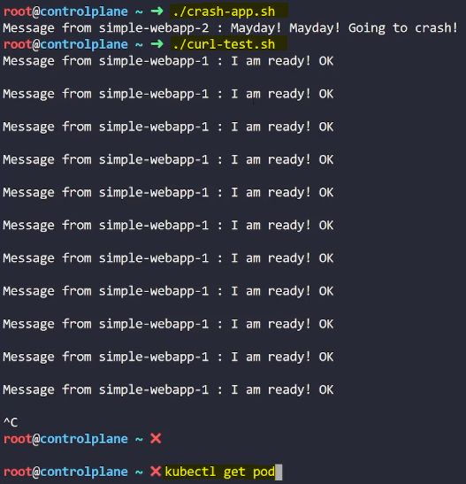
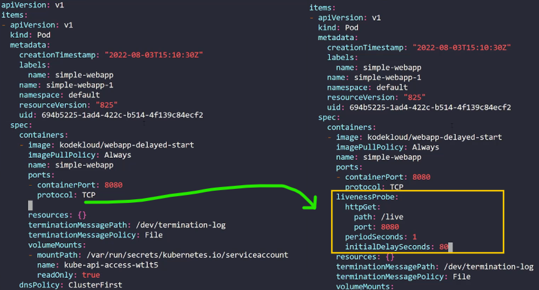

- [Observability](#observability)
  - [Readiness and Liveness Probes](#readiness-and-liveness-probes)
    - [Beginner-Friendly Revision Notes on Observability in Kubernetes](#beginner-friendly-revision-notes-on-observability-in-kubernetes)
    - [Pod Lifecycle Recap](#pod-lifecycle-recap)
    - [Readiness Probes](#readiness-probes)
    - [Importance of Readiness Probes](#importance-of-readiness-probes)
    - [Summary](#summary)
  - [Liveness Probes](#liveness-probes)
    - [Introduction](#introduction)
    - [Basics](#basics)
    - [Importance of Liveness Probes](#importance-of-liveness-probes)
    - [Configuring Liveness Probes](#configuring-liveness-probes)
    - [Summary](#summary-1)
  - [Demo: Readiness and Liveness Probes](#demo-readiness-and-liveness-probes)
    - [Inspecting Pods and Services](#inspecting-pods-and-services)
    - [Running the Test Script](#running-the-test-script)
    - [Scaling Up the Application](#scaling-up-the-application)
    - [Setting Up a Readiness Probe](#setting-up-a-readiness-probe)
    - [Verifying Readiness Probe](#verifying-readiness-probe)
    - [Handling Pod Crashes](#handling-pod-crashes)
    - [Handling Pod Freezes](#handling-pod-freezes)
    - [Adding Liveness Probes](#adding-liveness-probes)
    - [Verifying Liveness Probes](#verifying-liveness-probes)
    - [Summary](#summary-2)
  - [Container Logging](#container-logging)
    - [Introduction](#introduction-1)
    - [Logging in Docker](#logging-in-docker)
    - [Logging in Kubernetes](#logging-in-kubernetes)
    - [Summary](#summary-3)
  - [Demo: Container Logging](#demo-container-logging)
    - [Introduction](#introduction-2)
    - [Inspecting the Deployed Pod](#inspecting-the-deployed-pod)
    - [Identifying User Issues](#identifying-user-issues)
    - [Inspecting Logs for a New Application](#inspecting-logs-for-a-new-application)
    - [Summary](#summary-4)
  - [Monitor and Debug Applications](#monitor-and-debug-applications)
    - [Introduction](#introduction-3)
    - [What to Monitor](#what-to-monitor)
    - [Monitoring Solutions](#monitoring-solutions)
    - [Metrics Server](#metrics-server)
    - [How Metrics are Generated](#how-metrics-are-generated)
    - [Setting Up Metrics Server](#setting-up-metrics-server)
    - [Viewing Performance Metrics](#viewing-performance-metrics)
    - [Summary](#summary-5)
  - [Demo: Monitoring](#demo-monitoring)
    - [Inspecting Deployed Pods](#inspecting-deployed-pods)
    - [Deploying the Metrics Server](#deploying-the-metrics-server)
    - [Viewing Node Metrics](#viewing-node-metrics)
    - [Viewing Pod Metrics](#viewing-pod-metrics)
    - [Summary](#summary-6)

<br>

<hr style="height:4px;background:black">

<br>

# Observability

## Readiness and Liveness Probes

### Beginner-Friendly Revision Notes on Observability in Kubernetes
* `Observability`: Involves monitoring the state of applications and infrastructure in Kubernetes.
* `Key Concepts`: Readiness and liveness probes, logging, and monitoring.

<br>

### Pod Lifecycle Recap
1. `Pod Status`: Indicates the current state of a pod.

`States`:
* **Pending**: Pod is being scheduled.
* **ContainerCreating**: Images are being pulled and containers are starting.
* **Running**: All containers are running.
* **Succeeded**: Pod has completed successfully.
* **Failed**: Pod has terminated with an error.
* **Command**: View pod status with `kubectl get pods`.

<br>

2. `Pod Conditions`: Array of true or false values indicating specific states of a pod.

`Conditions`:
* **PodScheduled**: Pod has been scheduled on a node.
* **Initialized**: Pod has been initialized.
* **ContainersReady**: All containers in the pod are ready.
* **Ready**: Pod is ready to accept traffic.
* **Command**: View pod conditions with `kubectl describe pod`.

<bR>

### Readiness Probes
* `Purpose`: Ensure that a pod is ready to accept traffic before routing it.

<br>

`Types of Probes`:
* **HTTP GET**: Checks if an HTTP endpoint is responsive.
* **TCP Socket**: Checks if a TCP socket is open.
* **Exec Command**: Runs a command inside the container to check readiness.

<br>

`Configuration`:
* **Pod Definition File**: Add a readinessProbe field.

**Example**:


<br>

`Additional Options`:
* **Initial Delay**: Add a delay before the first probe.
* **Period Seconds**: Specify how often to perform the probe.
* **Failure Threshold**: Number of failed attempts before marking the pod as not ready.

<br>

### Importance of Readiness Probes
* `Prevent Premature Traffic Routing`: Ensures that **traffic** is only **routed to pods** that are fully **ready**.
* `Multi-Pod Setup`: In a deployment with **multiple pods**, readiness probes **prevent traffic** from being **routed to new pods until they are ready**, avoiding service disruption.

<br>

### Summary
* `Observability`: Involves monitoring the state of applications and infrastructure.
* `Pod Lifecycle`: Includes various states and conditions that indicate the status of a pod.
* `Readiness Probes`: Ensure that a pod is ready to accept traffic before routing it.
* `Configuration`: Use the readinessProbe field in the pod definition file to configure probes.
* `Importance`: Prevents premature traffic routing and ensures smooth operation in multi-pod setups.

<br>

<hr style="height:4px;background:black">

<br>

## Liveness Probes

### Introduction
* `Liveness Probes`: Used to check if an **application inside a container** is **healthy** and **running as expected**.

<br>

### Basics
`Docker Example`:
* Running an **NGINX image** using Docker.
* If the **web server crashes**, the **container exits** and stays dead until **manually restarted**.
* **Command**: View container status with `docker ps`.

<br>

`Kubernetes Orchestration`:
* Kubernetes **automatically attempts** to **restart** the **container** if the **application crashes**.
* **Command**: View restart count with `kubectl get pods`.

<br>

### Importance of Liveness Probes
`Detecting Unhealthy Applications`:
* If an application is stuck in an **infinite loop**, the container may appear to be up, but the application is not serving users.
* Liveness probes help **detect** such scenarios and **restart the container** if necessary.

<br>

### Configuring Liveness Probes
* `Pod Definition File`: Add a livenessProbe field to configure the probe.

**Example**:


<br>

`Types of Probes`:
* **HTTP GET**: Checks if an HTTP endpoint is **responsive**.
* **TCP Socket**: Checks if a TCP socket is **open**.
* **Exec Command**: Runs a command inside the container to **check liveness**.

<br>

`Additional Options`:
* **Initial Delay**: Delay before the first probe is run.
* **Period Seconds**: Frequency of the probe.
* **Success and Failure Thresholds**: Number of successful or failed attempts before marking the container as healthy or unhealthy.

<br>

### Summary
* `Liveness Probes`: Ensure that an application inside a container is healthy and running.
* `Configuration`: Use the livenessProbe field in the pod definition file to configure probes.
* `Types of Probes`: HTTP GET, TCP Socket, and Exec Command.
* `Importance`: Detects unhealthy applications and restarts containers if necessary.

<br>

<hr style="height:4px;background:black">

<br>

## Demo: Readiness and Liveness Probes

### Inspecting Pods and Services
* **Task**: Inspect the deployed application.

**Commands**:

* List all pods: `kubectl get pod`
* List all services: `kubectl get service`

<br>


<br>

### Running the Test Script
* **Task**: Run the provided test script to send requests to the web application.

**Command**:

* Run the script: `./curl-test.sh`

<br>


<br>

### Scaling Up the Application
* **Task**: Inspect the new pod added to scale up the application.

**Commands**:

* List all pods: `kubectl get pod`
* Run the test script again: `./curl-test.sh`

<br>


<br>

### Setting Up a Readiness Probe
* **Task**: Set up a readiness probe for simple-webapp-2.

`Steps`:

1. `Get the current configuration`:

```bash
kubectl get pod simple-webapp-2 -o yaml > webapp2.yaml
```

<br>

2. `Delete the current pod`:

```bash
kubectl delete pod simple-webapp-2
```

<br>


<br>

3. `Edit the webapp2.yaml file to add the readiness probe`:


<br>

4. `Apply the updated configuration`:

```bash
kubectl apply -f webapp2.yaml
```

<br>

### Verifying Readiness Probe
* **Task**: Run the test script again to verify the readiness probe.

**Command**:

* Run the script: `./curl-test.sh`

<br>


<br>

### Handling Pod Crashes
* **Task**: Run a script to crash one of the pods and observe the behavior.

**Commands**:

* Run the crash script: `./crash-app.sh`
* Run the test script: `./curl-test.sh`
* Check the pod status: `kubectl get pod`

<br>




<br>

### Handling Pod Freezes
* **Task**: Run a script to freeze one of the pods and observe the behavior.

**Commands**:

* Run the freeze script: `./freeze-app.sh`
* Run the test script: `./curl-test.sh`

<br>


<br>

### Adding Liveness Probes
* **Task**: Update both pods to include a liveness probe.

`Steps`:

1. `Get the current configuration`:

```bash
kubectl get pod -o yaml > webapp.yaml
```

<br>

2. `Delete all pods`:

```bash
kubectl delete pod --all
```

<br>


<br>

3. `Edit the webapp.yaml file to add the liveness probe`:

<br>



<br>

> Scroll down: Copy box and place further down:

<br>


<br>

4. `Apply the updated configuration`:

```bash
kubectl apply -f webapp.yaml
```

<br>

### Verifying Liveness Probes
* **Task**: Run the freeze script and test script again to verify the liveness probes.

**Commands**:

* Run the freeze script: `./freeze-app.sh`
* Run the test script: `./curl-test.sh`

<br>


<br>

### Summary
* `Readiness Probes`: Ensure that a pod is ready to accept traffic before routing it.
* `Liveness Probes`: Ensure that an application inside a container is healthy and running.
* `Commands and Configuration`: Use kubectl commands to inspect, update, and verify pods, and configure readiness and liveness probes in the pod definition file.

<br>

<hr style="height:4px;background:black">

<br>

## Container Logging

### Introduction
* `Logging in Kubernetes`: Understanding how to **view** and **manage logs** for applications running in Kubernetes.

<bR>

### Logging in Docker
`Running a Docker Container`:
   * **Example**: Running a Docker container called event-simulator that **generates random events**.
   * **Detached Mode**: Running the container in the **background** using the `-d` option.

`Viewing Logs`:
* **Command**: View logs with `docker logs <container-id>`.
* **Live Log Trail**: Use the `-f` option to stream live logs.

<br>

### Logging in Kubernetes
1. `Creating a Pod`:
   * Use a pod definition file to create a pod with the same Docker image.

**Example**:


<br>

2. `Viewing Logs`:
   * **Command**: View logs with `kubectl logs <pod-name>`.
   * **Live Log Trail**: Use the `-f` option to stream live logs.

<br>


<br>

3. `Multiple Containers in a Pod`:
   * Pods can have multiple containers.
     * **Example**: Adding an additional container called image-processor to the pod definition file.

**Example**:


<br>

4. `Viewing Logs for Specific Containers`:
   * Command: Specify the container name to view logs for a specific container.

```bash
kubectl logs <pod-name> -c <container-name>
```


<br>

### Summary
* `Logging in Docker`: Use docker logs to view logs and `-f` to stream live logs.
* `Logging in Kubernetes`: Use kubectl logs to view logs and `-f` to stream live logs.
* `Multiple Containers`: Specify the container name when viewing logs for pods with multiple containers.

<br>

<hr style="height:4px;background:black">

<br>

## Demo: Container Logging

### Introduction
* `Objective`: Review applications and their logs to identify issues and gather useful information.

<br>

### Inspecting the Deployed Pod
* `Task`: Inspect the deployed pod and wait for it to start.

**Command**:

* List all pods: `kubectl get pods`
* **Result**: Ensure the pod is running.

<br>


<br>

### Identifying User Issues
* `Task`: Identify the **cause** of user five's issue by inspecting the logs.

**Command**:

* View logs of the application: `kubectl logs <pod-name>`
* **Result**: Logs indicate that user five's account is locked due to too many failed login attempts.

<br>


<br>

### Inspecting Logs for a New Application
* `Task`: Inspect logs for **webapp-2** to identify user issues while purchasing an item.

**Commands**:

* View logs of the pod: `kubectl logs <pod-name>`

> **Note**: If the pod has multiple containers, specify the container name.

```bash
kubectl logs <pod-name> -c <container-name>
```

<br>


<br>

* **Result**: Logs indicate that user 30's order failed because the item is out of stock.

<br>


<br>

### Summary
* `Inspecting Pods`: Use kubectl get pods to ensure the pod is running.
* `Viewing Logs`: Use kubectl logs to view logs and specify the container name if the pod has multiple containers.
* `Identifying Issues`: Analyze logs to identify the cause of user issues, such as account lockouts or out-of-stock items.

<br>

<hr style="height:4px;background:black">

<br>

## Monitor and Debug Applications

### Introduction
* `Monitoring Kubernetes`: Understanding how to **monitor resource consumption** and **performance metrics** in a Kubernetes cluster.

<br>

### What to Monitor
`Node Level Metrics`:
* Number of nodes in the cluster.
* Health status of nodes.
* **Performance metrics**: CPU, memory, network, and disk utilization.

`Pod Level Metrics`:
* Number of pods.
* **Performance metrics**: CPU and memory consumption for each pod.

<br>

### Monitoring Solutions
`Open Source Solutions`:
* Metrics Server
* Prometheus
* The Elastic Stack

`Proprietary Solutions`:
* Datadog
* Dynatrace

<bR>

### Metrics Server
* `Purpose`: **Retrieves metrics** from Kubernetes **nodes** and **pods**, aggregates them, and **stores** them in **memory**.
* `Limitations`: Metrics Server is an **in-memory solution** and does **not store metrics on disk**, so **historical performance** data is **not available**.

<br>

### How Metrics are Generated
* `Kubelet`: An agent running on each **node responsible** for **receiving instructions** from the **Kubernetes API master** server and **running pods**.
* `cAdvisor` (Container Advisor): A **sub-component** of Kubelet **responsible** for **retrieving performance metrics** from **pods** and **exposing** them through the **Kubelet API**.

<br>

### Setting Up Metrics Server
1. `Minikube`:

**Command**:

```bash
minikube addons enable metrics-server
```

<Br>

2. `Other Environments`:
   * Clone the Metrics Server deployment files from the GitHub repository.
   * Deploy the required components using the `kubectl create` command.

### Viewing Performance Metrics
1. `Node Metrics`:

**Command**:

```bash
kubectl top node
```

* **Example Output**: Shows CPU and memory consumption of each node.

<br>

2. `Pod Metrics`:

**Command**:

```bash
kubectl top pod
```

<br>

### Summary
* `Monitoring Kubernetes`: Involves tracking node and pod level metrics to ensure the health and performance of the cluster.
* `Metrics Server`: An in-memory solution for retrieving and aggregating metrics from nodes and pods.
* `Commands`: Use kubectl top node and kubectl top pod to view performance metrics.

<br>

<hr style="height:4px;background:black">

<br>

## Demo: Monitoring

### Inspecting Deployed Pods
* `Task`: Inspect the deployed pods running workloads.

**Command**:

* List all pods: `kubectl get pods`
* **Result**: Three pods (elephant, lion, and rabbit) are running.

<br>


<br>

### Deploying the Metrics Server
* `Task`: Deploy the Metrics Server to monitor resource consumption.

`Steps`:

1. Clone the Git repository with the Metrics Server settings.
   * **Command**: `kubectl create -f .`
   * **Result**: Deploys the required components for the Metrics Server.

> **Note**: Do not use these settings for production environments. Refer to the official documentation for production use.

<br>


<br>

### Viewing Node Metrics
1. `Task`: Identify the node that consumes the most CPU.

**Command**:

* View node metrics: `kubectl top node`
* **Result**: The control plane node consumes the most CPU (470 millicores).

<br>


<br>

2. `Task`: Identify the node that consumes the most memory.

**Command**:

* View node metrics: `kubectl top node`
* **Result**: The control plane node consumes the most memory.

<br>

### Viewing Pod Metrics
* `Task`: Identify the pod that consumes the most memory.

**Command**:

* View pod metrics: `kubectl top pod`
* **Result**: The rabbit pod consumes the most memory.

<br>


<br>

2. `Task`: Identify the pod that consumes the least CPU.

**Command**:

* View pod metrics: `kubectl top pod`
* **Result**: The lion pod consumes the least CPU (1 millicore).

<bR>

### Summary
* `Inspecting Pods`: Use kubectl get pods to ensure the pods are running.
* `Deploying Metrics Server`: Use `kubectl create -f .` to deploy the Metrics Server components.
* `Viewing Metrics`: Use `kubectl top node` and `kubectl top pod` to view resource consumption metrics for nodes and pods.

<br>

<hr style="height:4px;background:black">

<br>
