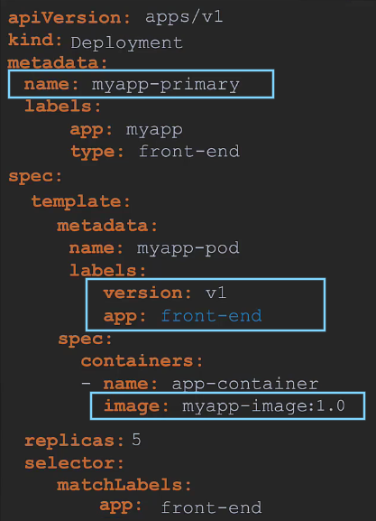
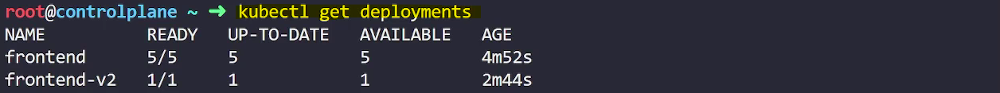
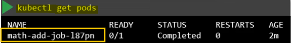

- [Pod Design](#pod-design)
  - [Labels, Selectors and Annotations](#labels-selectors-and-annotations)
    - [Introduction](#introduction)
    - [Understanding Labels and Selectors](#understanding-labels-and-selectors)
    - [Use Cases](#use-cases)
    - [Specifying Labels in Kubernetes](#specifying-labels-in-kubernetes)
    - [Connecting Objects with Labels and Selectors](#connecting-objects-with-labels-and-selectors)
    - [Annotations](#annotations)
    - [Summary](#summary)
  - [Demo: Labels, Selectors and Annotations](#demo-labels-selectors-and-annotations)
    - [Inspecting Deployed Pods](#inspecting-deployed-pods)
    - [Counting Pods](#counting-pods)
    - [Identifying Pods in a Specific Business Unit](#identifying-pods-in-a-specific-business-unit)
    - [Counting All Objects in a Specific Environment](#counting-all-objects-in-a-specific-environment)
    - [Identifying a Specific Pod](#identifying-a-specific-pod)
    - [Fixing ReplicaSet Definition](#fixing-replicaset-definition)
    - [Fix the selector to match the template labels in the ReplicaSet definition file.](#fix-the-selector-to-match-the-template-labels-in-the-replicaset-definition-file)
    - [Summary](#summary-1)
  - [Rolling Updates and Rollbacks in Deployments](#rolling-updates-and-rollbacks-in-deployments)
    - [Introduction](#introduction-1)
    - [Rollouts and Versioning](#rollouts-and-versioning)
    - [Commands](#commands)
    - [Deployment Strategies](#deployment-strategies)
    - [Updating Deployments](#updating-deployments)
    - [Viewing Deployment Details](#viewing-deployment-details)
    - [Upgrading Under the Hood](#upgrading-under-the-hood)
    - [Rolling Back Updates](#rolling-back-updates)
    - [Summary of Commands](#summary-of-commands)
  - [Updating a Deployment](#updating-a-deployment)
    - [Creating a Deployment and Checking Rollout Status](#creating-a-deployment-and-checking-rollout-status)
    - [Using the --revision Flag](#using-the---revision-flag)
    - [Using the --record Flag](#using-the---record-flag)
    - [Undoing a Change](#undoing-a-change)
    - [Summary of Commands](#summary-of-commands-1)
  - [Deployments: Commands](#deployments-commands)
    - [Creating a Deployment and Checking Rollout Status](#creating-a-deployment-and-checking-rollout-status-1)
    - [Recording Changes](#recording-changes)
    - [Updating the Deployment](#updating-the-deployment)
    - [Viewing Deployment Details](#viewing-deployment-details-1)
    - [Rolling Back Updates](#rolling-back-updates-1)
    - [Summary of Commands](#summary-of-commands-2)
    - [Viewing Deployment Details](#viewing-deployment-details-2)
    - [Rolling Back Changes](#rolling-back-changes)
    - [Simulating an Error](#simulating-an-error)
    - [Rolling Back from an Error](#rolling-back-from-an-error)
    - [Summary of Commands](#summary-of-commands-3)
  - [Demo: Rolling Updates](#demo-rolling-updates)
    - [Introduction](#introduction-2)
    - [Inspecting Deployed Pods and Services](#inspecting-deployed-pods-and-services)
    - [Running Tests](#running-tests)
    - [Inspecting Deployment Details](#inspecting-deployment-details)
    - [Updating the Application](#updating-the-application)
    - [Deployment Strategy Settings](#deployment-strategy-settings)
    - [Changing Deployment Strategy](#changing-deployment-strategy)
    - [Summary](#summary-2)
  - [Deployment Strategy - Blue green](#deployment-strategy---blue-green)
    - [Introduction](#introduction-3)
    - [Recreate Strategy](#recreate-strategy)
    - [Rolling Update Strategy](#rolling-update-strategy)
    - [Additional Deployment Strategies](#additional-deployment-strategies)
      - [Blue-Green Deployment](#blue-green-deployment)
      - [Canary Updates](#canary-updates)
    - [Summary](#summary-3)
  - [Deployment Strategy - Canary](#deployment-strategy---canary)
    - [Introduction](#introduction-4)
    - [How Canary Updates Work](#how-canary-updates-work)
    - [Implementation Using Kubernetes Primitives](#implementation-using-kubernetes-primitives)
    - [Example Code](#example-code)
    - [Caveats](#caveats)
  - [Demo: Deployment Strategies](#demo-deployment-strategies)
    - [Inspecting Deployment Strategy](#inspecting-deployment-strategy)
    - [Identifying Service](#identifying-service)
    - [Selector Used by Service](#selector-used-by-service)
    - [Viewing Web Application](#viewing-web-application)
    - [Configuring Canary Deployment](#configuring-canary-deployment)
    - [Redirecting All Traffic to New Version](#redirecting-all-traffic-to-new-version)
  - [Jobs](#jobs)
    - [Introduction](#introduction-5)
    - [Types of Workloads](#types-of-workloads)
    - [Docker Example](#docker-example)
    - [Kubernetes Example](#kubernetes-example)
    - [Creating a Job](#creating-a-job)
    - [Running Multiple Pods](#running-multiple-pods)
    - [Handling Pod Failures](#handling-pod-failures)
  - [CronJobs](#cronjobs)
    - [Introduction](#introduction-6)
    - [Use Case](#use-case)
    - [Creating a CronJob](#creating-a-cronjob)
    - [Summary](#summary-4)
  - [Demo: Jobs \& CronJobs](#demo-jobs--cronjobs)
    - [Deploying a Pod](#deploying-a-pod)
    - [Creating a Job](#creating-a-job-1)
    - [Updating the Job for Multiple Successes](#updating-the-job-for-multiple-successes)
    - [Running Jobs in Parallel](#running-jobs-in-parallel)
    - [Creating a CronJob](#creating-a-cronjob-1)

<br>

<hr style="height:4px;background:black">

<br>

# Pod Design

## Labels, Selectors and Annotations

### Introduction
* `Labels and Selectors`: Standard method to **group** and **filter objects** in Kubernetes.

**For example**:

<br>


<br>

### Understanding Labels and Selectors
* `Labels`: **Properties** attached to each item (e.g., class, kind, color).
* `Selectors`: Help **filter items** based on **labels** (e.g., class=mammal, color=green).

<br>

### Use Cases
`Everyday Examples`:
* Keywords on YouTube videos or blogs.
* Filters in online stores.

`Kubernetes Objects`:
* Pods, services, replica sets, deployments, etc.
* Group and filter objects by type, application, functionality, etc.

<br>

### Specifying Labels in Kubernetes
1. `Pod Definition File`:
* Add labels under the metadata section.

**Example**:


<br>

2. `Selecting Pods with Labels`:

**Command**:

```bash
kubectl get pods --selector app=app1
```

<br>


<br>

### Connecting Objects with Labels and Selectors
1. `Replica Sets`:
   * Labels defined under the template section are for the pods.
   * Labels at the top are for the replica set itself.

**Example**:


<br>

2. `Services`:
   * Use **selectors** in the **service** definition file to match labels on the pods.

**Example**:


<br>

### Annotations
* `Purpose`: Record **additional details** for **informational purposes** (e.g., tool details, contact information).

**Example**:


<br>

### Summary
* `Labels and Selectors`: Group and filter objects in Kubernetes.
* `Specifying Labels`: Add labels in the pod definition file under the metadata section.
* `Connecting Objects`: Use labels and selectors to connect replica sets and services to pods.
* `Annotations`: Record additional details for informational purposes.

<br>

<hr style="height:4px;background:black">

<br>

## Demo: Labels, Selectors and Annotations

### Inspecting Deployed Pods
* `Task`: Identify the number of pods in the **dev** environment.

**Commands**:

1. List all pods: `kubectl get pods`
2. Filter pods by environment label:
  * `kubectl get pods --selector ENV=dev`
  * **Result**: There are 7 pods in the dev environment.

<br>


<br>

### Counting Pods
* `Task`: Count the number of pods in the **dev** environment.

Commands:

`Use word count to count lines`:

```bash
kubectl get pods --selector ENV=dev --no-headers | wc -l
```

* **Result**: There are 7 pods.

<br>

> This command performs the following actions:
> * `kubectl get pods --selector ENV=dev`: This part of the command **lists all pods** in the Kubernetes cluster that have the **label ENV set to dev**. 
>   * The `--selector` option is used to filter the pods based on the specified label.
> * `--no-headers`: This option removes the header line from the output, which typically includes column names like "NAME", "READY", "STATUS", etc.
> * `| wc -l`: This part of the command pipes the output of the previous command to the wc -l command, which counts the number of lines in the output.

<br>

### Identifying Pods in a Specific Business Unit
* `Task`: Identify the number of pods in the **finance business unit**.

**Commands**:

`Filter pods by business unit label`:

```bash
kubectl get pods --selector BU=finance --no-headers | wc -l
```

* **Result**: There are 6 pods in the finance business unit.

<br>

### Counting All Objects in a Specific Environment
* `Task`: Identify the number of objects in the prod environment, including pods, ReplicaSets, and other objects.

**Commands**:

1. `List all objects in the prod environment`:

```bash
kubectl get all --selector ENV=prod
```

<br>

2. `Use word count to count lines`:

```bash
kubectl get all --selector ENV=prod --no-headers | wc -l
```

* **Result**: There are 7 objects in the prod environment.

<br>


<br>

### Identifying a Specific Pod
* `Task`: Identify the pod in the prod environment, finance business unit, and front end tier.

**Commands**:

`Filter pods by multiple labels`:

```bash
kubectl get pods --selector ENV=prod,BU=finance,tier=frontend
```

* **Result**: The pod with the labels ENV=prod, BU=finance, and tier=frontend is identified.

<br>


<br>

### Fixing ReplicaSet Definition
* `Task`: Create a **ReplicaSet** and fix any issues with the definition file.

`Steps`:

`Attempt to create the ReplicaSet`:

```bash
kubectl create -f replicaset-definition.yaml
```

* **Error**: Invalid value **selector** does **not match** template **labels**.

<br>


<br>

### Fix the selector to match the template labels in the ReplicaSet definition file.


**Example**:


<br>

`Create the ReplicaSet`:

```bash
kubectl create -f replicaset-definition.yaml
```

* **Result**: The ReplicaSet is created successfully.

<br>

### Summary
* `Inspecting Pods`: Use kubectl get pods to list and filter pods by labels.
* `Counting Pods and Objects`: Use word count to count lines and `--no-headers` to exclude headers.
* `Identifying Specific Pods`: Use multiple label selectors to filter pods.
* `Fixing ReplicaSet Definition`: Ensure the selector matches the template labels in the ReplicaSet definition file.

<br>

<hr style="height:4px;background:black">

<br>

## Rolling Updates and Rollbacks in Deployments

### Introduction
* `Updates and Rollbacks`: Managing application versions and ensuring smooth transitions between them.

<br>

### Rollouts and Versioning
* `Initial Deployment`: Triggers a rollout and **creates a deployment revision** (Revision 1).
* `Upgrading Application`: Triggers a new rollout and creates a **new deployment revision** (Revision 2).
* `Tracking Changes`: Allows **rolling back** to **previous versions** if necessary.

<br>

### Commands
* Check Rollout Status: `kubectl rollout status <deployment-name>`
* View Rollout History: `kubectl rollout history <deployment-name>`

<bR>


<br>

### Deployment Strategies
1. `Recreate Strategy`:
   * **Process**: Destroy all instances and then create new ones.
   * **Issue**: Application downtime during the transition.
     * **Example**: Scale down old instances to 0, then scale up new instances to 5.

<br>


<br>

2. `Rolling Update Strategy`:
   * **Process**: Update instances one by one.
   * **Benefit**: No application downtime, seamless upgrade.
   * **Default Strategy**: If no strategy is specified, rolling update is used.

<br>


<br>

### Updating Deployments
`Methods`:

1. Modify Deployment Definition File:
   * Make changes to the file (e.g., update container version, labels, replicas).
   * Apply changes: `kubectl apply -f <deployment-definition-file>`

<br>


<bR>

2. Use kubectl set image Command:
   * Update the image of the application:

```bash
kubectl set image deployment/<deployment-name> <container-name>=<new-image>
```

> **Note**: Ensure the deployment definition file is updated accordingly.

<br>


<br>

### Viewing Deployment Details
**Command**:

```bash
kubectl describe deployment <deployment-name>
```

<br>

### Upgrading Under the Hood
`Replica Sets`:
* **Initial Deployment**: Creates a replica set and required pods.
* **Upgrade**: Creates a new replica set and deploys new containers while scaling down old pods.

**View Replica Sets**:

```bash
kubectl get replicasets
```

<br>


<br>

### Rolling Back Updates

**Rollback Command**:

```bash
kubectl rollout undo <deployment-name>
```

<br>

* **Effect**: Destroys new pods and brings up old pods in the previous replica set.

<br>


<br>

### Summary of Commands

* Create Deployment: `kubectl create -f <deployment-definition-file>`
* List Deployments: `kubectl get deployments`
* Update Deployment:

```bash
kubectl apply -f <deployment-definition-file>
kubectl set image deployment/<deployment-name> <container-name>=<new-image>
```

* Check Rollout Status: `kubectl rollout status <deployment-name>`
* Rollback Deployment: `kubectl rollout undo <deployment-name>`

<br>

<hr style="height:4px;background:black">

<br>

## Updating a Deployment

### Creating a Deployment and Checking Rollout Status
1. `Create a Deployment`:
   * **Command**: kubectl create deployment nginx --image=nginx:1.16
   * **Result**: Deployment nginx is created.

<br>

2. `Check Rollout Status`:
   * **Command**: kubectl rollout status deployment nginx
   * **Result**: Displays the rollout status of the deployment.

<br>

3. `Check Rollout History`:
   * **Command**: kubectl rollout history deployment nginx
   * **Result**: Shows the revisions and history of the deployment.

<br>

### Using the --revision Flag
1. `Check Status of a Specific Revision`:
   * **Command**: kubectl rollout history deployment nginx --revision=1
   * **Result**: Displays details of revision 1, including labels and container image.

<br>

### Using the --record Flag
1. `Update Deployment with --record Flag`:
   * **Command**: kubectl set image deployment nginx nginx=nginx:1.17 --record
   * **Result**: Updates the image and records the change-cause.

2. `Check Rollout History with Recorded Change-Cause`:
   * **Command**: kubectl rollout history deployment nginx
   * **Result**: Shows the recorded change-cause for each revision.

3. `Edit Deployment with --record Flag`:
   * **Command**: kubectl edit deployments nginx --record
   * **Result**: Edits the deployment and records the change-cause.

4. `Check Rollout History for Specific Revision`:
   * **Command**: kubectl rollout history deployment nginx --revision=3
   * **Result**: Displays details of revision 3, including labels, annotations, and container image.

<br>

### Undoing a Change
1. `Rollback to Previous Revision`:
   * **Command**: kubectl rollout undo deployment nginx
   * **Result**: Rolls back to the previous version of the deployment.

2. `Rollback to Specific Revision`:
   * **Command**: kubectl rollout undo deployment nginx --to-revision=1
   * **Result**: Rolls back to revision 1 with the image nginx:1.16.

<br>

### Summary of Commands
* Create Deployment: `kubectl create deployment nginx --image=nginx:1.16`
* Check Rollout Status: `kubectl rollout status deployment nginx`
* Check Rollout History: `kubectl rollout history deployment nginx`
* Update Deployment with `--record Flag: kubectl set image deployment nginx nginx=nginx:1.17 --record`
* Edit Deployment with --record Flag: `kubectl edit deployments nginx --record`
* Rollback Deployment: `kubectl rollout undo deployment nginx`
* Rollback to Specific Revision: `kubectl rollout undo deployment nginx --to-revision=1`

<br>

<hr style="height:4px;background:black">

<br>

## Deployments: Commands

### Creating a Deployment and Checking Rollout Status
1. `Create a Deployment`:
   * **Command**: `kubectl create deployment myapp` --image=nginx
   * **Result**: Deployment myapp is created.

2. `Check Rollout Status`:
   * **Command**: `kubectl rollout status deployment myapp`
   * **Result**: Displays the rollout status of the deployment, showing the progress of pod deployment.

3. `Check Rollout History`:
   * **Command**: `kubectl rollout history deployment myapp`
   * **Result**: Shows the revisions and history of the deployment.

<br>

### Recording Changes
1. `Create Deployment with --record Flag`:
   * **Command**: kubectl create deployment myapp --image=nginx --record
   * **Result**: Deployment is created, and the change-cause is recorded.

2. `Check Rollout History with Recorded Change-Cause`:
   * **Command**: kubectl rollout history deployment myapp
   * **Result**: Shows the recorded change-cause for each revision.

<br>

### Updating the Deployment
1. `Update Deployment Image`:
   * **Command**: kubectl set image deployment myapp myapp=nginx:1.12 --record
   * **Result**: Updates the image and records the change-cause.

2. `Apply Changes to Deployment`:
   * **Command**: kubectl apply -f deployment-definition.yaml
   * **Result**: Applies the changes and triggers a new rollout.

3. `Check Rollout Status`:
   * **Command**: kubectl rollout status deployment myapp
   * **Result**: Displays the rollout status of the deployment.

4. `Check Rollout History for Specific Revision`:
   * **Command**: kubectl rollout history deployment myapp --revision=2
   * **Result**: Displays details of revision 2, including labels and container image.

<br>

### Viewing Deployment Details
1. `Describe Deployment`:
   * **Command**: kubectl describe deployment myapp
   * **Result**: Displays detailed information about the deployment, including events and image details.

<br>

### Rolling Back Updates
1. `Rollback to Previous Revision`:
   * **Command**: kubectl rollout undo deployment myapp
   * **Result**: Rolls back to the previous version of the deployment.

2. `Rollback to Specific Revision`:
   * **Command**: kubectl rollout undo deployment myapp --to-revision=1
   * **Result**: Rolls back to revision 1 with the image nginx:1.16.

<br>

### Summary of Commands
* Create Deployment: `kubectl create deployment myapp --image=nginx`
* Check Rollout Status: `kubectl rollout status deployment myapp`
* Check Rollout History: `kubectl rollout history deployment myapp`
* Update Deployment with --record Flag: `kubectl set image deployment myapp myapp=nginx:1.12 --record`
* Apply Changes to Deployment: `kubectl apply -f deployment-definition.yaml`
* Rollback Deployment: `kubectl rollout undo deployment myapp`
* Rollback to Specific Revision: `kubectl rollout undo deployment myapp --to-revision=1`

<br>

### Viewing Deployment Details
1. `Describe Deployment`:
   * **Command**: `kubectl describe deployment myapp`
   * **Result**: Displays detailed information about the deployment, including the updated image nginx:1.12-pull.

<br>

### Rolling Back Changes
1. `Rollback to Previous Revision`:
   * **Scenario**: Pretend there is an issue with the nginx:1.12-pull image.
   * **Command**: `kubectl rollout undo deployment myapp`
   * **Result**: Rolls back to the previous version, creating a new revision (revision 4) that reverts to the configuration of revision 2.

<br>

2. `Check Rollout History`:
   * **Command**: `kubectl rollout history deployment myapp`
   * **Result**: Shows the new revision (revision 4) and the rollback to the previous configuration.

<br>

3. `Describe Deployment`:
   * **Command**: `kubectl describe deployment myapp`
   * **Result**: Confirms the image is reverted to nginx:1.12.

<br>

### Simulating an Error
1. `Update Deployment with Non-Existent Image`:
   * **Scenario**: Simulate an error by using a non-existent image nginx:1.5-ERL.
   * **Command**: `kubectl apply -f deployment-definition.yaml --record`
   * **Result**: Applies the changes and triggers a rollout.

<br>

2. `Check Rollout Status`:
   * **Command**: `kubectl rollout status deployment myapp`
   * **Result**: Rollout is stuck at 3 out of 6 new replicas have been updated.

<br>

3. `Check Deployment Status`:
   * **Command**: `kubectl get deployment myapp`
   * **Result**: Shows the deployment is in an abnormal state with desired=6, current=8, and up-to-date=3.

<br>

4. `Check Pod Status`:
   * **Command**: `kubectl get pods`
   * **Result**: Shows 5 old version pods and 3 new version pods with ImagePullBackOff status.

<br>

### Rolling Back from an Error
1. `Rollback to Previous Revision`:
   * **Command**: `kubectl rollout undo deployment myapp`
   * **Result**: Rolls back to the previous working version, creating a new revision (revision 6).

<br>

2. `Check Rollout History`:
   * **Command**: `kubectl rollout history deployment myapp`
   * **Result**: Shows the new revision (revision 6) and the rollback to the previous configuration.

<br>

3. `Describe Deployment`:
   * **Command**: `kubectl describe deployment myapp`
   * **Result**: Confirms the image is reverted to nginx:1.12.

<br>

4. `Check Pod Status`:
   * **Command**: `kubectl get pods`
   * **Result**: Shows all 6 pods are in a running state.

<br>

### Summary of Commands
* Create Deployment: `kubectl create deployment myapp --image=nginx`
* Check Rollout Status: `kubectl rollout status deployment myapp`
* Check Rollout History: `kubectl rollout history deployment myapp`
* Update Deployment with `--record Flag: kubectl set image deployment myapp myapp=nginx:1.12 --record`
* Apply Changes to Deployment: `kubectl apply -f deployment-definition.yaml`
* Rollback Deployment: `kubectl rollout undo deployment myapp`
* Rollback to Specific Revision: `kubectl rollout undo deployment myapp --to-revision=1`

<br>

<hr style="height:4px;background:black">

<br>

## Demo: Rolling Updates

### Introduction
* `Rolling Updates and Rollbacks`: Managing application updates and ensuring smooth transitions without downtime.

<br>

### Inspecting Deployed Pods and Services
1. `Inspect Pods`:
   * **Command**: `kubectl get pods`
   * **Result**: Lists the front-end pods deployed by the front-end deployment.

2. `View Application`:
   * **Action**: Click the provided link to view the application in a new window.
   * **Result**: Displays the application with the message "Hello, front end moment" and a blue color.

<br>

### Running Tests
1. `Run Test Script`:
   * **Command**: `./curl-test.sh`
   * **Result**: Sends multiple requests to the web application and returns the color (blue).

<br>

### Inspecting Deployment Details
1. `Number of Pods Deployed`:
   * **Command**: `kubectl get deployment front-end`
   * **Result**: The deployment creates 4 pods.

2. `Container Image Used`:
   * **Command**: `kubectl describe deployment front-end`
   * **Result**: The image used is codecloud/webappcolorv1.

3. `Current Deployment Strategy`:
   * **Command**: `kubectl describe deployment front-end`
   * **Result**: The strategy type is RollingUpdate.

<br>

### Updating the Application
1. `Update Image to V2`:
   * **Command**: `kubectl set image deployment front-end sample-web-app=codecloud/webappcolorv2`
   * **Result**: Updates the image to V2.

2. `Verify Update`:
   * **Command**: `kubectl describe deployment front-end`
   * **Result**: Confirms the image is set to V2.

3. `Run Test Script Again`:
   * **Command**: `./curl-test.sh`
   * **Result**: Initially shows blue, then a mix of blue and green, and finally green, indicating a rolling update.

<br>

### Deployment Strategy Settings
1. `Max Unavailable Pods`:
   * **Command**: `kubectl describe deployment front-end`
   * **Result**: 25% max unavailable, meaning 1 pod can be down at a time during the update.

<br>

### Changing Deployment Strategy
1. `Change Strategy to Recreate`:
   * **Command**: `kubectl edit deployment front-end`
   * **Action**: Change the strategy type to Recreate and remove rolling update parameters.

**Verify**:
* **Command**: `kubectl describe deployment front-en`
* **Result**: Confirms the strategy type is changed to Recreate.

<br>

2. `Update Image to V3`:
   * **Command**: `kubectl set image deployment front-end sample-web-app=codecloud/webappcolorv3`
   * **Result**: Updates the image to V3.

3. `Run Test Script Again`:
   * **Command**: `./curl-test.sh`
   * **Result**: Shows failures and "Bad Gateway" errors initially, then displays the red color of the new version after the update completes.

<br>

### Summary
* `Inspecting Pods and Services`: Use kubectl get pods to list pods and view the application.
* `Running Tests`: Use a test script to simulate multiple requests to the application.
* `Inspecting Deployment Details`: Use kubectl describe deployment to view details like the number of pods, container image, and strategy.
* `Updating the Application`: Use kubectl set image to update the container image and verify the update.
* `Changing Deployment Strategy`: Edit the deployment to change the strategy type and update the image.
* `Running Tests After Update`: Use the test script to verify the application behavior after the update.

<br>

<hr style="height:4px;background:black">

<br>

## Deployment Strategy - Blue green
* The blue-green deployment strategy is a method used to minimize downtime and reduce risk during application updates. 

Here's how it works:

1. `Two Environments`: You have two identical environments, one called **blue** (the **current live** environment) and the other called **green** (the **new version** of the application).

2. `Deploy New Version`: The **new version** of the application is **deployed** to the **green environment** while the **blue** environment **continues to serve** all user traffic. 
   * This means that both versions are running simultaneously, but only the blue environment is handling live traffic.

3. `Testing`: Once the **green** environment is **up and running**, you can **perform tests** to ensure that the new version is working correctly. 
   * This can include automated tests, manual testing, or both.

4. `Switch Traffic`: After the **new version** in the **green** environment has been thoroughly tested and validated, you **switch all user traffic** from the **blue** environment to the **green** environment. 
   * This switch is typically done by updating the routing configuration or load balancer settings.

5. `Rollback`: If any **issues** are detected **after the switch**, you can quickly **roll back** to the **blue** environment by **redirecting traffic** back to it. 
   * This provides a quick and reliable way to revert to the previous stable version.

6. `Clean Up`: Once the green environment is confirmed to be stable and running smoothly, the blue environment can be updated to the new version or decommissioned.

<br>


<br>

### Introduction
* `Deployment Strategies`: Methods to **update applications** in Kubernetes **without downtime**.

<br>

### Recreate Strategy
* `Process`: Destroy all existing versions before deploying new versions.
* `Issue`: Application downtime during the transition.

<br>

### Rolling Update Strategy
* `Process`: Update instances one by one.
* `Benefit`: No application downtime, seamless upgrade.
* `Default Strategy`: Rolling update is the default deployment strategy.

<bR>


<br>

### Additional Deployment Strategies
#### Blue-Green Deployment

1. `Process`:
   1. Deploy the **new** version (**green**) alongside the **old** version (**blue**).
   2. Route 100% of traffic to the **old version** initially.
   3. **Run tests** on the **new version**.
   4. Once tests pass, **switch traffic** to the **new version** all at once.

<bR>


<br>

2. `Implementation`:
   1. Deploy the original version (**blue**) with a label **version=v1**.

<br>


<br>

   2. Create a **service** to **route traffic** to the **blue** deployment using the label selector **version=v1**.

<br>


<bR>

   3. Deploy the new version (**green**) with a label **version=v2**.

<br>


<br>

   4. Perform tests on the **green** deployment.
   5. Switch the **service label selector** to **version=v2** to **route traffic** to the **green** deployment.

<br>

 

<br>


<br>

#### Canary Updates

`Process`:

1. Deploy the new version to a small subset of users.
2. Gradually increase the number of users receiving the new version.
3. Monitor the performance and stability of the new version.
4. Once satisfied, roll out the new version to all users.
5. Implementation: Similar to blue-green but with gradual traffic shift.

<br>

### Summary
* `Recreate Strategy`: Causes downtime by destroying all old versions before deploying new ones.
* `Rolling Update Strategy`: Seamless upgrade by updating instances one by one.
* `Blue-Green Deployment`: Deploys new version alongside old version and switches traffic after testing.
* `Canary Updates`: Gradually shifts traffic to the new version for testing before full rollout.

<br>

<hr style="height:4px;background:black">

<br>

## Deployment Strategy - Canary

### Introduction
* `Canary Updates`: A deployment strategy where a **new version** is **deployed** and only a **small percentage** of **traffic is routed** to it initially.

<bR>

### How Canary Updates Work
1. `Deploy New Version`:
   * **Deploy** the **new version** of the application **alongside the old** version.
   * Route a **small percentage of traffic** to the **new version** while the **majority of traffic** continues to go to the **old version**.

<br>

2. `Run Tests`:
   * Perform tests on the **new version** to ensure it is functioning correctly.
   * If tests **pass**, **upgrade** the **original deployment** to the **new version** using a rolling upgrade strategy.

<br>

3. `Remove Canary Deployment`:
   * Once the original deployment is upgraded, **remove** the **canary deployment**.

<br>


<br>

### Implementation Using Kubernetes Primitives
1. `Primary Deployment`:
   * Deploy the **original** version of the application with a label **version=v1**.
   * Create a **service** to **route traffic** to the **primary deployment** using the label selector **version=v1**.

<br>


<br>


<br>

2. `Canary Deployment`:
   * Deploy the **new version** of the application as a **separate deployment** with a label **version=v2**.
   * Initially, route traffic to both deployments equally by using a common label `app=frontend` (50%/50%).

<br>


<bR>

<br>

3. `Reduce Traffic to Canary Deployment`:
   * **Reduce** the number of pods in the **canary deployment** to **one**.
   * This ensures that the **primary** deployment receives **83%** of traffic and the **canary** deployment receives **17%** of traffic.

<br>


<bR>

<br>

4. `Upgrade Primary Deployment`:
   * Once tests are successful, **upgrade** the **primary deployment** to the **new version**.
   * **Delete** the **canary** deployment.

<br>

### Example Code
1. `Primary Deployment`:

<br>



<br>

<br>

2. `Service`:

<br>


<br>

<br>

3. `Canary Deployment`:

<br>


<br>

### Caveats
* `Traffic Split Control`: Using Kubernetes deployments and services, the traffic split is **governed** by the **number of pods** in **each deployment**.
* `Service Mesh`: Tools like **Istio** provide better **control** over **traffic distribution**, allowing **precise percentage-based routing** regardless of the number of pods.

<br>

<hr style="height:4px;background:black">

<br>

## Demo: Deployment Strategies

### Inspecting Deployment Strategy
1. `Identify Deployment Strategy`:

Command:

```bash
kubectl get deployments
```

* **Result**: Lists the deployment called frontend.

Command:

```bash
kubectl describe deployment frontend
```

* **Result**: Shows the strategy type as RollingUpdate.

<br>


<br>

### Identifying Service
1. `Identify Service Name`:

Command:

```bash
kubectl get service
```

* **Result**: Lists the service frontend-service.

<br>

2. `Verify Service`:

Command:

```bash
kubectl describe service frontend-service
```

* **Result**: Confirms the selector app=frontend matches the deployment label.

<br>


<bR>

### Selector Used by Service
1. `Identify Selector`:
   * **Result**: The selector used by the service is app=frontend.

<bR>


<br>

### Viewing Web Application
* **Action**: Click the web app button to view the application.
   * **Result**: Displays the application.

<br>


<br>

### Configuring Canary Deployment
1. `Check Deployments`:

Command:

```bash
kubectl get deployments
```

* **Result**: Lists `frontend` with `5` pods and `frontend-v2` with `2` pods.

<bR>


<br>

<br>

2. `Verify Selectors`:

Command:

```bash
kubectl describe deployment frontend-v2
```

* **Result**: Shows the selector app=frontend.

<br>


<br>

<br>

3. `Calculate Traffic Percentage`:
   * Result: frontend-v2 receives 2 out of 7 pods' traffic, roughly 28%.

<br>

4. `Scale Down Canary Deployment`:

Command:

```bash
kubectl scale deployment frontend-v2 --replicas=1
```

* **Result**: Scales down frontend-v2 to 1 pod, reducing traffic to less than 20%.

<br>


<br>

5. `Verify Scaling`:

Command:

```bash
kubectl get deployments
```

* **Result**: Shows frontend-v2 with 1 pod.

<br>



<br>

6. `Check Application`:
   * **Action**: Refresh the web app to see both versions.
   * **Result**: Less than 20% of traffic goes to frontend-v2.

<br>

### Redirecting All Traffic to New Version
1. `Scale Down Old Version`:

Command:

```bash
kubectl scale deployment --replicas=0 frontend
```

* **Result**: Scales down frontend to 0 pods.

<br>


<br>

2. `Scale Up New Version`:

Command:

```bash
kubectl scale deployment --replicas=5 frontend-v2
```

* **Result**: Scales up frontend-v2 to 5 pods.

<Br>


<br>

3. `Verify Scaling`:

Command:

```bash
kubectl get deployments
```

* **Result**: Shows frontend with 0 pods and frontend-v2 with 5 pods.

<br>


<bR>

4. `Delete Old Deployment`:

Command:

```bash
kubectl delete deployment frontend
```

* **Result**: Deletes the frontend deployment.

<br>


<br>

5. `Verify Deletion`:

Command:

```bash
kubectl get deployments
```

* **Result**: Only frontend-v2 remains.

<br>


<br>

6. `Check Application`:
   * **Action**: Refresh the web app to see only version 2.
   * **Result**: Displays version 2 consistently.

<br>

<hr style="height:4px;background:black">

<br>

## Jobs
* [Kubernetes Documentation](https://kubernetes.io/docs/concepts/workloads/controllers/job/).

### Introduction
* `Jobs in Kubernetes`: Used for **workloads** that **perform specific tasks** and then **finish**, such as batch processing, analytics, or reporting.

<br>

### Types of Workloads
* `Long-Running Workloads`: Web servers, applications, databases that run continuously.
* `Short-Lived Workloads`: Batch processing, image processing, analytics, reporting that perform tasks and then finish.

<br>

### Docker Example
1. `Run a Docker Container`:
   * **Task**: Perform a simple math operation.
   * **Result**: Container performs the operation, prints the output, and exits.

Command:

```bash
docker run <image> <command>
```

<br>

2. `Check Status`:

```bash
docker ps -a
```

* **Result**: Container is in an exited state with a return code.

<br>

### Kubernetes Example
1. `Create a Pod Definition File`:
   * **Task**: Perform the same math operation.
   * **Result**: Pod runs the container, performs the task, and exits.
   * **Issue**: Pod keeps restarting because the default restart policy is Always.

```bash
kubectl create -f pod-definition.yaml
```

<br>


<br>

<br>

2. `Override Restart Policy`:
   * **Solution**: Set the restart policy to Never or OnFailure.

Example:

<br>


<br>

### Creating a Job
1. `Job Definition File`:

Template:

<br>


<br>

<br>

2. `Create Job`:

Command:

```bash
kubectl create -f job-definition.yaml
```

<br>

<br>

3. `Check Job Status`:

Command:

```bash
kubectl get jobs
```

* **Result**: Job is created and completed successfully.

<br>


<br>

4. `Check Pods Created by Job`:

Command:

```bash
kubectl get pods
```

* **Result**: Pod is in a completed state with zero restarts.

<br>


<br>

<br>

5. `View Job Output`:

Command:

```bash
kubectl logs <pod-name>
```

<bR>




<br>

6. `Delete Job`:

Command:

```bash
kubectl delete job math-add-job
```

<br>


<br>

### Running Multiple Pods
1. `Set Completions`:
   * **Task**: Run multiple pods.

Example:

```yaml
spec:
  completions: 3
```

<br>


<br>

<br>

2. `Check Job Status`:

Command:

```bash
kubectl get jobs
```

* **Result**: Desired count is 3, and successful count is 3.

<br>


<br>

### Handling Pod Failures
1. `Random Error Image`:
   * **Task**: Create a job with an image that **randomly** completes or fails.
   * **Result**: Job creates new pods until it has the specified number of successful completions.

```bash
kubectl create -f job-definition.yaml
```

<br>

2. `Set Parallelism`:
   * **Task**: Create pods in parallel.

Example:

```yaml
spec:
  parallelism: 3
```

<br>


<br>

<br>

3. `Check Job Status`:
   * **Result**: Job creates three pods at once and continues until the desired number of completions is reached.

<br>


<br>

<hr style="height:4px;background:black">

<br>

## CronJobs
* Kubernetes Documentation: [CronJob](https://kubernetes.io/docs/concepts/workloads/controllers/cron-jobs/).

### Introduction
* `CronJobs`: **Scheduled jobs** in Kubernetes, similar to Crontab in Linux.

<br>

### Use Case
* **Example**: A job that generates a report and sends an email.
* `Instant Job`: Created using the **kubectl create** command, **runs immediately**.
* `Scheduled Job`: Created as a CronJob to **run periodically**.

<br>

### Creating a CronJob
1. `Template`:
   * API Version: batch/v1beta1
   * Kind: CronJob
   * Name: Reporting CronJob

<br>


<br>

<br>

2. `Specifying Schedule`:
   * **Schedule Option**: Takes a Cron-like format string to specify the **time** when the **job should run**.

<br>


<br>

Example:

<br>


<br>

<br>

3. `Job Template`:
   * `Job Definition`: Move all content from the **spec** section of the **job definition** under the **jobTemplate** section.
   * `Complexity`: The CronJob definition has **three spec sections**: 
     * one for the CronJob.
     * the job. 
     * the pod.

<br>

<Br>

4. `Creating the CronJob`:

Command:

```bash
kubectl create -f cronjob-definition.yaml
```

<br>

5. `Viewing the CronJob`:

Command:

```bash
kubectl get cronjobs
```

* **Result**: Displays the newly created CronJob, which in turn creates the required jobs and pods.

<br>

### Summary
* `CronJobs`: Used to schedule jobs to run periodically in Kubernetes.
* `Creating a CronJob`: Involves specifying the schedule and job template in the definition file.
* `Commands`: Use kubectl create to create the CronJob and kubectl get cronjobs to view it.

<br>

<hr style="height:4px;background:black">

<br>

## Demo: Jobs & CronJobs

### Deploying a Pod
1. `Pod Definition File`:
   * **File**: throw-dice-pod.yaml

<br>


<br>

> **Task**: 
> 
> * Deploy a pod using the throw-dice image, which randomly returns a value between 1 and 6. 
> * Six is considered a success, and all others are failures.

Command:

```bash
kubectl apply -f throw-dice-pod.yaml
```

<br>

<br>

2. `Check Pod Status`:

Command:

```bash
kubectl get pod
```

* **Result**: Pod is in an error status if the value is not six.

<br>


<br>

<br>

3. `View Pod Logs`:

Command:

```bash
kubectl logs <pod-name>
```

* Result: Displays the value returned by the image (e.g., 4).

<br>


<br>

<br>

### Creating a Job
1. `Job Definition File`:
   * **File**: throw-dice-job.yaml
   * **Template**: Use Kubernetes documentation for job examples.

> **Task**: Create a job using the throw-dice image and check how many attempts it takes to get a six.

Example:

```yaml
apiVersion: batch/v1
kind: Job
metadata:
  name: throw-dice-job
spec:
  template:
    spec:
      containers:
      - name: throw-dice
        image: kodecloud/throw-dice
      restartPolicy: Never
  backoffLimit: 25
  completions: 3
```

<br>


<br>

2. `Create Job`:

Command:

```bash
kubectl apply -f throw-dice-job.yaml
```

<br>

3. `Check Job Status`:

Command:

```bash
kubectl get jobs
kubectl describe job throw-dice-job
```

* **Result**: Shows the number of active, succeeded, and failed attempts.

<br>


<br>

4. `Monitor Job`:
   * **Action**: Wait for the job to succeed and note the number of attempts (4).

<br>

 

<br>

### Updating the Job for Multiple Successes
1. `Update Job Definition`:

> **Task**: Update the job to run until three successful sixes are achieved.

Example:

```yaml
spec:
  completions: 3
  backoffLimit: 35
```

<br>

2. `Delete Current Job`:

Command:

```bash
kubectl delete -f throw-dice-job.yaml
```

<br>

3. `Create Updated Job`:

Command:

```bash
kubectl apply -f throw-dice-job.yaml
```

<br>

4. `Check Job Status`:

Command:

```bash
kubectl describe job throw-dice-job
```

* **Result**: Shows the number of successful completions and failures.

<bR>

### Running Jobs in Parallel
1. `Update Job Definition`:

> **Task**: Run jobs in parallel.

Example:

```yaml
spec:
  parallelism: 3
```

<br>


<br>

2. `Delete Current Job`:

Command:

```bash
kubectl delete -f throw-dice-job.yaml
```

<br>

3. `Create Updated Job`:

Command:

```bash
kubectl apply -f throw-dice-job.yaml
```

<br>

4. `Check Job Status`:

Command:

```bash
kubectl describe job throw-dice-job
```

* **Result**: Shows the number of successful completions and failures, with jobs running in parallel.

<br>


<br>

### Creating a CronJob
1. `CronJob Definition File`:

> **Task**: Create a CronJob.yaml file to run the job at 21:30 every day.

Example:


<br>

<br>

2. `Create CronJob`:

Command:

```bash
kubectl apply -f throw-dice-cron-job.yaml
```

<bR>

3. `Check CronJob`:

Command:

```bash
kubectl get cronjobs
```

* **Result**: Displays the newly created CronJob.

<br>

<hr style="height:4px;background:black">

<br>
