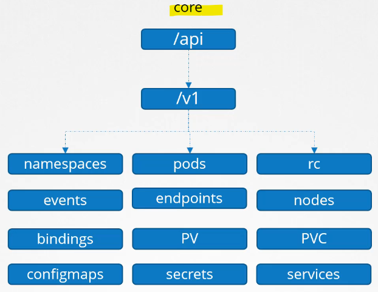
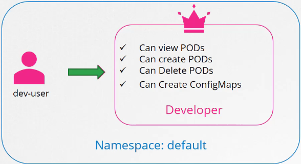
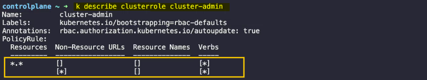
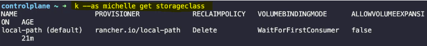
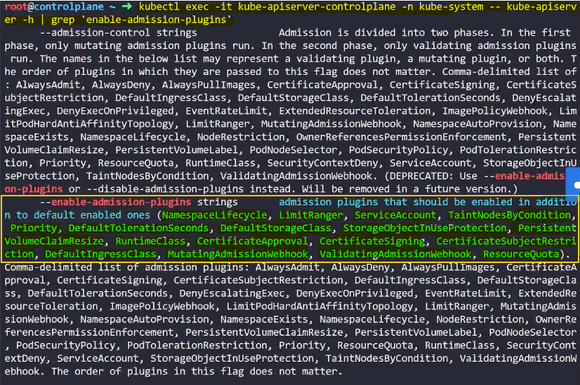
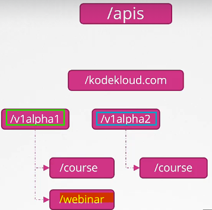
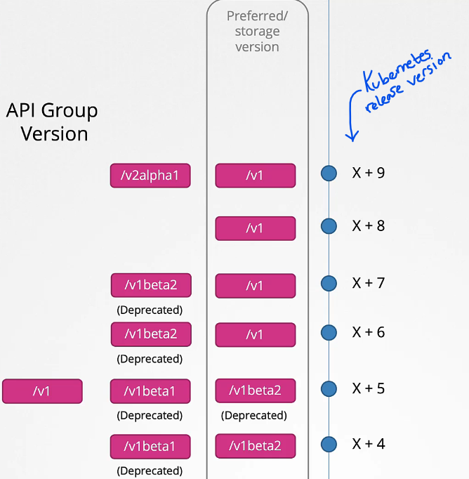
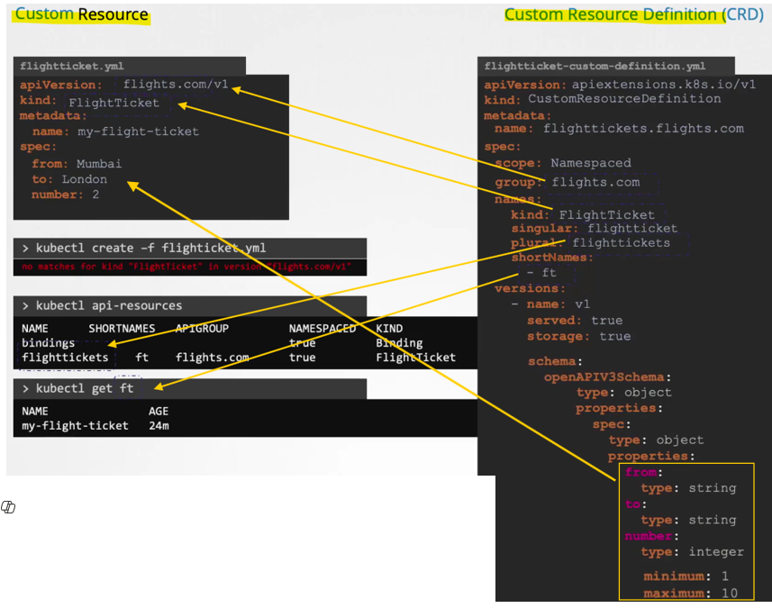
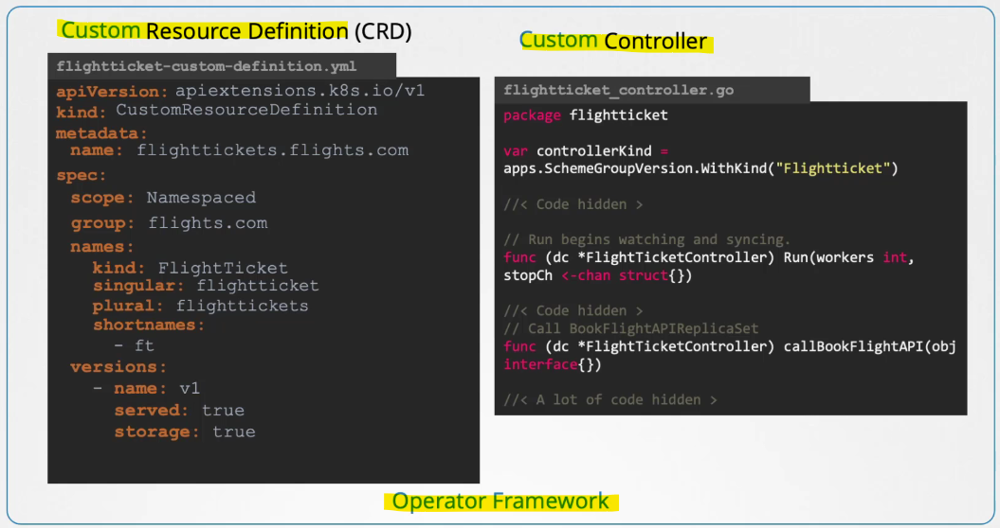

- [Security](#security)
  - [Authentication, Autorisation, and Asmission Control](#authentication-autorisation-and-asmission-control)
    - [Introduction to Security in Kubernetes](#introduction-to-security-in-kubernetes)
    - [Securing the Cluster Hosts](#securing-the-cluster-hosts)
    - [API Server Security](#api-server-security)
    - [Communication Security](#communication-security)
    - [Application Communication](#application-communication)
    - [Summary](#summary)
  - [Authentication](#authentication)
    - [Introduction to Authentication](#introduction-to-authentication)
    - [Focus on Authentication](#focus-on-authentication)
    - [User Management](#user-management)
    - [API Server Authentication](#api-server-authentication)
    - [Static Password and Token Files](#static-password-and-token-files)
    - [Security Considerations](#security-considerations)
    - [Summary](#summary-1)
  - [Article on Setting up Basic Authentication](#article-on-setting-up-basic-authentication)
    - [Introduction](#introduction)
    - [Steps to Configure Basic Authentication](#steps-to-configure-basic-authentication)
    - [Summary](#summary-2)
  - [KubeConfig](#kubeconfig)
    - [Introduction to Kubeconfigs](#introduction-to-kubeconfigs)
    - [Using Certificates with kubectl](#using-certificates-with-kubectl)
    - [Default Kubeconfig Location](#default-kubeconfig-location)
    - [Kubeconfig File Structure](#kubeconfig-file-structure)
    - [Managing Multiple Clusters and Users](#managing-multiple-clusters-and-users)
    - [Setting the Current Context](#setting-the-current-context)
    - [Viewing and Modifying Kubeconfig Files](#viewing-and-modifying-kubeconfig-files)
    - [Namespaces in Kubeconfig](#namespaces-in-kubeconfig)
    - [Certificates in Kubeconfig](#certificates-in-kubeconfig)
    - [Summary](#summary-3)
  - [Demo: KubeConfig](#demo-kubeconfig)
    - [Locating the Default Kubeconfig File](#locating-the-default-kubeconfig-file)
    - [Inspecting the Default Kubeconfig File](#inspecting-the-default-kubeconfig-file)
    - [Inspecting a New Kubeconfig File (from test)](#inspecting-a-new-kubeconfig-file-from-test)
    - [Switching Contexts](#switching-contexts)
    - [Troubleshooting Issues](#troubleshooting-issues)
    - [Summary](#summary-4)
  - [API Groups](#api-groups)
    - [Introduction to Kubernetes API](#introduction-to-kubernetes-api)
    - [API Groups](#api-groups-1)
    - [Core Group](#core-group)
    - [Named Group](#named-group)
    - [Actions on Resources](#actions-on-resources)
    - [Accessing API Groups](#accessing-api-groups)
    - [Using kubectl Proxy](#using-kubectl-proxy)
    - [Kube Proxy vs. kubectl Proxy](#kube-proxy-vs-kubectl-proxy)
    - [Summary](#summary-5)
  - [Authorisation](#authorisation)
    - [Introduction to Authorization](#introduction-to-authorization)
    - [Importance of Authorization](#importance-of-authorization)
    - [Authorisation Mechanisms](#authorisation-mechanisms)
    - [Configuring Authorization Modes](#configuring-authorization-modes)
    - [Authorization Process](#authorization-process)
    - [Summary](#summary-6)
  - [Role Based Access Controls](#role-based-access-controls)
    - [Introduction to RBAC](#introduction-to-rbac)
    - [Creating a Role](#creating-a-role)
    - [Creating a Role Binding](#creating-a-role-binding)
    - [Viewing Roles and Role Bindings](#viewing-roles-and-role-bindings)
    - [Checking User Permissions](#checking-user-permissions)
    - [Resource Names](#resource-names)
    - [Summary](#summary-7)
  - [Demo: Solution Role Based Access Controls](#demo-solution-role-based-access-controls)
    - [Inspecting Authorization Modes](#inspecting-authorization-modes)
    - [Checking Roles](#checking-roles)
    - [Inspecting kube-proxy Role](#inspecting-kube-proxy-role)
    - [Checking Permissions for dev-user](#checking-permissions-for-dev-user)
    - [Creating Roles and Role Bindings for dev-user](#creating-roles-and-role-bindings-for-dev-user)
    - [Fixing Issues with dev-user Access](#fixing-issues-with-dev-user-access)
    - [Granting Permissions to Create Deployments](#granting-permissions-to-create-deployments)
    - [Summary](#summary-8)
  - [Cluster Roles](#cluster-roles)
    - [Introduction to Cluster Roles and Cluster Role Bindings](#introduction-to-cluster-roles-and-cluster-role-bindings)
    - [Creating a Cluster Role](#creating-a-cluster-role)
    - [Creating a Cluster Role Binding](#creating-a-cluster-role-binding)
    - [Cluster Roles for Namespaced Resources](#cluster-roles-for-namespaced-resources)
    - [Default Cluster Roles](#default-cluster-roles)
    - [Summary](#summary-9)
  - [Demo: Cluster Roles](#demo-cluster-roles)
    - [Inspecting Cluster Roles and Cluster Role Bindings](#inspecting-cluster-roles-and-cluster-role-bindings)
    - [Creating Cluster Roles and Role Bindings for Michelle](#creating-cluster-roles-and-role-bindings-for-michelle)
    - [Granting Storage Access to Michelle](#granting-storage-access-to-michelle)
    - [Summary](#summary-10)
  - [Admission Controllers](#admission-controllers)
    - [Introduction to Admission Controllers](#introduction-to-admission-controllers)
    - [Request Flow in Kubernetes](#request-flow-in-kubernetes)
    - [Role-Based Access Control (RBAC)](#role-based-access-control-rbac)
    - [Admission Controllers](#admission-controllers-1)
    - [Examples of Admission Controllers](#examples-of-admission-controllers)
    - [Enabling and Disabling Admission Controllers](#enabling-and-disabling-admission-controllers)
    - [Example: Namespace Auto Provision](#example-namespace-auto-provision)
    - [Deprecation Notice](#deprecation-notice)
    - [Summary](#summary-11)
  - [Demo: Admission Controllers](#demo-admission-controllers)
    - [Functions of Admission Controllers](#functions-of-admission-controllers)
    - [Checking Enabled Admission Controllers](#checking-enabled-admission-controllers)
    - [Identifying Enabled Admission Controllers](#identifying-enabled-admission-controllers)
    - [Creating a Pod in a Non-Existent Namespace](#creating-a-pod-in-a-non-existent-namespace)
    - [Disabling Default Storage Class Admission Controller](#disabling-default-storage-class-admission-controller)
    - [Checking Enabled and Disabled Plugins](#checking-enabled-and-disabled-plugins)
    - [Summary](#summary-12)
  - [Validating and Mutating Admission Controllers](#validating-and-mutating-admission-controllers)
    - [Types of Admission Controllers](#types-of-admission-controllers)
    - [Order of Invocation](#order-of-invocation)
    - [Custom Admission Controllers](#custom-admission-controllers)
    - [Setting Up Custom Admission Controllers](#setting-up-custom-admission-controllers)
    - [Example Configuration](#example-configuration)
    - [Summary](#summary-13)
  - [Demo: Validating and Mutating Admission Controllers](#demo-validating-and-mutating-admission-controllers)
    - [Identifying Admission Controllers](#identifying-admission-controllers)
    - [Creating Namespace](#creating-namespace)
    - [Creating TLS Secret](#creating-tls-secret)
    - [Deploying Webhook Deployment and Service](#deploying-webhook-deployment-and-service)
    - [Understanding Webhook Configuration](#understanding-webhook-configuration)
    - [Testing Webhook Functionality](#testing-webhook-functionality)
    - [Summary](#summary-14)
  - [API Versions](#api-versions)
    - [Introduction to API Versions](#introduction-to-api-versions)
    - [API Version Stages](#api-version-stages)
    - [Multiple Versions](#multiple-versions)
    - [Preferred and Storage Versions](#preferred-and-storage-versions)
    - [Enabling/Disabling API Versions](#enablingdisabling-api-versions)
    - [Summary](#summary-15)
  - [API Deprecations](#api-deprecations)
    - [Introduction to API Deprecations](#introduction-to-api-deprecations)
    - [Life Cycle of an API Group](#life-cycle-of-an-api-group)
    - [API Deprecation Policy Rules](#api-deprecation-policy-rules)
    - [Example of API Evolution](#example-of-api-evolution)
    - [Deprecation Notifications](#deprecation-notifications)
    - [Summary](#summary-16)
    - [Deprecation and Removal Process](#deprecation-and-removal-process)
    - [kubectl convert Command](#kubectl-convert-command)
    - [Summary](#summary-17)
  - [Demo: API Versions](#demo-api-versions)
    - [Identifying Short Names](#identifying-short-names)
    - [Patch Version in Kubernetes API](#patch-version-in-kubernetes-api)
    - [Identifying API Group for a Resource](#identifying-api-group-for-a-resource)
    - [Preferred Version for API Group](#preferred-version-for-api-group)
    - [Enabling V1 Alpha 1 Version for RBAC API Group](#enabling-v1-alpha-1-version-for-rbac-api-group)
    - [Installing kubectl Convert Plugin](#installing-kubectl-convert-plugin)
    - [Converting Deprecated API Version](#converting-deprecated-api-version)
    - [Summary](#summary-18)
  - [Custom Resource Definition](#custom-resource-definition)
    - [Introduction to Resources and Controllers](#introduction-to-resources-and-controllers)
    - [Custom Resources and Controllers](#custom-resources-and-controllers)
    - [Creating Custom Resource Definitions (CRDs)](#creating-custom-resource-definitions-crds)
    - [Using Custom Resources](#using-custom-resources)
    - [Summary](#summary-19)
  - [Custom Controllers](#custom-controllers)
    - [Introduction to Custom Controllers](#introduction-to-custom-controllers)
    - [Building a Custom Controller](#building-a-custom-controller)
    - [Steps to Build a Custom Controller](#steps-to-build-a-custom-controller)
    - [Summary](#summary-20)
  - [Operator Framework](#operator-framework)
    - [Introduction to the Operator Framework](#introduction-to-the-operator-framework)
    - [Components of the Operator Framework](#components-of-the-operator-framework)
    - [Packaging with the Operator Framework](#packaging-with-the-operator-framework)
    - [Real-Life Use Case: etcd Operator](#real-life-use-case-etcd-operator)
    - [Operator Hub](#operator-hub)
    - [Summary](#summary-21)

<br>

<hr style="height:4px;background:black">

<br>

# Security

## Authentication, Autorisation, and Asmission Control

### Introduction to Security in Kubernetes
* `Importance`: Kubernetes is a popular platform for hosting production-grade applications, making **security** a **top priority**.

<br>

### Securing the Cluster Hosts
`Host Security`:
* Disable root access.
* Disable password-based authentication.
* Enable only SSH key-based authentication.
* Implement additional measures to secure physical or virtual infrastructure.

<br>

### API Server Security
* `Central Role`: The Kubernetes API server is **central** to **all operations within the cluster**.

`Access Control`:
* `Authentication`: Determines **who** can access the API server.
* `Methods`: User IDs and passwords, tokens, certificates, external providers (e.g., LDAP), service accounts.
* `Authorisation`: Determines **what users can do** once they gain access.
* `Methods`: Role-based access controls (RBAC), attribute-based access control, node authorizers, webhooks.

<br>


<br>

### Communication Security
`Component Communication`:
* `Components`: etcd cluster, kube-controller-manager, scheduler, API server, kubelet, kube-proxy.
* `TLS Encryption`: Secures communication between these components.

<br>

### Application Communication
* `Default Behavior`: All pods can access all other pods within the cluster.
* `Network Policies`: Restrict access between pods to enhance security.

<br>

### Summary
* `Security Primitives`: Overview of various security measures in Kubernetes, including host security, API server access control, communication security, and network policies.

<br>

<hr style="height:4px;background:black">

<br>

## Authentication

### Introduction to Authentication
* `Kubernetes Cluster`: Consists of **multiple nodes** (physical or virtual) and various components.

`Users`:
* `Administrators`: Perform administrative tasks.
* `Developers`: Test or deploy applications.
* `End Users`: Access applications deployed on the cluster.
* `Third-Party Applications`: Access the cluster for integration purposes.

<br>

### Focus on Authentication
* `Scope`: **Securing access** to the Kubernetes cluster **for administrative purposes**.

`Types of Users`:
* `Humans`: Administrators and developers.
* `Robots`: Processes, services, or applications that require access to the cluster.

<br>

### User Management
* `External Source`: Kubernetes relies on **external sources** (e.g., files, certificates, LDAP) to **manage users**.
* `Service Accounts`: Kubernetes can manage service accounts using the Kubernetes API.

<br>

### API Server Authentication
* `Central Role`: The **kube-apiserver** manages **all user access** to the cluster.

`Authentication Mechanisms`:
* `Static Password File`: List of usernames and passwords in a CSV file.
* `Static Token File`: List of usernames and tokens in a CSV file.
* `Certificates`: Authenticate using certificates.
* `Third-Party Protocols`: LDAP, Kerberos, etc.

<br>


<br>

<br>

### Static Password and Token Files
1. `Static Password File`:
   * `Format`: **CSV file** with columns for password, username, and user ID.
   * `Configuration`: Pass the file name as an **option** to the **kube-apiserver**.

<Br>

Example:

```csv
password,username,userid
pass123,user1,1001
pass456,user2,1002
```

<br>


<br>

<Br>


2. `Static Token File`:
   * `Format`: **CSV file** with columns for token, username, and user ID.
   * `Configuration`: Pass the token file as an option to the **kube-apiserver**.

<br>

Example:

```csv
token123,user1,1001
token456,user2,1002
```

<br>


<br> 

<br>

3. `Authentication`:
   * `Basic Credentials`: Specify user and password in a curl command.
   * `Token`: Specify the token as an **authorization bearer token** in the request.

<bR>


<br>

<br>

### Security Considerations
* `Insecure Method`: Storing usernames, passwords, and tokens in clear **text in a static file** is **not** recommended.
* `Purpose`: This method is used to understand the basics of authentication in Kubernetes.

<br>

### Summary
* `Authentication Mechanisms`: Various methods to authenticate users in a Kubernetes cluster.
* `Static Files`: Simple but insecure method to manage user authentication.

<br>

<hr style="height:4px;background:black">

<br>

## Article on Setting up Basic Authentication

### Introduction
* `Basic Authentication`: A method to authenticate users in a Kubernetes cluster using a static file with user details.

> **Note**: This approach is deprecated in Kubernetes version 1.19 and is not recommended for production environments. It is only for learning purposes.

<br>

### Steps to Configure Basic Authentication
1. `Create User Details File`:
   * **Location**: /tmp/users/user-details.csv

Contents:

```csv
password123,user1,u0001
password123,user2,u0002
password123,user3,u0003
password123,user4,u0004
password123,user5,u0005
```

<br>

2. `Edit kube-apiserver Static Pod`:
   * **File Location**: /etc/kubernetes/manifests/kube-apiserver.yaml

`Add Volume Mount`:

```yaml
apiVersion: v1
kind: Pod
metadata:
  name: kube-apiserver
  namespace: kube-system
spec:
  containers:
  - command:
    - kube-apiserver
      <content-hidden>
    image: k8s.gcr.io/kube-apiserver-amd64:v1.11.3
    name: kube-apiserver
    volumeMounts:
    - mountPath: /tmp/users
      name: usr-details
      readOnly: true
  volumes:
  - hostPath:
      path: /tmp/users
      type: DirectoryOrCreate
    name: usr-details
```

<br>

3. `Modify kube-apiserver Startup Options`:

`Add Basic Auth File`:

```yaml
apiVersion: v1
kind: Pod
metadata:
  creationTimestamp: null
  name: kube-apiserver
  namespace: kube-system
spec:
  containers:
  - command:
    - kube-apiserver
    - --authorization-mode=Node,RBAC
      <content-hidden>
    - --basic-auth-file=/tmp/users/user-details.csv
```

<br>

4. `Create Roles and Role Bindings`:

`Role`:

```yaml
kind: Role
apiVersion: rbac.authorization.k8s.io/v1
metadata:
  namespace: default
  name: pod-reader
rules:
- apiGroups: [""]
  resources: ["pods"]
  verbs: ["get", "watch", "list"]
```

<Br>

`Role Binding`:

```yaml
kind: RoleBinding
apiVersion: rbac.authorization.k8s.io/v1
metadata:
  name: read-pods
  namespace: default
subjects:
- kind: User
  name: user1
  apiGroup: rbac.authorization.k8s.io
roleRef:
  kind: Role
  name: pod-reader
  apiGroup: rbac.authorization.k8s.io
```

<br>

5. `Authenticate Using User Credentials`:

Command:

```bash
curl -v -k https://localhost:6443/api/v1/pods -u "user1:password123"
```

<br>

### Summary
* `Basic Authentication`: Deprecated method to authenticate users in Kubernetes using a static file.
* `Configuration Steps`: Create user details file, edit kube-apiserver static pod, modify startup options, create roles and role bindings, and authenticate using user credentials.

<br>

<hr style="height:4px;background:black">

<br>

## KubeConfig

### Introduction to Kubeconfigs
* `Kubeconfigs`: Configuration files used to **manage access** to Kubernetes **clusters**.
* `Purpose`: Store cluster, user, and context information to simplify kubectl commands.

<br>

### Using Certificates with kubectl
* `Certificates`: Used to **authenticate users** when querying the Kubernetes REST API.
* `kubectl Options`: Server, client key, client certificate, and certificate authority.
* `Kubeconfig File`: **Stores these options** to avoid typing them in every command.

<br>

### Default Kubeconfig Location
* `Default Path`: ~/.kube/config
* `Automatic Use`: kubectl automatically uses this file if no other kubeconfig is specified.

<br>

### Kubeconfig File Structure
`Sections`:
* `Clusters`: Lists the Kubernetes clusters.
* `Users`: Lists the user accounts.
* `Contexts`: Defines which user account will be used to access which cluster.

<br>


<br>

Example Configuration:

```yaml
# KubeConfig file: $HOME/.kube/config

apiVersion: v1
kind: Config

clusters:
- name: my-kube-playground
  cluster:
    server: https://my-kube-playground:6443
    certificate-authority: /path/to/ca.crt

users:
- name: my-kube-admin
  user:
    client-certificate: /path/to/admin.crt
    client-key: /path/to/admin.key

contexts:
- name: my-kube-admin@my-kube-playground
  context:
    cluster: my-kube-playground
    user: my-kube-admin
current-context: my-kube-admin@my-kube-playground
```

<br>


<br>

<br>

### Managing Multiple Clusters and Users
* `Multiple Clusters`: Add entries for each cluster in the **clusters** section.
* `Multiple Users`: Add entries for each user in the **users** section.
* `Contexts`: **Link clusters and users** to define access.

<br>


<br>

<bR>

### Setting the Current Context
* `Default Context`: Specify the **default context** using the **current-context** field.
* `Changing Context`: Use the `kubectl config use-context` command to switch contexts.

<br>


<br>

<br>

### Viewing and Modifying Kubeconfig Files
* **View Current Config**: `kubectl config view`
* **Specify Kubeconfig File**: Use the `--kubeconfig` option in kubectl commands.
* **Update Contex**: `kubectl config use-context <context-name>`

<br>


<br>

### Namespaces in Kubeconfig
* `Namespace Field`: Specify a **namespace** in the **context** section to automatically switch to it.

Example:

```yaml
contexts:
- name: my-kube-admin@my-kube-playground
  context:
    cluster: my-kube-playground
    user: my-kube-admin
    namespace: my-namespace
```

<br>


<br>

### Certificates in Kubeconfig
* `Path to Certificates`: Use the full path to **certificate files**.
* `Base64 Encoding`: Optionally, use the certificate-authority-data field with **base64** encoded certificate contents.

<br>


<br>

### Summary
* `Kubeconfigs`: Simplify kubectl commands by storing cluster, user, and context information.
* `Structure`: Consists of clusters, users, and contexts sections.
* `Management`: Use kubectl commands to view and modify kubeconfig files.

<br>

<hr style="height:4px;background:black">

<br>

## Demo: KubeConfig

### Locating the Default Kubeconfig File
* `Default Location`: **Path**: ~/.kube/config
* `Check Home Directory`:

```bash
echo $HOME
```

* **Example**: If home is set to **/root**, the kubeconfig file is located at **/root/.kube/config**.

<br>


<br>

### Inspecting the Default Kubeconfig File
* `Clusters`: **Result**: One cluster defined.

Command:

```bash
kubectl config view
```

* `Users`: **Result**: One user defined.
* `Contexts`: **Result**: One context defined.
* `Current Context`: **Result**: The user configured in the current context is kubernetes-admin.
* `Cluster Name`: **Result**: The name of the cluster is kubernetes.

<br>


<br>

### Inspecting a New Kubeconfig File (from test)
`New Kubeconfig File`:
* **Path**: /root/my-kube-config
* **Clusters**: Four clusters defined.
* **Contexts**: Four contexts defined.
* **User in Research Context**: dev-user
* **Client Certificate for AWS User**: AWSuser.crt
* **Current Context**: testuser@development

<br>

### Switching Contexts
1. `Switch to Research Context`:

Command:

```bash
kubectl config use-context research --kubeconfig=/root/my-kube-config
```

* **Result**: Current context set to research.

<br>


<br>

2. `Make My Kubeconfig the Default`:

**Move File**:

```bash
mv /root/my-kube-config /root/.kube/config
```

**Verify**:

```bash
kubectl config view
```

<br>


<br>

### Troubleshooting Issues
1. `Identify Issue`:

Command:

```bash
kubectl get nodes
```

* **Error**: Unable to read client certificate developeruser.crt.

<br>


<br>

**Fix Issue**:

2. `Check Certificate Path`:

```bash
ls /etc/kubernetes/pki/users/dev-user
```

* **Correct Path**: devuser.crt

<br>


<br>

<br>

3. `Update Kubeconfig`:

```yaml
users:
- name: dev-user
  user:
    client-certificate: /etc/kubernetes/pki/users/dev-user/devuser.crt
    client-key: /etc/kubernetes/pki/users/dev-user/devuser.key
```

<br>


<br>

<br>

4. `Verify Fix`:

Command:

```bash
kubectl get nodes
```

* **Result**: Command works successfully.

<br>


<br>

### Summary
* `Kubeconfig File`: Manages access to Kubernetes clusters.
* `Default Location`: ~/.kube/config
* `Switching Contexts`: Use kubectl config use-context to switch contexts.
* `Troubleshooting`: Ensure correct paths for certificates in the kubeconfig file.

<br>

<hr style="height:4px;background:black">

<br>

## API Groups

### Introduction to Kubernetes API
* `Kubernetes API`: Central to all operations within the cluster, accessed via the kube-apiserver.
* `Interaction`: Through kubectl utility or directly via REST API.

<br>

### API Groups
* `Purpose`: Organise APIs based on their **functionality**.

`Types`:
* `Core Group`: Contains **core functionalities** like namespaces, pods, replication controllers, events, nodes, bindings, persistent volumes, persistent volume claims, config maps, secrets, services, etc.
* `Named Group`: More **organised** and **includes newer features**. 
  * Contains groups for apps, extensions, networking, storage, authentication, authorization, etc.

<br>


<br>

### Core Group
* `Resources`: Namespaces, pods, replication controllers, events, nodes, bindings, persistent volumes, persistent volume claims, config maps, secrets, services, etc.

<br>



<br>

### Named Group
`Resources`:
* **Apps**: Deployments, replica sets, stateful sets.
* **Networking**: Network policies.
* **Certificates**: Certificate signing requests.
* **Others**: Storage, authentication, authorization, etc.

<br>


<br>

### Actions on Resources
* `Verbs`: Actions that can be performed on resources, such as list, get, create, delete, update, watch, etc.

<br>

### Accessing API Groups
* `Kubernetes API Reference`: Provides details on **API groups** for each object.
* `Direct Access`: Access the **kube-apiserver** at port **6443** to list available API groups.
* `Authentication`: Required to access most APIs directly via **curl**.

<br>


<br>

### Using kubectl Proxy
* `kubectl Proxy Command`: Launches a **proxy service** locally on port **8001**.
* `Credentials`: Uses **credentials** and **certificates** from the **kubeconfig** file.
* `Access`: Allows access to the kube-apiserver **without specifying credentials** in each curl command.

<br>


<br>

### Kube Proxy vs. kubectl Proxy
* `Kube Proxy`: Enables **connectivity** between **pods and services** across **different nodes** in the cluster.
* `kubectl Proxy`: An **HTTP proxy service** created by the kubectl utility to **access the kube-apiserver**.

<br>

### Summary
* `API Groups`: Organize resources in Kubernetes into core and named groups.
* `Verbs`: Define actions that can be performed on resources.
* `Access`: Use kubectl proxy for easier access to the kube-apiserver.

<br>

<hr style="height:4px;background:black">

<br>

## Authorisation

### Introduction to Authorization
* `Authorisation`: Defines **what users can do** once they **gain access** to a Kubernetes **cluster**.
* `Purpose`: Ensure that different users have appropriate levels of access based on their roles and responsibilities.

<br>

### Importance of Authorization
* `Administrator Access`: Admins can perform **all operations**, including viewing, creating, and deleting objects.
* `Controlled Access`: Other users (e.g., developers, testers, applications) should have **restricted access** based on their needs.

<br>


<br>

### Authorisation Mechanisms


<br>

1. `Node Authorisation`:
   * `Purpose`: Handles **requests** from **kubelets** within the cluster.
   * `Mechanism`: Requests from users with names prefixed with `system:node` and part of the `system:nodes` group are authorized by the node authorizer.

<br>


<br>

<br>

2. `Attribute-Based Authorization` (ABAC):
   * `Purpose`: **Associates users** or **groups** with specific permissions.
   * `Mechanism`: Define policies in a **JSON file** and **pass** it to the **API server**. 
     * Changes require **manual updates** and **API server restarts**.

<bR>


<br>

<br>

3. `Role-Based Access Controls` (RBAC):
   * `Purpose`: **Simplifies management** of **user permissions**.
   * `Mechanism`: **Define roles** with **specific permissions** and **associate users or groups** with these roles. 
     * Changes to roles reflect on all associated users immediately.

<br>


<br>

<br>

4. `Webhook Authorization`:
   * `Purpose`: **Outsource authorization** to an **external service**.
   * `Mechanism`: Kubernetes makes an **API call** to the **external service** (e.g., Open Policy Agent) to **determine if a user should be granted access**.

<br>

5. `Always Allow and Always Deny`:
   * `Always Allow`: Allows all requests without authorization checks.
   * `Always Deny`: Denies all requests.

<br>

### Configuring Authorization Modes
* `Authorization Mode Option`: Set using the --authorization-mode option on the kube-apiserver.
* `Default Mode`: If not specified, the default mode is AlwaysAllow.
* `Multiple Modes`: Provide a comma-separated list of modes (e.g., Node,RBAC,Webhook).

<br>

### Authorization Process
* `Sequential Checks`: Requests are authorized using each mode in the specified order.
* `Denial Handling`: If a module denies a request, it is forwarded to the next module.
* `Approval Handling`: If a module approves a request, no further checks are performed, and the user is granted access.

<br>

### Summary
* `Authorization`: Ensures controlled access to Kubernetes clusters based on user roles and responsibilities.
* `Mechanisms`: Node authorization, attribute-based authorization, role-based access controls, webhook authorization, always allow, and always deny.
* `Configuration`: Set authorization modes on the kube-apiserver and manage user permissions effectively.

<br>

<hr style="height:4px;background:black">

<br>

## Role Based Access Controls

### Introduction to RBAC
* `Role-Based Access Controls` (RBAC): A method to **manage user permissions** in Kubernetes by **defining roles** and **associating users** with these roles.

<br>

### Creating a Role
1. `Role Definition File`:
   * **API Version**: rbac.authorization.k8s.io/v1
   * **Kind**: Role
   * **Name**: developer
   * **Rules**: Define API groups, resources, and verbs (actions).

Example Configuration:

```yaml
apiVersion: rbac.authorization.k8s.io/v1
kind: Role
metadata:
  name: developer
rules:
- apiGroups: [""]
  resources: ["pods"]
  verbs: ["list", "get", "create", "delete"]
- apiGroups: [""]
  resources: ["configmaps"]
  verbs: ["create"]
```

<br>


<br>

<br>

2. `Create Role`:

Command:

```bash
kubectl create -f role-definition.yaml
```

<br>

### Creating a Role Binding
1. `Role Binding Definition File`:
   * **Kind**: RoleBinding
   * **Name**: (example) dev-user-to-developer-binding
   * **Subjects**: Specify user details.
   * **RoleRef**: Provide details of the role created.

Example Configuration:

```yaml
apiVersion: rbac.authorization.k8s.io/v1
kind: RoleBinding
metadata:
  name: dev-user-to-developer-binding
subjects:
- kind: User
  name: dev-user
  apiGroup: rbac.authorization.k8s.io
roleRef:
  kind: Role
  name: developer
  apiGroup: rbac.authorization.k8s.io
```

<br>




<br>

<br>

2. `Create Role Binding`:

Command:

```bash
kubectl create -f role-binding-definition.yaml
```

<br>

### Viewing Roles and Role Bindings
* List Roles: `kubectl get roles`
* List Role Bindings: `kubectl get rolebindings`
* Describe Role: `kubectl describe role developer` 
* Describe Role Binding: `kubectl describe rolebinding dev-user-to-developer-binding`

<br>

### Checking User Permissions
* Check Permissions: `kubectl auth can-i create deployments`
* Impersonate Another User: `kubectl auth can-i create pods --as=dev-user`
* Specify Namespace: `kubectl auth can-i create pods --namespace=test --as=dev-user`

<br>

### Resource Names
1. `Restrict Access to Specific Resources`:
   * **Example**: Allow access to specific pods.

Configuration:

```yaml
rules:
- apiGroups: [""]
  resources: ["pods"]
  verbs: ["get", "create", "update"]
  resourceNames: ["blue", "orange"]

```

<br>


<br>

### Summary
* `RBAC`: Manages user permissions by defining roles and associating users with these roles.
* `Roles and Role Bindings`: Define permissions and link users to roles.
* `Checking Permissions`: Use kubectl commands to verify user access.

<br>

<hr style="height:4px;background:black">

<br>

## Demo: Solution Role Based Access Controls

### Inspecting Authorization Modes
1. `Check kube-apiserver Configuration`:

Command:

```bash
cat /etc/kubernetes/manifests/kube-apiserver.yaml
```

* **Authorization Modes**: Node and RBAC

<br>


<br>

<br>

2. `Check Processes on Control Plane`:

Command:

```bash
ps -aux | grep authorization-mode
```

* **Authorization Modes**: Node and RBAC

<br>


<br>

### Checking Roles
1. `Roles in Default Namespace`:

Command:

```bash
kubectl get roles
```

* **Result**: No roles in the default namespace.

<br>

<br>

2. `Roles in All Namespaces`:

Command:

```bash
kubectl get roles -A --no-headers | wc -l
```

* **Result**: 12 roles.

<bR>


<br>

### Inspecting kube-proxy Role
1. `Describe kube-proxy Role`:

Command:

```bash
kubectl describe role kube-proxy -n kube-system
```

* **Resources**: configmaps
* **Actions**: get

<br>


<bR>

<br>

2. `Role Binding for kube-proxy Role`:

Command:

```bash
kubectl describe rolebinding kube-proxy -n kube-system
```

* **Assigned to**: system:bootstrappers:kubeadm:default-node-token

<br>


<br>

### Checking Permissions for dev-user
1. `View kubeconfig`:

Command:

```bash
kubectl config view
```

* **User**: dev-user

<br>


<br>

<br>

2. `Check Permissions`:

Command:

```bash
kubectl get pods --as=dev-user
```

* **Result**: Forbidden (dev-user does not have permissions).

<br>


<br>

### Creating Roles and Role Bindings for dev-user
1. `Create Role`:

Command:

```bash
kubectl create role developer --verb=list,create,delete --resource=pods
```

<br>


<br>

<br>

2. `Create Role Binding`:

Command:

```bash
kubectl create rolebinding dev-user-binding --role=developer --user=dev-user
```

<br>


<br>

### Fixing Issues with dev-user Access
1. `Describe Role in blue Namespace`:

Command:

```bash
kubectl describe role developer -n blue
```

* **Issue**: Resource name should be dark-blue-app instead of blue-app.

<br>


<br>

<br>

2. `Edit Role`:

Command:

```bash
kubectl edit role developer -n blue
```

* **Fix**: Change resource name to dark-blue-app.

<br>


<br>

<br>

3. `Verify Fix`:

Command:

```bash
kubectl get pod dark-blue-app -n blue --as=dev-user
```

* **Result**: Success (pod is in running state).

<br>


<br>

### Granting Permissions to Create Deployments
1. `Edit Role to Add Deployment Permissions`:

Command:

```bash
kubectl edit role developer -n blue
```

<br>

<br>

2. `Add Rule`:

```yaml
- apiGroups: ["apps"]
  resources: ["deployments"]
  verbs: ["get", "watch", "create", "delete"]
```

<br>


<br>

<br>

3. `Verify Fix`:

Command:

```bash
kubectl create deployment nginx --image=nginx -n blue --as=dev-user
```

* **Result**: Success (deployment created).

<br>

### Summary
* `RBAC Lab`: Inspect authorization modes, check roles, create roles and role bindings, fix access issues, and grant permissions.
* `Commands`: Use kubectl commands to manage roles, role bindings, and user permissions.

<br>

<hr style="height:4px;background:black">

<br>

## Cluster Roles

### Introduction to Cluster Roles and Cluster Role Bindings
* `Cluster Roles and Cluster Role Bindings`: Used to **manage access** to **cluster-scoped resources** in Kubernetes.

`Namespace vs. Cluster Scope`:
* `Namespaced Resources`: Pods, deployments, services, secrets, roles, role bindings, etc.
* `Cluster-Scoped Resources`: Nodes, persistent volumes, cluster roles, cluster role bindings, certificate signing requests, etc.

<br>


<br>

### Creating a Cluster Role
1. `Cluster Role Definition File`:
   * **API Version**: rbac.authorization.k8s.io/v1
   * **Kind**: ClusterRole
   * **Name**: Example - cluster-admin
   * **Rules**: Define API groups, resources, and verbs (actions).

Example Configuration:

```yaml
apiVersion: rbac.authorization.k8s.io/v1
kind: ClusterRole
metadata:
  name: cluster-admin
rules:
- apiGroups: [""]
  resources: ["nodes"]
  verbs: ["list", "get", "create", "delete"]
```

<br>


<br>

<br>

2. `Create Cluster Role`:

Command:

```bash
kubectl create -f cluster-role-definition.yaml
```

<br>

### Creating a Cluster Role Binding
1. `Cluster Role Binding Definition File`:
   * **Kind**: ClusterRoleBinding
   * **Name**: Example - cluster-admin-role-binding
   * **Subjects**: Specify user details.
   * **RoleRef**: Provide details of the cluster role created.

Example Configuration:

```yaml
apiVersion: rbac.authorization.k8s.io/v1
kind: ClusterRoleBinding
metadata:
  name: cluster-admin-role-binding
subjects:
- kind: User
  name: cluster-admin
  apiGroup: rbac.authorization.k8s.io
roleRef:
  kind: ClusterRole
  name: cluster-administrator
  apiGroup: rbac.authorization.k8s.io
```

<br>


<br>

<br>

2. `Create Cluster Role Binding`:

Command:

```bash
kubectl create -f cluster-role-binding-definition.yaml
```

<br>

### Cluster Roles for Namespaced Resources
* `Flexibility`: Cluster roles can be created for **namespaced resources** as well.
* `Access Across All Namespaces`: **Users** will have **access** to these resources across **all namespaces**.

<br>

### Default Cluster Roles
* `Predefined Roles`: Kubernetes **creates** a number of **cluster roles by default** when the cluster is first set up.

<br>

### Summary
* `Cluster Roles and Cluster Role Bindings`: Manage access to cluster-scoped resources.
* `Creation`: Define cluster roles and bind users to these roles using cluster role bindings.
* `Flexibility`: Cluster roles can also be used for namespaced resources to provide access across all namespaces.

<br>

<hr style="height:4px;background:black">

<br>

## Demo: Cluster Roles

### Inspecting Cluster Roles and Cluster Role Bindings
1. `Check Cluster Roles`:

Command:

```bash
kubectl get clusterroles --no-headers wc -l
```

* **Count**: Use `--no-headers` and `wc -l` to count the roles.
* **Result**: 69 cluster roles.

<br>

2. `Check Cluster Role Bindings`:

Command:

```bash
kubectl get clusterrolebindings --no-headers wc -l
```

* **Count**: Use --no-headers and wc -l to count the bindings.
* **Result**: 54 cluster role bindings.

<Br>

3. `Namespace of Cluster Admin Role`:
   * **Cluster roles are not namespaced**: They are cluster-wide and not part of any namespace.

<br>

4. `User or Groups Bound to Cluster Admin Role`:

Command:

```bash
kubectl describe clusterrolebinding cluster-admin
```

* **Result**: Bound to the group **system:masters**.

<br>


<br>

5. `Permissions of Cluster Admin Role`:

Command:

```bash
kubectl describe clusterrole cluster-admin
```

* **Result**: Perform any action on any resource in the cluster (*).

<br>



<br>

### Creating Cluster Roles and Role Bindings for Michelle
1. `Create Cluster Role for Nodes`:

Command:

```bash
kubectl create clusterrole michelle-role --verb=get,list,watch --resource=nodes
```

<br>

<br>

2. `Create Cluster Role Binding for Michelle`:

Command:

```bash
kubectl create clusterrolebinding michelle-role-binding --clusterrole=michelle-role --user=michelle
```

<br>


<br>

<br>

3. `Verify Access`:

Command:

```bash
kubectl get nodes --as=michelle
```

* **Result**: Success (Michelle can access nodes).

<br>


<br>

### Granting Storage Access to Michelle
1. `Create Cluster Role for Storage`:

Command:

```bash
kubectl create clusterrole storage-admin --verb=list,create,watch --resource=persistentvolumes,storageclasses --verb=list,create,get,watch
```

<br>


<br>

<br>

2. `Create Cluster Role Binding for Storage`:

Command:

```bash
kubectl create clusterrolebinding michelle-storage-admin --clusterrole=storage-admin --user=michelle
```

<br>


<br>

<br>

3. `Verify Access`:

Command:

```bash
kubectl get storageclasses --as=michelle
```

* **Result**: Success (Michelle can access storage classes).

<br>



<br>

### Summary
* `Cluster Roles and Bindings`: Manage access to cluster-wide resources.
* `Commands`: Use kubectl commands to create and bind cluster roles, and verify user access.

<br>

<hr style="height:4px;background:black">

<br>

## Admission Controllers

### Introduction to Admission Controllers
* `Purpose`: Implement better security measures and enforce how a cluster is used.
* `Functionality`: Validate configuration, change requests, or perform additional operations before a pod is created.

<br>

### Request Flow in Kubernetes
1. `kubectl Command`: Sends a request to the API server.
2. `Authentication`: Validates the user using certificates.
3. `Authorization`: Checks if the user has permission to perform the operation using role-based access controls.
4. `Admission Controllers`: Further validate or modify the request before it is persisted in the etcd database.

<br>


<br>

### Role-Based Access Control (RBAC)
* `Limitations`: RBAC can only define what **kind** of **access a user has** to an object at the **API level**.
  * **Examples**: Allow or deny access to create, list, or delete objects like pods, deployments, or services.

<br>

For example:
* Only permit images from certain registry.
* Do not permit runAs root user.
* Only permit certain capabilities.
* Pod always has labels.

<br>


<br>

### Admission Controllers
`Capabilities`:
* **Validate configuration** (e.g., enforce image policies).
* **Modify requests** (e.g., add default storage class).
* Perform **additional operations** (e.g., create namespaces automatically).

<br>


<br>

### Examples of Admission Controllers
* `Always Pull Images`: Ensures **images** are **always pulled** when a pod is created.
* `Default Storage Class`: Adds a **default storage class** to **PVCs** if not specified.
* `Event Rate Limit`: **Limits the number of requests** the API server can handle at a time.
* `Namespace Exists`: **Rejects requests** to **non-existent namespaces**.
* `Namespace Auto Provision`: **Automatically creates namespaces** if they do not exist (deprecated).

<br>


<br>

### Enabling and Disabling Admission Controllers
1. `Check Enabled Admission Controllers`:

Command:

```bash
kube-apiserver --help | grep enable-admission-plugins
```

<br>


<br>

<br>

2. `Add Admission Controller`:
   * **Update Flag**: --enable-admission-plugins

Example:

```yaml
- --enable-admission-plugins=NamespaceLifecycle,NamespaceAutoProvision
```

<br>


<br>

<br>

3. `Disable Admission Controller`:
   * **Update Flag**: --disable-admission-plugins

<Br>


<br>

<br>

### Example: Namespace Auto Provision
* `Functionality`: Automatically creates a namespace if it does not exist.

`Process`:
1. Request goes through authentication and authorization.
2. Namespace Auto Provision controller checks if the namespace exists.
3. If not, it creates the namespace and allows the request to proceed.

<br>

### Deprecation Notice
* `Namespace Auto Provision and Namespace Exists`: Deprecated and replaced by Namespace Lifecycle admission controller.
* `Namespace Lifecycle`: Ensures requests to non-existent namespaces are rejected and default namespaces cannot be deleted.

<br>

### Summary
* `Admission Controllers`: Enhance security and enforce policies in Kubernetes clusters.
* `Examples`: Always Pull Images, Default Storage Class, Event Rate Limit, Namespace Exists, Namespace Auto Provision.
* `Configuration`: Enable or disable admission controllers using API server flags.

<br>

<hr style="height:4px;background:black">

<br>

## Demo: Admission Controllers

### Functions of Admission Controllers
* `Not a Function`: Authenticate users.
* `Function`: Admission controllers handle tasks after authentication.

<br>

### Checking Enabled Admission Controllers
1. `Default Enabled Plugins`:

Command:

```bash
kubectl get pods -n kube-system
kubectl exec -it <kube-apiserver-pod> -n kube-system -- kube-apiserver -h | grep enable-admission-plugins
```

* **Result**: List of default enabled plugins.

<br>




<br>

<br>

2. `Admission Controller Not Enabled by Default`:
   * **NamespaceAutoProvision**: Not in the default list.

<br>

### Identifying Enabled Admission Controllers
1. `Check kube-apiserver Configuration`:
   * **File Location**: /etc/kubernetes/manifests/kube-apiserver.yaml

Command:

```bash
grep enable-admission-plugins /etc/kubernetes/manifests/kube-apiserver.yaml
```

* **Result**: NodeRestriction is enabled but not by default.

<br>


<br>

### Creating a Pod in a Non-Existent Namespace
1. `Create Pod Command`:

Command:

```bash
kubectl run nginx --image=nginx --namespace=blue
```

* **Result**: Error because the namespace blue does not exist.

<br>


<br>

<br>

2. `Enable NamespaceAutoProvision`:
   * Update kube-apiserver Configuration:

```yaml
- --enable-admission-plugins=NodeRestriction,NamespaceAutoProvision
```

* **Save and Restart**: The API server will restart.

<br>


<br>

<br>

3. `Verify Namespace Creation`:

Command:

```bash
kubectl get namespace
```

* **Result**: blue namespace is created automatically.

<bR>


<br>

### Disabling Default Storage Class Admission Controller
1. `Update kube-apiserver Configuration`:
   * Add Disable Admission Plugin:


```yaml
- --disable-admission-plugins=DefaultStorageClass
```

* **Save and Restart**: The API server will restart.

<br>


<br>

### Checking Enabled and Disabled Plugins
Command:

```bash
kubectl exec -it <kube-apiserver-pod> -n kube-system -- kube-apiserver -h | grep enable-admission-plugins
```

<br>

### Summary
* `Admission Controllers`: Handle tasks after authentication, such as validating configurations and modifying requests.
* `Configuration`: Enable or disable admission controllers using API server flags.
* `Verification`: Use kubectl commands to check enabled and disabled plugins.

<br>

<hr style="height:4px;background:black">

<br>

## Validating and Mutating Admission Controllers

### Types of Admission Controllers
1. `Validating Admission Controllers`:
   * **Example**: Namespace Lifecycle Admission Controller.
   * **Function**: **Validates** if a **namespace exists** and **rejects the request** if it **doesn't**.

<br>

2. `Mutating Admission Controllers`:
   * **Example**: Default StorageClass Admission Controller.
   * **Function**: Modifies the request to **add a default StorageClass** if not specified.

<br>

3. `Combined Admission Controllers`:
   * **Function**: Can both **mutate** and **validate requests**.

<br>


<br>

### Order of Invocation
* `Mutating Controllers First`: Followed by **validating controllers** to ensure any **changes** are **considered during validation**.

<br>

### Custom Admission Controllers
1. `Mutating Admission Webhook`:
   * **Function**: Allows custom logic to modify requests.

2. `Validating Admission Webhook`:
   * **Function**: Allows custom logic to validate requests.

<br>

### Setting Up Custom Admission Controllers
1. `Deploy Webhook Server`:
   * `Server`: Can be built on any platform (e.g., Go, Python).
   * `Function`: Contains **logic** to **permit or reject requests**.

2. `Webhook Server Example`:
   * `Validate Call`: **Compares object name and user name**, **rejects** if they **match**.
   * `Mutate Call`: Adds **username** as a **label** to the request.

3. `Host Webhook Server`:
   * `Options`: Run as a **server or containerize** and deploy within Kubernetes.
   * `Service`: **Required if deployed within Kubernetes**.

4. `Configure Webhook in Kubernetes`:
   * `Webhook Configuration Object`:
     * **API Version**: admissionregistration.k8s.io/v1
     * **Kind**: ValidatingWebhookConfiguration or MutatingWebhookConfiguration
     * **Webhooks Section**: Define name, client config, and rules.

5. `Client Config`:
   * `External Server`: Provide **URL path**.
   * `Internal Service`: Provide **namespace** and **service name**.
   * `TLS Communication`: **Configure certificate bundle**.

6. `Rules Section`:
   * `Define When to Call Webhook`: Specify API groups, API versions, operation types, and resources.

<br>


<br>

### Example Configuration
`Webhook Configuration`:

<br>


<br>

### Summary
* `Admission Controllers`: Enhance security and enforce policies in Kubernetes clusters.
* `Types`: Validating, mutating, and combined.
* `Custom Webhooks`: Allow custom logic for validation and mutation.
* `Configuration`: Deploy webhook server and create webhook configuration object.

<br>

<hr style="height:4px;background:black">

<br>

## Demo: Validating and Mutating Admission Controllers

### Identifying Admission Controllers
1. `Correct Combination`:
   * **Namespace Auto-Provision**: Mutating (automatically creates a namespace).
   * **Namespace Exists**: Validating (checks if a namespace exists).

2. `Flow of Invocation`:
   * **Order**: First mutates, then validates.

<br>

### Creating Namespace
1. `Create Namespace Command`:

Command:

```bash
kubectl create ns webhook-demo
```

<br>

2. `Verify`:

```bash
kubectl get ns
```

<br>

### Creating TLS Secret
1. `Create TLS Secret Command`:

Command:

```bash
kubectl -n webhook-demo create secret tls webhook-server-tls --cert=/path/to/cert --key=/path/to/key
```

<br>


<br>

### Deploying Webhook Deployment and Service
1. `Deploy Webhook Deployment`:

Command:

```bash
kubectl apply -f webhook-deployment.yaml
```

<br>

2. `Deploy Webhook Service`:

Command:

```bash
kubectl apply -f webhook-service.yaml
```

<br>

### Understanding Webhook Configuration
1. `Webhook Configuration`:
   * **File**: webhook-configuration.yaml
   * **Affects**: Operations of creating on resources of pods.

<br>

2. `Deploy Webhook Configuration`:

Command:

```bash
kubectl apply -f webhook-configuration.yaml
```

<br>

### Testing Webhook Functionality
1. `Deploy Pod with No Security Context`:

Command:

```bash
kubectl apply -f pod-with-default.yaml
```

<br>

2. `Check Security Context Values`:

Command:

```bash
kubectl get pod pod-with-default -o yaml
```

* **Result**: runAsNonRoot: true, runAsUser: 1234

<br>

3. `Deploy Pod Allowing Root`:

Command:

```bash
kubectl apply -f pod-with-override.yaml
```

<br>

4. `Deploy Pod with Conflicting Security Context`:

Command:

```bash
kubectl apply -f pod-with-conflict.yaml
```

* **Result**: Rejected due to conflicting security context.

<bR>

### Summary
* `Admission Controllers`: Mutating and validating controllers handle different aspects of request validation and modification.
* `Webhook Configuration`: Set up and test custom admission controllers using webhooks.
* `Commands`: Use kubectl commands to create namespaces, secrets, deployments, services, and test webhook functionality.

<br>

<hr style="height:4px;background:black">

<br>

## API Versions

### Introduction to API Versions
* `API Groups`: Categories like apps, extensions, networking, etc.
* `Versions`: Each API group has different versions (e.g., V1, V1 Beta 1, V1 Alpha 1).

<br>


<br>

### API Version Stages
1. `Alpha`:
   * `Initial Stage`: **First developed** and merged into Kubernetes.
   * `Naming`: Includes "Alpha" (e.g., V1 Alpha 1).
   * `Characteristics`: **Not enabled by default**, may have bugs, lacks end-to-end tests, and may be dropped in future releases.
     * **Example**: internal.apiserver.k8s.io/V1Alpha1.

<br>

2. `Beta`:
   * `Intermediate Stage`: After major **bugs are fixed** and **end-to-end tests are added**.
   * `Naming`: Includes "Beta" (e.g., V1 Beta 1).
   * `Characteristics`: Enabled by default, may have minor bugs, and is likely to move to GA.
     * **Example**: flowcontrol.apiserver.k8s.io/V1Beta1.

<br>

3. `GA (General Availability) / Stable`:
   * `Final Stage`: **After being** in **Beta** for a few releases.
   * `Naming`: No "Alpha" or "Beta" (e.g., V1).
   * `Characteristics`: Enabled by default, highly reliable, and supported in future releases.
     * **Example**: apps/V1.

<br>


<br>

### Multiple Versions
* `Support`: An API group can support **multiple versions simultaneously** (e.g., V1, V1 Beta 1, V1 Alpha 1).
* `Usage`: Objects can be created using any **supported version** in the **YAML file**.

<br>

### Preferred and Storage Versions
1. `Preferred Version`:
   * `Definition`: The **default version** used when **retrieving information through the API**.
   * `Identification`: Listed when **querying** the **specific API group**.

<br>


<br>

2. `Storage Version`:
   * `Definition`: The version in which an **object** is **stored in etcd**, **regardless of the version** used in the YAML file.
   * `Identification`: Not directly visible through an API or command; can be found by **querying etcd**.

<br>

### Enabling/Disabling API Versions
* `Runtime Config Parameter`: Add specific versions to the `--runtime-config` parameter of the **kube-apiserver service**.

Example:

```yaml
--runtime-config=internal.apiserver.k8s.io/v1alpha1=true
```

* `Restart Required`: **Always restart** the API server service **after** making **changes**.

<br>

### Summary
* `API Versions`: Different stages (Alpha, Beta, GA) with specific characteristics.
* `Multiple Versions`: Supported simultaneously with preferred and storage versions.
* `Configuration`: Enable or disable specific versions using the runtime config parameter.

<br>

<hr style="height:4px;background:black">

<br>

## API Deprecations

### Introduction to API Deprecations
* `Multiple Versions`: A **single API group** can **support multiple versions simultaneously**.
* `Deprecation Policy`: Defines **when** and **how older versions can be removed**.

<br>

### Life Cycle of an API Group
1. `Alpha Stage`:
   * `Initial Release`: API group is **first developed** and **released** as an **alpha version** (e.g., V1 Alpha 1).
   * `Characteristics`: **Not enabled by default**, may have bugs, lacks end-to-end tests, and may be dropped in future releases.
     * **Example**: codecloud.com/V1Alpha1.

<br>

2. `Beta Stage`:
   * `Intermediate Release`: **After major bugs are fixed** and **end-to-end tests are added**.
   * `Characteristics`: Enabled by **default**, may have minor bugs, and is likely to move to GA.
     * **Example**: codecloud.com/V1Beta1.

<br>

3. `GA (General Availability) / Stable Stage`:
   * `Final Release`: **After** being in **Beta** for a few releases.
   * `Characteristics`: Enabled by **default**, highly reliable, and supported in future releases.
     * **Example**: codecloud.com/V1.

<br>

### API Deprecation Policy Rules
1. `Incrementing Version`:
   * `Rule`: API elements may only be removed by **incrementing the version of the API group**.
     * **Example**: Remove an element from V1 Alpha 2, not V1 Alpha 1.

<br>



<br>


<br>

<br>

2. `Round-Trip Compatibility`:
   * `Rule`: API objects must be able to round-trip **between API versions** in a given release **without information loss**.
     * **Example**: Convert an object from V1 Alpha 1 to V1 Alpha 2 and back to V1 Alpha 1 without losing information.

<br>


<br>

3. `Support Duration`:
   * `Alpha Versions`: No support required for older versions.
   * `Beta Versions`: Support for nine months or three releases, whichever is longer.
   * `GA Versions`: Support for 12 months or three releases, whichever is longer.

<br>


<br>

### Example of API Evolution
1. `Initial Release`:
   * **Version**: V1 Alpha 1.
   * **Preferred and Storage Version**: V1 Alpha 1.

2. `Subsequent Releases`:
   * **Version X+1**: V1 Alpha 2 (V1 Alpha 1 removed).
   * **Version X+2**: V1 Beta 1 (V1 Alpha 2 removed).
   * **Version X+3**: V1 Beta 2 (V1 Beta 1 retained).

<br>

### Deprecation Notifications
* `Release Notes`: **Notify users** about deprecated versions and **guide them to migrate to newer versions**.
  * **Example**: Mention removal of V1 Alpha 2 and request users to convert to V1 Alpha 3.

<br>

### Summary
* `API Deprecations`: Manage the **removal of older API versions** while supporting multiple versions simultaneously.
* `Deprecation Policy`: **Defines rules** for **incrementing versions**, **round-trip compatibility**, and **support duration**.
  * **Example**: Illustrates the evolution of an API group through Alpha, Beta, and GA stages.

<br>

### Deprecation and Removal Process
1. `Deprecation`:
   * **Example**: V1 Beta 1 is deprecated but not removed immediately.
   * **Deprecation Warning**: Users see a warning when using deprecated versions.

<br>

2. `Preferred and Storage Versions`:
   * `Rule 4B`: Preferred and storage versions may not advance until a release supports both the new and previous versions.
     * **Example**: V1 Beta 2 becomes the preferred and storage version only after a release that supports both V1 Beta 1 and V1 Beta 2.

<br>

3. `GA Stable Version`:
   * **Example**: V1 GA stable version is released alongside V1 Beta 1 and V1 Beta 2.
   * `Deprecation`: V1 Beta 1 and V1 Beta 2 are deprecated, but V1 Beta 2 remains the preferred and storage version initially.

<br>

4. `Removal Timeline`:
   * **Rule 4A**: Beta versions must be supported for three releases.
     * **Example**: V1 Beta 1 is removed after three releases, and V1 becomes the preferred and storage version.

<br>

5. `Introduction of V2`:
   * **Example**: V2 Alpha 1 is released.
   * `Rule 3`: An API version in a given track may not be deprecated until a new API version, at least as stable, is released.
   * `Deprecation`: V1 cannot be deprecated by V2 Alpha 1; V2 must reach GA to deprecate V1.

<br>



<br>

<bR>

### kubectl convert Command
* `Purpose`: Convert existing manifest files to newer API versions.

`Usage`:

Command:

```bash
kubectl convert -f old-file.yaml --output-version=apps/v1
```

* **Example**: Convert a deployment definition from V1 Beta 1 to V1.

<br>

`Installation`:
* **Plugin**: kubectl convert is a separate plugin.
* **Instructions**: Available in the Kubernetes documentation pages.

<br>

### Summary
* `API Deprecations`: Manage the removal of older API versions while supporting multiple versions simultaneously.
* `Deprecation Process`: Follow rules for incrementing versions, round-trip compatibility, and support duration.
* `kubectl convert`: Tool to update existing manifest files to newer API versions.

<br>

<hr style="height:4px;background:black">

<br>

## Demo: API Versions

### Identifying Short Names
* Command: Run: `kubectl api-resources`

`Short Names`:
* **Deployments**: deploy
* **Replica Sets**: rs
* **Cron Jobs**: cj
* **Custom Resource Definitions**: crd

<br>

### Patch Version in Kubernetes API
1. `Patch Version`:
   * **Definition**: The last number in the version sequence.
     * **Example**: In v1.18.2, the patch version is 2.

<br>

### Identifying API Group for a Resource
1. `Command`:
   * **Run**: `kubectl explain job`
   * **API Group**: The first part before the /.
     * **Example**: For batch/v1, the group is batch.

<br>

### Preferred Version for API Group
1. `Command`:
   * **Run**: `kubectl proxy --port=8001&`
   * **Query**: `curl localhost:8001/apis/authorization.k8s.io`
   * **Preferred Version**: v1

<br>


<br>

### Enabling V1 Alpha 1 Version for RBAC API Group
1. `Backup Configuration`:

Command:

```bash
cp /etc/kubernetes/manifests/kube-apiserver.yaml /root/kube-apiserver.yaml.backup
```

<br>


<br>

<br>

2. `Modify kube-apiserver Manifest`:
   * **File**: /etc/kubernetes/manifests/kube-apiserver.yaml

`Add`:

```yaml
- --runtime-config=rbac.authorization.k8s.io/v1alpha1
```

<br>


<br>

<br>

3. `Verify`:

Command:

```bash
kubectl get pods -n kube-system
```

<br>

### Installing kubectl Convert Plugin
1. `Documentation`:
   * **Location**: Kubernetes documentation under tasks > install tools > install and set up kubectl.

<br>

2. `Install Command`:

Run:

```bash
curl -LO "https://storage.googleapis.com/kubernetes-release/release/$(curl -s https://storage.googleapis.com/kubernetes-release/release/stable.txt)/bin/linux/amd64/kubectl-convert"

chmod +x kubectl-convert

mv kubectl-convert /usr/local/bin/
```

<br>

3. `Verify`:

Command:

```bash
kubectl convert --help
```

<br>

### Converting Deprecated API Version
* **File**: ingress-old.yaml

1. `Convert Command`:

Run:

```bash
kubectl convert -f ingress-old.yaml --output-version=networking.k8s.io/v1 > ingress-new.yaml
```

<br>

2. `Apply New Configuration`:

Command:

```bash
kubectl apply -f ingress-new.yaml
```

<br>

### Summary
* `API Versions and Deprecations`: Manage and update API versions using kubectl commands.
* `Commands`: Use kubectl to identify short names, API groups, preferred versions, and convert deprecated API versions.

<br>

<hr style="height:4px;background:black">

<br>

## Custom Resource Definition

### Introduction to Resources and Controllers
* `Resources`: Objects like deployments, pods, replica sets, etc., stored in the **ETCD data store**.
* `Controllers`: Processes that **monitor** and **manage** the **state of resources**, ensuring the **cluster matches the desired state**.

<br>


<br>

### Custom Resources and Controllers
1. `Custom Resource Example`:
   * **Flight Ticket Object**:
     * **API Version**: flights.com/v1
     * **Kind**: FlightTicket
     * **Spec**: Contains properties like from, to, and number.

2. `Custom Controller`:
   * `Function`: Watches for **creation** or **deletion** of the **custom resource** and **performs actions** (e.g., booking a flight ticket via an API).

<br>


<br>

### Creating Custom Resource Definitions (CRDs)
1. `CRD Definition`:
   * **API Version**: apiextensions.k8s.io/v1
   * **Kind**: CustomResourceDefinition
   * **Metadata**: Name set to flighttickets.flights.com
   * **Spec**:
     * **Scope**: Defines if the object is namespaced or not.
     * **Group**: API group (e.g., flights.com).
     * **Names**: Defines kind, singular, plural, and short names.
     * **Versions**: Specifies multiple versions and storage version.
     * **Schema**: Defines parameters and validations using OpenAPI V3 schema.

<br>

2. `Example CRD Configuration`:

```yaml
apiVersion: apiextensions.k8s.io/v1
kind: CustomResourceDefinition
metadata:
  name: flighttickets.flights.com
spec:
  scope: Namespaced
  group: flights.com
  names:
    kind: FlightTicket
    singular: flightticket
    plural: flighttickets
    shortNames: [ft]
  versions:
  - name: v1
    served: true
    storage: true
  schema:
    openAPIV3Schema:
      type: object
      properties:
        spec:
          type: object
          properties:
            from:
              type: string
            to:
              type: string
            number:
              type: integer
              minimum: 1
              maximum: 10
```

<br>



<br>

3. `Creating CRD`:

Command:

```bash
kubectl create -f crd-definition.yaml
```

<br>

### Using Custom Resources
* Create Custom Resource: `kubectl create -f flightticket.yaml`
* List Custom Resources: `kubectl get flighttickets`
* Delete Custom Resource: `kubectl delete flightticket my-flight-ticket`

<br>

### Summary
* `Custom Resource Definitions` (CRDs): Allow creation of custom resources in Kubernetes.
* `Custom Controllers`: Manage custom resources by performing actions based on resource specifications.
* `Commands`: Use kubectl to create, list, and delete custom resources.

<br>

<hr style="height:4px;background:black">

<br>

## Custom Controllers

### Introduction to Custom Controllers
* `Purpose`: Monitor the **status** of **custom resources in ETCD** and **perform actions** such as booking, editing, or canceling flight tickets.
* `Function`: Continuously **monitor** the Kubernetes **cluster** and **listen** to **events** of specific **objects being changed**.

<br>

### Building a Custom Controller
1. `Language Choice`:
   * `Python`: Can be used but may require **creating custom queuing** and **caching mechanisms**.
   * `Go`: Preferred due to **support for libraries** like shared informers that provide caching and queuing mechanisms.

<br>

### Steps to Build a Custom Controller
1. `Clone Sample Controller Repo`:

Command:

```bash
git clone https://github.com/kubernetes/sample-controller.git
```

<br>

2. `Customize Controller Code`:
   * **File**: controller.go
   * **Add Custom Logic**: Include code to call the flight booking API.

<br>

3. `Build and Run`:
   * **Ensure Go is Installed**: Install if not already installed.

4. `Build Command`:

```bash
go build -o sample-controller .
```

<br>

5. `Run Command`:

```bash
./sample-controller --kubeconfig=<path-to-kubeconfig>
```

<br>

6. `Packaging and Deployment`:
   * `Docker Image`: Package the custom controller in a Docker image.
   * `Run in Kubernetes`: Deploy the controller as a pod or deployment within the Kubernetes cluster.

<br>

### Summary
* `Custom Controllers`: **Monitor and manage custom resources** by **performing actions based on resource specifications**.

<br>

<hr style="height:4px;background:black">

<br>

## Operator Framework

### Introduction to the Operator Framework
* `Purpose`: **Package custom resource definitions** (CRDs) and **custom controllers** together to be **deployed as a single entity**.
* `Function`: Simplifies the deployment and management of applications within Kubernetes.

<br>

### Components of the Operator Framework
1. `Custom Resource Definition` (CRD):
   * Defines the **custom resource** and **its schema**.
     * **Example**: FlightTicket CRD.

2. `Custom Controller`:
   * Contains the **logic** to **manage the custom resource**.
     * **Example**: FlightTicket controller that books, edits, or cancels flight tickets.

<br>



<br>

### Packaging with the Operator Framework
* `Combined Deployment`: The operator framework **packages** the **CRD** and **custom controller together**.
* `Deployment`: Deploying the operator creates the CRD, resources, and the custom controller as a deployment.

<br>

### Real-Life Use Case: etcd Operator
* `etcd Operator`: Manages an etcd cluster within Kubernetes.

`Components`:
* `etcd Cluster CRD`: Defines the etcd cluster resource.
* `Custom Controller`: Watches for etcd cluster resources and deploys etcd within the Kubernetes cluster.
* `Additional Tasks`: Backup and restore etcd clusters by creating additional CRDs.

<br>


<br>

### Operator Hub
* `Availability`: Operators for popular applications like etcd, MySQL, Prometheus, Grafana, Argo CD, and Istio.

`Installation`:
1. Install the Operator Lifecycle Manager.
2. Install the operator itself.

* **Details**: View additional details and installation instructions on the Operator Hub.

<br>

### Summary
* `Operator Framework`: Packages CRDs and custom controllers for simplified deployment and management.
* `Use Cases`: Manage applications like etcd, MySQL, Prometheus, and more.
* `Installation`: Follow simple steps to deploy operators from the Operator Hub.

<br>

<hr style="height:4px;background:black">

<br>
