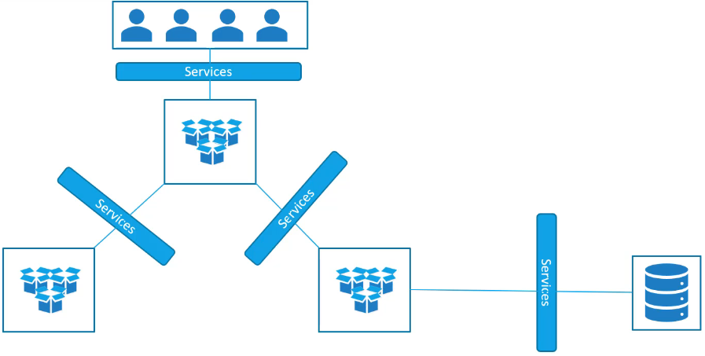
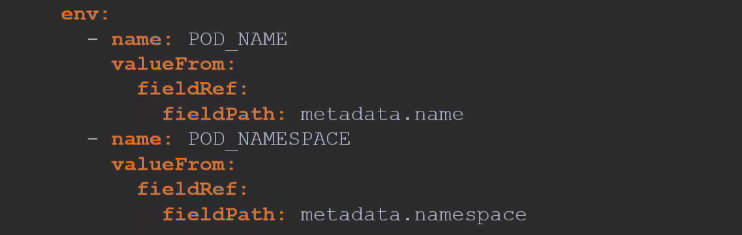
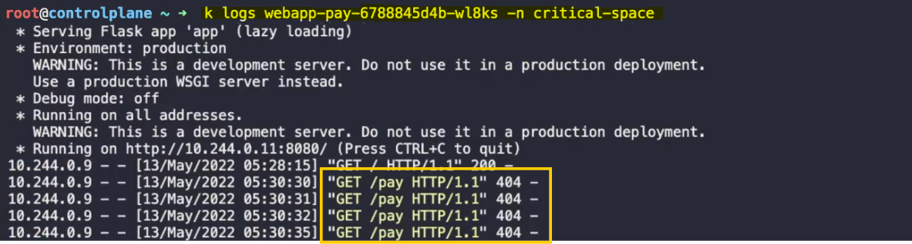
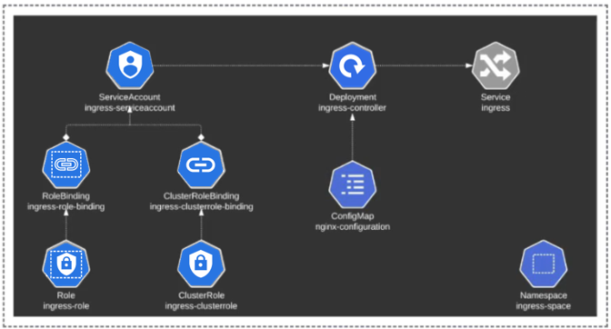
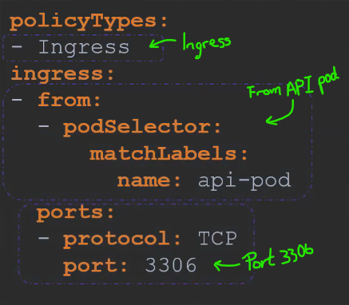
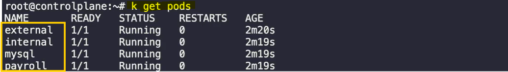

- [Services and Networking](#services-and-networking)
  - [Services](#services)
    - [Introduction](#introduction)
    - [Purpose of Services](#purpose-of-services)
    - [Use Case](#use-case)
    - [Accessing the Web Application](#accessing-the-web-application)
    - [Types of Services](#types-of-services)
    - [NodePort Service](#nodeport-service)
    - [Creating a NodePort Service](#creating-a-nodeport-service)
    - [Summary](#summary)
    - [Creating the Service](#creating-the-service)
    - [Service with Multiple Pods](#service-with-multiple-pods)
    - [Service Across Multiple Nodes](#service-across-multiple-nodes)
    - [Summary](#summary-1)
  - [Services - Cluster IP](#services---cluster-ip)
    - [Introduction](#introduction-1)
    - [Use Case](#use-case-1)
    - [Challenges](#challenges)
    - [Solution: Kubernetes Service](#solution-kubernetes-service)
    - [Benefits](#benefits)
    - [Creating a ClusterIP Service](#creating-a-clusterip-service)
  - [Demo: Services](#demo-services)
    - [Checking Existing Services](#checking-existing-services)
    - [Understanding Endpoints](#understanding-endpoints)
    - [Checking Deployments](#checking-deployments)
    - [Accessing the Web Application](#accessing-the-web-application-1)
  - [Ingress Networking](#ingress-networking)
    - [Introduction](#introduction-2)
    - [Services vs. Ingress](#services-vs-ingress)
    - [Scenario: Online Store Application](#scenario-online-store-application)
    - [Public Cloud Environment](#public-cloud-environment)
    - [Introducing New Services](#introducing-new-services)
    - [Ingress Solution](#ingress-solution)
    - [Summary](#summary-2)
    - [Configuring the Ingress Controller](#configuring-the-ingress-controller)
    - [Creating Ingress Resources](#creating-ingress-resources)
    - [Summary](#summary-3)
  - [Demo: Ingress Networking (1)](#demo-ingress-networking-1)
    - [Exploring the Setup](#exploring-the-setup)
    - [Identifying Ingress Controller Details](#identifying-ingress-controller-details)
    - [Identifying Application Details](#identifying-application-details)
    - [Identifying Ingress Resource Details](#identifying-ingress-resource-details)
    - [Viewing Ingress Service](#viewing-ingress-service)
    - [Changing Application URLs](#changing-application-urls)
    - [Adding New Application Path](#adding-new-application-path)
    - [Adding Critical Application](#adding-critical-application)
    - [Creating Ingress Resource for Critical Application](#creating-ingress-resource-for-critical-application)
    - [Troubleshooting Ingress Resource](#troubleshooting-ingress-resource)
    - [Summary](#summary-4)
  - [Demo: Ingress Networking (2)](#demo-ingress-networking-2)
    - [Setting Up the Environment](#setting-up-the-environment)
    - [Creating Namespace](#creating-namespace)
    - [Creating ConfigMap](#creating-configmap)
    - [Creating Service Account](#creating-service-account)
    - [Creating Roles and Role Bindings](#creating-roles-and-role-bindings)
    - [Deploying Ingress Controller](#deploying-ingress-controller)
    - [Creating Service for Ingress Controller](#creating-service-for-ingress-controller)
    - [Summary](#summary-5)
    - [Creating Ingress Resource for Applications](#creating-ingress-resource-for-applications)
    - [Troubleshooting Ingress Resource](#troubleshooting-ingress-resource-1)
    - [Summary](#summary-6)
  - [Network Policies](#network-policies)
    - [Introduction to Network Policies](#introduction-to-network-policies)
    - [Example Setup](#example-setup)
    - [Traffic Rules](#traffic-rules)
    - [Network Security in Kubernetes](#network-security-in-kubernetes)
    - [Implementing Network Policies](#implementing-network-policies)
    - [Creating a Network Policy](#creating-a-network-policy)
    - [Network Policy Definition](#network-policy-definition)
    - [Important Notes](#important-notes)
    - [Creating the Policy](#creating-the-policy)
    - [Summary](#summary-7)
  - [Developing Network Policies](#developing-network-policies)
    - [Detailed Example of Network Policies](#detailed-example-of-network-policies)
    - [Steps to Implement Network Policies](#steps-to-implement-network-policies)
    - [Handling Multiple Namespaces](#handling-multiple-namespaces)
    - [Allowing External Traffic](#allowing-external-traffic)
    - [Combining Selectors](#combining-selectors)
    - [Egress Rules](#egress-rules)
    - [Summary](#summary-8)
  - [Demo: Network Policies](#demo-network-policies)
    - [Inspecting the Environment](#inspecting-the-environment)
    - [Network Policy Details](#network-policy-details)
    - [Connectivity Tests](#connectivity-tests)
    - [Creating a New Network Policy](#creating-a-new-network-policy)

<br>

<hr style="height:4px;background:black">

<br>

# Services and Networking

## Services

### Introduction
* `Kubernetes Services`: Enable **communication** between various **components within** and **outside of** the **application**.

<br>

### Purpose of Services
* `Connectivity`: **Connect** applications with **other applications** or **users**.
  * **Example**: Groups of pods running different sections (front-end, back-end, external data source) communicate through services.

<bR>



<br>

### Use Case
* `External Communication`: Accessing a web application running on a pod **from an external user**.

`Setup`:
* **Kubernetes node IP**: 192.168.1.2
* **Laptop IP**: 192.168.1.10
* **Internal pod network**: 10.244.0.0
* **Pod IP**: 10.244.0.2

<br>


<br>

### Accessing the Web Application
* `SSH into Kubernetes Node`: Access the pod's webpage using **curl** or a **browser**.
* `Direct Access`: Use Kubernetes services to map requests from the node to the pod.

<br>


<br>

### Types of Services
1. `NodePort`:
   * **Function**: Makes an **internal port accessible** on a port on the **node**.
     * **Example**: Service listens to a port on the node and forwards requests to the pods.

<br>

2. `ClusterIP`:
   * **Function**: Creates a **virtual IP inside** the **cluster** for **communication** between services.
     * **Example**: Front-end servers communicate with back-end servers.

<br>

3. `LoadBalancer`:
   * **Function**: Provisions a **load balancer** for the application in supported cloud providers.
     * **Example**: Distributes load across web servers in the front-end tier.

<br>


<br>

### NodePort Service
`Ports Involved`:
* **Target Port**: Port on the pod where the web server is running (e.g., 80).
* **Service Port**: Port on the service object (e.g., 80).
* **Node Port**: Port on the node used to access the web server externally (e.g., 30008).

<br>


<br>

### Creating a NodePort Service
1. `Service Definition File`:

Template:

```yaml
apiVersion: v1
kind: Service
metadata:
  name: 
spec:
  type: NodePort
  ports:
  - port: 80
    targetPort: 80
    nodePort: 30008
  selector:
    app: myapp
    type: front-end
```

<br>


<br>

2. `Components`:
   * **API** Version: v1
   * **Kind**: Service
   * **Metadata**: Name of the service.
   * **Spec**:
     * **Type**: NodePort
     * **Ports**: Array of port mappings.
     * **Selector**: Labels to identify the pod.

<br>

3. `Creating the Service`:

Command:

```bash
kubectl create -f service-definition.yaml
```

<br>

### Summary
* `Kubernetes Services`: **Enable communication** between components and users.
* `Types of Services`: NodePort, ClusterIP, LoadBalancer.
* `NodePort Service`: **Maps a port** on the node to a port on the pod for **external access**.
* `Creating a Service`: Use a definition file with API version, kind, metadata, spec, ports, and selector.

<br>

### Creating the Service
1. `Create Service`:

Command:

```bash
kubectl create -f service-definition.yaml
```

<br>

2. `View Created Service`:

Command:

```bash
kubectl get services
```

* **Result**: Lists the service, cluster IP, and mapped ports. The type is NodePort, and the node port is set to 30008.

<br>


<br>

<br>

3. `Access Web Service`:

Command:

```bash
curl 192.168.1.2:30008
```

* **Result**: Accesses the web server using the node IP and node port.

<br>


<br>

<br>

### Service with Multiple Pods
1. `Multiple Instances`:
   * **Scenario**: Multiple instances of the web application running for high availability and load balancing.
   * **Labels**: All pods have the same **label** `app=my-app`.

<br>

2. `Service Creation`:
   * **Selector**: The service uses the label `app=my-app` as a **selector**.
   * **Result**: The service automatically selects all matching pods as endpoints to forward external requests.

<bR>

3. `Load Balancing`:
   * **Algorithm**: The service uses a **random algorithm** to **balance the load** across different pods.
   * **Function**: Acts as a **built-in load balancer** to distribute load.

<br>


<br>

<br>

### Service Across Multiple Nodes
1. `Distributed Pods`:
   * **Scenario**: Web application **pods** are **distributed** across **multiple nodes** in the cluster.

<br>

2. `Service Creation`:
   * **Function**: Kubernetes **automatically creates a service** that spans across all nodes in the cluster.
   * **Port Mapping**: Maps the **target port** to the **same node port** on all nodes.

<br>

3. `Access Application`:

Command:

```bash
curl <node-ip>:30008
```

* **Result**: Accesses the application using the IP of any node in the cluster and the same port number.

<br>


<br>

### Summary
* `Service Creation`: The process is the same regardless of whether there is a single pod, multiple pods on a single node, or multiple pods on multiple nodes.
* `Automatic Updates`: The service is automatically updated when pods are added or removed, making it highly flexible and adaptive.
* `No Additional Configuration`: Once created, no additional configuration changes are typically needed.

<br>

<hr style="height:4px;background:black">

<br>

## Services - Cluster IP

### Introduction
* `ClusterIP Service`: A type of Kubernetes service that **provides** a **single interface** to **access** a **group of pods** within the cluster.

<br>

### Use Case
* `Full Stack Web Application`: Different kinds of pods hosting various parts of an application (e.g., front-end web server, back-end server, Redis, MySQL).
* `Communication`: **Front-end** servers communicate with **back-end** servers, and **back-end** servers communicate with **databases** and **Redis** services.

<br>


<br>

### Challenges
* `Dynamic IPs`: Pods have **non-static IP addresses**, making it **unreliable** for internal communication.
* `Load Balancing`: **Deciding** which back-end pod to connect to from the front-end pod.

<br>

### Solution: Kubernetes Service
* `Grouping Pods`: A service **groups pods together** and **provides a single interface** to access them.
* `Random Forwarding`: Requests are **forwarded randomly** to one of the **pods under the service**.

<br>

### Benefits
* `Microservices Deployment`: Easily deploy a microservices-based application on Kubernetes.
* `Scalability`: Each layer can scale or move without impacting communication between services.
* `Service IP and Name`: Each service gets an IP and a name, used by other pods to access the service.

<br>

### Creating a ClusterIP Service
1. `Cluster IP Definition File`:

Template:


<br>

2. `Components`:
   * **API Version**: v1
   * **Kind**: Service
   * **Metadata**: Name of the service (backend).
   * **Spec**:
     * **Type**: ClusterIP (default type).
     * **Ports**: Array of port mappings (port and targetPort both set to 80).
     * **Selector**: Labels to identify the pods (app=backend-app).

<br>

3. `Creating the Service`:

Command:

```bash
kubectl create -f service-definition.yaml
```

<br>

4. `Checking Service Status`:

Command:

```bash
kubectl get services
```

* **Result**: Lists the created service, which can be accessed by other pods using the ClusterIP or service name.

<br>

<hr style="height:4px;background:black">

<br>

## Demo: Services

### Checking Existing Services
1. `List Services`:

Command:

```bash
kubectl get service
```

<br>

2. `Alternative Command`:

```bash
kubectl get svc
```

* **Result**: Lists the existing services. In this case, there is only one default service created by Kubernetes.

<Br>

3. `Service Type`:

Command:

```bash
kubectl get service
```
* **Result**: The type of the default Kubernetes service is ClusterIP.

<br>


<br>

4. `Target Port`:

Command:

```bash
kubectl describe service kubernetes
```

* **Result**: The target port configured on the Kubernetes service is 6443.

<br>


<bR>

<br>

5. `Labels on Service`:

Command:

```bash
kubectl describe service kubernetes
```

* **Result**: There are two labels: component=apiserver and provider=kubernetes.

<br>


<br>

<br>

6. `Endpoints on Service`:

Command:

```bash
kubectl describe service kubernetes
```

* **Result**: There is one endpoint attached to the Kubernetes service.

<br>


<bR>

<br>

### Understanding Endpoints
* `Endpoints`: The **pods** that a **service directs traffic to**, **based** on the **selectors** specified on the **service** and the **labels** on the **pods**.

Example:
* Service with label app=frontend directs traffic to pods with the same label.
* Endpoints are the IPs and ports of these pods.

<br>

### Checking Deployments
1. `List Deployments`:

Command:

```bash
kubectl get deployments
```

* **Result**: There is one deployment in the default namespace.

<br>


<br>

2. `Image Used in Deployment`:

Command:

```bash
kubectl describe deployment <deployment-name>
```

* **Result**: The image used to create the pods in the deployment is codecloud/simple-web-app-red.

<br>


<br>

### Accessing the Web Application
1. `Check Web App UI`:
   * **Action**: Click the web app link.
   * **Result**: Displays a "Bad Gateway" error because there is no service created.

<br>

2. `Create a Service`:
   * **Service Definition File**: service-definition.yaml

Template:


<br>

3. `Create Service`:

Command:

```bash
kubectl create -f service-definition.yaml
```

<br>

4. `Check Service`:

Command:

```bash
kubectl get services
```

<br>

5. `Access Web App`:
   * **Action**: Click the web app link again.
   * **Result**: The web application is now accessible.

<br>

<hr style="height:4px;background:black">

<br>

## Ingress Networking

### Introduction
* `Ingress`: A Kubernetes resource that **manages external access to services** within a cluster, providing **URL-based routing**, **SSL termination**, and **load balancing**.

<bR>

### Services vs. Ingress
* `Services`: **Enable communication between pods** and **expose applications** to the **outside world** using NodePort or LoadBalancer.
* `Ingress`: Provides a **single entry point** for **external traffic**, **routing requests** to **different services** based on **URL paths** and **implementing SSL**.

<br>

### Scenario: Online Store Application
1. `Application Deployment`:
   * Deploy the application as a **pod** in a deployment.
   * Deploy a **MySQL database** as a **pod** and create a **ClusterIP service** called "MySQL Service" for internal access.

<br>

2. `External Access`:
   * Create a **NodePort service** to expose the application on a high port (e.g., 38080).
   * Users access the application using the **node IP** and **port**.

<br>

3. `DNS Configuration`:
   * Configure **DNS** to point to the **node IP**, allowing users to access the application using a **URL** (e.g., my-online-store.com:38080).

<br>

4. `Proxy Server`:
   * Use a proxy server to **map requests on port 80** to the **NodePort service**, allowing users to **access the application without specifying the port**.

<br>


<br>

### Public Cloud Environment
1. `LoadBalancer Service`:
   * Use a **LoadBalancer service** instead of NodePort.
   * Kubernetes provisions a **network load balancer** on the cloud, providing an **external IP** for users to access the application.

<br>

2. `DNS Configuration`:
   * Point DNS to the **load balancer's external IP**, allowing users to access the application using a **URL** (e.g., my-online-store.com).

<br>


<br>

### Introducing New Services
1. `New Application`:
   * Deploy a new video streaming service as a separate deployment within the same cluster.
   * Create a LoadBalancer service for the new application.

<br>

2. `URL-Based Routing`:
   * Users access the new service using a URL path (e.g., my-online-store.com/watch).
   * Existing application accessible at my-online-store.com/wear.

<br>

3. `Challenges`:
   * Managing multiple load balancers increases costs and complexity.
   * Configuring SSL and URL-based routing requires additional setup.

<br>


<br>

### Ingress Solution
1. `Ingress Benefits`:
   * Provides a **single**, **externally accessible URL** for multiple services.
   * **Routes traffic** based on **URL paths** and **implements SSL security**.
   * Acts as a **layer 7 load balancer** within the Kubernetes cluster.

<br>


<br>

<br>

2. `Ingress Controller`:
   * Deploy an Ingress controller (e.g., NGINX, GCE) to **manage Ingress resources**.
   * Ingress controllers **monitor the cluster** for **new Ingress resources** and **configure** the **load balancer** accordingly.

<br>


<br>

<br>

3. `Ingress Resources`:
   * Define **Ingress rules** using Kubernetes **definition files**.
   * Configure URL **routes**, SSL **certificates**, and load balancing **settings**.

<br>

4. `Example`:
   * Deploy an NGINX Ingress controller as a Kubernetes deployment.
   * Use a config map to manage NGINX configuration options.

<br>

### Summary
* `Ingress`: Simplifies external access, **URL-based routing**, and **SSL termination** for Kubernetes services.
* `Ingress Controller`: **Manages Ingress resources** and **configures the load balancer**.
* `Ingress Resources`: **Define routing rules** and **SSL settings** using Kubernetes definition files.

<br>

### Configuring the Ingress Controller
1. `Config Map`:
   * **Purpose**: Decouples configuration data from the NGINX controller image.
   * **Benefit**: Allows easy modification of configuration settings without altering NGINX configuration files.

<br>


<br>

<br>

2. `Environment Variables`:
   * **Purpose**: Pass the path's name and namespace to the NGINX service for reading configuration data.

<br>



<br>

<br>

3. `Ports`:
   * **Ingress Controller Ports**: 80 and 443.

<br>


<br>

<br>

4. `Service to Expose Ingress Controller`:
   * **Type**: NodePort.
   * **Selector**: NGINX Ingress label to link the service to the deployment.

<br>


<br>

<br>

5. `Service Account`:
   * **Purpose**: Provides the Ingress controller with the necessary permissions to access Kubernetes objects.

<br>


<br>

<br>

6. `Summary`:
   * **Components**: 
     * Deployment of NGINX Ingress image.
     * Service to expose it.
     * Config map for configuration data.
     * Service account with permissions.

<br>

 

<br>


<br>

<br>

### Creating Ingress Resources
1. `Ingress Resource`:
   * **Purpose**: Set of **rules and configurations** applied to the Ingress controller.
   * **Function**: **Routes traffic** to different applications **based on URL paths** or **domain names**.

<br>

2. `Single Backend`:
   * **Definition File**: Ingress-wear.yaml

<br>

Template:

<br>


<br>

<br>

3. `Creating Ingress Resource`:

Command:

```bash
kubectl create -f Ingress-wear.yaml
```

<br>

4. `Viewing Ingress Resource`:

Command:

```bash
kubectl get ingress
```

<Br>


<br>

<br>

5. `Using Rules for URL-Based Routing`:

<br>

For example:


<br>

<br>

Template:

```yaml
apiVersion: extensions/v1beta1
kind: Ingress
metadata:
  name: ingress
spec:
  rules:
  - host: my-online-store.com
    http:
      paths:
      - path: /wear
        backend:
          serviceName: wear-service
          servicePort: 80
      - path: /watch
        backend:
          serviceName: watch-service
          servicePort: 80
```

<br>


<br>

<br>

6. `Default Backend`:
   * **Purpose**: Handles requests that do not match any specified paths, displaying a "404 not found" error page.

<br>


<bR>

<br>

7. `Domain Name-Based Routing`:
   * Having two domain names, means we need two rules.

<br>


<br>

Template:

<br>


<br>

<br>

8. `Comparison`:
   1. **URL-Based Routing**: One rule with multiple paths.
   2. **Domain Name-Based Routing**: Multiple rules with one path each.

<br>


<br>

<bR>

### Summary
* `Ingress Controller`: Manages Ingress resources and configures the load balancer.
* `Ingress Resources`: Define routing rules and SSL settings using Kubernetes definition files.
* `Configuration`: Use config maps, environment variables, and service accounts to manage Ingress settings.

<br>

<hr style="height:4px;background:black">

<br>

## Demo: Ingress Networking (1)

### Exploring the Setup
1. `Check Nodes`:

Command:

```bash
kubectl get nodes
```

* **Result**: Single node.

<br>

2. `Check Deployments`:

Command:

```bash
kubectl get deployments
```

* **Result**: No deployments in the default namespace.

<br>

3. `Check All Namespaces`:

Command:

```bash
kubectl get deployments --all-namespaces
```

* **Result**: Deployments in appspace, Ingress-NGINX, and kube-system namespaces.

<br>

4. `Check Ingress Controller`:

Command:

```bash
kubectl get pods -n Ingress-NGINX
```

* **Result**: Ingress controller is in the Ingress-NGINX namespace.

<br>


<br>

### Identifying Ingress Controller Details
1. `Namespace of Ingress Controller`:
   * **Result**: Ingress-NGINX.

2. `Name of Ingress Controller Deployment`:

Command:

```bash
kubectl get deployments -n Ingress-NGINX
```

* **Result**: Ingress-NGINX-controller.

<br>


<br>

### Identifying Application Details
1. `Namespace of Applications`:
   * **Result**: appspace.

2. `Number of Applications`:

Command:

```bash
kubectl get pods -n appspace
```

* **Result**: Three applications.

<br>


<br>

### Identifying Ingress Resource Details
1. `Namespace of Ingress Resource`:

Command:

```bash
kubectl get ingress --all-namespaces
```

* **Result**: appspace.

<br>


<br>

* **Name of Ingress Resource**: Ingress-wear-watch.
* **Host Configured on Ingress Resource**: * (all hosts).

<br>

<bR>

2. `Backend for Wear Path`:

Command:

```bash
kubectl describe ingress Ingress-wear-watch -n appspace
```

* **Result**: wear-service.

<br>


<br>

* **Path for Video Streaming Application**: /watch.
* **Default Backend Service**: default-http-backend.

<br>

### Viewing Ingress Service
1. `Access Ingress Service`:
   * **Action**: Click the Ingress service tab.
   * **Result**: Displays a "404 not found" error page.

<br>


<br>

<br>

2. `View Applications`:
   * **Action**: Append /wear and /watch to the URL.
   * **Result**: Displays the wear and video streaming applications.

<Br>


<br>

### Changing Application URLs
1. `Edit Ingress Resource`:

Command:

```bash
kubectl edit ingress Ingress-wear-watch -n appspace
```

* **Action**: Change the path for the video streaming application from /watch to /stream.

<br>

<bR>

2. `Verify Changes`:
   * **Action**: Refresh the URL with /stream.
   * **Result**: Displays the video streaming application.

<br>


<br>

### Adding New Application Path
1. `Inspect New Deployments`:

Command:

```bash
kubectl get deployments -n appspace
```

* **Result**: New food application.

<br>


<br>

<Br>

2. `Edit Ingress Resource`:

Command:

```bash
kubectl edit ingress Ingress-wear-watch -n appspace
```

* **Action**: Add a new path /eat for the food-service.

<br>


<br>

<br>

3. `Verify Changes`:
   * **Action**: Refresh the URL with /eat.
   * **Result**: Displays the food service application.

<br>


<br>

### Adding Critical Application
1. `Identify Namespace`:

Command:

```bash
kubectl get pods --all-namespaces
```

* **Result**: New namespace critical-space.

<br>


<br>

<br>

2. `Identify Deployment`:

Command:

```bash
kubectl get deployments -n critical-space
```

* **Result**: webapp-pay.

<br>


<br>

<br>

3. `Find Create Resource`:

```bash
kubectl create ingress -h
```


<br>

<br>

### Creating Ingress Resource for Critical Application
1. `Create Ingress Resource`:

Command Format:

```bash
kubectl create ingress -ingresspay --rule="pay/*=pay-service:8282" -n critical-space
```

Command Used:

```bash
kubectl create ingress ingress-pay -n critical-space --rule="/pay=pay-service:8282"
``` 

<br>


<br>

<br>

2. `Verify Ingress Resource`:

Command:

```bash
kubectl get ingress -n critical-space
```

* **Result**: Ingress resource Ingress-pay is created.

<br>


<br>

<br>

3. `Check Ingress Resource`:

Command:

```bash
kubectl describe ingress Ingress-pay -n critical-space
```

* **Result**: Ingress resource routes traffic from /pay to pay-service.

<br>


<br>

<br>

4. `Test Ingress Resource`:
   * **Action**: Access the URL with /pay.
   * **Result**: Displays a "404 not found" error.

<br>


<br>

### Troubleshooting Ingress Resource
1. `Check Application Logs`:

Command:

```bash
kubectl logs <pod-name> -n critical-space
```

* **Result**: Requests are coming in as /pay, but the application does not have a /pay path.

<br>




<bR>

<br>

2. `Add Rewrite Annotation`:

Command:

```bash
kubectl edit ingress Ingress-pay -n critical-space
```

* **Action**: Add the following annotation to the metadata section:

```yaml
annotations:
  nginx.ingress.kubernetes.io/rewrite-target: /
```

<br>


<br>

<br>

3. `Verify Changes`:
   * **Action**: Refresh the URL with /pay.
   * **Result**: The application works as expected.

<br>


<br>

### Summary
* `Creating Ingress Resource`: Use the kubectl create ingress command with appropriate rules and namespace.
* `Troubleshooting`: Check application logs and add rewrite annotations if necessary.
* `Verification`: Ensure the Ingress resource routes traffic correctly and the application works as expected.

<br>

<hr style="height:4px;background:black">

<br>

## Demo: Ingress Networking (2)

### Setting Up the Environment
1. `Check Existing Applications`:

Command:

```bash
kubectl get pods -n appspace
```

* **Result**: Lists the video and wear applications.

<br>


<br>

### Creating Namespace
1. `Create Namespace`:

Command:

```bash
kubectl create namespace ingress-space
```

* **Result**: Namespace ingress-space is created.

<br>

### Creating ConfigMap
1. `Create ConfigMap`:

Command:

```bash
kubectl create configmap nginx-config -n ingress-space
```

* **Result**: ConfigMap nginx-config is created in the ingress-space namespace.

<br>


<br>

### Creating Service Account
1. `Create Service Account`:

Command:

```bash
kubectl create serviceaccount ingress-service-account -n ingress-space
```

* **Result**: Service account ingress-service-account is created in the ingress-space namespace.

<br>


<br>

### Creating Roles and Role Bindings
1. `Get Roles and Role Bindings`:

Command:

```bash
kubectl get roles -n ingress-space
kubectl get rolebindings -n ingress-space
```

* **Result**: Roles and role bindings are created for the service account.

<br>


<br>

<br>

2. `Describe Roles`:

```bash
kubectl describe role ingress-role -n ingress space
```

<br>


<br>


<br>

### Deploying Ingress Controller
1. `Create Deployment`:

Command:

```bash
kubectl apply -f ingress-controller-deployment.yaml -n ingress-space
```

* **Result**: Ingress controller deployment is created.

<br>


<br>

<br>

2. `Fix YAML Issues`:
   * **Action**: Edit the deployment file to fix spacing issues and specify the correct namespace.

```bash
vim ingress-controller.yaml
```

<br>


<br>

<br>

3. `Check Deployment Status`:

Command:

```bash
kubectl get pods -n ingress-space
```

* **Result**: Ingress controller is in a creating state, then successfully deployed.

<br>


<br>



<br>

### Creating Service for Ingress Controller
1. `Expose Deployment`:

Command:

```bash
kubectl expose deployment ingress-controller -n ingress-space --name=ingress --port=80 --target-port=80 --type=NodePort
```

* **Result**: Service ingress is created with a NodePort.

<br>


<br>

<br>

2. `Edit NodePort`:

Command:

```bash
kubectl edit service ingress -n ingress-space
```

* **Action**: Change the NodePort to 30080.

<br>


<br>

<br>

3. `Verify Service`:

Command:

```bash
kubectl get svc -n ingress-space
```

* **Result**: Service ingress is created with the correct NodePort.

<br>


<br>

### Summary
* `Setting Up`: Create namespace, ConfigMap, service account, roles, and role bindings.
* `Deploying Ingress Controller`: Create deployment, fix YAML issues, and check status.
* `Creating Service`: Expose deployment, edit NodePort, and verify service.

<br>

### Creating Ingress Resource for Applications
1. `Create Ingress Resource`:
   * Here we are creating two rules for: wear and watch.

Command:

```bash
kubectl create ingress ingress-wear-watch -n appspace --rule="/wear=wear-service:8080" --rule="/watch=video-service:8080"
```

<br>


<br>

<br>

2. `Verify Ingress Resource`:

Command:

```bash
kubectl get ingress -n appspace
```

* **Result**: Ingress resource ingress-wear-watch is created.

<br>


<br>

<Br>

3. `Check Ingress Resource`:

Command:

```bash
kubectl describe ingress ingress-wear-watch -n appspace
```

* **Result**: Ingress resource routes traffic from /wear to wear-service and from /watch to video-service.

<br>


<br>

<br>

4. `Test Ingress Resource`:
   * **Action**: Access the URLs with /wear and /watch.
   * **Result**: The applications are not accessible.

<br>


<br>

### Troubleshooting Ingress Resource
1. `Check the Pods`:
   * This is to get the name of the pod we want to check. 
   * We will be checking them both seperately.

```bash
kubectl get pods -n app-space
```

<br>


<br>

<br>


2. `Check Application Logs`:

Command:

```bash
kubectl logs <pod-name> -n appspace
```

* **Result**: Requests are not reaching the applications.

<Br>


<br>

<br>

3. `Check Ingress Controller Logs`:

Command:

```bash
kubectl logs <ingress-controller-pod-name> -n ingress-space
```

* **Result**: Logs show "too many redirects" errors due to SSL redirect (308).

<br>


<br>

<br>

4. `Add Annotations to the ingress service`:

Command:

```bash
kubectl get ingress -n app-space

kubectl edit ingress ingress-wear-watch -n appspace
```

* **Action**: Add the following annotations to the metadata section:

```yaml
annotations:
  nginx.ingress.kubernetes.io/rewrite-target: /
  nginx.ingress.kubernetes.io/ssl-redirect: "false"
```

<br>


<br>

<br>

4. `Verify Changes`:
   * **Action**: Refresh the URLs with /wear and /watch.
   * **Result**: The applications are now accessible.

<br>


<br>

### Summary
* `Creating Ingress Resource`: Use the kubectl create ingress command with appropriate rules and namespace.
* `Troubleshooting`: Check application and Ingress controller logs, and add necessary annotations.
* `Verification`: Ensure the Ingress resource routes traffic correctly and the applications are accessible.

<br>

<hr style="height:4px;background:black">

<br>

## Network Policies

### Introduction to Network Policies
* `Network Policies`: Used to **control the flow of traffic** between pods in a Kubernetes cluster.

`Types of Traffic`:
* **Ingress**: Incoming traffic to a pod.
* **Egress**: Outgoing traffic from a pod.

<br>


<br>

### Example Setup
`Components`:
* **Web Server**: Serves front-end to users (port 80).
* **API Server**: Serves backend APIs (port 5000).
* **Database Server**: Stores data (port 3306).

`Traffic Flow`:
* User -> Web Server (port 80) -> API Server (port 5000) -> Database Server (port 3306).

<br>


<br>

### Traffic Rules
`Web Server`:
* **Ingress**: Accept HTTP traffic on port 80.
* **Egress**: Allow traffic to port 5000 on the API server.

`API Server`:
* **Ingress**: Accept traffic on port 5000.
* **Egress**: Allow traffic to port 3306 on the database server.

`Database Server`:
* **Ingress**: Accept traffic on port 3306.

<br>


<br>

### Network Security in Kubernetes
* `Default Configuration`: **All pods can communicate** with each other by **default**.
* `Network Policy`: Used to **restrict communication** between pods.

<br>

### Implementing Network Policies
* `Scenario`: **Prevent the front-end web server** from **communicating directly** with the **database server**.
* `Solution`: Implement a **network policy** to **allow traffic** to the **database server** only **from the API server**.

<br>

### Creating a Network Policy
* `Labels and Selectors`: Use **labels** to **link the network policy** to the **target pod**.
* `Policy Types`: Specify whether the rule is for **ingress**, **egress**, or **both**.
* `Ingress Rule`: **Allow traffic** from the **API pod** to the **database pod** on port **3306**.

<br>

 

<br>

### Network Policy Definition




<br>

<br>

`Template`:


<br>

### Important Notes
* `Isolation`: Ingress or egress isolation only takes effect if **specified** in the **policy types**.
* `Network Solutions`: Not all network solutions support network policies. 
  * Supported solutions include Cube Router, Calico, Romana, and Weave Net. 
  * Flannel does not support network policies.

<br>

### Creating the Policy
Command:

```bash
kubectl create -f network-policy.yaml
```

<br>

### Summary
* `Network Policies`: Control traffic flow between pods.
* `Implementation`: Use labels, selectors, and policy types to define rules.
* `Support`: Ensure the network solution supports network policies.

<br>

<hr style="height:4px;background:black">

<br>

## Developing Network Policies

### Detailed Example of Network Policies
* `Scenario`: Protect the database pod to **allow access** only from the **API pod** on **port 3306**.

`Requirements`:
* **Block all traffic** to the **database** pod **except** from the **API pod**
* **Allow traffic** only on **port 3306**.

<br>


<br>

### Steps to Implement Network Policies
1. `Create Network Policy`:
   * **Name**: db-policy
   * **Associate with Database Pod**: Use labels and selectors.

Example:


<br>

2. `Define Policy Types`:
   * ✔️ **Ingress**: Allow incoming traffic from the API pod.
   * ❌ **Egress**: Not required for this scenario.

<br>

3. `Specify Ingress Rules`:
   * **From**: Allow traffic from the API pod.
   * **Ports**: Allow traffic on port 3306.

Example:


<br>


<br>

### Handling Multiple Namespaces
1. `Namespace Selector`:
   * **Purpose**: Restrict traffic to specific **namespaces**.
   * The namespaceSelector helps in defining from what namespace traffic is allowed to reach the database pod.

Example:

```yaml
ingress:
- from:
  - podSelector:
      matchLabels:
        role: api
    namespaceSelector:
      matchLabels:
        environment: prod
```

<br>


<br>

<br>

2. `Namespace Selector Only`:

Example:

```yaml
ingress:
- from:
  - namespaceSelector:
      matchLabels:
        environment: prod
```

* **Result**: In this case, all **pods within the specified namespace** will be **allowed** to **reach the database pod**, such as the web pod that we had earlier, but pods from outside this namespace won't be allowed to go through.

<br>

 

<br>

### Allowing External Traffic
1. `IP Block`:
   * **Purpose**: Allow traffic from specific IP addresses, e.g. backup servers.

Example:

```yaml
ingress:
- from:
  - ipBlock:
      cidr: 192.168.5.10/32
```

<br>


<br>


<br>

### Combining Selectors
* When you **combine selectors** in a **network policy**, you're specifying **multiple criteria** that **traffic** must **meet** to be **allowed**. 
  * These criteria can include pod selectors, namespace selectors, and IP blocks.


1. `Multiple Rules`:
   * Multiple rules in a network policy allow you to **specify different sets of criteria** that **traffic can meet** to be **allowed**. 
   * Each rule is **evaluated independently**, and if **any rule matches**, the **traffic is allowed**.

Example:

```yaml
ingress:
- from:
  - podSelector:
      matchLabels:
        role: api
  - namespaceSelector:
      matchLabels:
        environment: prod
- from:
  - ipBlock:
      cidr: 192.168.5.10/32
```

<br>


<br>

<br>

OR:
* This all depends on the dash (-).


<br>

<bR>

### Egress Rules
* `Scenario`: Allow the **database pod** to **send traffic** to an **external backup server**.

1. `Define Egress Rules`:
   * **To**: Allow traffic to the backup server.
   * **Ports**: Allow traffic on port 80.

<br>

Example:

<br>


<br>

### Summary
* `Network Policies`: Control traffic flow between pods and external sources.
* `Selectors`: Use podSelector, namespaceSelector, and ipBlock to define rules.
* `Policy Types`: Specify ingress and egress rules based on requirements.

<br>

<hr style="height:4px;background:black">

<br>

## Demo: Network Policies

### Inspecting the Environment
1. `Check Pods`:

Command:

```bash
kubectl get pods
```

* **Result**: Four pods - external, internal, MySQL (DB), and payroll.

<br>



<br>

<br>

2. `Check Services`:

Command:

```bash
kubectl get services
```

* **Result**: Four services - DB service (port 3306), external service (port 8080), internal service (port 8080), and payroll service (port 8080).

<bR>


<br>

<br>

3. `Check Network Policies`:

Command:

```bash
kubectl get networkpolicies
```

* **Result**: One network policy named payroll-policy.

<br>


<br>

### Network Policy Details
1. `Name of Network Policy`:
   * Result: payroll-policy.

2. `Pod Selector`:

Command:

```bash
kubectl describe networkpolicy payroll-policy
```

* **Result**: Applied on the pod named payroll.

<br>


<br>

<bR>

3. `Type of Traffic Handled`:
   * **Result**: Ingress traffic only.

<br>

4. `Impact of the Rule`:
   * **Allows**: Ingress traffic to port 8080 on the payroll pod from the internal pod.
   * **Blocks**: All other traffic to the payroll pod.

<br>

### Connectivity Tests
1. `Access UI of Applications`:
   * **Action**: Open the internal and external portals using the provided links.
   * **Result**: Internal portal (blue background) and external portal.

<br>

2. `Test Connectivity to Payroll Service`:
   * **Action**: Use the internal and external portals to test access to the payroll service on port 8080.

3. `Result`:
   * **Internal application**: Successful.
   * **External application**: Timed out.

<br>

4. `Test Connectivity to External Service`:
   * **Action**: Use the internal portal to test access to the external service on port 8080.
   * **Result**: Successful.

<br>

### Creating a New Network Policy
* `Objective`: Allow traffic from the internal application only to the payroll service and DB service.

<br>


<br>

<bR>

1. `Network Policy Definition: task`:
   * **Policy Name**: internal-policy
   * **Policy Type**: Egress
   * **Engress Allow**: payroll
   * **Payroll Port**: 8080
   * **Engress Allow**: mysql
   * **MySQL Port**: 3306

<br>

Template:

<br>


<br>

<br>

2. `Create Network Policy`:

Command:

```bash
kubectl apply -f internalPolicy.yaml
```

<br>

<br>

3. `Verify Network Policy`:

Command:

```bash
kubectl describe networkpolicy internal-policy
```

* **Result**: Confirms the egress rules to payroll (port 8080) and MySQL (port 3306).

<br>


<br>

<hr style="height:4px;background:black">

<br>