- [State Persistence](#state-persistence)
  - [Volumes](#volumes)
    - [Introduction to Volumes](#introduction-to-volumes)
    - [Volumes in Kubernetes](#volumes-in-kubernetes)
    - [Simple Implementation of Volumes](#simple-implementation-of-volumes)
    - [Volume Storage Options](#volume-storage-options)
    - [Example: AWS Elastic Block Store (EBS)](#example-aws-elastic-block-store-ebs)
    - [Summary](#summary)
  - [Persitent Volumes](#persitent-volumes)
    - [Introduction to Persistent Volumes](#introduction-to-persistent-volumes)
    - [Creating Persistent Volumes](#creating-persistent-volumes)
    - [Storage Solutions](#storage-solutions)
    - [Example: AWS Elastic Block Store (EBS)](#example-aws-elastic-block-store-ebs-1)
    - [Summary](#summary-1)
  - [Persistent Volume Claims](#persistent-volume-claims)
    - [Introduction to Persistent Volume Claims](#introduction-to-persistent-volume-claims)
    - [Binding Process](#binding-process)
    - [Creating a Persistent Volume Claim](#creating-a-persistent-volume-claim)
    - [Binding PVC to PV](#binding-pvc-to-pv)
    - [Deleting a PVC](#deleting-a-pvc)
    - [Summary](#summary-2)
  - [Demo: Persistent Volume and Persistent Volume Claims](#demo-persistent-volume-and-persistent-volume-claims)
    - [Inspecting the Pod](#inspecting-the-pod)
    - [Configuring a Volume](#configuring-a-volume)
    - [Creating a Persistent Volume](#creating-a-persistent-volume)
    - [Creating a Persistent Volume Claim](#creating-a-persistent-volume-claim-1)
    - [Troubleshooting Binding Issues](#troubleshooting-binding-issues)
    - [Troubleshooting Binding Issues](#troubleshooting-binding-issues-1)
    - [Updating the Pod to Use PVC](#updating-the-pod-to-use-pvc)
    - [Reclaim Policy and Deleting PVC](#reclaim-policy-and-deleting-pvc)
  - [Storage Classes](#storage-classes)
    - [Introduction to Storage Classes](#introduction-to-storage-classes)
    - [Static vs. Dynamic Provisioning](#static-vs-dynamic-provisioning)
    - [Dynamic Provisioning](#dynamic-provisioning)
      - [How It Works](#how-it-works)
      - [Benefits](#benefits)
    - [Creating a Storage Class](#creating-a-storage-class)
    - [Using a Storage Class with PVC](#using-a-storage-class-with-pvc)
    - [Provisioners and Parameters](#provisioners-and-parameters)
    - [Example: Google Persistent Disk](#example-google-persistent-disk)
    - [Summary](#summary-3)
  - [Why Stateful Sets?](#why-stateful-sets)
    - [Introduction to Stateful Sets](#introduction-to-stateful-sets)
    - [Why Stateful Sets?](#why-stateful-sets-1)
    - [Example: Deploying a MySQL Cluster](#example-deploying-a-mysql-cluster)
      - [Replication Steps](#replication-steps)
    - [Challenges with Deployments](#challenges-with-deployments)
    - [Benefits of Stateful Sets](#benefits-of-stateful-sets)
    - [Summary](#summary-4)
  - [Stateful Sets Introduction](#stateful-sets-introduction)
    - [Introduction to StatefulSets](#introduction-to-statefulsets)
    - [When to Use StatefulSets](#when-to-use-statefulsets)
    - [Creating a StatefulSet](#creating-a-statefulset)
    - [Benefits of StatefulSets](#benefits-of-statefulsets)
    - [Customising StatefulSets](#customising-statefulsets)
    - [Summary](#summary-5)
  - [Headless Services](#headless-services)
    - [Introduction to Headless Services](#introduction-to-headless-services)
    - [Purpose of Headless Services](#purpose-of-headless-services)
    - [Example: MySQL Cluster](#example-mysql-cluster)
    - [Creating a Headless Service](#creating-a-headless-service)
    - [Configuring Pods for Headless Services](#configuring-pods-for-headless-services)
    - [StatefulSets and Headless Services](#statefulsets-and-headless-services)
    - [Summary](#summary-6)
  - [Storage in Statefulness](#storage-in-statefulness)
    - [Recap of Storage in Kubernetes](#recap-of-storage-in-kubernetes)
    - [Dynamic Provisioning](#dynamic-provisioning-1)
    - [Storage in Stateful Sets](#storage-in-stateful-sets)
    - [Volume Claim Templates](#volume-claim-templates)
    - [Example Configuration](#example-configuration)
    - [Handling Pod Failures](#handling-pod-failures)
    - [Summary](#summary-7)

<br>

<hr style="height:4px;background:black">

<br>

# State Persistence

## Volumes

### Introduction to Volumes
`Docker Volumes`:
* `Transient Nature`: Docker **containers** are **temporary** and data is lost when the container is deleted.
* `Persistent Data`: Attach a **volume to retain data** even after the container is deleted.

<br>

### Volumes in Kubernetes
* `Transient Pods`: **Pods** in Kubernetes are also **temporary**, and data is lost when the pod is deleted.
* `Persistent Data`: Attach a volume to the pod to **retain data** even **after** the **pod is deleted**.

<br>

### Simple Implementation of Volumes
1. `Single Node Cluster`:
   * **Pod**: Generates a random number and writes it to /opt/number.out.
   * **Volume**: Created to store the data.
   * **Storage**: Configured to use a directory on the host (e.g., /data).

<br>

2. `Mounting the Volume`:
   * **Volume Mounts**: Mount the volume to a directory inside the container (e.g., /opt).
   * **Data Persistence**: The random number is written to the volume, which is stored on the host.

<br>

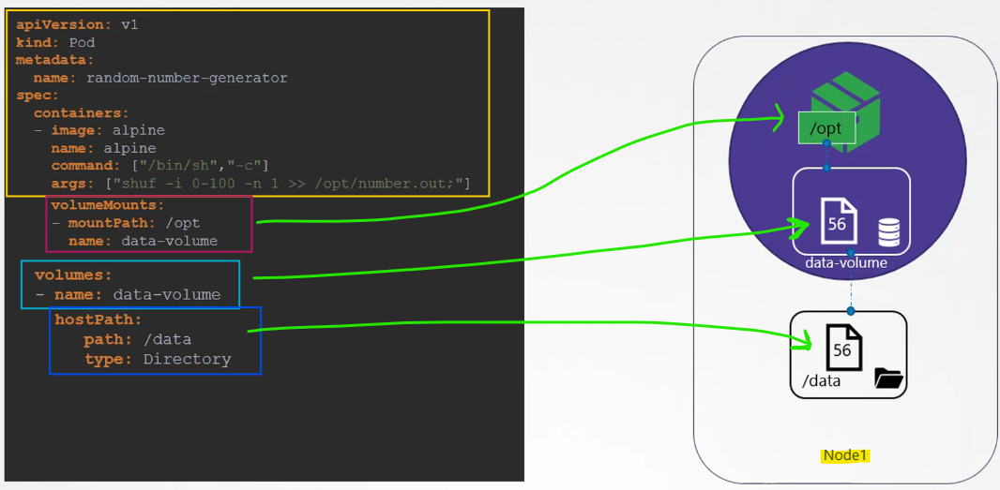

<br>

### Volume Storage Options
* `Host Path`: Configures storage directly on the host.
  * Suitable for **single-node clusters** but not recommended for multi-node clusters.
* `External Storage Solutions`:
  * NFS, Cluster FS, Flocker, Fiber Channel, CFS, Scale IO.
  * **Public Cloud Solutions**: AWS EBS, Azure Disk, Google Persistent Disk.

<br>

### Example: AWS Elastic Block Store (EBS)
`Configuration`:
* Replace **hostPath** field with **awsElasticBlockStore** field.
* Specify **volume ID** and **file system type**.
* **Storage**: Volume storage is now on AWS EBS.

<br>

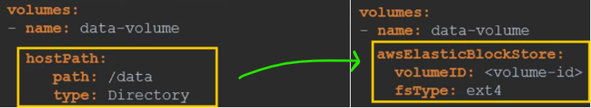

<br>

### Summary
* `Volumes in Kubernetes`: Used to retain data even after the pod is deleted.
* `Storage Options`: Various options available, including host path and external storage solutions.
  * **Example**: AWS EBS can be used as a storage option for volumes.

<br>

<hr style="height:4px;background:black">

<br>

## Persitent Volumes

### Introduction to Persistent Volumes
* `Persistent Volumes`: **Cluster-wide pool of storage volumes** configured by an administrator for use by users deploying applications on the cluster.
* `Purpose`: Centralise storage management and allow users to carve out storage as needed using persistent volume claims.

<br>

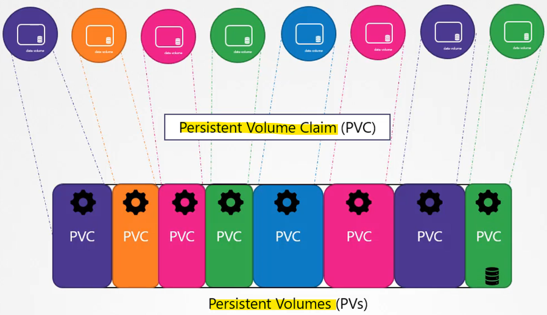

<br>

### Creating Persistent Volumes
1. `Base Template`:
   * **API Version**: Update to the appropriate version.
   * **Kind**: Set to PersistentVolume.
   * **Name**: Example - pv-vol-one.

<Br>

2. `Spec Section`:
   * **Access Modes**: Defines how the volume should be mounted.
     * **Options**: ReadOnlyMany, ReadWriteOnce, ReadWriteMany.
   * **Capacity**: Specify the amount of storage (e.g., 1 GB).
   * **Volume Type**: Start with the hostPath option (not recommended for production).

<br>

3. `Example Configuration`:

<br>

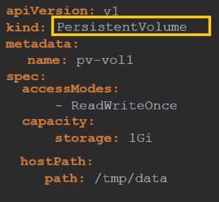

<br>

<br>

4. `Creating the Volume`:

Command:

```bash
kubectl create -f pv-definition.yaml
```

<br>

5. `Listing Persistent Volumes`:

Command:

```bash
kubectl get persistentvolumes
```

<br>

### Storage Solutions
* `Host Path`: Uses storage from the node's local directory (not recommended for production).
* `Supported Storage Solutions`: AWS Elastic Block Store (EBS), NFS, Cluster FS, Azure Disk, Google Persistent Disk, etc.

<br>

### Example: AWS Elastic Block Store (EBS)
1. `Configuration`:
   * Replace hostPath with awsElasticBlockStore.
   * Specify volume ID and file system type.

<br>

Example:

<br>

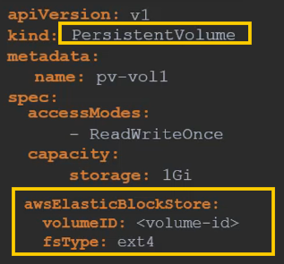

<br>

### Summary
* `Persistent Volumes`: Centralized storage management for Kubernetes clusters.
* `Configuration`: Define access modes, capacity, and storage type in the persistent volume definition.
* `Storage Solutions`: Various options available, including cloud-based solutions like AWS EBS.

<br>

<hr style="height:4px;background:black">

<br>

## Persistent Volume Claims

### Introduction to Persistent Volume Claims
* `Persistent Volumes` (PVs): **Cluster-wide storage volumes** created by an **administrator**.
* `Persistent Volume Claims` (PVCs): **Requests** for **storage** by **users** deploying applications.

<br>

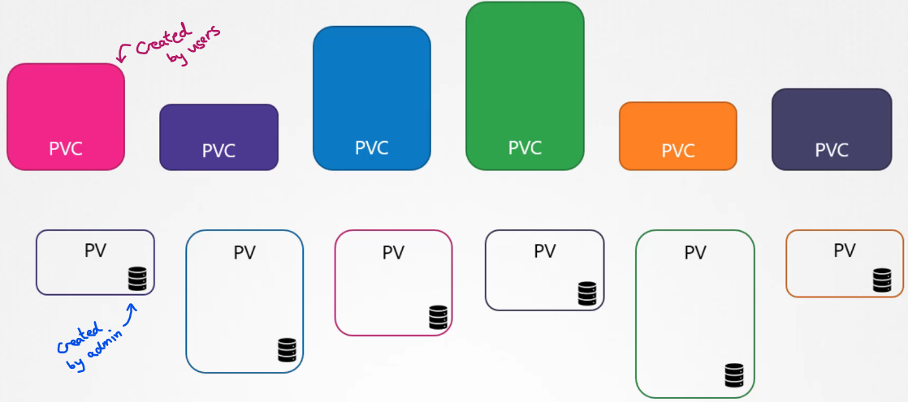

<br>

### Binding Process
* `Binding`: Kubernetes **binds PVCs to PVs** based on **capacity** and **other properties** (access modes, volume modes, storage class).
* `One-to-One Relationship`: Each **PVC** is **bound** to a **single PV**. 
  * No other claims can use the remaining capacity in the volume.

<br>

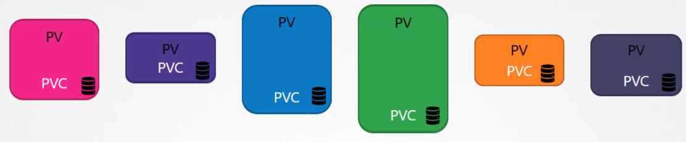

<br>

### Creating a Persistent Volume Claim
1. `Template`:
   * **API Version**: v1
   * **Kind**: PersistentVolumeClaim
   * **Name**: Example - my-claim

2. `Spec Section`:
   * **Access Modes**: ReadWriteOnce
   * **Resources**: Request storage of 500 MB

<br>

<br>

3. `Example Configuration`:

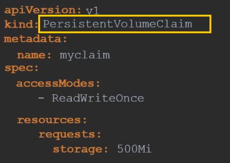

<br>

<br>

4. `Creating the Claim`:

Command:

```bash
kubectl create -f pvc-definition.yaml
```

<br>

5. `Viewing the Claim`:

Command:

```bash
kubectl get persistentvolumeclaims
```

* **Result**: The claim may be in a pending state until a suitable PV is available.

<br>


<br>

### Binding PVC to PV
* `Matching Criteria`: Kubernetes matches the PVC to a PV based on access modes and capacity.
* `Pending State`: If no suitable PV is available, the PVC remains in a pending state until a new PV is created.

<br>

### Deleting a PVC
Command:

```bash
kubectl delete persistentvolumeclaim my-claim
```

<br>

`Volume Reclamation Policies`:
* **Retain**: The PV remains until manually deleted by the administrator.
* **Delete**: The PV is automatically deleted when the PVC is deleted.
* **Recycle**: The data in the PV is scrubbed before making it available to other claims.

<Br>


<br>

### Summary
* `Persistent Volume Claims`: Requests for storage by users, bound to persistent volumes.
* `Binding Process`: Kubernetes matches PVCs to PVs based on criteria.
* `Reclamation Policies`: Define what happens to the PV when the PVC is deleted.

<br>

<hr style="height:4px;background:black">

<br>

## Demo: Persistent Volume and Persistent Volume Claims

### Inspecting the Pod
1. `Check Pod Status`:

Command:

```bash
kubectl get pods
```

* **Result**: The webapp pod is in a running state.

<br>

2. `View Logs`:

Command:

```bash
kubectl exec webapp -- cat /log/app.log
```

* **Result**: Displays the logs generated by the application.

<bR>

3. `Check Pod Configuration`:

Command:

```bash
kubectl describe pod webapp
```

* **Result**: No additional volumes configured, logs stored within the container.

<br>

### Configuring a Volume
1. `Edit Pod to Add Volume`:

Command:

```bash
kubectl edit pod webapp
```

<br>

2. `Add Volume`:

```yaml
volumes:
- name: log-volume
  hostPath:
    path: /var/log/webapp
```

<Br>

3. `Add Volume Mount`:

```yaml
volumeMounts:
- mountPath: /log
  name: log-volume
```

<br>

4. `Apply Changes`:

Command:

```bash
kubectl replace --force -f pod-definition.yaml
```

<br>

5. `Verify Volume Mount`:

<br>

6. `Check Path`:

```bash
ls /var/log/webapp
```

* **Result**: Logs are now stored at /var/log/webapp on the host.

<br>

### Creating a Persistent Volume
1. `Persistent Volume Definition`:

Template:

```yaml
apiVersion: v1
kind: PersistentVolume
metadata:
  name: pv-log
spec:
  capacity:
    storage: 100Mi
  accessModes:
  - ReadWriteMany
  persistentVolumeReclaimPolicy: Retain
  hostPath:
    path: /pv/log
```

<br>

2. `Create Persistent Volume`:

Command:

```bash
kubectl create -f pv.yaml
```

<br>

3. `Verify Persistent Volume`:

Command:

```bash
kubectl get persistentvolumes
```

* **Result**: Persistent volume pv-log is created with 100 Mi capacity.

<br>

### Creating a Persistent Volume Claim
1. `Persistent Volume Claim Definition`:

Template:

```yaml
apiVersion: v1
kind: PersistentVolumeClaim
metadata:
  name: claim-log-one
spec:
  accessModes:
  - ReadWriteOnce
  resources:
    requests:
      storage: 50Mi
```

<br>

2. `Create Persistent Volume Claim`:

Command:

```bash
kubectl create -f pvc.yaml
```

<br>

3. `Verify Persistent Volume Claim`:

Command:

```bash
kubectl get persistentvolumeclaims
```

* **Result**: The claim is in a pending state.

<br>

### Troubleshooting Binding Issues
1. `Check Persistent Volume State`:

Command:

```bash
kubectl get persistentvolumes
```

* **Result**: Persistent volume pv-log is in an available state.

<br>

2. `Reason for Pending State`:
   * ***Possible Issue**: The access modes or other properties may not match between the PVC and PV.
   * **Solution**: Ensure the access modes and other properties match between the PVC and PV.

<br>

### Troubleshooting Binding Issues
1. `Access Mode Mismatch`:
   * **Issue**: The Persistent Volume (PV) has an access mode of ReadWriteMany, while the Persistent Volume Claim (PVC) has ReadWriteOnce.
   * **Solution**: Update the access mode on the PVC to match the PV.

<br>

2. `Update PVC Access Mode`:

Command:

```bash
kubectl edit pvc claim-log-one
```

<br>

3. `Change Access Mode`:

```yaml
spec:
  accessModes:
  - ReadWriteMany
```

<br>

4. `Replace PVC`:

Command:

```bash
kubectl replace --force -f pvc.yaml
```

<br>

5. `Verify Capacity`:

Command:

```bash
kubectl get pvc claim-log-one
```

* **Result**: The PVC now has a capacity of 100 Mi.

<br>

### Updating the Pod to Use PVC
1. `Edit Pod to Use PVC`:

Command:

```bash
kubectl edit pod webapp
```

<bR>

2. `Update Volume Configuration`:

```yaml
volumes:
- name: log-volume
  persistentVolumeClaim:
    claimName: claim-log-one
```

<br>

3. `Replace Pod`:

Command:

```bash
kubectl replace --force -f pod-definition.yaml
```

<br>

`Verify Logs`:

`Check Path`:

```bash
ls /pv/log
```

* **Result**: Logs are now stored at /pv/log on the host.

<br>

### Reclaim Policy and Deleting PVC
1. `Reclaim Policy`:

Command:

```bash
kubectl get pv pv-log
```


* Result: The reclaim policy is set to Retain.

<bR>

2. `Effect of Deleting PVC`:
   * **Reclaim Policy**: The PV is not deleted but is not available for reuse.

Command:

```bash
kubectl delete pvc claim-log-one
```

<br>

3. `PVC Terminating State`:
   * **Issue**: The PVC is stuck in a terminating state because it is still associated with a pod.
   * **Solution**: Delete the pod using the PVC.

<br>

4. `Delete Pod`:

Command:

```bash
kubectl delete pod webapp
```

<br>

5. `Verify Deletion`:

Command:

```bash
kubectl get pvc
kubectl get pv
```

* **Result**: The PVC is deleted, and the PV is in a released state.

<br>

<hr style="height:4px;background:black">

<br>

## Storage Classes

### Introduction to Storage Classes
* `Storage Classes`: **Define a provisioner** that can **automatically provision storage** when an application requires it.
* `Purpose`: Automate the provisioning of persistent volumes (PVs) to avoid manual creation.

<br>

### Static vs. Dynamic Provisioning
1. `Static Provisioning`:
   * **Manually create a disk** on the **storage provider** (e.g., Google Cloud).
   * **Manually create a persistent volume** (PV) definition file.
   * **Bind the PV** to a persistent **volume claim** (PVC).

<br>

2. `Dynamic Provisioning`:
   * **Automatically provision storage** when a **PVC is created**.
   * Use a **storage class** to define the provisioner and parameters.

<br>

### Dynamic Provisioning

#### How It Works
* When a PVC is created, the **storage class automatically provisions** the required storage.
* The **provisioner specified** in the storage class **handles the creation** of the **storage resource** (e.g., a disk on Google Cloud).
* A **PV** is **automatically created** and **bound** to the **PVC**, making the storage available to the application.

<br>

#### Benefits
* `Automation`: Eliminates the need for manual intervention in creating and managing storage resources.
* `Efficiency`: Reduces the time and effort required to provision storage for applications.
* `Scalability`: Easily scales storage resources as needed without manual configuration.

<br>

### Creating a Storage Class
1. `Template`:
   * **API Version**: storage.k8s.io/v1
   * **Kind**: StorageClass
   * **Provisioner**: Example - kubernetes.io/gce-pd (Google Cloud Persistent Disk)

2. `Example Configuration`:

```yaml
apiVersion: storage.k8s.io/v1
kind: StorageClass
metadata:
  name: standard
provisioner: kubernetes.io/gce-pd
```

<br>

### Using a Storage Class with PVC
1. `PVC Definition`:
   * **Specify Storage Class**: Add storageClassName to the PVC definition.

Example:

```yaml
apiVersion: v1
kind: PersistentVolumeClaim
metadata:
  name: my-claim
spec:
  accessModes:
  - ReadWriteOnce
  storageClassName: standard
  resources:
    requests:
      storage: 1Gi
```

<br>

<br>

2. `Process`:
   * When the PVC is created, the storage class provisions a new disk with the required size.
   * A PV is automatically created and bound to the PVC.

<br>

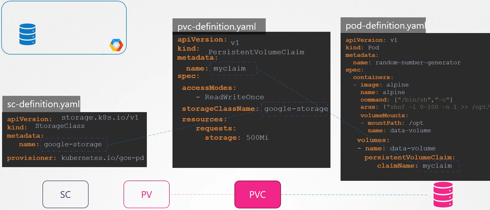

<br>

### Provisioners and Parameters
* `Provisioners`: Different storage providers (e.g., AWS EBS, Azure File, Azure Disk, CephFS, Portworx, ScaleIO).
* `Parameters`: Specific to the provisioner (e.g., disk type, replication type).

<br>

### Example: Google Persistent Disk
1. `Parameters`:
   * **Type**: Standard or SSD
   * **Replication Mode**: none or regional-pd

2. `Example Storage Classes`:
   * **Silver**: Standard disks
   * **Gold**: SSD drives
   * **Platinum**: SSD drives with replication

<br>

### Summary
* `Storage Classes`: Automate the provisioning of PVs using defined provisioners.
* `Dynamic Provisioning`: Simplifies storage management by automatically creating PVs when PVCs are created.
* `Provisioners`: Various options available, each with specific parameters.

<br>

<hr style="height:4px;background:black">

<br>

## Why Stateful Sets?

### Introduction to Stateful Sets
* `Stateful Sets`: A Kubernetes resource used to **manage stateful applications** that **require unique network identifiers** and **stable storage**.

<br>

### Why Stateful Sets?
* `Order of Deployment`: Ensures that pods are created in a specific order.
* `Stable Network Identity`: Provides each pod with a unique and stable hostname.
* `Persistent Storage`: Maintains a sticky identity for each pod, ensuring that storage is **retained even if the pod is rescheduled**.

<br>

### Example: Deploying a MySQL Cluster
1. `Traditional Deployment`:
   * **Single Server**: Install and set up MySQL on a physical server.
   * **High Availability**: Deploy additional servers and set up MySQL replication.

2. `Replication Topology`:
   * **Single Master, Multiple Slaves**: Master handles writes, slaves handle reads.

<br>

#### Replication Steps
1. Set up the **master server**, then slaves.
2. **Clone data from** the **master** to the **first slave**.
3. **Enable continuous replication from** the **master** to the **first slave**.
4. Wait for first slave to be ready.
5. **Clone data** from the **first slave** to the **second slave**.
6. **Enable continuous replication** from the **master** to the **second slave**.
7. Configure **master address** on slaves. 

<br>

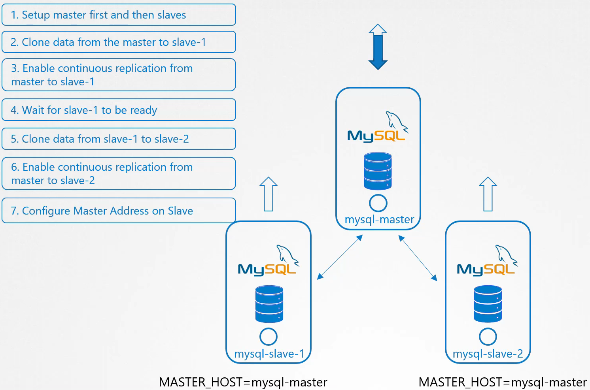

<br>

### Challenges with Deployments
* `Order of Pod Creation`: Deployments do not guarantee the order of pod creation.
* `Dynamic IP Addresses`: Pods get random names and IP addresses, making it difficult to maintain stable network identities.

<br>

### Benefits of Stateful Sets
1. `Sequential Pod Creation`:
   * Pods are created in a **specific order** (e.g., master first, then slaves).
   * Ensures that the **master** is **always deployed before the slaves**.

2. `Unique and Stable Hostnames`:
   * Pods are assigned **unique names** based on their **index** (e.g., mysql-0, mysql-1).
   * Hostnames remain stable even if pods are rescheduled.

3. `Sticky Identity`:
   * Each pod **maintains** its **identity** and **storage**, ensuring **data persistence**.
     * **Example**: mysql-0 is always the master, and slaves can reliably connect to it.

<bR>

### Summary
* `Stateful Sets`: Essential for **managing stateful applications** that **require stable network identities** and **persistent storage**.
* `Use Case`: Deploying a MySQL cluster with master-slave replication.
* `Benefits`: Sequential pod creation, unique hostnames, and sticky identity for each pod.

<br>

<hr style="height:4px;background:black">

<br>

## Stateful Sets Introduction

### Introduction to StatefulSets
* `StatefulSets`: A Kubernetes resource used to **manage stateful applications** that **require unique network identifiers** and **stable storage**.

<br>

### When to Use StatefulSets
`Use Cases`:
* Instances need to come up in a **specific order**.
* Instances require **stable** and **unique names**.
* **Evaluation**: Determine if StatefulSets are suitable based on application requirements.

<br>

### Creating a StatefulSet
1. `Definition File`:
   * **Template**: Similar to a deployment definition file with a pod definition template inside.
   * **Kind**: Change to StatefulSet (both 'S' in StatefulSet are uppercase).
   * **Service Name**: Specify the name of a headless service.

<br>

<br>

2. `Example Configuration`:

<br>

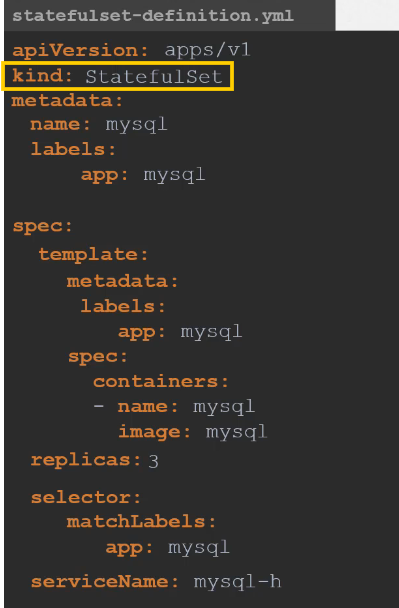

<br>

### Benefits of StatefulSets
1. `Ordered Graceful Deployment`:
   * Pods are created **one after the other** in a specific order.
   * Each pod must be **running** and **ready before** the **next one is created**.

<br>

2. `Stable and Unique DNS Records`:
   * Each pod gets a **stable** and **unique DNS record**.
   * **Other applications** can reliably **access the pods using** these **DNS records**.

<br>

3. `Scaling`:
   * **Scaling Up**: Pods are **added** in an **ordered fashion**.
   * **Scaling Down**: Pods are **removed** in the reverse order of their creation.

<br>

### Customising StatefulSets
`Pod Management Policy`:
* **Default**: OrderedReady (pods are created and terminated in order).
* **Parallel**: Deploy all pods in parallel while retaining stable network IDs.

<br>

### Summary
* `StatefulSets`: Essential for managing stateful applications that require stable network identities and ordered deployment.
* `Use Case`: Deploying applications like databases that need ordered startup and stable hostnames.
* `Customisation`: Use pod management policy to control the order of pod creation and termination.

<br>

<hr style="height:4px;background:black">

<br>

## Headless Services

### Introduction to Headless Services
* `Headless Services`: A type of Kubernetes service that does **not** have a **cluster IP** and does **not perform load balancing**. 
  * Instead, it provides DNS entries for each pod.

<br>

### Purpose of Headless Services
* `Stable DNS Records`: Provides **stable** and **unique DNS names** for each pod.
* `Direct Access`: Allows applications to **directly access specific pods without load balancing**.

<br>

### Example: MySQL Cluster
1. `StatefulSet Pods`:
   * Pods are created with **stable** and **unique names** (e.g., mysql-0, mysql-1, mysql-2).
   * **Slaves** can **point** to the **master** at **mysql-0**.

<br>

2. `Traditional Service`:
   * Acts as a **load balancer**, distributing traffic across **all pods**.
   * Not suitable for master-slave setups where writes must go to the master only.

<br>

3. `Headless Service`:
   * Does **not** have a **cluster IP**.
   * Creates **DNS entries** for each pod using the **pod name** and a **subdomain**.
     * **Example DNS entry**: mysql-0.mysql-h.default.svc.cluster.local.
       * Here it is broken up: `<podname.headless-servicename.namespace.svc.cluster-domain.example>`. 

<br>

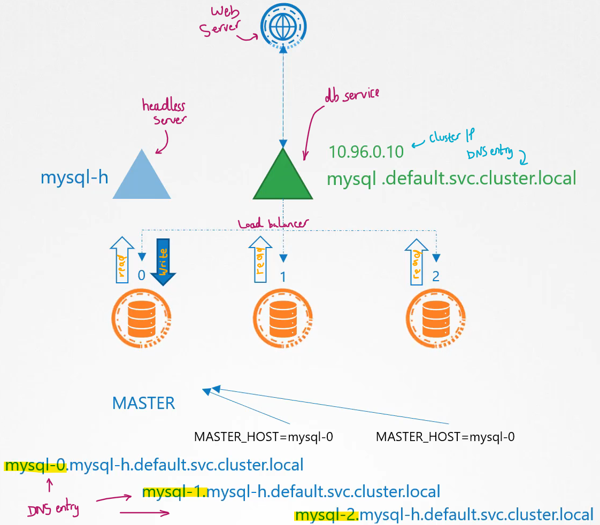

<br>

### Creating a Headless Service
1. `Service Definition File`:
   File name: headless-service.yaml

Template:

```yaml
apiVersion: v1
kind: Service
metadata:
  name: mysql-h
spec:
  clusterIP: None
  selector:
    app: mysql
  ports:
  - port: 3306
```

<br>

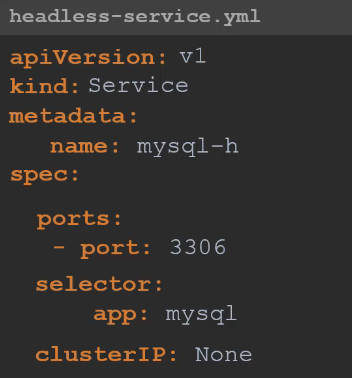

<br>

<br>

2. `Creating the Service`:

Command:

```bash
kubectl create -f headless-service.yaml
```

<br>

### Configuring Pods for Headless Services
1. `Pod Definition File`:
   * **File name**: pod-definition.yaml
   * **Fields**: hostname and subdomain.

Example:

```yaml
apiVersion: v1
kind: Pod
metadata:
  name: myapp-pod
spec:
  hostname: mysql-0
  subdomain: mysql-h
  containers:
  - name: mysql
    image: mysql:5.7
```

<br>

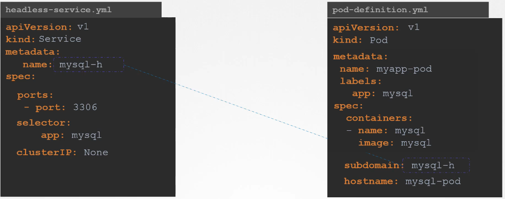

<br>

<br>

2. `DNS Records`:
   * **Condition**: DNS entries are created if hostname and subdomain are specified.
     * **Example DNS Entry**: mysql-0.mysql-h.default.svc.cluster.local.
       * Here it is broken up: `<podname.headless-servicename.namespace.svc.cluster-domain.example>`. 

<br>

### StatefulSets and Headless Services
1. `Automatic Assignment`:
   * StatefulSets **automatically assign** the correct **hostname** and **subdomain** based on the **headless service name**.
   * Ensures **each pod** gets a **unique DNS record**.

2. `Service Name`:
   * Specify the **headless service name** in the **StatefulSet** definition file.

Example:

```yaml
apiVersion: apps/v1
kind: StatefulSet
metadata:
  name: mysql
spec:
  serviceName: mysql-h
  replicas: 3
  selector:
    matchLabels:
      app: mysql
  template:
    metadata:
      labels:
        app: mysql
    spec:
      containers:
      - name: mysql
        image: mysql:5.7
```

<br>

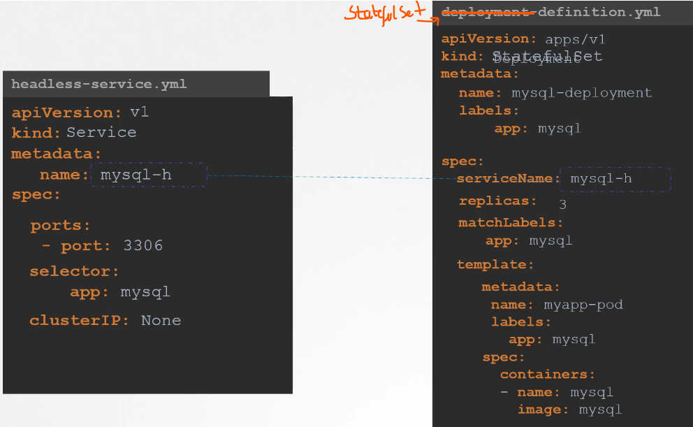

<br>

<br>

### Summary
* `Headless Services`: Provide stable DNS entries for each pod without load balancing.
* `Use Case`: Suitable for master-slave setups where specific pods need to be accessed directly.
* `StatefulSets`: Automatically assign hostnames and subdomains for pods, ensuring unique DNS records.

<br>

<hr style="height:4px;background:black">

<br>

## Storage in Statefulness

### Recap of Storage in Kubernetes
* `Persistent Volumes` (PVs): **Volume objects** created in Kubernetes.
* `Persistent Volume Claims` (PVCs): **Claims** made by users to **use the storage** in PVs.
* `Pod Definition Files`: PVCs are used **within pod definition files** to **provide storage to pods**.

<br>

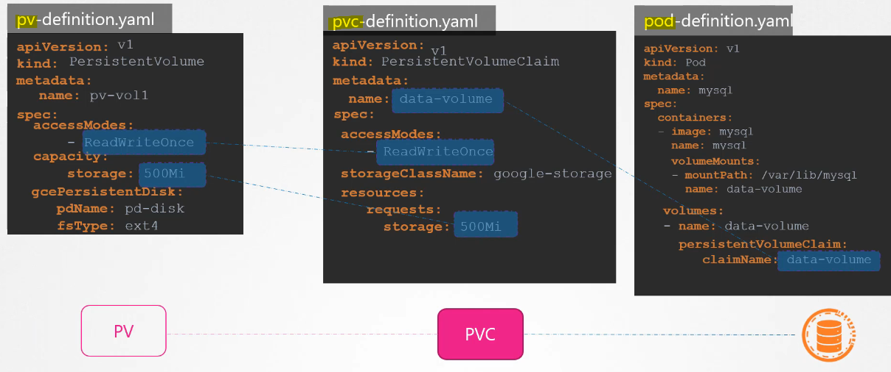

<br>

### Dynamic Provisioning
* `Storage Class Definition`: **Automates** the **creation** of PVs **using storage provisioners** on cloud providers.
* `Manual PVC Creation`: PVCs are still created manually and **associated with pods**.

<br>

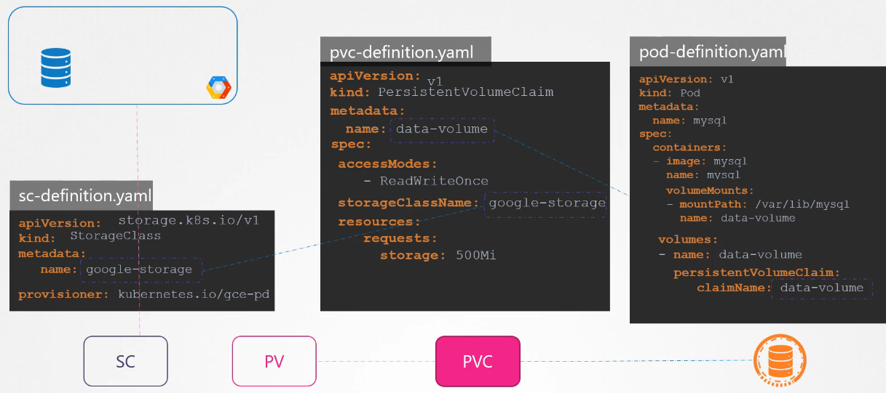

<br>

### Storage in Stateful Sets
1. `Shared Storage`:
   * **Single PVC**: All pods in a stateful set use the **same volume**.
   * **Use Case**: Multiple instances of an application share and access the same storage.
   * **Limitations**: Not all storage types support read/write from multiple instances simultaneously.

<br>

2. `Separate Storage for Each Pod`:
   * **Use Case**: MySQL replication where each pod needs its own local storage.
   * **Replication**: Data replication is managed at the **database level**.
   * **Requirement**: Each pod needs a **separate PVC** and **PV**.

<br>

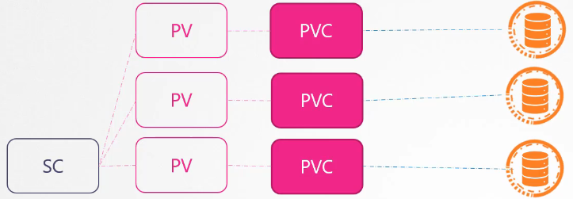

<br>

<br>

### Volume Claim Templates
* `Purpose`: Automatically create a **PVC for each pod** in a **stateful set**.
* `Definition`: Move the PVC definition into a section named **volumeClaimTemplates** under the **statefulset** specification.
* `Array`: volumeClaimTemplates is an **array**, allowing multiple templates.

<br>

### Example Configuration
1. `Stateful Set with Volume Claim Templates`:

<br>

Template:

<br>

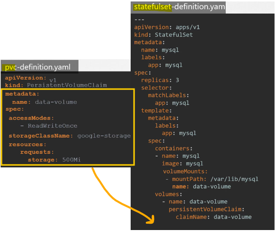

<br>

<br>

2. `Process`:
   * `First Pod`: Creates a PVC, provisions a volume, creates a PV, and binds the PVC to the PV.
   * `Subsequent Pods`: Repeat the process for each pod, ensuring each pod gets its own PVC and PV.

<br>

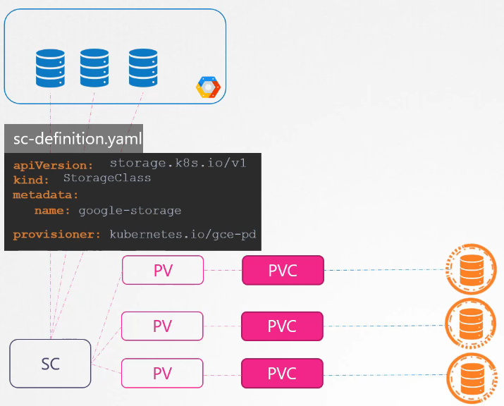

<br>

<br>

### Handling Pod Failures
* `Reattachment`: Stateful sets ensure that a pod is reattached to the same PVC it was attached to before.
* `Stable Storage`: Ensures stable storage for pods even if they are rescheduled or recreated.

<br>

### Summary
* `Stateful Sets`: Manage stateful applications that require stable storage and unique network identifiers.
* `Volume Claim Templates`: Automate the creation of PVCs for each pod in a stateful set.
* `Stable Storage`: Ensures that pods are reattached to the same PVCs, providing stable storage.

<br>

<hr style="height:4px;background:black">

<br>

