- [Section 12: Onwards to Kubernetes!](#section-12-onwards-to-kubernetes)
  - [The Why's and What's of Kubernetes](#the-whys-and-whats-of-kubernetes)
    - [What is Kubernetes?](#what-is-kubernetes)
    - [Why Use Kubernetes?](#why-use-kubernetes)
      - [Example Scenario](#example-scenario)
    - [Kubernetes Solution](#kubernetes-solution)
    - [How Kubernetes Works](#how-kubernetes-works)
    - [When to Use Kubernetes](#when-to-use-kubernetes)
  - [Kubernetes in Development and Production](#kubernetes-in-development-and-production)
    - [When to Use Kubernetes](#when-to-use-kubernetes-1)
    - [Development vs. Production](#development-vs-production)
    - [Minikube](#minikube)
    - [Managed Solutions](#managed-solutions)
    - [Setting Up Kubernetes Locally](#setting-up-kubernetes-locally)
    - [Installation Steps](#installation-steps)
    - [Key Points](#key-points)
  - [Docker Desktop's Kubernetes Setup and Installation - macOS](#docker-desktops-kubernetes-setup-and-installation---macos)
  - [Minikube Install and Setup Info - macOS](#minikube-install-and-setup-info---macos)
    - [Install Minikube with Homebrew](#install-minikube-with-homebrew)
    - [Install Minikube Directly](#install-minikube-directly)
    - [Starting Minikube and Testing Installation](#starting-minikube-and-testing-installation)
  - [Docker Desktop's Kubernetes Setup and Installation - Windows](#docker-desktops-kubernetes-setup-and-installation---windows)
  - [Minikube Setup on Windows](#minikube-setup-on-windows)
  - [Minikube Setup on Linux](#minikube-setup-on-linux)
    - [Install Minikube](#install-minikube)
    - [Starting Minikube and Testing Installation](#starting-minikube-and-testing-installation-1)
  - [Mapping Existing Knowledge](#mapping-existing-knowledge)
    - [Verifying Setup](#verifying-setup)
    - [Short-Term Goal](#short-term-goal)
    - [Transferring Docker Compose Knowledge to Kubernetes](#transferring-docker-compose-knowledge-to-kubernetes)
    - [Kubernetes Equivalents](#kubernetes-equivalents)
    - [Steps to Run Multi-Client Image on Kubernetes](#steps-to-run-multi-client-image-on-kubernetes)
  - [Quick Note to Prevent an Error](#quick-note-to-prevent-an-error)
  - [Adding Configuration Files](#adding-configuration-files)
    - [Verify Docker Image on Docker Hub](#verify-docker-image-on-docker-hub)
    - [Create a Configuration File](#create-a-configuration-file)
    - [Write Configuration for the Container](#write-configuration-for-the-container)
    - [Create Networking Configuration](#create-networking-configuration)
    - [Tips for Configuration Files](#tips-for-configuration-files)
  - [Object Types and API Versions](#object-types-and-api-versions)
    - [Configuration Files Overview](#configuration-files-overview)
    - [Key Lines in Configuration Files](#key-lines-in-configuration-files)
    - [Objects in Kubernetes](#objects-in-kubernetes)
    - [Using Configuration Files with kubectl](#using-configuration-files-with-kubectl)
    - [Understanding API Version and Kind](#understanding-api-version-and-kind)
    - [Practical Use of API Version](#practical-use-of-api-version)
    - [Summary](#summary)
  - [Running Containers in Pods](#running-containers-in-pods)
    - [What is a Pod?](#what-is-a-pod)
    - [Why Use Pods?](#why-use-pods)
    - [Creating a Pod](#creating-a-pod)
    - [What is a Service?](#what-is-a-service)
    - [Creating a Service](#creating-a-service)
    - [Port Mapping](#port-mapping)
    - [Summary](#summary-1)
  - [Service Config Files in Depth](#service-config-files-in-depth)
    - [Metadata in Configuration Files](#metadata-in-configuration-files)
    - [What is a Service?](#what-is-a-service-1)
    - [Types of Services](#types-of-services)
    - [Creating a NodePort Service](#creating-a-nodeport-service)
    - [How Services Work](#how-services-work)
    - [Port Mapping](#port-mapping-1)
    - [Labels and Selectors](#labels-and-selectors)
    - [Changing Labels and Selectors](#changing-labels-and-selectors)
    - [Ports in Services](#ports-in-services)
    - [Port Configuration Example](#port-configuration-example)
    - [NodePort Range](#nodeport-range)
    - [Why Not Use NodePort in Production?](#why-not-use-nodeport-in-production)
    - [Summary](#summary-2)
  - [Connecting to Running Containers](#connecting-to-running-containers)
    - [Applying Configuration Files in Kubernetes](#applying-configuration-files-in-kubernetes)
    - [Steps to Apply Configuration Files](#steps-to-apply-configuration-files)
    - [Checking the Status of Objects](#checking-the-status-of-objects)
    - [Interpreting the Status Output](#interpreting-the-status-output)
    - [Summary](#summary-3)
    - [Accessing Your Running Application in Kubernetes](#accessing-your-running-application-in-kubernetes)
    - [Understanding Localhost and Minikube](#understanding-localhost-and-minikube)
    - [Finding the Minikube IP Address](#finding-the-minikube-ip-address)
    - [Accessing the Application in the Browser](#accessing-the-application-in-the-browser)
    - [Networking in Kubernetes](#networking-in-kubernetes)
    - [Summary](#summary-4)
  - [The Entire Deployment Flow](#the-entire-deployment-flow)
    - [Kubernetes Architecture Overview](#kubernetes-architecture-overview)
    - [Demonstration of Container Restart](#demonstration-of-container-restart)
    - [Deployment Process](#deployment-process)
    - [Example Deployment Scenario](#example-deployment-scenario)
    - [Key Commands](#key-commands)
    - [Summary](#summary-5)
    - [Master Node and Docker Interaction](#master-node-and-docker-interaction)
    - [Deployment Process](#deployment-process-1)
    - [Status Updates](#status-updates)
    - [Handling Container Failures](#handling-container-failures)
    - [Key Takeaways](#key-takeaways)
    - [Summary](#summary-6)
  - [Imperative vs Declarative Deployments](#imperative-vs-declarative-deployments)
    - [Core Purpose of Kubernetes](#core-purpose-of-kubernetes)
    - [Nodes and Master](#nodes-and-master)
    - [Image Deployment](#image-deployment)
    - [Desired State and Master Responsibilities](#desired-state-and-master-responsibilities)
    - [Imperative vs. Declarative Deployment](#imperative-vs-declarative-deployment)
      - [Example of Imperative Deployment](#example-of-imperative-deployment)
      - [Example of Declarative Deployment](#example-of-declarative-deployment)
    - [Summary](#summary-7)
    - [Updating Containers with Imperative Deployment](#updating-containers-with-imperative-deployment)
    - [Updating Containers with Declarative Deployment](#updating-containers-with-declarative-deployment)
    - [Advantages of Declarative Deployment](#advantages-of-declarative-deployment)
    - [Imperative vs. Declarative Approach](#imperative-vs-declarative-approach)
    - [Best Practices](#best-practices)
    - [Summary](#summary-8)

<br>

<hr style="height:4px;background:black">

<br>

# Section 12: Onwards to Kubernetes!

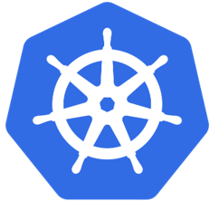

<br>

## The Why's and What's of Kubernetes

<Br>

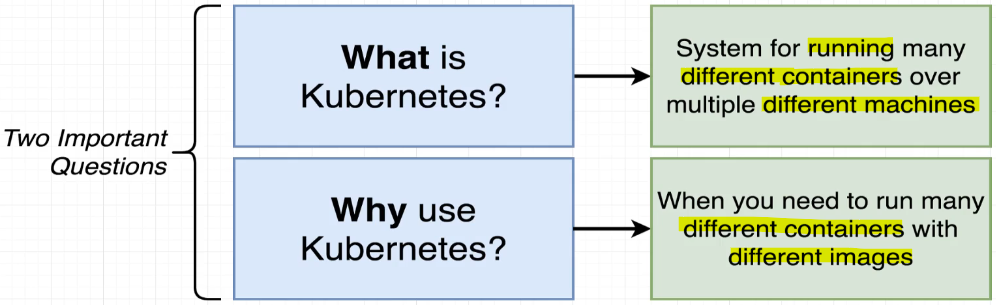

<br>

### What is Kubernetes?
* `Kubernetes`: A system for **running many different containers** across **multiple computers** or virtual machines.
* `Purpose`: Helps **manage** and **scale applications** by running different types and numbers of containers.

<br>

### Why Use Kubernetes?
* `Scaling Applications`: Easily spin up **multiple containers** to **handle** increased **traffic**.
* `Control`: Provides more control over **which containers** are **running** and **where**.

<br>

#### Example Scenario
* `Elastic Beanstalk Application`: Previously, we had multiple containers (Nginx, server, client, worker) running together.

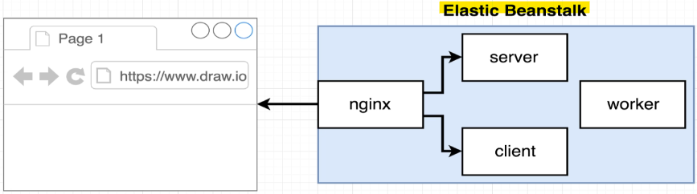

<br>

* `Scaling Challenge`: If traffic increases, we need more worker containers to handle the load.
* `Elastic Beanstalk Limitation`: It scales by creating additional sets of all containers, not just the needed ones.

<br>

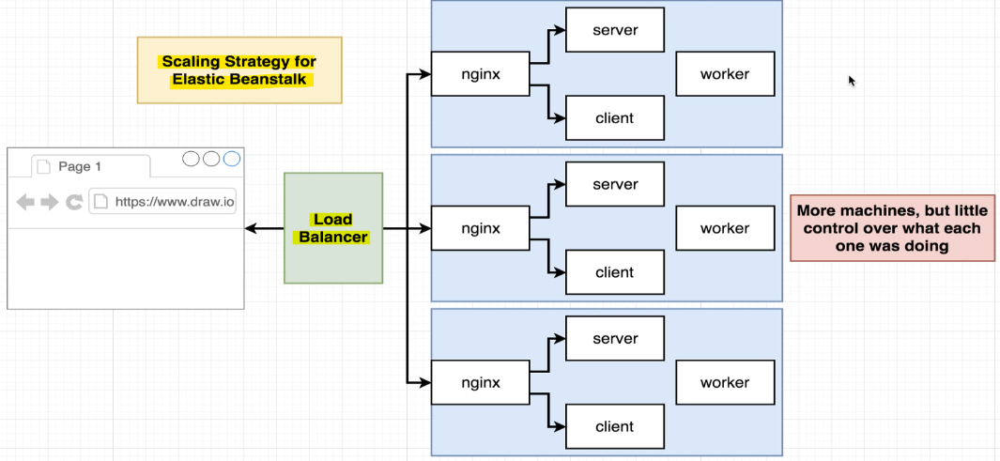

<br>

### Kubernetes Solution
* `Flexible Scaling`: Allows **running** multiple **copies** of **specific** containers (e.g., worker) **without duplicating others** (e.g., Nginx, server).
  * `Cluster`: Consists of a **master** and **one or more nodes** (virtual machines or physical computers).
  * `Master`: **Manages** the **nodes** and **controls** what containers they **run**.
  * `Nodes`: **Run** different **sets of containers**, which can be different types and numbers.

<br>


<br>

### How Kubernetes Works
* `Master`: Receives **commands from developers** and **relays** them to **nodes**.
* `Load Balancer`: Takes **outside traffic** and **distributes** it to the **nodes**.
* `Nodes`: **Run** the **specified containers** based on the master's **instructions**.

<br>

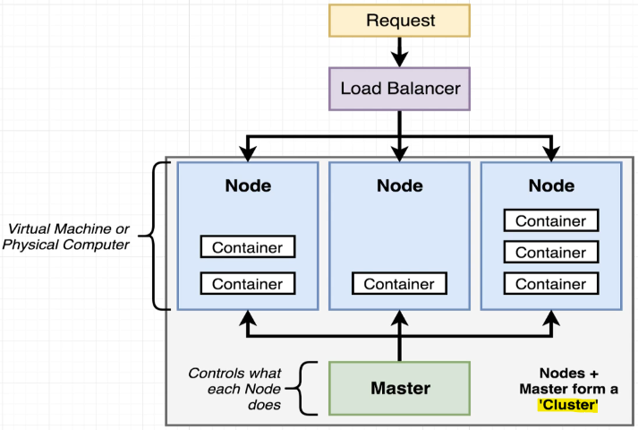

<br>

### When to Use Kubernetes
* `Complex Applications`: Ideal for applications with many **different types of containers** running in **different quantities**.
* `Not for Simple Setups`: If you only need to run the same set of containers repeatedly, Kubernetes might not be necessary.

<br>

<hr style="height:4px;background:black">

<br>

## Kubernetes in Development and Production

### When to Use Kubernetes
* `Multiple Containers`: Ideal for applications requiring **multiple different types of containers**.
* `Single Container`: If your application only needs one type of container, Kubernetes might not be necessary.

<br>

### Development vs. Production
* `Development Environment`: Use Kubernetes on your local computer with a tool called **Minikube**.
* `Production Environment`: Use **managed solutions** from cloud providers like Google Cloud (GKE) or Amazon AWS (EKS).

<br>

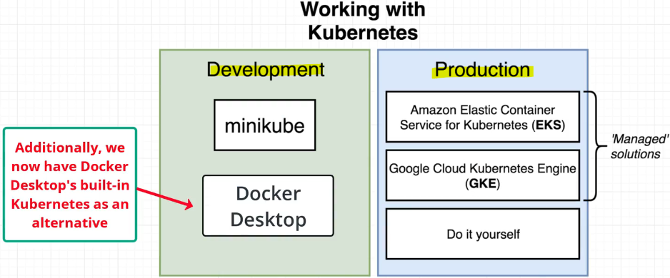

<br>

### Minikube
* `Purpose`: Sets up a **small Kubernetes cluster** on your **local machine**.
* `Function`: Creates a **virtual machine** to **run containers**.

<br>

### Managed Solutions
* `Google Cloud`: Kubernetes Engine (GKE).
* `Amazon AWS`: Elastic Container Service with Kubernetes (EKS).
* `DIY Option`: You can set up a Kubernetes cluster on your own, but managed solutions are easier for beginners.

<br>

### Setting Up Kubernetes Locally
* `Minikube`: Used to **create** and **run** a Kubernetes **cluster** on your **local machine**.
* `kubectl`: A **command-line tool** to **interact** with the Kubernetes **cluster** and **manage containers**.

<br>

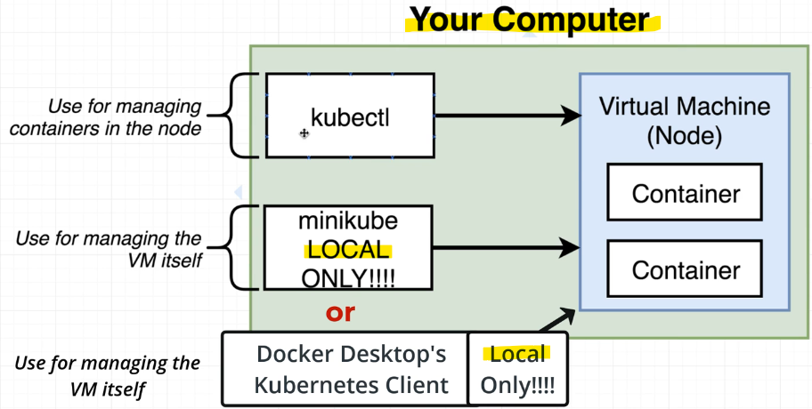


<br>

### Installation Steps
* `Install kubectl`: The program to **manage** Kubernetes **clusters**.
* `Install Virtual Machine Driver`: Allows **Minikube** to **create** a **virtual machine** on your computer.
  * **Example**: VirtualBox.
* `Install Minikube`: The software to **create a Kubernetes installation** on your local computer.

<br>

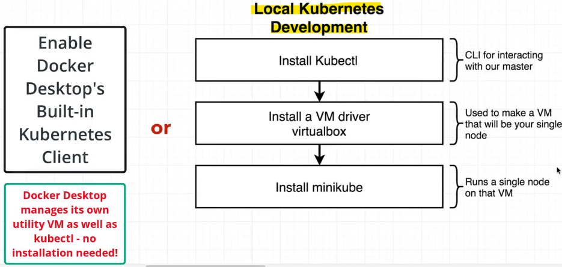

<br>

### Key Points
* `kubectl`: Used both **locally** and in **production** to **manage** Kubernetes **clusters**.
* `Minikube`: Only used in a **local development** environment.

<br>

<hr style="height:4px;background:black">

<br>

## Docker Desktop's Kubernetes Setup and Installation - macOS
* These instructions are for using Docker Desktop's built-in Kubernetes instead of Minikube on macOS. 
* This is currently the best-supported and most recommended solution for running Kubernetes on macOS (including m1 and m2 ARM machines).

> **Note** - It is assumed that Docker Desktop has already been installed and is in a working state.

1. Click the Docker **icon** found on the right side of the macOS menu bar.


<br>

2. Click **Preferences** from the dropdown menu that appears.

<br>

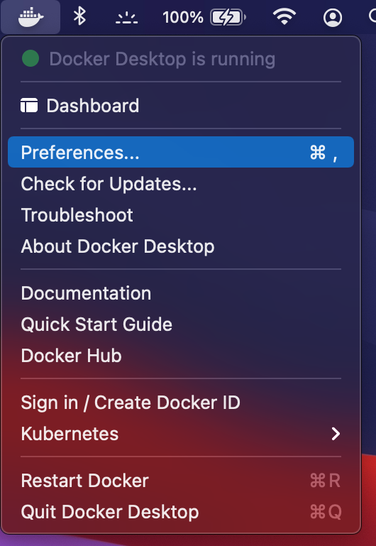


<br>

1. Click **Kubernetes** in the left side menu.

<br>

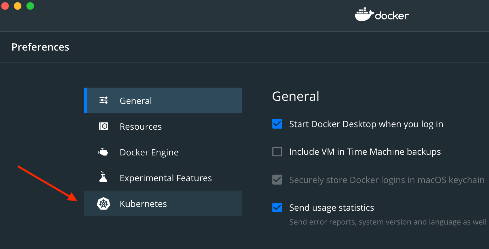

<br>

4. Check the **Enable Kubernetes** box and then click the **Apply & Restart** button.

<br>

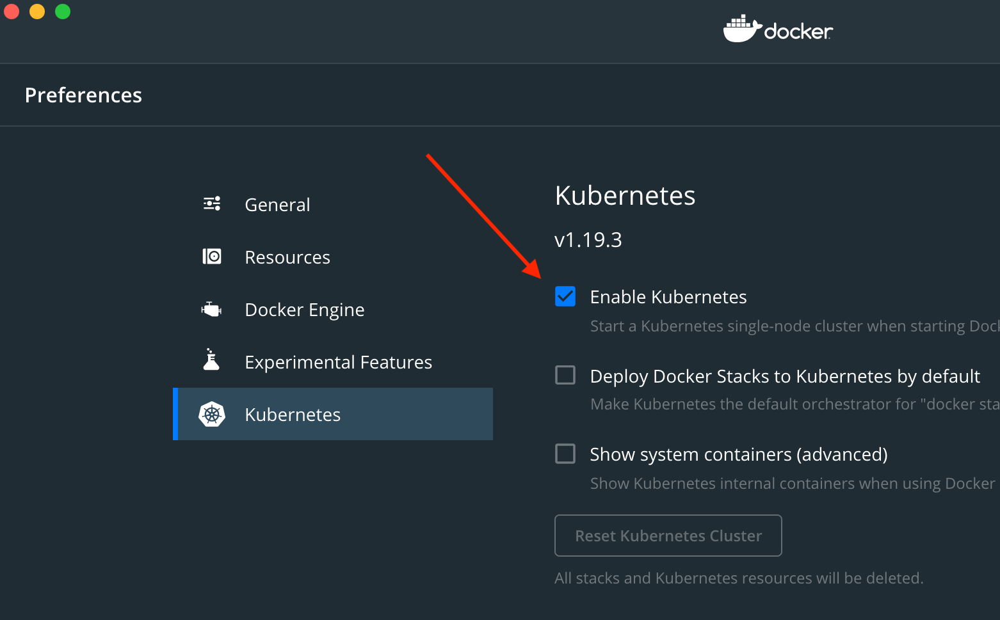

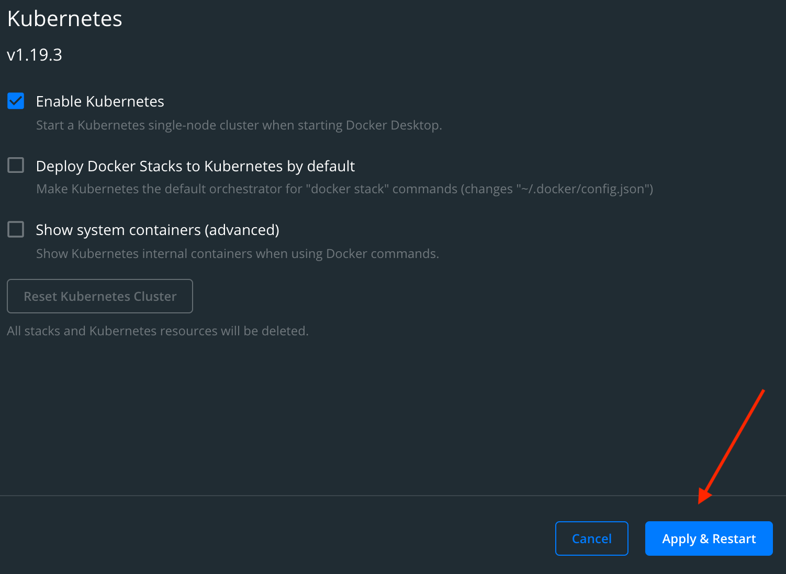

<br>

5. Click **Install** to allow the cluster installation.

<br>

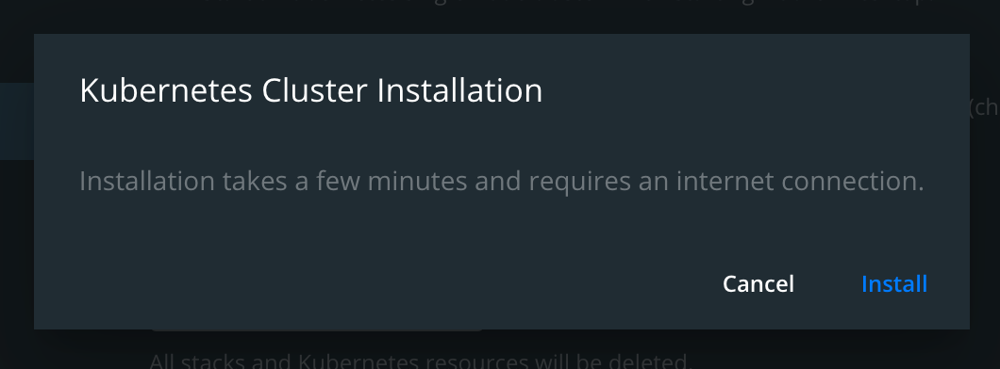

<br>

6. After the installation dialog disappears, click the **Docker icon** to make sure there is a Kubernetes is running message and green circle.

<br>

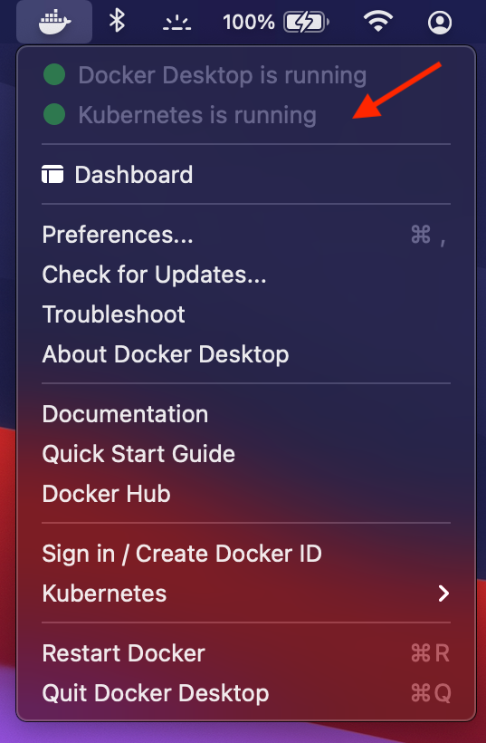


<br>

7. Then, select Kubernetes in this dropdown menu and make sure the context is set to **docker-desktop** and not something else like minikube or kind.

<br>

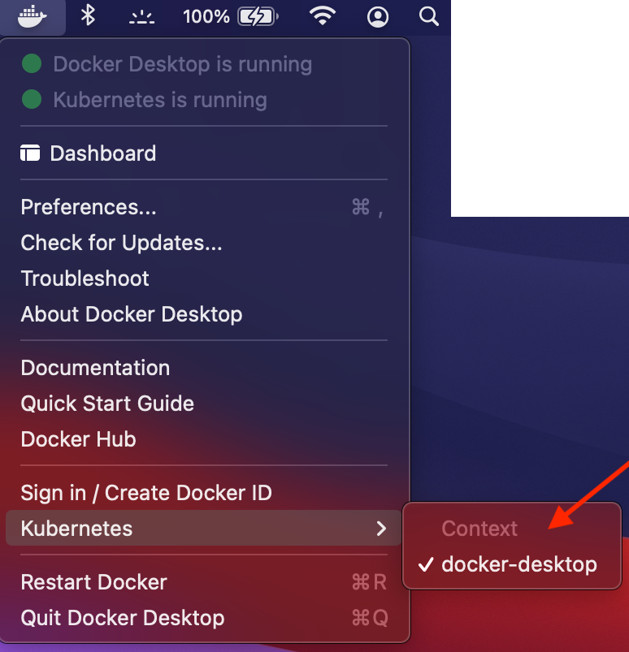


<br>

1. Finally, open up your terminal and make sure that you can run kubectl version.

<br>


> **Note** - the client and server can be off by one minor version without error or issue.

<br>

<hr style="height:4px;background:black">

<br>

## Minikube Install and Setup Info - macOS

### Install Minikube with Homebrew
* First, make sure you have Homebrew installed. If not, follow the instructions [here](https://brew.sh/).
* Then, in your terminal, run: `brew install minikube`.
* Your output should look something like this (it will be ok if it is not exact):

<br> 

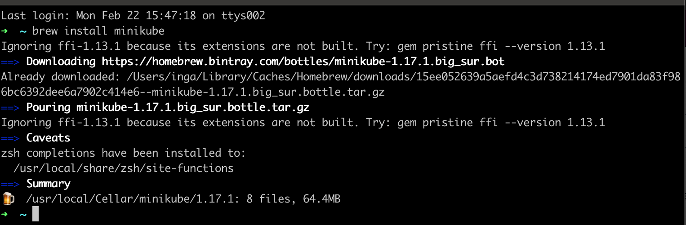

<br>

### Install Minikube Directly
* If you do not wish to use Homebrew, you can use cURL to download the binaries.

In your terminal, run:

```bash
curl -LO https://storage.googleapis.com/minikube/releases/latest/minikube-darwin-amd64

sudo install minikube-darwin-amd64 /usr/local/bin/minikube
```

Your output should look something like this:

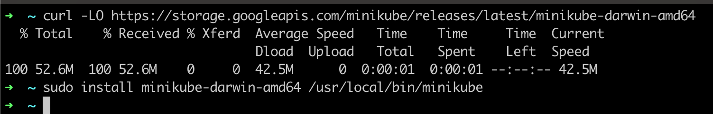

<br>

### Starting Minikube and Testing Installation

After you have successfully installed Minikube we need to **start** and **test** the **cluster** to make sure everything is working correctly.

1. `Start with VM driver`:

> **PLEASE STOP AND READ**. Ignoring these steps and using the Docker Driver instead will make it impossible to follow the course without complications and extra configurations. If using a VM driver does not work for you, please switch to Docker Desktop's Kubernetes instead.

In your terminal, run: `minikube start --driver=hyperkit`.

Your output should look similar to this:

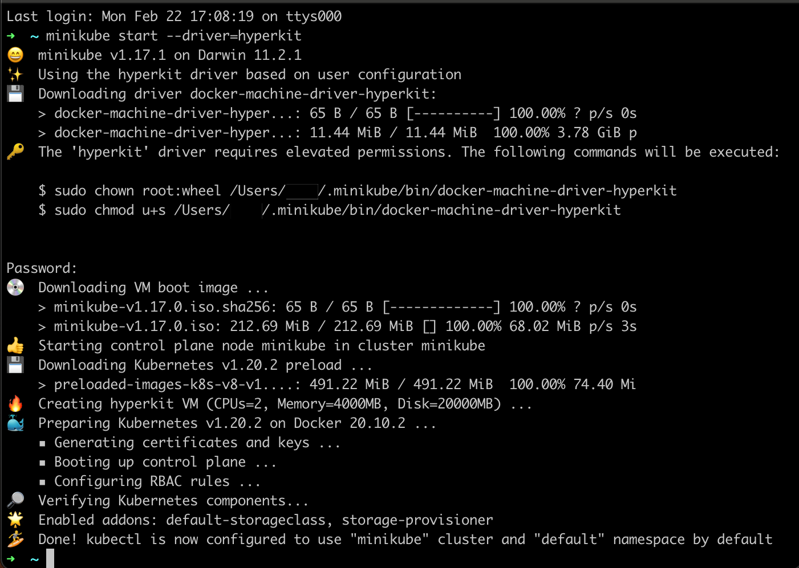

<br>

> **Note** - It is very important to use a vm driver like hyperkit. If you do not pass a driver flag to the start command Minikube will use the docker driver instead. This will not match what is shown in the course and will not work with an ingress (used later).

https://minikube.sigs.k8s.io/docs/drivers/docker/#known-issues

2. `Check Minikube Status`
   * After you see a **Done!** message in your terminal, run minikube status to make sure the cluster is healthy. Pay particular attention that the apiserver is in a "Running" state.

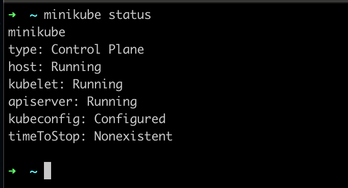


<br>

3. `Check kubectl`
   * Lastly, open up your terminal and make sure that you can run `kubectl version`. 

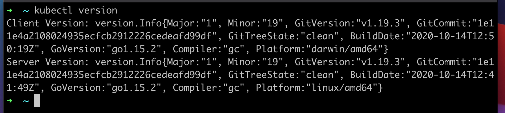

<bR>

> **Note** - the client and server can be off by one minor version without error or issue.

<br>

<hr style="height:4px;background:black">

<br>

## Docker Desktop's Kubernetes Setup and Installation - Windows

These instructions are for using Docker Desktop's **built-in** Kubernetes instead of Minikube on Windows. This is currently the best-supported and most recommended solution for running Kubernetes on Windows.

> **Note** - It is assumed that Docker Desktop has already been installed and is in a working state.

1. Click the **upward-facing arrow** on the right side of the Windows System Tray, then click the **Docker icon**.

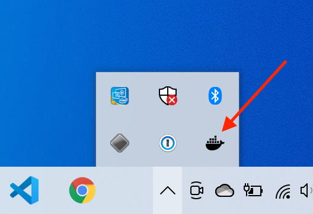


<br>

2. Click the **Gear** icon in the top menu bar of the Docker Desktop application.

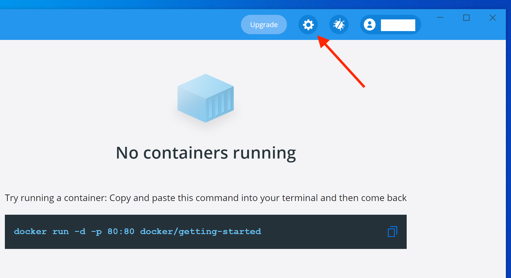

<bR>

3. In the **General** settings section, make sure that the **Use WSL 2 based engine box** is checked. 
   * This assumes that WSL2 is supported by your OS and has already been installed and enabled. 
   * If not, please see the WSL2 setup instructions [here](https://learn.microsoft.com/en-us/windows/wsl/install).

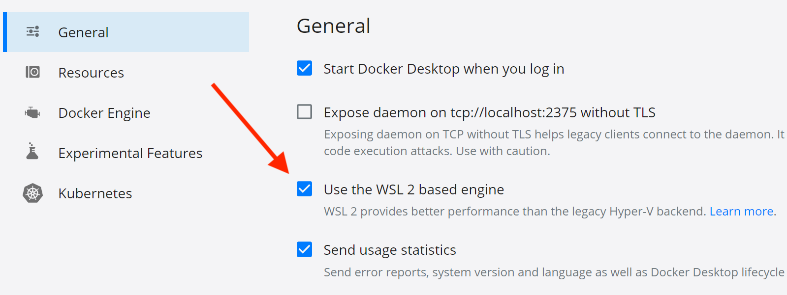

<br>

4. Click **Kubernetes** in the left side menu.

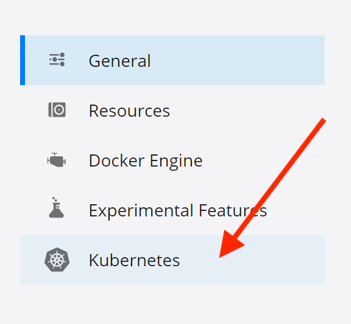


<br>

5. Check the **Enable Kubernetes** box and then click the **Apply & Restart** button.

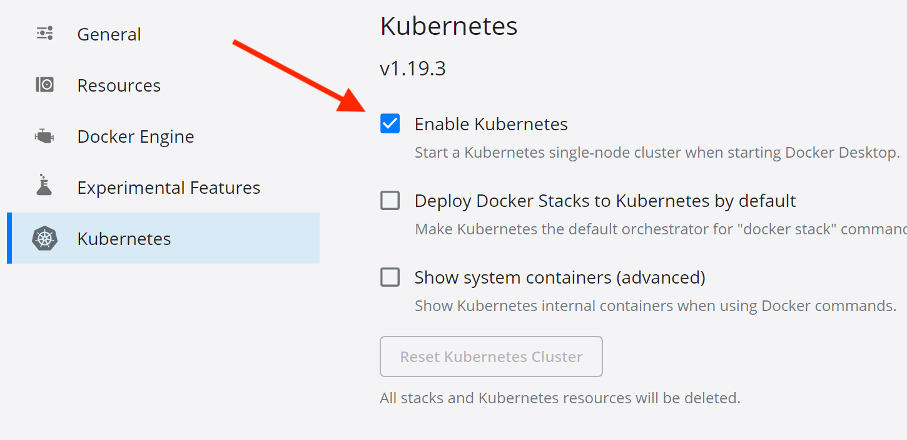


<br>

6. Click **Install** to allow the cluster installation.

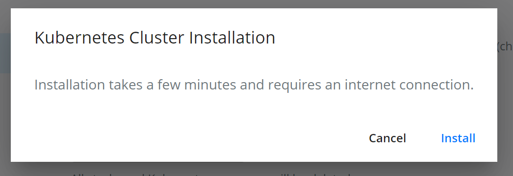


<br>

7. After the installation dialog disappears, look at the bottom left side of the **General Settings** page and make sure there is a **green Kubernetes icon**. 
   * If you click it, it should display a **RUNNING** tooltip.

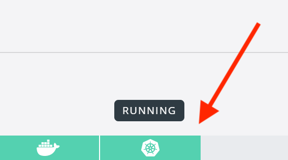


<br>

Finally, open up your terminal of choice and make sure that you can run `kubectl version`.

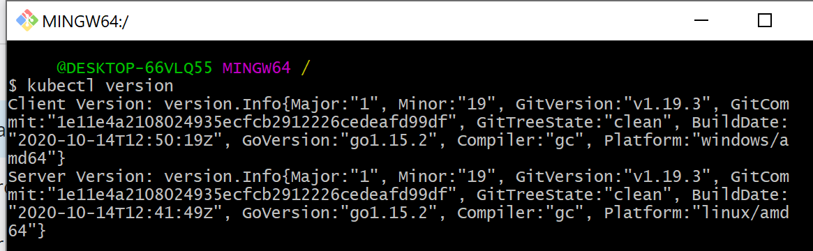

> **Note** - the client and server can be off by one minor version without error or issue.

<br>

<hr style="height:4px;background:black">

<br>

## Minikube Setup on Windows
* Windows students should be using Docker Desktop with WSL2 and not Minikube. 
* A VM driver will not work since it would require virtualization that is in conflict with WSL2. 
* The Docker driver will require additional configuration and may not work with an Ingress later in the course.

<br>

<hr style="height:4px;background:black">

<br>

## Minikube Setup on Linux

These instructions should be valid for Debian, Ubuntu, or Mint Linux distributions. Your experience may vary if using other distributions such as RHEL, Arch, non-desktop distributions like Ubuntu server, or lightweight distros which may omit many expected tools.

### Install Minikube

In your terminal run the following:

```bash
curl -LO https://storage.googleapis.com/minikube/releases/latest/minikube-linux-amd64

sudo install minikube-linux-amd64 /usr/local/bin/minikube
```

<br>

### Starting Minikube and Testing Installation

After you have successfully installed Minikube we need to **start and test the cluster** to make sure everything is working correctly.

1. Add your user to the docker group.

> **Note** - If this step was performed when Docker was installed, it can be skipped.

In your terminal, run:

```bash
sudo usermod -aG docker $USER && newgrp docker
```

* Log out of the user profile and log back in so these changes take effect. 
* If running inside a VM, you will need to restart the entire machine, not just log out.

<br>

2. Start with the default driver:

In your terminal, run:

```bash
minikube start
```

Your output should look similar to this:

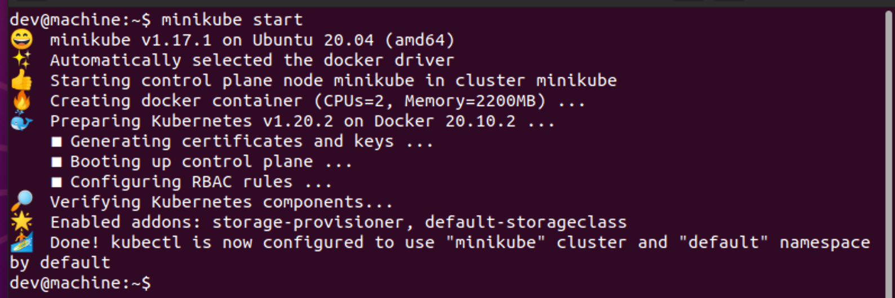

<br>

3. Check Minikube Status.
   * After you see a Done! message in your terminal, run minikube status to make sure the cluster is healthy. 
   * Pay particular attention that the apiserver is in a "Running" state.

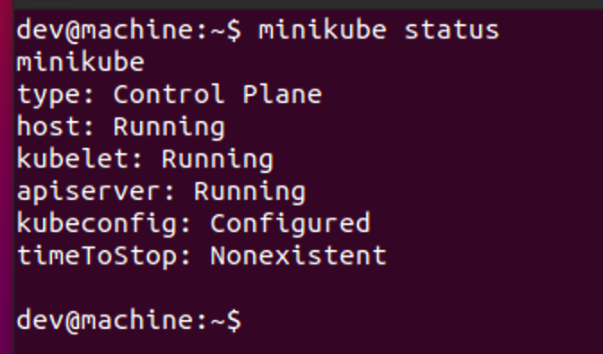


<br>

4. Install kubectl.

In your terminal run the following:

```bash
curl -LO "https://dl.k8s.io/release/$(curl -L -s https://dl.k8s.io/release/stable.txt)/bin/linux/amd64/kubectl"

sudo install -o root -g root -m 0755 kubectl /usr/local/bin/kubectl
```

<br>

5. Test kubectl.
   * Lastly, open up your terminal and make sure that you can run `kubectl version`.

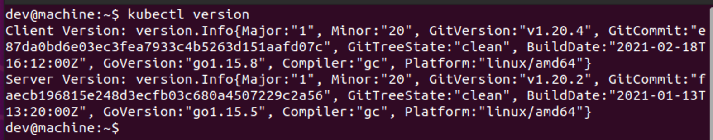

> **Note** - the client and server can be off by one minor version without error or issue.

<br>

<hr style="height:4px;background:black">

<br>

## Mapping Existing Knowledge

### Verifying Setup
* **Minikube Status**: Open your terminal and run `minikube status`. You should see:
  * Minikube running
  * Cluster running
  * kubectl correctly configured
* **Cluster Info**: Run `kubectl cluster-info` to see a message confirming the cluster is running.

<br>

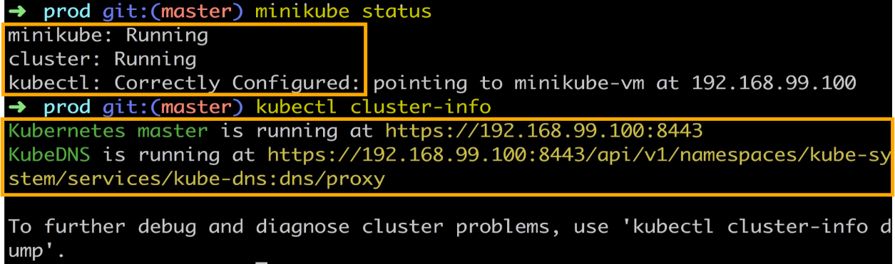

<br>

### Short-Term Goal
* `Objective`: Get the **multi-client image running** on your local Kubernetes cluster created by Minikube.

<br>

### Transferring Docker Compose Knowledge to Kubernetes
`Docker Compose Observations`:
* **Build Images**: Docker Compose can build images.
* **Create Containers**: Each entry represents a container.
* **Networking**: Defines networking requirements (port mapping).

<br>


<br>

### Kubernetes Equivalents
* `No Build Pipeline`: Kubernetes expects all images to be pre-built.
* `Multiple Config Files`: Use multiple configuration files to create different objects (not just containers).
* `Manual Networking`: Manually set up networking between containers and the outside world.

<br>

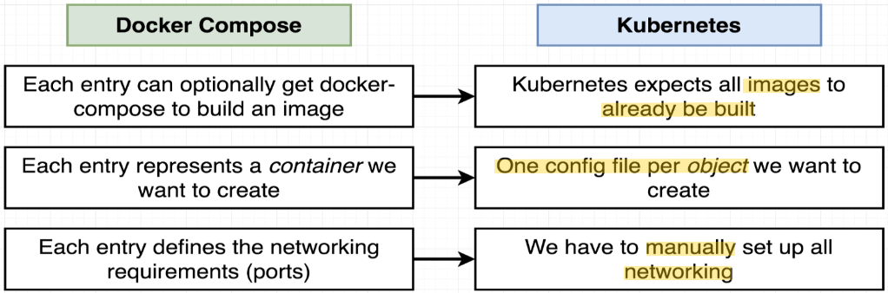

<br>

### Steps to Run Multi-Client Image on Kubernetes
1. `Ensure Image is on Docker Hub`: Confirm the multi-client image is built and pushed to Docker Hub.
2. `Create Config File for Container`: Make a configuration file to create the container (or an object representing the container).
3. `Set Up Networking`: Create an additional configuration file to set up networking, allowing access to the container from your web browser.

<br>

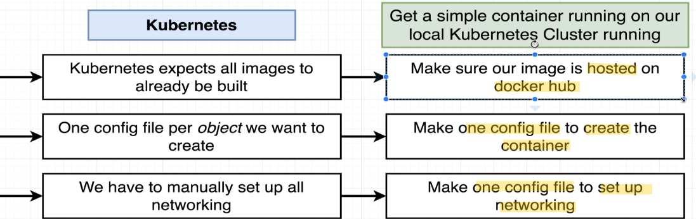

<br>

<hr style="height:4px;background:black">

<br>

## Quick Note to Prevent an Error
> updated 4-16-2020

In the upcoming lecture, Stephen will be creating the **client-pod.yaml** configuration file. You may get a **blank page** with an error in your console when you attempt to run the pod or deployment in a future lecture:

```bash
react-dom.production.min.js:209 TypeError: this.state.seenIndexes.map is not a function
```

This is because we added the following line to our client/nginx/default.conf file in the earlier Docker lectures:

```bash
try_files $uri $uri/ /index.html;
```

This line was added to resolve some **React Router issues** our client app was having. However, it will **break this demo** because we have **no Nginx container** or **Ingress service in place**.

The best way to resolve this is to use **Stephen's Client image** in the **pod** and **deployment** for these demos, instead of your own:

* image: stephengrider/multi-client

To be clear, this issue will **not** affect the multi-container Kubernetes project we will be building in Section 14. This is just a quick demo and we will not be reusing these files.

<br>

<hr style="height:4px;background:black">

<br>

## Adding Configuration Files

### Verify Docker Image on Docker Hub
1. Open a browser and navigate to [hub.docker.com](https://hub.docker.com/).
2. Check if the multi-client image is available in your repositories.
   * **Example**: Stephen Grider/multi-client.

<br>

### Create a Configuration File
1. Create a new project directory (e.g., Simple K8s).
2. Open your code editor inside this directory.
3. Create a new file named **client-pod.yml**.

<br>


<br>

### Write Configuration for the Container
* The goal is to **create a container** in the **local Kubernetes cluster**.

Example configuration for client-pod.yml:

```yaml
apiVersion: v1
kind: Pod
metadata:
  name: client-pod
  labels:
    component: web
spec:
  containers:
  - name: client
    image: <your-docker-id>/multi-client
    ports:
    - containerPort: 3000
```

<br>

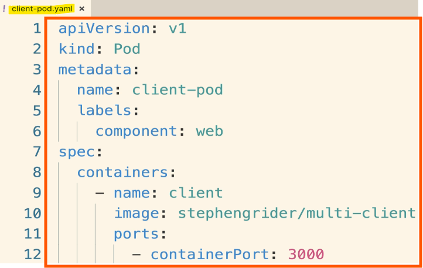

<br>

> **Note**: In YAML files, the `-` (dash) is used to indicate items in a **list** or **array**. It's a way to **define multiple elements** under a **single key**.

<br>

### Create Networking Configuration
* Create another file named **client-node-port.yml**.

Example configuration for client-node-port.yml:

```yaml
apiVersion: v1
kind: Service
metadata:
  name: client-node-port
spec:
  type: NodePort
  ports:
  - port: 3050
    targetPort: 3000
    nodePort: 31515
  selector:
    component: web
```

<br>

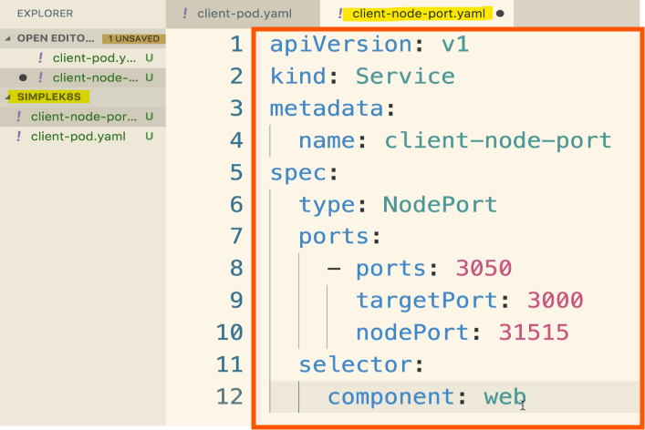

<br>

> **Note**: In YAML files, the `-` (dash) is used to indicate items in a **list** or **array**. It's a way to **define multiple elements** under a **single key**.

<br>

### Tips for Configuration Files
* `Triple Check Indentation and Spelling`: YAML files are sensitive to indentation and spelling errors.
* `Use Correct Docker Image`: Ensure the image name matches the one on Docker Hub.
* `Ports Configuration`: Define the ports correctly to expose the container to the outside world.

<br>

<hr style="height:4px;background:black">

<br>

## Object Types and API Versions

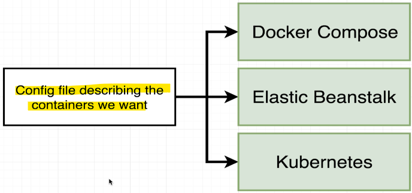

<br>

### Configuration Files Overview
* We created two configuration files: **client-pod.yml** and **client-node-port.yml**.
* These files **define objects in Kubernetes**.

### Key Lines in Configuration Files
* `API Version`: Specifies the version of the Kubernetes API to use.
  * **Example**: apiVersion: v1
* `Kind`: Defines the type of object to create.
  * **Example**: kind: Pod or kind: Service

<br>

### Objects in Kubernetes
* `Objects`: Things that **exist inside** the Kubernetes **cluster**.

`Examples of objects`:
* **Pod**: Used to run a container.
* **Service**: Sets up networking for the container.

<br>

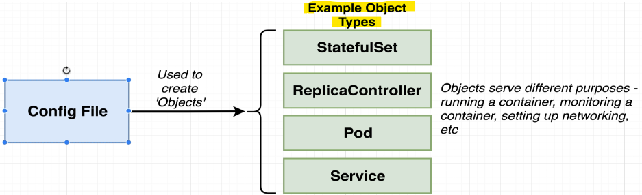

<br>

### Using Configuration Files with kubectl
* Configuration files are fed into the **kubectl command-line tool**.
* `kubectl` **interprets** the **files** and **creates objects** in the Kubernetes **cluster**.

<br>

### Understanding API Version and Kind
* `API Version`: **Limits** the **types of objects** that can be created.
  * **Example**: apiVersion: v1 allows creating objects like Pod, Service, etc.
* `Kind`: Indicates the type of object to create.
  * **Example**: kind: Pod creates a Pod object.
  * **Example**: kind: Service creates a Service object.

<br>

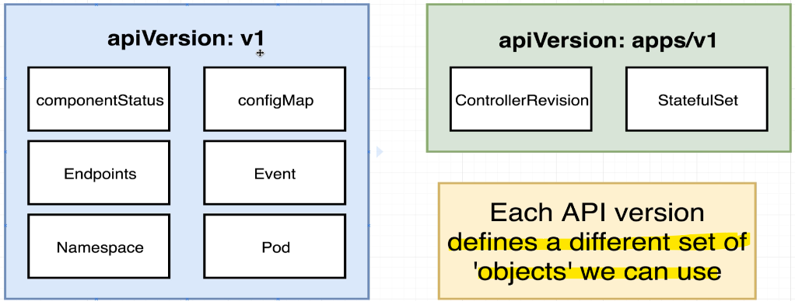

<br>

### Practical Use of API Version
* Choose the **object type** you want to create.
* Look up the **corresponding API version** and include it in the configuration file.
  * **Example**: To create a Pod, use apiVersion: v1.

<br>

### Summary
* `API Version`: Defines the scope of object types.
* `Kind`: Specifies the type of object to create.
* `Objects`: Different types of objects serve different purposes (e.g., running containers, setting up networking).

<br>

<hr style="height:4px;background:black">

<br>

## Running Containers in Pods

### What is a Pod?
* A pod is a basic **object** in Kubernetes that **groups one or more containers with a common purpose**.
* When you run the `minikube start` command, it **creates a virtual machine** (node) on your computer to **run** Kubernetes **objects**, including pods.

<br>

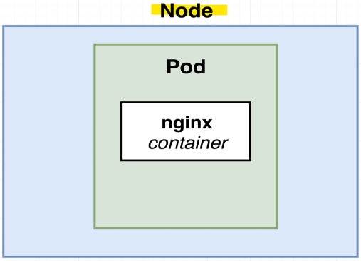

<br>

### Why Use Pods?
* In Kubernetes, you cannot run a single container by itself. The **smallest deployable unit** is a **pod**.
* Pods allow **grouping of containers** that must be **deployed and run together**.
  * **Example**: A pod with a Postgres container, a logger container, and a backup manager container. These containers have a tight integration and must run together.

<br>

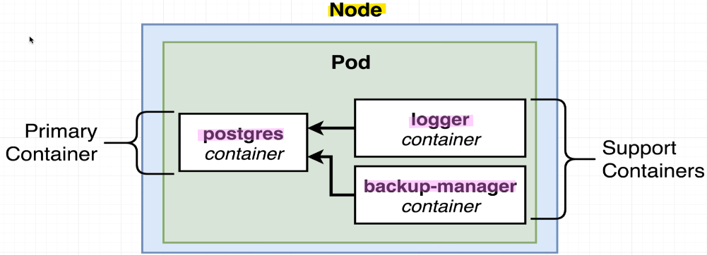

<br>

### Creating a Pod

Example configuration for client-pod.yml:

```yaml
apiVersion: v1
kind: Pod
metadata:
  name: client-pod
  labels:
    component: web
spec:
  containers:
  - name: client
    image: <your-docker-id>/multi-client
    ports:
    - containerPort: 3000
```

* This configuration **creates a pod** that **runs one container** named client **using** the **specified Docker image** and **exposes port 3000**.

<br>

### What is a Service?
* A **service** is another **type of object** in Kubernetes that **sets up networking** for the containers.
* Services **allow containers** to be **accessible from the outside world**.

<br>

### Creating a Service

Example configuration for client-node-port.yml:

```yaml
apiVersion: v1
kind: Service
metadata:
  name: client-node-port
spec:
  type: NodePort
  ports:
  - port: 3050
    targetPort: 3000
    nodePort: 31515
  selector:
    component: web
```

* This configuration **sets up networking** to **expose port 3000** of the container **to the outside world** through **port 3050**.

<br>

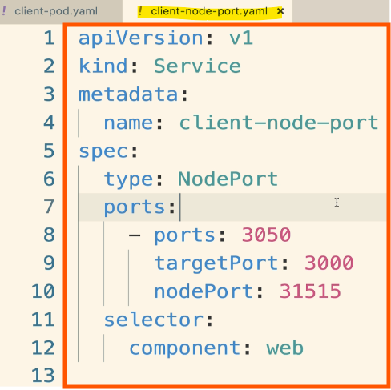


<br>

### Port Mapping
* The ports **entry** in the pod configuration **specifies the container port to expose**.
  * **Example**: containerPort: 3000 exposes port 3000 of the container.
* The service configuration ensures that this port is **accessible** from the **outside world**.

<br>

### Summary
* `Pod`: Groups one or more containers with a common purpose. The smallest deployable unit in Kubernetes.
* `Service`: Sets up networking for containers, making them accessible from the outside world.
* `Port Mapping`: Defines which container ports to expose and how they are accessible.

<br>

<hr style="height:4px;background:black">

<br>

## Service Config Files in Depth

<br>

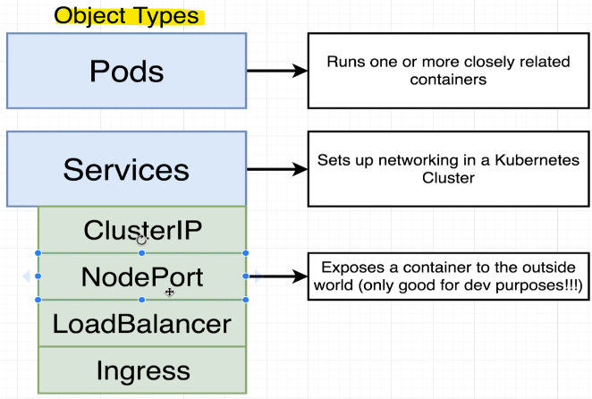


<br>

### Metadata in Configuration Files
* `Name`: Used to name the pod, primarily for logging purposes.
  * **Example**: 
  
```yaml
name: client-pod
```

<br>

* `Labels`: Used to **link** different objects together.

Example: 

```yaml
labels: 
  component: web
```

<br>

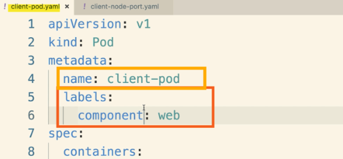

<br>

### What is a Service?
* A service is an **object type** used to **set up networking** **inside** a Kubernetes **cluster**.
* Services allow containers to be **accessible** from the **outside world**.

<br>

### Types of Services
* `ClusterIP`: Default type, **exposes the service** on a **cluster-internal IP**.
* `NodePort`: **Exposes the service** on **each node's IP** at a **static port**.
* `LoadBalancer`: **Exposes the service** **externally** using a **cloud provider's load balancer**.
* `Ingress`: **Manages external access** to services, typically HTTP.

<br>

### Creating a NodePort Service

Example configuration for **client-node-port.yml**:

```yaml
apiVersion: v1
kind: Service
metadata:
  name: client-node-port
spec:
  type: NodePort
  ports:
  - port: 3050
    targetPort: 3000
    nodePort: 31515
  selector:
    component: web
```

* This configuration sets up a **NodePort** service to expose port 3000 of the container to the outside world through port 3050.

<br>

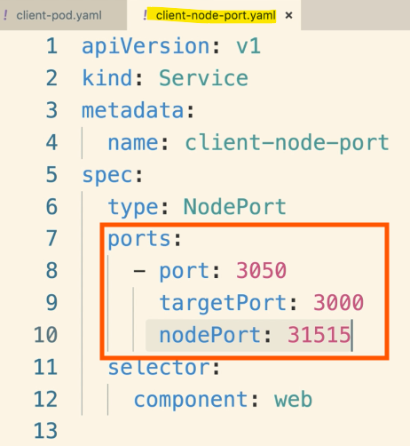


<bR>

### How Services Work
* `kube-proxy`: A **program** on each node that **routes incoming requests** to the **appropriate service or pod**.
* `Selector`: **Links** the **service** to the **pod using labels**.
  * **Example**: 

```yaml
selector: 
  component: web
```
* in the **service** file matches:

```yaml
labels: 
  component: web
```
*  in the **pod** file.

<br>


<br>

### Port Mapping
* The **ports entry** in the **service** configuration **specifies the ports to expose**.
  * **Example**: port: 3050, targetPort: 3000, nodePort: 31515.

<br>

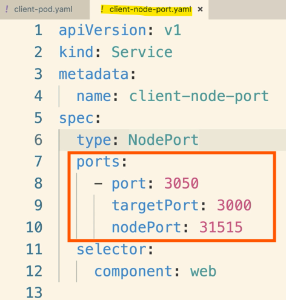


<br>

### Labels and Selectors
* `Labels`: Used to **identify** and **group objects** in Kubernetes.
  * **Example**: 

```yaml
labels: 
  component: web
```

* `Selectors`: Used by **services** to **find and connect** to **pods** with **matching labels**.
  * **Example**: 

```yaml
selector: 
  component: web
```

> **Note**: Labels and selectors must match exactly to link the service and pod.

<br>

### Changing Labels and Selectors
* Labels and selectors can be **customised**.
  * **Example**: Changing component: web to tier: front-end requires **updating** both the **pod and service configurations** to match.

<bR>

### Ports in Services
* `Port`: **Used** by other **pods** to **access the service**. Not useful for our current application.
* `TargetPort`: The **port inside the pod** that the **service forwards traffic to**.
  * **Example**: targetPort: 3000
* `NodePort`: The port **exposed to the outside world**, allowing **access** to the **service from a browser**.
  * **Example**: nodePort: 31515

<br>

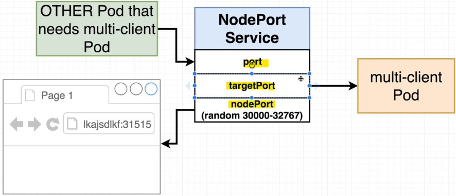

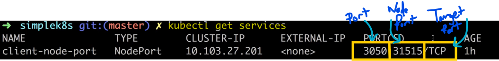

<br>

### Port Configuration Example

Example configuration for **client-node-port.yml**:

```yaml
apiVersion: v1
kind: Service
metadata:
  name: client-node-port
spec:
  type: NodePort
  ports:
  - port: 3050
    targetPort: 3000
    nodePort: 31515
  selector:
    component: web
```

<br>

### NodePort Range
* NodePort values range between 30,000-32,767.

> **Note**: If not specified, a NodePort will be randomly assigned within this range.

### Why Not Use NodePort in Production?
* NodePort services are **not ideal for production** due to the **need** for **specific port numbers** in **URLs**.
  * **Example**: Users prefer google.com over google.com:31515.

<br>

### Summary
* `Metadata`: Includes the name and labels for logging and linking objects.
* `Service`: Sets up networking for containers, making them accessible from the outside world.
* `NodePort`: A type of service used for development purposes to expose containers.
* `kube-proxy`: Routes incoming requests to the appropriate service or pod.
* `Selector`: Links services and pods using labels.
* `Labels and Selectors`: Used to link services and pods. Must match exactly.
* `Ports`: Different types of ports (Port, TargetPort, NodePort) serve different purposes.
* `NodePort`: Exposes the service to the outside world. Not ideal for production use.

<br>

<hr style="height:4px;background:black">

<br>

## Connecting to Running Containers

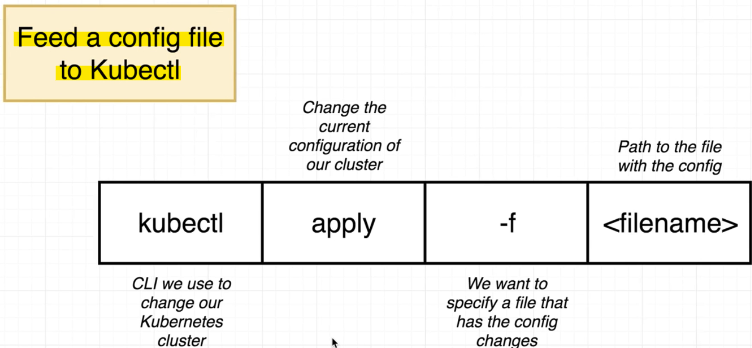

<br>

### Applying Configuration Files in Kubernetes
> Using kubectl to Apply Configuration Files.

* `kubectl`: Command-line tool to manage Kubernetes clusters.
* `apply command`: Used to change the configuration of the cluster.
* `Command format`: kubectl apply -f <path-to-configuration-file>

**Example**:

```bash
kubectl apply -f client-pod.yaml
```

<br>

### Steps to Apply Configuration Files
> Ensure you are in the **directory** containing the configuration files.

Run the apply command for each configuration file:

```bash
kubectl apply -f client-pod.yaml

kubectl apply -f client-node-port.yaml
```

* The output will show a "configured" message, indicating the configuration has been applied.

<br>

**For example**:

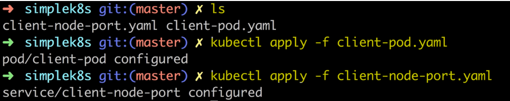


<br>

### Checking the Status of Objects

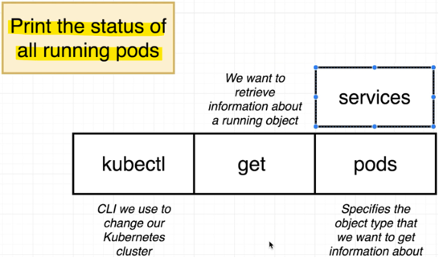

<br>

* Use the `kubectl get` command to check the status of objects.
  * **Example**: `kubectl get pods` to get the status of all pods.
  * **Example**: `kubectl get services` to get the status of all services.

<br>

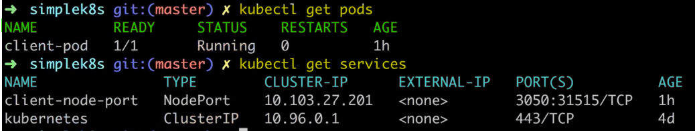

<br>

### Interpreting the Status Output

`Pods`:
* **NAME**: Name of the pod.
* **READY**: Number of running instances.
* **STATUS**: Current status (e.g., Running).
* **RESTARTS**: Number of times the pod has restarted.
* **AGE**: How long the pod has been running.

`Services`:
* **NAME**: Name of the service.
* **TYPE**: Type of service (e.g., NodePort).
* **CLUSTER-IP**: Internal IP address of the service.
* **EXTERNAL-IP**: External IP address (if applicable).
* **PORT(S)**: Ports exposed by the service.
* **AGE**: How long the service has been running.

<br>

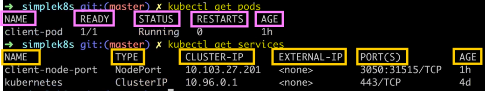

<br>

### Summary
* `kubectl apply`: Command to apply configuration files to the Kubernetes cluster.
* `kubectl get`: Command to check the status of objects in the cluster.
* `Status Output`: Provides information about the running pods and services.

<br>

### Accessing Your Running Application in Kubernetes
> We have deployed both the pod and the service objects, and they are now running on our **local cluster**.

<br>

### Understanding Localhost and Minikube
* `Localhost`: Does **not** work for accessing the Kubernetes node VM created by Minikube.
* `Minikube IP`: The **virtual machine** created by Minikube has its **own IP address**, which must be **used to access the services and pods running inside it**.

<br>

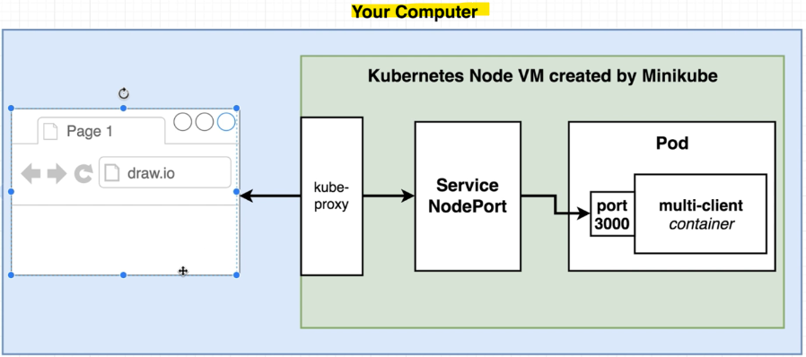

<br>

### Finding the Minikube IP Address
* Run the command `minikube ip` to get the IP address of the virtual machine.
* Use this IP address to access the application.

<bR>

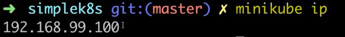

<br>

### Accessing the Application in the Browser
* **Copy** the **IP address** obtained from minikube ip.
* In the **browser**, enter the IP address followed by the NodePort.
  * **Example**: http://<minikube-ip>:31515
* This will allow you to access the running application.

<br>

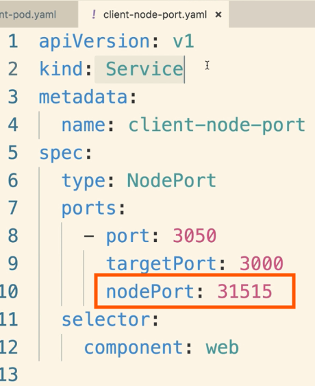


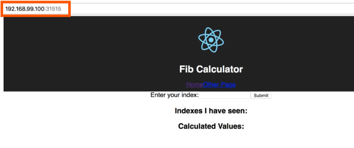

<br>

> Note: Handling Error Messages
> 
> If you see error messages related to the Express API, it is because the API has not been set up in the Kubernetes cluster yet. This is expected and can be addressed later.

<br>

### Networking in Kubernetes
* Kubernetes requires explicit setup for networking.
* **Services** are used to **set up networking** and **make pods accessible**.

<br>

### Summary
* `Minikube IP`: Use the **IP address** provided by minikube ip to **access the application**.
* `NodePort`: The **port** used to **access the service** from the browser.
* `Networking`: Explicit setup is required in Kubernetes to make services and pods accessible.

<br>

<hr style="height:4px;background:black">

<br>

## The Entire Deployment Flow

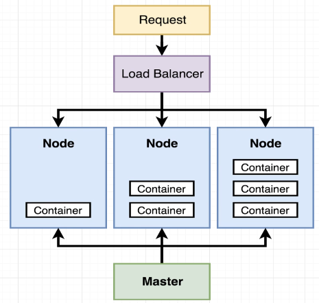

<br>

### Kubernetes Architecture Overview
* `Nodes`: Physical or virtual machines that **run objects created inside** the Kubernetes **cluster**.
* `Master`: **Controls** the **entire** Kubernetes **cluster** and **manages nodes**.
* `Deployment File`: Configuration file used to **create pods or services**.

<br>

### Demonstration of Container Restart
* `kubectl get pods`: Lists the current **status** of running pods.
* `docker kill <container-id>`: **Kills a running container** inside a pod.
* `Automatic Restart`: If a container inside a pod crashes or is manually deleted, it automatically gets restarted.

<br>


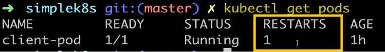

<br>

### Deployment Process
* `kubectl apply -f <file>`: Command to **apply a configuration file** to the Kubernetes **cluster**.


* `Master Node`: **Receives** the **deployment file** and **updates** its **list of responsibilities**.
* `Kube API Server`: **Monitors** the **status of nodes** and **ensures** they are **running the correct objects**.

<br>

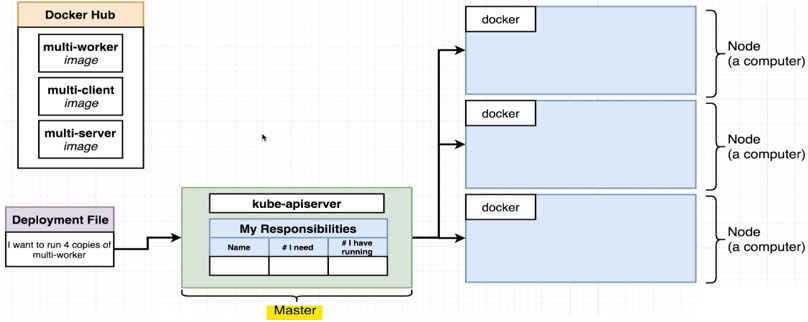

<br>

### Example Deployment Scenario
* `Deployment File`: Specifies **creating multiple copies** of a **container** (e.g., four copies of multi-worker).

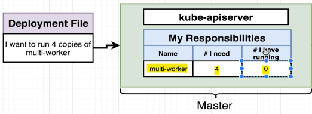


<br>

* `Master Node`: **Interprets** the **deployment file** and **updates** its **responsibilities**.
* `Nodes`: Master node instructs nodes to **start the specified number of container copies**.
* `Docker`: Each node **runs a copy of Docker to manage containers**.

<br>

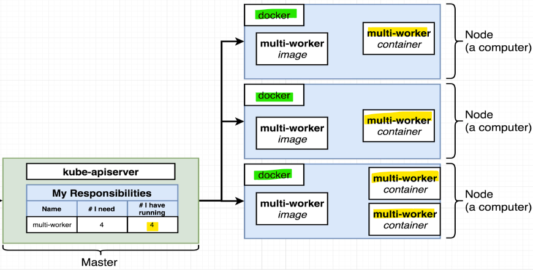

<br>

### Key Commands
* `kubectl get pods`: Check the status of pods.
* `kubectl apply -f <file>`: Apply a configuration file.
* `docker ps`: List running containers.
* `docker kill <container-id>`: Kill a running container.

<br>

### Summary
* `Nodes and Master`: Nodes **run objects**, and the master **controls the cluster**.
* `Deployment File`: Used to **create** and **manage** **pods** and **services**.
* `Automatic Restart`: **Containers inside pods** automatically restart if they crash.
* `Deployment Process`: Master node **manages deployment** and ensures nodes **run** the **correct objects**.

<br>

### Master Node and Docker Interaction
* `Master Node`: Manages the **Kubernetes cluster** and **coordinates with nodes**.
* `Docker on Nodes`: Each node has an **autonomous copy of Docker** to manage containers.

<br>

### Deployment Process
* `Master Node Instructions`: When the **master instructs nodes** to create containers, each **node reaches out to Docker Hub** to **download** the **required image** (e.g., multi-worker).
* `Image Download`: Each node downloads the image and **stores it locally**.
* `Container Creation`: Nodes **use** the **downloaded image** to **create** the specified **number of containers**.

<br>

### Status Updates
* `Master Node Monitoring`: The master continuously **monitors the status** of nodes and containers.
* `Status Check`: The master checks each node to ensure the correct number of containers are **running**.

<br>

### Handling Container Failures
* `Automatic Restart`: If a container crashes or is manually deleted, the **master node detects the issue** and **instructs a node to create a new container**.
* `Continuous Monitoring`: The master node ensures the **desired state** (e.g., four running containers) is **maintained**.

<br>

### Key Takeaways
* `Interaction with Master Node`: Developers interact with the master node using the **kubectl command-line tool**. Commands are sent to the master, which then coordinates with nodes.
* `Master Node Responsibilities`: The master node maintains a **list of responsibilities** and ensures the **cluster's state matches this list**.
* `Autonomous Nodes`: Each node **operates independently** but **follows instructions** from the master node.

<br>

### Summary
* `Master Node`: Manages the cluster and coordinates container creation.
* `Docker on Nodes`: Each node has its own Docker instance to manage containers.
* `Automatic Restart`: The master node ensures containers are restarted if they fail.
* `Developer Interaction`: Developers use kubectl to interact with the master node, not directly with the nodes.

<br>

<hr style="height:4px;background:black">

<br>

## Imperative vs Declarative Deployments

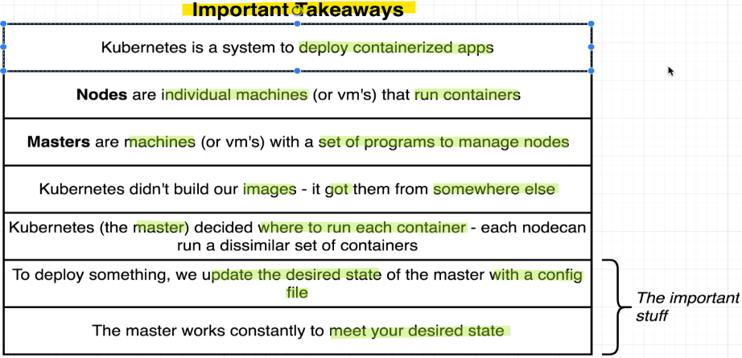

<br>

### Core Purpose of Kubernetes
* Kubernetes is a system designed to **deploy containerized applications**.
* It **manages** **services**, **pods**, and **other objects** to support these applications.

<bR>

### Nodes and Master
* `Node`: An **individual** machine (physical or virtual) that **runs containers or objects**.
* `Master`: A machine or virtual machine that **manages everything** happening **inside the nodes** of the Kubernetes cluster.

<br>

### Image Deployment
* Kubernetes does **not** build images; it **retrieves** them from **Docker Hub**.
* The master node decides **where to run each container**, though this can be controlled through configuration.

<br>

### Desired State and Master Responsibilities
* Deployment involves **updating the desired state** of the **master** with a **configuration file**.
  * **Example**: Specifying to run four copies of a container.
* The master node constantly works to meet this desired state, ensuring the specified number of containers are running.

<br>

### Imperative vs. Declarative Deployment
* `Imperative Deployment`: Involves issuing **specific commands** to **create**, **delete**, or **update containers**.
  * **Example**: "Create this container," "Delete that container."

* `Declarative Deployment`: Involves **specifying** the **desired state** and letting the **master node handle the details**.
  * **Example**: "Ensure four containers are running."

<br>

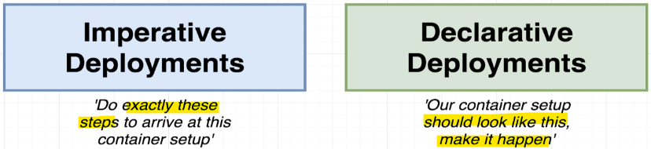

<br>

#### Example of Imperative Deployment
* **Manually checking** the **current state** and **issuing commands** to **achieve the desired state**.
  * **Example**: If four containers are running but only three are needed, a command is issued to remove one container.

<br>

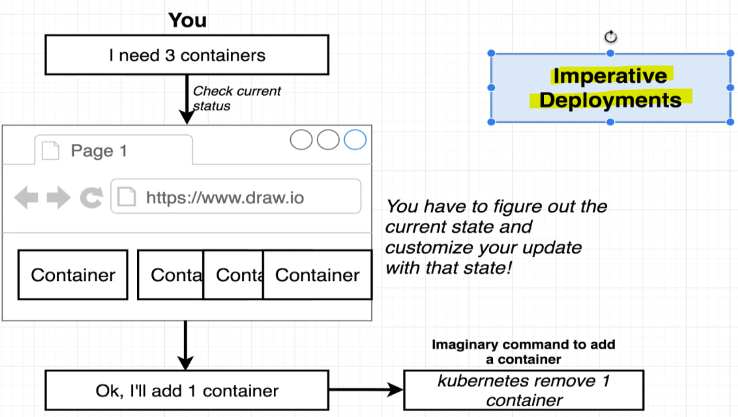

<br>

**For example**:

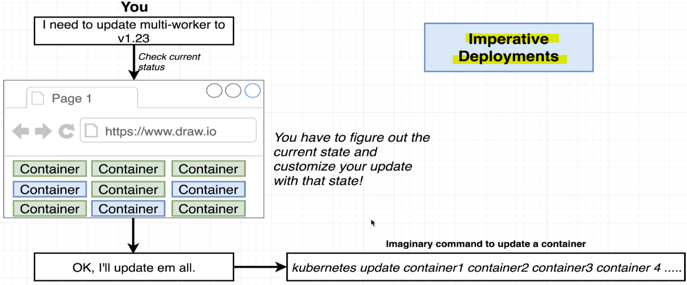

<br>

#### Example of Declarative Deployment
* **Specifying** the **desired state** (e.g., four containers) and allowing the **master node** to **manage the deployment**.
* The master node **continuously monitors** and **adjusts** to **maintain** the **desired state**.

<br>

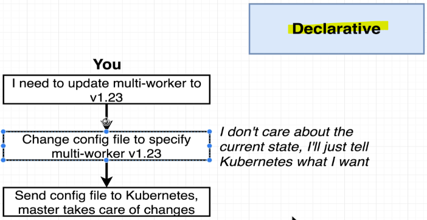


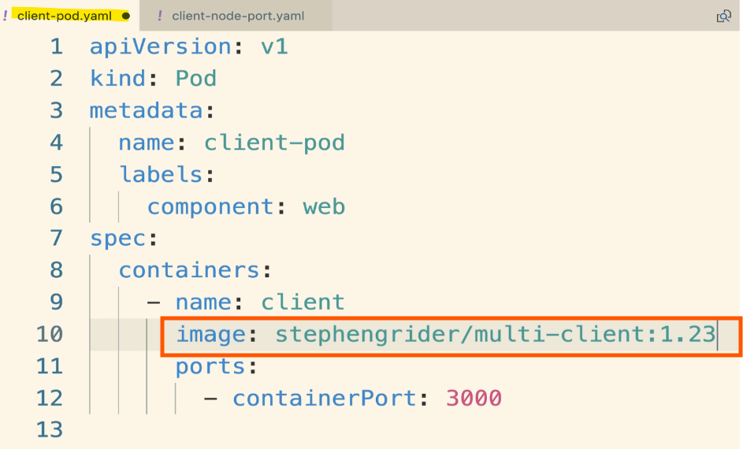


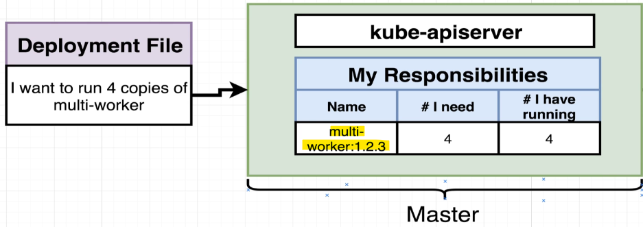


<br>

### Summary
* `Kubernetes`: Deploys and manages containerised applications.
* `Nodes and Master`: Nodes run containers; the master manages the cluster.
* `Desired State`: Specified through configuration files; the master node ensures this state is met.
* `Deployment Styles`: Imperative (specific commands) vs. Declarative (desired state).

<br>

### Updating Containers with Imperative Deployment
* `Current State`: Identify which containers are running **outdated** versions.
* `Desired State`: Determine the **target version** for all containers.
* `Migration Strategy`: **Manually isolate and update** specific containers to the desired version.
* `Challenges`: Requires detailed knowledge of the current state and manual intervention.

<br>

### Updating Containers with Declarative Deployment
* `Config File Update`: Modify the configuration file to **specify** the **desired version** (e.g., version 1.23).
* `Send to Kubernetes`: Apply the **updated configuration** file using **kubectl**.
* `Master Node Action`: The master node **updates its responsibilities** and ensures **all pods run** the **specified version**.
* `Automation`: Kubernetes **automatically** handles the **update process**, reducing manual effort.

<br>

### Advantages of Declarative Deployment
* `Simplicity`: Update a single configuration file and let Kubernetes handle the rest.
* `Consistency`: Ensures the desired state is always met, even if containers fail or need to be restarted.
* `Efficiency`: Reduces the need for manual intervention and complex migration strategies.

<br>

### Imperative vs. Declarative Approach
* `Imperative`: Issue specific **commands** to **create**, **update**, or **delete containers**.
  * **Example**: "Create this container," "Delete that container."

* `Declarative`: **Specify** the **desired state** and let **Kubernetes manage** the **details**.
  * **Example**: "Ensure all containers run version 1.23."

<br>

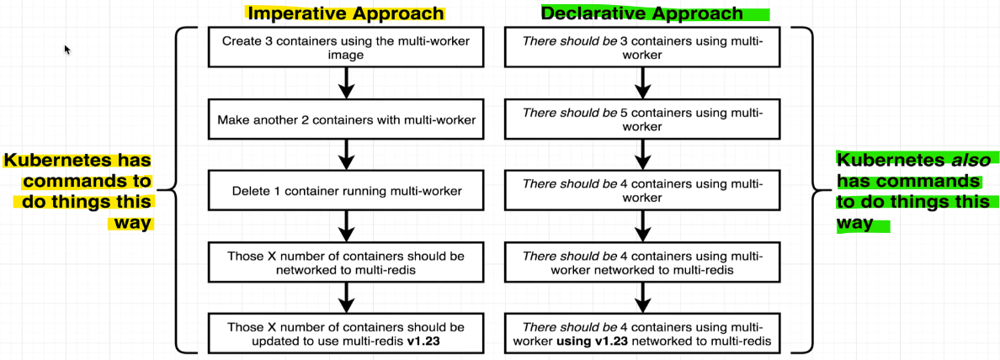

<br>

### Best Practices
* `Declarative Approach`: Preferred for production environments and complex deployments.
* `Configuration Files`: Continuously update and apply configuration files to manage the desired state.
* `Avoid Imperative Commands`: While possible, imperative commands are less efficient and more error-prone.

<br>

### Summary
* `Declarative Deployment`: Simplifies updates by specifying the desired state in configuration files.
* `Imperative Deployment`: Requires manual intervention and detailed knowledge of the current state.
* `Best Practices`: Use the declarative approach for consistent and efficient management of Kubernetes clusters.

<br>

<hr style="height:4px;background:black">

<br>