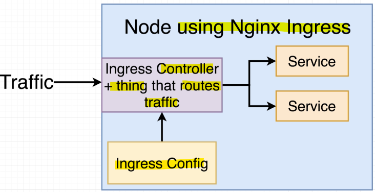

- [Section 15: Handling Traffic with Ingress Controllers](#section-15-handling-traffic-with-ingress-controllers)
  - [Load Balancer Services](#load-balancer-services)
    - [Types of Services](#types-of-services)
    - [Ingress Service](#ingress-service)
    - [Why Not Use Load-Balancer?](#why-not-use-load-balancer)
  - [A Quick Note on Ingresses](#a-quick-note-on-ingresses)
    - [Ingress Overview](#ingress-overview)
    - [Projects to Be Aware Of](#projects-to-be-aware-of)
    - [Key Points](#key-points)
  - [One Other Quick Note!](#one-other-quick-note)
    - [Key Points](#key-points-1)
    - [Why Google Cloud?](#why-google-cloud)
    - [Ingress Setup Challenges](#ingress-setup-challenges)
  - [Behind the Scenes of Ingress](#behind-the-scenes-of-ingress)
    - [Reminder of Kubernetes Config Files](#reminder-of-kubernetes-config-files)
    - [Controllers in Kubernetes](#controllers-in-kubernetes)
    - [Ingress Controller](#ingress-controller)
    - [Ingress-NGINX Project](#ingress-nginx-project)
    - [Key Takeaway](#key-takeaway)
  - [More Behind the Scenes of Ingress](#more-behind-the-scenes-of-ingress)
    - [Three Pieces of Ingress Setup](#three-pieces-of-ingress-setup)
    - [Google Cloud Implementation](#google-cloud-implementation)
    - [Default Backend](#default-backend)
    - [Why Use Ingress NGINX?](#why-use-ingress-nginx)
    - [Key Takeaway](#key-takeaway-1)
  - [Setting Up Ingress Locally with Minikube](#setting-up-ingress-locally-with-minikube)
    - [Steps to Set Up Ingress-NGINX](#steps-to-set-up-ingress-nginx)
  - [Creating the Ingress Configuration](#creating-the-ingress-configuration)
    - [Steps to Create Ingress Config File](#steps-to-create-ingress-config-file)
    - [Explanation of Config File](#explanation-of-config-file)
    - [Applying the Config File](#applying-the-config-file)
  - [Testing Ingress Locally](#testing-ingress-locally)
    - [Steps to Test the Application](#steps-to-test-the-application)
    - [Understanding the Security Warning](#understanding-the-security-warning)
    - [Testing the Application](#testing-the-application)
    - [Key Takeaway](#key-takeaway-2)
  - [The Minikube Dashboard](#the-minikube-dashboard)
    - [Steps to Access Minikube Dashboard](#steps-to-access-minikube-dashboard)
    - [Features of the Dashboard](#features-of-the-dashboard)
    - [Editing and Creating Objects](#editing-and-creating-objects)
    - [Key Takeaway](#key-takeaway-3)

<br>

<hr style="height:4px;background:black">

<br>

# Section 15: Handling Traffic with Ingress Controllers

## Load Balancer Services
> **Objective**: Allow traffic to get into our application using Kubernetes services.


<br>

### Types of Services
`Cluster IP`:
* Allows **other pods** to **access** a particular **service** or set of pods **within the cluster**.

`Node Port`:
* Used for **development environments** to **allow external access** to a pod.
* Not suitable for production environments.

`Load-Balancer`:
* A legacy way to **get traffic into your application**.
* Creates an **external load-balancer through your cloud provider** (e.g., AWS, Google Cloud).
* Only provides access to **one** set of pods.
* Not suitable for applications with multiple sets of pods to expose.

<br>

### Ingress Service
* `Purpose`: A newer and better way to get **traffic into your cluster**.

`Advantages`:
* Can manage access to multiple sets of pods.
* More flexible and suitable for production environments.

<br>

### Why Not Use Load-Balancer?
`Limitations`:
* Only provides access to one set of pods.
* Creates an external resource that may not be necessary.
* Considered a legacy method and may be deprecated in the future.

<br>

<hr style="height:4px;background:black">

<br>

## A Quick Note on Ingresses
> **Objective**: **Allow traffic** to get into our application and **route it** to the **appropriate pods**.

### Ingress Overview
* `Function`: Traffic comes in, hits the ingress, and is **routed** to either the **client** set of pods or the **server** set of pods.

<br>


<br>

### Projects to Be Aware Of
`Ingress-Nginx`:
* **Community-Led Project**: Part of the official Kubernetes organization.
* **GitHub Repository**: [Ingress-Nginx](https://github.com/kubernetes/ingress-nginx).
* **Documentation**: Ensure you are looking at the correct documentation for this project.

`Kubernetes Ingress`:
* **Led by Nginx Company**: A separate project with a similar name and function.
* **GitHub Repository**: [Kubernetes Ingress](https://github.com/nginx/kubernetes-ingress).
* **Documentation**: Be cautious not to confuse this with the ingress-nginx project.

<br>


<br>

### Key Points
* `Separate Projects`: Ingress-Nginx and Kubernetes Ingress are two different projects.
* `Documentation`: Always ensure you are referencing the correct documentation for the ingress-nginx project.

<br>

<hr style="height:4px;background:black">

<br>

## One Other Quick Note!

### Key Points
* `Different Environments`: The setup of Ingress NGINX varies depending on the environment (local, Google Cloud, AWS, Azure).
* `Course Focus`: We will set up Ingress NGINX on our **local machine** and on **Google Cloud**.

### Why Google Cloud?
* `Change from AWS`: Although we used AWS previously, we will deploy our Kubernetes cluster to Google Cloud.
* `Reasons`: There are very good reasons for choosing Google Cloud over AWS, which will be explained in detail when we move to production.

### Ingress Setup Challenges
* `Finicky Setup`: The setup of Ingress can be a bit tricky due to the differences in environments and the existence of similar projects.
* `Identical Projects`: Be aware of the two separate Ingress projects with similar names and functions.

<br>

<hr style="height:4px;background:black">

<br>

## Behind the Scenes of Ingress

### Reminder of Kubernetes Config Files
* `Desired State`: **Config files describe** the desired state of the application (e.g., running three pods with the multi-client image).
* `Deployment Object`: **kubectl creates** a deployment object that **ensures the current state matches the desired state** by creating the necessary **pods**.

<br>


<br>

### Controllers in Kubernetes
* `Definition`: A controller is an **object** that **constantly works to make the desired state a reality inside the cluster**.
  * **Example**: The deployment object is a type of controller.

<br>

### Ingress Controller
* `Function`: Similar to other controllers, it **ensures the desired state** (routing rules) is implemented.

**Process**:
1. `Ingress Config`: A config file describing **routing rules**.
2. `kubectl`: Feeds the config file into kubectl.
3. `Ingress Controller`: Created by kubectl to **implement** the **routing rules**.
4. `NGINX Pod`: The **controller creates a pod** running NGINX with the **specified routing rules**.

<br>


<br>

### Ingress-NGINX Project
* `Combined Functionality`: Ingress controller and the traffic routing component are the same thing.

**Process**:
1. `Ingress Config`: Create a set of routing rules.
2. `kubectl`: Feeds the config file into kubectl.
3. `Single Deployment`: Ingress-NGINX creates a single deployment that reads the ingress config and creates a pod to handle routing.

<br>




<br>

### Key Takeaway
* `Ingress Config`: Describes routing rules.
* `Ingress Controller`: Ensures the routing rules are implemented by creating the necessary infrastructure.

<br>

<hr style="height:4px;background:black">

<br>

## More Behind the Scenes of Ingress
> **Objective**: Understand the three pieces of setting up Ingress and how it applies to our application.

<br>

### Three Pieces of Ingress Setup
* `Ingress Config`: Describes **routing rules** for the application.
* `Ingress Controller`: **Implements** the routing rules defined in the Ingress config.
* `NGINX Pod`: Takes incoming **traffic** and **routes** it to the **appropriate service**.

<br>


<br>

### Google Cloud Implementation
`Google Cloud Load Balancer`:
* Created automatically when setting up Ingress on Google Cloud.
* **Routes traffic** into the **cluster**.

`Load Balancer Service`:
* Attached to the deployment created by the Ingress controller.
* **Routes traffic** from the **Google** Cloud Load Balancer to the **NGINX pod**.

`NGINX Pod`:
* **Routes traffic** to the **appropriate service** (multi-client or multi-server).

<br>


<br>

### Default Backend
* `Purpose`: Used for **health checks** to ensure the cluster is working correctly.
* `Ideal Setup`: Replace the default backend with your Express API server for health checks.

<br>


<br>

### Why Use Ingress NGINX?
* `Kubernetes Awareness`: Ingress NGINX has code that is aware of the Kubernetes environment.
* `Direct Routing`: Routes traffic directly to pods, bypassing the cluster IP service.
* `Sticky Sessions`: Supports features like sticky sessions, ensuring requests from the same user go to the same server.

<br>

### Key Takeaway
* `Ingress NGINX`: Provides additional features and optimizations for Kubernetes environments compared to a custom NGINX setup.

<br>

<hr style="height:4px;background:black">

<br>

## Setting Up Ingress Locally with Minikube

### Steps to Set Up Ingress-NGINX
1. `Navigate to GitHub Repository`:
   * Go to [github.com/kubernetes/ingress-nginx](https://github.com/kubernetes/ingress-nginx).

2. `Access Documentation`:
   * Click on the documentation link at the top of the page.

3. `Find Deployment Instructions`:
   * Click on the "Deployment" tab at the top of the documentation page.
   * Select "Minikube" for standard usage instructions.

4. `Enable Ingress Addon`:
   * Run the following command in your terminal:

```bash
minikube addons enable ingress
```

* This command enables the Ingress addon in Minikube.

<br>

<hr style="height:4px;background:black">

<br>

## Creating the Ingress Configuration
> **Objective**: Specify routing rules for the application using an Ingress config file.

<br>


<br>

### Steps to Create Ingress Config File
1. `Create New File`:
* In the K8s directory, create a new file called ingress-service.yaml.

2. `Write Config File`:

   1. **API Version**:

```yaml
apiVersion: extensions/v1beta1
```

   1. **Kind**:

```yaml
kind: Ingress
```

   3. **Metadata**:

```yaml
metadata:
  name: ingress-service
  annotations:
    kubernetes.io/ingress.class: "nginx"
    nginx.ingress.kubernetes.io/rewrite-target: /
```

<br>


<br>

   4. **Spec**:

```yaml
spec:
  rules:
    - http:
        paths:
          - path: /
            backend:
              serviceName: client-cluster-ip-service
              servicePort: 3000
          - path: /api/
            backend:
              serviceName: server-cluster-ip-service
              servicePort: 5000
```

<br>


<br>

### Explanation of Config File
`Annotations`:
* `kubernetes.io/ingress.class`: "nginx": Specifies that the Ingress controller is based on the NGINX project.
* `nginx.ingress.kubernetes.io/rewrite-target`: /: Configures NGINX to rewrite the request path, removing the /api part.

`Rules`:
* `Path /`: Routes traffic to the client-cluster-ip-service on port 3000.
* `Path /api/`: Routes traffic to the server-cluster-ip-service on port 5000.

<br>

### Applying the Config File
`Command`:

```bash
kubectl apply -f k8s
```

* This command applies the Ingress config file and sets up networking inside the application.

<br>

<hr style="height:4px;background:black">

<br>

## Testing Ingress Locally
> **Objective**: Verify that the Ingress NGINX configuration is working correctly by testing the application in the browser.

<bR>

### Steps to Test the Application
1. `Get Minikube IP`:
   * Run the following command in your terminal to get the IP address of your Minikube virtual machine:

```bash
minikube ip
```

* Copy the IP address.

<br>

2. `Visit IP Address in Browser`:
   * Open your browser and enter the copied IP address.
   * No need to specify a port, as the service listens on ports 80 and 443 by default.

<br>


<br>

3. `Bypass Security Warning`:
   * You may see a security warning due to the use of a dummy certificate.
   * Click on the "Get more info" button and then "Proceed anyway" to bypass the warning.

<br>

### Understanding the Security Warning
`Dummy Certificate`:
* The NGINX Ingress uses a **fake certificate** by **default**, which is not accepted by browsers like Chrome.
* This warning is only present in the **development environment** and will be fixed in production.

<br>

### Testing the Application
`Enter Index`:
* Test the application by entering some index and submitting it.
* Refresh the page to see if the numbers appear correctly.

### Key Takeaway
* `Successful Setup`: If the application works as expected, it means the Kubernetes cluster is set up correctly for development purposes.

<br>

<hr style="height:4px;background:black">

<br>

## The Minikube Dashboard

### Steps to Access Minikube Dashboard
`Run Minikube Dashboard Command`:

Open your terminal and run:

```bash
minikube dashboard
```

* This command opens the Kubernetes dashboard in your default browser.


`Explore the Dashboard`:
* The dashboard is hosted on your Minikube IP address at port 30000.
* It provides information about deployments, pods, and other resources in your Kubernetes cluster.

<br>

### Features of the Dashboard
`View Deployments and Pods`:
* Scroll through the dashboard to see all the different deployments, pods, and other resources.

<br>

### Editing and Creating Objects
`Avoid Imperative Edits:`
* While you can edit or create objects using the dashboard, it's best to avoid imperative edits.
* Always prefer using config files in your project directory to manage Kubernetes objects.

### Key Takeaway
* `Use Config Files`: Manage Kubernetes objects using config files rather than making changes directly on the dashboard.

<br>

<hr style="height:4px;background:black">

<br>
