- [Section 18: Local Development with Skaffold](#section-18-local-development-with-skaffold)
  - [Awkward Local Development](#awkward-local-development)
    - [Current Setup Limitations](#current-setup-limitations)
    - [Docker Compose Recap](#docker-compose-recap)
    - [Challenges with Kubernetes](#challenges-with-kubernetes)
    - [Introducing Skaffold](#introducing-skaffold)
    - [Skaffold Modes](#skaffold-modes)
    - [Setting Up Skaffold](#setting-up-skaffold)
  - [Installing Skaffold](#installing-skaffold)
    - [Installing Skaffold on Your Local Machine](#installing-skaffold-on-your-local-machine)
    - [Find Installation Instructions](#find-installation-instructions)
    - [Installation on Different Operating Systems](#installation-on-different-operating-systems)
    - [Verify Installation](#verify-installation)
  - [The Skaffold Config File](#the-skaffold-config-file)
    - [Verify Skaffold Installation](#verify-skaffold-installation)
    - [Create Skaffold Configuration File](#create-skaffold-configuration-file)
    - [Define Basic Configuration](#define-basic-configuration)
    - [Specify Build Settings](#specify-build-settings)
      - [Explanation of Configuration](#explanation-of-configuration)
    - [Save and Apply Configuration](#save-and-apply-configuration)
  - [Live Sync Changes](#live-sync-changes)
    - [Configuring Skaffold for Client Deployment](#configuring-skaffold-for-client-deployment)
  - [Automatic Shutdown: Managing Deployments with Skaffold](#automatic-shutdown-managing-deployments-with-skaffold)
    - [Manifest Section](#manifest-section)
    - [Automatic Deployment and Deletion](#automatic-deployment-and-deletion)
    - [Managing Multiple Deployments](#managing-multiple-deployments)
    - [Testing Skaffold](#testing-skaffold)
    - [Persistent Data Caution](#persistent-data-caution)
    - [Live Updates](#live-updates)
  - [Testing Live Sync with the API Server](#testing-live-sync-with-the-api-server)
    - [Adding Artifact Sections for Worker and Server](#adding-artifact-sections-for-worker-and-server)
    - [Benefits of Skaffold](#benefits-of-skaffold)

<br>

<hr style="height:4px;background:black">

<br>

# Section 18: Local Development with Skaffold

## Awkward Local Development

### Current Setup Limitations
* Running code locally with Kubernetes is awkward.
* Deploying to a **Minikube cluster** is possible but **not ideal** for development.

### Docker Compose Recap
* Previously, with Docker Compose, a **volume** was set up to **share the local React project directory** with the **client container**.
* Changes to local code were **automatically reflected** inside the container, updating the React application instantly.

### Challenges with Kubernetes
* **No equivalent setup** for Kubernetes to inject local source code into the client pod.
* Requires **rebuilding the client image** and rerunning the `kubectl apply` command for changes.

### Introducing Skaffold
* Skaffold is a **command-line tool** designed for **local development** with Kubernetes.
* It watches the local React project directory for **changes** and **reflects** them in the **Kubernetes cluster**.

<br>

### Skaffold Modes

`Mode 1`: 
* **Rebuild** the entire client **image from scratch** (normal Docker build process).
* **Docker** rebuilds the client image with **updated source code**.
* **Skaffold** updates the **local Kubernetes cluster** with the new image.

`Mode 2`: 
* Inject **updated files** directly into the **client pod**.
* The client pod **automatically updates itself** with the changes.
* Requires the **client pod to run** in a mode that **detects** and **applies** file changes (e.g., Create React App and Nodemon).

<br>


<br>

### Setting Up Skaffold
* Ensure the project is well-suited for **Mode 2** (automatic refresh with Create React App and Nodemon).
* **Install Skaffold** and configure it to **watch for changes** and **update the Kubernetes cluster** accordingly.

<br>

<hr style="height:4px;background:black">

<br>

## Installing Skaffold

### Installing Skaffold on Your Local Machine
`Visit Skaffold Documentation`:
* Open a browser and navigate to the Skaffold documentation at [skaffold.dev](https://skaffold.dev/docs/install/).

### Find Installation Instructions
* Go to the "Getting Started" page and scroll down to the "Installing Skaffold" section.

> **Note**: Ignore the top part of the page and focus on the installation instructions.

<br>

### Installation on Different Operating Systems

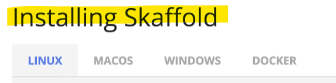

<br>

`Linux`:
* Run the provided commands in the terminal.

`macOS`:
* Use Homebrew to install Skaffold:

```bash
brew install skaffold
```

* Ensure Homebrew is installed. If not, install Homebrew first.

`Windows`:
* If you have Chocolatey installed, use it to install Skaffold.
* If not, download the binary and add it to your PATH. 
  * Search online for instructions on how to add a binary to the PATH on Windows.

<br>

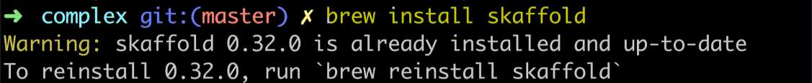

<br>

### Verify Installation
* After installation, verify that Skaffold is installed by running the following command in the terminal:

```bash
skaffold version
```

<br>


<br>

<hr style="height:4px;background:black">

<br>

## The Skaffold Config File

### Verify Skaffold Installation
* Run the following command in the terminal to check the Skaffold version:

```bash
skaffold version
```

* It's okay if you have a newer version; Skaffold's API is relatively stable.

<br>


<br>

### Create Skaffold Configuration File
* Open your code editor and navigate to the root project directory.
* Create a file named skaffold.yaml.

<br>

### Define Basic Configuration
* Add the following boilerplate to the **skaffold.yaml** file:

```yaml
apiVersion: skaffold/v1beta2
kind: Config
```

<br>

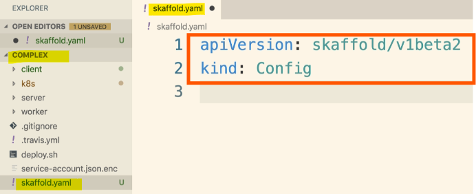

<br>

### Specify Build Settings
* Define the **build** section to list the **images** or **deployments** Skaffold will **manage**:

```yaml
build:
  local:
    push: false
  artifacts:
  - image: stevengrider/multi-client
    context: client
    docker:
      dockerfile: Dockerfile.dev
    sync:
      manual:
      - src: '**/*.js'
      - src: '**/*.css'
      - src: '**/*.html'
```

<Br>

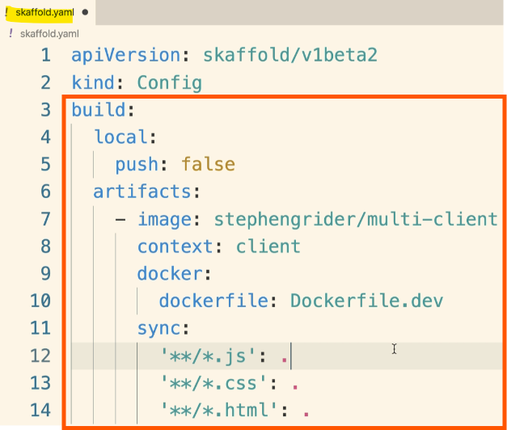


<br>

#### Explanation of Configuration
* `apiVersion`: Specifies the Skaffold API version.
* `kind`: Defines the type of configuration (Config).
* `build`: Section to configure build settings.
  * `local`: Indicates local development settings.
    * `push`: false: Prevents pushing images to a repository.
  * `artifacts`: Lists the images Skaffold will manage.
    * `image`: Name of the image to manage.
    * `context`: Directory where the image is built from.
    * `dockerfile`: Dockerfile to use for building the image.
    * `sync`: Enables Skaffold's Mode 2 for syncing files.
      * `manual`: Specifies file paths to watch for changes and inject into the container.

<br>

### Save and Apply Configuration
* Save the **skaffold.yaml** file.
* This configuration tells Skaffold to manage the multi-client image, watch for changes in JavaScript, CSS, and HTML files, and inject them into the running pod.

<br>

<hr style="height:4px;background:black">

<br>

## Live Sync Changes

### Configuring Skaffold for Client Deployment
1. `Add Artifact`:
   * Ensure Skaffold manages the **client** project by adding an **artifact** in the **skaffold.yaml** file.

<bR>

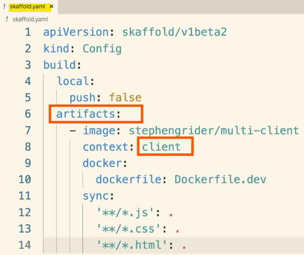

<br>

2. `Set Up Deploy Section`:
   * Define the deploy section to list Kubernetes YAML config files Skaffold should manage:

```yaml
deploy:
  kubectl:
    manifests:
    - k8s/client-deployment.yaml
```

<br>

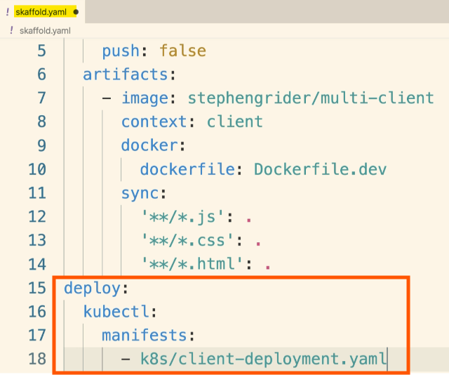

<br>

3. `Watch for Changes`:
   * Skaffold will **watch** the **client** project directory for **changes** in JavaScript, CSS, or HTML files.
   * Changes will be **injected** into the **multi-client pod/container**.

<br>

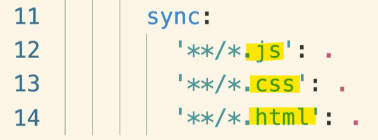

<br>

4. `Fallback to Mode 1`:
   * If changes are made to files other than JavaScript, CSS, or HTML, **Skaffold** will **rebuild the client image** from **scratch**, (Mode 1).

<br>

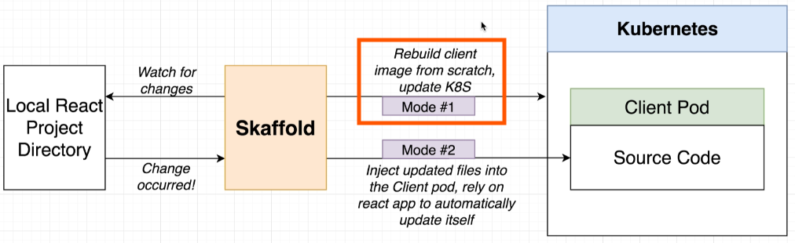

<br>

5. `Run Skaffold`:
   * Start Skaffold in the terminal:

```bash
skaffold dev
```

* Skaffold will **build the client image** and **deploy** it to the **Kubernetes cluster**.

<br>

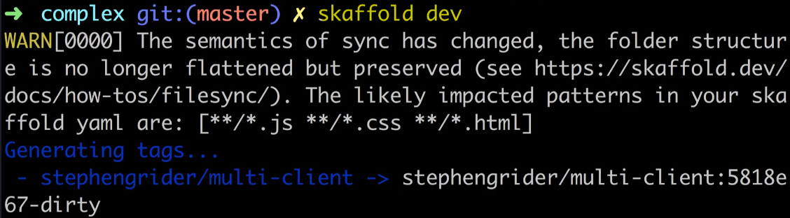

<br>

6. `Check Logs`:
   * View logs to ensure the React application starts successfully in development mode.
   * Logs will appear for **each instance** of the client **pod**.

<bR>

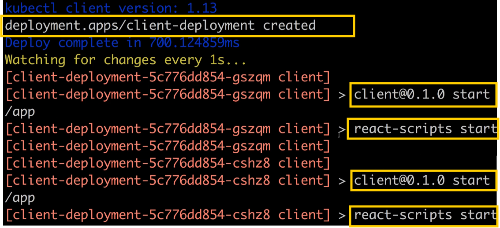


<br>

7. `Test Application`:
   * Open the browser and navigate to the **host alias** (e.g., k8smulti.com) to see the app.
   * Make changes to **project files** (e.g., app.js) and **save** them.
   * Skaffold will **sync the changes** and **inject** them into the **container**.

<bR>

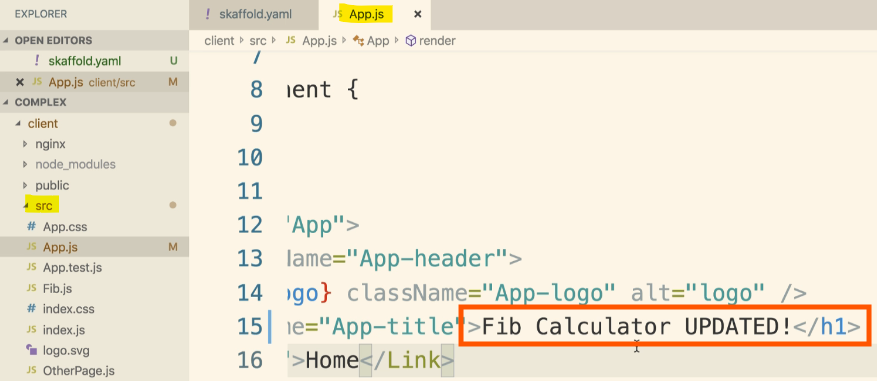

<br>

8. `Verify Updates`:
   * Check the **terminal** for **sync messages** indicating successful file injection.
   * Refresh the browser to see the updated application.

<bR>


<br>

9. `Manual Refresh`:
    * If the live update doesn't appear, manually refresh the browser to see the changes.

<br>

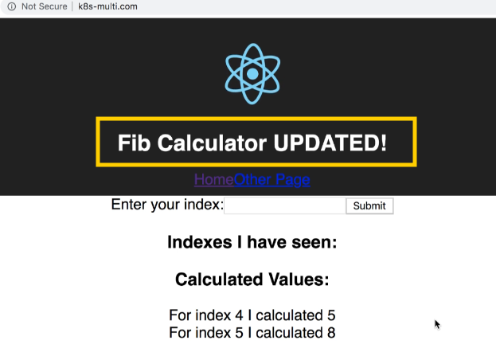

<br>

<hr style="height:4px;background:black">

<br>

## Automatic Shutdown: Managing Deployments with Skaffold

### Manifest Section
* Add a manifest section in the **skaffold.yaml** file to specify the Kubernetes YAML config files Skaffold should manage:

```yaml
deploy:
  kubectl:
    manifests:
    - k8s/client-deployment.yaml
```

<br>

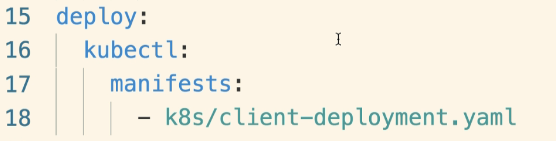

<br>

### Automatic Deployment and Deletion
* When starting Skaffold with `skaffold dev`, it will **automatically apply** the specified **YAML** config files to the **Kubernetes cluster**.
* When **stopping** Skaffold (e.g., with `Ctrl+C`), it will **automatically delete** the **deployments created** with those files.

<br>

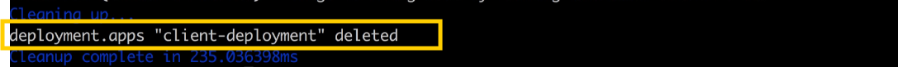

<br>

### Managing Multiple Deployments
* Add additional **deployments** and **services** to the **manifest** section to manage them with Skaffold:

```yaml
deploy:
  kubectl:
    manifests:
    - k8s/client-deployment.yaml
    - k8s/server-deployment.yaml
    - k8s/worker-deployment.yaml
    - k8s/server-cluster-ip-service.yaml
    - k8s/client-cluster-ip-service.yaml
```

<br>

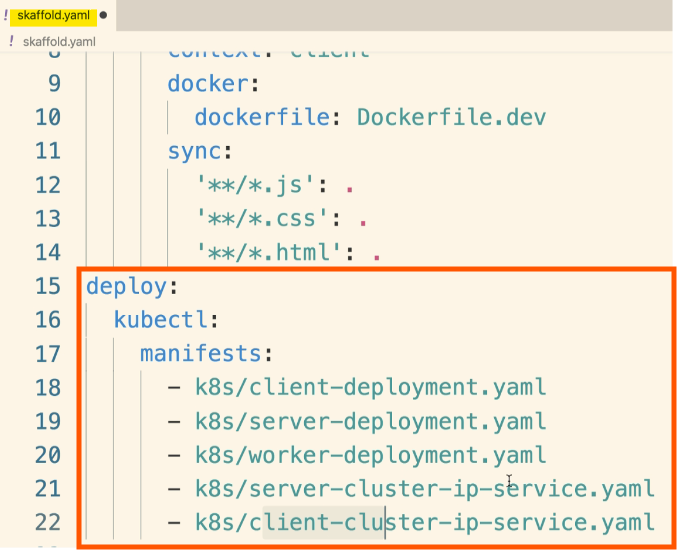

<br>

### Testing Skaffold
* Start Skaffold with `skaffold dev` to apply all specified config files and **start** the React **application**.
* Stop Skaffold with `Ctrl+C` to **delete** all **managed pods** and **services**.

<br>

### Persistent Data Caution
* Avoid adding persistent data (e.g., databases, volumes) to the Skaffold file, as they will be deleted when Skaffold stops.
* Keep **persistent data** deployments **separate** to **prevent data loss**.

<bR>

### Live Updates
* Add all necessary services and deployments to the Skaffold file to enable live updates for the server, worker, and other components.

<br>

<hr style="height:4px;background:black">

<br>

## Testing Live Sync with the API Server

### Adding Artifact Sections for Worker and Server

1. `Add Artifact Sections`:
   * Open the **skaffold.yaml** file and find the **artifact** section.
   * Add an **array** entry for the server:

<br>


<br>

2. `Repeat the process for the worker`:

```yaml
- image: stevengrider/multi-worker
  context: worker
  docker:
    dockerfile: Dockerfile.dev
  sync:
    manual:
    - src: '**/*.js'
```

<br>

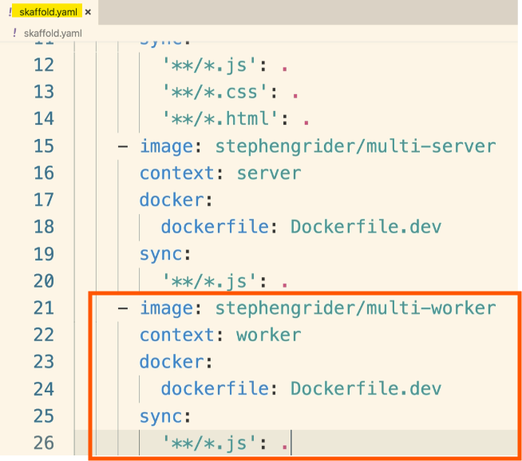

<br>

3. `Syncing Files`:
   * Ensure the **sub-projects** (server and worker) can **detect changes** and **automatically reload**.
   * Use `nodemon` in the **dev** script to **watch for changes** and **restart the project**.

<br>


<br>

4. `Test Skaffold Configuration`:
   * Run Skaffold in the terminal:

```bash
skaffold dev
```

* Skaffold will **build** and **deploy** the **images**, and **start** the **server** and **worker**.

<br>

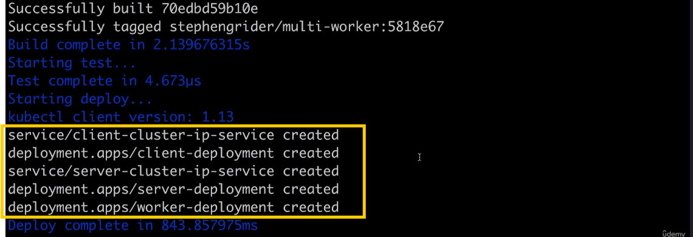

<br>

5. `Verify Changes`:
   * Make a change to the **server** project (e.g., index.js file) and save it.
   * Check the **terminal** to see Skaffold **syncing the file** and `nodemon` **restarting the server**.
   * Refresh the browser to see the changes.

<br>

6. `Stop Skaffold`:
   * Stop Skaffold by hitting `Ctrl+C` to clean up all deployments and services.

<bR>

### Benefits of Skaffold
* Simplifies local development with Kubernetes.


<br>

<hr style="height:4px;background:black">

<br>
