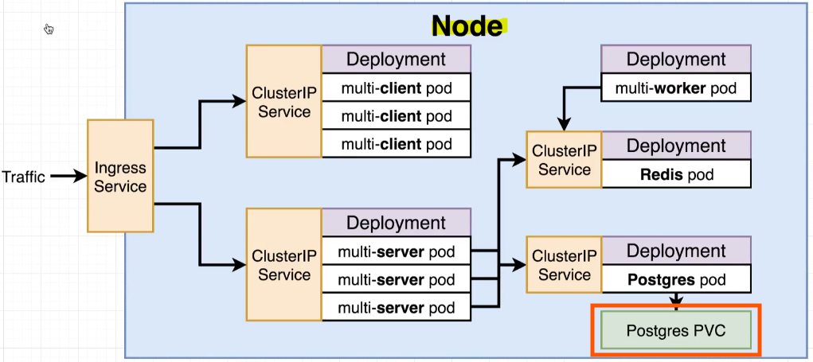
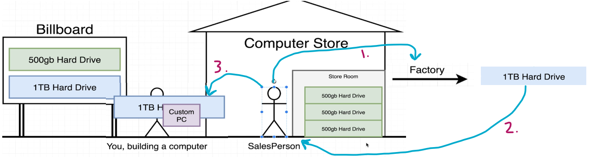

- [Section 14: A Multi-Container App with Kubernetes](#section-14-a-multi-container-app-with-kubernetes)
  - [The Path to Production](#the-path-to-production)
    - [Core Components of Kubernetes](#core-components-of-kubernetes)
    - [Development Steps](#development-steps)
    - [Architecture Overview](#architecture-overview)
    - [New Terminology](#new-terminology)
    - [Configuration Files](#configuration-files)
    - [Deployment Flow](#deployment-flow)
  - [Recreating the Deployment](#recreating-the-deployment)
    - [Testing and Transition](#testing-and-transition)
    - [Project Cleanup](#project-cleanup)
    - [New Folder for Kubernetes](#new-folder-for-kubernetes)
    - [Configuration Files](#configuration-files-1)
  - [NodePort vs ClusterIP Services](#nodeport-vs-clusterip-services)
    - [Understanding Cluster IP](#understanding-cluster-ip)
    - [Practical Use of Cluster IP](#practical-use-of-cluster-ip)
    - [Key Points](#key-points)
  - [The ClusterIP Config](#the-clusterip-config)
    - [Cluster IP Service Configuration](#cluster-ip-service-configuration)
    - [Steps to Create Cluster IP Service](#steps-to-create-cluster-ip-service)
      - [Explanation](#explanation)
    - [Key Points](#key-points-1)
    - [Practical Example](#practical-example)
  - [Applying Multiple Files with Kubectl](#applying-multiple-files-with-kubectl)
    - [Steps to Load Config Files](#steps-to-load-config-files)
    - [Verifying Deployment](#verifying-deployment)
    - [Key Points](#key-points-2)
  - [Expess API Deployment Config](#expess-api-deployment-config)
    - [Steps to Create Deployment Config File](#steps-to-create-deployment-config-file)
      - [Explanation](#explanation-1)
    - [Key Points](#key-points-3)
    - [Environment Variables](#environment-variables)
  - [Cluster IP for the Express API](#cluster-ip-for-the-express-api)
    - [Steps to Create Cluster IP Service Config File](#steps-to-create-cluster-ip-service-config-file)
      - [Explanation](#explanation-2)
    - [Key Points](#key-points-4)
    - [Practical Example](#practical-example-1)
  - [Combining Config into Single Files](#combining-config-into-single-files)
    - [Organising Configuration Files](#organising-configuration-files)
    - [Alternative Organization Method](#alternative-organization-method)
    - [Steps to Combine Config Files](#steps-to-combine-config-files)
    - [Pros and Cons](#pros-and-cons)
    - [Recommendation](#recommendation)
    - [Example of Combined Config File](#example-of-combined-config-file)
    - [Conclusion](#conclusion)
  - [The Worker Deployment](#the-worker-deployment)
    - [Steps to Create Deployment Config File](#steps-to-create-deployment-config-file-1)
      - [Explanation](#explanation-3)
    - [Key Points](#key-points-5)
    - [Environment Variables](#environment-variables-1)
  - [Reapplying a Batch of Config Files](#reapplying-a-batch-of-config-files)
    - [Steps to Apply Config Files](#steps-to-apply-config-files)
    - [Checking for Errors](#checking-for-errors)
    - [Using kubectl Logs](#using-kubectl-logs)
    - [Key Points](#key-points-6)
  - [Creating and Applying Redis Config](#creating-and-applying-redis-config)
    - [Steps to Create Deployment Config File](#steps-to-create-deployment-config-file-2)
      - [Explanation](#explanation-4)
    - [Steps to Create Cluster IP Service Config File](#steps-to-create-cluster-ip-service-config-file-1)
      - [Explanation](#explanation-5)
    - [Key Points](#key-points-7)
    - [Applying Config Files](#applying-config-files)
  - [Last Set of Borning Config!](#last-set-of-borning-config)
    - [Steps to Create Deployment Config File](#steps-to-create-deployment-config-file-3)
      - [Explanation](#explanation-6)
    - [Steps to Create Cluster IP Service Config File](#steps-to-create-cluster-ip-service-config-file-2)
      - [Explanation](#explanation-7)
    - [Key Points](#key-points-8)
    - [Applying Config Files](#applying-config-files-1)
  - [The Need for Volumes with Databases](#the-need-for-volumes-with-databases)
    - [Review of Volumes](#review-of-volumes)
    - [Importance of Volumes for Postgres](#importance-of-volumes-for-postgres)
    - [How Volumes Work](#how-volumes-work)
    - [Avoiding Data Loss](#avoiding-data-loss)
    - [Persistent Volume Claim (PVC)](#persistent-volume-claim-pvc)
    - [How PVC Works](#how-pvc-works)
      - [Example Scenario](#example-scenario)
  - [Kubernetes Volumes](#kubernetes-volumes)
    - [Terminology Clarification](#terminology-clarification)
    - [Volumes in Kubernetes](#volumes-in-kubernetes)
      - [Example: Postgres Deployment](#example-postgres-deployment)
    - [Benefits of Using Volumes](#benefits-of-using-volumes)
    - [Limitations of Volumes](#limitations-of-volumes)
    - [Why Not Use Kubernetes Volumes for Databases](#why-not-use-kubernetes-volumes-for-databases)
  - [Volumes vs Persistent Volumes](#volumes-vs-persistent-volumes)
    - [Volume in Kubernetes](#volume-in-kubernetes)
    - [Persistent Volume in Kubernetes](#persistent-volume-in-kubernetes)
    - [Comparison: Volume vs. Persistent Volume](#comparison-volume-vs-persistent-volume)
      - [Example Scenario](#example-scenario-1)
  - [Persistent Volumes vs Persistent Volume Claims](#persistent-volumes-vs-persistent-volume-claims)
    - [Analogy: Building a Custom Computer](#analogy-building-a-custom-computer)
      - [Scenario 1: Requesting a 500 GB Hard Drive](#scenario-1-requesting-a-500-gb-hard-drive)
      - [Scenario 2: Requesting a 1 TB Hard Drive](#scenario-2-requesting-a-1-tb-hard-drive)
    - [Key Points from the Analogy](#key-points-from-the-analogy)
    - [Kubernetes Terminology](#kubernetes-terminology)
      - [Example Scenario in Kubernetes](#example-scenario-in-kubernetes)
  - [Claim Config Files](#claim-config-files)
    - [Steps to Create PVC Config File](#steps-to-create-pvc-config-file)
      - [Explanation](#explanation-8)
    - [Example Scenario](#example-scenario-2)
  - [Persistent Volume Access Modes](#persistent-volume-access-modes)
    - [What is a PVC?](#what-is-a-pvc)
    - [Spec Section of PVC](#spec-section-of-pvc)
    - [Key Points](#key-points-9)
    - [Example Scenario](#example-scenario-3)
  - [Where Does Kubernetes Allocate Persistent Volumes?](#where-does-kubernetes-allocate-persistent-volumes)
    - [Behind the Scenes of PVC](#behind-the-scenes-of-pvc)
    - [Default Storage Provisioning](#default-storage-provisioning)
    - [Viewing Storage Classes](#viewing-storage-classes)
    - [Cloud Environment Storage Provisioning](#cloud-environment-storage-provisioning)
    - [Customising Storage Provisioning](#customising-storage-provisioning)
    - [Practical Advice](#practical-advice)
  - [Designating a PVC in a Pod Template](#designating-a-pvc-in-a-pod-template)
    - [Steps to Update Postgres Deployment](#steps-to-update-postgres-deployment)
    - [Assigning Storage to Containers](#assigning-storage-to-containers)
    - [Key Points](#key-points-10)
    - [Example Scenario](#example-scenario-4)
  - [Applying a PVC](#applying-a-pvc)
    - [Steps to Apply PVC](#steps-to-apply-pvc)
    - [Verifying Deployment and Pods](#verifying-deployment-and-pods)
    - [Key Points](#key-points-11)
  - [Definging Environment Variables](#definging-environment-variables)
    - [Environment Variables Overview](#environment-variables-overview)
    - [Color-Coded Environment Variables](#color-coded-environment-variables)
    - [Connecting to Redis and Postgres](#connecting-to-redis-and-postgres)
    - [Example Configuration](#example-configuration)
    - [Setting Up Environment Variables](#setting-up-environment-variables)
  - [Adding Environment Variables to Config](#adding-environment-variables-to-config)
    - [Steps to Update Multi-Worker Config File](#steps-to-update-multi-worker-config-file)
      - [Explanation](#explanation-9)
    - [Steps to Update Multi-Server Config File](#steps-to-update-multi-server-config-file)
      - [Exlpanation](#exlpanation)
    - [Key Points](#key-points-12)
  - [Creating an Encoded Secret](#creating-an-encoded-secret)
    - [Importance of PG Password](#importance-of-pg-password)
    - [Using Kubernetes Secrets](#using-kubernetes-secrets)
    - [Creating a Secret](#creating-a-secret)
    - [Verifying the Secret](#verifying-the-secret)
    - [Wiring Up the Secret](#wiring-up-the-secret)
  - [Passing Secrets as Environment Variables](#passing-secrets-as-environment-variables)
    - [Steps to Update Server Deployment](#steps-to-update-server-deployment)
    - [Steps to Update Postgres Deployment](#steps-to-update-postgres-deployment-1)
    - [Applying Changes](#applying-changes)
    - [Key Points](#key-points-13)

<br>

<hr style="height:4px;background:black">

<br>

# Section 14: A Multi-Container App with Kubernetes

## The Path to Production


<br>

### Core Components of Kubernetes
* `Pods`: The smallest deployable units in Kubernetes.
* `Deployments`: Manage the deployment and scaling of pods.
* `Cluster IP Service`: Exposes pods to the outside world.

<br>

> **Goal**: Bring the app into the Kubernetes architecture.

<br>

### Development Steps
`Local Development`:
* Set up the entire application on a local Kubernetes cluster.
* Develop everything locally before deploying to a cloud provider.

`Deployment to Cloud`:
* Deploy to AWS or Google Cloud.
* Expand to multiple nodes if needed.

<br>

### Architecture Overview
`Single Node`: Initial **development** on a **single node**.

`Components`:
* **Multi-client Pods**: Managed by deployment.
* **Multi-server Pods**: Express API managed by deployment.
* **Redis and Postgres Pods**: Managed within Kubernetes instead of external services.

<br>


<br>

### New Terminology
* `Ingress Service`: Manages **external access** to **services**.
* `Cluster IP`: Internal IP for accessing services within the cluster.
* `Persistent Volume Claim` (PVC): Manages storage for pods.

<br>

### Configuration Files
* Create config files for **each component** (e.g., ingress service, cluster IPs, deployments, PVC).
* **Test** everything **locally** using Minikube.

### Deployment Flow
* `GitHub and Travis`: Set up a **deployment flow** similar to previous applications.
* `Cloud Deployment`: Ensure the application can be deployed to AWS or Google Cloud.

<br>

<hr style="height:4px;background:black">

<br>

## Recreating the Deployment

### Testing and Transition
* `Docker Compose`: Tested the multi-container application to ensure it works as expected.
* `Backup`: Make a backup of the project folder before making changes.

### Project Cleanup
`Delete Unnecessary Files`:
* travis.yml
* Docker Compose
* Docker run
* NGINX folder

> **Reason**: These files are not needed for the Kubernetes version of the application.

### New Folder for Kubernetes
* `Create K8s Folder`: This folder will house all the configuration files for the project.


<br>

### Configuration Files
* Total: 11 configuration files.
* First File: client-deployment.yml


<br>

```yaml
apiVersion: apps/v1
kind: Deployment
metadata:   # Name of the deployment (Our Client Deployment)
   name:
spec:
   replicas: 3    # replicas of the multi-client pod
   selector: 
    matchLabels: 
      component: web
   template:
     metadata: 
       labels:
         ccomponent: web
     spec:
       containers:
         - name: client
           image: # Your Docker ID, multi-client
           ports:
             - containerPort: 3000
```

<br>


<br>

<hr style="height:4px;background:black">

<br>

## NodePort vs ClusterIP Services


<br>

### Understanding Cluster IP
* `Service`: Used to **set up networking** for an object (e.g., a single pod or a group of pods).
* `Node Port`: **Exposes pods** to the **outside world**, **allowing access** via an IP and port.

`Cluster IP`:
* Allows **access** to the **object** it **points** to **from within the cluster**.
* Does **not** allow external access.
* Provides **internal access** for **other objects** in the cluster.

<br> 


<br>

### Practical Use of Cluster IP
* **Example**: Cluster IP provides access to the Redis deployment for other objects in the cluster.
* `Without Cluster IP`: The Redis pod would be unreachable from within the cluster.

<br>

### Key Points
* `Cluster IP`: Used for internal access within the cluster.
* `Node Port`: Used for external access.
* `Ingress Service`: Manages external access to services and allows traffic to enter the cluster.

<br>

<hr style="height:4px;background:black">

<br>

## The ClusterIP Config

### Cluster IP Service Configuration
> **Objective**: Expose access to multi-client pods to other objects inside the cluster.

### Steps to Create Cluster IP Service
`Create Config File`:
* File Name: client-cluster-ip-service.yml


<br>

#### Explanation
* `apiVersion`: Specifies the version of the Kubernetes API to use. In this case, it's v1.
* `kind`: Specifies the type of Kubernetes object being created. Here, it's a Service.
* `metadata`: Provides information about the object, such as its name (client-cluster-ip-service).
* `spec`: Defines the desired behavior of the service.
  * `type`: Specifies the type of service. ClusterIP provides internal access within the cluster.
  * `selector`: Specifies the labels used to identify the pods that the service will target. In this case, it targets pods with the label component: web.
  * `ports`: Defines the ports that the service will expose and the target ports on the pods.
    * `port`: The port that other objects inside the cluster will use to access the service.
    * `targetPort`: The port on the target pod that the service provides access to.

<br>

### Key Points
`Cluster IP vs. Node Port`:
* `Cluster IP`: Provides **internal access within the cluster**, not accessible from the outside world.
* `Node Port`: **Exposes pods** to the **outside world**, allowing external access.

`Ports Configuration`:
* `Port`: **Used** by **other objects inside** the **cluster** to access the service.
* `Target Port`: Port on the target pod that the **service provides access to**.

<br>

### Practical Example
* `Cluster IP`: Allows internal objects to access the multi-client pods via port 3000.
* `No External Access`: Cluster IP does not allow external access, unlike Node Port.

<br>

<hr style="height:4px;background:black">

<br>

## Applying Multiple Files with Kubectl
> **Objective**: Ensure the config files are correct and free of typos.

### Steps to Load Config Files
1. `Delete Old Deployment`:
   * **List deployments**: kubectl get deployments
   * **Delete deployment**: kubectl delete deployment client-deployment
   * **Verify deletion**: kubectl get deployments (should show no resources)

2. `Delete Old Service`:
   * **List services**: kubectl get services
   * **Delete service**: kubectl delete service client-node-port
   * **Verify deletion**: kubectl get services (should show only the original Kubernetes service)

3. `Apply New Config Files`:
   * Use kubectl apply -f to apply all config files in the k8s directory: kubectl apply -f k8s
   * This command applies all config files in the specified directory.

4. `Fix Typos`:
   * If there are typos in the config files, correct them and reapply using the same command.

<br>

### Verifying Deployment
`Check Deployments`:
* **List deployments**: kubectl get deployments
* **Verify** that the client deployment has created three pods.

`Check Pods`:
* **List pods**: kubectl get pods
* **Verify** that all three pods are running.

`Check Services`:
* **List services**: kubectl get services
* **Verify** that the cluster IP service for the client is created.

<br>

### Key Points
* `kubectl apply -f`: Applies all config files in the specified directory.
* `Deleting Old Resources`: Ensure old deployments and services are deleted before applying new config files.
* `Verifying Resources`: Use kubectl get commands to verify that deployments, pods, and services are created and running correctly.

<br>

<hr style="height:4px;background:black">

<br>

## Expess API Deployment Config
> **Objective**: Create deployment and cluster IP service for the multi-server (Express API) image.


<br>

### Steps to Create Deployment Config File
`Create Config File`:
* Within your K8s folder, create the file: server-deployment.yml

`Configuration`:

<br>


<br>

#### Explanation
* `apiVersion`: Specifies the version of the Kubernetes API to use. In this case, it's apps/v1.
* `kind`: Specifies the type of Kubernetes object being created. Here, it's a Deployment.
* `metadata`: Provides information about the object, such as its name (server-deployment).
* `spec`: Defines the desired behavior of the deployment.
  * `replicas`: Specifies the number of replicas (pods) to create. Here, it's set to 3.
  * `selector`: Specifies the labels used to identify the pods that the deployment will manage. In this case, it matches pods with the label component: server.
  * `template`: Defines the pod template used to create the pods.
    * `metadata`: Provides information about the pod, such as its labels. Here, it labels the pods with component: server.
    * `spec`: Defines the desired behavior of the pods.
      * `containers`: Specifies the list of containers to run in the pod.
        * `name`: The name of the container (server).
        * `image`: The Docker image to use for the container (your-docker-id/multi-server).
        * `ports`: Specifies the ports to expose. Here, it exposes port 5000.

<br>

### Key Points
* Cluster IP Service: Used to make the Express API accessible only within the cluster.

`Port Configuration`:
* **Port**: 5000 (how other pods access the service)
* **Target Port**: 5000 (port on the target pod)

### Environment Variables
* `Purpose`: Tell the Express API how to connect to Postgres and Redis.
* `To Be Added`: Environment variables will be added later to the deployment config file.

<br>

<hr style="height:4px;background:black">

<br>

## Cluster IP for the Express API
> **Objective**: Create deployment and cluster IP service for the multi-server (Express API) image.

### Steps to Create Cluster IP Service Config File
`Create Config File`:
* Within your K8s folder, create the file: server-cluster-ip-service.yml

`Configuration`:

<br>


<br>

#### Explanation
* `apiVersion`: Specifies the version of the Kubernetes API to use. In this case, it's v1.
* `kind`: Specifies the type of Kubernetes object being created. Here, it's a Service.
* `metadata`: Provides information about the object, such as its name (server-cluster-ip-service).
* `spec`: Defines the desired behavior of the service.
  * `type`: Specifies the type of service. ClusterIP provides internal access within the cluster.
  * `selector`: Specifies the labels used to identify the pods that the service will target. In this case, it targets pods with the label component: server.
  * `ports`: Defines the ports that the service will expose and the target ports on the pods.
    * `port`: The port that other objects inside the cluster will use to access the service.
    * `targetPort`: The port on the target pod that the service provides access to.

<br>

### Key Points
* `Cluster IP Service`: Used to make the Express API accessible only within the cluster.

`Port Configuration`:
* **Port**: 5000 (how other pods access the service)
* **Target Port**: 5000 (port on the target pod)

### Practical Example
* `Cluster IP`: Allows internal objects to access the multi-server pods via port 5000.
* `No External Access`: Cluster IP does not allow external access, unlike Node Port.

<br>

<hr style="height:4px;background:black">

<br>

## Combining Config into Single Files

### Organising Configuration Files
* `Initial Plan`: Create one separate configuration file for each object in the Kubernetes cluster (around 11 files).
* `Challenge`: Managing multiple configuration files can be overwhelming.

<br>

### Alternative Organization Method
* Combining Config Files: Instead of separate files for each object, combine related configurations into a single file.
  * **Example**: Combine the server deployment and server cluster IP service into one file.

<br>

### Steps to Combine Config Files
`Create a New File`:
* * Within your K8s folder, create the file: serverconfig.yaml

`Copy Configurations`:
* Copy the **server-deployment** configuration into the new file.
* Copy the **server-cluster-IP-service** configuration into the same file.

`Separate Configurations`:
* Use three dashes (---) to **separate different configurations** within the same file.

<br>

### Pros and Cons
`Pros`:
* Fewer files to manage.
* Easier to see related configurations in one place.

`Cons`:
* Harder to locate specific configurations.
* Requires understanding that related configurations are combined.

<br>

### Recommendation
* `Separate Files`: Keep configurations in separate files for **clarity** and **ease of management**.
* `Naming Scheme`: Use **clear** and **descriptive names** for each configuration file to make it easy to find specific configurations.

<br>

### Example of Combined Config File
* Within your K8s folder, create the file: server-config.yaml

Contents:

```yaml
# Server Deployment Configuration

apiVersion: apps/v1
kind: Deployment
metadata:
  name: server-deployment
spec:
  replicas: 3
  selector:
    matchLabels:
      component: server
  template:
    metadata:
      labels:
        component: server
    spec:
      containers:
        - name: server
          image: your-docker-id/multi-server
          ports:
            - containerPort: 5000
---

# Server Cluster IP Service Configuration

apiVersion: v1
kind: Service
metadata:
  name: server-cluster-ip-service
spec:
  type: ClusterIP
  selector:
    component: server
  ports:
    - port: 5000
      targetPort: 5000
```

### Conclusion
* `Preference`: Choose the method that works best for you.
* `Course Recommendation`: Follow the strategy of using separate config files for each object for clarity and ease of management.

<br>

<hr style="height:4px;background:black">

<br>

## The Worker Deployment
> **Objective**: Create deployment for the multi-worker pod.


<br>

### Steps to Create Deployment Config File
`Create Config File`:
* Within your K8s folder, create the file: worker-deployment.yml

`Configuration`:

<br>

```yaml
apiVersion: apps/v1
kind: Deployment
metadata:
  name: worker-deployment
spec:
  replicas: 1
  selector:
    matchLabels:
      component: worker
  template:
    metadata:
      labels:
        component: worker
    spec:
      containers:
        - name: worker
          image: your-docker-id/multi-worker
```

<br>


<br>

#### Explanation
* `apiVersion`: Specifies the version of the Kubernetes API to use. In this case, it's apps/v1.
* `kind`: Specifies the type of Kubernetes object being created. Here, it's a Deployment.
* `metadata`: Provides information about the object, such as its name (worker-deployment).
* `spec`: Defines the desired behavior of the deployment.
    * `replicas`: Specifies the number of replicas (pods) to create. Here, it's set to 1.
    * `selector`: Specifies the labels used to identify the pods that the deployment will manage. In this case, it matches pods with the label component: worker.
    * `template`: Defines the pod template used to create the pods.
      * `metadata`: Provides information about the pod, such as its labels. Here, it labels the pods with component: worker.
      * `spec`: Defines the desired behavior of the pods.
        * `containers`: Specifies the list of containers to run in the pod.
          * `name`: The name of the container (worker).
          * `image`: The Docker image to use for the container (your-docker-id/multi-worker).

<br>

### Key Points
* `Scaling`: Start with a **single** replica and scale as **needed based on performance**.
* `Selector and Labels`: Ensure the **labels match** between the **selector** and the **template**.
* `No Ports or Services`: The multi-worker does **not** need to be accessible from other objects in the cluster, so **no ports** or **services** are required.

<br>

### Environment Variables
* `Purpose`: Tell the multi-worker how to connect to Redis.
* `To Be Added`: Environment variables will be added later to the deployment config file.

<br>

<hr style="height:4px;background:black">

<br>

## Reapplying a Batch of Config Files
> **Objective**: Apply the new config files to the Kubernetes cluster and check for errors.

<br>

### Steps to Apply Config Files
`Navigate to Directory`:
* Ensure you are inside the complex directory.

`Apply Config Files`:
* Use `kubectl apply -f k8s` to apply all config files in the k8s directory.
* Kubernetes will update existing objects if they already exist.

<br>


<bR>

### Checking for Errors
`Possible Issues`:
* Deployments may crash due to missing environment variables for Redis or Postgres.
* This is expected and not a problem at this stage.

`Verify Deployments`:
* Use `kubectl get pods` to list all pods and check their status.
* Use `kubectl get deployments` to list all deployments.
* Use `kubectl get services` to list all services.

<br>

### Using kubectl Logs
* `Purpose`: Pull logs from pods to check for errors.

**Command**:
* Use `kubectl logs <pod-name>` to view logs for a specific pod.

> **Note**: Check for errors such as "refuse to connect" which indicates missing Redis or Postgres connections.

<br>

### Key Points
* `Reapplying Config Files`: Kubernetes will update existing objects if the config file changes.
* `Logs`: Use logs to diagnose issues and verify that the pods are running as expected.

<br>

<hr style="height:4px;background:black">

<br>

## Creating and Applying Redis Config
> **Objective**: Create deployment and cluster IP service for Redis.


<br>

### Steps to Create Deployment Config File
`Create Config File`:
* Within your K8s folder, create the file: redis-deployment.yml

`Configuration`:

<br>

```yaml
apiVersion: apps/v1
kind: Deployment
metadata:
  name: redis-deployment
spec:
  replicas: 1
  selector:
    matchLabels:
      component: redis
  template:
    metadata:
      labels:
        component: redis
    spec:
      containers:
        - name: redis
          image: redis
          ports:
            - containerPort: 6379
```

<br>


<br>

#### Explanation
* `apiVersion`: Specifies the version of the Kubernetes API to use. In this case, it's apps/v1.
* `kind`: Specifies the type of Kubernetes object being created. Here, it's a Deployment.
* `metadata`: Provides information about the object, such as its name (redis-deployment).
* `spec`: Defines the desired behavior of the deployment.
  * `replicas`: Specifies the number of replicas (pods) to create. Here, it's set to 1.
  * `selector`: Specifies the labels used to identify the pods that the deployment will manage. In this case, it matches pods with the label component: redis.
  * `template`: Defines the pod template used to create the pods.
    * `metadata`: Provides information about the pod, such as its labels. Here, it labels the pods with component: redis.
    * `spec`: Defines the desired behavior of the pods.
      * `containers`: Specifies the list of containers to run in the pod.
        * `name`: The name of the container (redis).
        * `image`: The Docker image to use for the container (redis from the public Docker Hub repository).
        * `ports`: Specifies the ports to expose. Here, it exposes port 6379.

<br>

### Steps to Create Cluster IP Service Config File
`Create Config File`:
* Within your K8s folder, create the file: redis-cluster-ip-service.yml

`Configuration`:

<br>

```yaml
apiVersion: v1
kind: Service
metadata:
  name: redis-cluster-ip-service
spec:
  type: ClusterIP
  selector:
    component: redis
  ports:
    - port: 6379        # Port that other objects inside the cluster will use to access the service
      targetPort: 6379  # Port on the target pod that the service provides access to
```

<br>


<br>

#### Explanation
* `apiVersion`: Specifies the version of the Kubernetes API to use. In this case, it's v1.
* `kind`: Specifies the type of Kubernetes object being created. Here, it's a Service.
* `metadata`: Provides information about the object, such as its name (redis-cluster-ip-service).
* `spec`: Defines the desired behavior of the service.
  * `type`: Specifies the type of service. ClusterIP provides internal access within the cluster.
  * `selector`: Specifies the labels used to identify the pods that the service will target. In this case, it targets pods with the label component: redis.
  * `ports`: Defines the ports that the service will expose and the target ports on the pods.
    * `port`: The port that other objects inside the cluster will use to access the service.
    * `targetPort`: The port on the target pod that the service provides access to.

<br>

### Key Points
* `Single Replica`: Only one copy of Redis is needed.
* `Default Port`: Redis uses port 6379 by default.
* `Cluster IP Service`: Allows internal objects to access the Redis pod via port 6379.

<br>

### Applying Config Files
* **Command**: Use `kubectl apply -f k8s` to apply all config files in the k8s directory.

**Verify**:
* Use `kubectl get pods` to check that the Redis pod is running.
* Use `kubectl get services` to check that the Redis cluster IP service is running.

<br>

<hr style="height:4px;background:black">

<br>

## Last Set of Borning Config!
> **Objective**: Create deployment and cluster IP service for Postgres.


<br>

### Steps to Create Deployment Config File
`Create Config File`:
* Within your K8s folder, create the file: postgres-deployment.yml

`Configuration`:

<br>

```yaml
apiVersion: apps/v1
kind: Deployment
metadata:
  name: postgres-deployment
spec:
  replicas: 1
  selector:
    matchLabels:
      component: postgres
  template:
    metadata:
      labels:
        component: postgres
    spec:
      containers:
        - name: postgres
          image: postgres
          ports:
            - containerPort: 5432
```

<br>


<br>

#### Explanation
* `apiVersion`: Specifies the version of the Kubernetes API to use. In this case, it's apps/v1.
* `kind`: Specifies the type of Kubernetes object being created. Here, it's a Deployment.
* `metadata`: Provides information about the object, such as its name (postgres-deployment).
* `spec`: Defines the desired behavior of the deployment.
  * `replicas`: Specifies the number of replicas (pods) to create. Here, it's set to 1.
  * `selector`: Specifies the labels used to identify the pods that the deployment will manage. In this case, it matches pods with the label component: postgres.
  * `template`: Defines the pod template used to create the pods.
    * `metadata`: Provides information about the pod, such as its labels. Here, it labels the pods with component: postgres.
    * `spec`: Defines the desired behavior of the pods.
      * `containers`: Specifies the list of containers to run in the pod.
        * `name`: The name of the container (postgres).
        * `image`: The Docker image to use for the container (postgres from the public Docker Hub repository).
        * `ports`: Specifies the ports to expose. Here, it exposes port 5432.

<br>

### Steps to Create Cluster IP Service Config File
`Create Config File`:
* Within your K8s folder, create the file: postgres-cluster-ip-service.yml

`Configuration`:

<br>

```yaml
apiVersion: v1
kind: Service
metadata:
  name: postgres-cluster-ip-service
spec:
  type: ClusterIP
  selector:
    component: postgres
  ports:
    - port: 5432        # Port that other objects inside the cluster will use to access the service
      targetPort: 5432  # Port on the target pod that the service provides access to
```

<Br>


<br>

#### Explanation
* `apiVersion`: Specifies the version of the Kubernetes API to use. In this case, it's v1.
* `kind`: Specifies the type of Kubernetes object being created. Here, it's a Service.
* `metadata`: Provides information about the object, such as its name (postgres-cluster-ip-service).
* `spec`: Defines the desired behavior of the service.
  * `type`: Specifies the type of service. ClusterIP provides internal access within the cluster.
  * `selector`: Specifies the labels used to identify the pods that the service will target. In this case, it targets pods with the label component: postgres.
  * `ports`: Defines the ports that the service will expose and the target ports on the pods.
    * `port`: The port that other objects inside the cluster will use to access the service.
    * `targetPort`: The port on the target pod that the service provides access to.

<br>

### Key Points
* `Single Replica`: Only one copy of Postgres is needed.
* `Default Port`: Postgres uses port 5432 by default.
* `Cluster IP Service`: Allows internal objects to access the Postgres pod via port 5432.

<br>

### Applying Config Files
* **Command**: Use `kubectl apply -f k8s` to apply all config files in the k8s directory.

**Verify**:
* Use `kubectl get pods` to check that the Postgres pod is running.
* Use `kubectl get services` to check that the Postgres cluster IP service is running.

<br>

<hr style="height:4px;background:black">

<br>

## The Need for Volumes with Databases




<br>

### Review of Volumes
* `Volumes in Docker`: Previously used to **share the file system** of a **host machine** with the **file system inside a container**.
  * **Example**: Used in Docker Compose to update files inside a container when source code changes on the local machine.

<bR>


<br>

### Importance of Volumes for Postgres
* `Postgres Database`: **Writes data** to a file system.
* `Issue`: If the Postgres container or pod crashes, all data stored in the container's file system is **lost**.
* `Solution`: Use a **volume** to **store data outside the container** on the **host machine**.

<br>


<br>

### How Volumes Work
* `Data Storage`: Postgres **writes data** to a **volume** on the **host machine**.
* `Pod Crash`: If the pod or container crashes, a **new pod is created** with access to the same volume, **preserving the data**.

<br>

### Avoiding Data Loss
* `Single Replica`: Only **one replica of Postgres** to avoid multiple instances accessing the same volume.
* `Scaling`: To scale Postgres, additional configuration steps are needed beyond just increasing the replica count.

<br>

### Persistent Volume Claim (PVC)
* `Purpose`: A PVC is a way for a pod to **request storage resources**.
* `Volume`: A volume is a **storage resource** that can be used by a pod.
* `Persistent Volume` (PV): A PV is a piece of **storage** in the **cluster** that has been **provisioned by an administrator** or **dynamically provisioned** using Storage Classes.
* `Persistent Volume Claim` (PVC): A PVC is a **request for storage** by a **user**. It is similar to a pod. Pods consume node resources, and PVCs consume PV resources.

<br>

### How PVC Works
* `Request Storage`: A PVC requests storage resources from the **cluster**.
* `Bind to PV`: The PVC is **bound** to a PV that **matches** the **requested storage resources**.
* `Access Storage`: The pod can then **access the storage** provided by the **PV through the PVC**.

#### Example Scenario
* `Without PVC`: If the Postgres pod crashes, all data in the container's file system is lost.
* `With PVC`: If the Postgres pod crashes, a new pod is created with access to the same volume, preserving the data.

<br>

<hr style="height:4px;background:black">

<br>

## Kubernetes Volumes


<br>

### Terminology Clarification
* `Volume`: In Kubernetes, a volume is a specific type of **object** that **allows a container** to **store persistent data** at the **pod level**.
* `PersistentVolume` (PV): A **storage resource** in the **cluster** **provisioned** by an **administrator** or **dynamically** using **Storage Classes**.
* `PersistentVolumeClaim` (PVC): A **request for storage** by a user, similar to how pods consume node resources.

<bR>


<br>

### Volumes in Kubernetes
* `Volume Object`: A **configuration file** can **create a volume object** in Kubernetes.
* `Pod-Level Storage`: The volume is **tied** directly to a **specific pod** and can be **accessed by any container** within that pod.

#### Example: Postgres Deployment
* `Deployment`: Manages a single pod with a Postgres container.
* `Volume`: A data storage pocket tied to the pod, accessible by the Postgres container.

<br>


<br>

### Benefits of Using Volumes
* `Container Restarts`: If the container crashes and is restarted, the **new container** has **access** to the **same volume and data**.

### Limitations of Volumes
* `Pod Termination`: If the pod itself is terminated or deleted, the **volume** and its **data** are **lost**.
* `Not Suitable for Databases`: Volumes are not appropriate for storing data for databases due to the **risk of data loss** if the pod is recreated.

<br>

### Why Not Use Kubernetes Volumes for Databases
* `Data Loss Risk`: **Volumes** are **tied to pods**, so if the pod is deleted, the volume and data are lost.
* `Persistent Storage`: For databases, we need a more reliable way to persist data across pod restarts and terminations.

<br>

<hr style="height:4px;background:black">

<br>

## Volumes vs Persistent Volumes

### Volume in Kubernetes
* `Definition`: A volume is a type of **object** in Kubernetes that provides **long-term storage tied** to a specific **pod**.
* `Lifecycle`: The volume is **created when the pod is created** and **persists** if a container within the pod crashes.
* `Limitation`: If the **entire pod crashes** or is deleted, the **volume** and its **data are lost**.

<br>

### Persistent Volume in Kubernetes
* `Definition`: A persistent volume (PV) is a type of **object** in Kubernetes that provides **long-term durable storage not tied** to any specific pod or container.
* `Lifecycle`: The persistent volume **exists outside the pod** and is not affected by pod or container crashes.
* `Durability`: The persistent volume persists even if the pod is recreated or deleted, ensuring data is not lost.

<br>

### Comparison: Volume vs. Persistent Volume
`Volume`:
* **Tied** to the **lifecycle** of the pod.
* Data is lost if the pod is deleted or crashes.

`Persistent Volume`:
* **Independent** of the pod **lifecycle**.
* Data persists even if the pod is deleted or crashes.

<br>

#### Example Scenario
`Volume`:
* A Postgres deployment with a volume tied to the pod.
* If the pod crashes, the volume and data are lost.

`Persistent Volume`:
* A Postgres deployment with a persistent volume outside the pod.
* If the pod crashes, the persistent volume and data persist, and the new pod can access the same data.

<br>

<hr style="height:4px;background:black">

<br>

## Persistent Volumes vs Persistent Volume Claims
> **Objective**: Understand the differences between a persistent volume claim (PVC) and a persistent volume (PV) in Kubernetes.

### Analogy: Building a Custom Computer
* `Scenario`: You are building a custom computer and need a hard drive.
* `Billboard`: Advertises two hard drive options: 500 GB and 1 TB.
* `Computer Store`: You visit the store to request a hard drive.

#### Scenario 1: Requesting a 500 GB Hard Drive
* `Request`: You ask for a 500 GB hard drive.
* `Salesperson`: Checks the store room and finds a 500 GB hard drive ready to go.
* `Outcome`: You receive the 500 GB hard drive immediately.

<br>


<br>

#### Scenario 2: Requesting a 1 TB Hard Drive
* `Request`: You ask for a 1 TB hard drive.
* `Salesperson`: Checks the store room and finds no 1 TB hard drives in stock.
* `Factory Call`: Salesperson calls the factory to create a 1 TB hard drive on the fly.
* `Outcome`: You receive the 1 TB hard drive after it is fabricated.

<br>



<br>

### Key Points from the Analogy
* `Billboard`: Advertises storage options (similar to PVCs).
* `Preassembled Options`: Some storage options are ready to go (statically provisioned PVs).
* `On-the-Fly Creation`: Some storage options are created when requested (dynamically provisioned PVs).

<br>

### Kubernetes Terminology
* `Persistent Volume Claim` (PVC): An advertisement of storage options available in the cluster. It is not an actual volume but a request for storage.
* `Persistent Volume` (PV): An actual instance of storage that can be used by a pod. It can be statically or dynamically provisioned.
* `Statically Provisioned PV`: Created ahead of time and ready to be used.
* `Dynamically Provisioned PV`: Created on the fly when requested by a PVC.

<br>

#### Example Scenario in Kubernetes
* `PVC`: Advertises storage options (e.g., 500 GB and 1 TB).
* `Pod Configuration`: Requests a storage option using a PVC.
* `Kubernetes`: Checks for available PVs and either provides a statically provisioned PV or creates a dynamically provisioned PV.

<br>

<hr style="height:4px;background:black">

<br>

## Claim Config Files
> **Objective**: Create a persistent volume claim (PVC) to advertise a storage option that can be attached to a pod configuration.

### Steps to Create PVC Config File
`Create Config File`:
* Within your K8s folder, create the file: database-persistent-volume-claim.yml

`Configuration`:

```yaml
apiVersion: v1
kind: PersistentVolumeClaim
metadata:
  name: database-persistent-volume-claim
spec:
  accessModes:
    - ReadWriteOnce  # The volume can be mounted as read-write by a single node

  # Resources specifies the storage request
  resources:
    requests:
      storage: 2Gi  # Requesting 2 gigabytes of storage
```

<br>


<br>

#### Explanation
* `apiVersion`: Specifies the version of the Kubernetes API to use. In this case, it's v1.
* `kind`: Specifies the type of Kubernetes object being created. Here, it's a PersistentVolumeClaim.
* `metadata`: Provides information about the object, such as its name (database-persistent-volume-claim).
* `spec`: Defines the desired behavior of the PVC.
  * `accessModes`: Specifies how the volume can be accessed.
    * `ReadWriteOnce`: The volume can be mounted as read-write by a single node. This means only one node can write to the volume at a time.
  * `resources`: Specifies the storage request.
    * `requests`: Specifies the amount of storage requested.
      * `storage`: 2Gi (2 gigabytes). This is the amount of storage being requested for the PVC.

<br>

### Example Scenario
* `PVC`: Advertises a storage option of **2 gigabytes**.
* `Pod Configuration`: **Requests** the 2 gigabyte storage option **using the PVC**.
* `Kubernetes`: **Checks** for **available persistent volumes** (PVs) and either **provides** a **statically** provisioned PV or **creates a dynamically** provisioned PV to **meet the storage request**.

<br>

<hr style="height:4px;background:black">

<br>

## Persistent Volume Access Modes

### What is a PVC?
* `Not Actual Storage`: A PVC is not an actual instance of storage. It is an advertisement for a storage option that can be attached to a pod configuration.
* `Pod Config`: The PVC is attached to a pod config and handed off to Kubernetes.
* `Kubernetes`: Kubernetes finds a persistent volume (PV) that meets the requirements of the PVC, either statically or dynamically provisioned.

<br>

### Spec Section of PVC
* `Access Modes`: Specifies how the volume can be accessed.
  * **ReadWriteOnce**: The volume can be mounted as read-write by a single node.
  * **ReadOnlyMany**: Multiple nodes can read from the volume simultaneously.
  * **ReadWriteMany**: Multiple nodes can read and write to the volume simultaneously.
* `Resources`: Specifies the storage request.
  * Storage: The amount of storage requested. In this example, it is 2 gigabytes (2Gi).

<br>


<br>

### Key Points
* `Access Modes`: Define how the volume can be accessed by nodes.
  * **ReadWriteOnce**: Single node can read and write.
  * **ReadOnlyMany**: Multiple nodes can read.
  * **ReadWriteMany**: Multiple nodes can read and write.
* `Storage Request`: Kubernetes must find a storage option that meets the specified storage size (e.g., 2 gigabytes).

### Example Scenario
* `PVC`: Advertises a storage option with 2 gigabytes of space and ReadWriteOnce access mode.
* `Pod Configuration`: Requests the storage option using the PVC.
* `Kubernetes`: Finds a PV that meets the requirements or creates one on the fly.

<br>

<hr style="height:4px;background:black">

<br>

## Where Does Kubernetes Allocate Persistent Volumes?

### Behind the Scenes of PVC
* `Request Storage`: When a PVC is handed to Kubernetes, it requests a specific amount of storage (e.g., 500 GB).
* `Provisioning Storage`: Kubernetes finds or creates a persistent volume (PV) to meet the storage requirements.

<br>

### Default Storage Provisioning
* `Local Environment`: On a local machine, Kubernetes defaults to using the host's hard drive for storage.
* `Storage Class`: The default storage class is standard, which uses minikube-hostpath to create a slice of the host's hard drive.

<br>


<br>

### Viewing Storage Classes
* **Command**: Use `kubectl get storageclass` to see available storage classes.
* `Default Option`: The default storage class is standard, which uses **minikube-hostpath**.

<br>


<br>

### Cloud Environment Storage Provisioning
* `Cloud Providers`: In a cloud environment, there are multiple storage options available.

  **Examples**:
  * `Google Cloud`: Uses Persistent Disk.
  * `Microsoft Azure`: Uses Azure File or Azure Disk.
  * `AWS`: Uses AWS Block Store.

* `Provisioner`: Determines **how** the **storage is created**. Each cloud provider has its own provisioner.

<br>


<br>

### Customising Storage Provisioning
* `Default Options`: In a cloud environment, the **default storage** class is **automatically configured** for the cloud provider.
* `Custom Options`: You can specify a different storage class if needed.

<br>

### Practical Advice
* `Default Options`: For most applications with traditional databases like Postgres or MySQL, the default storage options provided by the cloud provider are sufficient.
* `Customisation`: You can customise the storage class if you have specific requirements.

<br>

<hr style="height:4px;background:black">

<br>

## Designating a PVC in a Pod Template
> **Objective**: Update the Postgres deployment to request long-term storage using the persistent volume claim (PVC).

### Steps to Update Postgres Deployment
1. `Find Template Section`:
   * Locate the **template** section in the **Postgres-deployment** file.

<br>


<br>

2. `Add Volumes Section`:
   * Add a new key-value pair for **volumes** at the same indentation level as **containers** (inside spec section).

<br>


<br>

3. `Allocate Storage`:
   * This configuration requests long-term storage that meets the requirements of the PVC.

<br>


<br>

### Assigning Storage to Containers
1. `Add Volume Mounts`:
   * Add a new key-value pair for **volume mounts** inside the **container** section.

<br>


<br>

2. `Sub Path`:
   * Add a **sub path** option to **specify a folder inside** the **persistent volume**.

<br>


<br>

### Key Points
* `Volumes Section`: **Requests long-term storage** using the **PVC**.
* `Volume Mounts`: Specifies **how** the **storage** should be **used inside the container**.
* `Mount Path`: **Designates where** inside the container the **storage** should be **available**.
* `Sub Path`: Ensures data is stored inside a specific **folder within** the **persistent volume**.

### Example Scenario
* `PVC`: Advertises a storage option with specific requirements.
* `Pod Template`: Requests the storage option using the PVC.
* `Container`: Specifies how the storage should be used inside the container.

<br>

<hr style="height:4px;background:black">

<br>

## Applying a PVC
> **Objective**: Apply the PVC to the local Kubernetes cluster and verify everything is working correctly.

### Steps to Apply PVC
1. `Navigate to Directory`:
   * Ensure you are inside the complex directory.

2. `Apply Config Files`:
   * Use the command `kubectl apply -f k8s` to apply all config files in the k8s directory.
   * This will create the new PVC and reconfigure the Postgres deployment.

<br>

### Verifying Deployment and Pods
`Check Pods`:
* Use the command `kubectl get pods` to list all pods.
* Verify that the Postgres pod is running and has been restarted.

<br>


<br>

`Check Persistent Volumes` (PV):
* Use the command `kubectl get pv` to list all persistent volumes.
* Verify that a persistent volume with the name pvc-... has been created with **2 gigabytes** of storage.
* Check that the status is Bound, indicating it is in **use**.

<br>


<br>

`Check Persistent Volume Claims` (PVC):
* Use the command `kubectl get pvc` to list all persistent volume claims.
* Verify that the PVC is listed and **matches the requirements** specified in the config file.

<br>


<br>

### Key Points
* `PVC`: An advertisement for a storage option that can be attached to a pod configuration.
* `PV`: An actual instance of storage that meets the requirements of the PVC.
* `Bound Status`: Indicates that the PV is currently in use and has been successfully allocated.

<br>

<hr style="height:4px;background:black">

<br>

## Definging Environment Variables
> **Objective**: Configure environment variables for the multi-server and multi-worker components in Kubernetes.


<br>

### Environment Variables Overview
`Multi-Worker`:
* Needs to connect to Redis using REDIS_HOST and REDIS_PORT.

`Multi-Server`:
* Needs to connect to Redis using REDIS_HOST and REDIS_PORT.
* Needs to connect to Postgres using additional environment variables.

<br>

### Color-Coded Environment Variables
* `Yellow Variables`: Constant values that are straightforward to set up.
* `Red Variables`: Host values that are URLs for connecting to Redis and Postgres.

<br>


<br>

### Connecting to Redis and Postgres
* `ClusterIP Service`: Used to connect multi-worker and multi-server to Redis and Postgres pods.
* `Host Names`: Use the name of the ClusterIP service as the host name for connections.
  * **Example**: REDIS_HOST would be the name of the Redis ClusterIP service.


### Example Configuration
`Redis ClusterIP Service`:
* **Name**: redis-cluster-ip-service
* **Host Name**: redis-cluster-ip-service

<br>


<br>

### Setting Up Environment Variables
* `Constant Values`: Add environment variables to the pod deployment configurations.
* `PG Password`: Requires additional work to manage securely.

<br>

<hr style="height:4px;background:black">

<br>

## Adding Environment Variables to Config
> **Objective**: Add environment variables to the multi-server and multi-worker deployment configurations.

### Steps to Update Multi-Worker Config File
1. `Open Worker Deployment File`:
   * Locate the worker-deployment.yml file.

2. `Add Environment Variables`:
   * Find the container definition in the pod template section.
   * Add an env key to specify environment variables.

`Configuration`:

```yaml
env:
  - name: REDIS_HOST
    value: redis-cluster-ip-service
  - name: REDIS_PORT
    value: `6379`
```

<br>


<br> 

#### Explanation
* `env`: Specifies environment variables to pass into the container.
  * `name`: REDIS_HOST - The name of the environment variable.
  * `value`: redis-cluster-ip-service - The value of the environment variable, which is the name of the Redis ClusterIP service.
  * `name`: REDIS_PORT - The name of the environment variable.
  * `value`: "6379" - The value of the environment variable, which is the default Redis connection port.

<br>

### Steps to Update Multi-Server Config File
1. `Open Server Deployment File`:
   * Locate the server-deployment.yml file.

2. `Add Environment Variables`:
   * Find the container definition in the pod template section.
   * Add an env key to specify environment variables.

`Configuration`:

```yaml
env:
  - name: REDIS_HOST
    value: redis-cluster-ip-service
  - name: REDIS_PORT
    value: "6379"
  - name: PGUSER
    value: postgres
  - name: PGHOST
    value: postgres-cluster-ip-service
  - name: PGPORT
    value: "5432"
  - name: PGDATABASE
    value: postgres
```

<bR>


<br>

#### Exlpanation
* `env`: Specifies environment variables to pass into the container.
  * `name`: **REDIS_HOST** - The name of the environment variable.
  * `value`: **redis-cluster-ip-service** - The value of the environment variable, which is the name of the Redis ClusterIP service.
  * `name`: **REDIS_PORT** - The name of the environment variable.
  * `value`: **6379** - The value of the environment variable, which is the default Redis connection port.
  * `name`: **PGUSER** - The name of the environment variable.
  * `value`: **postgres** - The value of the environment variable, which is the default Postgres user.
  * `name`: **PGHOST** - The name of the environment variable.
  * `value`: **postgres-cluster-ip-service** - The value of the environment variable, which is the name of the Postgres ClusterIP service.
  * `name`: **PGPORT** - The name of the environment variable.
  * `value`: **5432** - The value of the environment variable, which is the default Postgres connection port.
  * `name`: **PGDATABASE** - The name of the environment variable.
  * `value`: **postgres** - The value of the environment variable, which is the default Postgres database.


<br>

### Key Points
* `Environment Variables`: Used to configure how the multi-server and multi-worker connect to Redis and Postgres.
* `Constant Values`: Values like REDIS_PORT and PGPORT are hard-coded.
* `Host Names`: Use the names of the ClusterIP services to connect to Redis and Postgres.

<br>

<hr style="height:4px;background:black">

<br>

## Creating an Encoded Secret
> **Objective**: Securely store and use the PG password environment variable for accessing the Postgres database.

<br>


<bR>

### Importance of PG Password
* `Database Access`: The PG password is used to **access** the **Postgres database**.
* `Security`: The password is **tied** to **Postgres itself**, not Docker or Kubernetes.

### Using Kubernetes Secrets
* `Secret Object`: A Kubernetes object used to **securely store sensitive information** like passwords, API keys, and SSH keys.
* `Purpose`: **Protect sensitive information** from being easily exposed while making it **available to containers**.

<Br>

### Creating a Secret
* `Imperative Command`: Use an imperative command to **create the secret**, rather than a config file, to avoid storing the password in plain text.

**Command**:

```bash
kubectl create secret generic pgpassword --from-literal=PGPASSWORD=yourpassword
```

* `kubectl create secret`: Command to **create** a new secret.
* `generic`: **Type** of secret, used for arbitrary key-value pairs.
* `pgpassword`: **Name** of the secret.
* `--from-literal`: Specifies the **key-value pair** to **store** in the **secret**.
* `PGPASSWORD=yourpassword`: The key-value pair, where **PGPASSWORD** is the **key** and **yourpassword** is the **password**.

<bR>


<br>

### Verifying the Secret
**Command**:

```bash
kubectl get secrets
```

* **Lists** all **secrets** in the **cluster**, including the newly created pgpassword secret.

<br>


<bR>

### Wiring Up the Secret
* `Server Deployment`: Update the server deployment to use the **secret** as an **environment variable**.
* `Postgres Deployment`: Update the Postgres container definition to use the new password.

<br>

<hr style="height:4px;background:black">

<br>

## Passing Secrets as Environment Variables
> **Objective**: Use the Postgres secret to securely provide the PG password to the server and Postgres deployments.

<br>

### Steps to Update Server Deployment
1. `Open Server Deployment File`:
   * Locate the server-deployment.yml file.

2. `Add Environment Variable`:
   * Scroll to the **list** of **environment variables**.
   * Add a new environment variable for the PG password.

`Configuration`:

```yaml
env:
  - name: PGPASSWORD
    valueFrom:
      secretKeyRef:
        name: pgpassword
        key: PGPASSWORD
```

<br>


<br>

`Details`:
* `name`: **PGPASSWORD** - The name of the environment variable.
* `valueFrom`: Specifies that the value comes from a secret.
* `secretKeyRef`: References the secret.
* `name`: **pgpassword** - The name of the secret.
* `key`: **PGPASSWORD** - The key within the secret.

<br>

### Steps to Update Postgres Deployment
1. `Open Postgres Deployment File`:
   * Locate the postgres-deployment.yml file.

2. `Add Environment Variable`:
   * Scroll to the **container** definition.
   * Add an **environment variable** for the **PG password**.

`Configuration`:

```yaml
env:
  - name: PGPASSWORD
    valueFrom:
      secretKeyRef:
        name: pgpassword
        key: PGPASSWORD
```

<br>


<br>

`Details`:
* `name`: **PGPASSWORD** - The name of the environment variable.
* `valueFrom`: Specifies that the value comes from a secret.
* `secretKeyRef`: References the secret.
* `name`: **pgpassword** - The name of the secret.
* `key`: **PGPASSWORD** - The key within the secret.

<br>

### Applying Changes
**Command**:

```bash
kubectl apply -f k8s
```

* Applies the updated configuration files to the Kubernetes cluster.

<br>


<br>

### Key Points
* `Environment Variable`: The PG password is provided as an environment variable to both the server and Postgres deployments.
* `Secret Reference`: The value of the environment variable is securely retrieved from the secret created earlier.

<br>

<hr style="height:4px;background:black">

<br>