- [Section 17: HTTPS Setup with Kubernetes](#section-17-https-setup-with-kubernetes)
  - [HTTPS Setup Overview](#https-setup-overview)
    - [Setting Up HTTPS Support on Kubernetes](#setting-up-https-support-on-kubernetes)
    - [Sequence of Actions](#sequence-of-actions)
    - [Automation with Helm](#automation-with-helm)
  - [Domain Purchase](#domain-purchase)
    - [Purchasing a Domain Name for HTTPS Setup](#purchasing-a-domain-name-for-https-setup)
    - [Steps to Purchase a Domain](#steps-to-purchase-a-domain)
  - [Domain Name Setup](#domain-name-setup)
    - [Steps to Set Up DNS Records](#steps-to-set-up-dns-records)
    - [Verification](#verification)
  - [Cert Manager Install](#cert-manager-install)
    - [Cert-Manager Project](#cert-manager-project)
    - [Steps to Install Cert-Manager](#steps-to-install-cert-manager)
    - [Updated Installation Instructions](#updated-installation-instructions)
    - [Verification](#verification-1)
  - [How to Wire Up Cert Manager](#how-to-wire-up-cert-manager)
    - [Cert-Manager Overview](#cert-manager-overview)
    - [Required Objects](#required-objects)
    - [Process Flow](#process-flow)
  - [Issuer Config File](#issuer-config-file)
    - [Steps to Create Issuer Config File](#steps-to-create-issuer-config-file)
  - [Certificate Config File](#certificate-config-file)
    - [Steps to Create Certificate Config File](#steps-to-create-certificate-config-file)
  - [Deploying Changes](#deploying-changes)
    - [Steps to Deploy](#steps-to-deploy)
    - [Travis CI Integration](#travis-ci-integration)
  - [Verifying the Certificate](#verifying-the-certificate)
    - [Steps to Verify Certificate](#steps-to-verify-certificate)
    - [Successful Setup](#successful-setup)
  - [Ingress Config for HTTPS](#ingress-config-for-https)
    - [Setting Up HTTPS Traffic with NGINX Ingress](#setting-up-https-traffic-with-nginx-ingress)
  - [It Worked!](#it-worked)
    - [Verifying HTTPS Setup with NGINX Ingress](#verifying-https-setup-with-nginx-ingress)
  - [Google Cloud Clean Up](#google-cloud-clean-up)
    - [Steps to clean up](#steps-to-clean-up)
  - [Local Environment Clean Up](#local-environment-clean-up)
    - [Deleting Pods, Deployments, Services from the Multi K8's project](#deleting-pods-deployments-services-from-the-multi-k8s-project)
    - [Stopping Minikube](#stopping-minikube)
    - [Stopping Running Containers](#stopping-running-containers)
    - [Clearing the Build Cache](#clearing-the-build-cache)

<br>

<hr style="height:4px;background:black">

<br>

# Section 17: HTTPS Setup with Kubernetes

## HTTPS Setup Overview

### Setting Up HTTPS Support on Kubernetes
1. `Domain Name Requirement`:
   * You need to **purchase** a **domain name**, which costs about $10 USD. 
   * This is a required step for setting up HTTPS.

2. `Overview of HTTPS Setup`:
   * We'll use **Let's Encrypt**, a service that **provides free certificates**, to set up HTTPS.
   * **Process**: The Kubernetes **cluster** will **interact** with **Let's Encrypt** to **obtain** and **renew certificates**.

<br>

### Sequence of Actions
1. `Request Certificate`: The Kubernetes cluster **requests a certificate** from Let's Encrypt, **claiming ownership of a domain** (e.g., multi-k8s.com).
2. `Verification`: Let's Encrypt **verifies ownership** by making a **request to a specific route** (e.g., multi-k8s.com/.well-known/random-string).
3. `Response`: The Kubernetes **cluster** must **respond** with the **expected information to prove ownership**.
4. `Certificate Issuance`: If verified, Let's Encrypt **issues a certificate valid for 90 days**. 
   * The process must be repeated periodically for renewal.

<bR>

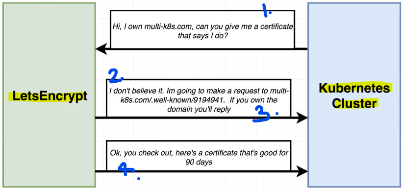

<br>

### Automation with Helm
1. `Helm Plugin`: We'll use Helm to **install a plugin** that **automates the interaction with Let's Encrypt**.

2. `Automatic Handling`:
   * `Request and Verification`: The plugin handles the **request** and **verification process**.
   * `Certificate Management`: The plugin **obtains the certificate**, **saves it** as a **secret**, and makes it **available to the application**.
   * `Renewal`: The plugin **automatically renews** the **certificate** when needed.

<br>

<hr style="height:4px;background:black">

<br>

## Domain Purchase

### Purchasing a Domain Name for HTTPS Setup
* `Requirement`: You must have a domain name for the HTTPS setup process.
* `Domain Registrars`: There are many websites where you can purchase a domain name. 
  * This guide uses [domains.google.com](https://domains.google/), Google's domain service.

> **Note**: As of 10 July 2024, all domains have migrated to [Squarespace](https://domains.squarespace.com/google-domains). Please contact Squarespace for further help.

<br>

### Steps to Purchase a Domain
1. `Open Google Domains`: Go to [domains.google.com](https://domains.squarespace.com/google-domains) in a new browser tab.

2. `Search for a Domain`:
   * Use the search **domains** tab to find a domain name you want.
   * There are **no specific requirements** for the name or TLD (top-level domain).
     * **Example**: You can choose any available domain, even gibberish if you prefer.

3. `Add to Cart and Checkout`:
   * Once you find a domain, add it to your cart.
   * Unless you want to keep the domain long-term, **turn off auto-renew**.
   * Proceed to checkout and purchase the domain.

4. `Domain Dashboard`:
   * After purchase, the domain will appear on your domain dashboard at domains.google.com.

<br>

<hr style="height:4px;background:black">

<br>

## Domain Name Setup
> **Objective**: Ensure your purchased domain points to your Kubernetes cluster IP address.

> **IMPORTANT UPDATE**: As of 10 July 2024, all domains have migrated to [Squarespace](https://domains.squarespace.com/google-domains). Instructions may differ. 

<br>

### Steps to Set Up DNS Records
1. `Find IP Address`:
   * `Kubernetes Dashboard`: Go to the **Services** tab and find the **Ingress Controller IP address**.

<br>

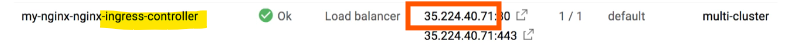

<br>

2. `DNS Settings`:
   * Go to the **DNS settings** for your **purchased domain**.
   * Scroll to the bottom of the page to find **Custom Resource Records**.

<br>

3. `Create A Record`:
   * **Symbol**: Enter @ in the name field.
   * **Type**: Select A record type.
   * **Time-to-Live**: Set to 1 hour.
   * **IP Address**: Enter the IP address from the Ingress Controller (e.g., 35.224.40.71).
   * **Add Record**: Click "Add" to create the record.

<br>

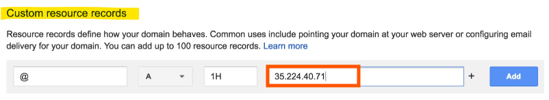

<Br>

4. `Create CNAME Record`:
   * **Name**: Enter www in the name field.
   * **Type**: Select CNAME record type.
   * **Time-to-Live**: Set to 1 hour.
   * **Domain Name**: Enter your domain name (e.g., keights-multi.com).
   * **Add Record**: Click "Add" to create the record.

<br>

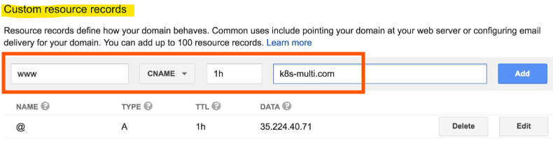

<br>

### Verification
* `Propagation Time`: After some time, the domain will point to the IP address with the load balancer.
* `Access Application`: You can access the application using the domain even before setting up HTTPS, but you will see a "not secure" message until HTTPS is configured.

<br>

<hr style="height:4px;background:black">

<br>

## Cert Manager Install
> **Objective**: Create infrastructure to facilitate automatic communication between the Kubernetes cluster and Let's Encrypt to obtain a TLS certificate.

<br>

### Cert-Manager Project
* `Project Name`: Cert-Manager
* `Homepage`: [github.com/jetstack/cert-manager](https://github.com/cert-manager/cert-manager)

<br>

### Steps to Install Cert-Manager
1. `Open Cert-Manager Repository`:
   * Go to [github.com/jetstack/cert-manager](https://github.com/cert-manager/cert-manager).
   * Scroll down to find the **documentation** section and click on the [link](https://cert-manager.io/docs/).

2. `Getting Started`:
   * Find the "[Getting Started](https://cert-manager.io/docs/getting-started/)" link on the left-hand side.
   * Click on "[Installing Cert-Manager with Helm](https://cert-manager.io/docs/installation/helm/)" to find the installation command.

3. `Install Cert-Manager`:
   * Copy the installation command from the documentation.
   * Paste and run the command in the Google Cloud Shell to install Cert-Manager.

<br>

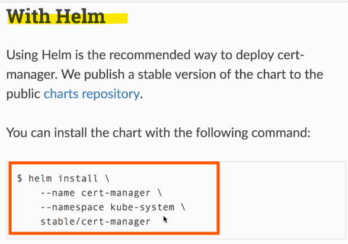

<br>

### Updated [Installation Instructions](https://cert-manager.io/docs/installation/helm/#steps)
1. `Add Jetstack Helm Repository`:

```sh
helm repo add jetstack https://charts.jetstack.io
```

<br>

2. `Update Helm Chart Repository Cache`:

```sh
helm repo update
```

<br>

3. `Install Cert-Manager Helm Chart`:

```sh
helm install \
  cert-manager jetstack/cert-manager \
  --namespace cert-manager \
  --create-namespace \
  --version v1.8.0 \
  --set installCRDs=true
```

<br>

### Verification
* `Check Installation`: Ensure that Cert-Manager is installed correctly by **verifying the creation** of new **pods**, **deployments**, **cluster roles**, and other **objects**.

<br>

<hr style="height:4px;background:black">

<br>

## How to Wire Up Cert Manager
> **Objective**: Integrate Cert-Manager into the project to facilitate automatic communication with Let's Encrypt and obtain a TLS certificate.

<br>

### Cert-Manager Overview
* `Deployment`: Cert-Manager **creates a deployment**, which in turn **creates a pod**. 
  * It also includes a **service account** and a **cluster role binding**, allowing the **pod to manipulate the cluster** and **create resources**.
* `Function`: Cert-Manager sets up a **route handler** to **respond** to Let's Encrypt **verification requests**.

<br>

### Required Objects
1. `Issuer`:
   * `Purpose`: Tells Cert-Manager how to reach out to a certificate authority (Let's Encrypt) and obtain a certificate.
   * `Config File`: Specifies the API address for Let's Encrypt.
   * `Multiple Issuers`: Allows defining multiple issuers, including staging and production versions of Let's Encrypt.

2. `Certificate`:
   * `Purpose`: Details the exact nature of the certificate to be obtained, including the domain name and subdomains.
   * `Config File`: Describes the certificate and defines a Kubernetes secret to store the certificate.
   * `Secret Creation`: The certificate config file specifies the creation of a secret to store the certificate automatically.

<br>

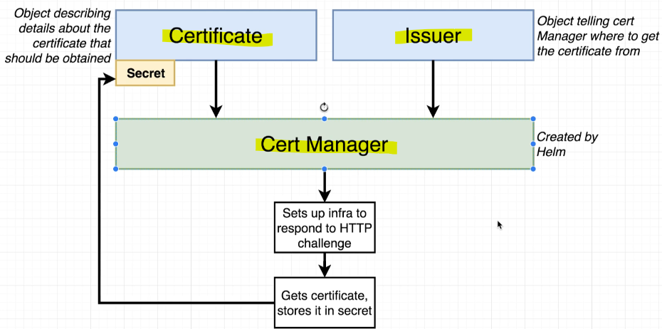

<br>

### Process Flow
1. `Create Issuer and Certificate`: Create the issuer and certificate config files.
2. `Cert-Manager Detection`: Cert-Manager automatically detects the creation of the issuer and certificate.
3. `Initiate Exchange`: Cert-Manager initiates the exchange process with Let's Encrypt.
4. `Certificate Issuance`: Let's Encrypt issues a certificate, which Cert-Manager stores in the specified secret.
5. `NGINX Ingress Configuration`: Reconfigure the NGINX ingress to serve HTTPS traffic using the stored certificate.

<br>

<hr style="height:4px;background:black">

<br>

## Issuer Config File
> **Objective**: Create a configuration file for the issuer object to describe where Cert-Manager should go to obtain a certificate.

<br>

### Steps to Create Issuer Config File
1. `Create File`:
   * Inside the **k8s directory**, create a new file named **issuer.yaml**.

2. `Define API Version`:
   * API Version: Specify the **API version** as **cert-manager.io/v1**.
     * **Explanation**: This version is specific to Cert-Manager and allows creating an issuer type object.

3. `Define Kind and Metadata`:
   * Kind: Set the **kind** to **ClusterIssuer**.
   * Metadata: Give it a name, e.g., **letsencrypt-prod**.

4. `Specify ACME Server`:
   * ACME: Add an entry for **ACME**.
   * Server: Specify the **Let's Encrypt API URL**: https://acme-v02.api.letsencrypt.org/directory.

5. `Add Email`:
   * Enter your personal email address. 
     * This is required by Let's Encrypt but **not** used for verification.

6. `Private Key Secret Reference`:
   * Define a private key secret **reference** with a **name**, e.g., letsencrypt-prod.

7. `Add Solvers Property`:
   * Add a **solvers property** to **specify the HTTP01 challenge** with NGINX ingress.

<br>

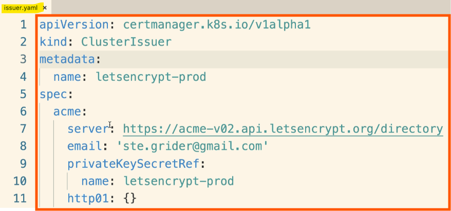


<br>

<hr style="height:4px;background:black">

<br>

## Certificate Config File
> **Objective**: Create a configuration file for the certificate to describe the details of the certificate to be obtained.

<br>

### Steps to Create Certificate Config File
1. `Create File`:
   * Inside the **k8s directory**, create a new file named **certificate.yaml**.

2. `Define API Version`:
   * API Version: Specify the **API version** as **cert-manager.io/v1**.

3. `Define Kind and Metadata`:
   * Kind: Set the kind to **Certificate**.
   * Metadata: Give it a name, e.g., **yourdomain-com-tls**.

4. `Specify Secret Name`:
   * Secret Name: Define **where the certificate** should be **stored** after being obtained by Cert-Manager.
     * **Example**: secretName: yourdomain-com.

5. `Issuer Reference`:
   * Issuer Ref: Reference the **issuer created** earlier.
     * **Name**: letsencrypt-prod.
     * **Kind**: ClusterIssuer.

6. `Common Name`:
   * Specify the **domain name** for the **certificate**.
     * **Example**: commonName: yourdomain.com.

7. `DNS Names`:
   * List the domain names **associated** with the **certificate**.

<br>

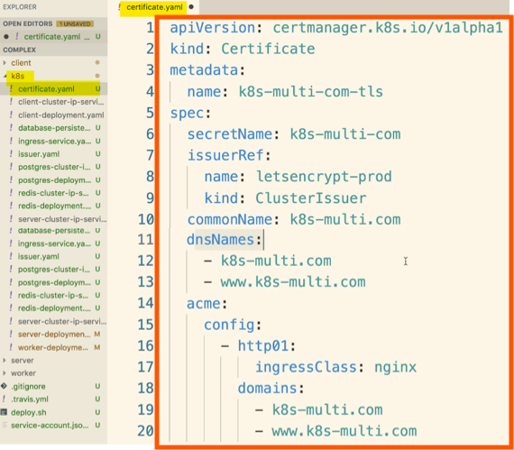

<br>

<hr style="height:4px;background:black">

<br>

## Deploying Changes
> **Objective**: Deploy the issuer and certificate files to create objects inside the Kubernetes cluster.

<br>

### Steps to Deploy
1. `Issuer and Certificate`:
   * Ensure the **issuer.yaml** and **certificate.yaml** files are **created**.
     * These files describe the **issuer** and **certificate details** for **Cert-Manager**.

<br>

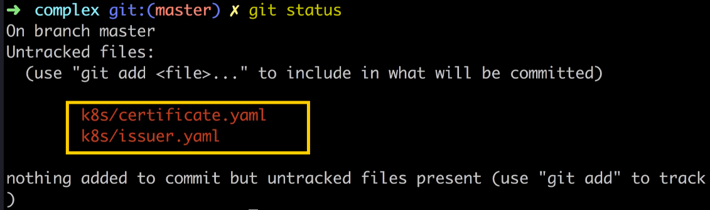

<br>

2. `Deployment Process`:

**Flow**:
1. Deploy the issuer and certificate files.
2. Cert-Manager reaches out to Let's Encrypt.
3. Obtain the certificate and store it in a secret.
4. Update the ingress service to use the new certificate.

<br>

3. `Switch to Master Branch`:
   * Command: `git checkout master`
   * **Explanation**: Switch to the master branch to commit and push changes directly.

<bR>

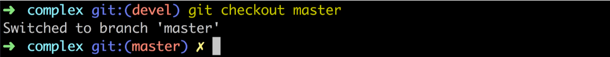

<br>

4. `Commit and Push Changes`:

**Commands**:

```sh
git add .
git commit -m "Added certificate and issuer"
git push origin master
```

* **Explanation**: Commit the changes and push them to the master branch on GitHub.

<br>

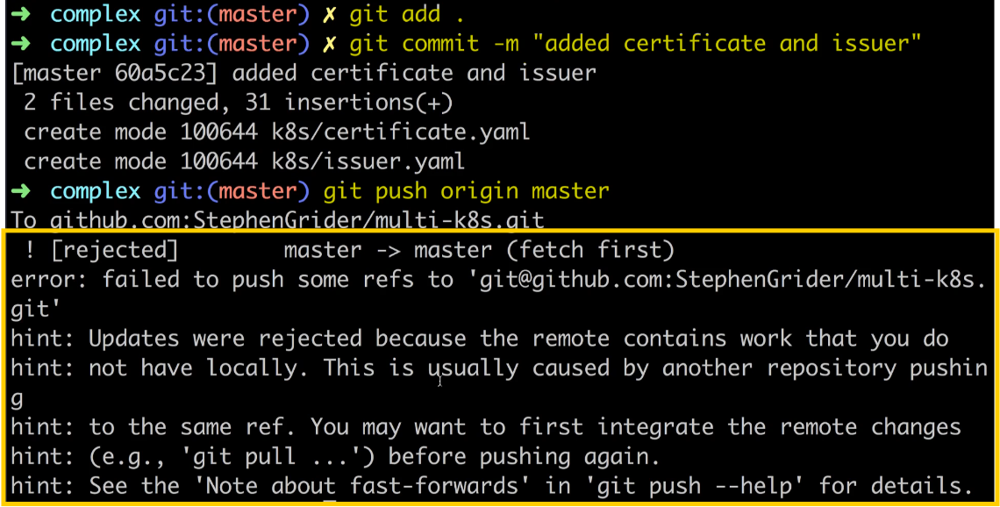

<br>

5. `Handle Merge Conflicts`:
   * Command: `git pull origin master`
     * **Explanation**: Pull changes from the remote repository and resolve any merge conflicts.
   * Command: `git push origin master`
     * **Explanation**: Push the resolved changes to the master branch.

<br>

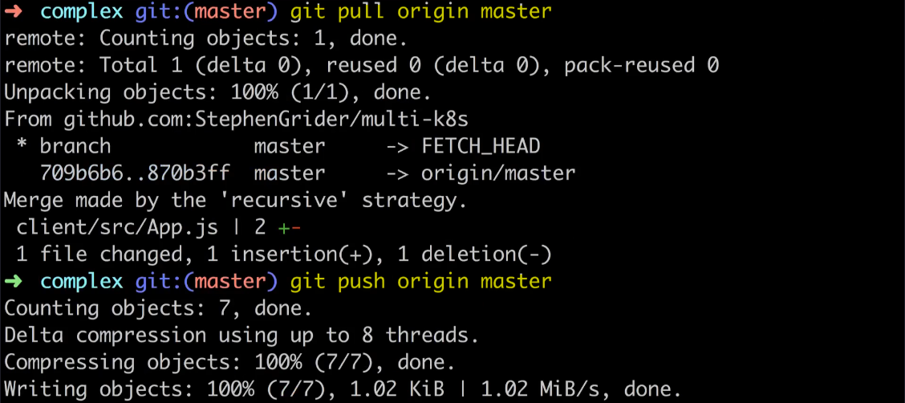

<br>

### Travis CI Integration
`Automatic Deployment`:
* Process: Travis CI picks up the changes, runs tests, and applies the config files in the k8s directory.
* Outcome: The issuer and certificate objects are created in the cluster.

`Verification`:
* Check Cluster: Verify the new resources in the Workload or Configuration sections of the Kubernetes dashboard.
* Certificate: Ensure the new certificate is created and stored in the Configuration section.

<br>

<hr style="height:4px;background:black">

<br>

## Verifying the Certificate
> **Objective**: Ensure that the certificate has been successfully created and deployed in the Kubernetes cluster.

<br>

### Steps to Verify Certificate
1. `Check Certificate Object`:
   * Command: Run `kubectl get certificates` in the cloud console.
   * **Explanation**: This command lists all certificate objects in the cluster.
   * Outcome: Verify that the **certificate object** was **created** (e.g., k8s-multi-com-tls).

<br>


<br>

2. `Describe Certificate`:
   * Command: Run `kubectl describe certificates` in the cloud console.
   * **Explanation**: This command provides **detailed information** about the **certificate object**, including logs of the verification process with Let's Encrypt.

> **Important**: Focus on the events section at the bottom to see messages like "created new ACME order," "domain verified successfully," and "certificate issued successfully."

<Br>

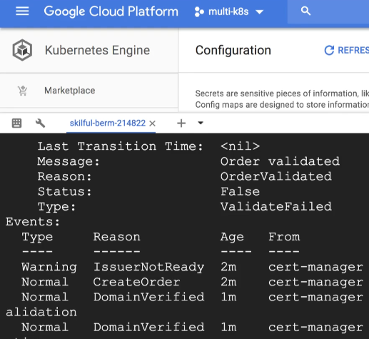

<br>

3. `Check Secret`:
   * Command: Run `kubectl get secrets` in the cloud console.
   * **Explanation**: This command **lists all secrets** in the cluster.
   * Outcome: Verify that the secret with the **certificate name** (e.g., k8s-multi-com) was **created** and contains the **TLS certificate**.

<br>

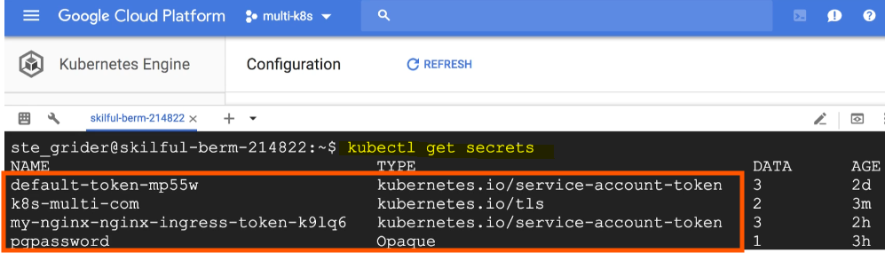

<br>

### Successful Setup
* `Process`: Cert-Manager successfully reached out to Let's Encrypt, responded to the verification request, and obtained the certificate.
* `Renewal`: Cert-Manager will automatically renew the certificate when it is about to expire.

<br>

<hr style="height:4px;background:black">

<br>

## Ingress Config for HTTPS

### Setting Up HTTPS Traffic with NGINX Ingress
1. `Locate the Ingress Service Config File`:
   * Open your code editor and find the **Ingress-service.yml** config file.

2. `Update Annotations`:
   * Add the following **annotation** to inform the Ingress service about using a Let's Encrypt certificate:

```yaml
certmanager.k8s.io/cluster-issuer: letsencrypt-prod
```

<br>

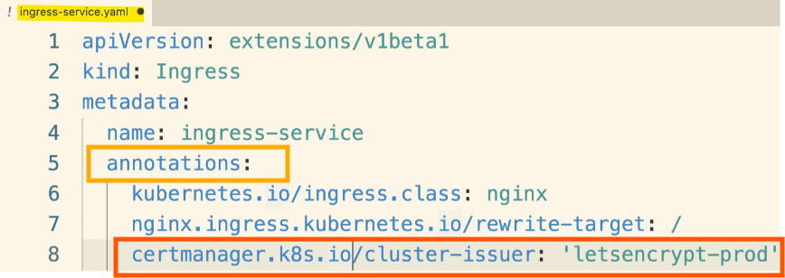


<br>

3. `Force HTTPS Traffic`:
   * Ensure users are always redirected to **HTTPS** by adding this annotation:

```yaml
nginx.ingress.kubernetes.io/ssl-redirect: "true"
```

<br>

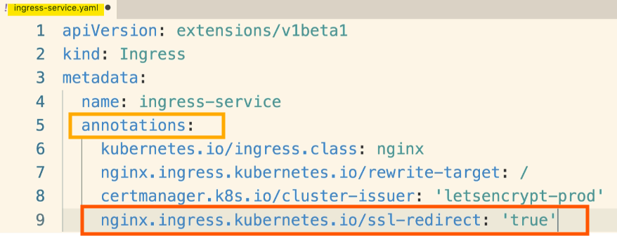


<Br>

4. `Update the Spec Section`:
   * Add a TLS section under the **spec** to specify the **hosts** and the **secret name** for the **certificate**, (this can be found in the certificate.yaml file):

```yaml
spec:
  tls:
  - hosts:
    - k8smulti.com
    - www.k8smulti.com
    secretName: k8s-multi.com
```

<br>

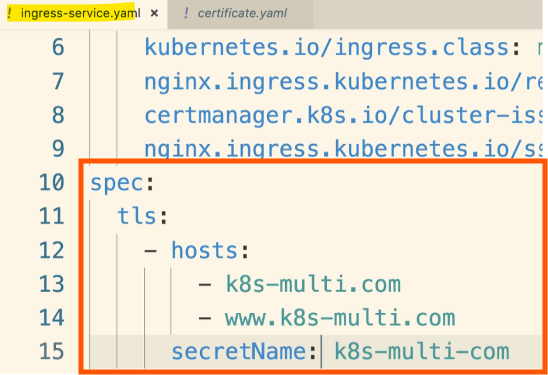


<br>

5. `Reconfigure Rules for Hosts`:
   * Add rules for each host (k8smulti.com and www.k8smulti.com) to ensure they are treated separately:

<br>

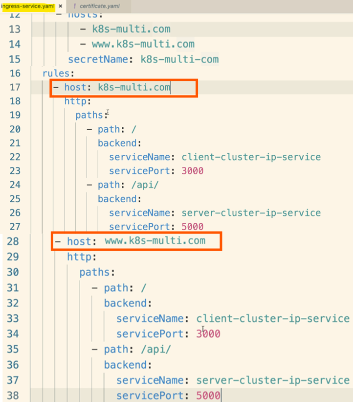


<br>

6. `Deploy Changes`:
   * Save the file and deploy the changes to your cluster:

```bash
git add .
git commit -m "Updated Ingress"
git push origin master
```

<br>

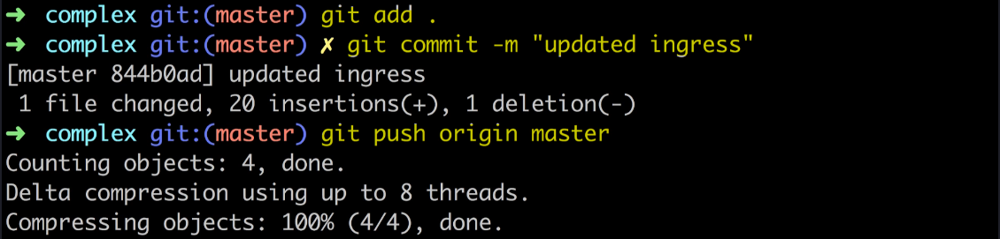

<br>

7. `Verify HTTPS`:
   * After deployment, test your domain with HTTPS in the browser to ensure it loads without errors.

<br>

<hr style="height:4px;background:black">

<br>

## It Worked!

### Verifying HTTPS Setup with NGINX Ingress
1. `Check Travis CI Build`:
   * Ensure your Travis CI build has successfully passed.

2. `Refresh Kubernetes Dashboard`:
   * Go to your Kubernetes dashboard and refresh the page.

3. `Check Ingress Service Endpoints`:
   * Navigate to the **Services** tab and look for the **Ingress Service**.
   * You should see different endpoints representing the routes handled by the Ingress NGINX controller.

4. `Test HTTPS Connection`:
   * Visit the **first endpoint** (e.g., k8s-multi.com) to check if the **HTTPS connection** is working.
   * Look for the green HTTPS indicator on the left-hand side.

5. `Test WWW Subdomain`:
   * Visit the **www** version of your domain (e.g., www.k8smulti.com) to ensure it displays the same page.

6. `Test HTTP to HTTPS Redirection`:
   * Try accessing the **HTTP version of your domain** (e.g., http://k8s-multi.com) to verify it redirects to HTTPS.
   * Repeat the test for the **www** subdomain (e.g., http://www.k8smulti.com).

<br>

<hr style="height:4px;background:black">

<br>

## Google Cloud Clean Up
> **Objective**: Time for some cleanup! If you want to close down the Kubernetes cluster running on Google Cloud, do the following.  Remember, you are paying for the running cluster!

### Steps to clean up

1) Click the **project selector** on the top left of the page.

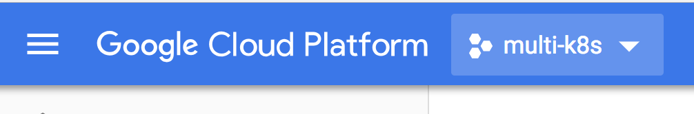

<br>

2) Click the '**gear**' icon on the top right.

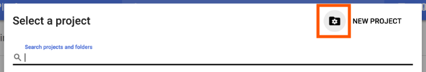

<br>

3) Find your project in the list of projects that is presented, then click the **three dots** on the far right hand side.

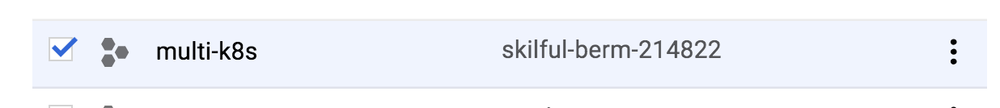

<br>

4) Click '**Delete**'.

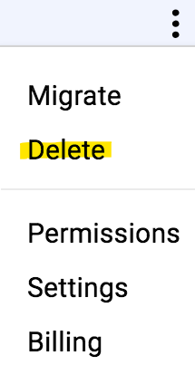

<br>

5) Enter your **project ID** and click '**Shut Down**'.

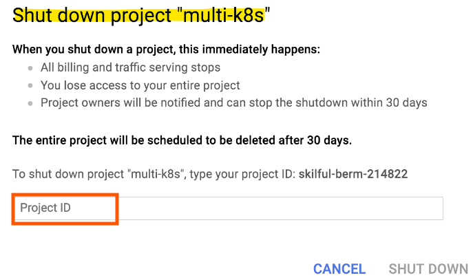

<br>

<hr style="height:4px;background:black">

<br>

## Local Environment Clean Up
> **Objective**: clean up some of the work you did on your local machine. Remember, we have a running Kubernetes cluster, and we have also built a ton of images.

### Deleting Pods, Deployments, Services from the Multi K8's project
* In the root project directory, run `kubectl delete -f k8s/`.

### Stopping Minikube
* To stop Minikube, and the VM that it runs, run `minikube stop`. 
* You can bring your local cluster back online at any time by running minikube start
* To fully delete the cluster, run `minikube delete`.

### Stopping Running Containers
* You might still have some containers running on your machine.  
* Try a `docker ps`.  
* You can then run `docker stop <container_id>` to clean up any running containers.

### Clearing the Build Cache
* All the images that we built and ran during the course are cached on your local machine - they might be taking up to around 1GB of space. 
* You can clean these up by running `docker system prune`.

<br>

<hr style="height:4px;background:black">

<br>