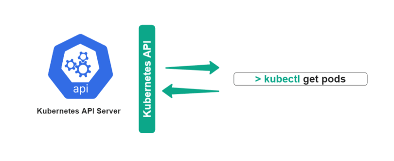
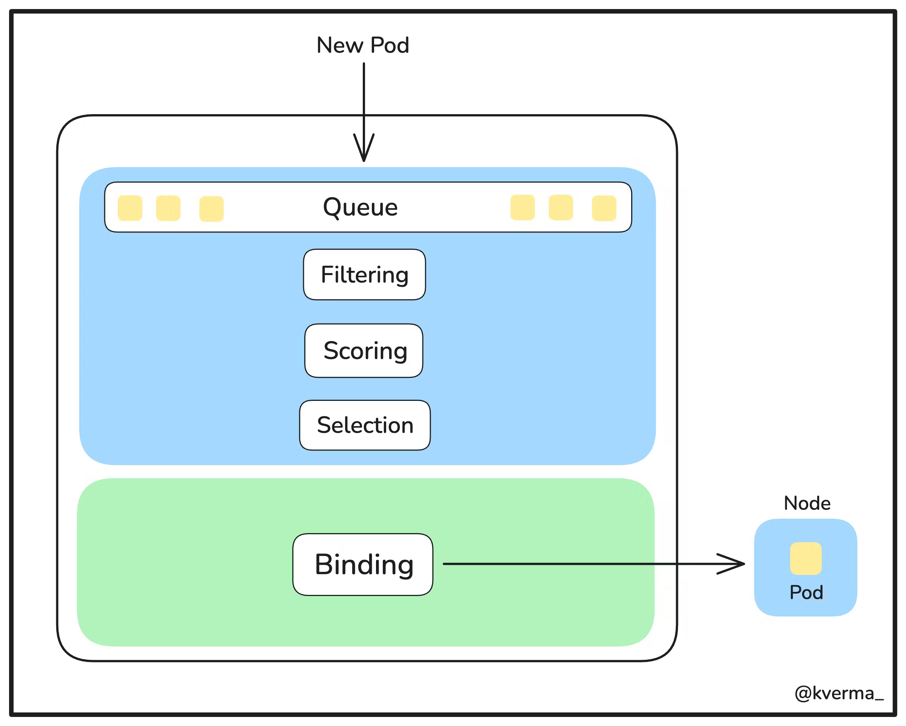
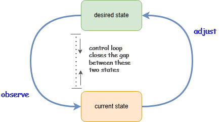
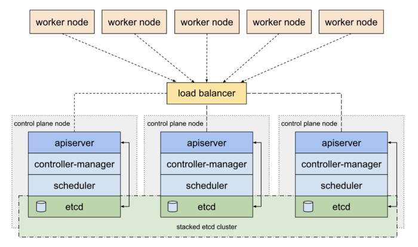
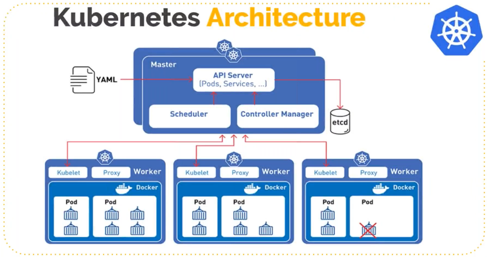
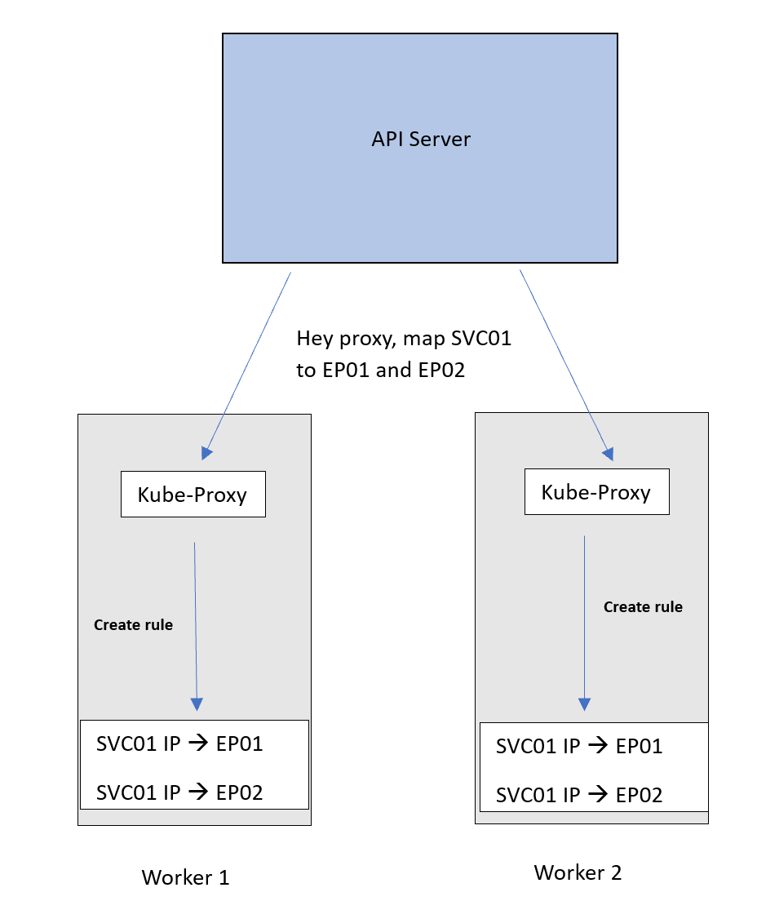
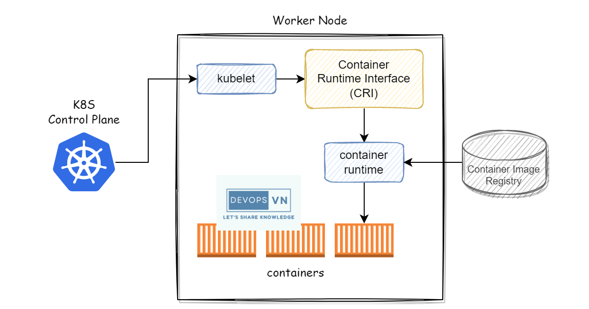

- [Kubernetes (Kubectl) CheatSheet](#kubernetes-kubectl-cheatsheet)
  - [Kubernetes Master Node Components Important Terminologies](#kubernetes-master-node-components-important-terminologies)
    - [API Server](#api-server)
    - [Scheduler](#scheduler)
    - [Controller-Manager](#controller-manager)
    - [etcd](#etcd)
- [Kubernetes Worker Node Components Important Terminologies](#kubernetes-worker-node-components-important-terminologies)
  - [Kubelet](#kubelet)
  - [Kube-Proxy](#kube-proxy)
  - [Container Runtime](#container-runtime)
- [Kubernetes (Kubectl) Commands](#kubernetes-kubectl-commands)
  - [For Cluster Management](#for-cluster-management)
  - [For Node Management](#for-node-management)
  - [For Namespace Management](#for-namespace-management)
  - [For Creating Resources](#for-creating-resources)
  - [For Viewing and Finding Resources](#for-viewing-and-finding-resources)
  - [For Deleting Resources](#for-deleting-resources)
  - [For Copying Files and Directories](#for-copying-files-and-directories)
  - [For Patching Resources](#for-patching-resources)
  - [For Scaling Resources](#for-scaling-resources)
  - [For Pod Management](#for-pod-management)
  - [For Deployment Management](#for-deployment-management)
  - [For ReplicaSets Management](#for-replicasets-management)
  - [For Service Management](#for-service-management)
  - [For Config Maps and Secrets](#for-config-maps-and-secrets)
  - [For Networking](#for-networking)
  - [For Storage](#for-storage)
  - [For StatefulSets](#for-statefulsets)
  - [For Monitoring and Troubleshooting](#for-monitoring-and-troubleshooting)
  - [Miscellaneous](#miscellaneous)
  - [Kubectl Output Verbosity and Debugging](#kubectl-output-verbosity-and-debugging)

 

 

# Kubernetes (Kubectl) CheatSheet
* Kubernetes CheatSheet servers as a quick reference guide for some commands and operations which are widely used in the kubernetes cluster. 
In this cheat sheet:
* Cluster management, node management, namespace management, resource creation, resource viewing and finding, resource deletion, file and directory copying, resource patching, resource scaling, pod management, deployment management, ReplicaSets management, service management, config maps and secrets, networking, storage, stateful sets, monitoring, troubleshooting, and other operations will be covered.

 

 

## Kubernetes Master Node Components Important Terminologies
* API Serve
* Schedule
* Controller-Manage
* etcd

 

### API Server
* Kube API Server interacts with API, its a **frontend** of the kubernetes **control plane**. 
* **Communication center** for developers and other kubernetes components.
* **Receiving queries** from multiple clients, including the kubectl command-line tool, the API server serves as the front-end interface for the Kubernetes control plane, coordinating cluster-wide operations.

 

 

### Scheduler
* The scheduler **watches** the **pods** and **assigns** the pods to **run** on **specific hosts**. 
* A **new pod** does **not** have a specific **node assigned** when it is formed, whether by a user, a deployment controller, or a replication controller. 
* The scheduler **chooses a suitable node** for the pod to run on **after assessing the resource needs** of the pod, such as CPU and memory usage, as well as any restrictions or affinity/anti-affinity rules supplied.

 

 

### Controller-Manager
* The controller manager **runs** the **controllers** in the **background** which run different tasks in the kubernetes **cluster**. 
* Performs **cluster-level functions**(Replication, Tracking worker nodes, Handling failures).

 

 

### etcd
* etcd is a simple distributed **key-value** store. 
* kubernetes uses etcd as its **database** to **store** all **cluster data**. 
* Some of the data stored in etcd is job scheduling information, pods, state information and etc.

 

 

 

# Kubernetes Worker Node Components Important Terminologies
**Worker nodes** are the node where the **application** actually **runs** in a kubernetes **cluster**, it is also known as a `minion`. These worker nodes are **controlled** by the **master node** using Kublet processes.

* kubelet
* kube-Proxy
* Container runtime

 

## Kubelet
* The main **node agent**, known as `Kubelet`, **operates** on **each node** and **reads the container manifests** to make sure that the containers are **active** and in **good condition**. 
* It ensures that **pods of containers** are **operating**. 
* Containers that weren’t made by Kubernetes are not managed by the kubelet.

 

 

## Kube-Proxy
* By **managing network rules** on the host and **managing connections**, kube-proxy **supports** the kubernetes **service abstraction**. 
* On nodes, Kube-proxy keeps **track of network rules**. 
* **Network connectivity** to your pod is **permitted** by these network rules from both **inside** and **outside** of your **cluster**. 
* Having a **network proxy** and **load balancer** for the service on a **single worker node** is beneficial to us.

 

 

## Container Runtime
* To **process commands** from the **master server** to **run containers**, each node needs a container runtime, such as Docker, containerd, or another container runtime.

 

 

 

# Kubernetes (Kubectl) Commands

## For Cluster Management

* `kubectl cluster-infokubectl`: Get cluster information.
* `kubectl get nodes`: Views all the nodes present in the cluster.

 

## For Node Management

* `kubectl get nodes`: List all nodes in the cluster.
* `kubectl describe node <node-name>`: Describe a specific node.
* `kubectl drain <node-name>`: Drain a node for maintenance.
* `kubectl uncordon <node-name>`: Uncordon a node after maintenance.
* `kubectl label node <node_name> <key>=<value>`: You can label the node by using key-value pair.
* `kubectl label node <node_name> <label_key>-`: You can remove the label which is already attached to the node.

 

## For Namespace Management

* `kubectl describe namespace <namespace-name>`: Describe a namespace.
* `kubectl create namespace <namespace-name>`: Create a namespace.
* `kubectl get namespaces`	List all namespaces.
* `kubectl config set-context –current –namespace=<namespace-name>`: Switch to a different namespace.
* `kubectl delete namespace <namespace-name>`: Delete a namespace.
* `kubectl edit namespace <namespace_name>`: Edit and update the namespace definition.

 

## For Creating Resources

* `kubectl apply -f <resource-definition.yaml>`: Create or Update a resource from a YAML file.
* `kubectl create`: Create an object imperatively.
* `kubectl apply -f https://url-to-resource-definition.yaml`: Create a resource by using the URL.

 

## For Viewing and Finding Resources

* `kubectl get <resource-type>`: List all resources of a specific type.
* `kubectl get <resource-type> -o wide`: List all resources with additional details.
* `kubectl describe <resource-type> <resource-name>`: Describe a specific resource.
* `kubectl get <resource-type> -l <label-key>=<label-value>`: List all resources with a specific label.
* `kubectl get <resource-type> –all-namespaces`: List all resources in all namespaces.
* `kubectl get <resource-type> –sort-by=<field>`: List all resources sorted by a specific field.
* `kubectl get <resource-type> -l <label-selector>`: List resources with a specific label selector.
* `kubectl get <resource-type> –field-selector=<field-selector>`: List resources with a specific field selector.
* `kubectl get <resource-type> -n <namespace>`: List all resources in a specific namespace.

 

## For Deleting Resources

* `kubectl delete <resource-type> <resource-name>`: Delete a resource.
* `kubectl delete <resource-type1> <resource-name1> <resource-type2> <resource-name2>`: Delete multiple resources.
* `kubectl delete <resource-type> –all`: Delete all resources of a specific type.
* `kubectl delete -f <resource-definition.yaml>kubectl delete -f https://url-to-resource-definition.yaml`: Delete the resource by using url.
* `kubectl delete <resource-type> –all -n <namespace>`: Delete all resources in a specific namespace.

 

## For Copying Files and Directories

* `kubectl cp <local-path> <namespace>/<pod-name>:<container-path>`: Copy files and directories to a container.
* `kubectl cp <namespace>/<pod-name>:<container-path> <local-path>`: Copy files and directories from a container.
* `kubectl cp <namespace>/<pod-name>:<source-container-path> <destination-namespace>/<destination-pod-name>:<destination-container-path>`: Copying files from one container to another within the same pod.
* `kubectl cp <namespace>/<source-pod-name>:<source-container-path> <destination-namespace>/<destination-pod-name>:<destination-container-path>`: Copying files from one container to another in a different pod.

 

## For Patching Resources

* `kubectl patch <resource-type> <resource-name> -p ‘<patch-document>`: Patch a resource using a JSON or YAML document.
* `kubectl patch <resource-type> <resource-name> –patch-file=<patch-file>`: Patch a resource using a JSON or YAML file.

 

## For Scaling Resources

* `kubectl scale deployment <deployment-name> –replicas=<replica-count>`: Scale a deployment.
* `kubectl scale statefulset <statefulset-name> –replicas=<replica-count>`: Scale a statefulset.
* `kubectl scale replicaset <replicaset-name> –replicas=<replica-count>`: Scale a replica set.

 

## For Pod Management

* `kubectl create -f <pod-definition.yaml>`: Create a pod from a YAML file.
* `kubectl get pods`: List all pods in the cluster.
* `kubectl describe pod <pod-name>`: Describe a specific pod.
* `kubectl logs <pod-name>`: Get logs from a pod.
* `kubectl logs -f <pod-name>`: Stream logs from a pod.
* `kubectl logs -l <label-key>=<label-value>`: Get logs with a specific label.
* `kubectl exec -it <pod-name> — <command>`: Exec into a pod.
* `kubectl delete pod <pod-name>`: Delete a pod.
* `kubectl create pod <pod-name>`: Create a pod with the name.
* `kubectl get pod -n <namespace_name>`: List all pods in a namespace.
* `kubectl run nginx --image=nginx`: create and run the nginx image within a pod.

 

## For Deployment Management

* `kubectl create deployment <deployment-name> –image=<image-name>`: Create a deployment.
* `kubectl get deployments`: List all deployments.
* `kubectl describe deployment <deployment-name>`: Describe a specific deployment.
* `kubectl scale deployment <deployment-name> –replicas=<replica-count>`: Scale a deployment.
* `kubectl set image deployment/<deployment-name> <container-name>=<new-image-name>`: Update a deployment’s image.
* `kubectl rollout status deployment/<deployment-name>`: Rollout status of a deployment.
* `kubectl rollout pause deployment/<deployment-name>`: Pause a deployment rollout.
* `kubectl rollout resume deployment/<deployment-name>`: Resume a deployment rollout.
* `kubectl rollout undo deployment/<deployment-name>`: Rollback a deployment to the previous revision.
* `kubectl rollout undo deployment/<deployment-name> –to-revision=<revision-number>`: Rollback a deployment to a specific revision.
* `kubectl delete deployment <deployment-name>`: Delete deployment name.

 

## For ReplicaSets Management

* `kubectl create -f <replicaset-definition.yaml>`: Create a ReplicaSet.
* `kubectl get replicasets`: List all ReplicaSets.
* `kubectl describe replicaset <replicaset-name>`: Describe a specific ReplicaSet.
* `kubectl scale replicaset <replicaset-name> –replicas=<replica-count>`: Scale a ReplicaSet.

 

## For Service Management

* `kubectl create service <service-type> <service-name> –tcp=<port>`: Create a service.
* `kubectl get services`: List all services.
* `kubectl expose deployment <deployment-name> –port=<port>`: Expose a deployment as a service.
* `kubectl describe service <service-name>`: Describe a specific service.
* `kubectl delete service <service-name>`: Delete a service.
* `kubectl get endpoints <service-name>`: Get information about a service.

 

## For Config Maps and Secrets

* `kubectl create configmap <config-map-name> –from-file=<path-to-file>`: Create a config map from a file.
* `kubectl create secret <secret-type> <secret-name> –from-literal=<key>=<value>`: Create a secret.
* `kubectl get configmaps`: List all config maps.
* `kubectl get secrets`: List all secrets.
* `kubectl describe configmap <config-map-name>`: Describe a specific config map.
* `kubectl describe secret <secret-name>`: Describe a specific secret.
* `kubectl delete secret <secret_name>`: Delete a specific secret.
* `kubectl delete configmap <config-map-name>`: Delete a specific config map.

 

## For Networking

* `kubectl port-forward <pod-name> <local-port>:<pod-port>`: Port forward to a pod.
* `kubectl expose deployment <deployment-name> –type=NodePort –port=<port>`: Expose a deployment as a NodePort service.
* `kubectl create ingress <ingress-name> –rule=<host>/<path>=<service-name> –<service-port>`: Create an Ingress resource.
* `kubectl describe ingress <ingress-name>`: Get information about an Ingress.
* `kubectl get ingress <ingress-name> -o jsonpath='{.spec.rules[0].host}’`: Retrieves the most value from the first rule of the specified Ingress resource.

 

## For Storage

* `kubectl create -f <persistent-volume-definition.yaml>`: Create a PersistentVolume.
* `kubectl get pv`: List all PersistentVolumes.
* `kubectl describe pv <pv-name>`: Describe a specific PersistentVolume.
* `kubectl create -f <persistent-volume-claim-definition.yaml>`: Create a PersistentVolumeClaim.
* `kubectl get pvc`: List all PersistentVolumeClaims.
* `kubectl describe pvc <pvc-name>`: Describe a specific PersistentVolumeClaim.

 

## For StatefulSets

* `kubectl create -f <statefulset-definition.yaml>`: Create a StatefulSet.
* `kubectl get statefulsets`: List all StatefulSets.
* `kubectl describe statefulset <statefulset-name>`: Describe a specific StatefulSet.
* `kubectl scale statefulset <statefulset-name> –replicas=<replica-count>`: Scale a StatefulSet.

 

## For Monitoring and Troubleshooting

* `kubectl get events`: Check cluster events.
* `kubectl get component statuses`: Get cluster component statuses.
* `kubectl top nodes`: Get resource utilization of nodes.
* `kubectl top pods`: Get resource utilization of pods.
* `kubectl debug <pod-name> -it –image=<debugging-image>`: Enable container shell access debugging.

 

## Miscellaneous

* `kubectl delete <resource-type> <resource-name>`: Delete a resource.
* `kubectl describe <resource-type> <resource-name>`: Get detailed information about a resource.
* `kubectl proxy`: Access the Kubernetes dashboard.
* `kubectl completion <shell-type>`: Install kubectl completion.

 

## Kubectl Output Verbosity and Debugging
The verbosity of kubernetes can be controlled by using a command which is kubectl verbosity. We can add no flags according to our requirements.

* `kubectl get <resource-type> –v=<verbosity-level`: By using this command you set the level of verbosity output.
* `kubectl get <resource-type> –v=0`: Used to be visible to a cluster operator.
* `kubectl get <resource-type> –v=3`: You can more information like extended information about changes.
* `kubectl get <resource-type> –v=7`: Displays the HTTPS request headers
* `kubectl get <resource-type> –v=8`: Display HTTP request contents.

 

 
