- [Section 13: Maintaining Sets of Containers with Deployments](#section-13-maintaining-sets-of-containers-with-deployments)
  - [Updating Existing Objects](#updating-existing-objects)
    - [Imperative Approach](#imperative-approach)
    - [Declarative Approach](#declarative-approach)
    - [How Kubernetes Handles Updates](#how-kubernetes-handles-updates)
    - [Steps to Update an Existing Object](#steps-to-update-an-existing-object)
    - [Summary](#summary)
  - [Declarative Updates in Action](#declarative-updates-in-action)
    - [Steps to Update the Configuration File](#steps-to-update-the-configuration-file)
    - [Applying the Updated Configuration](#applying-the-updated-configuration)
    - [Verifying the Update](#verifying-the-update)
    - [Inspecting the Pod](#inspecting-the-pod)
    - [Key Commands](#key-commands)
    - [Declarative Approach](#declarative-approach-1)
    - [Summary](#summary-1)
  - [Limitations in Config Updates](#limitations-in-config-updates)
    - [Steps to Update the Configuration File](#steps-to-update-the-configuration-file-1)
    - [Applying the Updated Configuration](#applying-the-updated-configuration-1)
    - [Error Message](#error-message)
    - [Understanding the Error](#understanding-the-error)
    - [Workaround](#workaround)
    - [Summary](#summary-2)
  - [Running Containers with Delpoyments](#running-containers-with-delpoyments)
    - [Understanding Deployments](#understanding-deployments)
    - [Comparison: Pods vs. Deployments](#comparison-pods-vs-deployments)
    - [Pod Template in Deployments](#pod-template-in-deployments)
    - [Benefits of Using Deployments](#benefits-of-using-deployments)
    - [Example Scenario](#example-scenario)
    - [Summary](#summary-3)
  - [Deployment Configuration Files](#deployment-configuration-files)
    - [Introduction to Deployments](#introduction-to-deployments)
    - [Creating a Deployment](#creating-a-deployment)
    - [Steps to Create a Deployment](#steps-to-create-a-deployment)
  - [Walking Through the Deployment Config](#walking-through-the-deployment-config)
    - [API Version and Object Type](#api-version-and-object-type)
    - [Metadata Section](#metadata-section)
    - [Spec Section](#spec-section)
    - [Replicas and Selector](#replicas-and-selector)
    - [Purpose of Selector](#purpose-of-selector)
  - [Applying a Deployment](#applying-a-deployment)
    - [Deleting Existing Pods](#deleting-existing-pods)
    - [Imperative vs. Declarative Updates](#imperative-vs-declarative-updates)
    - [Deleting a Pod](#deleting-a-pod)
    - [Applying the Deployment](#applying-the-deployment)
    - [Checking Pod Status](#checking-pod-status)
    - [Checking Deployment Status](#checking-deployment-status)
    - [Verifying the Application](#verifying-the-application)
  - [Why Use Services?](#why-use-services)
    - [Connecting to the Container](#connecting-to-the-container)
    - [Why Use Services](#why-use-services-1)
    - [Service Objects](#service-objects)
    - [Checking Pod and Service Status](#checking-pod-and-service-status)
    - [Role of Services](#role-of-services)
  - [Scaling and Changing Deployments](#scaling-and-changing-deployments)
    - [Updating the Deployment Configuration](#updating-the-deployment-configuration)
    - [Applying the Update](#applying-the-update)
    - [Verifying the Update](#verifying-the-update-1)
    - [Scaling the Deployment](#scaling-the-deployment)
    - [Changing the Image](#changing-the-image)
  - [Updating Deployment Images](#updating-deployment-images)
    - [Steps to Update the Deployment](#steps-to-update-the-deployment)
    - [Updating the Deployment Configuration](#updating-the-deployment-configuration-1)
    - [Applying the Changes](#applying-the-changes)
    - [Verifying the Update](#verifying-the-update-2)
  - [Rebuilding the Client Image](#rebuilding-the-client-image)
    - [Steps to Update the Multi-Client Image:](#steps-to-update-the-multi-client-image)
    - [Rebuilding and Pushing the Image:](#rebuilding-and-pushing-the-image)
  - [Triggering Deployment Updates](#triggering-deployment-updates)
    - [Challenges](#challenges)
    - [Possible Solution](#possible-solution)
      - [Solution 1: Manually Delete Pods](#solution-1-manually-delete-pods)
      - [Solution 2: Use Version Tags](#solution-2-use-version-tags)
    - [Steps to Implement Solution 2](#steps-to-implement-solution-2)
    - [Challenges with Versioning](#challenges-with-versioning)
    - [Imperative Command Solution](#imperative-command-solution)
    - [Drawbacks of Imperative Commands](#drawbacks-of-imperative-commands)
    - [Summary of Solutions](#summary-of-solutions)
    - [Conclusion](#conclusion)
  - [Imperatively Updating a Deployment's Image](#imperatively-updating-a-deployments-image)
    - [Step-by-Step Process](#step-by-step-process)
    - [Verifying the Update](#verifying-the-update-3)
    - [Testing in the Browser](#testing-in-the-browser)
    - [Automating the Process](#automating-the-process)
  - [Multiple Docker Installations](#multiple-docker-installations)
    - [Docker Setup](#docker-setup)
    - [Running Docker Commands](#running-docker-commands)
    - [Configuring Docker Client](#configuring-docker-client)
  - [Reconfiguring Docker CLI](#reconfiguring-docker-cli)
    - [Configuring Docker CLI](#configuring-docker-cli)
    - [Running Docker Commands](#running-docker-commands-1)
    - [Temporary Reconfiguration](#temporary-reconfiguration)
    - [Understanding the Command](#understanding-the-command)
    - [Memorizing the Command](#memorizing-the-command)
    - [Why Reconfigure Docker CLI](#why-reconfigure-docker-cli)
  - [Why Mess with Docker in the Node?](#why-mess-with-docker-in-the-node)
    - [Debugging Containers](#debugging-containers)
    - [Testing Kubernetes' Self-Healing](#testing-kubernetes-self-healing)
    - [Managing Docker Image Cache](#managing-docker-image-cache)

<br>

<hr style="height:4px;background:black">

<br>

# Section 13: Maintaining Sets of Containers with Deployments

## Updating Existing Objects
> **Objective**: Update an **existing pod** to use the **multi-worker image** instead of the current multi-client image.

<bR>

### Imperative Approach
* **List** all pods in the cluster.
* **Identify** the pod running the multi-client image.
* Issue a **command to update** the identified pod to use the multi-worker image.

> **Note**: Requires manual intervention and knowledge of the current state.

<br>

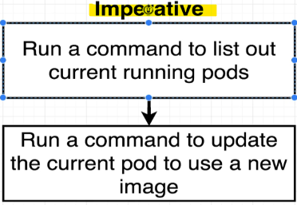

<br>

### Declarative Approach
* Find the **original configuration file** that created the pod.
* **Update the image** in the configuration file from multi-client to multi-worker.
* **Apply** the updated configuration file using kubectl.

> **Note**: Kubernetes will automatically update the existing pod to use the new image.

<br>

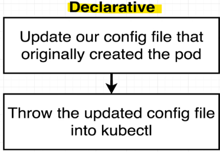

<br>

### How Kubernetes Handles Updates
* Each object created with a configuration file has a name and a kind (type).
  * **Example**: name: client-pod, kind: Pod.
* When a configuration file is applied, Kubernetes **checks for existing objects** with the same name and kind.
  * If an existing object is **found**, Kubernetes **updates** it with the new configuration.
  * If **no** matching object is found, Kubernetes **creates a new object**.

<br>

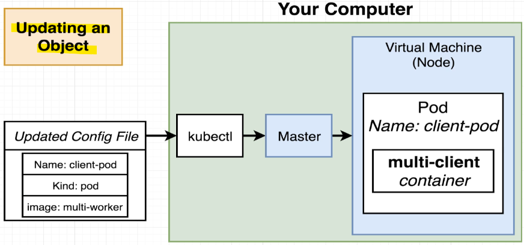

<br>

### Steps to Update an Existing Object
* Keep the **name** and **kind** the **same** in the configuration file.
* Make the **desired changes** (e.g., update the image).
* **Apply** the updated configuration file using `kubectl`.

<br>

### Summary
* `Declarative Approach`: Simplifies updates by modifying the configuration file and applying it.
* `Name and Kind`: Used to identify and update existing objects.
* `Automatic Updates`: Kubernetes handles the update process, ensuring the desired state is met.

<br>

<hr style="height:4px;background:black">

<br>

## Declarative Updates in Action
> **Objective**: Update the existing pod to use the multi-worker image instead of the multi-client image.

<br>


<br>

### Steps to Update the Configuration File
1. Open the original configuration file (**client-pod.yml**).
2. Keep the **kind** and **name** the same.
3. Change the **image** from multi-client to **multi-worker**.
4. Save the updated configuration file.

<br>

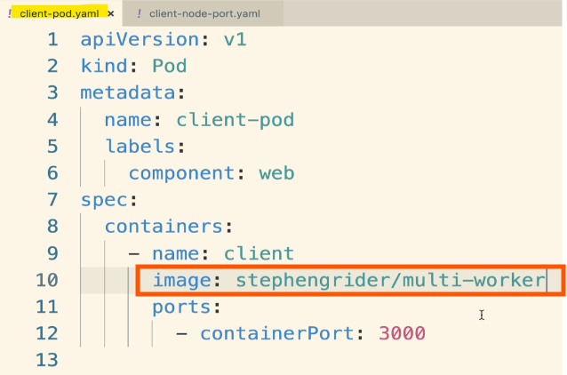


<br>

### Applying the Updated Configuration
* Use the `kubectl apply -f <file>` command to apply the updated configuration.
  * **Example**: `kubectl apply -f client-pod.yml`
* The output will indicate that the pod has been "configured," meaning the update was applied.

<br>

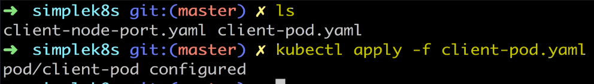

<br>

### Verifying the Update
* Use the kubectl get pods command to check the status of the pods.
  * **Example**: `kubectl get pods`
* Ensure there is still one pod with the same name, indicating it was updated in place.

<br>

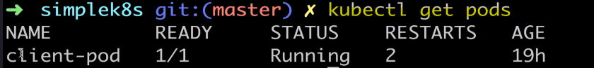

<br>

### Inspecting the Pod

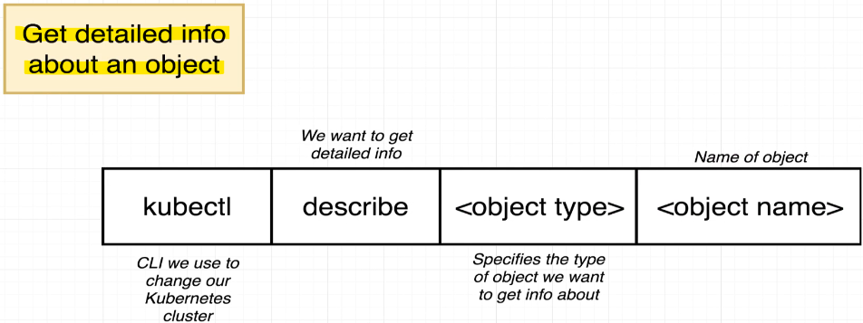

<br>

* Use the `kubectl describe <type> <name>` command to get detailed information about the pod.
  * **Example**: `kubectl describe pod client-pod`
* Check the image field to verify that the pod is running the multi-worker image.

<br>

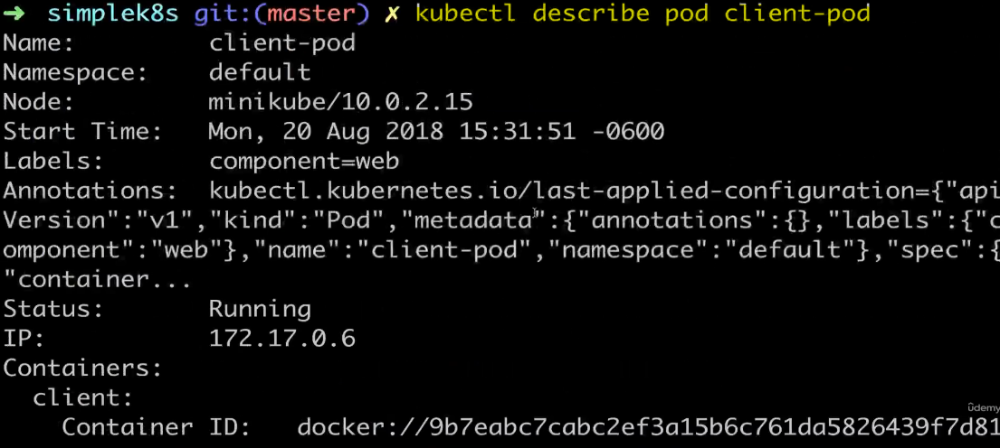

<br>

### Key Commands
* `kubectl apply -f <file>`: Apply the updated configuration file.
* `kubectl get pods`: Check the status of the pods.
* `kubectl describe pod <name>`: Get detailed information about a specific pod.

<br>

### Declarative Approach
* Update the configuration file and apply it using `kubectl`.
* Kubernetes **automatically updates** the existing object based on the name and kind.
* No need to manually list and update specific pods.

<br>

### Summary
* `Update Configuration`: Modify the image in the configuration file.
* `Apply Changes`: Use kubectl apply to apply the updated configuration.
* `Verify Update`: Check the status and details of the pod to ensure the update was applied.

<br>

<hr style="height:4px;background:black">

<br>

## Limitations in Config Updates
> **Objective**: Update the container port in the existing pod configuration file.

<br>

### Steps to Update the Configuration File
1. Open the original configuration file (**client-pod.yml**).
2. Change the containerPort from 3000 to **9999**.
3. Save the updated configuration file.

<bR>

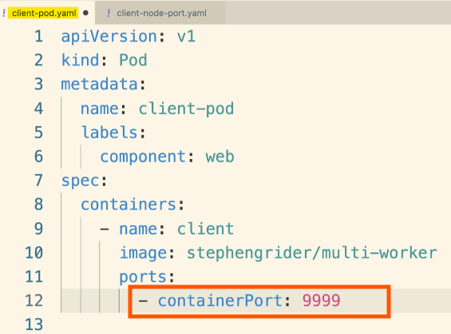

<br>

### Applying the Updated Configuration
* Use the `kubectl apply -f <file>` command to apply the updated configuration.
  * **Example**: `kubectl apply -f client-pod.yml`

### Error Message
* When running the `kubectl apply` command, an **error** message is displayed.
* The error message indicates that only **certain properties** (e.g., image, active deadline, tolerations) **can be updated** for a pod.

<br>

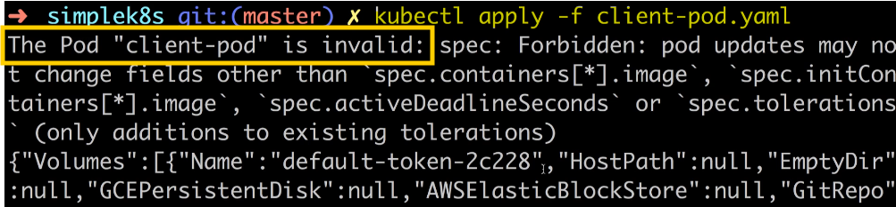

<br>

### Understanding the Error
* Kubernetes **restricts updates** to **certain properties** of a pod configuration.
* Changes to properties like containerPort are not allowed directly through the kubectl apply command.

<br>

### Workaround
* To update properties that are restricted, a different type of object besides a pod must be used.
* This allows for more flexibility in updating various configuration properties.

<br>

### Summary
* `Update Configuration`: Modify the containerPort in the configuration file.
* `Apply Changes`: Use kubectl apply to apply the updated configuration.
* `Error Handling`: Understand the restrictions on updating certain pod properties.
* `Workaround`: Use a different object type to update restricted properties.

<br>

<hr style="height:4px;background:black">

<br>

## Running Containers with Delpoyments
> **Objective**: Address the issue of not being able to update certain fields in a pod configuration by using a deployment instead.

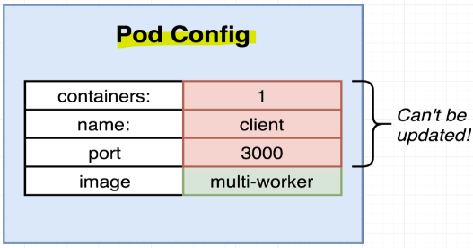

<br>

### Understanding Deployments
* `Deployment`: A Kubernetes object that **maintains** a set of **identical pods**.
* Ensures all pods in the set are **running** the **correct configuration** and are in a **runnable state**.
* **Automatically** **restarts** or **recreates** pods if they crash.

<br>

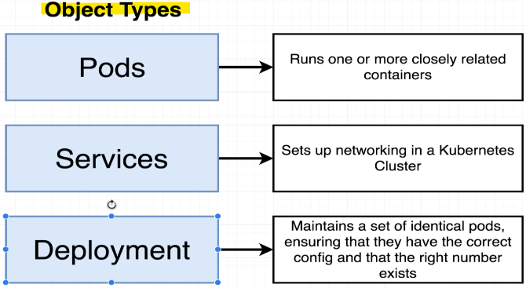

<br>

### Comparison: Pods vs. Deployments

`Pods`:
* Run a **single set** of closely related **containers**.
* Used primarily in **development** environments.
* Limited in terms of **updating configuration** fields **once created**.

`Deployments`:
* Manage a set of **identical pods** (one or more).
* **Monitor** the **state** and **configuration** of each pod.
* Used in both **development** and **production** environments.
* **Allow updates** to **any configuration** tied to a pod.

<br>

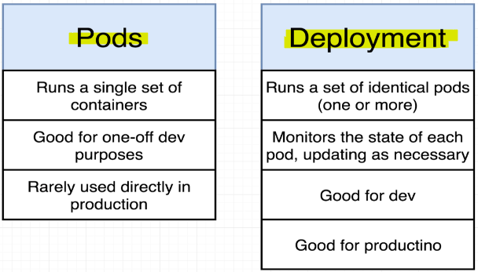

<br>

### Pod Template in Deployments
* `Pod Template`: A **block of configuration** that **defines** what each **pod managed** by the **deployment** should look like.
  * **Example**: Specifies the container name, image, and exposed ports.
* **Changes** to the **pod template** result in the **deployment updating or recreating pods to match** the new configuration.

<br>

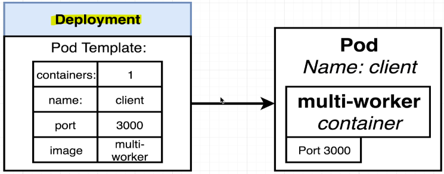

<br>

### Benefits of Using Deployments
* Flexibility to update any configuration tied to a pod.
* Automatic management of pod state and configuration.
* Suitable for both development and production environments.

<br>

### Example Scenario

`Original Pod Configuration`:

```yaml
apiVersion: v1
kind: Pod
metadata:
  name: client-pod
spec:
  containers:
  - name: client
    image: <your-docker-id>/multiworker
    ports:
    - containerPort: 3000
```

`Updated Pod Template in Deployment`:

```yaml
apiVersion: apps/v1
kind: Deployment
metadata:
  name: client-deployment
spec:
  replicas: 1
  selector:
    matchLabels:
      app: client
  template:
    metadata:
      labels:
        app: client
    spec:
      containers:
      - name: client
        image: <your-docker-id>/multiworker
        ports:
        - containerPort: 9999
```

### Summary
* `Deployments`: Manage sets of identical pods and allow updates to any configuration.
* `Pod Template`: Defines the configuration for pods managed by the deployment.
* `Benefits`: Flexibility, automatic management, and suitability for production environments.

<br>

<hr style="height:4px;background:black">

<br>

## Deployment Configuration Files
> **Objective**: create deployments that will create pods for us.
> * Deployments are appropriate for use in both a development and production environment.
> * We're going to make a deployment that has a pod template that's going to try to **create a container** using the **image multi-client**, and we're going to make sure that **port 3000** is exposed.

<br>

### Introduction to Deployments
* A deployment **manages** a set of **identical pods**.
* From now on, we will create deployments instead of individual pods.
* Deployments are suitable for both development and production environments.

<br>

### Creating a Deployment
* We will create a deployment with a pod template that uses the multi-client image and exposes port 3000.
* This setup allows us to test the deployment in a browser.

<br>

### Steps to Create a Deployment
1. `Configuration File`: Create a configuration file in the root project directory named **client-deployment.yml**.

<br>

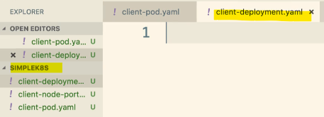

<br>

2. `API Version`: Specify the API version as apps/V1.
3. `Kind`: Define the kind as Deployment.

<br>

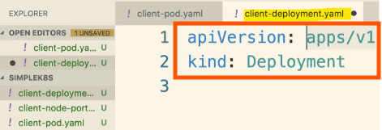

<br>

4. Deployment Configuration
* `Metadata`: Name the deployment client-deployment.
* `Spec`:
  * `Replicas`: Set the number of replicas to 1.
  * `Selector`: Use match labels with a component web.
  * `Template`:
    * `Metadata`: Add labels with component web.
    * `Spec`:
      * `Containers`: Define the list of containers for each pod.
        * `Name`: Set the container name to client.
        * `Image`: Use the image docker ID/multi-client.
        * `Ports`: Map the container port to 3000.
          * `- containerPort: 3000`

<br>

**For example**:

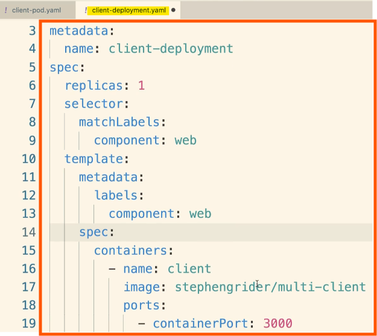


<br>

<hr style="height:4px;background:black">

<br>

## Walking Through the Deployment Config

### API Version and Object Type
* The first two lines specify the **API version** (apps/V1) and the **object type** (Deployment).

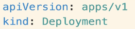

<br>

> **Notes**:
>
> **API Version** (apiVersion): 
> * This specifies the version of the Kubernetes API that you are using. 
> * In this case, it's apps/V1. 
> * This tells Kubernetes which version of the API to use when creating the deployment.
>
> **Kind** (kind): 
> * This defines the type of object you want to create. 
> * Here, it's a Deployment. 
> * This tells Kubernetes that you want to create a deployment object.

<br>

### Metadata Section
* Names the **deployment object** as **client-deployment**.

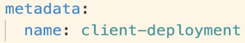

<br>

> **Notes**:
>
> **Name** (name): 
> * This is the name of the deployment object. 
> * In this example, it's client-deployment. 
> * This name is used to identify the deployment within the Kubernetes cluster.

<br>

### Spec Section

`Template Property`:
* Lists the **configuration** for every **pod** created by this deployment.
* Similar to the configuration in client-pod.yaml.
* Defines labels, containers, and ports for the pods.
* `Each pod will have`:
  * **Label**: component: web
  * **Container Name**: client
  * **Image**: multi-client
  * **Port**: 3000

<br>

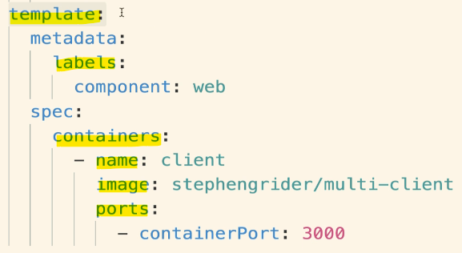

<br>

> **Notes**:
>
> **Metadata** (metadata): 
> * This section defines the labels that will be applied to the pods created by the deployment. Here, the label is `component: web`.
>
> **Spec** (spec):
> 
> **Containers** (containers): 
> * This is a list of containers that will be created within each pod. 
> 
> Each container has the following properties:
> * **Name** (name): The name of the container. In this example, it's client.
> * **Image** (image): The Docker image to use for the container. Here, it's docker ID/multi-client.
> * **Ports** (ports): This defines the ports that will be exposed by the container. In this case, port 3000 is exposed.

<br>

### Replicas and Selector
`Replicas`:
* Specifies the number of **pods to create** (e.g., 1 or 5).
* All pods will be **identical**.

`Selector`:
* Similar to the selector in the service configuration file.
* Helps the deployment get a handle on the created pods.
* **Looks for objects** with the **label component**: web.

<br>

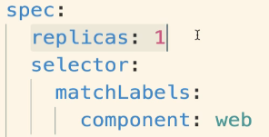

<br>

> **Notes**:
>
> **Replicas** (replicas): 
> * This specifies the number of identical pods that the deployment should create. 
> * For example, setting `replicas: 1` means that one pod will be created. If you set it to 5, five identical pods will be created
> 
> **Selector** (selector): 
> * This is used to identify the pods that the deployment will manage. 
> * It matches the labels of the pods created by the deployment. 
> * In this case, it looks for pods with the label `component: web`.

<br>

### Purpose of Selector
* When a deployment creates a pod, it **asks** the **Kubernetes API** on the master to **create the pod**.
* The **selector helps** the deployment **identify** and **manage** the **created pods**.
* Ensures the deployment can handle pods with the specified label.

<br>

<hr style="height:4px;background:black">

<br>

## Applying a Deployment
> **Preparation**:
> * We finished the client deployment configuration file.
> * Ready to apply it using kubectl to run it on the local cluster.

<br>

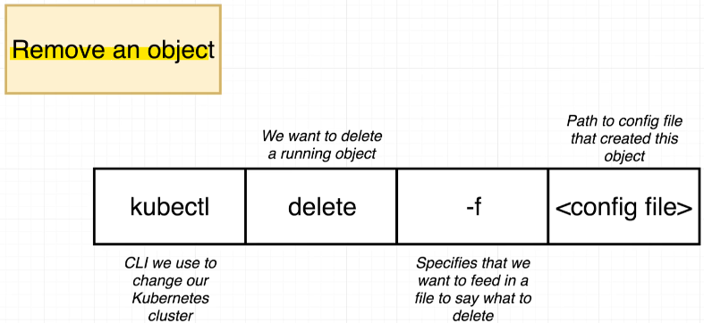


<bR>

### Deleting Existing Pods
* Check existing pods with `kubectl get pods`.
* Delete the original pod created with **client-pod.yaml** to avoid confusion.
* Use the command `kubectl delete -f client-pod.yaml` to delete the pod.
* This command finds and deletes the object based on the configuration file.

<br>

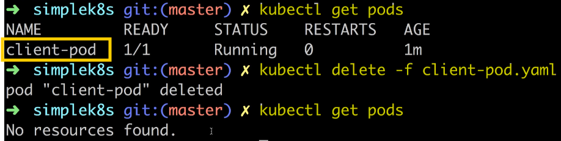

<br>

### Imperative vs. Declarative Updates
* Deleting a pod is an **imperative update** (direct command to change the cluster state).
* Imperative updates are necessary for deleting resources.

<br>

### Deleting a Pod
* Run `kubectl delete -f client-pod.yaml`.
* The pod will be deleted after a 10-second grace period, similar to Docker container deletion.

<br>

### Applying the Deployment
* Apply the deployment configuration file with `kubectl apply -f client-deployment.yaml`.
* This creates a new pod using the **multi-client image**.

<br>

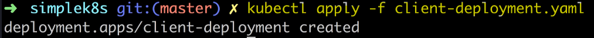

<br>

### Checking Pod Status
* Use `kubectl get pods` to see the running pod.
* The pod will have a **randomly generated name** tied to the client deployment.

<br>

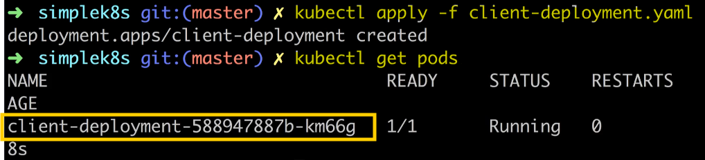

<br>

### Checking Deployment Status
* Use `kubectl get deployments` to check the deployment status.

`Columns to note`:
* **Desired**: Number of replicas the deployment wants (e.g., 1).
* **Current**: Number of pods currently running.
* **Up to Date**: Number of pods updated to the latest configuration.
* **Available**: Number of pods ready to accept traffic.

<br>

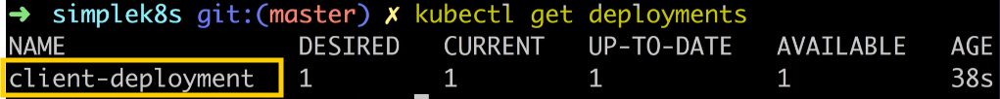

<br>

### Verifying the Application
* Ensure the pod is running the **multi-client image**.
* Access the React project files in the browser to verify the application is running.

<br>

<hr style="height:4px;background:black">

<br>

## Why Use Services?

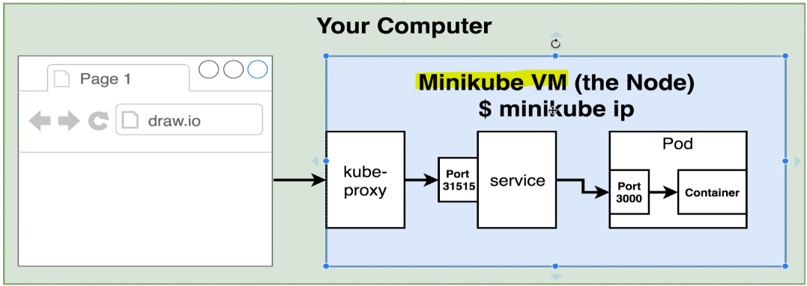

<br>

### Connecting to the Container
* After applying the **deployment**, we need to **connect** to the **container** running the **multi-client image**.
* Use the `minikube IP` command to get the IP address of the Minikube virtual machine (local node).
* Connect to the **service port** (hardcoded to 31515) using the IP address and port in the browser (e.g., http://minikube-ip:31515).

<br>

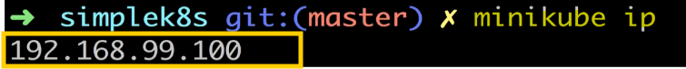

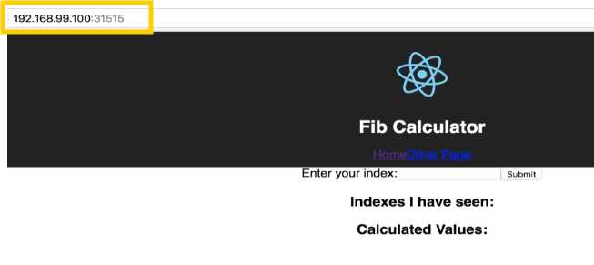

<br>

### Why Use Services
* Services are essential for **connecting to pods** because pods have **dynamically assigned IP addresses**.
* Pods can be deleted, recreated, or updated, resulting in new IP addresses.
* Manually updating IP addresses in the browser would be cumbersome.

<br>

### Service Objects
* Services watch for pods that **match their selector** (e.g., component: web).
* They **automatically route traffic** to the appropriate pods, abstracting the complexity of changing IP addresses.

<br>

### Checking Pod and Service Status
* Use `kubectl get pods -o wide` to get additional information, including pod IP addresses.
* Each pod gets a **unique internal IP address** within the virtual machine.
* If a pod is **recreated**, it gets a **new IP address**, making direct connections difficult.

<br>

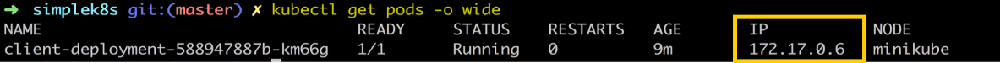

<br>

### Role of Services
* Services handle the **dynamic nature** of **pod IP addresses**.
* They **ensure consistent access** to pods by **routing traffic based on selectors**.
* This abstraction simplifies connecting to pods in development and production environments.

<br>

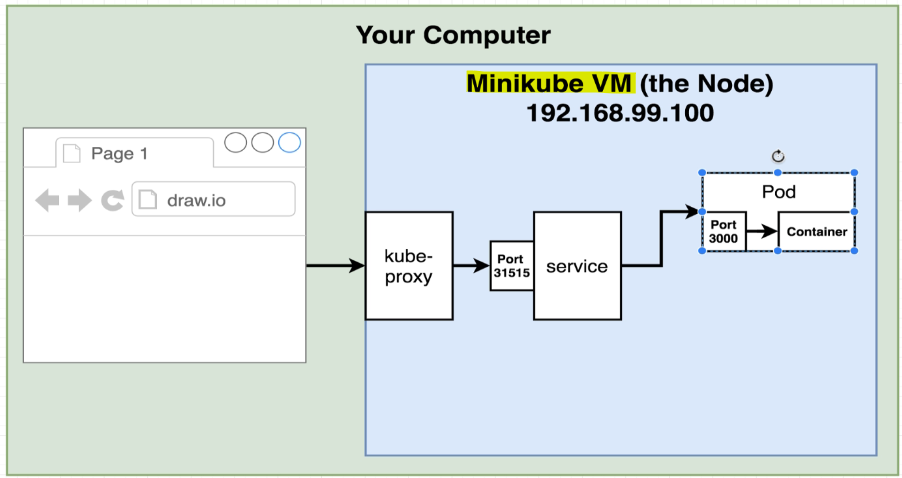

<br>

<hr style="height:4px;background:black">

<br>

## Scaling and Changing Deployments

### Updating the Deployment Configuration
Goal:
* We will **update** the **container port value** in the deployment configuration file.
* Change the container port from 3000 to 9999.

> **Note**: This change will prevent the application from being accessible in the browser, as it expects port 3000.

<br>

### Applying the Update
* Save the updated configuration file.
* Run the command `kubectl apply -f client-deployment.yaml` to apply the changes.
* Kubernetes will **configure the existing deployment** with the **new settings**.


<br>

### Verifying the Update
* Use `kubectl get deployments` to check the deployment **status**.
* Use `kubectl get pods` to see the **updated** pods.
  * Notice the age of the pod, indicating it was recreated with the new configuration.
* Use `kubectl describe pods` to **verify** the **new port** assignment (9999).

<bR>

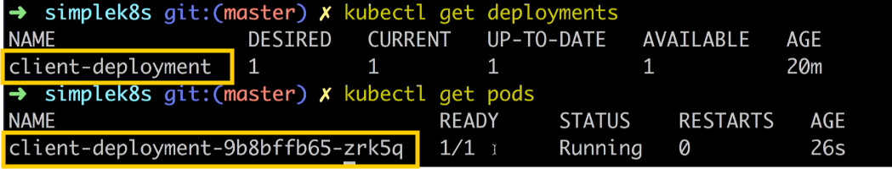

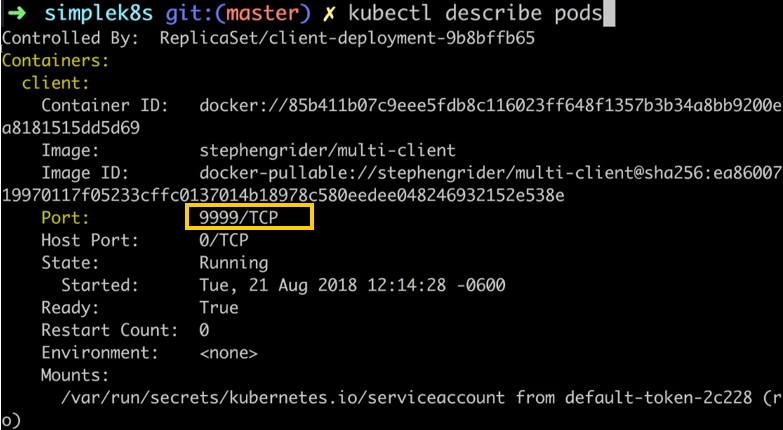

<br>

### Scaling the Deployment
* Update the **replicas** setting in the configuration file from 1 to 5.

<br>

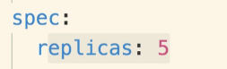

<br>

* Save the file and apply the changes using `kubectl apply -f client-deployment.yaml`.
* Use `kubectl get deployments` to check the deployment status.
* Use `kubectl get pods` to see the five separate pods running the multi-client image.

<br>

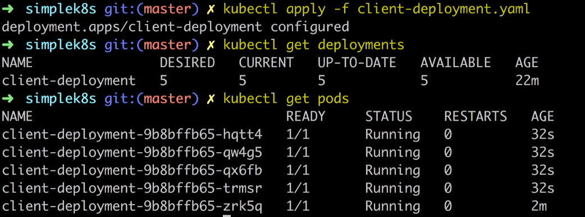

<br>

### Changing the Image
* **Update the image** in the configuration file from multi-client to **multi-worker**.

<br>

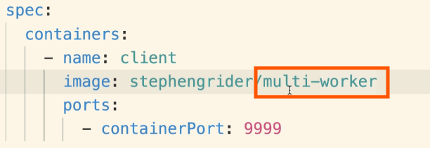

<br>

* Save the file and apply the changes using `kubectl apply -f client-deployment.yaml`.
* Quickly run `kubectl get deployments` to see the update in action.
  * Notice the number of pods being created and deleted as the deployment updates to the new image.
* Use `kubectl get deployments` again to see the final status with all pods running the multi-worker image.

<br>

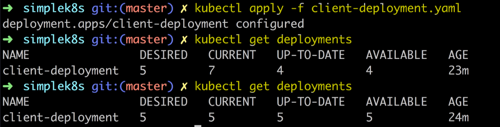

<br>

<hr style="height:4px;background:black">

<br>

## Updating Deployment Images
> **Objective**: explore how to update a deployment when a **new** version of an **image becomes available**.

Scenario:
* Imagine we update the multi-worker project and push the new image to Docker Hub.
* We need to update our deployment to pull the latest version and recreate the pods.

<br>

### Steps to Update the Deployment
1. `Change the deployment to use the multi-client image`.
   * This allows us to verify the correct version of the image in the browser.

2. `Update the source code for the multi-client project`.
   * Make changes, rebuild the image, and push it to Docker Hub.

3. `Update the deployment to use the latest version of the multi-client image`.

<br>

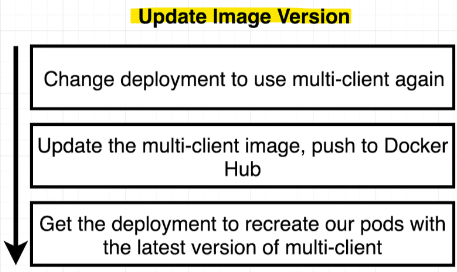

<br>

### Updating the Deployment Configuration
* `Reduce Replicas`: Set the number of **replicas** to **1** for easier testing.
* `Change Image`: Update the **image** from multi-worker to **multi-client**.
* `Update Port`: Change the **container port** back to **3000**.

<br>

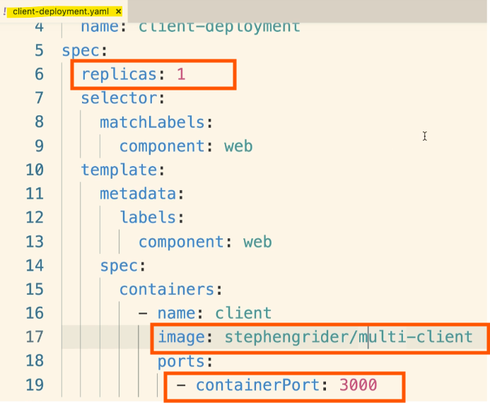

<br>

### Applying the Changes
* Save the updated configuration file.
* Run `kubectl apply -f client_deployment.yaml` to apply the changes.
* Verify the changes by accessing the application in the browser using the **Minikube IP** and **service port** (31515).

<br>

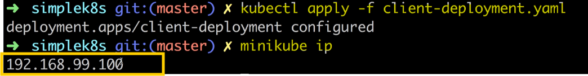

<br>

### Verifying the Update
* Use the `minikube IP` command to get the IP address of the Minikube virtual machine.
* Access the application in the browser using the IP address and port (http://minikube-ip:31515).

<br>

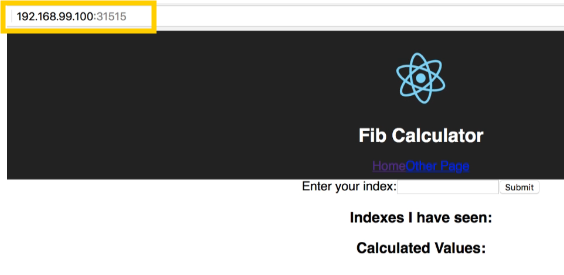

<br>

<hr style="height:4px;background:black">

<br>

## Rebuilding the Client Image
> **Objective**: update the multi-client image and get the deployment to use this new version.

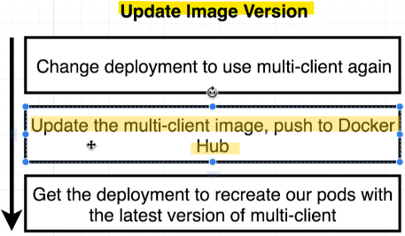

<br>

### Steps to Update the Multi-Client Image:
1. `Navigate to the complex project directory`.
   * Open a second terminal tab and navigate to the **complex** project directory.
   * Change into the **client** directory where the multi-client project is located.

<br>

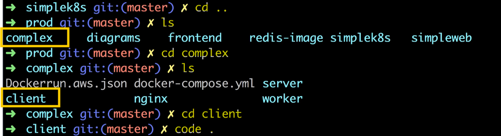

<br>

2. `Update the Source Code`.
   * Open the **app.js** file in the **src** folder.
   * Modify the **h1** tag in the **render method** to display "Fib calculator version two" instead of "Fib calculator".
   * Save the file.

<br>

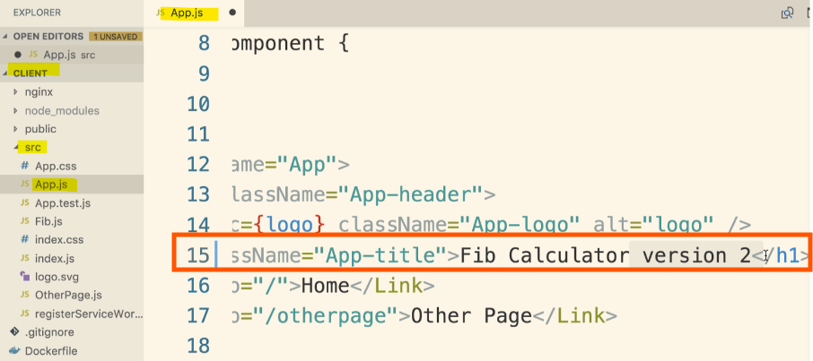

<br>

### Rebuilding and Pushing the Image:
3. `Rebuild the Docker Image`.
   * Ensure you are in the **client** directory.
   * Run the command `docker build -t <your-docker-id>/multi-client .` to rebuild the image.

> **Note**: Remember to include the dot (.) at the end to specify the build context.

<br>

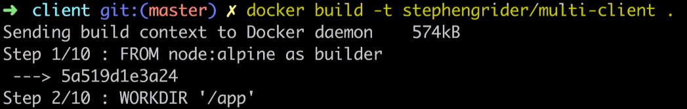


<br>

4. `Push the Image to Docker Hub`.
   * Run the command `docker push <your-docker-id>/multi-client` to push the new image to Docker Hub.

<br>

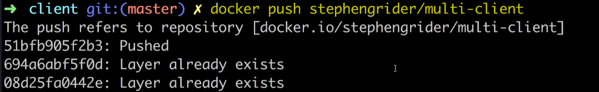

<br>

<hr style="height:4px;background:black">

<br>

## Triggering Deployment Updates
> **Objective**: we need to update our deployment to use the latest version of the multi-client image.

<br>

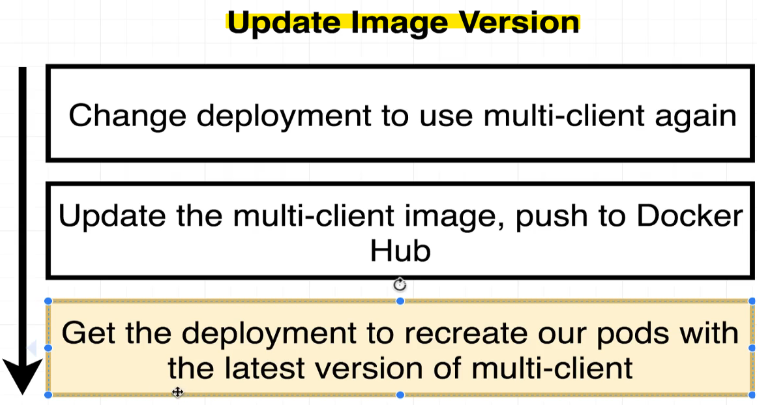

<br>

### Challenges
* Kubernetes **doesn't automatically update pods** with the **latest image version**.
* Applying an unchanged configuration file with `kubectl apply` will be rejected if there are no changes.

<br>

### Possible Solution

#### Solution 1: Manually Delete Pods
* Manually delete all pods managed by the deployment.
* The deployment will notice the missing pods and **recreate them with the latest image version**.
  * **Drawbacks**: Risk of deleting the wrong pods, potential downtime for users.

#### Solution 2: Use Version Tags
* **Tag** Docker images with version numbers (e.g., v1, v2).
* **Specify the version** in the deployment configuration file.
* Apply the updated configuration file with `kubectl apply`.
  * **Drawbacks**: Adds an extra step to the deployment process, requires manual version management.

<br>

### Steps to Implement Solution 2
1. `Tag the Image`
   * When building the Docker image, **tag** it with a **version number** (e.g., docker build -t your-docker-id/multi-client:v1 .).


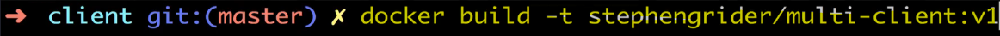

<br>

2. `Update the Configuration File`
   * **Specify the version** in the deployment configuration file (e.g., image: your-docker-id/multi-client:v1).

<br>

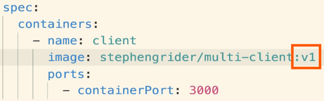

<br>

3. `Apply the Configuration`
   * Run `kubectl apply -f client_deployment.yaml` to apply the changes.
   * Kubernetes will **detect the change** and **update the pods** with the new image version.

<br>

### Challenges with Versioning
* Using version numbers in the config file **adds an extra step**.
* We need to **assign a version number** when **building the image** and **inject** it into the **config file**.
* This process requires a **templating mechanism**, which complicates the solution.

<br>

### Imperative Command Solution
1. `Tag the Image`
   * Tag the image with a **version number** (e.g., v1, v2).

2. `Use an Imperative Command`
   * After building the image, run a command to **update the deployment** with the new image version.
     * **Example command**: `kubectl set image deployment/client-deployment client=your-docker-id/multi-client:v1`.


<br>

> Notes: Use an Imperative Command
> 
> * After building and tagging the image, you need to update your Kubernetes deployment to use this new image version.
> * Instead of modifying the deployment configuration file, you can use an imperative command to directly update the deployment.
> * **Command**: kubectl set image deployment/client-deployment client=your-docker-id/multi-client:v1
>   * `kubectl set image`: This command is used to update the image of a container in a deployment.
>   * `deployment/client-deployment`: Specifies the deployment you want to update. In this case, it's client-deployment.
>   * `client=your-docker-id/multi-client:v1`: Specifies the container name (client) and the new image (your-docker-id/multi-client:v1) to use.

<br>

### Drawbacks of Imperative Commands
* **Skips** over the **config file**, making it harder to keep the config file up to date with the cluster state.
  * Not ideal, but a practical solution in many cases.

<br>

### Summary of Solutions
* `Solution 1`: **Manually delete** pods (not recommended due to risks and potential downtime).
* `Solution 2`: Use **version tags** in the config file (adds complexity and requires manual updates).
* `Solution 3`: Use an **imperative command** to **update the image** version (practical but not ideal).

<br>

### Conclusion
* The imperative command approach is the most reasonable solution despite its drawbacks.
* This method allows us to update the deployment with the latest image version efficiently.

<br>

<hr style="height:4px;background:black">

<br>

## Imperatively Updating a Deployment's Image
> **Overview**: tag our image with a distinct version number, push it to Docker Hub, and update our deployment to use this new version.

<br>

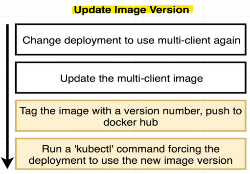

<br>

### Step-by-Step Process
1. `Tag the Image`
   * Open your terminal and navigate to the **complex/client** directory.
   * Build the image from scratch and tag it with a **version number**.
   * **Command**: `docker build -t <your-docker-id>/multi-client:v5 .`
     * Replace <your-docker-id> with your Docker Hub username and v5 with your chosen version number.

<br>


<br>

2. `Push the Image to Docker Hub`
   * Push the newly tagged image to Docker Hub.
   * **Command**: `docker push <your-docker-id>/multi-client:v5`

<br>


<br>

3. `Update the Deployment`


   * Use the **kubectl set image** command to update the deployment with the new image version.
   * **Command**: `kubectl set image deployment/client-deployment client=<your-docker-id>/multi-client:v5`
   * This command updates the image property of the client container in the client-deployment deployment.

<bR>


<br>

> **Notes**: Breaking down the command
>
> `Use the kubectl set image Command`
> * The kubectl set image command is used to update the image of a container in a Kubernetes deployment.
> * **Command**: `kubectl set image deployment/client-deployment client=<your-docker-id>/multi-client:v5`
> * **kubectl set image**: This part of the command tells Kubernetes that you want to update the image of a container
> * **deployment/client-deployment**: This specifies the type of object you want to update and its name. In this case, you are updating a deployment named client-deployment.
>   * `client=your-docker-id/multi-client:v5`: This specifies the container name (client) and the new image (<your-docker-id>/multi-client:v5) to use.
>     * **client**: The name of the container within the pod template of the deployment.
>     * **your-docker-id/multi-client:v5**: The new image to use, including the Docker Hub username (your-docker-id), the image name (multi-client), and the version tag (v5).

> **What This Command Does**
> * This command **updates** the **image property** of the **client container** in the **client-deployment deployment**.
> * Kubernetes will **detect the change** and **recreate the pods** managed by the deployment with the new image version.
> * This ensures that all pods in the deployment are running the latest version of the specified image.

<br>

### Verifying the Update
* Check the status of the pods to ensure they have been recreated with the new image.
* **Command**: `kubectl get pods`
* Look for the age of the pod to confirm it was recently recreated.

<bR>

### Testing in the Browser
* Access the running container using the Minikube IP and service port.
* **Command**: `minikube IP`
* Use the IP address and port 31515 to access the application in the browser (e.g., http://minikube-ip:31515).
* If you don't see the updated version, try refreshing the browser or clearing the cache.

<br>


<br>

### Automating the Process
* In a production environment, you can automate this process with a deployment script.
* The script will handle tagging, pushing, and updating the deployment, making the process seamless.

<br>

<hr style="height:4px;background:black">

<br>

## Multiple Docker Installations
> **Objective**: 
> * explore what Docker is doing on both the local computer and the virtual machine (VM) that forms our node. 
> * We will learn how to interact with Docker inside the VM.

<br>

### Docker Setup
There are two copies of Docker running:
* One inside the VM.
* One installed locally on your computer (Docker for Mac or Docker for Windows).

<br>

### Running Docker Commands
`Local Docker Server`:
* Running `docker ps` in one terminal window shows no running containers.
* This **terminal** is **connected** to the **local Docker server** installed on your computer.

`VM Docker Server`:
* Running `docker ps` in another terminal window shows many **Kubernetes-related containers**.
* This terminal is connected to the **Docker server** running **inside the VM**.

<br>


<br>

### Configuring Docker Client
* The **Docker client** (CLI) can be configured to connect to either the local **Docker server** or the **Docker server inside the VM**.
* This allows you to manage containers running in different environments.

<br>

<hr style="height:4px;background:black">

<br>

## Reconfiguring Docker CLI
> **Objective**: reconfigure the Docker CLI to communicate with the Docker server inside the virtual machine (VM).

<br>


<bR>

### Configuring Docker CLI
* To reconfigure your local Docker CLI to **connect** to the **Docker server inside the VM**, run the following command:
  * `eval $(minikube docker-env)`
* This command temporarily **reconfigures** the **Docker CLI** to **connect** to the **Docker server in the VM**.

<br>


<br>

### Running Docker Commands
* After running the command, you can use Docker commands like `docker ps` to see the **containers running inside the VM**.

Example:
* **Before running the command**: docker ps shows containers on the local Docker server.
* **After running the command**: docker ps shows containers inside the VM.

<br>

### Temporary Reconfiguration
* The reconfiguration is **temporary** and only applies to the **current terminal window**.
* If you open a new terminal window, the Docker CLI will revert to its original configuration.
* You need to rerun the command in each new terminal window to reconfigure the Docker CLI.

<br>

### Understanding the Command
* The `minikube docker-env` command **exports environment variables** that **tell the Docker CLI** to **connect to the Docker server** in the VM.
* These environment variables include the IP address of the Minikube server.

### Memorizing the Command
* Instead of memorizing the entire command, remember minikube docker-env.
* Running `minikube docker-env` will **display the full command** needed to reconfigure the Docker CLI.

<br>


<br>

### Why Reconfigure Docker CLI
* Reconfiguring the Docker CLI allows you to **inspect** and **manage containers running inside the VM**.
* This is useful for troubleshooting and understanding the inner workings of the VM.

<br>

<hr style="height:4px;background:black">

<br>

## Why Mess with Docker in the Node?


<br>

### Debugging Containers
* Use the same debugging techniques learned earlier to inspect containers and get logs.

Example commands:
* `docker ps`: List running containers.
* `docker logs <container-id>`: Retrieve logs from a container.
* `docker exec -it <container-id> sh`: Start a shell inside a container.

> **Note**: Many of these debugging commands are also available through kubectl.

<br>

### Testing Kubernetes' Self-Healing
* Manually delete a container to observe Kubernetes' ability to restart it automatically.
* This helps test Kubernetes' self-healing capabilities.

<br>

### Managing Docker Image Cache
* If you encounter issues with image caching, you can delete the image cache inside the VM.
* **Command**: `docker system prune -a`
* This removes all stopped containers, unused networks, build cache, and unused images.

<br>

<hr style="height:4px;background:black">

<br>