- [Section 16: Kubernetes Production Deployment](#section-16-kubernetes-production-deployment)
  - [The Deployment Process](#the-deployment-process)
    - [Deployment Steps](#deployment-steps)
    - [Key Points to Remember](#key-points-to-remember)
  - [Google Cloud vs AWS for Kubernetes](#google-cloud-vs-aws-for-kubernetes)
    - [Google's Experience with Kubernetes](#googles-experience-with-kubernetes)
    - [AWS's Recent Kubernetes Support](#awss-recent-kubernetes-support)
    - [Google Cloud Console](#google-cloud-console)
    - [Better Documentation](#better-documentation)
    - [Key Points to Remember](#key-points-to-remember-1)
  - [Creating a Git Repo](#creating-a-git-repo)
    - [Key Points to Remember](#key-points-to-remember-2)
  - [Linking the GitHub Repo to Travis](#linking-the-github-repo-to-travis)
    - [Key Points to Remember](#key-points-to-remember-3)
  - [Creating a Google Cloud Project](#creating-a-google-cloud-project)
    - [Key Points to Remember](#key-points-to-remember-4)
  - [Linking a Billing Account](#linking-a-billing-account)
    - [Key Points to Remember](#key-points-to-remember-5)
  - [Kubernetes Engine Init](#kubernetes-engine-init)
    - [Setting Up a Kubernetes Cluster](#setting-up-a-kubernetes-cluster)
    - [Tips](#tips)
  - [Creating a Cluster with Google Cloud](#creating-a-cluster-with-google-cloud)
    - [Initialising Kubernetes Engine](#initialising-kubernetes-engine)
    - [Creating a New Cluster](#creating-a-new-cluster)
    - [Billing Considerations](#billing-considerations)
    - [Creating the Cluster](#creating-the-cluster)
    - [Final Steps](#final-steps)
  - [Kubernetes Dashboard on Google Cloud](#kubernetes-dashboard-on-google-cloud)
    - [Exploring the Kubernetes Dashboard](#exploring-the-kubernetes-dashboard)
    - [Dashboard Tabs](#dashboard-tabs)
    - [Persistent Storage](#persistent-storage)
  - [Travis Deployment Overview](#travis-deployment-overview)
    - [Travis Configuration for Kubernetes Deployment](#travis-configuration-for-kubernetes-deployment)
    - [Steps in the Configuration File](#steps-in-the-configuration-file)
    - [Additional Notes](#additional-notes)
  - [Installing the Google Cloud SDK](#installing-the-google-cloud-sdk)
    - [Creating the Travis Configuration File](#creating-the-travis-configuration-file)
    - [Before Install Steps](#before-install-steps)
  - [Generating a Service Account](#generating-a-service-account)
    - [Creating a Service Account](#creating-a-service-account)
    - [Encrypting and Uploading the JSON File](#encrypting-and-uploading-the-json-file)
    - [Important Notes](#important-notes)
  - [Running Travis CLI in a Container](#running-travis-cli-in-a-container)
    - [Encrypting the Service Account JSON File](#encrypting-the-service-account-json-file)
    - [Installing Travis CLI](#installing-travis-cli)
    - [Using Docker for Travis CLI](#using-docker-for-travis-cli)
    - [Inside the Docker Container](#inside-the-docker-container)
    - [Verifying Travis CLI Installation](#verifying-travis-cli-installation)
    - [Important Notes](#important-notes-1)
  - [Encrypting a Service Account File](#encrypting-a-service-account-file)
    - [Logging into Travis CLI](#logging-into-travis-cli)
    - [Copying the JSON File](#copying-the-json-file)
    - [Encrypting the JSON File](#encrypting-the-json-file)
    - [Adding Encrypted File to Travis YAML](#adding-encrypted-file-to-travis-yaml)
    - [Handling the Original JSON File](#handling-the-original-json-file)
    - [Committing the Encrypted File](#committing-the-encrypted-file)
    - [Important Notes](#important-notes-2)
  - [More Google Cloud CLI Config](#more-google-cloud-cli-config)
    - [Configuring Google Cloud SDK in Travis YAML](#configuring-google-cloud-sdk-in-travis-yaml)
    - [Additional Setup for Google Cloud SDK](#additional-setup-for-google-cloud-sdk)
  - [Running Tests with Travis](#running-tests-with-travis)
    - [Docker CLI Login in Travis YAML](#docker-cli-login-in-travis-yaml)
    - [Setting Up Environment Variables](#setting-up-environment-variables)
    - [Building and Testing Docker Image](#building-and-testing-docker-image)
    - [Important Notes](#important-notes-3)
  - [Custom Deployment Providers](#custom-deployment-providers)
    - [Deployment Script](#deployment-script)
    - [Travis YAML Configuration](#travis-yaml-configuration)
    - [Creating the Deploy Script](#creating-the-deploy-script)
    - [Important Notes](#important-notes-4)
  - [Unique Deployment Images](#unique-deployment-images)
    - [Steps in the Deploy Script](#steps-in-the-deploy-script)
    - [Important Considerations](#important-considerations)
  - [Unique Tags for Built Images](#unique-tags-for-built-images)
    - [Ensuring Unique Image Tags for Deployments](#ensuring-unique-image-tags-for-deployments)
    - [Solution: Using Git SHA for Unique Tags](#solution-using-git-sha-for-unique-tags)
    - [Updating Travis YAML and Deploy Script](#updating-travis-yaml-and-deploy-script)
    - [Summary](#summary)
  - [Updating the Deployment Script](#updating-the-deployment-script)
    - [Adding Git SHA to Travis YAML](#adding-git-sha-to-travis-yaml)
    - [Updating Deploy Script](#updating-deploy-script)
    - [Final Checks](#final-checks)
  - [Configuring the GCloud CLI on Cloud Console](#configuring-the-gcloud-cli-on-cloud-console)
    - [Creating a Secret](#creating-a-secret)
    - [Using Google Cloud Shell](#using-google-cloud-shell)
    - [Configuring Google Cloud CLI](#configuring-google-cloud-cli)
    - [Running the Commands](#running-the-commands)
  - [Creating a Secret on Google Cloud](#creating-a-secret-on-google-cloud)
    - [Testing Connection to Kubernetes Cluster](#testing-connection-to-kubernetes-cluster)
    - [Creating a Secret](#creating-a-secret-1)
    - [Verifying the Secret](#verifying-the-secret)
  - [Helm Setup](#helm-setup)
    - [Setting Up Ingress NGINX on Production Kubernetes Cluster](#setting-up-ingress-nginx-on-production-kubernetes-cluster)
    - [Steps to Install Ingress NGINX](#steps-to-install-ingress-nginx)
    - [Using Helm for Installation](#using-helm-for-installation)
    - [Installing Helm](#installing-helm)
  - [Ingress-Nginx with Helm](#ingress-nginx-with-helm)
    - [Steps to Install NGINX Ingress](#steps-to-install-nginx-ingress)
    - [Running the Command](#running-the-command)
    - [Verifying the Setup](#verifying-the-setup)
  - [The Result of Ingress-Nginx](#the-result-of-ingress-nginx)
    - [Verifying Ingress-NGINX Installation](#verifying-ingress-nginx-installation)
    - [Checking Services](#checking-services)
    - [Network Services](#network-services)
  - [Deployment](#deployment)
    - [Deploying the Application](#deploying-the-application)
    - [Travis CI Build](#travis-ci-build)
    - [Checking Travis CI](#checking-travis-ci)
    - [Troubleshooting](#troubleshooting)
  - [Verifying Deployment](#verifying-deployment)
    - [Successful Build and Deployment](#successful-build-and-deployment)
    - [Verifying Docker Hub](#verifying-docker-hub)
    - [Kubernetes Dashboard](#kubernetes-dashboard)
    - [Services](#services)
    - [Configuration and Storage](#configuration-and-storage)
    - [Testing the Application](#testing-the-application)
  - [A Workflow for Changing in Prod](#a-workflow-for-changing-in-prod)
    - [Workflow for Making Updates](#workflow-for-making-updates)
  - [Merging a PR for Deployment](#merging-a-pr-for-deployment)
    - [Merging the Pull Request and Deploying Changes](#merging-the-pull-request-and-deploying-changes)

<br>

<hr style="height:4px;background:black">

<br>

# Section 16: Kubernetes Production Deployment

## The Deployment Process
> **Objective**: deploy the application to a production environment (AWS or Google Cloud).

<br>

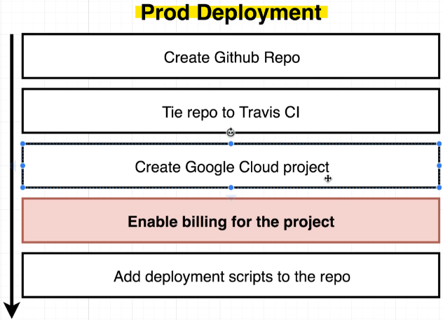

<br>

### Deployment Steps

1. `Create a GitHub Repository`:
   * Create a GitHub repo and a local GI repo.
   * Push all code to GitHub.

2. `Set Up Travis CI`:
   * Integrate Travis CI with the GitHub repo.
   * Travis CI will build images and push them to Docker Hub.
   * Travis CI will also deploy the application to a Kubernetes cluster.

> **Note**: Other CI environments like Circle CI can be used, but Travis CI is recommended for this course.

3. `Google Cloud Project`:
   * We'll use Google Cloud instead of AWS for deploying the Kubernetes application.

> **Important**: Enable billing on a Google Cloud account (requires a credit card or payment card).

4. `Cost Considerations`:
   * Unlike Elastic Beanstalk, this Kubernetes project will incur some billing.
   * Use the Google Cloud cost calculator to estimate costs.

> **Example**: Running the Kubernetes project for one day might cost around $1.40.

5. `Clean Up`:
   * Ensure to clean up all instances after completing the content to avoid unnecessary charges.

<bR>

### Key Points to Remember
* `Development vs. Production`: Development environment can show "not secure" messages; this will be fixed in production.
* `Travis CI`: Reliable for building and deploying applications.
* `Google Cloud`: Chosen for specific reasons over AWS.
* `Billing`: Necessary for Google Cloud; use the cost calculator to manage expenses.
* `Clean Up`: Crucial to avoid extra costs.

<br>

<hr style="height:4px;background:black">

<br>

## Google Cloud vs AWS for Kubernetes


<br>

### Google's Experience with Kubernetes
* Google **created** and **financially supported** Kubernetes in its early years.
* Google has **extensive experience** and **deep understanding** of Kubernetes.

### AWS's Recent Kubernetes Support
* AWS only added Kubernetes support in early **2018**.
* Google Cloud's **UI for Kubernetes** is more **user-friendly** and easier to use.

### Google Cloud Console
* Google Cloud provides a **cloud console**, a terminal instance **connected to your VPC**.
* **Direct access** to kubectl command line tool for managing Kubernetes clusters.
* **Easier** to set up and use compared to AWS.

### Better Documentation
* Google Cloud's **documentation** for Kubernetes is **superior** to AWS's documentation.
* **Easier** to **learn and understand** Kubernetes on Google Cloud.

### Key Points to Remember
* `Google's Expertise`: Google has a strong background in Kubernetes.
* `User-Friendly UI`: Google Cloud's UI for Kubernetes is more intuitive.
* `Cloud Console`: Provides direct access to Kubernetes management tools.
* `Superior Documentation`: Google Cloud offers better documentation for Kubernetes.

<br>

<hr style="height:4px;background:black">

<br>

## Creating a Git Repo

1. `Create a New GitHub Repository`:
   * Navigate to GitHub and click on the **plus** (+) icon in the top right corner.
   * Create a new repository named "Multi-K Eights" (or any name you prefer).
   * Ensure the repository is marked as **public** and click on "Create Repository".

2. `Set Up Local Git Repository`:
   * Copy the **link** of the new GitHub repository.
   * Open the terminal and navigate to your **project directory**.
   * Check if a Git repository already exists by running `ls -a` to see if there is a **.git** folder.

> **Note**: If a Git repository does not exist, create one with `git init`, then add and commit your files with git `add .` and `git commit -m "Initial commit"`.

3. `Configure Remote Repository`:
   * If a remote repository is already set up, remove it with `git remote remove origin`.
   * Add the new GitHub repository as the remote with `git remote add origin <repository-link>`.
   * Verify the remote repository with `git remote -v`.

4. `Push Code to GitHub`:
   * Push the code to the new GitHub repository with `git push origin master`.
   * Wait for the push to complete and verify by refreshing the GitHub repository page.

5. `Verify Repository Contents`:
   * Ensure that the repository contains the client, server, worker directories, and the K8s folder with all configuration files.

<br>

### Key Points to Remember
* `Separate Repository`: Create a new repository to avoid confusion with previous projects.
* `Local Git Setup`: Ensure a local Git repository is set up and linked to the new GitHub repository.
* `Push Code`: Push all code to the new GitHub repository and verify the contents.

<br>

<hr style="height:4px;background:black">

<br>

## Linking the GitHub Repo to Travis

1. `Link GitHub Repository to Travis CI`:
   * Open a new browser tab and navigate to [travis-ci.org](https://www.travis-ci.com/).
   * Refresh the list of Git repositories by clicking on "Profile" in the top right corner.
   * On the left-hand side, click on "Sync Account" to manually sync the repositories.

2. `Enable Repository for Building`:
   * Refresh the page to update the list of repositories.
   * Search for the newly created repository (e.g., "multi-K-eights").
   * Click the slider next to the repository name to **enable** it for building.

3. `Verify Travis CI Setup`:
   * Go back to the **Travis CI dashboard** using the link at the top left corner.
   * Ensure that the new project (e.g., "multi-K-eights") appears in the **list of projects**.
   * The next time code is pushed to the repository, Travis CI will start running and execute the Travis YML script file.

<br>

### Key Points to Remember
* `Manual Sync`: Refresh the list of Git repositories in Travis CI by performing a manual sync.
* `Enable Repository`: Enable the newly created GitHub repository for building in Travis CI.
* `Verify Setup`: Ensure the repository appears in the Travis CI dashboard and is ready for building.

<br>

<hr style="height:4px;background:black">

<br>

## Creating a Google Cloud Project

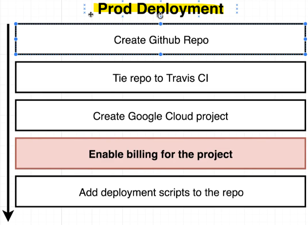

<br>

1. `Navigate to Google Cloud Console`:
   * Open a new browser tab and go to **console.cloud.google.com**.

2. `Create a New Project`:
   * If you've signed up for Google Cloud before, you might see an existing project or a list of projects.
   * If you've never created a Google Cloud project, you might see a **startup screen** or wizard.
   * Open the **project menu** using the dropdown on the top left-hand side.
   * Click on the "New Project" button on the top right.

3. `Name Your Project`:
   * Enter a project name, such as "Multi K8's".
   * Click on "Create".

4. `Wait for Project Creation`:
   * The project creation might take some time.
   * You can **monitor the status** using the spinner on the top right-hand side.
   * Once the project is created, you will be **redirected** back to the previous page.

<br>

### Key Points to Remember
* `Google Cloud Console`: Navigate to the console to create a new project.
* `Project Creation`: Follow the steps to create and name your project.
* `Monitor Status`: Wait for the project to be created and monitor the status.

<br>

<hr style="height:4px;background:black">

<br>

## Linking a Billing Account

1. `Select the Active Project`:
   * After creating the Google Cloud project, ensure it is selected as the **active project**.
   * Find the project dropdown and select the newly created project (e.g., "Multi K8s").
   * Verify the project name on the left-hand side of the dashboard.

<br>


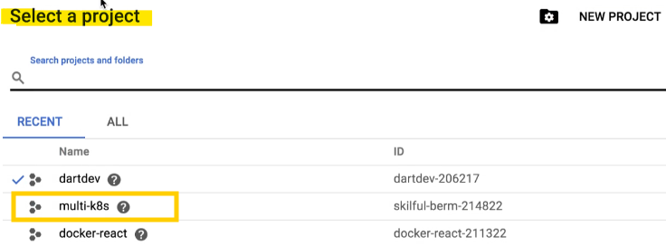

<br>

2. `Enable Billing`:
   * Navigate to the **billing** section using the navigation menu on the top left-hand side.
   * If you see a billing **setup window**, it means billing is **not yet linked** to the project.
   * If billing information appears, it means a billing account is already linked, and you can proceed to the next section.

<br>

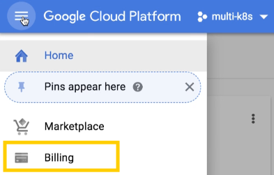

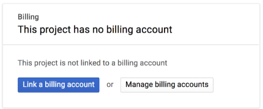

<Br>

3. `Link Billing Account`:
   * Click on the **blue** button to **link a billing account**.
   * If you already have a billing account, select it to link to the project.
   * If not, follow the wizard to create a new billing account, enter payment details, and name the billing account.
   * Once the billing account is created, link it to the project.

<br>

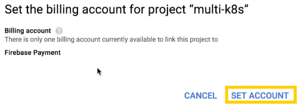

<br>

4. `Verify Billing Setup`:
   * Ensure the billing account is linked to the project.
   * You should see a screen listing the billing account ID and the linked project.

<br>

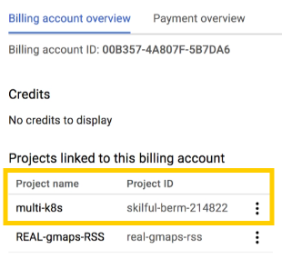

<br>

### Key Points to Remember
* `Active Project`: Ensure the newly created project is selected as the active project.
* `Billing Setup`: Navigate to the billing section and link a billing account to the project.
* `Verification`: Verify that the billing account is successfully linked to the project.

<br>

<hr style="height:4px;background:black">

<br>

## Kubernetes Engine Init

### Setting Up a Kubernetes Cluster
1. `Account Setup`:
   * Ensure your new account is **set up** and **linked** to a **billing account**.

2. `Navigation`:
   * Go to the **navigation menu** at the top left-hand side.
   * Scroll down to the "Compute" section.
   * Click on "Kubernetes Engine".

<br>

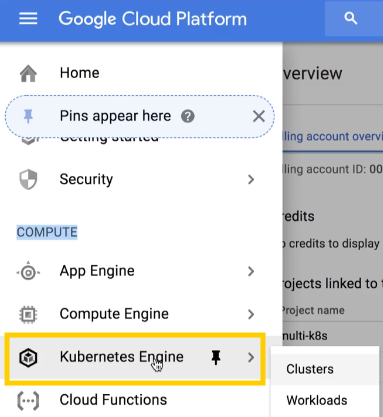

<br>

3. `Billing Window`:
   * If you see an "Enable Billing" window, **refresh** your browser.
   * If the message persists, **recheck** your billing setup.

4. `Kubernetes Engine Setup`:
   * After refreshing, you should see a message saying "Kubernetes Engine is getting ready".
   * This initial setup is required the first time you access the Kubernetes Engine page.

<br>

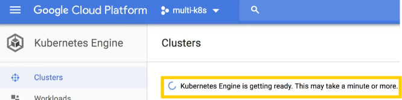

<br>

5. `Spinners`:
   * **There are two spinners on the screen**: one at the bottom and one at the top right.
   * The bottom spinner may stay indefinitely, but the top right spinner will eventually resolve.
   * If the top right spinner disappears but the bottom one remains, refresh the page.

6. `Refreshing the Page`:
   * Refreshing the page does not interfere with the setup process.
   * Feel free to refresh as needed until the "getting ready" message goes away.

<br>

### Tips
* Be patient during the initial setup.
* Regularly refresh the page if you encounter persistent messages or spinners.

<br>

<hr style="height:4px;background:black">

<br>

## Creating a Cluster with Google Cloud

### Initialising Kubernetes Engine
* `Spinner Stabilisation`: Ensure the spinner on the top right has stabilised. If the spinner on the screen persists, refresh the page.
* `Cluster Warm-Up`: Once the Kubernetes Cluster is warmed up, you can create a new cluster.

<br>

### Creating a New Cluster
1. `Click "Create Cluster"`.

<br>

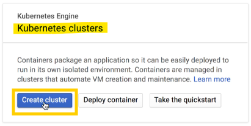

<br>

2. `Cluster Name`: Choose a name for your cluster. The name is not used in many places, so it's up to you.
3. `Location Type`: Leave it as **zonal** and select a zone close to your geographical location or where you want to serve traffic.
4. `Master Version`: Leave the master version as the **default setting**.
5. `Node Pool`: Configure the node pool, which specifies the virtual machines (nodes) added to your cluster.
   * `Default Nodes`: The default is **three** nodes, but you can adjust this based on your needs.

<br>

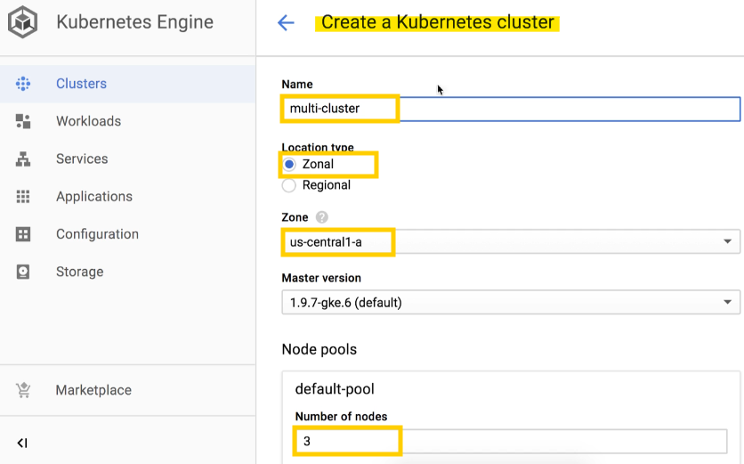

<br>

6. `Machine Type`: Select the **machine type**, which determines the specifications of the virtual machines.
   * `Default Machine Type`: One **virtual CPU** with **3.75 GB** of memory.
   * `Alternative Options`: You can select **micro** or **small** instances to save costs, but be cautious of potential issues with smaller instances.

<br>

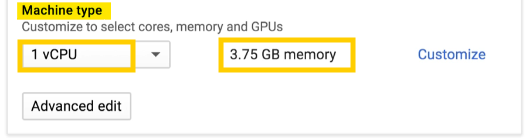

<br>

### Billing Considerations
* `Billing Starts`: Billing starts as soon as you click "Create." Ensure you have enough time to complete the course to avoid unnecessary charges.
* `Cost Estimate`: Expect to pay around $1.20 to $1.40 per day for the cluster.

### Creating the Cluster
* `Click "Create"`: This starts the cluster creation process, which may take some time. 
* `Spinner Monitoring`: Watch the notifications spinner. If the spinner on the body of the page persists, refresh the browser.

### Final Steps
* `Refresh Page`: Refreshing the page will not interfere with the setup process.
* `Pause and Resume`: Take a pause and resume in the next section to start exploring the created cluster.

<br>

<hr style="height:4px;background:black">

<br>

## Kubernetes Dashboard on Google Cloud

### Exploring the Kubernetes Dashboard
* `Cluster Information`: Click on the **multi-cluster** you created to view its **configuration**. This panel shows details about the cluster, including node specifications.

<br>

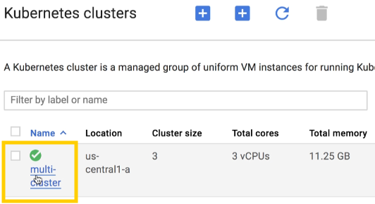

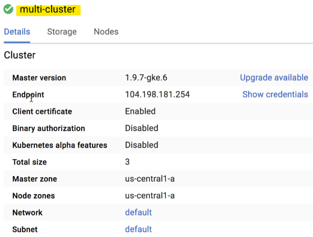

<br>

* `Node Specifications`: At the bottom of the page, you can see information about the **nodes in use**. You can change the specs, such as adding memory or a more powerful CPU, from this interface.

<br>

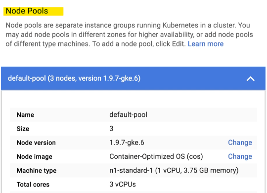

<Br>

### Dashboard Tabs

<br>

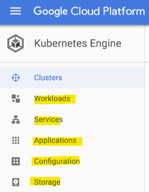


<Br>

* `Workloads`: This tab will show all the **different pods** and **deployments** for your application. 
  * It may be empty if nothing is running.
* `Services`: This tab lists the **different services created inside the cluster**, such as ClusterIP, load balancers, and NodePort services.
* `Applications`: This tab is for **third-party plugins** that can be **installed in the cluster**. 
  * It is not for pods or deployments.
* `Configuration`: This tab shows **environment variables** and **secrets** set up **inside the cluster**. 
  * For example, it will display the Postgres password secret.
* `Storage`: This tab lists all the **persistent volumes** and **persistent volume claims** in the cluster.

<br>

### Persistent Storage
* `Default Storage Provider`: On Google Cloud, the default storage provider is Google Cloud Persistent Disk (GCE-PD). This ensures reliable storage of information.
* `Storage Classes`: The default storage class is called "Standard." You can view details about it in the storage tab.

<br>

<hr style="height:4px;background:black">

<br>

## Travis Deployment Overview

### Travis Configuration for Kubernetes Deployment
* `Purpose`: The **travis.yml** file will **build images** and **deploy the application** to the Kubernetes cluster. This will be the most complex travis.yml file created so far.

<br>

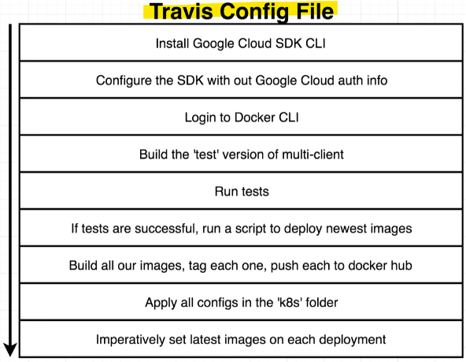

<br>

### Steps in the Configuration File
1. `Install Google Cloud SDK`:
   * `Purpose`: Allows Travis to interact with and configure the Kubernetes cluster.
   * `Installation`: Download and install the **SDK** each time the Travis build runs.
   * `Configuration`: **Authorise the SDK** with information from your Google Cloud account to make changes to the Kubernetes cluster.

2. `Docker CLI Login`:
   * `Purpose`: Log into Docker CLI to **build** and **test images**.
   * `Build Test Image`: Create a **test version** of the multi-client image and run tests.

3. `Run Deployment Script`:
   * `Build Images`: Build images for **multi-client**, **multi-server**, and **multi-worker**.
   * `Push to Docker Hub`: **Push** the built images to Docker Hub.

4. `Apply Config Files`:
   * `K8s Directory`: **Apply all config files** in the K8s directory to keep the Kubernetes cluster in sync with the GitHub repository.

5. `Update Image Versions`:
   * `Imperative Command`: Use a special command to update the image versions used by deployments to ensure they use the latest images.

<br>

### Additional Notes
* `Sync with GitHub`: Any changes to config files in the K8s directory will be applied to the Kubernetes cluster as soon as the code is pushed to Travis.
* `Complexity`: This travis.yml file is complex and involves multiple steps, including some not shown in the diagram.

<br>

<hr style="height:4px;background:black">

<br>

## Installing the Google Cloud SDK

### Creating the Travis Configuration File
* `File Creation`: In your root project directory, create a new file named **.travis.yml**.
* `Sudo Required`: Add **sudo: required** because Docker is being used.
* `Docker Service`: Ensure the Docker service is **pre-installed** to build images and run the test container.

<bR>

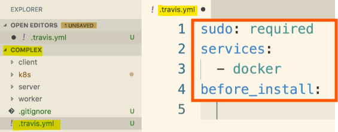

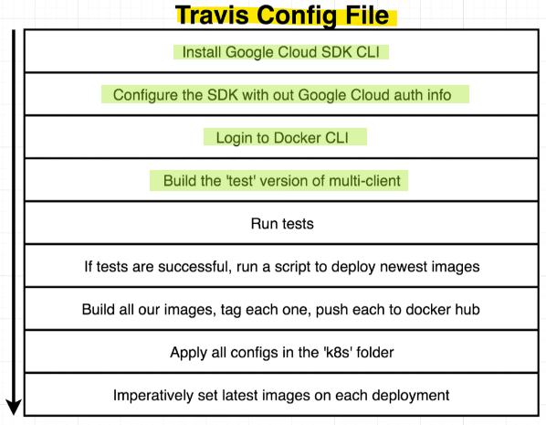


<br>

### Before Install Steps
1. `Download and Install Google Cloud SDK`:
   * **Command**: `curl https://sdk.cloud.google.com | bash > /dev/null`
   * `Explanation`: This command **downloads** and **installs** the Google Cloud **SDK** on the Travis CI instance.

<br>

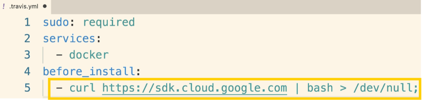

<br>

2. `Source Configuration`:
   * **Command**: `source $HOME/google-cloud-sdk/path.bash.inc`
   * `Explanation`: This command **sources the configuration file** to **modify the shell** inside Travis CI.

<br>

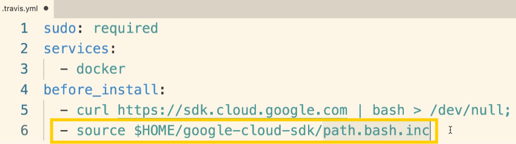

<br>

3. `Install kubectl`:
   * **Command**: `gcloud components update kubectl`
   * `Explanation`: This **installs** and **updates kubectl** in the Travis environment to **manipulate** the Kubernetes **cluster**.

<br>

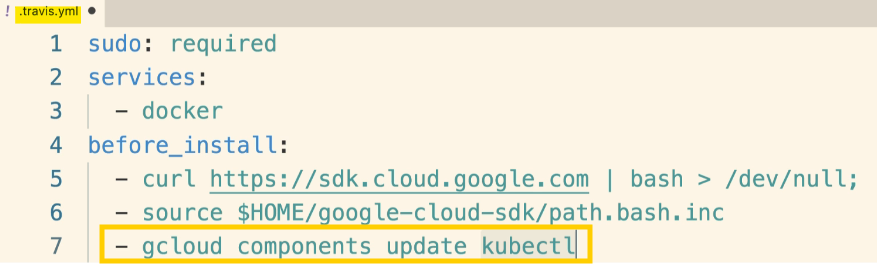

<br>

4. `Authorization with Google Cloud`:

`Activate Service Account`:
* **Command**: `gcloud auth activate-service-account --keyfile service-account.json`
* `Explanation`: This command **activates** a **service account** using credentials from the **service-account.json** file. These credentials are sensitive and should be handled securely.

<br>


<br>

<hr style="height:4px;background:black">

<br>

## Generating a Service Account

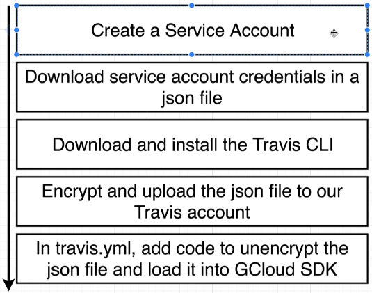

<br>

### Creating a Service Account
1. `Log into Google Cloud Console`: Navigate to the **IAM** and **Admin** section.

<br>

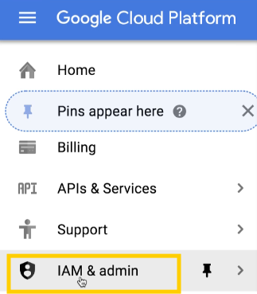

<br>

2. `Create Service Account`:
   * **Account Name**: Provide a **name** for the **service account** (e.g., Travis Deployer).
   * **Assign Role**: Assign the **role** of Kubernetes Engine Admin to give **full control** over the cluster.
   * **Private Key**: Select to furnish a **new private key** and choose **JSON** format.

<br>

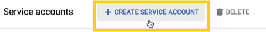

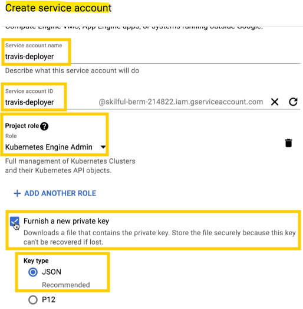

<br>

3. `Download JSON File`: Save the JSON file containing the account credentials. This file is sensitive and should not be exposed to the outside world.

<br>

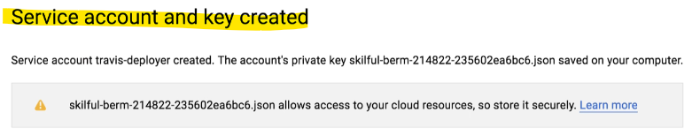


<br>

### Encrypting and Uploading the JSON File
1. `Install Travis CLI`: Download and install the Travis CLI on your local machine.
2. `Encrypt JSON File`: Use the Travis CLI to **encrypt the JSON file** and **store it securely** on Travis CI's servers.
3. `Add Configuration to Travis YAML`: Add configuration to the Travis YAML file to **decrypt the JSON file** and **load** it into the **Google Cloud SDK** during the build process.

<br>

### Important Notes
* `Sensitive Information`: The JSON file contains sensitive credentials and should never be committed to GitHub or exposed publicly.
* `Secure Handling`: Ensure the JSON file is handled securely and only used within the Travis CI build process.

<br>

<hr style="height:4px;background:black">

<br>

## Running Travis CLI in a Container

### Encrypting the Service Account JSON File
* **Objective**: encrypt this file and tie it to our [Travis CI account](https://github.com/travis-ci/travis.rb).

<br>

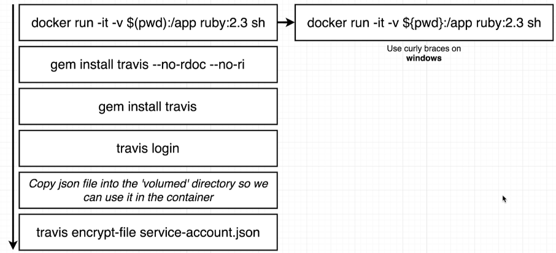

<br>

### Installing Travis CLI
* `Purpose`: The Travis CLI will be used to **encrypt the service account** JSON file.
* `Ruby Requirement`: Travis CLI requires Ruby to be installed. macOS users have Ruby by default, but Windows users may find it challenging to install Ruby.

<br>

### Using Docker for Travis CLI
* `Docker Image`: Instead of installing Ruby locally, use a **Docker image** with **Ruby pre-installed**.
* `Docker Command`: Run the following command to start a Docker container with Ruby:

```sh
docker run -it -v $(pwd):/app ruby:2.3 sh
```

* `Explanation`: This command runs a **Ruby 2.3 container**, **starts a shell** inside it, and **sets up a volume** to **access the service account** JSON file.

<bR>

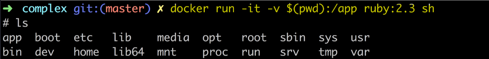

<br>

### Inside the Docker Container
* `Navigate to App Folder`: Change to the **/app** directory inside the container to access the project files.

```sh
cd /app
```

<br>

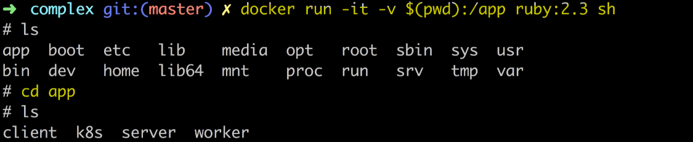

<br>

* `Install Travis CLI`: Use the **gem program** to **install Travis CLI**:

```sh
gem install travis --no-rdoc --no-ri
```

* `Explanation`: This command **installs Travis CLI** without additional documentation to speed up the process.

<br>

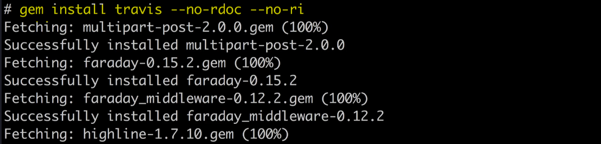

<br>

### Verifying Travis CLI Installation
* `Run Travis Command`: Verify the installation by running the travis command:

```sh
travis
```

* `Explanation`: This command should display a **list of available Travis CLI commands**, confirming the installation was **successful**.

<br>

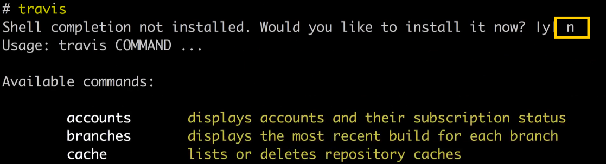

<br>

### Important Notes
* `Sensitive Information`: The JSON file contains sensitive credentials and should never be exposed publicly.
* `Secure Handling`: Ensure the JSON file is encrypted and securely handled within the Travis CI build process.

<br>

<hr style="height:4px;background:black">

<br>

## Encrypting a Service Account File

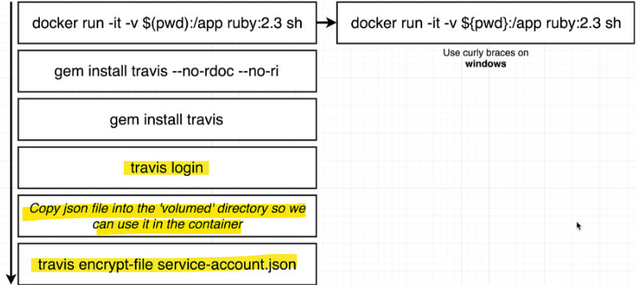

<br>

### Logging into Travis CLI
1. `Login Command`: Execute `travis login` to log into Travis CLI.
2. `GitHub Credentials`: Enter your GitHub **username** and **password**. 
   * If you have two-factor authentication, enter the code sent to your phone.
3. `Successful Login`: Once logged in, Travis CLI will **associate files and settings** with your personal Travis account.

<br>

### Copying the JSON File
1. `Locate JSON File`: Find the JSON file downloaded from the Google Cloud Dashboard.

<br>

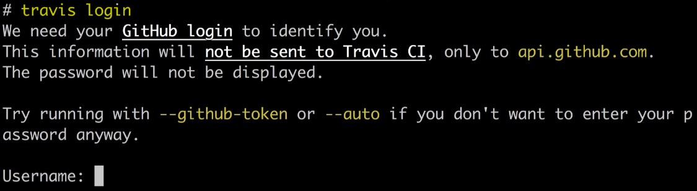

<br>

2. `Copy to Project Directory`: Copy the JSON file to the **Complex Project folder**, which is set up as a **volume inside the container**.
3. `Rename File`: Rename the file to **service-account.json** for easier handling.

<br>

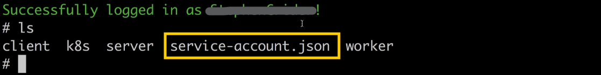

<br>

### Encrypting the JSON File
1. `Navigate to App Folder`: Ensure you are inside the **/app** folder in the container.
2. `Encrypt Command`: Run the following command to **encrypt the JSON file** and **tie it** to the **repository**:

```sh
travis encrypt-file service-account.json -r GitHubUsername/RepositoryName
```

<br>

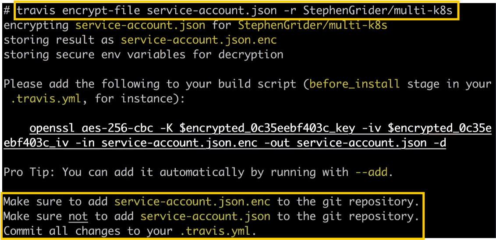

<br>

### Adding Encrypted File to Travis YAML
1. `Case Sensitivity`: Ensure the GitHub username is **case-sensitive**.
2. `Copy Command`: Copy the command provided by Travis CLI to **decrypt the file**.

<br>

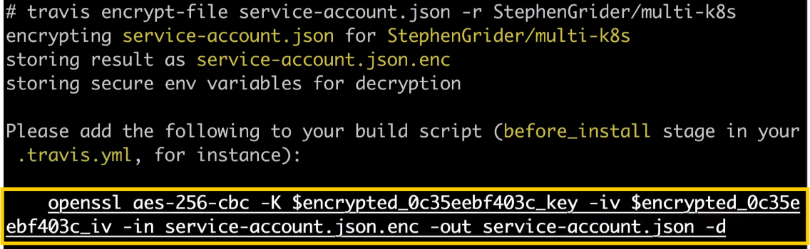

<br>

2. `Update Travis YAML`: Add the command to the **before_install** section of your **.travis.yml** file:

```yaml
before_install:
  - openssl aes-256-cbc -K $encrypted_key -iv $encrypted_iv -in service-account.json.enc -out service-account.json -d
```

<br>

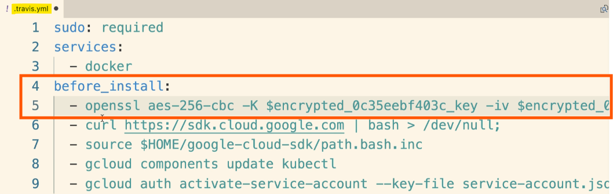

<br>

### Handling the Original JSON File
* `Delete Original File`: Ensure you **delete** the original **service-account.json** file to prevent exposing sensitive information.
  * You will have to delete this manually.
* `Verify Deletion`: Confirm that only the **encrypted file service-account.json.enc** remains.

<br>

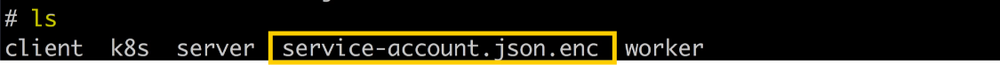

<br>

### Committing the Encrypted File
* `Add and Commit`: Add and commit the encrypted file to your Git repository:

```sh
git add service-account.json.enc
git commit -m "Added encrypted service-account file"
```

<br>

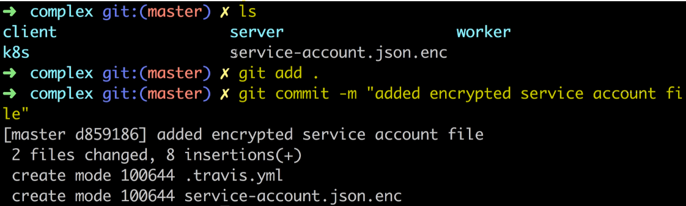

<br>

### Important Notes
* `Sensitive Information`: The original JSON file contains sensitive credentials and should never be exposed publicly.
* `Secure Handling`: Ensure the JSON file is encrypted and securely handled within the Travis CI build process.

<br>

<hr style="height:4px;background:black">

<br>

## More Google Cloud CLI Config

### Configuring Google Cloud SDK in Travis YAML
* `Decrypt File`: The **openssl** command in the **before_install** section **decrypts the encrypted file** and places it in the project directory.

**Activate Service Account**:
* **Command**: `gcloud auth activate-service-account --key-file service-account.json`
* `Explanation`: This command uses the **decrypted file** to **authenticate** with **Google Cloud**.

<br>

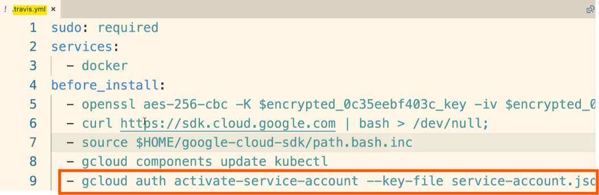

<br>

### Additional Setup for Google Cloud SDK
`Set Project`:
* **Command**: `gcloud config set project [PROJECT_ID]`
* `Explanation`: Specify the **project ID** from the Google Cloud **Dashboard**.

<br>

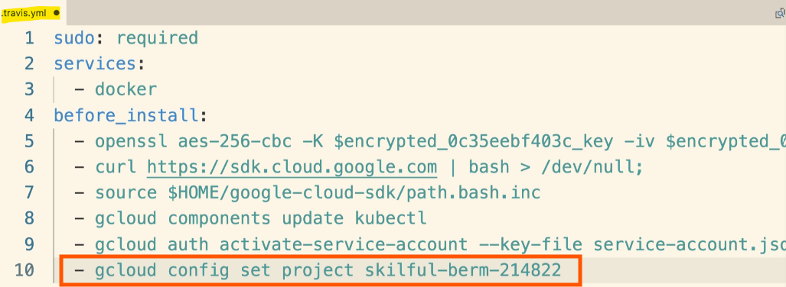

<Br>

`Set Compute Zone`:
* **Command**: `gcloud config set compute/zone [ZONE]`
* `Explanation`: Specify the **compute zone** (e.g., us-central1-a) from the **Kubernetes Engine** settings.

<br>

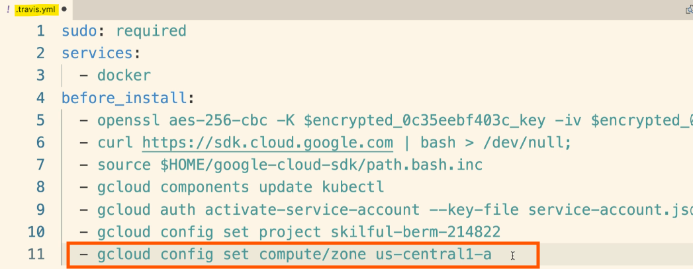

<br>

`Set Cluster`:
* **Command**: `gcloud container clusters get-credentials [CLUSTER_NAME]`
* `Explanation`: Specify the **cluster name** to configure the Google Cloud command to work with the specific cluster.

<br>

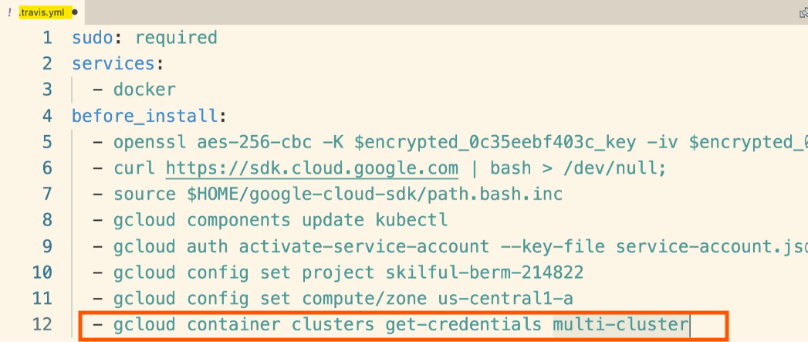

<br>

<hr style="height:4px;background:black">

<br>

## Running Tests with Travis

### Docker CLI Login in Travis YAML
* `Add Login Command`: In the **before_install** section of your **.travis.yml** file, add the following command to log into Docker CLI:

```yaml
before_install:
  - echo $DOCKER_PASSWORD | docker login -u "$DOCKER_USERNAME" --password-stdin
```

* `Explanation`: This command **logs into Docker** using the **username and password** stored in environment variables.

<br>

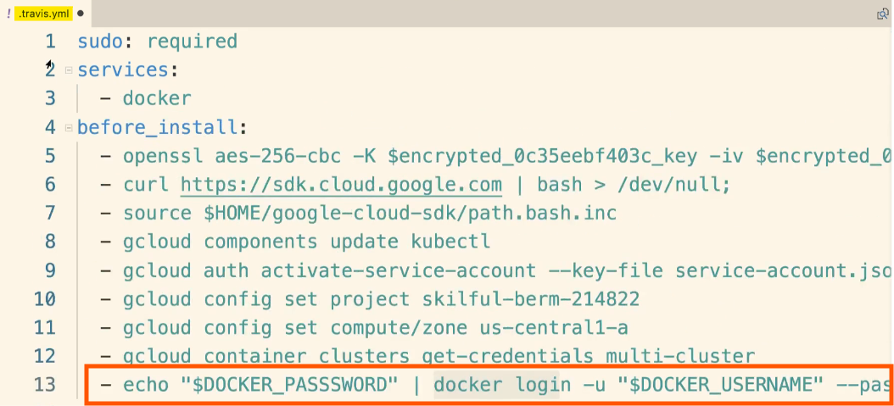

<br>

### Setting Up Environment Variables
* `Travis Dashboard`: Open the Travis dashboard and navigate to the **settings** of your project.

<br>

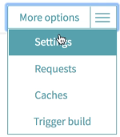

<br>

`Add Environment Variables`:
* `Docker Username`: Add a new environment variable named **DOCKER_USERNAME** with your Docker ID.
* `Docker Password`: Add a new environment variable named **DOCKER_PASSWORD** with your Docker password.
* `Double Check Spelling`: Ensure the spelling of the environment variable names matches exactly with what is used in the **.travis.yml** file.

<br>

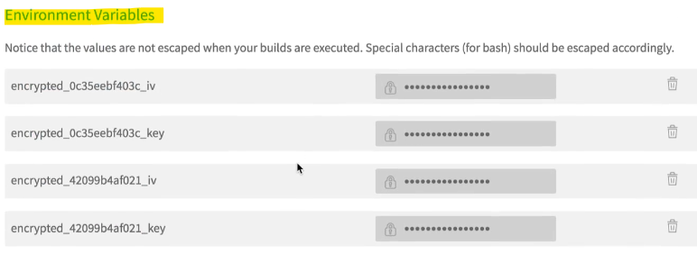

<br>

### Building and Testing Docker Image
1. `Build Image`: Add the following command to build the Docker image in the before_install section:

```yaml
before_install:
  - docker build -t react-test -f ./client/Dockerfile.dev ./client
```

* **Explanation**: This command **builds the Docker image** using the **development Dockerfile** located in the **client** directory.

<br>


<br>

2. `Run Tests`: Add the following command in the script section to run tests:

```yaml
script:
  - docker run -e CI=true react-test npm run test -- --coverage
```

* **Explanation**: This command **runs the tests** inside the Docker container and **generates a coverage report** to **signal** the **test results** to Travis.

<br>

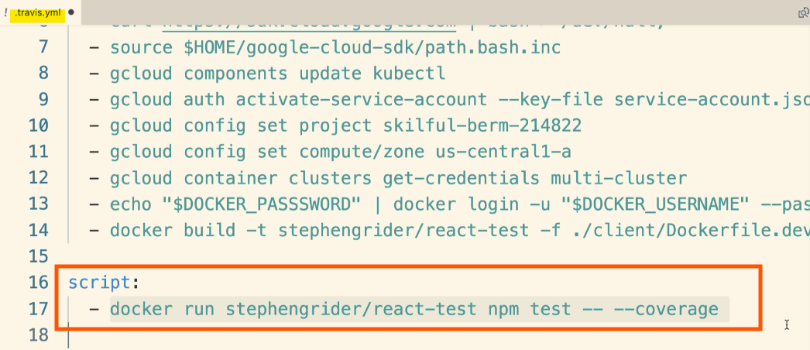

<br>

### Important Notes
* `Sensitive Information`: Ensure the Docker password is securely stored and not exposed publicly.
* `Test Commands`: Replace the test commands with those specific to your project if different from the example provided.

<br>

<hr style="height:4px;background:black">

<br>

## Custom Deployment Providers

### Deployment Script
* `Separate Script File`: Create a separate script file (deploy.sh) to handle the **deployment process**.
* `Purpose`: The script will **build images**, **tag them**, **push them** to Docker Hub, **apply config files**, and **set images** for **each deployment**.

<br>

### Travis YAML Configuration
* `Deploy Section`: Add a deploy section to the **.travis.yml** file.
* `Provider`: **Specify provider**: script to indicate a custom deployment script.
* `Command`: Specify the command to run the deployment script:

```yaml
deploy:
  provider: script
  script: bash ./deploy.sh
  on:
    branch: master
```

* `Explanation`: This tells Travis to **run** the **deploy.sh script** for deployment **when changes are pushed** to the master branch.

<br>

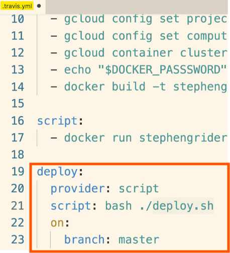

<br>

### [Creating the Deploy Script](#unique-deployment-images)
1. `Create File`: In the **root** project directory, create a file named **deploy.sh**.
2. `Script Content`: Inside deploy.sh, write commands to:
   * Build images
   * Tag images
   * Push images to Docker Hub
   * Apply config files
   * Set images for each deployment

<br>

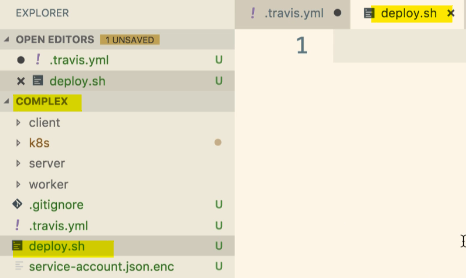

<br>

### Important Notes
* `Branch Specification`: Ensure the deployment script runs only when changes are pushed to the master branch.
* `Custom Deployment`: Since Travis does not have a built-in provider for Kubernetes, a custom script is necessary for deployment.

<br>

<hr style="height:4px;background:black">

<br>

## Unique Deployment Images
> **Objective**: The deploy.sh file will handle image building, applying configs, and setting the latest images for deployments.

### Steps in the Deploy Script
1. `Build Docker Images`:
   * **Command**: `docker build -t [Docker ID]/multi-client -f ./client/Dockerfile ./client`
   * **Repeat**: Do the same for **multi-server** and **multi-worker** images.
   * **Check**: Ensure the **correct paths** and names are used for each image.
   * **Explanation**: This command **builds the Docker image** for the client, server, and worker images, ensuring the correct paths and names are used.

<br>

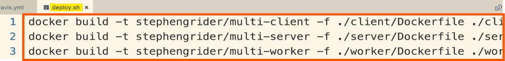

<br>

2. `Push Images to Docker Hub`:
   * **Command**: `docker push [Docker ID]/multi-client`
   * **Repeat**: Do the same for **multi-server** and **multi-worker** images.
   * **Explanation**: This command **pushes the built image** to Docker Hub. Repeat for **server** and **worker** images.

<br>

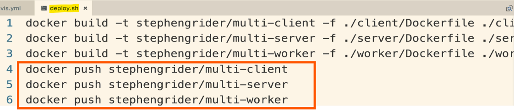

<br>

3. `Apply Kubernetes Configs`:
   * **Command**: `kubectl apply -f k8s`
   * **Explanation**: This applies all config files in the k8s directory.

<br>

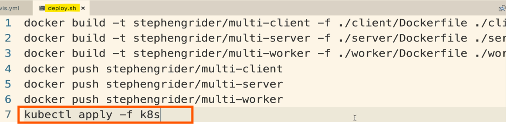

<br>

4. `Set Latest Image on Deployments`:
   * **Command**: `kubectl set image deployments/server-deployment server=[Docker ID]/multi-server`
   * **Explanation**: This command sets the **latest image** for the server deployment. However, using the latest tag may cause the deployment to think it is already running the latest image, resulting in no changes.

<Br>

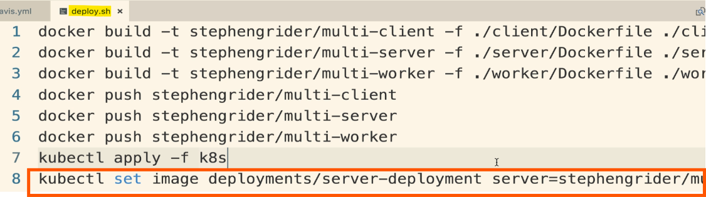

<br>

> **Issue**: Using the latest tag may cause the deployment to think it is already running the latest image, resulting in no changes.
>
> **Solution**: Implement a system to automatically apply unique version numbers to image tags to ensure deployments get the latest versions.

<br>

### Important Considerations
* `Image Tagging`: Ensure images are tagged with unique version numbers to avoid issues with the latest tag.
* `Deployment Updates`: Use specific version tags to force deployments to update to the new image versions.

<br>

<hr style="height:4px;background:black">

<br>

## Unique Tags for Built Images

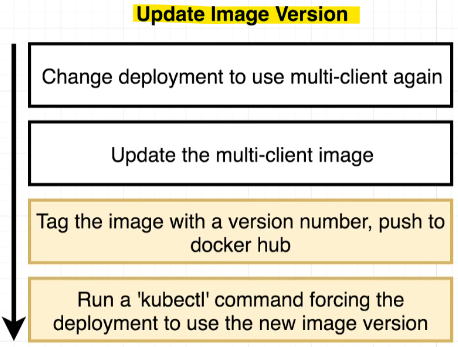

<br>

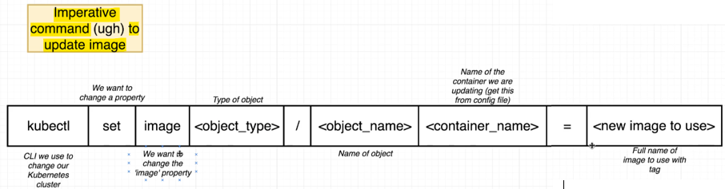

<br>

### Ensuring Unique Image Tags for Deployments
> **Problem**: When setting an image manually on a deployment, the image name or tag must be **unique** and **different** from what the **deployment is currently running**. Otherwise, the deployment will not update.

<br>

### Solution: Using Git SHA for Unique Tags
1. `Dual Tagging`: Apply two tags to each image during the build process:
   * **Latest Tag**: `multi-client:latest`
   * **Git SHA Tag**: `multi-client:<Git SHA>`

<br>

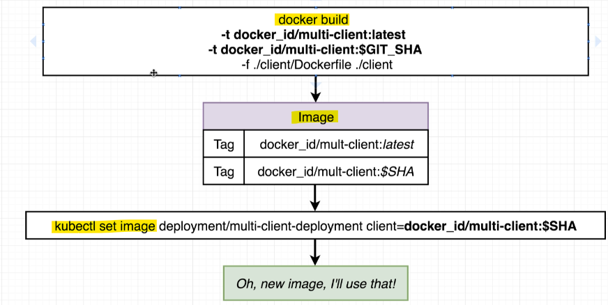

<br>

2. `What is a Git SHA?`:
   * **Definition**: A unique identifying token generated with each Git commit.
   * **Command**: Run `git rev-parse HEAD` to get the current SHA for the latest commit.
   * **Usage**: The SHA **identifies** the **state** of the **codebase** at a specific point in time, making it perfect for versioning images.

<Br>

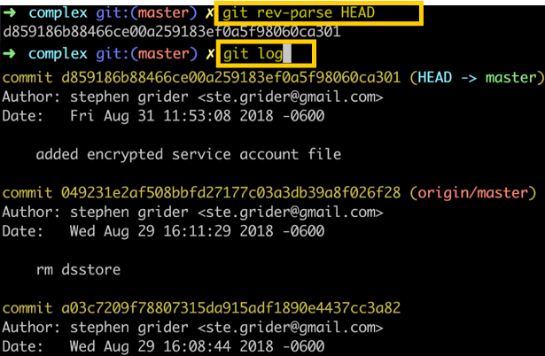

<br>

3. `Benefits of Using Git SHA`:
   * **Unique Identifier**: Ensures each image has a **unique tag**, prompting the deployment to update.
   * **Debugging**: Allows you to **revert the codebase** to the exact state of the deployment for debugging purposes.
     * **Example**: If the deployment is running **multi-client:A3BA**, you can check out that commit locally using `git checkout <SHA>` to debug the exact code running in production.

<Br>

4. `Applying the Latest Tag`:
   * **Purpose**: Ensures that the latest tag always points to the most recent image.
   * **Scenario**: If a new engineer clones the repository and runs `kubectl apply -f k8s`, the deployment files will pull the latest version of the images automatically.

<br>

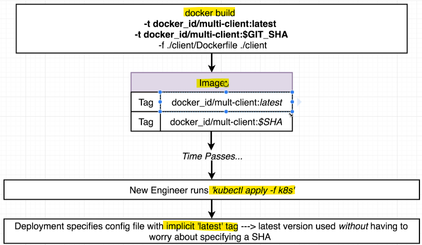

<bR>

### Updating Travis YAML and Deploy Script
* `Travis YAML`: Update the **.travis.yml** file to incorporate the use of Git SHA for tagging images.
* `Deploy Script`: Modify the **deploy.sh** script to apply both the latest tag and the Git SHA tag to each image.

<br>

### Summary
* `Dual Tagging`: Use both **latest** and `<Git SHA>` tags for images.
* `Unique Tags`: Ensure deployments always update by using unique tags.
* `Debugging`: Easily debug by reverting to the exact state of the codebase using the Git SHA.

<br>

<hr style="height:4px;background:black">

<br>

## Updating the Deployment Script

### Adding Git SHA to Travis YAML
1. `Determine Git SHA`: Add code to the **.travis.yml** file to determine the **current Git SHA** and **export it** as an **environment variable**.
2. `Environment Variable`: Add the following to the .travis.yml file:

```yaml
env:
  global:
    - SHA=$(git rev-parse HEAD)
```

* **Explanation**: This sets the current commit SHA as an environment variable called **SHA**.

<br>

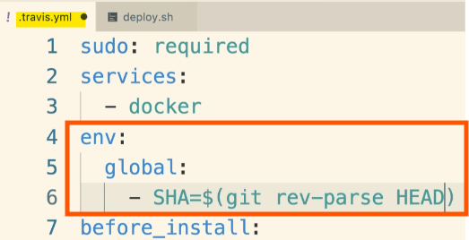

<br>

3. `Disable Prompts`: Add another environment variable to **disable prompts** in the Google Cloud CLI:

```yaml
env:
  global:
    - CLOUDSDK_CORE_DISABLE_PROMPTS=1
```

* **Explanation**: This ensures the Google Cloud CLI does not display prompts that require user input.

<br>

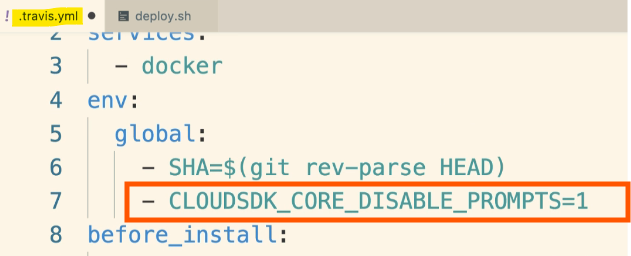

<br>

### Updating Deploy Script
1. `Tagging Images`: Modify the **deploy.sh** file to apply both the latest tag and the Git SHA tag to each **image**, (client, worker, server).

**Example**:

```sh
docker build -t [Docker ID]/multi-client:latest -t [Docker ID]/multi-client:$SHA -f ./client/Dockerfile ./client
```

<br>

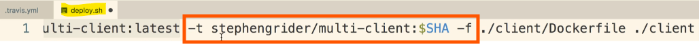

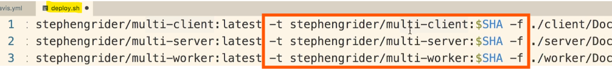

<br>

2. `Pushing Images`: Ensure both tags are pushed to Docker Hub.

**Example**:

```sh
docker push [Docker ID]/multi-client:latest
docker push [Docker ID]/multi-client:$SHA
```

<br>

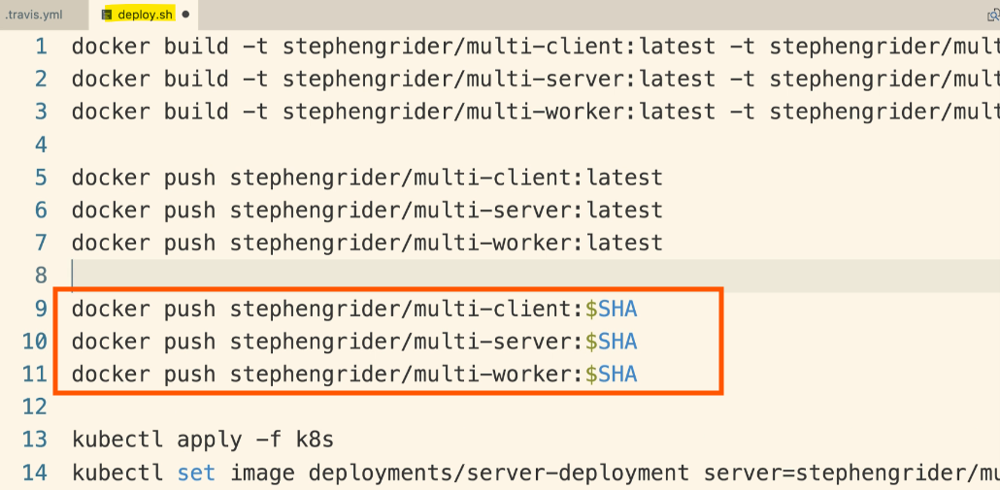

<br>

3. `Setting Images in Deployments`: Update the kubectl set image commands to use the Git SHA tag.

**Example**:

```sh
kubectl set image deployments/server-deployment server=[Docker ID]/multi-server:$SHA
kubectl set image deployments/client-deployment client=[Docker ID]/multi-client:$SHA
kubectl set image deployments/worker-deployment worker=[Docker ID]/multi-worker:$SHA
```

<br>

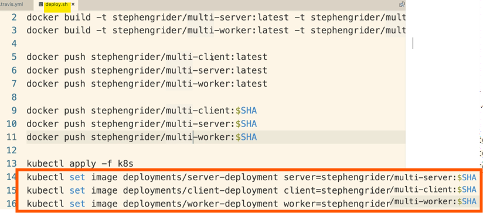

<br>

### Final Checks
* `Triple Check`: Ensure all lines correctly reference client, server, and worker without duplication.
* `Ready for Deployment`: Once verified, push the changes to GitHub and test the deployment.

<br>

<hr style="height:4px;background:black">

<br>

## Configuring the GCloud CLI on Cloud Console
> **Objective**: Complete the final configuration steps on Google Cloud before deploying the application.

<br>

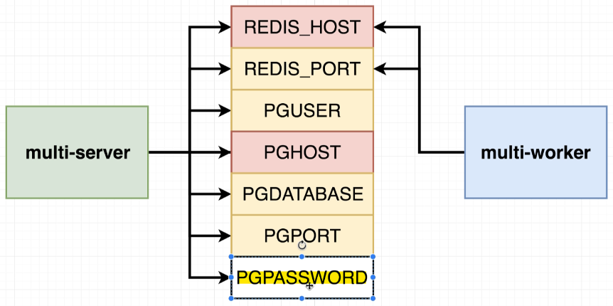

<Br>

### Creating a Secret
* `Purpose`: Create a **Secret** to store the **PG_password** environment variable for the **multi-server** and **Postgres images**.
* `Kubernetes Secret`: The Secret ensures the PG_password is **securely shared** between the multi-server and Postgres images.

<br>

### Using Google Cloud Shell
* `Activate Cloud Shell`: Click the "Activate Cloud Shell" button on the top right of the **Google Cloud dashboard**.
  * **Explanation**: This opens a terminal connected to your Google Cloud project, allowing you to **run commands against your production resources**.

<br>


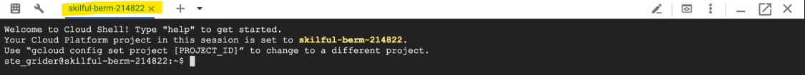

<br>

### Configuring Google Cloud CLI
1. `Set Project ID`:
   * **Command**: `gcloud config set project [PROJECT_ID]`
   * **Explanation**: Set the project ID for your Google Cloud project.

<br>

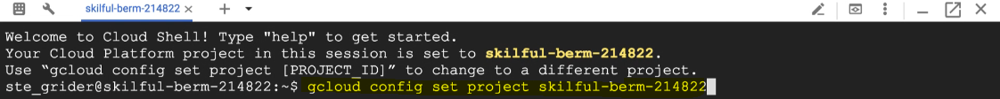

<br>

2. `Set Compute Zone`:
   * **Command**: `gcloud config set compute/zone [ZONE]`
   * **Explanation**: Set the compute zone for your Kubernetes cluster (e.g., us-central1-a).

<br>

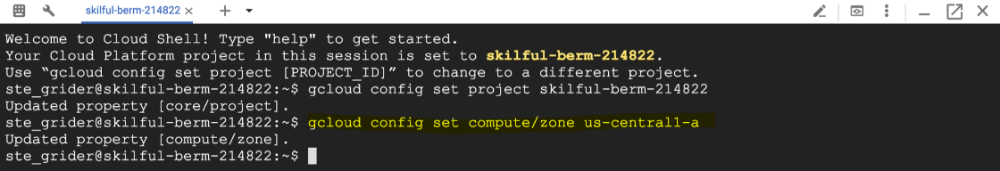

<br>

3. `Get Credentials`:
   * **Command**: `gcloud container clusters get credentials [CLUSTER_NAME]`
   * **Explanation**: Retrieve the credentials for your Kubernetes cluster.

<br>

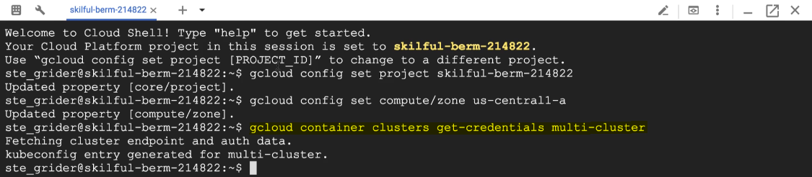

<br>

### Running the Commands
* `Run Commands in Cloud Shell`: Execute the above commands in the **Cloud Shell** to configure the Google Cloud CLI.

> **Note**: These commands only need to be run once unless you create a new Kubernetes cluster or project in the future.

<br>

<hr style="height:4px;background:black">

<br>

## Creating a Secret on Google Cloud

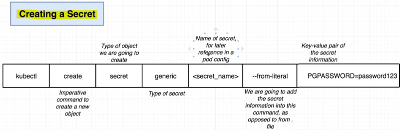

<br>

### Testing Connection to Kubernetes Cluster
* `Test Command`: Run `kubectl get pods` to **test** the connection to the Kubernetes cluster.
  * `Expected Output`: "No resources found" (since no pods have been created yet).
  * `Explanation`: This **confirms** that the **connection** to the Kubernetes cluster is **successful**.

<br>

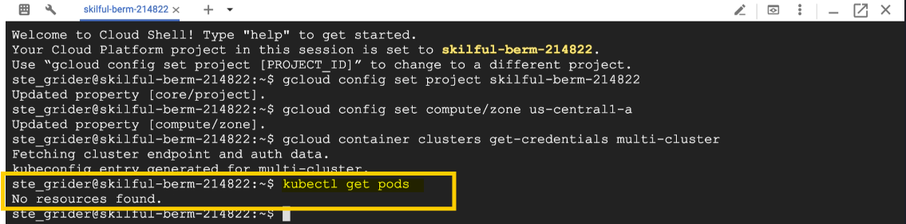

<br>

### Creating a Secret
* `Purpose`: Create a Secret to **store the PG_password** environment variable for the **multi-server** and **Postgres images**.
* `Command`: Use the following command to create the Secret:

```sh
kubectl create secret generic pgpassword --from-literal=PGPASSWORD=<your-password>
```

* `Explanation`: Replace **your-password** with your **desired password**. This password does not have to be the same as your development password and should be different for security reasons.

<br>

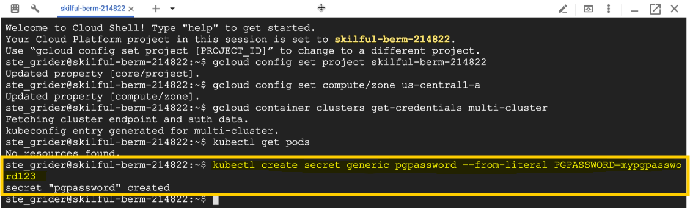

<br>

### Verifying the Secret
* `Refresh Configuration`: After creating the Secret, refresh the **Google Cloud dashboard**.
* `Check Configuration Tab`: Open the **configuration tab** to verify that the Secret has been created and is available for use in the application.

<br>

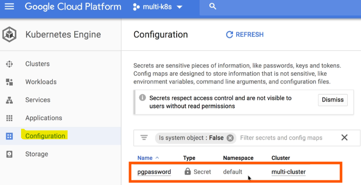

<br>

<hr style="height:4px;background:black">

<br>

## Helm Setup

### Setting Up Ingress NGINX on Production Kubernetes Cluster
* `Ingress Service`: The ingress service relies on the [ingress NGINX project](https://github.com/kubernetes/ingress-nginx), which was **installed in the local Minikube cluster** using the `minikube addons enable ingress` command.
* `Production Setup`: The production Kubernetes cluster does **not** have NGINX ingress by default, so it needs to be **installed** as a **separate service**.

<br>

### Steps to Install Ingress NGINX
* `Ingress Config`: The ingress config file is **already created** in the project.
* `Additional Setup`: The setup will create a **load balancer service**, **map** it to a **Google Cloud Load Balancer**, and set up a **deployment running** the **ingress controller** and **NGINX pod**.

<br>

### Using Helm for Installation
* `What is Helm?`: Helm is a tool used to **administer third-party software inside** a Kubernetes **cluster**. 
* It simplifies the installation and management of complex applications.

`Helm Installation`:
* **Navigate to Helm Repository**: Go to [github.com/helm/helm](https://github.com/helm/helm).
* **Official Documentation**: Follow the link to the [official documentation](https://github.com/helm/helm) for installation instructions.

<br>

### Installing Helm
* `Preferred Method`: The preferred method is using **Homebrew**, but it is **not** available in the production Kubernetes environment.
* `Alternative Method`: Use the "From Script" method to install Helm.

**Commands**:

```sh
curl https://raw.githubusercontent.com/helm/helm/main/scripts/get-helm-3 | bash
chmod +x get_helm.sh
./get_helm.sh
```

* `Explanation`: These commands **download**, **change permissions**, and **execute the Helm installation script** in the Google Cloud Shell.

<br>

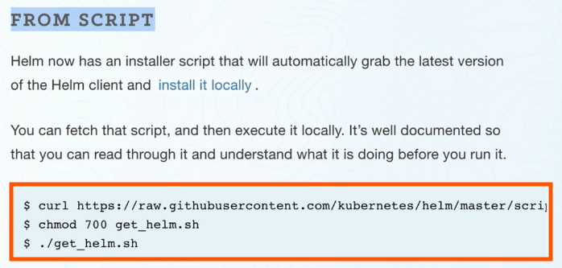

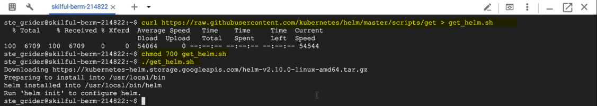

<br>

<hr style="height:4px;background:black">

<br>

## Ingress-Nginx with Helm
> **Objective**: Use Helm to install the NGINX Ingress on the production Kubernetes cluster.

### Steps to Install NGINX Ingress
1. `NGINX Ingress Documentation`: Access the documentation at [kubernetes.github.io/ingress-nginx](https://kubernetes.github.io/ingress-nginx/).
2. `Deployment Tab`: Navigate to the **deployment** tab and find the "Using Helm" section at the bottom.

<br>

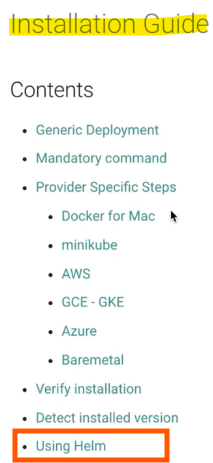

<br>

3. `RBAC Command`: If the Kubernetes cluster has **RBAC** installed, run the provided command in the cloud shell.

<br>

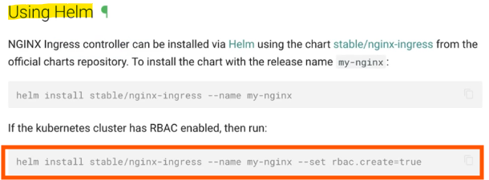

<br>

### Running the Command
1. `Copy Command`: Copy the command from the documentation.
2. `Run in Cloud Shell`: Paste and run the command in the Google Cloud Shell.

* **Explanation**: This command creates a set of objects behind the scenes, similar to the mandatory command YAML file.

<br>

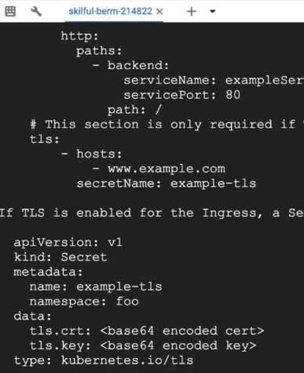

<br>

### Verifying the Setup
* `Output`: Check the output to see the created resources, including:
  * LoadBalancer
  * ClusterIP for the default backend
  * Deployment
  * Pod for the controller and default backend
  * ClusterRoleBinding and RoleBinding

<br>

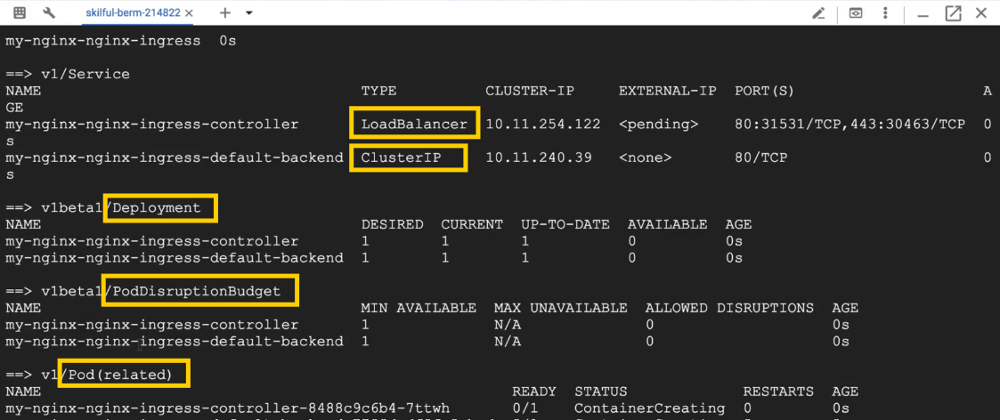

<br>

<hr style="height:4px;background:black">

<br>

## The Result of Ingress-Nginx

### Verifying Ingress-NGINX Installation
1. `Refresh the Page`: Reload the Google Cloud **dashboard** to see the updated resources.
2. `Workloads Tab`: Check the **Workloads** tab to see the **Ingress controller** and **Ingress default backend**.
   * `Ingress Controller`: **Manages the pod** that runs the controller to read the Ingress config file and set up NGINX.
   * `Default Backend`: Provides **health checks** and a default 404 page for routes not found in the application.

<br>

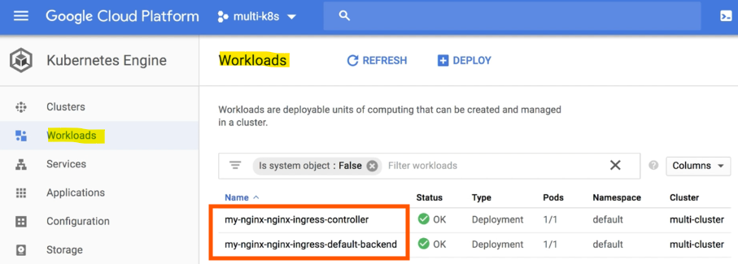

<br>

### Checking Services
1. `Services Tab`: Look for the Load Balancer service with two sets of numbers (IP addresses).
   * `IP Addresses`: These are the addresses used to access the project.
   * `Default Backend 404`: Clicking on the colon 80 address should show a default backend 404 page, indicating the default backend is working.

<br>

### Network Services
1. `Navigation Menu`: Go to Network Services under the **Networking** section.
2. `Load Balancing Tab`: View the Google Cloud load balancer created for the cluster.
   * `Load Balancer Details`: Shows the **IP address** and the **instances** (virtual machines) it **governs**.
   * `Ingress-NGINX`: The load balancer **directs traffic** to the **Load Balancer Service**, which then **routes** it to the **NGINX Ingress controller** and the **deployments**.

<br>

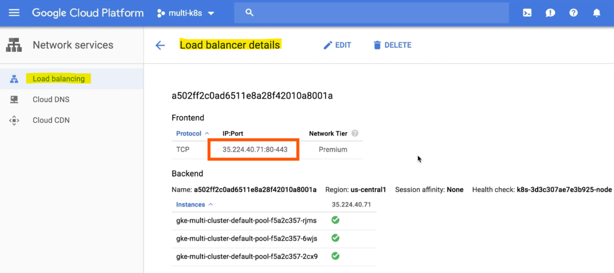

<br>

<hr style="height:4px;background:black">

<br>

## Deployment

### Deploying the Application
* `Preparation`: Ensure all changes to the **k8s folder**, **deploy.sh** file, and **travis.yml** file are complete.
* `Commit and Push`: Commit the changes and push them to the **master branch** on GitHub.

**Commands**:

```sh
git status
git add .
git commit -m "Added deployment scripts"
git push origin master
```

<br>

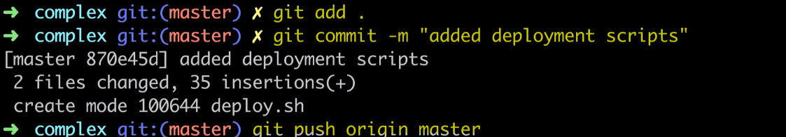

<br>

### Travis CI Build
* `Automatic Build`: Travis CI will automatically pick up the changes, **run** the **travis.yml** file, and eventually **run** the **deploy.sh** file.
* `Potential Issues`: Be aware that mistakes or typos can occur. 
  * If an error message appears, follow along with the next section for troubleshooting.

<br>

### Checking Travis CI
* `Open Travis CI`: Go to Travis CI and navigate to the new **multi-k8s project**.
* `Build Visibility`: If the build does not show up, it likely means there is a typo in the **travis.yml** file.

**Solution**: 
* Compare your travis.yml file with the [completed code](https://github.com/StephenGrider/DockerCasts/blob/master/complex/.travis.yml) in the [GitHub repository](https://github.com/StephenGrider/DockerCasts). 
* Ensure project-specific information like project ID, compute zone, cluster name, Docker ID, and OpenSSL command details are correct.

<br>

### Troubleshooting
* `Error Handling`: If an error occurs, follow the next section for troubleshooting steps.
* `QA Support`: If troubleshooting does not resolve the issue, seek help in the QA section for further assistance.

<br>

<hr style="height:4px;background:black">

<br>

## Verifying Deployment

### Successful Build and Deployment
* The build successfully ran, meaning images were built, pushed to Docker Hub, and commands were executed against kubectl on the production Kubernetes instance.

<br>

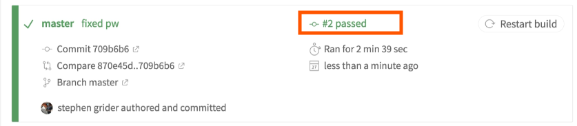

<br>

### Verifying Docker Hub
* `Check Repositories`: Open Docker Hub and check the **repositories**, such as multi-server.
* `Tags`: Verify that both the **latest tag** and the **new long tag** (Git SHA) were updated recently. 
  * This ensures a permanent **backup of the code** and an **up-to-date latest tag** for new engineers.

<br>

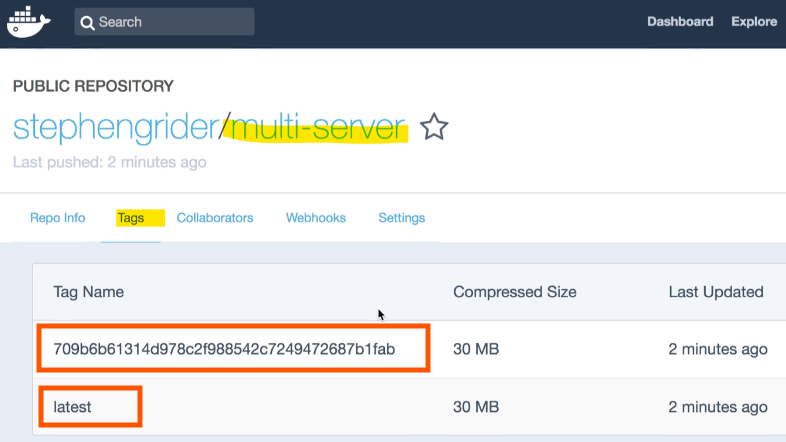

<br>

### Kubernetes Dashboard
* `Refresh Page`: Refresh the **Kubernetes dashboard** and check the **Workloads** tab.
* `Deployments`: Verify that deployments for client, PostgreSQL, Redis, server, and worker have been created.

<br>

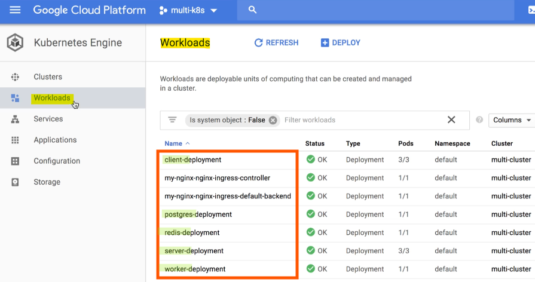

<br>

* `Pods`: Click into a deployment to see the managed pods and runtime information.

<br>

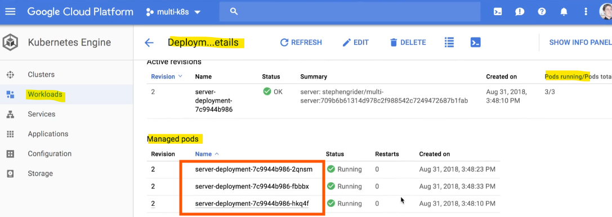

<br>

### Services
* `Services Tab`: Check the **Services** tab for **cluster IPs** and the **Ingress service**.

<br>

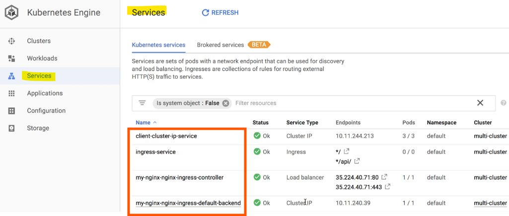

<br>

* `Endpoints`: Verify the **endpoints** (e.g., */ and */api) set up in the **Ingress service YAML file**.

<br>

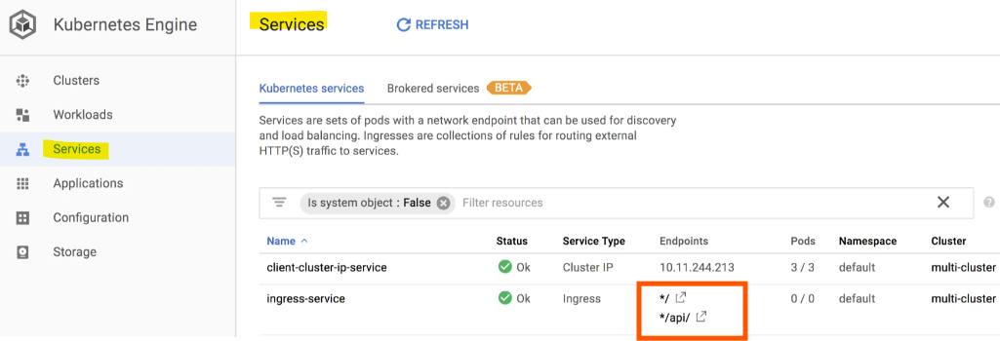

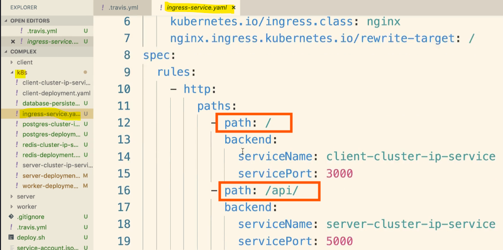

<br>

### Configuration and Storage
* `Configuration Tab`: Check for **config maps** and the **PG_password secret**.
* `Service Account`: Verify the **service account** created by Tiller for NGINX Ingress.

<br>

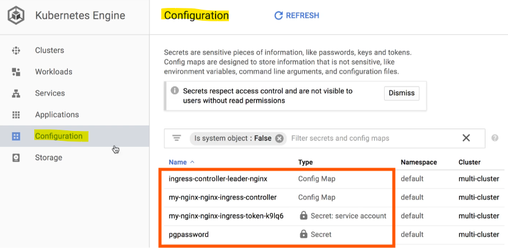

<br>

* `Storage Tab`: Check for the **persistent volume claim** created for PostgreSQL.

<br>

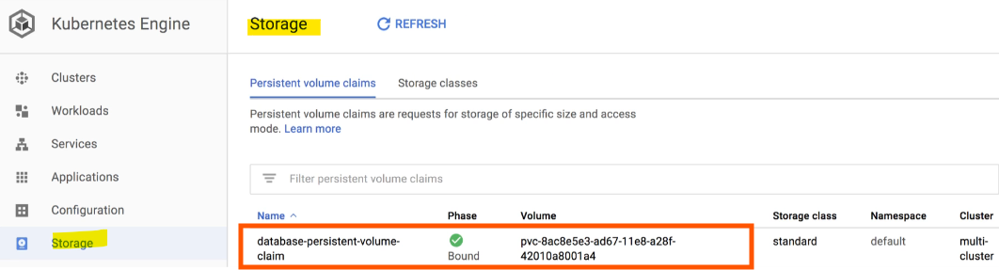

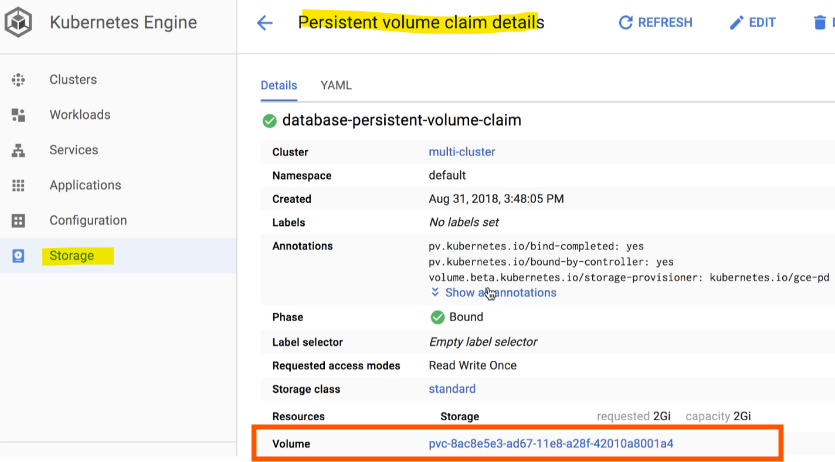

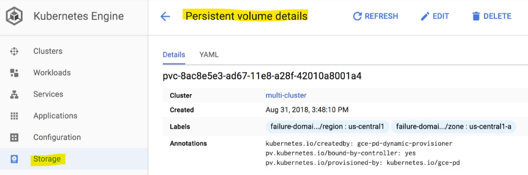

<br>

### Testing the Application
* `Access IP Address`: Go to the **IP address** provided by the **Load Balancer service**.
* `Privacy Error`: If a privacy error appears, proceed to the site (this is temporary and will be fixed).
* `Verify Application`: Ensure the **React project appears** on the screen and **test functionality** (e.g., entering a number and submitting it).

<br>

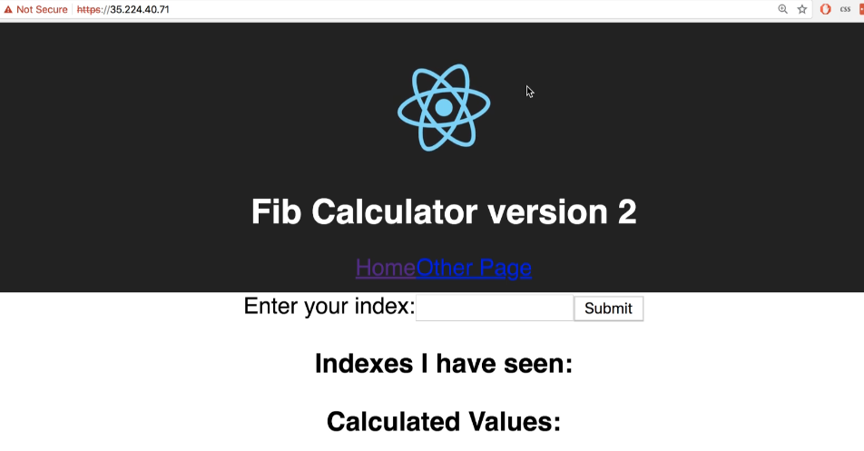

<br>

<hr style="height:4px;background:black">

<br>

## A Workflow for Changing in Prod
> **Objective**: Confirm that the React application is successfully deployed and visible on the screen.

<br>

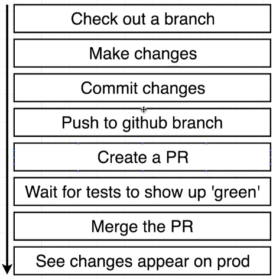

<br>

### Workflow for Making Updates
1. `Check Out a Git Branch`:
   * Command: `git checkout -b devel`
     * **Explanation**: Create and switch to a new branch named devel for making changes.

<br>

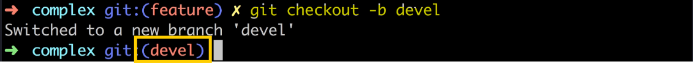

<br>

2. `Make Changes`:
   * File: Open **client/src/App.js**.
   * Change: Update the **h1** tag to say "version Kubernetes" to indicate a change.

<br>

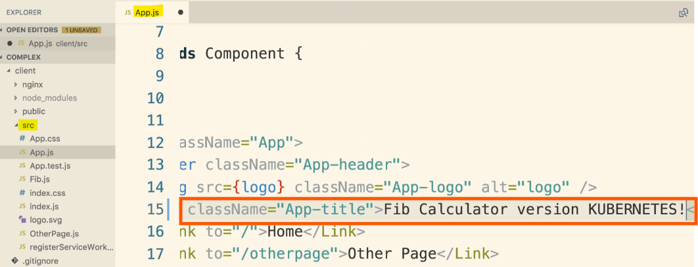

<br>

3. `Commit and Push Changes`:

**Commands**:

```sh
git status
git add .
git commit -m "Updated header to version Kubernetes"
git push origin devel
```

* **Explanation**: Commit the changes and push the devel branch to GitHub.

<br>

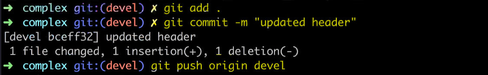

<br>

4. `Create a Pull Request` (PR):
   * GitHub: Open the project on **GitHub**.
   * Go to the **Pull Requests** tab and click on "New Pull Request".

<bR>

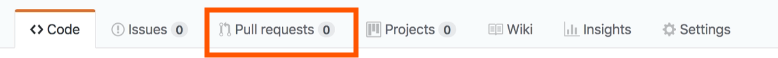


<br>

   * Select devel to **merge into master**.

<br>

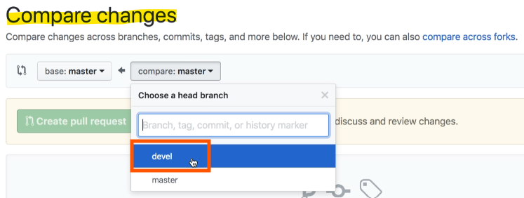

<br>

   * Create PR: Click "Create Pull Request" and **add a message** describing the changes.

<br>

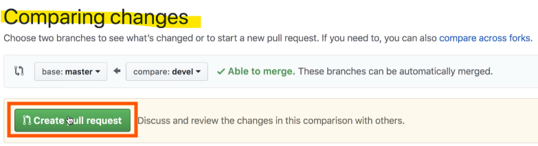

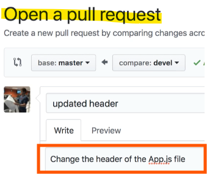

<br>

5. `Wait for Travis CI`:
   * Travis CI will run **tests** for the **branch** and the **pull request**.
   * Ensure tests **pass before merging** the PR.

<br>

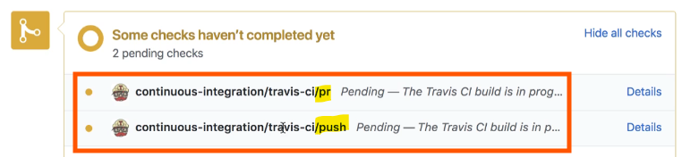


<br>

6. [`Merge PR`](#merging-a-pr-for-deployment):
   * Once tests pass, **merge the PR** into the **master branch**.
   * Travis CI will run again and **deploy the changes** to the Kubernetes **cluster**.

<br>

<hr style="height:4px;background:black">

<br>

## Merging a PR for Deployment

### Merging the Pull Request and Deploying Changes
1. `Successful Tests`: After a few minutes, both tests have successfully run.

<br>

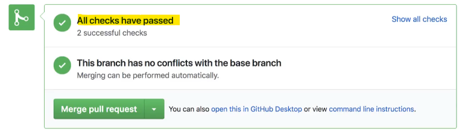

<br>

2. `Merge Pull Request`:
   * Click on the "Merge pull request" button and confirm the merge.

> **Optional**: You can delete the branch or leave it around, based on personal preference.

<br>

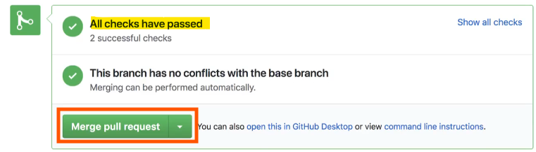

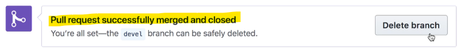

<br>

3. `Travis CI Deployment`:
   * After merging, wait for Travis CI to run tests again with the **newly changed master branch**.
   * Travis CI will **automatically deploy the changes** to the Kubernetes **cluster**. 
     * The old set of pods will be taken down, and the new version of the image will be deployed.

<br>

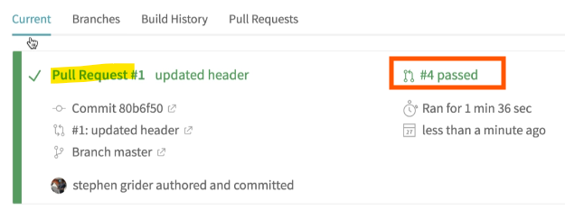

<br>

4. `Verify Changes`:
   * Get the **IP address** from the **Services** tab on the **Kubernetes dashboard**.
   * Go to the **IP address** and **refresh the page** to see the updated version (e.g., "version Kubernetes").
   * After the deployment, check the **React application** to see the new version with the changes.

<br>

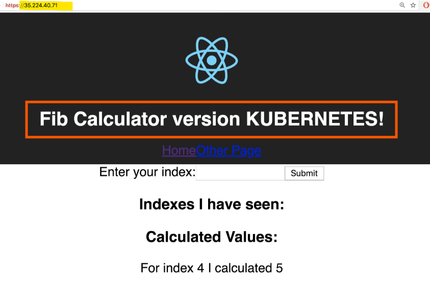

<br>

<hr style="height:4px;background:black">

<br>
