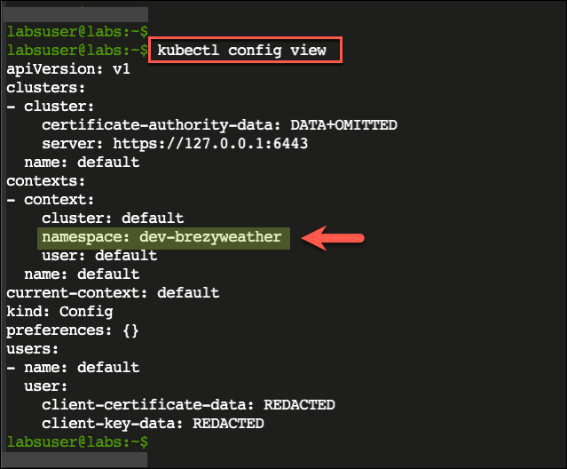

- [Implementing Health Probes to Monitor Container Health](#implementing-health-probes-to-monitor-container-health)
  - [Tasks](#tasks)
    - [1. Set Up Environment](#1-set-up-environment)
    - [2. Implement Liveness Probe Using the HTTP Request Method](#2-implement-liveness-probe-using-the-http-request-method)
    - [3. Implement Readiness Probe Using the HTTP Request Method](#3-implement-readiness-probe-using-the-http-request-method)
    - [4. Test the Deployment and Health Check Endpoints](#4-test-the-deployment-and-health-check-endpoints)

<br>

<hr style="height:4px;background:black">

<br>

# Implementing Health Probes to Monitor Container Health

> **Lab scenario**
> In this lab, you, as a Kubernetes application developer, are tasked with **ensuring** the **reliability** and **availability** of a **web application** running on Kubernetes. 
> 
> * The application sometimes experiences **downtime** due to issues with the containers. 
> * To handle this, you will use **health probes** and **checks** to **monitor the container's health** and **automatically detect** and **correct** any **failures**. 
> * Using **liveness** and **readiness probes**, you will **configure** the **Kubernetes cluster** to **run periodic health checks** on the **container**.

<br>

<hr style="height:4px;background:black">

<br>

## Tasks
1. [Set Up Environment](#1-set-up-environment).
2. [Implement Liveness Probe Using the HTTP Request Method](#2-implement-liveness-probe-using-the-http-request-method).
3. [Implement Readiness Probe Using the HTTP Request Method](#3-implement-readiness-probe-using-the-http-request-method).
4. [Test the Deployment and Health Check Endpoints](#4-test-the-deployment-and-health-check-endpoints).

<br>

<hr style="height:4px;background:black">

<br>

### 1. Set Up Environment
* To work with Kubernetes, having the right **environment** in place is essential. 
* A Kubernetes **cluster** has already been configured for a **single node** in this workspace. 
* Check the **installation** of the **Kubernetes cluster** by executing the appropriate command. 
* Create a **dev-brezyweather** namespace and set it as the **default namespace** to **group** the **Kubernetes objects** for this activity. 
* Then, **clone** the **GitHub repository** for the BrezyWeather app, which includes the Kubernetes **manifest files**. 
* The GitHub URL is available under the Resources section.

<br>

<hr style="height:4px;background:black">

<br>

1. `Ensure the Kubernetes cluster is working correctly`. 
   * The Kubernetes **control plane** is shown as **running**.

```kubectl
kubectl cluster-info
```


<br>

2. `Create a namespace dev-brezyweather to avoid naming collisions and represent the scope for objects`. 

```kubectl
kubectl create namespace dev-brezyweather
```


<br>

3. `Set the newly created namespace in the default context`. 
   * So then, all the **objects** created will be **assigned to this namespace**.

```kubectl
kubectl config set-context default --namespace dev-brezyweather
```

* Kubernetes context is used to set the default context for executing the commands. 

> **Note**: See the [Kubernetes Clusters and Contexts](https://kubernetes.io/docs/tasks/access-application-cluster/configure-access-multiple-clusters/#define-clusters-users-and-contexts) article to learn more.


<br>

4. `Verify the config change`. 
   * The dev-brezyweather namespace is set to the default context.

```kubectl
kubectl config view
```



<br>

5. `Clone the GitHub repository containing the deployment files`. 
   * The repository is cloned to your Cloud Shell environment.

> **Note**: This repo also contains the source code of the BrezyWeather app, which includes the health check API endpoints, for your reference.

```bash
git clone https://github.com/CodeWithPraveen/labs-k8s-healthprobes.git
```


<Br>

6. `Navigate to the deploy folder within the cloned repository and list its files`.
   * The Kubernetes manifest files are displayed.

```bash
cd labs-k8s-healthprobes/deploy
ls
```


<br>

<hr style="height:4px;background:black">

<br>

### 2. Implement Liveness Probe Using the HTTP Request Method
* You need to add a **liveness probe** to ensure the application functions correctly. 
* For deployment, please use the **brezyweather-deployment.yml** manifest available in the **deploy** folder. 
  * You should use the `HTTP GET request` method to verify the application's health. 
  * It is deemed successful if the HTTP request returns a **2XX status code**. 
  * Additionally, you can tweak the runtime behavior of the health check by setting an initial delay of 5 seconds and a probe interval of 10 seconds.

<br>

<hr style="height:4px;background:black">

<br>

1. `Open the deployment manifest file`. 
   * The file shows the **deployment instructions** for the BrezyWeather app.

```kubectl
vim brezyweather-deployment.yml
```

> **Note**: Please be careful about spacing when working with YAML files as incorrect indentation will lead to syntax errors.


<br>

<hr style="height:4px;background:black">

<br>

2. `Add the instructions to include a liveness probe that targets the /api/v1/health/live endpoint and the existing container port`.

```yaml
livenessProbe:
  httpGet:
    path: /api/v1/health/live
    port: app-port
```

* The liveness probe checks if the application is still considered healthy. 
  * See the [Define a Liveness Command](https://kubernetes.io/docs/tasks/configure-pod-container/configure-liveness-readiness-startup-probes/#define-a-liveness-command) article to learn more.
  


<br>

<hr style="height:4px;background:black">

<br>

3. `Add the initialDelaySeconds attribute to delay before the probe starts, and the periodSeconds attributes to configure the probe interval`.

```yaml
initialDelaySeconds: 5  # Delay before the probe starts
periodSeconds: 10  # Probe runs every 10 seconds
```


<br>

<hr style="height:4px;background:black">

<br>

4. `Save and exit the Vim`.
5. `Create the deployment`.

```kubectl
kubectl apply -f brezyweather-deployment.yml
```


<br>

<hr style="height:4px;background:black">

<br>

6. `Get the available pods`. 
   * The pod is in a **READY** state.

> **Note**: Depending on the gap between the execution of the previous and below command, the state may not be in the READY state. If so, execute the command again after a few seconds.

```kubectl
kubectl get pods
```


<br>

<hr style="height:4px;background:black">

<br>

7. `View the pod details`. 
   * The **liveness** health probe **details** are **present**. 
   * Notice the **default values** for **success** as **one** and **failure** as **three**.

> **Note**: The liveness probe information shows the HTTP endpoint without the hostname, which is as expected.

```kubectl
kubectl describe pod brezyweather
```


<br>

<hr style="height:4px;background:black">

<br>

8. `Review the events of the pod`. 
   * Since the default timeout is one second, the first couple of requests failed as the pod was still initializing.


<br>

<hr style="height:4px;background:black">

<br>

### 3. Implement Readiness Probe Using the HTTP Request Method
* To ensure the smooth operation of the application, add a **readiness probe** that **verifies** if the **application** is **ready to accept traffic**. 
* For this, you can use the same **brezyweather-deployment.yml** file for **deployment** and perform a similar `HTTP GET request` as the health verification method. 
* To fine-tune the health check runtime behavior, set an **initial delay** of **10 seconds** and **probe internal** of **20 seconds**. 
* Also, you can set the **failure threshold to 2** instead of the default 3 to avoid unnecessary downtime. 
* Finally, **increase** the **request timeout** from the default 1 second to **3 seconds** to ensure enough time for the application to respond.

<br>

<hr style="height:4px;background:black">

<br>

1. `Open the deployment manifest file`. 
   * The file shows the deployment instructions for the BrezyWeather app.

```kubectl
vim brezyweather-deployment.yml
```

2. `Add the instructions to include a readiness probe that targets the /api/v1/health/ready endpoint and the existing container port`.

```yaml
readinessProbe:
  httpGet:
    path: /api/v1/health/ready
    port: app-port
```

* A readiness probe checks if the application is **ready** to **accept traffic**. 
  * See the [Define Readiness Probes](https://kubernetes.io/docs/tasks/configure-pod-container/configure-liveness-readiness-startup-probes/#define-readiness-probes) article to learn more.


<br>

<hr style="height:4px;background:black">

<br>

3. `Add the initialDelaySeconds attribute to delay before the probe starts, and the periodSeconds attributes to configure the probe interval`.

```yaml
initialDelaySeconds: 10  # Delay before the probe starts
periodSeconds: 20  # Probe runs every 20 seconds
```


<br>

<hr style="height:4px;background:black">

<br>

4. `Add the failureThreshold attribute to check for two attempts before the probe is marked failure`. 
   * Also, set the maximum number of seconds for operation timeout as 3 seconds.

```yaml
          failureThreshold: 2  # Number of failures before probe marked as failed
          timeoutSeconds: 3  # Maximum seconds until operation times out
```

* Each verification method has several attributes that you can use to control the probe's behaviour. 
  * Refer to the [Configuring Probe Attributes](https://kubernetes.io/docs/tasks/configure-pod-container/configure-liveness-readiness-startup-probes/#configure-probes) article to learn more.


<br>

<hr style="height:4px;background:black">

<br>

5. `Save and exit the Vim`.
6. `Apply the deployment changes`. 

```kubectl
kubectl apply -f brezyweather-deployment.yml
```


<br>

<hr style="height:4px;background:black">

<br>

7. `Get the available pods`. 
   * The pod is not in the READY state yet.

```kubectl
kubectl get pods
```


<br>

<hr style="height:4px;background:black">

<br>

8. `Repeat the command every few seconds`. 
   * After about 20 seconds, the pod is in the READY state.


<br>

<hr style="height:4px;background:black">

<br>

9. `View the pod details`. 
    * The readiness health probe details are present.

```kubectl
kubectl describe pod brezyweather
```


<br>

<hr style="height:4px;background:black">

<br>

10. `Review the pod's events`. 
    * Since the default timeout is one second, the first couple of requests failed as the pod was still initialising.


<br>

<hr style="height:4px;background:black">

<br>

### 4. Test the Deployment and Health Check Endpoints
* To ensure the successful deployment of the application, it is essential to conduct **testing** on both the **deployment** and the **health check endpoints**. 
* To expose the deployment, **create a service** using the **brezyweather-service.yml** service manifest file in the **deploy** folder. 
* Additionally, verify that the **app's main feature**, fetching weather details through the `GET ../api/v1/weather` endpoint, is **functional**. 
* To further ensure the app's reliability, confirm that the **liveness** and **readiness HTTP endpoints** are **working** correctly.

<br>

<hr style="height:4px;background:black">

<br>

1. `Review the service manifest file`. 

```kubectl
cat brezyweather-service.yml
```


<br>

<hr style="height:4px;background:black">

<br>

2. `Create the service`. 

```kubectl
kubectl apply -f brezyweather-service.yml
```


<br>

<hr style="height:4px;background:black">

<br>

3. `Get the service details`. 
   * The brezyweather-service information is shown. 
   * Note the **External IP address** shown.

```kubectl
kubectl get service brezyweather
```


<br>

<hr style="height:4px;background:black">

<br>

4. `Verify the app's core feature to fetch the weather forecast details through the GET ../api/v1/weather API endpoint`. 
   * Replace xxx with the **IP address** you noted earlier. 
   * The default weather details are shown.

```bash
curl xxx:8080/api/v1/weather
```


<br>

<hr style="height:4px;background:black">

<br>

5. `Verify the HTTP endpoint of the liveness probe through the service`. 
   * Replace xxx with the **IP address** you noted earlier. 
   * The command returns **HTTP 200 OK**.

```kubectl
curl -v xxx:8080/api/v1/health/live
```

* You are using the HTTP request method to **define the probes** in this app. 
* Refer to the [Defining a Liveness HTTP Request](https://kubernetes.io/docs/tasks/configure-pod-container/configure-liveness-readiness-startup-probes/#define-a-liveness-http-request) article to learn more about this approach.


<br>

<hr style="height:4px;background:black">

<br>

6. `Verify the HTTP endpoint of the readiness probe through the service`. 
   * Replace xxx with the IP address you noted earlier. 
   * The command returns HTTP 200 OK.

```kubectl
curl -v xxx:8080/api/v1/health/ready
```


<br>

<hr style="height:4px;background:black">

<br>

