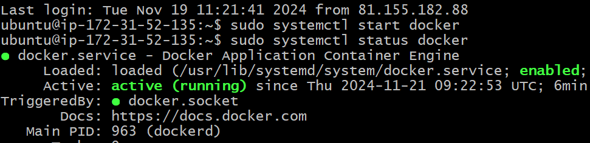
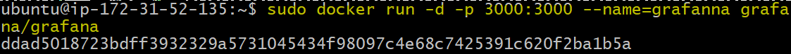
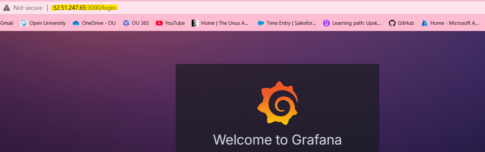
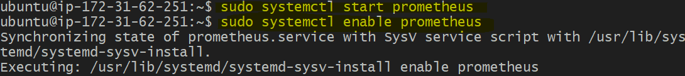
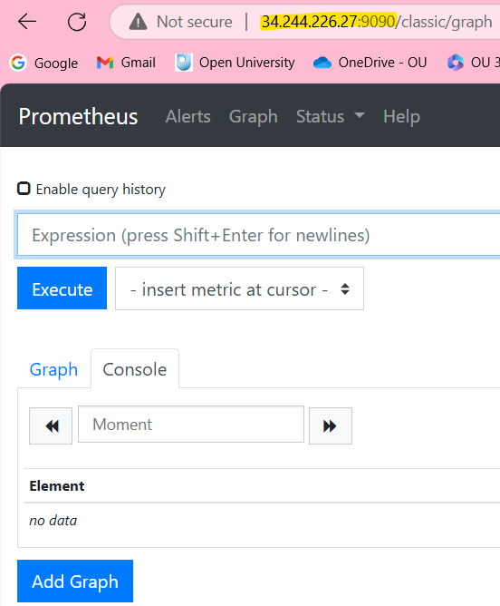
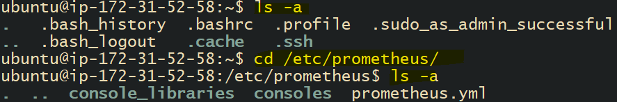
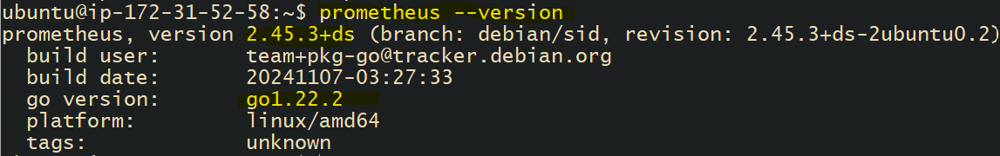

# How to turn your EC2 Instances back on
We now have three EC2 Instances:
* Grafana.
* Prometheus.
* RDS.

Start Docker Dashboard. 
Start EC2 Instances. 

## Starting Grafana Instance
* "Connect" the instance and SSH in to a Git Bash Terminal. 
* Start Docker Service: `sudo systemctl start docker`
* Check docker status: `sudo systemctl status docker`
  * Click "q" to exit screen.

* Run the Container: `sudo docker run -d -p 3000:3000 --name=grafana grafana/grafana`

 
* Navigate to your web browser. 
* Check Grafana is working by taking the public IP of the instance and adding `:3000` on the end.

* To log in, you can type "admin" twice and select **Skip** if prompted again. 

### The container name "grafana" is already in use
1. Stop the existing container: `sudo docker stop grafana`
2. Remove the existing container: `sudo docker rm grafana`
3. Run the new container: `sudo docker run -d -p 3000:3000 --name=grafana grafana/grafana`

 

## Starting Prometheus Instance
* "Connect" the instance and SSH in to a Git Bash Terminal. 
* Start Prometheus using: `sudo systemctl start prometheus`.
* Enable it using: `sudo systemctl enable prometheus`.

* Navigate to your web browser. 
* Check Prometheus is working by taking the public IP of the instance and adding `:9090` on the end.

 

## Starting RDS Instance
* "Connect" the instance and SSH in to a Git Bash Terminal. 
  * Make sure you organise your terminals as now we have three.
  * You can do this by **right clicking** on the terminal and select **Options**. 
* Once you have SSH into your instance, you can check that prometheus has been installed.
  * `cd /etc/prometheus/`
* This will help you navigate to Prometheus.

Alternatively, you can check the Prometheus version, you can use the following command:
* `prometheus --version`

 
