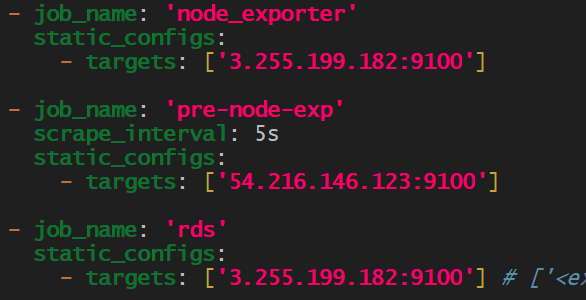
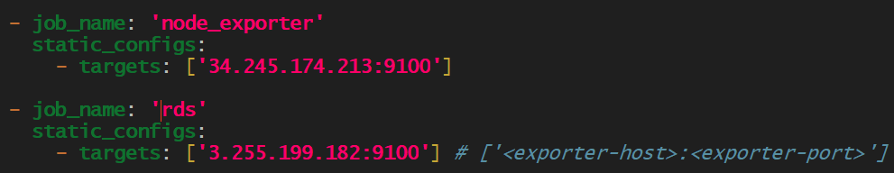
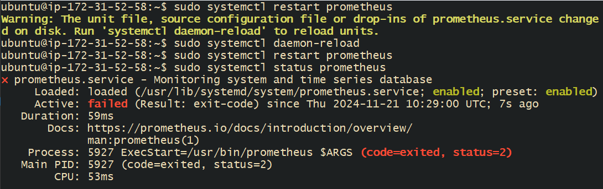
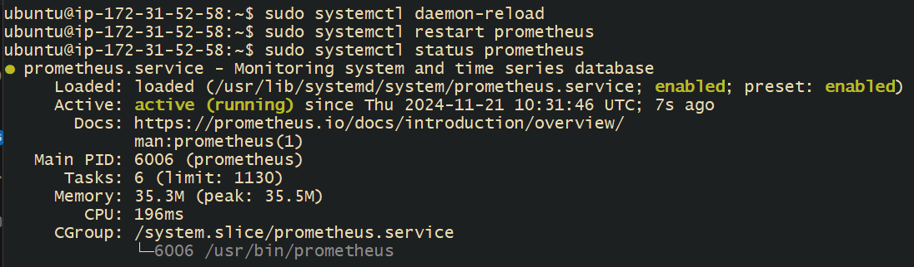
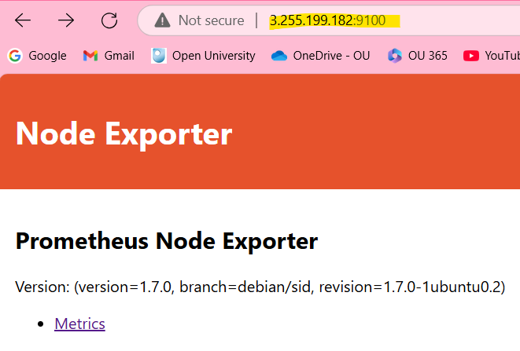
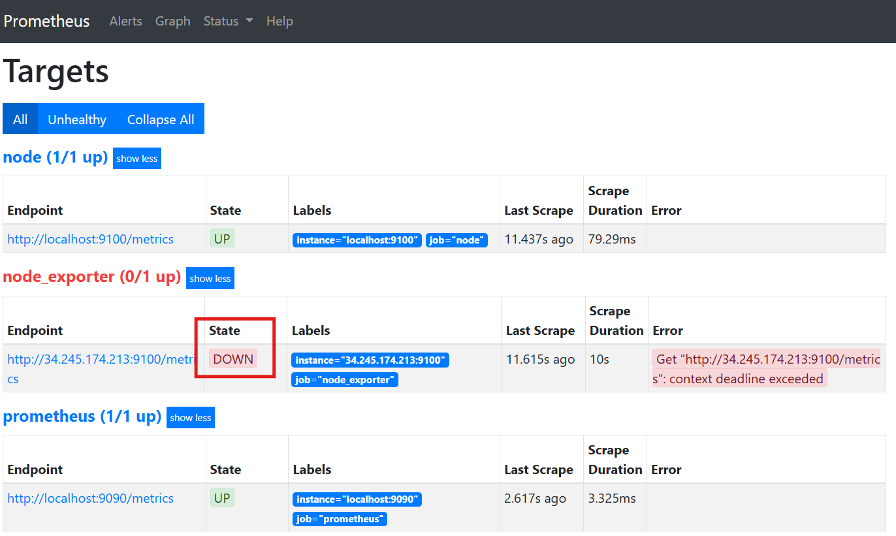
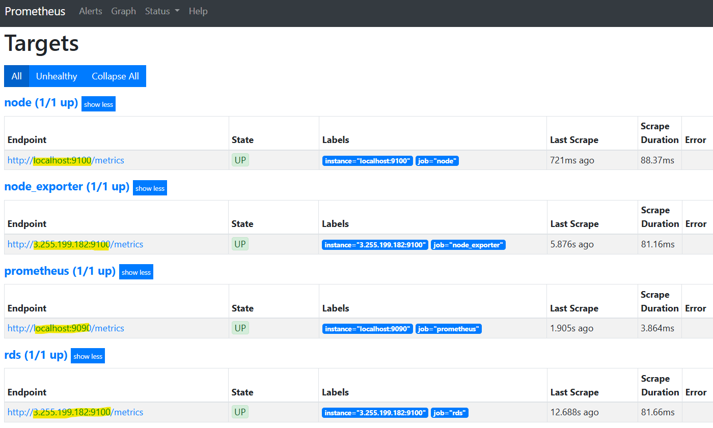

- [Grafana Advance Dashboarding Concept and Grafana Variables](#grafana-advance-dashboarding-concept-and-grafana-variables)
  - [What is RDS?](#what-is-rds)
  - [Key Features of Amazon RDS](#key-features-of-amazon-rds)
  - [Benefits of Using Amazon RDS](#benefits-of-using-amazon-rds)
  - [Creating an RDS EC2 Instance](#creating-an-rds-ec2-instance)
  - [Link RDS to Prometheus and Grafana](#link-rds-to-prometheus-and-grafana)
  - [Steps to Link RDS to Prometheus and Grafana](#steps-to-link-rds-to-prometheus-and-grafana)
    - [1. Set Up Prometheus](#1-set-up-prometheus)
    - [2. Configure Prometheus](#2-configure-prometheus)
    - [3. Use an Exporter - untested](#3-use-an-exporter---untested)
    - [4. Configure Prometheus Instance to Scrape Metrics](#4-configure-prometheus-instance-to-scrape-metrics)
    - [5. Check the Connection](#5-check-the-connection)
      - [How do I know it's worked?](#how-do-i-know-its-worked)
      - [What this means](#what-this-means)
      - [Next Steps](#next-steps)
  - [Benefits of Linking RDS to Grafana and Prometheus](#benefits-of-linking-rds-to-grafana-and-prometheus)

<br>

# Grafana Advance Dashboarding Concept and Grafana Variables

## What is RDS?
* Relational Database Service.
* It's a **managed database service** provided by Amazon Web Services (AWS). 
* It **simplifies** the process of **setting up**, **operating**, and **scaling** a relational database in the cloud.

## Key Features of Amazon RDS
`Managed Service`
* AWS handles routine database tasks such as backups, patching, and scaling.
* Reduces the administrative burden on users.

`Supports Multiple Database Engines`
* RDS supports several popular database engines, including MySQL, PostgreSQL, MariaDB, Oracle, and Microsoft SQL Server.
* Allows users to choose the database engine that best fits their needs.

`Scalability`
* Easily scale the compute and storage resources of your database with just a few clicks.
* Supports both vertical and horizontal scaling.

`High Availability and Durability`
* RDS provides automated backups, database snapshots, and multi-AZ (Availability Zone) deployments for high availability.
* Ensures data durability and minimises downtime.

`Security`
* Supports encryption at rest and in transit.
* Integrates with AWS Identity and Access Management (IAM) for access control.

`Cost-Effective`
* Pay-as-you-go pricing model.
* Offers reserved instances for long-term savings.

<br>

## Benefits of Using Amazon RDS
`Ease of Use`
* Simplifies database management tasks, allowing users to focus on application development.
* Provides a user-friendly interface through the AWS Management Console.

`Performance`
* Optimised for performance with features like read replicas and provisioned IOPS (Input/Output Operations Per Second).
* Ensures fast and reliable database performance.

`Flexibility`
* Supports a wide range of database engines and configurations.
* Allows users to choose the best options for their specific use cases.

`Reliability`
* Built-in high availability and failover support.
* Ensures that your database remains available and resilient to failures.

> By leveraging Amazon RDS, you can efficiently manage your relational databases in the cloud, benefiting from AWS's robust infrastructure and services.

<br>

## Creating an RDS EC2 Instance

1. Sign in to the AWS Management Console:
   * Open the Amazon EC2 console.

2. Launch an Instance:
   * Click on "Instances" in the left-hand menu.
   * Click on the "Launch Instance" button.

3. Choose an Amazon Machine Image (AMI):
   * Select an AMI that suits your needs (e.g., Amazon Linux 2, Ubuntu, etc.).
   * I've chosen Ubuntu. 

4. Choose an Instance Type:
   * Select the instance type based on your requirements.

5. Configure Instance:
   * Configure the instance details, ensuring it is in the same VPC as your RDS instance.

6. Add Storage:
   * Configure the storage settings as needed.

7. Configure Security Group:
   * Create a new security group.
   * Ensure the security group allows inbound traffic on the necessary ports (e.g., SSH for EC2, MySQL for RDS).
     * SSH for EC2:
       * Port: **22**
       * Purpose: Allows you to connect to your EC2 instance using SSH.
     * MySQL for RDS:
       * Port: **3306**
       * Purpose: Allows your EC2 instance to connect to your MySQL RDS instance.

8. Review and Launch:
   * Review your settings and click "Launch".
   * Select or create a key pair for SSH access and launch the instance.

<br> 

## Link RDS to Prometheus and Grafana
* Linking Amazon RDS to Grafana and Prometheus involves setting up a monitoring system that collects and visualises metrics from your RDS instance.
* Documentation: https://grafana.com/oss/prometheus/exporters/mysql-exporter/?tab=installation

## Steps to Link RDS to Prometheus and Grafana
### 1. Set Up [Prometheus](#create-an-ec2-instance-with-prometheus-installed)
   * If you already have a prometheus EC2 instance ready, you can overlook this step. 
   * Update and upgrade the EC2 instance.

```bash
sudo apt-get update

sudo DEBIAN_FRONTEND=noninteractive apt-get upgrade -y
```
   * **Install Prometheus** and **Node Exporter**: Install Prometheus on a server or use a managed service.
```bash
sudo apt-get install prometheus prometheus-node-exporter -y
```

### 2. Configure Prometheus
   * Add a configuration file to scrape metrics from your RDS instance.
   * `sudo nano /etc/prometheus/prometheus.yml`
     * Make sure your selected instances' port is open to **9100** within their Security Groups.
   * When configuring Prometheus to scrape metrics from your RDS instance, you only need to provide the **IP address** or DNS of the **RDS instance** because Prometheus is the tool responsible for collecting and storing the metrics.
     * Whilst the others are provided, it shouldn't effect the end result as their ports are not open to receive at **9100**.
   * `Ctrl+s`, `Ctrl+x`: to save and exit.

```yaml
- job_name: 'pre-node-exp'
  scrape_interval: 5s
  static_configs:
    - targets: [`54.216.146.123:9100`]  # rds public ip
    - targets: [`34.245.174.213:9100`]  # prometheus public ip
    - targets: [`54.72.77.92:9100`] # grafana public ip
```


### 3. Use an Exporter - untested
   * **MySQL Exporter** (if using MySQL RDS): If you're using MySQL RDS, you can use the MySQL Exporter to **collect metrics**.
     * Install the MySQL Exporter on a **host** or **container**.
     * Configure the exporter to **connect to your RDS instance** using the appropriate credentials.

```bash
wget https://github.com/prometheus/mysqld_exporter/releases/download/v1.1.2/mysqld_exporter-1.1.2.linux-amd64.tar.gz

tar xvfz mysqld_exporter-1.1.2.linux-amd64.tar.gz

sudo mv mysqld_exporter-1.1.2.linux-amd64/mysqld_exporter /usr/local/bin/
```

Create a MySQL user for monitoring.
```bash
CREATE USER 'exporter'@'%' IDENTIFIED BY 'your_password';
GRANT PROCESS, REPLICATION CLIENT, SELECT ON *.* TO 'exporter'@'%';
FLUSH PRIVILEGES;
```

Set up the MySQL exporter configuration.
* Create a .my.cnf file in the home directory of the user running the MySQL exporter.

```bash
[client]
user=exporter
password=your_password
```

* Start the MySQL exporter.

```bash
mysqld_exporter --config.my-cnf=/home/your_user/.my.cnf
```

<br>

Alternative: 
* **CloudWatch Exporter**: Alternatively, you can use the CloudWatch Exporter to collect metrics from AWS CloudWatch.
  * Configure the CloudWatch Exporter to query RDS metrics from CloudWatch.
  * Note: This method may incur **additional costs** due to CloudWatch API calls.

### 4. Configure Prometheus Instance to Scrape Metrics
   * Add the exporter **endpoint** to the **Prometheus configuration file** (prometheus.yml).
     * The exporter endpoint is the **URL** where the exporter exposes the metrics it collects.
     * This endpoint is typically in the format http://<exporter-host>:<exporter-port>/metrics.
       * RDS public IP: 3.255.199.182.
       * Exporter port: 9100.
   * Edit the config file: `sudo nano /etc/prometheus/prometheus.yml`.
   * Write in your new job at the bottom of the file. 
     * This configuration will ensure that Prometheus scrapes metrics from your RDS instance along with the other targets
   * `Ctrl+s`, `Ctrl+x`: to save and exit.

```yaml
scrape_configs:
  - job_name: 'rds'
    static_configs:
      - targets: [`3.255.199.182:9100] # ['<exporter-host>:<exporter-port>']
```



After making these changes, don't forget to restart Prometheus to apply the new configuration:
* `sudo systemctl restart prometheus`



* If you come into any **ERRORS**, this is most likely due to the formatting of the YAML file.
* You can check the format with: `promtool check config /etc/prometheus/prometheus.yml`
  * Once you've re-formatted the file and saved the changes, apply these two commands:
      * `sudo systemctl daemon-reload`
      * `sudo systemctl restart prometheus`



<br>

### 5. Check the Connection
* Navigate to your web browser. 
* Take the rds public IP and add `:9100` onto the end. 



#### How do I know it's worked?
* Check Prometheus Targets.
* Open your Prometheus web interface by navigating to http://<your-prometheus-server-ip>:9090/targets in your web browser.
  * `Prometheus:9090` > `Status` > `Targets`.


* Verify that your RDS instance appears in the list of **targets** and that its status is "UP".



#### What this means
* **node**: The node exporter on localhost:9100 is up and running.
* **node_exporter**: The node exporter on 34.245.174.213:9100 is **down**, likely due to a connectivity issue or the exporter not running.
* **prometheus**: Prometheus itself is up and running on localhost:9090.

#### Next Steps
1. Check the RDS Target
   * Ensure that your RDS instance is listed as a **target** in the Prometheus configuration file (prometheus.yml).
   * Verify that the RDS instance's security group allows inbound traffic on port **9100**.

2. Troubleshoot the Down Target
   * For the node_exporter target that is down, check if the node exporter is running on the specified instance.
   * Ensure that the instance's security group allows inbound traffic on port 9100.
   * Verify network connectivity between Prometheus and the target instance.

3. Verify Metrics Exposure
   * Open your web browser and navigate to http://<your-rds-instance-ip>:9100/metrics to ensure that the metrics are being exposed.

4. Check Prometheus Targets.
   * Open your Prometheus web interface by navigating to http://<your-prometheus-server-ip>:9090/targets in your web browser.
   * `Prometheus:9090` > `Status` > `Targets`.



* The image shows the "Targets" page from a Prometheus monitoring system. 
* This page lists the various targets that Prometheus is monitoring, along with their status and other relevant details.
* it shows the status of various monitored targets in a Prometheus system, indicating that all targets are currently up and providing metrics. 

> This information is crucial for system administrators to ensure that their monitoring setup is functioning correctly and that all necessary metrics are being collected.

<br>

## Benefits of Linking RDS to Grafana and Prometheus
`Real-Time Monitoring`
* Provides real-time insights into the performance and health of your RDS instance.
* Helps in identifying and resolving issues quickly.

`Customisable Dashboards`
* Grafana allows you to create highly customisable dashboards to suit your monitoring needs.
* Visualise metrics in various formats, such as graphs, tables, and alerts.

`Scalability`
* Prometheus and Grafana can scale to monitor multiple RDS instances and other infrastructure components.
* Supports horizontal scaling for large environments.

`Integration with Other Tools`
* Easily integrates with other monitoring and alerting tools.
* Supports a wide range of data sources and exporters.

> You can effectively monitor your Amazon RDS instance using Prometheus and Grafana, gaining valuable insights into its performance and health.

<br>
