- [Setting Up Grafana with Docker: A Step-by-Step Guide](#setting-up-grafana-with-docker-a-step-by-step-guide)
  - [Grafana Installation](#grafana-installation)
- [Grafana Documentation Link](#grafana-documentation-link)
- [Create EC2 Instance](#create-ec2-instance)
  - [Create new key pair](#create-new-key-pair)
  - [SSH in to Connect](#ssh-in-to-connect)
- [For an AWS EC2 Instance](#for-an-aws-ec2-instance)
  - [Step 1: Install Docker](#step-1-install-docker)
  - [Step 2: Pull the Grafana Docker Image](#step-2-pull-the-grafana-docker-image)
  - [Step 3: Run the Grafana Container](#step-3-run-the-grafana-container)
  - [Stop the Grafana container](#stop-the-grafana-container)
  - [Step 4: Access Grafana](#step-4-access-grafana)
  - [Step 5: Configure Security Group (if using AWS)](#step-5-configure-security-group-if-using-aws)
- [Go to Grafana Website](#go-to-grafana-website)
  - [Step 6: Change Default Password](#step-6-change-default-password)
  - [Step 7: Add Data Sources](#step-7-add-data-sources)
  - [Step 8: Create Dashboards](#step-8-create-dashboards)
- [Install Grafana on Windows](#install-grafana-on-windows)
  - [Go to Grafana Installation Page](#go-to-grafana-installation-page)
- [Adding a Data Source in Grafana](#adding-a-data-source-in-grafana)
  - [Enterprise Solutions and Integration](#enterprise-solutions-and-integration)
  - [Prometheus Integration](#prometheus-integration)
  - [Authentication and Security](#authentication-and-security)
  - [Configuring Data Sources in Grafana](#configuring-data-sources-in-grafana)
  - [Prometheus Installation and Configuration](#prometheus-installation-and-configuration)
- [Integration with Grafana](#integration-with-grafana)
  - [Exploring Data Sources in Grafana](#exploring-data-sources-in-grafana)
  - [Data Source Management in Grafana](#data-source-management-in-grafana)
  - [Scalable Infrastructure](#scalable-infrastructure)
  - [Grafana Version 9.0 Features](#grafana-version-90-features)
  - [Prometheus Configuration](#prometheus-configuration)
  - [Data Representation](#data-representation)
  - [Exploring Data in Grafana](#exploring-data-in-grafana)
  - [Visualisation Options](#visualisation-options)
  - [Data Integration and Retention](#data-integration-and-retention)
  - [Metrics and Data Sources](#metrics-and-data-sources)
- [Section 3: Grafana OSS Setup as a Service on AWS, User and Access Provisioning.](#section-3-grafana-oss-setup-as-a-service-on-aws-user-and-access-provisioning)
  - [Hardware Requirements for Grafana](#hardware-requirements-for-grafana)
  - [Grafana Database](#grafana-database)
  - [Implementation Steps](#implementation-steps)
- [Setting up EC2 Instance](#setting-up-ec2-instance)
- [Install Grafana as a Standalone Binary](#install-grafana-as-a-standalone-binary)
  - [Make sure Grafana binary is available](#make-sure-grafana-binary-is-available)
  - [Extract and Start Grafana](#extract-and-start-grafana)
  - [Check for Grafana Server Utility](#check-for-grafana-server-utility)
  - [Create a Service for Grafana](#create-a-service-for-grafana)
    - [Service File Content](#service-file-content)
      - [How to Navigate Controls Using 'vi' (vim)](#how-to-navigate-controls-using-vi-vim)
  - [Enable and Start Grafana Service](#enable-and-start-grafana-service)
  - [Access Grafana](#access-grafana)
  - [User Congifuration](#user-congifuration)
- [Notes](#notes)
  - [Grafana Setup and Configuration Basics](#grafana-setup-and-configuration-basics)
    - [What is Grafana?](#what-is-grafana)
    - [Installing Grafana](#installing-grafana)
    - [Key Considerations for Production Use](#key-considerations-for-production-use)
    - [Typical Use Cases in Performance Testing](#typical-use-cases-in-performance-testing)
- [Configuration Steps](#configuration-steps)
  - [Initial Setup](#initial-setup)
  - [Important Notes](#important-notes)
  - [Teams and Organisations](#teams-and-organisations)
  - [Practical Usage](#practical-usage)
- [Section 4: Workspace Setup, CloudWatch Integration, Workspace Handling, and Access Controls](#section-4-workspace-setup-cloudwatch-integration-workspace-handling-and-access-controls)
- [Grafana Workspace Setup](#grafana-workspace-setup)
  - [Steps to Set Up a Workspace](#steps-to-set-up-a-workspace)
    - [Install Grafana](#install-grafana)
    - [Log In](#log-in)
    - [Create Teams](#create-teams)
    - [User Roles](#user-roles)
    - [Organisations (Optional for Larger Projects)](#organisations-optional-for-larger-projects)
- [CloudWatch Integration](#cloudwatch-integration)
  - [Steps to Integrate CloudWatch](#steps-to-integrate-cloudwatch)
    - [Prepare AWS Credentials](#prepare-aws-credentials)
    - [Set Up the Data Source in Grafana:](#set-up-the-data-source-in-grafana)
    - [Create a Dashboard](#create-a-dashboard)
- [Workspace Handling](#workspace-handling)
  - [Key Tasks for Managing Workspaces:](#key-tasks-for-managing-workspaces)
    - [Dashboard Creation](#dashboard-creation)
    - [Folders](#folders)
    - [Alerts](#alerts)
    - [Team Collaboration](#team-collaboration)
- [Access Controls](#access-controls)
  - [Access Control Features:](#access-control-features)
    - [Roles](#roles)
    - [Permissions](#permissions)
    - [Invite Users](#invite-users)
    - [SMTP Configuration (Optional)](#smtp-configuration-optional)
- [Getting Started with Grafana SMTP Relay Configuration](#getting-started-with-grafana-smtp-relay-configuration)
  - [Common Email Providers](#common-email-providers)
    - [Gmail:](#gmail)
    - [Outlook/Office 365:](#outlookoffice-365)
    - [Yahoo Mail:](#yahoo-mail)
  - [Finding SMTP Server in Outlook](#finding-smtp-server-in-outlook)
    - [Open Outlook](#open-outlook)
    - [Finding SMTP Server in Other Email Clients](#finding-smtp-server-in-other-email-clients)
  - [Steps to Configure SMTP in Grafana](#steps-to-configure-smtp-in-grafana)
    - [Edit the grafana.ini File](#edit-the-grafanaini-file)
    - [Restart Grafana](#restart-grafana)
    - [Test SMTP Configuration:](#test-smtp-configuration)
    - [Use SMTP for Alerts and Invitations:](#use-smtp-for-alerts-and-invitations)
- [Getting Started with Dashboarding in Grafana](#getting-started-with-dashboarding-in-grafana)
  - [Key Features of Dashboards](#key-features-of-dashboards)
- [Node Exporter Setup for Infrastructure Monitoring through Prometheus and Grafana](#node-exporter-setup-for-infrastructure-monitoring-through-prometheus-and-grafana)

<br>

# Setting Up Grafana with Docker: A Step-by-Step Guide 

## Grafana Installation
* **AWS Free Tier Account**: Participants are encouraged to create an AWS free tier account for hands-on practice.
* **Dockerised Installation**: Demonstration of Dockerised Grafana installation using AWS EC2 instances.
* **Instance Setup**: Steps to launch an EC2 instance and set up Grafana.

# Grafana Documentation Link
Source: https://grafana.com/docs/grafana/latest/ 

# Create EC2 Instance
* Log into AWS.
* Change region: Ireland (eu-west-1).
* Click "Launch Instance".
* Name: georgia-grafana-test
* Image: Ubuntu Server 22.04 (free tier eligible).
* Size: t3.micro
* Security group: 
  * Name: georgia-grafana-test-allow-ssh-3000
  * Allow SSH and port 3000.

## Create new key pair
* Whilst creating your EC2 instance, you have the opportunity to "Create new key pair". Click this.
* Download it how you like and move it to your .ssh folder.

## SSH in to Connect
* Navigate to your .ssh folder.
* On AWS, click "Connect" on your EC2 instance. 
  * Copy this code into the .ssh folder to connect to the instance. 
* type 'yes' for fingerprint credentials. 


<br> 

# For an AWS EC2 Instance
* Sign into AWS. 
* "Connect" to your EC2 instance on Git Bash terminal.

## Step 1: Install Docker
1. Update Package List: `sudo apt-get update`
2. Install Docker: `sudo apt-get install docker.io`
   * Give it permision ('y').
3. Start Docker Service: `sudo systemctl start docker`
4. Check docker status: `sudo systemctl status docker`
   * Type "q" to exit. 
5. Enable Docker to Start at Boot: `sudo systemctl enable docker`


## Step 2: Pull the Grafana Docker Image
Pull the Latest Grafana Image:  `sudo docker pull grafana/grafana-enterprise:9.0.5`

## Step 3: Run the Grafana Container
Run the Container:`sudo docker run -d -p 3000:3000 --name=grafana grafana/grafana-enterprise:9.0.5`

* `docker run` is a Docker CLI command that runs a new container from an image
* `-d` (--detach) runs the container in the background
* `-p <host-port>:<container-port>` (--publish) publish a container’s port(s) to the host, allowing you to reach the container’s port via a host port. 
  * In this case, we can reach the container’s port 3000 via the host’s port `3000`.
* `--name` assign a logical name to the container (e.g. grafana). This allows you to refer to the container by name instead of by ID.
* `grafana/grafana-enterprise` is the image to run.

## Stop the Grafana container
To stop the Grafana container, run the following command:
```bash
# The `docker ps` command shows the processes running in Docker
docker ps

# This will display a list of containers that looks like the following:
CONTAINER ID   IMAGE  COMMAND   CREATED  STATUS   PORTS    NAMES
cd48d3994968   grafana/grafana-enterprise   "/run.sh"   8 seconds ago   Up 7 seconds   0.0.0.0:3000->3000/tcp   grafana

# To stop the grafana container run the command
# docker stop CONTAINER-ID or use
# docker stop NAME, which is `grafana` as previously defined
docker stop grafana
```

## Step 4: Access Grafana
1. Find the public IP of Your Instance:
   * If you're using a cloud service like AWS, find the public IP address of your instance.

2. Open Grafana in Your Browser:
   * Go to http://<public-ip>:3000
   * The default username and password are both **admin**.

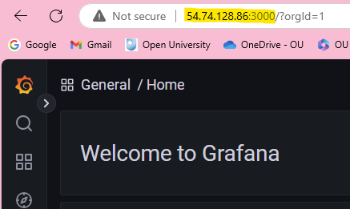

## Step 5: Configure Security Group (if using AWS)
Open Security Group Settings:
1. Go to the AWS Management Console.
2. Navigate to `EC2 > Instances > Select your instance > Security > Security Groups`.

**Edit Inbound Rules:**
1. Add a rule to allow traffic on port 3000.
   * Type: Custom TCP
   * Port Range: 3000
   * Source: Anywhere (0.0.0.0/0)

# Go to Grafana Website
## Step 6: Change Default Password
**Login to Grafana:**
* Use the default credentials (admin/admin).

**Change Password:**
* Follow the prompt to change the default password.

## Step 7: Add Data Sources
Navigate to Data Sources:
1. Click on the gear icon (⚙️) on the left sidebar.
2. Select "Data Sources".

Add a New Data Source:
1. Click "Add data source".
2. Select the type of data source you want to add (e.g., Prometheus, InfluxDB).
3. Configure the data source settings and save.

## Step 8: Create Dashboards
Create a New Dashboard:
1. Click on the "+" icon on the left sidebar.
2. Select "Dashboard" > "New Dashboard".

Add Panels:
1. Click "Add new panel".
2. Configure the panel settings and select the data source.
3. Save the dashboard.

<br> 

# Install Grafana on Windows

## Go to Grafana Installation Page
* Source: https://grafana.com/grafana/download?edition=oss
* Version: latest (11.3.0).
* Edition: OSS (this is the free version).
* Click on the "Windows" icon.
* Below this, click the download link for "Windows Installer".
* Follow the natural requirements. 

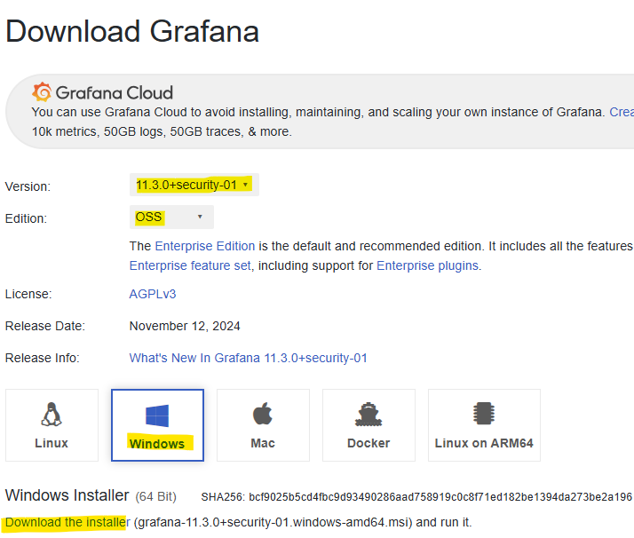

<br> 

# Adding a Data Source in Grafana
* Navigate to the **configuration** tab to add a data source.
  * This is located at the bottom left of Grafana. 
* **Choose Data Source**: Select the appropriate data source (e.g., Prometheus, InfluxDB, AWS CloudWatch).

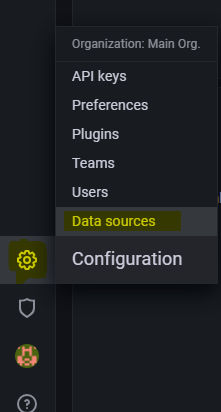

## Enterprise Solutions and Integration
* Solutions like Splunk require an enterprise license for integration with Grafana.
* **Open Source Limitations**: Open source Grafana may not support direct integration with enterprise solutions without a license.

## Prometheus Integration
* Enter the Prometheus **endpoint** in the **data source configuration**.

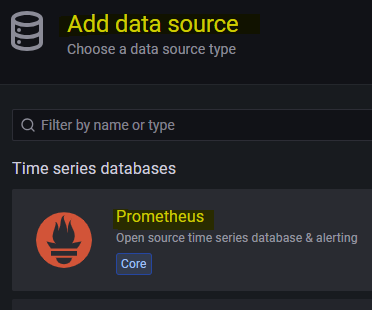

* **Security Settings**: Configure security settings such as TLS and authentication if required.
* **Latency Considerations**: Adjust settings for latency if there is a significant distance between Prometheus and Grafana setups.

## Authentication and Security
* **Basic Auth**: Use basic authentication with a username and password if the Prometheus endpoint is secured.
* **TLS Certificates**: Provide TLS certificates if the endpoint uses TLS encryption.
* **Skip Verification**: Option to skip verification if third-party authenticators like Okta are used.

## Configuring Data Sources in Grafana
* **Security Configuration**: If the data source is secured (e.g., Okta or SailPoint), you will be prompted to configure it during the save and test process.
* **Data Integrity**: Prometheus details are typically accessible only to specific teams for data integrity purposes.
* **Save and Test**: After configuring the data source, use the "Save and Test" button to verify if the data source is working. 
  * If successful, the configuration is saved; otherwise, it is not.

## Prometheus Installation and Configuration
* Prometheus needs to be **installed** and **configured**. 
  * It can be containerised or implemented as a service.

<br>

# Integration with Grafana

## Exploring Data Sources in Grafana
* Grafana provides an "Explore" option to **test data** sources **without** creating a **dashboard**. 
  * This allows users to write queries and choose data sources directly.
* **Creating Dashboards**: Dashboards can be created and imported using JSON templates. 
  * Grafana also provides basic templates for convenience.

## Data Source Management in Grafana
* **Multiple Data Sources**: When multiple data sources are added, they may appear multiple times due to latency or repeated clicks.
* **Default Data Source**: Setting a default data source ensures that it appears first for users from specific teams.

## Scalable Infrastructure
* In a **production environment**, multiple Grafana instances may be set up across different subnets or VPCs.
* Grafana can **integrate** with **various data sources**, including Prometheus, InfluxDB, and AWS CloudWatch.

## Grafana Version 9.0 Features
* The Query Builder **reduces** the **need for extensive query writing** by providing out-of-the-box capabilities. 
  * It is currently in beta phase.
* Grafana allows users to **select and visualise metrics** from data sources like Prometheus.

## Prometheus Configuration
* Prometheus **collects metrics** from **defined targets**, such as the localhost where Prometheus is configured.
* Metrics can be **searched** and **configured** using job **names**, which are defined during setup.

## Data Representation
* Grafana provides user-friendly **visual representations of data**, including **console output** and **graphs**.
* Users can **write queries** in Grafana to **retrieve and visualise** specific **metrics**.

## Exploring Data in Grafana
* Use the **explore option** in Grafana to **troubleshoot** and **play around with metrics without saving** them as a dashboard.
* Create a new dashboard and **add panels to visualise data**. 
  * The default data source will be picked up during dashboard creation.

## Visualisation Options
* Grafana offers various visualisation options, including **bar charts** and **time series**. 
* Suggestions are provided to help choose the right visualisation for the data.
* Save dashboards with appropriate nomenclature and in the correct location. 

## Data Integration and Retention
* **Prometheus Integration**: Prometheus data can be integrated into Grafana for visualisation. 
* Exporters can be configured to collect data from multiple servers.
* Customise the **retention policy** in Prometheus to **manage data storage**. 
  * Capacity planning is done based on data flow observations.

## Metrics and Data Sources
* **Understanding Metrics**: Metrics from Prometheus, such as go_memstats_bucket_hash_sys_bytes, can be visualised in Grafana. 
  * Users should be familiar with their data sources and metrics.
* **Additional Data Sources**: Grafana supports other data sources like Jaeger for tracing and Elasticsearch for logs. 
  * For example, Loki: a native solution for logging.

<br>

# Section 3: Grafana OSS Setup as a Service on AWS, User and Access Provisioning. 

## Hardware Requirements for Grafana
* The CPU should handle both **user management** and **data processing**. 
  * The number of users, dashboards, and alerts can impact CPU requirements.
* **Minimum Hardware Requirements**: Grafana requires a minimum of **512 MB RAM** and one CPU or VCPU.

## Grafana Database
* **Native Database**: Grafana uses **SQLite** by default to store configurations, user data, data sources, alerts, dashboards, and team/workspace information.
* **Supported Databases**: Grafana also supports MySQL, PostgreSQL, and other relational databases. 

## Implementation Steps
* **Using Grafana Binaries**: Utilise Grafana binaries for installation. 
  * For this training course, Grafana version 9.3.15 is used.
* **Version Selection**: Organisations often use the N-1 stable version to avoid immediate bugs. 
  * The latest version is 10.4, but 9.3.15 is chosen for stability.

<br>

# Setting up EC2 Instance
1. Navigate to AWS and "Launch Instance":
   * Go to the AWS Management **Console** and click on "Launch instance".

2. Instance Details:
   * **Name**: Enter georgia-grafana-test-2 as the instance name.
   * **Image**: Select the Amazon Linux 2023 AMI (Amazon Machine Image).
   * **Size**: Choose the t2.micro instance type (eligible for the free tier).
   * **Key Pair**: Select or create a key pair named georgia-grafana-aws for SSH access.
   * **Security Group**: Create a security group named georgia-grafana-test-allow-ssh-3000 with the following rules:
     * Allow **SSH** access on port 22.
     * Allow **HTTP** access on port 3000.

3. Launch the Instance:
   * Click "Launch instance" to start your EC2 instance.

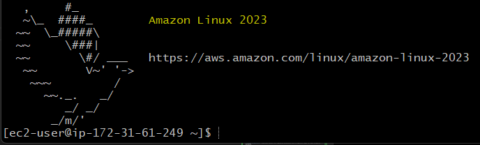

<br> 

# Install Grafana as a Standalone Binary
Source: https://grafana.com/grafana/download

* Version: 9.3.15
* Edition: Enterprise.

<br>

## Make sure Grafana binary is available
* SSH into instance: 'georgia-grafana-aws-test-2'
* Switch to root user: `sudo su -`
* Create a directory for Grafana: `mkdir /opt/grafana`
* Navigate to the directory: `cd /opy/frafana`
* Download the Grafana binary:

```bash
`wget https://dl.grafana.com/enterprise/release/grafana-enterprise-9.3.15.linux-amd64.tar.gz`
```

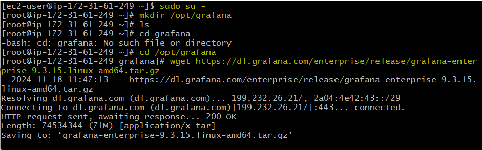

## Extract and Start Grafana

* Now we have Grafana binary available. 
* Extract the downloaded binary:
  * `tar -xvzf grafana-enterprise-9.3.15.linux-amd64.tar.gz`
* List the contents to verify: `ls -al`

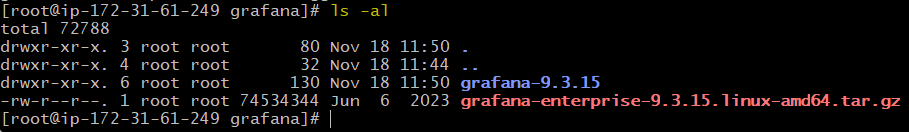

## Check for Grafana Server Utility

* Check if it has a Grafana Server utility:
  * Navigate to the Grafana directory: `cd grafana-9.3.15/`
  * List the contents: `ls`

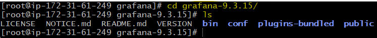

* Navigate to the bin directory: `cd bin`
* ist the contents to ensure the server utility is present: `ls`

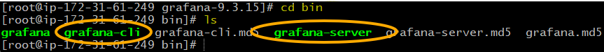

## Create a Service for Grafana
* Open the systemd directory: `cd /etc/systemd/system`
* Create and edit the service file: `vi grafana-server.service`

### Service File Content
Add the following content to the service file:

```bash
[Unit]
Description=Grafana
Documentation=http://docs.grafana.org
Wants=network-online.target
After=netwrok-online.target

[Service]
User=root
type=simple
WorkingDirectory=/opt/grafana/grafana-9.3.15
ExecStart=/opt/grafana/grafana-9.3.15/bin/grafana-server web

[Install]
WantedBy=multi-user.target
```

#### How to Navigate Controls Using 'vi' (vim)
* Enter Insert Mode: `i` to make changes. 
* Exit Insert Mode: Press `Esc`.
* Save and Exit: Type `:wq` and press `Enter`.

<br> 

## Enable and Start Grafana Service
* Reload Systemd Daemon: `systemctl daemon-reload`
* Enable Grafana Service: `systemctl enable grafana-server.service`
* Start the service: `systemctl start grafana-server.service`
* Check status: `systemctl status grafana-server.service`

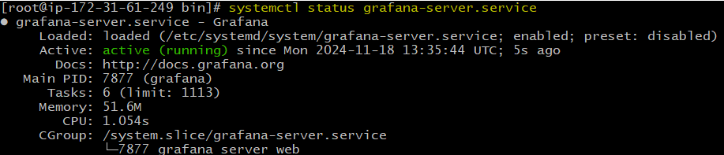

Enable Sigv4 authentication through built in AWS-SDK in Grafana
* `systemctl daemon-reload`
* `AWS_SDK_LOAD_CONFIG=true`
* `GF_AUTH_SIGV4_AUTH_ENABLED=true`

> Use this if you are coming into an error. 

## Access Grafana
You should now be able to access Grafana.
* Take the public IP from your instance.
  * "georgia-grafana-aws-test-2" in my case.
* And add `:3000` onto the end in a web browser.
* To login: admin, admin. 
  * Then choose a password if you'd like or click "skip".

## User Congifuration
* In the bottom left corner of Grafana, click on "Configuration" > "Teams".
* This is where you can add users/ group multiple users. 

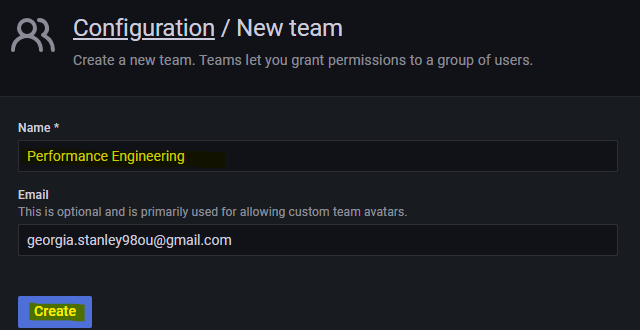

* Where you are logged in as "admin", you will have elevated permissions.

<br>

# Notes

## Grafana Setup and Configuration Basics
### What is Grafana?
* Grafana is a **visualisation tool** that **displays metrics** and **logs**.
* It can be installed on both Linux and Windows platforms.

### Installing Grafana
* **Agents** need to be installed on systems **where metrics are to be collected**.
* Once set up, the metrics can be viewed in Grafana.

### Key Considerations for Production Use
* Ensure adherence to implementation guidelines.
* Specific configurations are necessary for a production-grade setup.

### Typical Use Cases in Performance Testing
* Windows systems are primarily used for monitoring in performance testing.
* Linux systems (e.g., CentOS) are preferred for load generation due to their lightweight nature and performance efficiency.

<br>

# Configuration Steps
## Initial Setup
`Start Grafana`
* Verify Grafana is running by ensuring port 3000 is accessible.
* Check security group configurations if it does not start.

`User Configuration`
* Default user: admin (has server admin permissions).
* Additional users may have limited permissions unless explicitly elevated.
* User permissions are role-based and configurable (e.g., Admin, Editor, Viewer).

`SMTP Configuration`
* SMTP is required for sending emails (e.g., notifications or invitations).
* Edit the grafana.ini file to include SMTP server details.
  * Example use case: Email notifications for alerts.

## Important Notes
* Grafana's features like multi-tenancy and user management require proper backend configurations.
* SMTP setup ensures email-based alerts work.
* Always verify permissions to ensure secure and proper access.

## Teams and Organisations
`Teams`
* Used to group multiple users for collaborative dashboards and alerts.
  * Example: A "Performance Engineering" team can have all relevant testers.

`Organisations`
* Separate Grafana workspaces for different teams or divisions.
  * Example: A company like HCL can have one organisation for BPO and another for Software Development.
* Managed via Server Admin Permissions.

## Practical Usage
`Grafana on Windows`
* Simpler installation process compared to Linux.
* Ideal for monitoring in Windows-based environments.

`Integrations`
* Tools like Kibana or CloudWatch can be integrated for enhanced functionality.
* CloudWatch integration will be covered in the next session.

<br> 

# Section 4: Workspace Setup, CloudWatch Integration, Workspace Handling, and Access Controls

# Grafana Workspace Setup
A workspace in Grafana refers to the setup and configuration environment where users, teams, and dashboards are managed.

## Steps to Set Up a Workspace
### Install Grafana
* Download and install Grafana on your preferred operating system (Windows/Linux). Follow the installation instructions on Grafana’s official website.
* Default port: `3000`. 
  * Ensure it’s open in the firewall/security group.

### Log In
* Open Grafana in a browser (http://<IP>:3000).
* Default credentials:
  * Username: admin
  * Password: admin (you will be prompted to change it).

### Create Teams
* Go to `Configuration` → `Teams`.
* Click "New Team".
  * Example: Create a team called Performance Engineering for grouping relevant users.

### User Roles
* Roles control access levels:
  * **Admin**: Full control over the workspace.
  * **Editor**: Can edit dashboards but not administrative settings.
  * **Viewer**: Read-only access.
* To add users, go to Configuration → Users → Invite Users.

### Organisations (Optional for Larger Projects)
* Organisations allow **separate environments** for different teams/projects.
* Go to `Configuration` → `Server Admin` → `Organisations` to create one.
  * Example: Create an organisation for "DevOps" and another for "Data Science."

<br>

# CloudWatch Integration
CloudWatch is Amazon's monitoring service that tracks AWS resources. Grafana integrates with CloudWatch to visualise this data.

## Steps to Integrate CloudWatch
### Prepare AWS Credentials
1. Create an IAM User:
   * Go to the **AWS Management Console**.
   * Navigate to the **IAM** (Identity and Access Management) **service**.
   * Click on "Users" and then "Add user".
   * Enter a **username** (e.g., grafana-cloudwatch-user).
   * Select "Programmatic access" to generate an access key and secret key.
   * Click "Next: Permissions".

1. Attach Policies:
   * Attach the CloudWatchReadOnlyAccess policy to the user.
   * Click "Next: Tags" (optional) and then "Next: Review".
   * Click "Create user" and note the Access Key and Secret Key for this user.

### Set Up the Data Source in Grafana:
* Log in to Grafana.
* Go to `Configuration` → `Data Sources` → `Add Data Source`.
* Select **CloudWatch** from the list.
* Enter the following details:
  * **Access Key**: Your AWS IAM Access Key.
  * **Secret Key**: Your AWS IAM Secret Key.
  * **Region**: The AWS region of your CloudWatch data.
* Save and test the configuration.

### Create a Dashboard
* Go to `Dashboards` → `New Dashboard` → `Add a Query`.
* Choose **CloudWatch** as the data source.
* Select **metrics** like CPU Utilisation or Disk I/O to visualise.

<br>

# Workspace Handling
Grafana workspaces are used to manage dashboards, alerts, and user access effectively.

## Key Tasks for Managing Workspaces:
### Dashboard Creation
* Go to `Dashboards` → `New Dashboard`.
* Use the **Add a Panel** option to visualise metrics from your data source.

### Folders
* Group **dashboards into folders** for better organisation.
* Go to `Dashboards` → `Manage` and **create** folders.

### Alerts
* Alerts notify users when metrics meet specific thresholds.
* Configure alerts in panels:
  * Example: Set an alert for CPU usage > 80%.

### Team Collaboration
* Use Teams to assign dashboards to specific groups.
  * Example: Allow only the "DevOps Team" to access infrastructure-related dashboards.

<br>

# Access Controls
Grafana provides robust access controls to ensure data security and proper collaboration.

## Access Control Features:
### Roles
* Assigned per user or team:
  * **Admin**: Full access.
  * **Editor**: Can edit but not manage.
  * **Viewer**: Can view dashboards only.

### Permissions
* Permissions can be applied at:
  * **Folder Level**: Restrict access to a set of dashboards.
  * **Dashboard Level**: Limit access to specific dashboards.
* Go to `Dashboards` → `Permissions` to configure.

### Invite Users
* Go to `Configuration` → `Users` → `Invite Users`.
* Enter their email address and assign roles.

### SMTP Configuration (Optional)
* Required for sending email invitations or alerts.
* Edit the grafana.ini file:
  * Enable SMTP in the [smtp] section.
  * Add your SMTP server details, e.g., Gmail SMTP.

<br>

# Getting Started with Grafana SMTP Relay Configuration
SMTP (Simple Mail Transfer Protocol) in Grafana is used for **sending email alerts**, **invitations**, and **notifications**.
* Finding your SMTP server details depends on the email service provider you are using.

## Common Email Providers
### Gmail:
* SMTP Server: smtp.gmail.com
* Port: 587 (TLS) or 465 (SSL)

### Outlook/Office 365:
* SMTP Server: smtp.office365.com
* Port: 587 (TLS)

### Yahoo Mail:
* SMTP Server: smtp.mail.yahoo.com
* Port: 587 (TLS) or 465 (SSL)

## Finding SMTP Server in Outlook
### Open Outlook
* Open the Outlook application on your computer.

Go to Account Settings:
* Click on the File tab.
* Select Account Settings and then Account Settings again from the dropdown.

Select Your Email Account:
* Choose the email account you want to find the SMTP server for and click Change.

Server Settings:
* Look for the Outgoing mail server (SMTP) field. This will display your SMTP server address2.

### Finding SMTP Server in Other Email Clients
Log in to Your Email Account:
* Open your email client or webmail interface.

Navigate to Settings:
* Look for settings, preferences, or account settings.

Outgoing Mail Server (SMTP) Settings:
* Find the section for outgoing mail server (SMTP) settings. This will list your SMTP server address4.

## Steps to Configure SMTP in Grafana

### Edit the grafana.ini File
* If you are running Grafana in a Docker container, you can find the grafana.ini file by accessing the container:
  * `sudo docker exec -it grafana /bin/bash`
  * Then navigate to: `/etc/grafana/grafana.ini`
* Navigate to the [smtp] section and update the details:

```ini
[smtp]
enabled = true
host = smtp.gmail.com:587
user = your-email@gmail.com
password = your-email-password
from_address = your-email@gmail.com
from_name = Grafana
```

### Restart Grafana
Save the changes and restart Grafana:
```bash
sudo systemctl restart grafana-server
```

### Test SMTP Configuration:
* Log in to Grafana.
* Go to `Alerting` → `Notification Channels` → `Add Notification Channel`.
* Select **Email** as the type and enter an email address to test.
* Click "Send Test". 
  * If configured correctly, you will receive an email.

### Use SMTP for Alerts and Invitations:
* **For Alerts**:
  * Set up alert rules in Grafana and configure notifications to use email.
* **For User Invitations**:
  * Add new users under `Configuration` → `Users` → `Invite Users`.

<br> 

# Getting Started with Dashboarding in Grafana
1. Log In to Grafana:
   * Open your browser and navigate to Grafana’s interface (http://<IP>:3000).
   * Log in using your credentials (default: admin/admin).

1. Create a New Dashboard:
   * Go to `Dashboards` → `New Dashboard`.
   * Choose how to start:
     * Add a new **panel**: Start with an empty visualisation.
     * **Import Dashboard**: Use pre-built dashboards (JSON files) from Grafana Dashboards.

2. Add Panels:
   * Panels display data visually, such as graphs, tables, or gauges.
   * Click "Add a Panel".
   * Configure the following:
     * **Query**: Choose a data source (e.g., Prometheus) and specify the metric to visualise.
     * **Visualisation**: Select the panel type (Graph, Gauge, Table, etc.).
     * **Panel Title and Options**: Customise the panel title, legend, and thresholds.
   * Save the panel.

3. Customise the Layout:
   * Drag and resise panels to organise your dashboard.

4. Save the Dashboard:
   * Click "Save Dashboard" and give it a meaningful name.

<br>

## Key Features of Dashboards
* **Folders**: Organise dashboards into folders for easier management.
* **Variables**:
  * Dynamic values that can be used in queries. 
    * Example: A variable for a server name can switch the view to monitor a different server without creating a new dashboard.
  * Create variables under `Settings` → `Variables`.
* **Annotations**: Add notes on graphs to mark important events (e.g., system updates or incidents).
* **Alerts**:
  * Configure alerts to notify when thresholds are crossed.
  * Alerts can be sent to email, Slack, or other notification channels.

<br>

# Node Exporter Setup for Infrastructure Monitoring through Prometheus and Grafana


