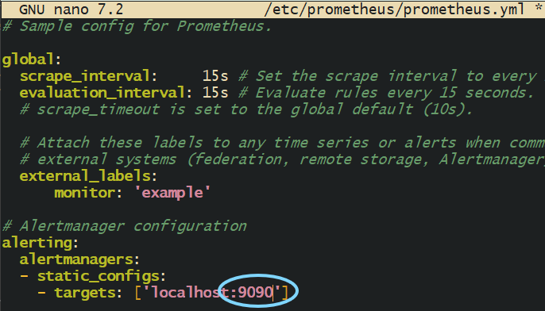
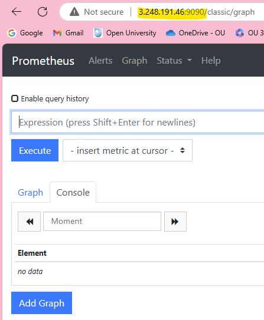
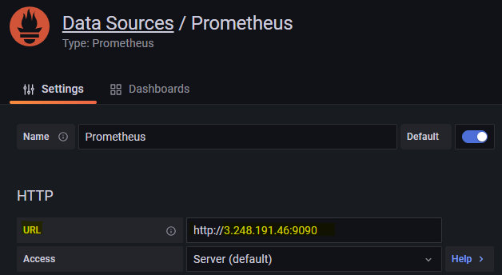

- [Prometheus Setup as a Service](#prometheus-setup-as-a-service)
  - [Create an EC2 Instance with Prometheus Installed](#create-an-ec2-instance-with-prometheus-installed)
  - [Install Prometheus and Prometheus Node Exporter and Configure the YAML file](#install-prometheus-and-prometheus-node-exporter-and-configure-the-yaml-file)
  - [Start, enable and access the Prometheus UI](#start-enable-and-access-the-prometheus-ui)
  - [Install Docker](#install-docker)
    - [Pull the Grafana Docker Image](#pull-the-grafana-docker-image)
    - [Run the Grafana Container](#run-the-grafana-container)
  - [Adding a data source](#adding-a-data-source)
  - [Prometheus Setup as a Service](#prometheus-setup-as-a-service-1)
    - [Steps to Set Up Prometheus as a Service](#steps-to-set-up-prometheus-as-a-service)

<br>

# Prometheus Setup as a Service

## Create an EC2 Instance with Prometheus Installed
* Set up an EC2 instance using Ubuntu. 
* Ensure the security group allows: 
  * `SSH` 
  * `HTTP`
  * `9090` (Prometheus uses this port).

Update and Upgrade: 
* `sudo apt-get update` 
* `sudo DEBIAN_FRONTEND=noninteractive apt-get upgrade -y`.

<br> 

## Install Prometheus and Prometheus Node Exporter and Configure the YAML file
1. Insert the following command: `sudo apt-get install prometheus prometheus-node-exporter -y`.
2. Edit the Prometheus config file: `sudo nano /etc/prometheus/prometheus.yml`
3. Add or modify the scrape targets IF necessary:
 
```yaml
scrape_configs:
  - job_name: 'prometheus'
    static_configs:
      - targets: ['localhost:9090']
```



<br>

## Start, enable and access the Prometheus UI
1. Start Prometheus using: `sudo systemctl start prometheus`.
2. Enable it using: `sudo systemctl enable prometheus`.
3. Access it using your EC2's public IP with a port of `9090`.



<br>

## Install Docker
1. Update Package List: `sudo apt-get update`
2. Install Docker: `sudo apt-get install docker.io`
   * Give it permision ('y').
3. Start Docker Service: `sudo systemctl start docker`
4. Check docker status: `sudo systemctl status docker`
   * Type "q" to exit. 
5. Enable Docker to Start at Boot: `sudo systemctl enable docker`


### Pull the Grafana Docker Image
Pull the Latest Grafana Image:  `sudo docker pull grafana/grafana-enterprise:9.0.5`

### Run the Grafana Container
Run the Container:`sudo docker run -d -p 3000:3000 --name=grafana grafana/grafana-enterprise:9.0.5`

<br>

## Adding a data source
* Navigate to url using public IP of EC2 instance: http://3.248.191.46:3000/

1. Select `Configurations` > `Data sources`.
2. Select `Add data source`.
3. Select `Prometheus`. You may need to search for it.
4. Once selected, name it whatever you like and then edit the connection to use the Public IP of your EC2 instance with Prometheus installed on it:
   * e.g., URL: http://3.248.191.46:9090/
5. Select `Save & test`. It should prompt you to begin building a dashboard. If you select `Data sources` again, you'll now see `Prometheus` there. 



<br>

## Prometheus Setup as a Service
Prometheus is a **time-series database** for **monitoring** and **alerting**. Setting it up as a service ensures it **starts automatically** and runs reliably.

### Steps to Set Up Prometheus as a Service
1. Download and Install Prometheus
   * Go to the Prometheus [downloads page](https://prometheus.io/download/).
   * Download the appropriate package for your OS (Linux/Windows).
   * Extract the files to a directory (e.g., /etc/prometheus).
   * SSH into your EC2 instance, here I am using "georgia-prometheus-test".
   * `cd /etc/prometheus/`

2. Create a Configuration File:
   * Create a prometheus.yml file in the Prometheus directory.
   * Define your scrape configurations:

```yaml
global:
  scrape_interval: 15s
scrape_configs:
  - job_name: 'node_exporter'
    static_configs:
      - targets: ['localhost:9100']
```
* Replace localhost: 9100 with the target system's IP and port.
  * For example: `http://3.248.191.46:9090/`.

3. Run Prometheus:
   * Start Prometheus using:

```bash
./prometheus --config.file=prometheus.yml
```

4. Set Up as a Service (Linux):
   * Create a systemd service file at /etc/systemd/system/prometheus.service:

```ini
[Unit]
Description=Prometheus
After=network.target

[Service]
User=prometheus
ExecStart=/path/to/prometheus --config.file=/path/to/prometheus.yml
Restart=always

[Install]
WantedBy=multi-user.target
Reload systemd and enable Prometheus:
bash
Copy code
sudo systemctl daemon-reload
sudo systemctl enable prometheus
sudo systemctl start prometheus
```

5. Access Prometheus:
   * Open a browser and navigate to http://<IP>:9090.

6. Monitor Targets:
   * Go to the `Status` → `Targets` page in Prometheus to verify that all endpoints are being scraped.

<br>
