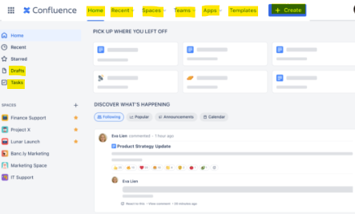

- [Overview](#overview)
  - [Course Goals](#course-goals)
  - [Topics Covered](#topics-covered)
- [Versions of Confluence](#versions-of-confluence)
  - [Licenses and Versions](#licenses-and-versions)
    - [Three Key Licenses](#three-key-licenses)
  - [Confluence Server and Data Center](#confluence-server-and-data-center)
  - [Confluence Cloud](#confluence-cloud)
  - [Version Relevance](#version-relevance)
  - [Atlassian Marketplace](#atlassian-marketplace)
  - [Practical Considerations](#practical-considerations)
- [What is Confluence?](#what-is-confluence)
- [Understanding the Differences between Confluence and JIRA](#understanding-the-differences-between-confluence-and-jira)
  - [Separate Licenses](#separate-licenses)
  - [Confluence](#confluence)
  - [JIRA](#jira)
  - [Integration](#integration)
  - [Confluence vs JIRA](#confluence-vs-jira)
- [Confluence Terms](#confluence-terms)
  - [Pages](#pages)
  - [Macros](#macros)
  - [Spaces](#spaces)
  - [Permissions and Organisation](#permissions-and-organisation)
- [Getting Familiar with Confluence’s Interface](#getting-familiar-with-confluences-interface)
  - [Home Page](#home-page)
  - [Navigation](#navigation)
  - [App Switcher](#app-switcher)
  - [Confluence Logo](#confluence-logo)
  - [Keyboard Shortcuts](#keyboard-shortcuts)
  - [Recent Drop Down](#recent-drop-down)
  - [Interface Changes](#interface-changes)
  - [Spaces](#spaces-1)
  - [People](#people)
  - [Apps](#apps)
  - [Templates](#templates)
  - [Create](#create)
  - [Search](#search)
  - [Notifications](#notifications)
  - [Help](#help)
  - [Settings](#settings)
  - [Profile and Personal Account Settings](#profile-and-personal-account-settings)
  - [Returning to Home Page](#returning-to-home-page)
- [Quiz](#quiz)

# Overview
## Course Goals
* Master key features of Confluence to enhance productivity.

## Topics Covered
* Terms and concepts in Confluence.
* Personal Spaces.
* Team Spaces.
* Understanding and managing 'spaces'.
* Confluence’s administrative back end.

 

# Versions of Confluence

## Licenses and Versions
* License Impact: The license type affects how quickly Confluence is updated.

### Three Key Licenses
* **Confluence Cloud**: SaaS version, automatically updated, hosted and maintained by Atlassian.
* **Confluence Server**: Installed and maintained on local servers. end of life process ongoing!!!
* **Confluence Data Center**: Installed and maintained on local servers, with more advanced features than Server.

## Confluence Server and Data Center
* **Installation**: Both are installed and managed on the organisation's servers.
* **Differences**: Data Center has more advanced features and will continue to receive updates, while Server is being phased out.
* **End of Life**: Confluence Server will be supported until 2024, after which it will no longer receive updates.

## Confluence Cloud
* **SaaS Model**: Hosted by Atlassian, with automatic updates.
* **Benefits**: No need for local installation or maintenance, always up-to-date.
* **Version Consistency**: Users always have the latest version, reducing concerns about version differences.

## Version Relevance
* **Automatic Updates**: Confluence Cloud users always have the latest version.
* **Server and Data Center**: May have slight differences if not recently updated.
* **Interface Changes**: Differences in interface and features may occur due to version updates.

## Atlassian Marketplace
* **Third-Party Apps**: Extend Confluence capabilities with apps from the marketplace.
* **Course Focus**: This course uses only the default Confluence setup without additional apps or plugins.

## Practical Considerations
* **Pros and Cons**: Each license type has its own advantages and disadvantages, such as maintenance responsibilities and update frequencies.
* **Organisational Fit**: Choose the license type that best fits your organisation's needs and infrastructure capabilities.

 

# What is Confluence?
* A wiki application designed for collaborative editing using a web browser.
* Users do not need to install any special software to use Confluence.
* Confluence allows users to edit content collaboratively using only a web browser.

> Imagine Confluence as a big digital notebook where `everyone in your team can write, share, and organise information`. 

Here’s a simple breakdown:

`Spaces`
* Think of spaces as different sections in your notebook. 
* Each space can be dedicated to a specific project, team, or topic. 
  * For example, you might have a space for your marketing team and another for your product development team.

`Pages`
* Within each space, you create pages. 
* Pages are like individual notes or documents where you can write down ideas, plans, meeting notes, or anything else. 
* You can format these pages with text, images, tables, and more.

`Collaboration`
* Confluence makes it easy for everyone to work together. 
* Multiple people can edit a page at the same time, leave comments, and tag each other to get attention. 
* It’s like having a shared notebook where everyone can contribute and see updates in real-time.

`Templates`
* To make things easier, Confluence provides templates for common tasks. 
  * For example, there are templates for meeting notes, project plans, and product requirements. 
* These templates help you get started quickly without having to create everything from scratch.

`Search and Organisation`
* Confluence has powerful search features to help you find information quickly. 
* You can also organise pages into a hierarchy, making it easy to navigate through your content.

`Integration`
* Confluence works well with other tools you might be using, like Jira for project management or Slack for communication. 
* This integration helps streamline your workflow and keeps everything connected.

> Confluence is a tool that helps your team stay organised, share knowledge, and collaborate effectively, all in one place.

 

# Understanding the Differences between Confluence and JIRA

## Separate Licenses
* **Independent Licenses**: Confluence and JIRA have separate licenses. You can have one without the other.

## Confluence
* **Digital Brain**: Acts as a digital brain for your organisation, storing processes, workflows, documents, and data.
* **Information Storage**: Not designed for file storage like Google Drive or Dropbox, but for storing information in documents and images.
* **Use Case**: Stores standards, processes, naming conventions, and brand assets.

## JIRA
* **Project Tracking**: Used for tracking projects in progress, including issues, bugs, and features.
* **Status Tracking**: Tracks the current status of different project elements, such as front-end UI and back-end development.
* **Use Case**: Tracks version releases, bug fixes, and new features.

## Integration
* **Complementary Tools**: Confluence and JIRA can work well together or independently.
  * Example: Use JIRA to track app development and Confluence to store standards and write change logs.
* **Public Interaction**: Public users can submit bugs in JIRA, while Confluence can host knowledge base documentation.

 

## Confluence vs JIRA

| Feature                | Confluence                                                                 | JIRA                                                                 |
|------------------------|----------------------------------------------------------------------------|----------------------------------------------------------------------|
| Purpose                | Digital brain for storing processes, workflows, documents, and data        | Tracking projects in progress, including issues, bugs, and features  |
| Main Functionality     | Collaborative editing and information storage                              | Project and issue tracking                                           |
| Use Case Example       | Storing standards, processes, naming conventions, and brand assets         | Tracking app development status, bug fixes, and new features         |
| Integration            | Can work independently or with JIRA for enhanced productivity              | Can work independently or with Confluence for enhanced productivity  |
| Public Interaction     | Hosting knowledge base documentation                                       | Allowing public users to submit bugs                                 |
| License                | Separate license from JIRA                                                 | Separate license from Confluence                                     |

 

# Confluence Terms

## Pages
* Pages are where all **content** in Confluence **lives**, including text, images, tables, attachments, and macros.
* They are the primary **container for content**.

## Macros
* Macros are **tools** within Confluence that **pull in dynamic content**.

Examples:
* **Table of Contents Macro**: Automatically links to headers on a page for easy navigation.
* **JIRA Integration**: Display JIRA issues directly on Confluence pages, with automatic updates.

## Spaces
* Spaces are the **areas** in Confluence **where pages live**.
  * **Comparison**: Similar to projects in JIRA, where issues live inside projects.
* **Control permissions**, **organise pages**, and **manage content** within spaces.

## Permissions and Organisation
* **Permissions**: Control who can see and edit pages within a space.
* **Organisation**: Manage how pages are structured and accessed within a space.

  

# Getting Familiar with Confluence’s Interface

## Home Page
* Default Landing: When you log into Confluence, you are taken to the Home page.
* Content: Displays recent spaces, recent pages, Confluence Announcements, and a feed of recent updates from your organisation.
* Updates: Shows updates made by anyone in your organisation for all accessible spaces, not just your own activity.

## Navigation
* Top Navigation: Most navigation is done from the top of the interface.

> In 2020, Atlassian moved navigation from the left side to the top. If you still see left-side navigation, you are using an older version.

## App Switcher
* Allows you to **switch between Atlassian products** you have access to, such as JIRA and Confluence.
* Having a license for Confluence does not automatically grant access to JIRA.
* Adding Products: Only **Confluence administrators** can add new Atlassian products, which may incur additional costs.

## Confluence Logo
* The logo can be **customised to your company’s logo**.
* Clicking the logo takes you back to the Home page.

## Keyboard Shortcuts
* **Home Page**: Shortcut `g + d` takes you to the Home page.
* **Recent Drop Down**: Shortcut `g + r` opens the Recent drop down, showing recent pages and work.

## Recent Drop Down
* Shows recent pages visited and recent work, similar to the Home page content.
* Provides a fast way to access recent activity using keyboard shortcuts.

## Interface Changes
* Interface layout may differ based on the version of Confluence you are using.
* Users with a Cloud subscription will have the latest updates automatically applied.

## Spaces
* Found next to the recently worked on section.
* Access all your spaces. Recently worked on spaces will appear here.
* Provides a faster way to access recently worked on spaces, enhancing productivity.

## People
* **Search** for people or **add** new people to your Confluence installation.
* Adding people **adjusts the Confluence Cloud bill** based on user access.
* Only **Confluence Administrators can add users directly**. Non-administrators send a notification to the administrator for approval.

## Apps
* Add functionality to Confluence through add-ons from the Atlassian Marketplace.

## Templates
* Create pages with **pre-built layouts** for different teams (e.g., dev team, marketing team).
* Ensures continuity and efficiency in documentation.

## Create
* Create a new page.
* Keyboard Shortcut: `c`.

## Search
* Search across Confluence.
* Keyboard Shortcut: `s`.
* Search results do not include pages or spaces you do not have access to.

## Notifications
* Alerts for comments on watched pages or when tagged.
* Quick access to notifications and related content.

## Help
* Provides access to Atlassian’s documentation for Confluence.
* Highly recommended to use Atlassian’s documentation if you get stuck.

## Settings
* Access overall Confluence administration settings.
* If you don't see this option, you likely don't have the necessary permissions.
* The administrative back end will be covered later in the course.

## Profile and Personal Account Settings
* Change profile picture, password, and other personal settings.

## Returning to Home Page
* Click the Confluence logo, the Home link, or use the keyboard shortcut `g + d`.

 

# Quiz

1. What technology does Confluence use?
   Wiki

2. Which would be a better reason to use Confluence over Jira?
   * Documentation as it acts as a 'digital brain'.

3. What does Confluence call entities that pull in dynamic content?
   * Macros.

 
