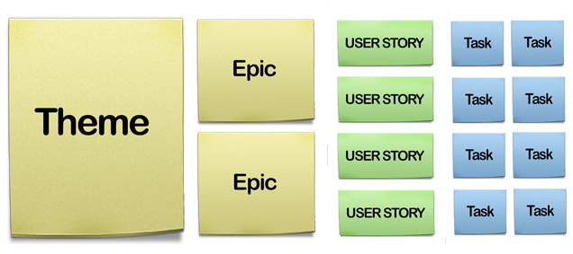
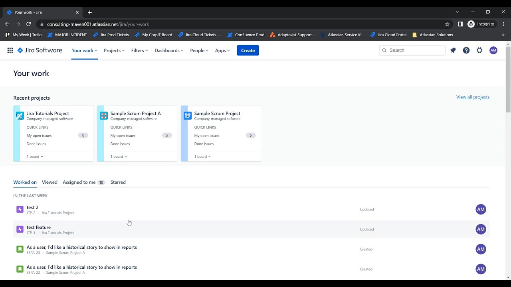

- [Jira](#jira)
  - [Versions of Jira](#versions-of-jira)
  - [JIRA Software Overview for the Course](#jira-software-overview-for-the-course)
- [What is JIRA?](#what-is-jira)
- [Basics of Agile Methodology](#basics-of-agile-methodology)
  - [Sprints and Kanban](#sprints-and-kanban)
- [Key Agile Terms you'll Find in JIRA](#key-agile-terms-youll-find-in-jira)
  - [User Stories](#user-stories)
  - [Epics](#epics)
    - [Recap](#recap)
  - [Clarifying JIRA Terminology](#clarifying-jira-terminology)
- [JIRA Terms you Need to Know](#jira-terms-you-need-to-know)
  - [Issues](#issues)
  - [Projects](#projects)
    - [Recap](#recap-1)
- [JIRAs Interface](#jiras-interface)
  - [Key Areas of the Interface](#key-areas-of-the-interface)

Link for Jira free: https://www.atlassian.com/software/jira/features

# Jira
## Versions of Jira
* **Jira Software**
  * Flagship version of JIRA.
  * Issue tracking and agile project management tool for software developers.
  * Commonly referred to as JIRA.

* **Jira Align**
  * Corporate-focused version.
  * Designed for enterprise scale.
  * Handles financial allocations, different process frameworks, and custom processes.

* **Jira Work Management**
  * General office project management.
  * Features lists and calendars.
  * Targets non-development teams like marketing and HR.

* **Jira Service Management**
  * Formerly known as JIRA Service Desk.
  * Help-desk scenario for customer service.
  * Includes FAQs, knowledge base, service request tickets, and asset tracking.

 

## JIRA Software Overview for the Course

1. **JIRA Software:**
   - Standard version used in the course.
   - Commonly referred to as JIRA.
   - Not using JIRA Software Premium (no advanced roadmaps, unlimited storage, IP allow listing).

2. **Licensing Options:**
   - **JIRA Server:**
     - Installed on your own server.
     - Allows for extensive customisation.
     - Requires maintenance and updates by your team.
   - **JIRA Cloud:**
     - Subscription-based.
     - Managed and updated by Atlassian.
     - Used in this course.

3. **Core Concepts:**
   - Core concepts are the same across all versions.
   - Different features may be available depending on the version and updates.

4. **Plugins and Apps:**
   - Many plugins and apps available to extend functionality.
   - Not using third-party apps in this course.
   - Only using core functionality of JIRA Software on Cloud.

 

# What is JIRA? 
* JIRA is a **project management** and **issue-tracking tool**.
  * The name JIRA comes from Gojira, the Japanese name for Godzilla.
* Companies use various **methodologies to organise projects**, such as Waterfall, Six Sigma, and Agile.
  * This determines the tool they use to organise this. 
* JIRA assumes teams use the **Agile methodology by default**.
  * JIRA can be customised with apps and plugins to support other methodologies.

 

# Basics of Agile Methodology
* Agile is a **methodology** used by **software development** teams to **get work done**.
* Promotes **adaptive planning**, **evolutionary development**, **early delivery**, **continuous improvement**, and **rapid response to change**.
* JIRA is an Agile tool, but other tools and methods (like whiteboards) can also be used.
  * Agile boards in JIRA have columns (or lanes) representing steps in a project: To Do, In Progress, and Done.
  * Two primary Agile workflows: Scrum and Kanban.

## Sprints and Kanban

**Sprint**
* A **predetermined time frame** (e.g., two weeks) for completing specific work.
* Sprint meetings **discuss the previous sprint**, **identify roadblocks**, and **plan** the next sprint's work.
* Teams prioritise tasks and aim to complete them within the sprint.
* Continuous improvement and iterative feedback are key components.
* Scrum uses these pre-determined sprints.

**Kanban**
* An ongoing workflow **without fixed time** frames.
* New **issues and tickets** can be **added at any time**.
* Focuses on **continuous progress** and **completion of tasks**.

 

# Key Agile Terms you'll Find in JIRA
## User Stories
* A formula: `"As a [type of user], I want [goal], so that [reason]."`
* Example: "As a web developer, I want to add users to JIRA, so that my coworkers can report bugs."
* Used to break up work without mentioning technology.

## Epics
* Large, overarching stories that can be broken down into smaller User Stories.
* Used for projects that take longer than a single sprint.
* Example: Core functionality for a note-taking app, broken down into smaller stories for each sprint.

### Recap
* Stories in JIRA refer to User Stories.
* Epics in JIRA contain multiple User Stories or other issue types.

## Clarifying JIRA Terminology

**User Stories and Epics**
* Used by various teams (e.g., marketing, graphics) to manage projects in sprints.
* User Stories and Epics are similar to projects but are distinct in JIRA.

**JIRA Projects**
* Separate from User Stories and Epics.
* Can be confusing for new users.

 

# JIRA Terms you Need to Know

## Issues
* **Core elements** tracked in JIRA.
* Think of them as **containers** that **hold important information** (like description, summary, who it's assigned to, due date, attachments, comments).
* Imagine them like post-it notes; you can **write different types of information on them** (e.g., stories, epics, bugs).
* The information (fields) on these issues can **change depending on the type of issue**.

## Projects
* Not exactly the same as work projects.
* Think of them as **folders** where **issues are stored**.
* You can **customise them to fit your needs** (e.g., a web development project might include bugs, while a marketing project might not).
* The **settings** of a project **decide** what **types of issues it will contain**.

### Recap
* **Issues** include **types** like stories, epics, and bugs, and can be **customised**.
* **Projects** are **where issues live** and are not created frequently.

 

# JIRAs Interface
* When you first log in to JIRA, you'll be taken to an area called **Your work**. 
* This is where you'll see recent projects, items you've worked on, issues you've viewed, issues assigned to you, and any items you've starred or bookmarked.

## Key Areas of the Interface
**App Switcher:**
* Located at the top left-hand side.
* Allows you to switch between different Atlassian products (e.g., Confluence for documentation).
* Requires administrative permissions to start a trial or subscribe to new products.

**JIRA Logo:**
* Clicking on the logo takes you back to Your work.
* The logo can be customised by your JIRA administrator.

**Quick Access Menu:**
* Provides quick access to recent projects, dashboards, filters, and boards.
* Saves time by not having to navigate to the Your work page fully.

**Projects:**
* You can star your favorite projects for quick access.
* Starred projects will always appear in the menu.

**Filters:**
* Saved searches that you can star for quick access.
* You can view all your filters or create new ones through advanced search.

**Dashboards:**
* Quick way to access things you're working on or build charts.
* Customisable with different gadgets, reports, and charts.
* Can be shared across different users and teams.

**People:**
* Find other people in your organisation.
* Start a team and see what others are working on.

**Apps:**
* Access the Atlassian marketplace for additional functionality.
* This course does not use any third-party apps or add-ons.

**Create Button:**
* Click to create a new issue.

**Search:**
* Search for issues, boards, or other items in JIRA.
* Access advanced search to create filters.

**Notifications:**
* Shows notifications when someone comments on an issue you're watching or tags your username.
* You can connect JIRA to Slack or Teams for notifications.

**Help:**
* Access Atlassian's detailed and helpful documentation.
* Contact Atlassian support for assistance.

**Settings:**
* Manage personal settings like time zone, email notifications, and profile information.
* Access to organisational settings depends on your permission level.

  

